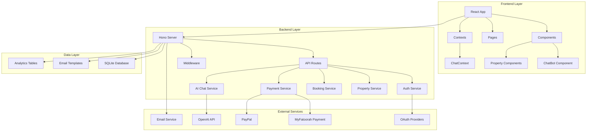
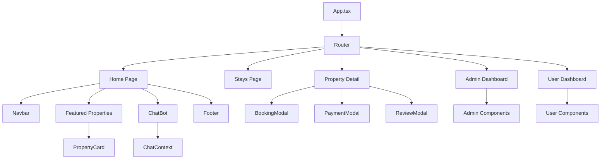
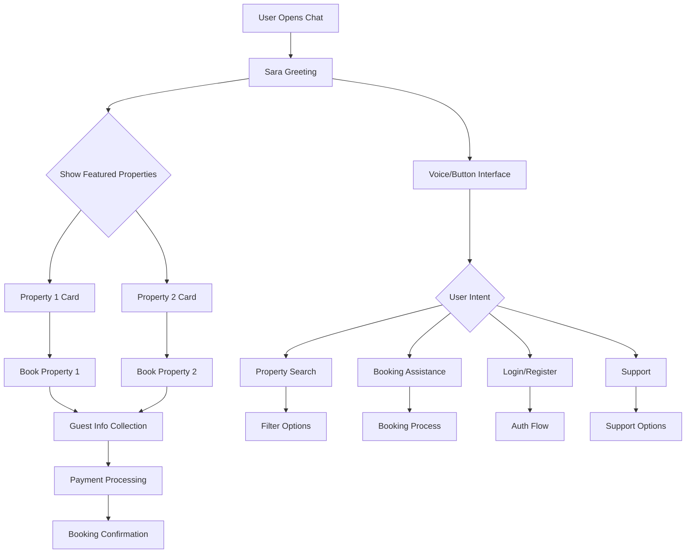
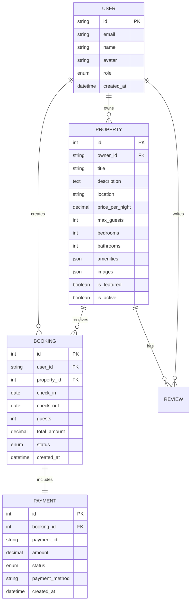
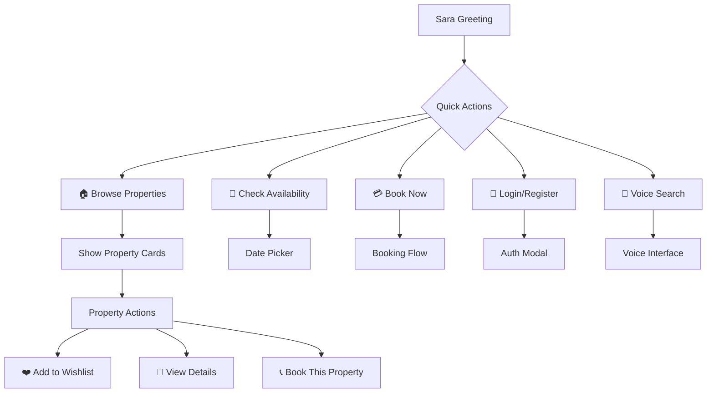
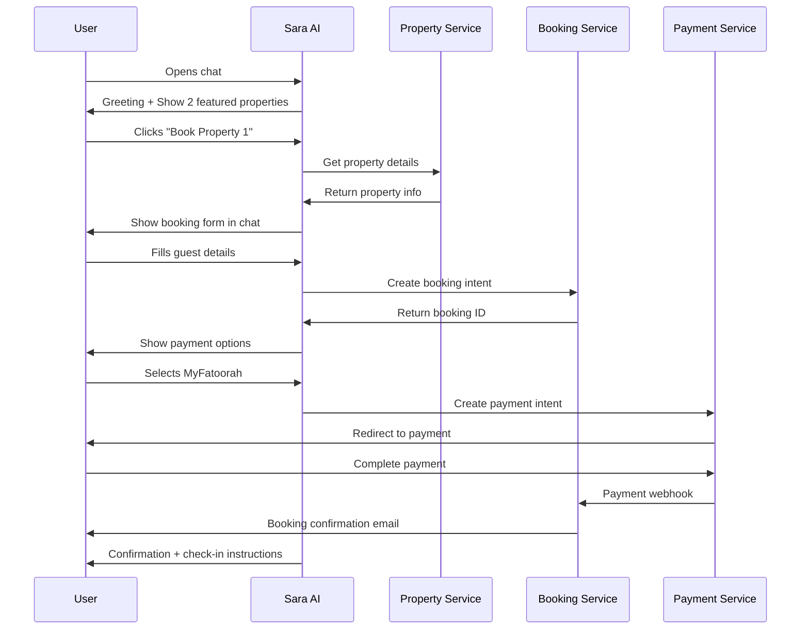
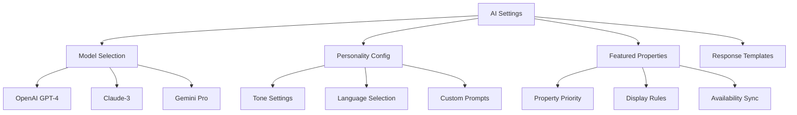
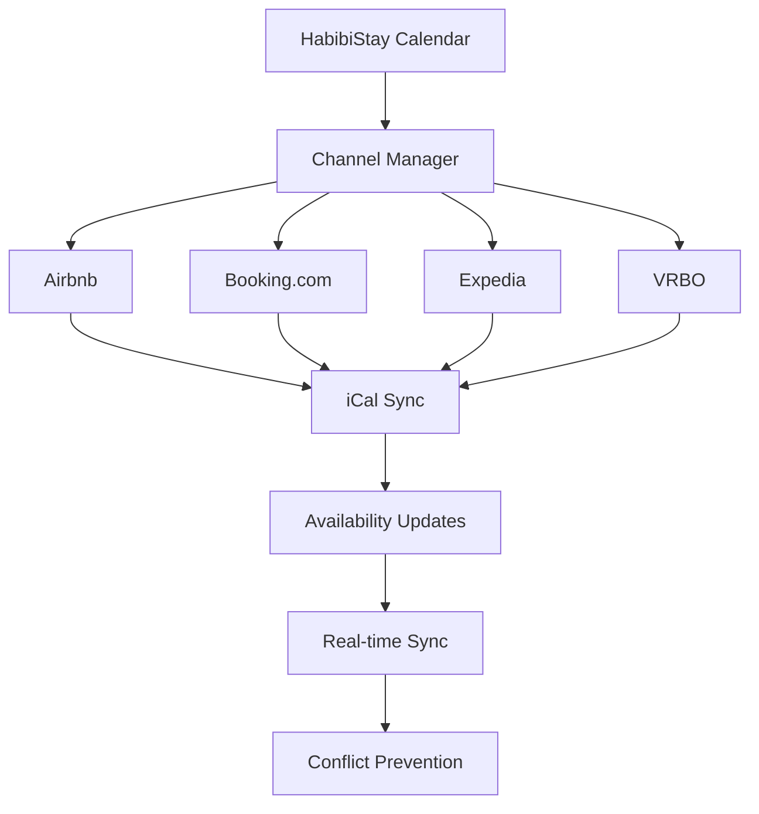
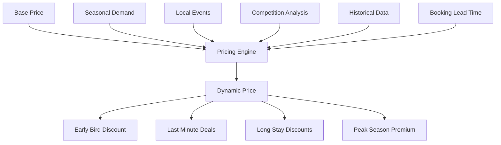

# HabibiStay - Full-Featured Airbnb Clone with AI Chatbot

## Overview

HabibiStay is a tech-forward short-term rental platform with AI-enhanced hosting and investing tools. The platform integrates conversational AI, automated management tools, and real-time dashboards to streamline the guest-host-investor journey while offering transparency and security.

**Core Value Proposition:**
- Proven Returns: Average ROI of 17% annually
- End-to-End Management: Fully automated, hands-off property operations
- AI-Driven Guest Experience: Button and voice-driven chatbot interface
- Diverse Portfolio: From prime tourist zones to emerging locales

**Brand Identity:**
- Primary Color: #2957c3 (Habibi Blue)
- Typography: Modern sans-serif (Inter, Roboto)
- Design Language: Clean, minimal, mobile-first with ample white space

## Technology Stack & Dependencies

**Frontend Stack:**
- React 19.0.0 with TypeScript 5.8.3
- React Router 7.5.3 for navigation
- Tailwind CSS 3.4.17 for styling
- Vite 7.1.3 for build tooling
- Lucide React for icons

**Backend Stack:**
- Hono 4.7.7 on Cloudflare Workers
- Wrangler 4.33.0 for deployment
- Zod 3.24.3 for validation
- OpenAI 5.15.0 for AI integration

**Infrastructure:**
- Cloudflare Workers for serverless backend
- SQLite database with migrations
- React Email for transactional emails

## Architecture

### System Architecture Overview



### Component Architecture

**Core Components Hierarchy:**


### Sara AI Chatbot Architecture

**Chatbot Flow Design:**


## Frontend Architecture

### Component Definition & Hierarchy

**Primary Page Components:**

| Component | Purpose | Key Features |
|-----------|---------|--------------|
| Home.tsx | Landing page | Hero section, featured properties, testimonials |
| Stays.tsx | Property search | Advanced filters, property grid, wishlist |
| PropertyDetail.tsx | Property view | Image gallery, amenities, booking form |
| AdminDashboard.tsx | Admin management | Property CRUD, user management, analytics |
| Dashboard.tsx | User dashboard | Bookings, wishlist, profile management |

**Shared Components:**

| Component | Purpose | Props Interface |
|-----------|---------|-----------------|
| ChatBot.tsx | AI assistant | `isOpen: boolean, messages: ChatMessage[]` |
| PropertyCard.tsx | Property display | `property: Property, showWishlist?: boolean` |
| BookingModal.tsx | Booking flow | `property: Property, onClose: () => void` |
| PaymentModal.tsx | Payment processing | `booking: Booking, onSuccess: () => void` |
| Navbar.tsx | Navigation | `user?: User, isAuthenticated: boolean` |

### State Management Architecture

**Chat Context Implementation:**
```typescript
interface ChatContextType {
  messages: ChatMessage[];
  isOpen: boolean;
  isLoading: boolean;
  addMessage: (message: ChatMessage) => void;
  sendMessage: (content: string) => Promise<void>;
  toggleChat: () => void;
  featuredProperties: Property[];
  showPropertyCard: (propertyId: string) => void;
  initiateBooking: (propertyId: string) => void;
}
```

**Sara AI Integration Flow:**
1. **Initialization**: Sara greets user and displays 2 featured properties
2. **Button Interface**: Provides quick action buttons for common tasks
3. **Voice Interface**: Speech-to-text integration for hands-free interaction
4. **Contextual Responses**: Maintains conversation context for booking flow
5. **Payment Integration**: Embedded MyFatoorah payment within chat

### Routing & Navigation Structure

```mermaid
graph LR
    A[/] --> B[Home]
    A --> C[/stays]
    A --> D[/property/:id]
    A --> E[/admin]
    A --> F[/dashboard]
    A --> G[/about]
    A --> H[/invest]
    A --> I[/owners]
    A --> J[/contact]
    A --> K[/auth/callback]
    
    E --> L[/admin/properties]
    E --> M[/admin/bookings]
    E --> N[/admin/users]
    E --> O[/admin/analytics]
    E --> P[/admin/ai-config]
    
    F --> Q[/dashboard/bookings]
    F --> R[/dashboard/wishlist]
    F --> S[/dashboard/profile]
```

## Backend Architecture

### API Endpoints Reference

**Authentication Endpoints:**
- `GET /api/oauth/google/redirect_url` - Get OAuth redirect URL
- `POST /api/sessions` - Exchange code for session token
- `GET /api/users/me` - Get current user profile
- `GET /api/logout` - Logout user

**Property Management:**
- `GET /api/properties` - Search properties with advanced filters
- `POST /api/properties` - Create new property (Host/Admin)
- `PUT /api/properties/:id` - Update property
- `DELETE /api/properties/:id` - Delete property
- `GET /api/properties/:id` - Get property details
- `GET /api/properties/featured` - Get featured properties for Sara

**Booking System:**
- `POST /api/bookings` - Create booking
- `GET /api/bookings` - Get user bookings
- `PUT /api/bookings/:id` - Update booking status
- `GET /api/bookings/:id` - Get booking details

**AI Chat Integration:**
- `POST /api/chat` - Send message to Sara AI
- `GET /api/chat/config` - Get AI configuration (Admin)
- `PUT /api/chat/config` - Update AI settings (Admin)

**Payment Processing:**
- `POST /api/payments/create` - Create payment intent
- `POST /api/payments/callback` - Payment webhook
- `GET /api/payments/:id` - Get payment status

### Data Models & Database Schema

**Core Entities:**



### Business Logic Layer

**Property Service Architecture:**
```typescript
interface PropertyService {
  searchProperties(filters: PropertySearchFilters): Promise<Property[]>;
  getFeaturedProperties(): Promise<Property[]>;
  createProperty(data: CreatePropertyData): Promise<Property>;
  updateProperty(id: string, data: UpdatePropertyData): Promise<Property>;
  deleteProperty(id: string): Promise<void>;
  trackPropertyView(propertyId: string): Promise<void>;
}
```

**Booking Service Architecture:**
```typescript
interface BookingService {
  createBooking(data: CreateBookingData): Promise<Booking>;
  processPayment(bookingId: string, paymentData: PaymentData): Promise<Payment>;
  confirmBooking(bookingId: string): Promise<void>;
  cancelBooking(bookingId: string): Promise<void>;
  sendConfirmationEmail(booking: Booking): Promise<void>;
}
```

**Sara AI Service Architecture:**
```typescript
interface SaraAIService {
  processMessage(message: string, context: ChatContext): Promise<AIResponse>;
  generatePropertyRecommendations(userPreferences: UserPreferences): Promise<Property[]>;
  handleBookingFlow(intent: BookingIntent, context: ChatContext): Promise<BookingResponse>;
  configureAIModel(config: AIConfig): Promise<void>;
}
```

### Middleware & Interceptors

**Authentication Middleware:**
- JWT token validation
- User session management
- Role-based access control

**Request Validation:**
- Zod schema validation
- Input sanitization
- Rate limiting

**Error Handling:**
- Centralized error logging
- User-friendly error responses
- Performance monitoring

## AI Integration Layer

### Sara Chatbot Implementation

**AI Model Configuration:**
```typescript
interface AIConfig {
  model: 'gpt-4' | 'gpt-3.5-turbo' | 'claude-3' | 'gemini-pro';
  temperature: number;
  maxTokens: number;
  systemPrompt: string;
  personality: 'professional' | 'friendly' | 'casual';
  language: string;
}
```

**Button-Driven Interface Design:**


**Voice Interface Integration:**
- Web Speech API for voice input
- Text-to-speech for Sara responses
- Noise cancellation and voice recognition
- Multi-language support

### Featured Properties Display

**Sara's Property Showcase:**
```typescript
interface FeaturedPropertyCard {
  id: string;
  title: string;
  location: string;
  pricePerNight: number;
  images: string[];
  amenities: string[];
  rating: number;
  quickBookButton: boolean;
  wishlistButton: boolean;
}
```

**Dynamic Property Selection:**
- Admin-configured featured properties
- AI-driven personalization based on user preferences
- Real-time availability checking
- Price optimization display

## User Experience Flows

### Guest Booking Journey



### Admin Dashboard Workflow

**Property Management:**
- Drag-and-drop image upload
- Rich text editor for descriptions
- Amenity selection with icons
- Pricing calendar with dynamic rates
- Availability calendar management

**AI Configuration Panel:**


### Host Onboarding Flow

**Step-by-Step Process:**
1. **Identity Verification**: Document upload and verification
2. **Property Details**: Location, description, amenities
3. **Photo Upload**: High-quality image requirements
4. **Pricing Setup**: Base rates and seasonal adjustments
5. **Availability Calendar**: Block unavailable dates
6. **Bank Details**: Payout configuration
7. **Channel Manager**: Connect external platforms

## Advanced Features

### Channel Manager Integration

**Multi-Platform Synchronization:**


**Sync Configuration:**
- Automated iCal imports/exports
- Real-time availability updates
- Price synchronization rules
- Booking conflict resolution

### Financial Reporting System

**Investor Dashboard Metrics:**
```typescript
interface InvestorMetrics {
  totalROI: number;
  annualizedReturn: number;
  netOperatingIncome: number;
  occupancyRate: number;
  averageDailyRate: number;
  revenuePrediction: MonthlyRevenue[];
  expenseBreakdown: ExpenseCategory[];
  payoutHistory: PayoutRecord[];
}
```

**Report Generation:**
- PDF export functionality
- Customizable date ranges
- Property-wise breakdown
- Automated monthly reports
- Real-time dashboard updates

### Dynamic Pricing Engine

**Pricing Factors:**


## Testing Strategy

### Unit Testing Framework

**Component Testing:**
- React Testing Library for component tests
- Jest for utility function testing
- Mock Service Worker for API mocking
- Snapshot testing for UI consistency

**Backend Testing:**
- Hono testing utilities
- Database transaction testing
- API endpoint validation
- Mock external services (OpenAI, payment gateways)

**AI Integration Testing:**
- Conversation flow testing
- Response quality validation
- Fallback scenario testing
- Performance benchmarking

### End-to-End Testing

**Critical User Journeys:**
1. Complete booking flow through Sara AI
2. Property search and filtering
3. Admin property management
4. Payment processing workflows
5. Multi-device responsive testing

**Accessibility Testing:**
- Screen reader compatibility
- Keyboard navigation
- Color contrast validation
- Voice interface accessibility

## Security & Performance

### Security Measures

**Authentication & Authorization:**
- OAuth 2.0 with Google/Facebook
- JWT token management
- Role-based access control
- Session security and timeout

**Data Protection:**
- Input validation and sanitization
- SQL injection prevention
- XSS protection
- CSRF token implementation
- PII data encryption

**Payment Security:**
- PCI DSS compliance
- Secure payment tokenization
- SSL/TLS encryption
- Fraud detection integration

### Performance Optimization

**Frontend Optimization:**
- React.lazy() for code splitting
- Image optimization and CDN
- Critical CSS inlining
- Service worker for caching

**Backend Optimization:**
- Database query optimization
- Redis caching for frequent queries
- Cloudflare Workers edge computing
- API response compression

**AI Performance:**
- Response caching for common queries
- Streaming responses for long conversations
- Model optimization for speed
- Fallback mechanisms for high load

## Deployment Architecture

### Infrastructure Setup

**Cloudflare Workers Configuration:**
```yaml
Environment Variables:
  - OPENAI_API_KEY
  - MYFATOORAH_API_KEY
  - MYFATOORAH_API_URL
  - MOCHA_USERS_SERVICE_API_URL
  - MOCHA_USERS_SERVICE_API_KEY
  - DATABASE_URL
  - EMAIL_SERVICE_API_KEY

Bindings:
  - DB: SQLite Database
  - KV: Key-Value Store for caching
  - R2: Object storage for images
```

**Development Workflow:**
```bash
# Development
npm run dev

# Type generation
npm run cf-typegen

# Build and deploy
npm run build
wrangler deploy

# Database migrations
npm run migrate
```

### Monitoring & Analytics

**Application Monitoring:**
- Cloudflare Analytics for performance
- Error tracking and logging
- User behavior analytics
- A/B testing framework

**Business Metrics:**
- Booking conversion rates
- Sara AI interaction success
- Property view to booking ratio
- User retention and churn

This comprehensive design provides a scalable foundation for HabibiStay's evolution into a leading short-term rental platform with innovative AI-driven guest experiences and robust host management tools.