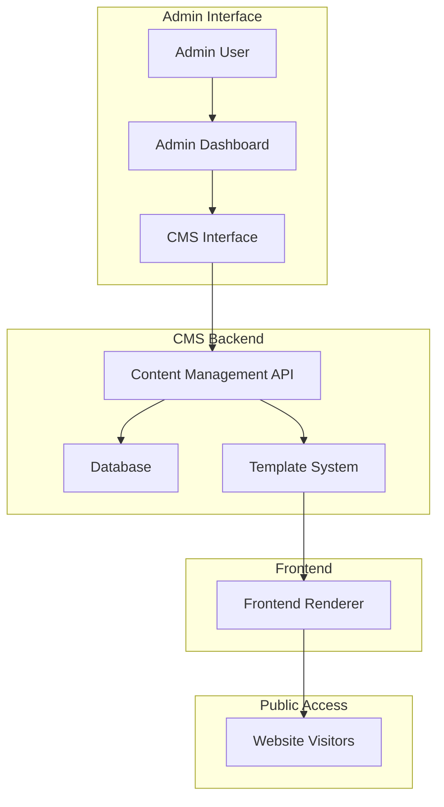

# CMS Implementation for Frontend Editing

## Overview

This document outlines the design for implementing a comprehensive Content Management System (CMS) for the HabibiStay platform that enables administrators to have full control over frontend content editing with zero coding requirements. The CMS will provide a visual interface for managing all aspects of the website content, including property listings, pages, templates, and user-generated content. Additionally, the CMS will include AI-powered content creation and editing capabilities that integrate with leading AI providers.

## Key Features

- Visual content management with drag-and-drop editing
- Prebuilt templates for rapid site development
- AI content creation and editing with multiple provider support
- Zero coding required for content updates
- Responsive design controls
- User permission management
- Content versioning and rollback capabilities

## Architecture

The CMS implementation will follow a component-based architecture with the following key layers:

1. **Admin Interface Layer**: Visual editing tools and content management dashboard
2. **Content Management Layer**: APIs for content creation, modification, and versioning
3. **Template System Layer**: Prebuilt templates and layout management
4. **Data Persistence Layer**: Database storage for content and configuration
5. **Frontend Rendering Layer**: Dynamic content rendering on the client side



## Component Architecture

### 1. Admin Dashboard Components

#### CMS Dashboard
- Central hub for all content management activities
- Navigation to different content sections
- Content overview and quick actions
- System status and analytics

#### Visual Editor
- WYSIWYG editor for page content
- Drag-and-drop component placement
- Real-time preview functionality
- Content versioning and rollback

#### Template Manager
- Prebuilt template selection and customization
- Template creation and modification
- Layout management and responsive design controls

#### Content Library
- Media management (images, videos, documents)
- Reusable content blocks
- Asset organization and tagging

#### AI Content Maker
- Multi-provider AI integration (OpenAI, Claude, Gemini, OpenRouter)
- Automatic model selection based on task
- Content generation and editing tools
- Prompt engineering interface
- AI-generated content history and refinement

### 2. Frontend Components

#### Dynamic Content Renderer
- Runtime content rendering based on CMS data
- Template inheritance and composition
- Responsive content adaptation

#### Editable Regions
- Marked sections of pages that can be edited
- Contextual editing controls
- Permission-based access control

## Technology Stack & Dependencies

### Frontend Technologies
- **React 19**: Component-based UI framework
- **Tailwind CSS**: Utility-first CSS framework for styling
- **React Router v7**: Navigation and routing
- **Lucide React**: Icon library for UI elements
- **Zod**: Validation library for form data

### Backend Technologies
- **Hono**: Lightweight backend framework for Cloudflare Workers
- **Cloudflare Workers**: Serverless deployment platform
- **SQLite**: Database for content storage
- **Zod**: Schema validation for API endpoints

### CMS-Specific Libraries
- **Draft.js** or **Slate.js**: Rich text editing capabilities
- **React DnD**: Drag-and-drop functionality
- **React Hook Form**: Form management and validation
- **Framer Motion**: Animation and transition effects

### AI Integration Libraries
- **OpenAI SDK**: Official SDK for OpenAI integration
- **Anthropic SDK**: Official SDK for Claude integration
- **Google Generative AI**: SDK for Gemini integration
- **OpenRouter Client**: Client library for OpenRouter integration

## Template System

### Prebuilt Templates

#### Property Listing Templates
- Grid view with filtering options
- List view with detailed information
- Map-based visualization
- Featured property highlighting

#### Page Templates
- Home page with hero section
- About page with company information
- Contact page with form and map
- Blog listing and detail pages

#### Component Templates
- Property cards with various styles
- Testimonial sections
- Call-to-action blocks
- Image galleries

### Template Customization Features

#### Visual Customization
- Color scheme selection and customization
- Typography controls (font family, size, spacing)
- Layout adjustments (grid columns, spacing)
- Component styling options

#### Content Structure
- Dynamic content areas
- Conditional content display
- Content personalization rules
- A/B testing capabilities

#### AI-Enhanced Templates
- AI content placeholders in templates
- Smart content suggestions
- Automated content personalization
- AI-powered layout optimization

## Content Management Features

### 1. Page Management

#### Page Creation
- Template selection wizard
- SEO metadata configuration
- URL routing setup
- Publication scheduling

#### Page Editing
- Visual content editor
- Component library integration
- Real-time collaboration
- Content version history

### 2. Property Management

#### Property Listing Management
- Bulk property import/export
- Property status controls
- Featured property designation
- Availability calendar integration

#### Property Detail Customization
- Section ordering and visibility
- Custom field management
- Image gallery configuration
- Amenities display options

### 3. User-Generated Content

#### Review Management
- Review moderation workflow
- Rating aggregation and display
- Review response system
- Spam detection and filtering

#### Blog Content Management
- Article creation and editing
- Category and tag management
- Author attribution
- Publication workflow

### 4. AI Content Creation and Editing

#### Multi-Provider AI Integration
- OpenAI GPT models (GPT-3.5, GPT-4, GPT-4 Turbo)
- Anthropic Claude models (Claude 2, Claude Instant, Claude 3)
- Google Gemini models (Gemini Pro, Gemini Ultra)
- OpenRouter models (mix of providers and models)
- Automatic model fetching and selection based on task requirements

#### AI Content Generation Tools
- Text content generation for pages and articles
- Property description enhancement
- SEO optimization suggestions
- Content summarization and rewriting
- Multilingual content generation

#### AI Editing Assistant
- Grammar and style checking
- Tone adjustment and consistency
- Content expansion and condensation
- Plagiarism detection and avoidance
- Readability analysis and improvement

## Visual Editing Interface

### Drag-and-Drop Editor

#### Component Library
- Prebuilt UI components (buttons, cards, forms)
- Custom component integration
- Third-party widget support
- Component preview thumbnails

#### Layout Canvas
- Grid-based layout system
- Responsive breakpoint controls
- Alignment and spacing tools
- Layer management

### Real-Time Preview

#### Device Simulation
- Desktop, tablet, and mobile views
- Orientation switching
- Custom device dimensions
- Touch interaction simulation

#### Live Updates
- Instant content rendering
- Style application preview
- Performance metrics display
- Accessibility checking

#### AI Content Preview
- Real-time AI-generated content display
- Model performance comparison
- Quality scoring and suggestions
- Content variation previews

## Data Models

### Content Models

#### Page Model
```typescript
interface Page {
  id: string;
  title: string;
  slug: string;
  template: string;
  content: Record<string, any>;
  metadata: {
    seoTitle: string;
    seoDescription: string;
    openGraphImage: string;
  };
  status: 'draft' | 'published' | 'archived';
  createdAt: string;
  updatedAt: string;
  publishedAt: string;
}
```

#### Template Model
```typescript
interface Template {
  id: string;
  name: string;
  description: string;
  category: string;
  contentStructure: Record<string, any>;
  previewImage: string;
  isDefault: boolean;
}
```

#### Component Model
```typescript
interface Component {
  id: string;
  type: string;
  name: string;
  properties: Record<string, any>;
  styles: Record<string, any>;
}
```

### User Models

#### Admin User Model
```typescript
interface AdminUser {
  id: string;
  email: string;
  name: string;
  role: 'admin' | 'editor' | 'author';
  permissions: string[];
  lastLogin: string;
}
```

#### Content Version Model
```typescript
interface ContentVersion {
  id: string;
  contentId: string;
  contentType: string;
  data: Record<string, any>;
  createdBy: string;
  createdAt: string;
  comment: string;
}
```

#### AI Provider Models
```typescript
interface AIProvider {
  id: string;
  name: string;
  apiKey: string;
  apiUrl: string;
  enabled: boolean;
  defaultModel: string;
  models: AIModel[];
}

interface AIModel {
  id: string;
  name: string;
  providerId: string;
  capabilities: string[];
  maxTokens: number;
  pricing: number;
  performance: number;
}
```

#### AI Content Generation Models
```typescript
interface AIContentJob {
  id: string;
  providerId: string;
  modelId: string;
  prompt: string;
  content: string;
  status: "pending" | "processing" | "completed" | "failed";
  createdAt: string;
  completedAt: string;
  metadata: Record<string, any>;
}

interface AIContentHistory {
  id: string;
  jobId: string;
  content: string;
  version: number;
  createdAt: string;
  createdBy: string;
}
```

## API Endpoints Reference

### Content Management Endpoints

#### Pages
- `GET /api/cms/pages` - List all pages
- `GET /api/cms/pages/:id` - Get specific page
- `POST /api/cms/pages` - Create new page
- `PUT /api/cms/pages/:id` - Update page
- `DELETE /api/cms/pages/:id` - Delete page
- `POST /api/cms/pages/:id/publish` - Publish page

#### Templates
- `GET /api/cms/templates` - List all templates
- `GET /api/cms/templates/:id` - Get specific template
- `POST /api/cms/templates` - Create new template
- `PUT /api/cms/templates/:id` - Update template

#### Components
- `GET /api/cms/components` - List all components
- `POST /api/cms/components` - Create new component
- `PUT /api/cms/components/:id` - Update component

### Media Management Endpoints
- `POST /api/cms/media` - Upload media asset
- `GET /api/cms/media` - List media assets
- `DELETE /api/cms/media/:id` - Delete media asset

### User Management Endpoints
- `GET /api/cms/users` - List admin users
- `POST /api/cms/users` - Create admin user
- `PUT /api/cms/users/:id` - Update admin user

### AI Content Management Endpoints
- `GET /api/cms/ai/providers` - List all AI providers
- `POST /api/cms/ai/providers` - Add new AI provider
- `PUT /api/cms/ai/providers/:id` - Update AI provider
- `DELETE /api/cms/ai/providers/:id` - Remove AI provider
- `GET /api/cms/ai/providers/:id/models` - List models for a provider
- `POST /api/cms/ai/providers/:id/models/refresh` - Refresh models from provider
- `POST /api/cms/ai/generate` - Generate content using AI
- `GET /api/cms/ai/jobs` - List content generation jobs
- `GET /api/cms/ai/jobs/:id` - Get specific content generation job
- `GET /api/cms/ai/history` - List AI content history
- `GET /api/cms/ai/history/:id` - Get specific AI content history

## AI Model Selection and Configuration

### Automatic Model Fetching
- Dynamic model discovery from provider APIs
- Automatic capability detection
- Performance benchmarking
- Cost analysis and optimization

### Intelligent Model Selection
- Task-based model recommendation
- Performance-to-price ratio optimization
- Fallback model configuration
- Regional model availability

## Security Considerations

### Authentication & Authorization
- Role-based access control (RBAC)
- JWT token validation
- Session management
- Two-factor authentication support

### Content Security
- Input sanitization and validation
- XSS protection
- CSRF protection
- Content moderation workflows

### Data Protection
- Database encryption
- Backup and recovery procedures
- Audit logging
- GDPR compliance features

## Performance Optimization

### Caching Strategy
- Content caching with TTL
- Template compilation caching
- Asset delivery optimization
- CDN integration

### Loading Strategies
- Lazy loading for non-critical content
- Progressive enhancement
- Critical path optimization
- Preloading and prefetching

## Testing Strategy

### Unit Tests
- Component rendering tests
- API endpoint validation
- Business logic verification
- Data model validation

### Integration Tests
- CMS workflow testing
- Template rendering validation
- Content publishing workflows
- User permission checks

### End-to-End Tests
- Visual editing workflows
- Content publishing processes
- Template customization flows
- User management scenarios

## Deployment Architecture

### Development Environment
- Local CMS development server
- Template preview environment
- Content staging area
- Version control integration

### Production Deployment
- Cloudflare Workers deployment
- Database migration scripts
- Content synchronization processes
- Monitoring and alerting setup

## Implementation Roadmap

### Phase 1: Core CMS Infrastructure (Weeks 1-2)
- Admin dashboard integration
- Basic content management APIs
- Template system foundation
- Database schema implementation

### Phase 2: Visual Editing Features (Weeks 3-4)
- Drag-and-drop editor implementation
- Component library development
- Real-time preview functionality
- Content versioning system

### Phase 3: Template System & Prebuilt Components (Weeks 5-6)
- Prebuilt template creation
- Custom component development
- Layout management tools
- Responsive design controls

### Phase 4: AI Content Creation Features (Week 7)
- AI provider integration (OpenAI, Claude, Gemini, OpenRouter)
- Automatic model fetching and selection
- Content generation and editing tools
- AI content history and refinement

### Phase 5: Advanced Features & Optimization (Week 8)
- Collaboration features
- Performance optimization
- Security hardening
- Testing and quality assurance

## Success Metrics

### Usability Metrics
- Time to create/edit content
- User satisfaction scores
- Training time reduction
- Error rate in content creation

### Performance Metrics
- Page load times
- API response times
- Database query performance
- Cache hit ratios

### Business Metrics
- Content update frequency
- User engagement with new content
- Conversion rate improvements
- Administrator productivity gains

### AI Content Metrics
- AI-generated content adoption rate
- Time saved through AI assistance
- Content quality scores
- Model performance comparison
- Cost per content generation