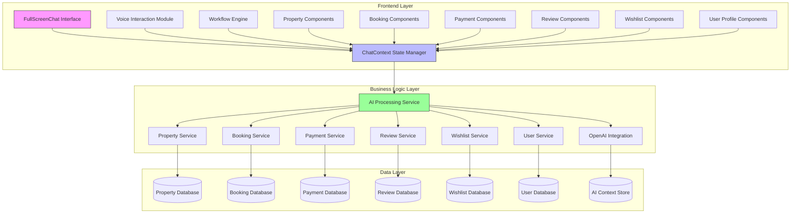

# Feature Enhancement: Full-Screen Sara AI Assistant

## Overview

This document outlines the design for enhancing the Sara AI assistant to provide a full-screen experience similar to ChatGPT, enabling users to perform all operations including property listings, bookings, and payments directly through the AI interface. The enhancement will transform Sara from a supplementary chat tool into a comprehensive platform interface that can handle end-to-end user interactions.

The new full-screen experience will:
- Provide an immersive ChatGPT-like interface for all platform interactions
- Enable voice-first operations for bookings, payments, and property searches
- Support complex multi-step workflows with visual progress indicators
- Integrate all existing platform functionality into conversational flows
- Maintain context across sessions for seamless user experiences
- Offer personalized recommendations based on user history and preferences
- Provide real-time assistance throughout the user journey

## Architecture

### Current Architecture
The current Sara AI assistant follows a client-server architecture with:
- Frontend React component (`ChatBot.tsx`) rendering the chat interface
- Context management (`ChatContext.tsx`) handling state and business logic
- Backend API endpoint (`/api/chat/enhanced`) processing requests with OpenAI integration
- Local storage for conversation persistence

### Enhanced Architecture
The enhanced architecture will maintain the existing foundation but extend capabilities to:
- Provide a full-screen interface mode
- Integrate deeply with all platform services (bookings, payments, property listings)
- Enable voice-first interactions for all operations
- Support complex workflows through state management



## Component Architecture

### Enhanced Chat Interface
The enhanced interface will include:
1. **FullScreenChat Component** - Primary interface replacing current ChatBot
2. **Responsive Layout System** - Adapts to both sidebar and full-screen modes
3. **Workflow Navigation** - Step-by-step guidance for complex operations
4. **Context-Aware UI Elements** - Dynamic components based on conversation state
5. **Quick Action Bar** - Direct access to common operations (search, book, pay)
6. **Voice Command Interface** - Dedicated voice interaction controls
7. **History Panel** - Access to previous conversations and actions

### State Management
The enhanced state management will extend the current ChatContext to include:
1. **Global Application State** - Beyond chat messages to include user workflows
2. **Service Integration States** - Booking, payment, and property search states
3. **Voice Interaction States** - Comprehensive voice command handling
4. **Multi-Step Workflow Tracking** - Complex operation progress management
5. **User Preference Storage** - Personalization settings and defaults
6. **Session Context** - Current operation context and history
7. **Error States** - Handling and recovery from service failures

### AI Processing Enhancement
The AI processing will be enhanced to:
1. **Understand Complex Intent** - Recognize booking, payment, and listing requests
2. **Generate Structured Responses** - Provide actionable data for UI components
3. **Maintain Extended Context** - Track multi-step operations across sessions
4. **Support Voice Commands** - Process natural language for all operations
5. **Integrate Service Data** - Access property, booking, and payment information
6. **Execute Platform Actions** - Directly trigger platform operations
7. **Provide Personalized Responses** - Use user history and preferences

## API Integration Layer

### Enhanced Chat API
The `/api/chat/enhanced` endpoint will be extended to:
- Process complex user intents beyond simple chat
- Integrate with booking, payment, and property services
- Return structured data for UI rendering
- Handle multi-step workflow coordination
- Execute platform actions directly
- Manage user preferences and history

### Service Integration Endpoints
Additional endpoints to support full functionality:
- `/api/chat/workflow` - Manage multi-step operations
- `/api/chat/actions` - Execute specific platform actions
- `/api/chat/context` - Manage extended conversation context
- `/api/chat/preferences` - Manage user preferences
- `/api/chat/history` - Access conversation history
- `/api/chat/execute` - Direct service execution

## Data Models

### Extended Chat Models
```typescript
interface ExtendedChatMessage extends ChatMessage {
  workflow?: WorkflowState;
  actionMetadata?: ActionMetadata;
  serviceData?: ServiceData;
  timestamp: string;
  messageId: string;
}

interface WorkflowState {
  id: string;
  type: 'booking' | 'payment' | 'listing' | 'search' | 'review' | 'wishlist' | 'profile';
  step: string;
  data: Record<string, any>;
  status: 'active' | 'completed' | 'cancelled' | 'pending';
  createdAt: string;
  updatedAt: string;
}

interface ActionMetadata {
  type: string;
  service: 'property' | 'booking' | 'payment' | 'review' | 'wishlist' | 'user';
  entityId?: number;
  action: string;
  timestamp: string;
}
```

### Service Data Models
```typescript
interface ServiceData {
  property?: Property;
  booking?: Booking;
  payment?: Payment;
  searchResults?: Property[];
  userProfile?: User;
  wishlist?: Property[];
  reviews?: Review[];
}

interface UserPreferences {
  language: string;
  currency: string;
  notificationPreferences: Record<string, boolean>;
  accessibilitySettings: Record<string, any>;
  defaultSearchLocation: string;
}
```

## Business Logic Layer

### Workflow Management
The enhanced system will implement workflow management for:
1. **Property Search Workflow** - Guided property discovery
2. **Booking Workflow** - End-to-end reservation process
3. **Payment Workflow** - Secure transaction handling
4. **Property Management Workflow** - For host operations
5. **Review Workflow** - Submit and manage property reviews
6. **Wishlist Workflow** - Manage favorite properties
7. **User Profile Workflow** - Update account information
8. **Property Listing Workflow** - For hosts to list new properties
9. **Reservation Management Workflow** - For users to manage bookings
10. **Payment History Workflow** - For users to view transaction history

### Service Integration Logic
Each service will be integrated through:
1. **Property Service Integration** - Search, filter, and display properties
2. **Booking Service Integration** - Create and manage reservations
3. **Payment Service Integration** - Process transactions securely
4. **User Service Integration** - Manage profiles and preferences
5. **Review Service Integration** - Handle property reviews
6. **Wishlist Service Integration** - Manage favorite properties
7. **Notification Service Integration** - Send alerts and updates
8. **Email Service Integration** - Send confirmation and notification emails
9. **Analytics Service Integration** - Track user interactions and behavior
10. **Content Management Integration** - Manage dynamic content and messaging

## UI/UX Design

### Full-Screen Interface
The new interface will feature:
1. **Sidebar Navigation** - Quick access to different functions
2. **Main Chat Area** - Conversation with Sara
3. **Context Panel** - Dynamic display of relevant information
4. **Action Bar** - Quick access to common operations
5. **Workflow Progress Indicator** - Visual representation of multi-step processes
6. **Service Status Panel** - Real-time status of operations
7. **Personalization Hub** - User preferences and history

### Responsive Design
The interface will adapt to:
1. **Desktop Full-Screen Mode** - Primary interface for comprehensive operations
2. **Mobile Responsive Mode** - Optimized touch interactions
3. **Tablet Adaptive Mode** - Balanced layout for medium screens
4. **Split View Mode** - Chat and service view side-by-side

### Voice Interaction System
Enhanced voice capabilities will include:
1. **Continuous Voice Listening** - Always-ready voice input
2. **Natural Language Processing** - Understanding complex commands
3. **Voice Feedback** - Audible responses for all operations
4. **Voice-Guided Workflows** - Step-by-step voice assistance
5. **Multi-Language Support** - Support for different languages
6. **Voice Command Shortcuts** - Quick access to common operations
7. **Noise Cancellation** - Improved accuracy in noisy environments

## State Management

### Extended State Structure
```typescript
interface ExtendedChatState {
  // Existing chat state
  messages: ExtendedChatMessage[];
  isOpen: boolean;
  isLoading: boolean;
  conversationId: string | null;
  
  // New enhanced state
  fullscreenMode: boolean;
  currentWorkflow: WorkflowState | null;
  serviceData: ServiceData;
  userPreferences: UserPreferences;
  voiceEnabled: boolean;
  isListening: boolean;
  history: ChatHistory[];
  notifications: Notification[];
  activeService: 'property' | 'booking' | 'payment' | 'review' | 'wishlist' | 'user' | null;
  connectionStatus: 'online' | 'offline' | 'connecting';
  lastActivity: string;
}
```

### State Transitions
The enhanced system will manage complex state transitions:
1. **Chat to Workflow** - Transition from conversation to structured operations
2. **Workflow Progression** - Move between steps in multi-step processes
3. **Service Integration** - Coordinate between different platform services
4. **Context Preservation** - Maintain state across sessions
5. **Error Recovery** - Handle service failures gracefully
6. **User Interruption** - Manage workflow interruptions
7. **Session Resumption** - Resume previous sessions seamlessly
8. **Concurrent Operations** - Handle multiple simultaneous workflows
9. **State Validation** - Ensure data consistency across transitions

## Middleware & Interceptors

### Request Processing Middleware
Enhanced middleware will:
1. **Parse Complex Intents** - Identify service-specific requests
2. **Validate User Context** - Ensure appropriate permissions
3. **Route to Services** - Direct requests to appropriate handlers
4. **Log Interactions** - Track usage for improvement
5. **Enforce Rate Limits** - Prevent service abuse
6. **Validate Data** - Ensure data integrity
7. **Detect User Emotion** - Analyze sentiment in requests
8. **Apply Personalization** - Customize responses based on user history

### Response Processing
Response handling will:
1. **Structure Data** - Format service responses for UI rendering
2. **Generate UI Components** - Create actionable interface elements
3. **Maintain Context** - Update conversation state appropriately
4. **Handle Errors** - Provide graceful error recovery
5. **Cache Responses** - Improve performance for repeated requests
6. **Update Analytics** - Track user interactions
7. **Format for Voice** - Optimize responses for speech synthesis
8. **Apply Branding** - Ensure consistent messaging and tone

## Security Considerations

### Authentication & Authorization
The enhanced system will:
1. **Maintain Session Security** - Secure user authentication throughout workflows
2. **Validate Service Access** - Ensure appropriate permissions for operations
3. **Protect Sensitive Data** - Encrypt personal and payment information
4. **Implement Rate Limiting** - Prevent abuse of AI and service resources
5. **Enforce Multi-Factor Authentication** - For sensitive operations
6. **Audit All Actions** - Track user interactions for security
7. **Implement Zero-Knowledge Architecture** - Minimize data exposure
8. **Secure Voice Data** - Protect voice recordings and transcripts

### Data Privacy
Privacy measures will include:
1. **Contextual Data Handling** - Only share necessary information with AI
2. **Conversation Encryption** - Protect chat history and personal data
3. **Compliance Adherence** - Follow data protection regulations
4. **User Control** - Allow users to manage their data and preferences
5. **Data Minimization** - Collect only necessary information
6. **Automatic Data Expiration** - Remove old conversation data
7. **Consent Management** - Obtain proper permissions for data usage
8. **Privacy by Design** - Embed privacy considerations in all components

## Performance Considerations

### Response Optimization
Performance enhancements will:
1. **Cache Frequently Accessed Data** - Reduce database queries
2. **Optimize AI Prompts** - Efficient context management
3. **Implement Lazy Loading** - Load components as needed
4. **Use Service Workers** - Cache API responses for faster access
5. **Preload Common Workflows** - Anticipate user needs
6. **Compress Data Transfer** - Reduce network overhead
7. **Implement Predictive Loading** - Preload likely next steps
8. **Optimize Voice Processing** - Reduce latency in speech recognition

### Scalability
The system will be designed to:
1. **Handle Concurrent Users** - Support multiple simultaneous workflows
2. **Distribute Workloads** - Balance processing across services
3. **Scale Independently** - Allow individual service scaling
4. **Monitor Performance** - Track and optimize system performance
5. **Implement Load Balancing** - Distribute user requests
6. **Use Content Delivery Networks** - Improve global access speed
7. **Support Horizontal Scaling** - Add resources as demand increases
8. **Implement Microservices Architecture** - Enable independent scaling

## Testing Strategy

### Unit Testing
Unit tests will cover:
1. **Component Functionality** - Individual UI component behavior
2. **State Management** - Chat context and workflow state transitions
3. **Service Integration** - Communication with backend services
4. **Voice Processing** - Speech recognition and synthesis
5. **Security Functions** - Authentication and data protection
6. **Performance Metrics** - Response times and resource usage
7. **Error Handling** - Graceful recovery from failures
8. **Data Validation** - Input and output data integrity

### Integration Testing
Integration tests will verify:
1. **API Communication** - End-to-end request/response handling
2. **Service Coordination** - Multi-service workflow execution
3. **Data Consistency** - State synchronization across components
4. **Error Handling** - Graceful degradation under failure conditions
5. **Cross-Service Transactions** - Complex multi-step operations
6. **Load Testing** - Performance under stress conditions
7. **Security Testing** - Vulnerability and penetration testing
8. **Compatibility Testing** - Cross-browser and cross-device support

### User Experience Testing
UX testing will focus on:
1. **Interface Usability** - Ease of navigation and operation
2. **Voice Interaction** - Accuracy and responsiveness of voice commands
3. **Workflow Efficiency** - Time to complete common tasks
4. **Accessibility** - Support for users with disabilities
5. **Mobile Responsiveness** - Functionality across devices
6. **User Satisfaction** - Overall experience metrics
7. **Task Completion Rates** - Success in completing user goals
8. **Voice Command Accuracy** - Recognition accuracy across languages

## Implementation Plan

### Phase 1: Interface Enhancement (Weeks 1-2)
1. Develop full-screen chat interface component
2. Implement responsive layout system
3. Create context-aware UI elements
4. Add sidebar navigation
5. Implement workflow progress indicators
6. Add quick action bar
7. Implement history and preferences panels
8. Add connection status indicators

### Phase 2: Workflow Integration (Weeks 3-4)
1. Extend chat context with workflow management
2. Integrate property search functionality
3. Implement booking workflow
4. Add payment processing
5. Integrate review and wishlist functionality
6. Add user profile management
7. Implement property listing workflow
8. Add reservation management

### Phase 3: Voice Enhancement (Weeks 5-6)
1. Improve voice recognition accuracy
2. Implement continuous listening mode
3. Add voice-guided workflows
4. Enhance text-to-speech capabilities
5. Add multi-language support
6. Implement voice command shortcuts
7. Add emotion detection in voice
8. Implement noise cancellation

### Phase 4: Optimization & Testing (Weeks 7-8)
1. Performance optimization
2. Security hardening
3. Comprehensive testing
4. User experience refinement
5. Accessibility improvements
6. Documentation and deployment
7. A/B testing of interface designs
8. Performance benchmarking

## Conclusion

This enhancement will transform Sara from a simple chat assistant into a comprehensive platform interface that can handle all user operations through natural language interactions. The full-screen experience will provide users with a ChatGPT-like interface while maintaining deep integration with the HabibiStay platform's core services.

Key benefits of this enhancement include:
- **Unified Interface**: Single interface for all platform operations
- **Voice-First Experience**: Natural language interactions for all operations
- **Contextual Awareness**: Deep integration with all platform services
- **Workflow Guidance**: Step-by-step assistance for complex operations
- **Personalization**: Tailored experiences based on user preferences
- **Accessibility**: Support for users with different abilities and preferences
- **Efficiency**: Faster completion of common tasks
- **Consistency**: Uniform experience across all platform functions