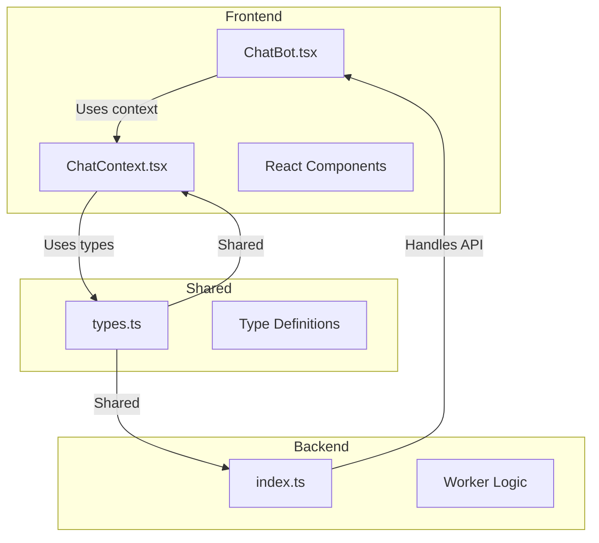
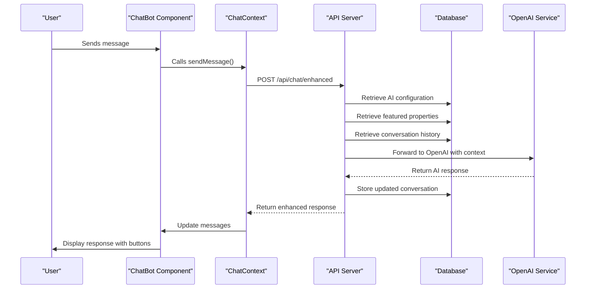
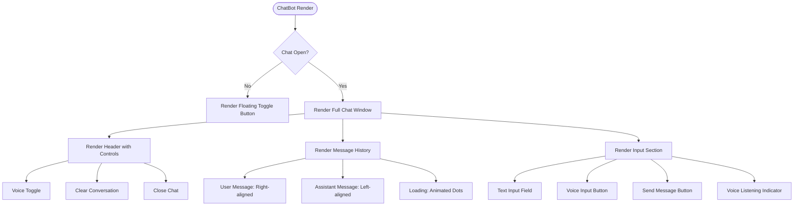
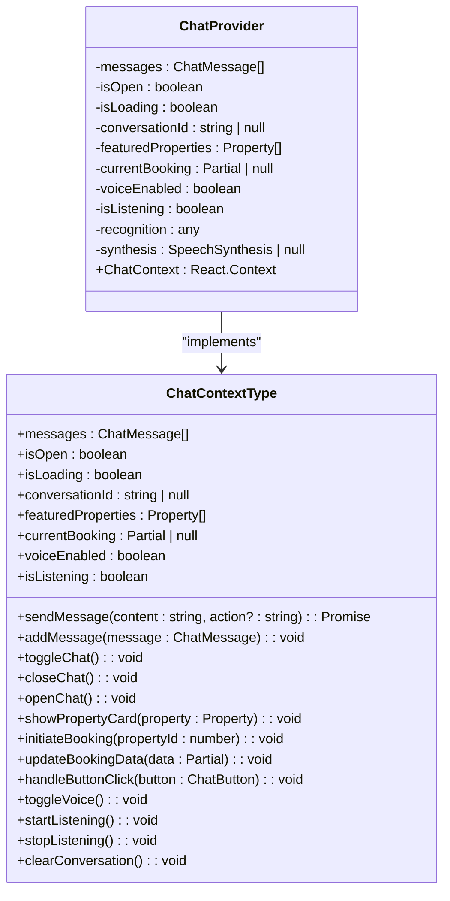
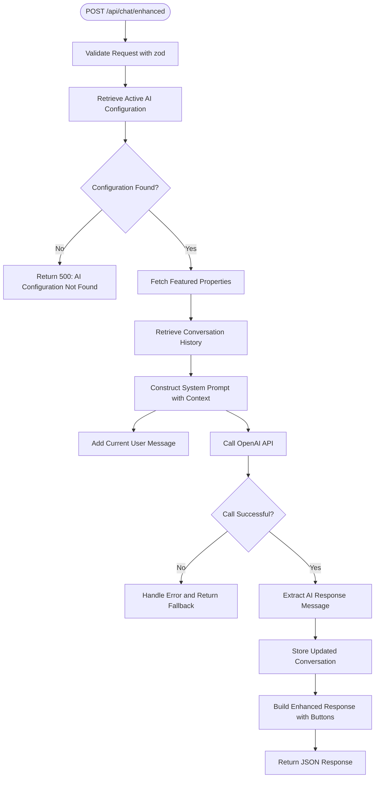

# AI Chatbot API

<cite>
**Referenced Files in This Document**   
- [index.ts](file://src/worker/index.ts#L1500-L1798)
- [ChatBot.tsx](file://src/react-app/components/ChatBot.tsx#L0-L452)
- [ChatContext.tsx](file://src/react-app/contexts/ChatContext.tsx#L0-L453)
- [types.ts](file://src/shared/types.ts#L100-L299)
</cite>

## Table of Contents
1. [Introduction](#introduction)
2. [Project Structure](#project-structure)
3. [Core Components](#core-components)
4. [Architecture Overview](#architecture-overview)
5. [Detailed Component Analysis](#detailed-component-analysis)
6. [Request Validation and Schema](#request-validation-and-schema)
7. [Conversation History Management](#conversation-history-management)
8. [Prompt Engineering and AI Configuration](#prompt-engineering-and-ai-configuration)
9. [Response Schema and Interactive Elements](#response-schema-and-interactive-elements)
10. [Rate Limiting and Fallback Mechanisms](#rate-limiting-and-fallback-mechanisms)
11. [Security Considerations](#security-considerations)
12. [Usage Example](#usage-example)
13. [Conclusion](#conclusion)

## Introduction
The AI Chatbot API provides an intelligent conversational interface for users to interact with HabibiStay's property booking system. Powered by OpenAI's GPT-4o-mini model, the chatbot offers real-time assistance for property discovery, availability checking, and booking guidance. This document details the implementation of the `/api/chat/enhanced` endpoint, which handles user messages with session management, context awareness, and streaming responses. The system integrates frontend components with backend AI processing, maintaining conversation history in database storage and providing interactive response elements to enhance user experience.

## Project Structure
The AI chatbot functionality is distributed across three main directories in the project structure: `src/react-app` for frontend components, `src/worker` for backend logic, and `src/shared` for common types. The frontend implementation resides in React components that manage the chat interface and state, while the backend runs in a worker environment handling API requests and AI integration. Shared type definitions ensure consistency between client and server.



**Diagram sources**
- [ChatBot.tsx](file://src/react-app/components/ChatBot.tsx#L0-L452)
- [ChatContext.tsx](file://src/react-app/contexts/ChatContext.tsx#L0-L453)
- [index.ts](file://src/worker/index.ts#L1500-L1798)
- [types.ts](file://src/shared/types.ts#L100-L299)

**Section sources**
- [ChatBot.tsx](file://src/react-app/components/ChatBot.tsx#L0-L452)
- [ChatContext.tsx](file://src/react-app/contexts/ChatContext.tsx#L0-L453)
- [index.ts](file://src/worker/index.ts#L1500-L1798)
- [types.ts](file://src/shared/types.ts#L100-L299)

## Core Components
The AI chatbot system consists of three core components: the frontend ChatBot component that renders the user interface, the ChatContext that manages application state and business logic, and the backend worker that processes requests and interfaces with the AI service. These components work together to provide a seamless conversational experience, with the frontend handling user interaction, the context managing state across sessions, and the backend orchestrating AI responses with property data context.

**Section sources**
- [ChatBot.tsx](file://src/react-app/components/ChatBot.tsx#L0-L452)
- [ChatContext.tsx](file://src/react-app/contexts/ChatContext.tsx#L0-L453)
- [index.ts](file://src/worker/index.ts#L1500-L1798)

## Architecture Overview
The AI chatbot architecture follows a client-server pattern with React frontend components communicating with a worker-based backend API. The system maintains conversation state both client-side in localStorage and server-side in a database, ensuring continuity across sessions. When a user sends a message, the frontend submits it to the `/api/chat/enhanced` endpoint, which retrieves the current AI configuration, constructs a prompt with conversation history and property context, and forwards the request to OpenAI. The response is enriched with interactive elements before being returned to the client.



**Diagram sources**
- [ChatBot.tsx](file://src/react-app/components/ChatBot.tsx#L0-L452)
- [ChatContext.tsx](file://src/react-app/contexts/ChatContext.tsx#L0-L453)
- [index.ts](file://src/worker/index.ts#L1500-L1798)

## Detailed Component Analysis

### Frontend Implementation
The frontend implementation consists of the ChatBot component that renders the chat interface and the ChatContext that manages state and business logic. The ChatBot component displays messages, input fields, and interactive buttons, while the ChatContext handles communication with the backend and maintains conversation state.

#### ChatBot Component Analysis
The ChatBot component renders a floating chat window that can be toggled open and closed. It displays conversation messages with different styling for user and assistant messages, and provides an input field for sending new messages. The component also supports voice input through browser speech recognition APIs.



**Diagram sources**
- [ChatBot.tsx](file://src/react-app/components/ChatBot.tsx#L0-L452)

**Section sources**
- [ChatBot.tsx](file://src/react-app/components/ChatBot.tsx#L0-L452)

### State Management
The ChatContext provides a comprehensive state management solution for the chatbot functionality, handling everything from message storage to voice interaction.

#### ChatContext Analysis
The ChatContext manages all aspects of the chatbot state, including messages, conversation ID, loading status, and voice features. It provides methods for sending messages, handling button clicks, and managing voice input/output. The context also handles local storage persistence of conversation state.



**Diagram sources**
- [ChatContext.tsx](file://src/react-app/contexts/ChatContext.tsx#L0-L453)

**Section sources**
- [ChatContext.tsx](file://src/react-app/contexts/ChatContext.tsx#L0-L453)

### Backend Implementation
The backend implementation in the worker handles the `/api/chat/enhanced` endpoint, processing incoming messages and generating AI-powered responses with contextual information.

#### Enhanced Chat Endpoint Analysis
The enhanced chat endpoint receives user messages, retrieves the current AI configuration, fetches relevant property data, and constructs a comprehensive prompt for the AI service. The endpoint manages conversation history by storing and retrieving messages from the database.



**Diagram sources**
- [index.ts](file://src/worker/index.ts#L1500-L1798)

**Section sources**
- [index.ts](file://src/worker/index.ts#L1500-L1798)

## Request Validation and Schema
The chatbot API uses Zod for request validation, ensuring that incoming messages conform to the expected structure. The validation schema is defined in the shared types file and imported by the backend endpoint.

### Request Schema Definition
The ChatRequestSchema defines the structure of requests to the chat endpoint, requiring a message string and optionally accepting a conversation_id for maintaining conversation context across sessions.

```typescript
export const ChatRequestSchema = z.object({
  message: z.string(),
  conversation_id: z.string().optional(),
});
```

The schema ensures that the message field is present and is a string, while the conversation_id is optional and must be a string if provided. This allows new conversations to be initiated without a session identifier, while existing conversations can be continued by providing the appropriate conversation_id.

**Section sources**
- [types.ts](file://src/shared/types.ts#L108-L111)

## Conversation History Management
The system maintains conversation history both client-side and server-side to ensure continuity and persistence across sessions.

### Client-Side Storage
The ChatContext uses localStorage to persist conversation state, storing messages, conversation ID, and a timestamp. When the chat is opened, the context checks for saved state and restores the conversation if it's still valid (within 30 minutes of the last activity).

```typescript
const STORAGE_KEY = 'habibistay_chat_state';
const CONVERSATION_TIMEOUT = 30 * 60 * 1000; // 30 minutes
```

This client-side storage ensures that users don't lose their conversation context when navigating away from the page or refreshing.

### Server-Side Storage
The backend stores conversation history in the database using the chat_conversations table. Each conversation is identified by a session_id and contains the message history (excluding the system prompt for privacy).

```typescript
await c.env.DB.prepare(`
  INSERT OR REPLACE INTO chat_conversations (session_id, messages, is_active, updated_at)
  VALUES (?, ?, 1, CURRENT_TIMESTAMP)
`).bind(sessionId, JSON.stringify(messages.slice(1))).run();
```

The server generates a new session_id if none is provided, creating a new conversation. This allows for both anonymous and authenticated chat sessions.

**Section sources**
- [ChatContext.tsx](file://src/react-app/contexts/ChatContext.tsx#L0-L453)
- [index.ts](file://src/worker/index.ts#L1500-L1798)

## Prompt Engineering and AI Configuration
The system uses dynamic prompt engineering to provide contextually relevant responses, incorporating property information and configurable AI personality traits.

### Dynamic System Prompt
The backend constructs a system prompt that includes the current AI configuration, such as personality type and custom instructions, along with information about featured properties. This allows the AI to provide specific recommendations based on available inventory.

```typescript
const defaultSystemPrompt = `You are Sara, a ${config.personality} and helpful AI assistant for HabibiStay, a premium short-term rental platform in Riyadh, Saudi Arabia.

Your role is to help guests discover and book exceptional accommodations. You should:
- Be ${config.personality === 'professional' ? 'professional and formal' : config.personality === 'friendly' ? 'warm, friendly, and welcoming' : 'casual and conversational'}
- Focus on the guest experience and finding perfect stays
- Help with property search, booking questions, and local recommendations
- Always provide helpful, accurate information about our properties and services
- Use interactive buttons when possible to minimize text input
- Guide users through the booking process within the chat interface

Featured properties available:
${featuredProperties.map((p: any) => `- ${p.title} in ${p.location}: ${p.description || 'Luxury accommodation'} - ${p.price_per_night} SAR/night (Max ${p.max_guests} guests)`).join('\n')}

Always aim to create an exceptional guest experience while maintaining our brand values of trust, excellence, and shared growth.`;
```

### AI Configuration Management
The system allows administrators to configure the AI's behavior through the AI configuration system, which stores settings such as model provider, model name, temperature, and custom system prompts. This enables non-technical users to adjust the AI's personality and behavior without code changes.

**Section sources**
- [index.ts](file://src/worker/index.ts#L1500-L1798)

## Response Schema and Interactive Elements
The chatbot returns structured responses that include not only text content but also interactive elements to guide user interaction.

### Response Structure
The API returns a standardized response format with success status, optional error messages, and data containing the AI response.

```typescript
return c.json<ApiResponse>({
  success: true,
  data: response,
});
```

The response data includes the message text, conversation ID, action buttons, and featured properties.

### Interactive Buttons
The system enhances AI responses with interactive buttons that allow users to take actions without typing. These buttons appear in the chat interface and trigger specific actions when clicked.

```typescript
buttons: [
  { id: 'search_properties', text: '🏠 Browse Properties', action: 'search', style: 'primary' },
  { id: 'check_availability', text: '📅 Check Availability', action: 'availability', style: 'secondary' },
  { id: 'book_now', text: '💳 Book Now', action: 'book', style: 'success' },
  { id: 'get_support', text: '💬 Get Support', action: 'support', style: 'secondary' },
],
```

These buttons improve usability by providing clear action paths and reducing the need for free-text input.

**Section sources**
- [index.ts](file://src/worker/index.ts#L1500-L1798)
- [ChatBot.tsx](file://src/react-app/components/ChatBot.tsx#L0-L452)

## Rate Limiting and Fallback Mechanisms
The system implements client-side loading states and error handling to manage API response times and failures.

### Loading States
The frontend displays a loading indicator when waiting for AI responses, providing visual feedback to users.

```typescript
{isLoading && (
  <div className="flex justify-start">
    <div className="bg-gray-100 text-gray-800 p-3 rounded-lg rounded-bl-none text-sm">
      <div className="flex space-x-1">
        <div className="w-2 h-2 bg-gray-400 rounded-full animate-bounce"></div>
        <div className="w-2 h-2 bg-gray-400 rounded-full animate-bounce" style={{ animationDelay: '0.1s' }}></div>
        <div className="w-2 h-2 bg-gray-400 rounded-full animate-bounce" style={{ animationDelay: '0.2s' }}></div>
      </div>
    </div>
  </div>
)}
```

### Error Handling
When the AI service is unavailable, the system provides a fallback response with retry options and support contact.

```typescript
const errorMessage: ChatMessage = {
  role: 'assistant',
  content: "I'm sorry, I'm having trouble connecting right now. Please try again in a moment.",
  timestamp: new Date().toISOString(),
  metadata: {
    error: true,
    buttons: [
      { id: 'retry', text: '🔄 Retry', action: 'retry', style: 'primary' },
      { id: 'contact_support', text: '📞 Contact Support', action: 'contact', style: 'secondary' },
    ],
  },
};
```

This ensures that users always receive a response, even when the AI service is temporarily unavailable.

**Section sources**
- [ChatContext.tsx](file://src/react-app/contexts/ChatContext.tsx#L0-L453)

## Security Considerations
The system implements several security measures to protect user data in chat logs.

### Data Minimization
The system only stores necessary conversation data, excluding the system prompt from database storage to prevent leakage of configuration details.

```typescript
// Skip system message when storing
messages.slice(1)
```

### Input Validation
All incoming requests are validated using Zod schemas to prevent malformed data from being processed.

### Context Isolation
Conversation history is isolated by session_id, preventing cross-conversation data leakage.

### Secure Storage
Client-side conversation state is stored in localStorage with a timeout mechanism to automatically clear old conversations.

**Section sources**
- [index.ts](file://src/worker/index.ts#L1500-L1798)
- [ChatContext.tsx](file://src/react-app/contexts/ChatContext.tsx#L0-L453)

## Usage Example
The following example demonstrates how to initiate a chat about property availability using curl:

```bash
curl -X POST https://api.habibistay.com/api/chat/enhanced \
  -H "Content-Type: application/json" \
  -d '{
    "message": "I want to check availability for a property in Riyadh next weekend",
    "conversation_id": "session_12345"
  }'
```

The response would include not only a text response about availability checking but also interactive buttons to facilitate the booking process:

```json
{
  "success": true,
  "data": {
    "message": "I can help you check availability for properties in Riyadh. Could you please specify your check-in and check-out dates?",
    "conversation_id": "session_12345",
    "buttons": [
      {
        "id": "check_availability",
        "text": "📅 Check Availability",
        "action": "availability",
        "style": "secondary"
      },
      {
        "id": "search_properties",
        "text": "🏠 Browse Properties",
        "action": "search",
        "style": "primary"
      }
    ],
    "featured_properties": [
      {
        "id": 1,
        "title": "Modern Apartment in Diplomatic Quarter",
        "location": "Diplomatic Quarter, Riyadh",
        "price_per_night": 800,
        "bedrooms": 2,
        "bathrooms": 2,
        "max_guests": 4,
        "images": ["https://example.com/image1.jpg"],
        "amenities": ["wifi", "parking", "pool"],
        "average_rating": 4.8
      }
    ]
  }
}
```

**Section sources**
- [index.ts](file://src/worker/index.ts#L1500-L1798)

## Conclusion
The AI Chatbot API provides a robust, user-friendly interface for property discovery and booking assistance. By integrating OpenAI's GPT-4o-mini with contextual property data and interactive elements, the system offers a conversational experience that guides users through the booking process. The architecture effectively separates concerns between frontend and backend components, with thoughtful state management and error handling. Security considerations are addressed through data minimization and input validation, while the extensible design allows for future enhancements to the AI's capabilities and personality.