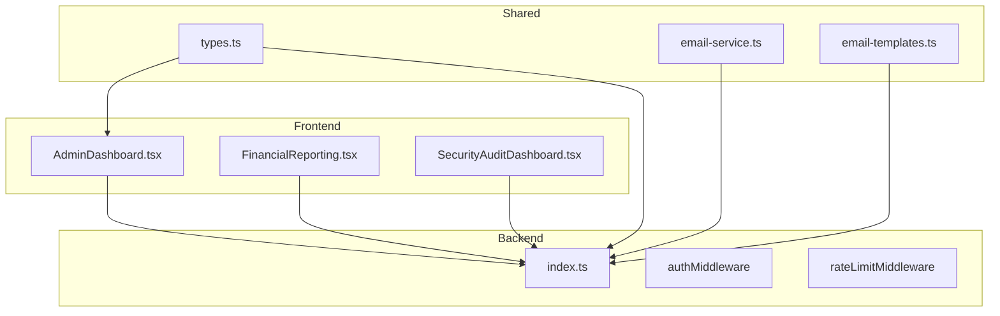
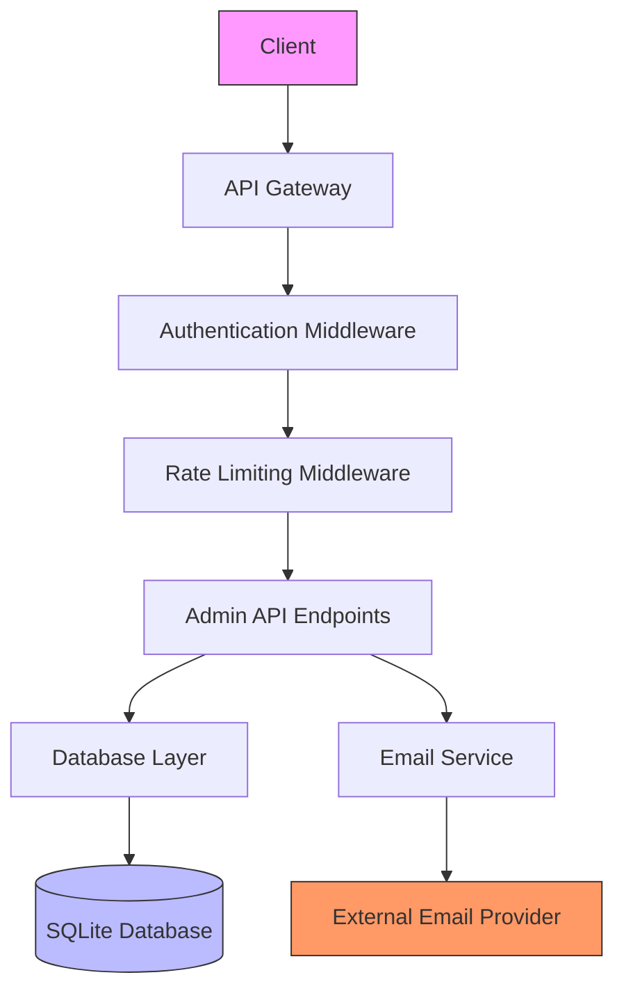
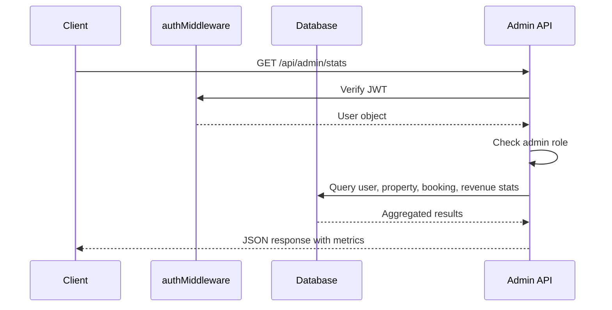
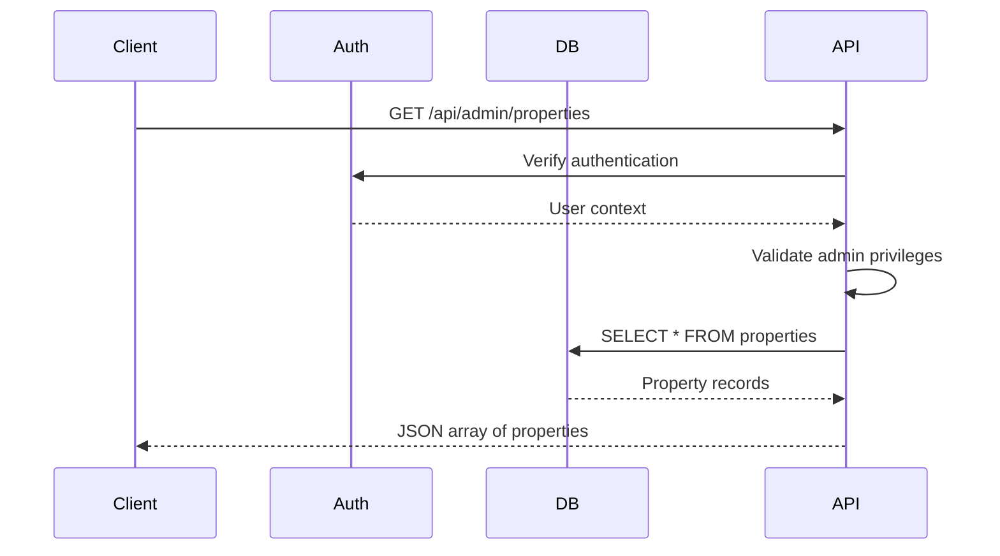
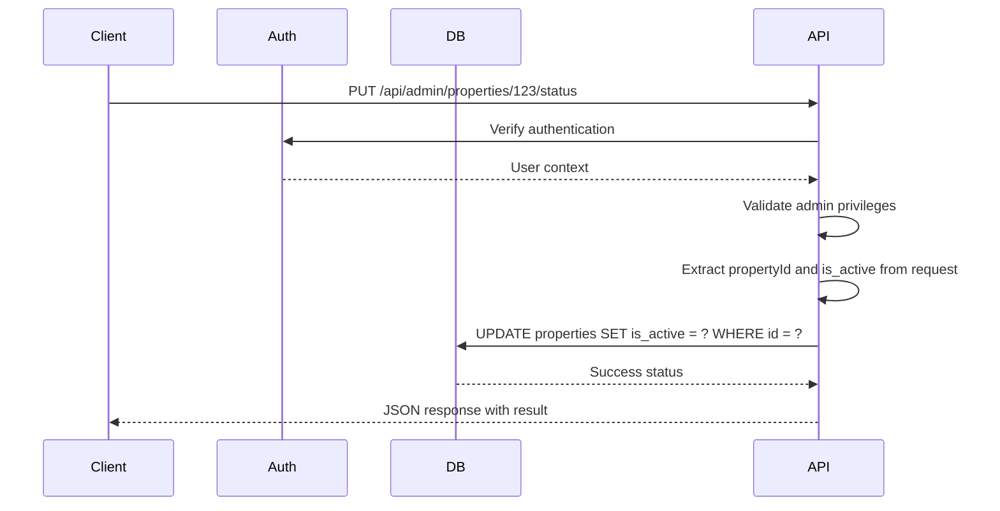
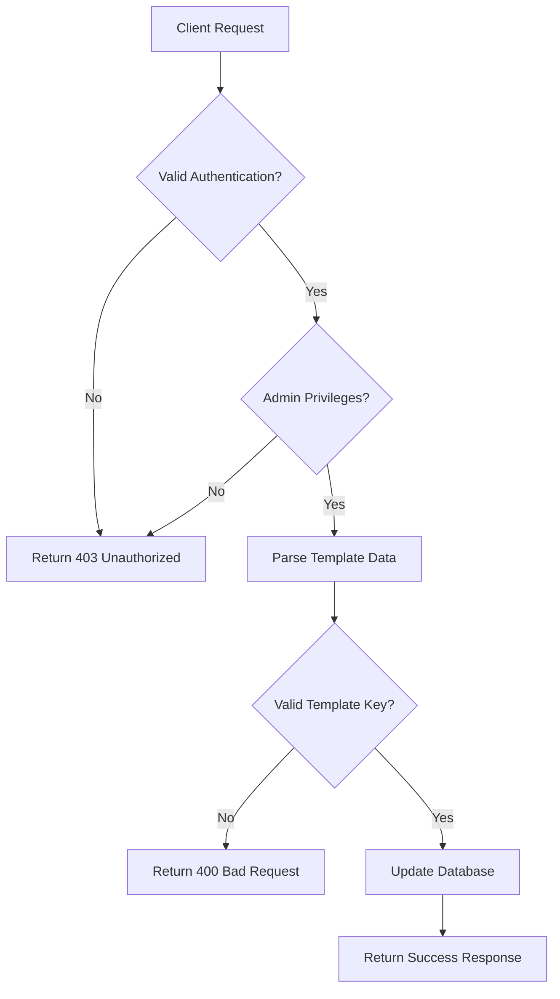
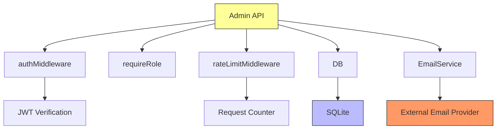

# Admin Dashboard API

<cite>
**Referenced Files in This Document**   
- [AdminDashboard.tsx](file://src/react-app/pages/AdminDashboard.tsx)
- [index.ts](file://src/worker/index.ts)
- [email-service.ts](file://src/shared/email-service.ts)
- [email-templates.ts](file://src/shared/email-templates.ts)
- [types.ts](file://src/shared/types.ts)
- [api-endpoints.test.ts](file://src/test/api-endpoints.test.ts)
</cite>

## Table of Contents
1. [Introduction](#introduction)
2. [Project Structure](#project-structure)
3. [Core Components](#core-components)
4. [Architecture Overview](#architecture-overview)
5. [Detailed Component Analysis](#detailed-component-analysis)
6. [Dependency Analysis](#dependency-analysis)
7. [Performance Considerations](#performance-considerations)
8. [Troubleshooting Guide](#troubleshooting-guide)
9. [Conclusion](#conclusion)

## Introduction
The Admin Dashboard API provides a secure interface for administrative users to monitor platform metrics, manage property listings, oversee bookings, and configure email templates. This document details the implementation and usage of key administrative endpoints, including authentication requirements, response schemas, and error handling mechanisms. The system is built using a serverless architecture with Cloudflare Workers handling API requests, SQLite for data persistence, and React for the frontend interface.

## Project Structure
The project follows a modular structure with clear separation between frontend, shared utilities, and backend logic. The admin functionality is distributed across multiple components and services, with the core API logic residing in the worker module.

**Diagram sources**
- [AdminDashboard.tsx](file://src/react-app/pages/AdminDashboard.tsx)
- [index.ts](file://src/worker/index.ts)
- [email-service.ts](file://src/shared/email-service.ts)

**Section sources**
- [AdminDashboard.tsx](file://src/react-app/pages/AdminDashboard.tsx)
- [index.ts](file://src/worker/index.ts)

## Core Components
The Admin Dashboard API consists of several core components that work together to provide administrative functionality. These include authentication middleware, rate limiting, database operations, and email template management. The system uses a combination of JWT-based authentication and role-based access control to ensure only authorized users can access sensitive endpoints.

**Section sources**
- [index.ts](file://src/worker/index.ts#L845-L1044)
- [email-service.ts](file://src/shared/email-service.ts#L0-L200)

## Architecture Overview
The Admin Dashboard API follows a serverless architecture pattern with Cloudflare Workers serving as the backend. The system implements a layered approach with middleware handling authentication and rate limiting before requests reach the business logic layer. Data is stored in a SQLite database with structured tables for properties, bookings, and email templates.

**Diagram sources**
- [index.ts](file://src/worker/index.ts)
- [email-service.ts](file://src/shared/email-service.ts)

## Detailed Component Analysis

### Admin API Endpoints
The Admin Dashboard API provides several endpoints for retrieving platform metrics and managing content. These endpoints are protected by authentication and rate limiting middleware to ensure security and performance.

#### GET /api/admin/stats
Retrieves platform-wide metrics including user counts, property statistics, booking information, and revenue data.

**Diagram sources**
- [index.ts](file://src/worker/index.ts#L845-L877)

**Section sources**
- [index.ts](file://src/worker/index.ts#L845-L877)
- [AdminDashboard.tsx](file://src/react-app/pages/AdminDashboard.tsx#L49-L85)

#### GET /api/admin/properties
Retrieves all property listings for moderation and management purposes.

**Diagram sources**
- [index.ts](file://src/worker/index.ts#L879-L900)

**Section sources**
- [index.ts](file://src/worker/index.ts#L879-L900)
- [AdminDashboard.tsx](file://src/react-app/pages/AdminDashboard.tsx#L60-L63)

#### PUT /api/admin/properties/:propertyId/status
Updates the approval status of a property listing (approve/reject).

**Diagram sources**
- [index.ts](file://src/worker/index.ts#L917-L963)
- [AdminDashboard.tsx](file://src/react-app/pages/AdminDashboard.tsx#L87-L100)

**Section sources**
- [index.ts](file://src/worker/index.ts#L917-L963)
- [AdminDashboard.tsx](file://src/react-app/pages/AdminDashboard.tsx#L87-L100)

#### POST /api/admin/email-templates
Creates or updates email templates used for platform communications.

**Diagram sources**
- [index.ts](file://src/worker/index.ts#L1253-L1313)
- [email-service.ts](file://src/shared/email-service.ts)

**Section sources**
- [index.ts](file://src/worker/index.ts#L1253-L1313)
- [email-service.ts](file://src/shared/email-service.ts#L0-L200)

## Dependency Analysis
The Admin Dashboard API has several key dependencies that enable its functionality. These include authentication middleware, database access, and email services.

**Diagram sources**
- [index.ts](file://src/worker/index.ts)
- [email-service.ts](file://src/shared/email-service.ts)

**Section sources**
- [index.ts](file://src/worker/index.ts#L845-L1044)
- [email-service.ts](file://src/shared/email-service.ts#L0-L200)

## Performance Considerations
The Admin Dashboard API implements several performance optimizations to ensure responsiveness and scalability:

- **Rate Limiting**: Admin endpoints are rate-limited to 100 requests per minute to prevent abuse
- **Database Indexing**: Critical database tables are indexed on frequently queried fields
- **Batch Operations**: Related data queries are batched to minimize database round trips
- **Caching**: Frequently accessed data could be cached in production (not shown in current implementation)

The system uses Promise.all() to parallelize related database queries, reducing overall response time for endpoints like /api/admin/stats that require multiple data points.

## Troubleshooting Guide
Common issues and their solutions for the Admin Dashboard API:

**Section sources**
- [index.ts](file://src/worker/index.ts#L845-L1044)
- [api-endpoints.test.ts](file://src/test/api-endpoints.test.ts#L418-L469)

### Unauthorized Access (403)
**Symptoms**: Requests return 403 status with "Unauthorized" message
**Causes**: 
- Missing or invalid JWT token
- User lacks admin privileges
- Email does not contain 'admin' or 'owner' (current implementation limitation)

**Solutions**:
1. Ensure valid JWT token is included in Authorization header
2. Verify user has admin role in system
3. Use admin or owner email account for testing

### Rate Limiting (429)
**Symptoms**: Requests return 429 status with "Too many requests" message
**Causes**: Exceeding 100 requests per minute threshold
**Solutions**:
1. Implement request throttling in client code
2. Increase rate limit window if legitimate high-volume usage
3. Cache responses to reduce API calls

### Database Connection Issues
**Symptoms**: 500 errors with database-related messages
**Causes**: 
- Database unavailable
- Query syntax errors
- Connection pool exhaustion

**Solutions**:
1. Verify database service is running
2. Check query syntax and parameter binding
3. Implement connection retry logic

## Conclusion
The Admin Dashboard API provides a comprehensive set of tools for platform administrators to manage content, monitor performance, and configure system settings. The implementation follows security best practices with authentication, authorization, and rate limiting. The system is designed for scalability with efficient database queries and a modular architecture. Future enhancements could include more sophisticated role-based access control, enhanced caching mechanisms, and improved error logging.