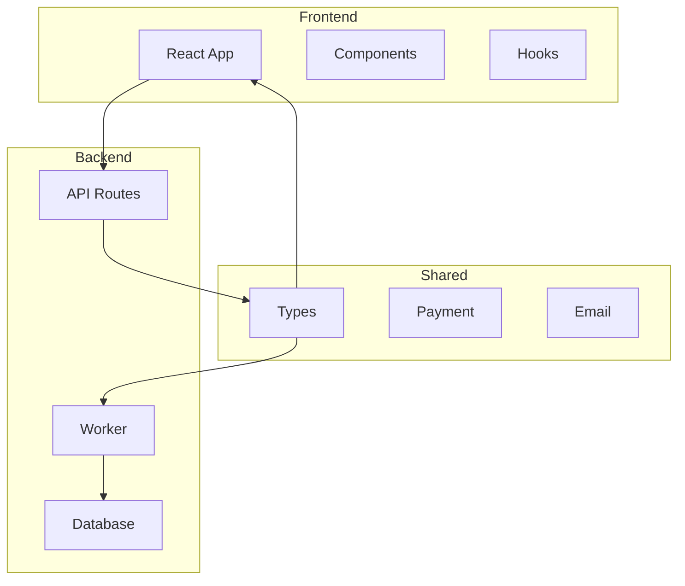
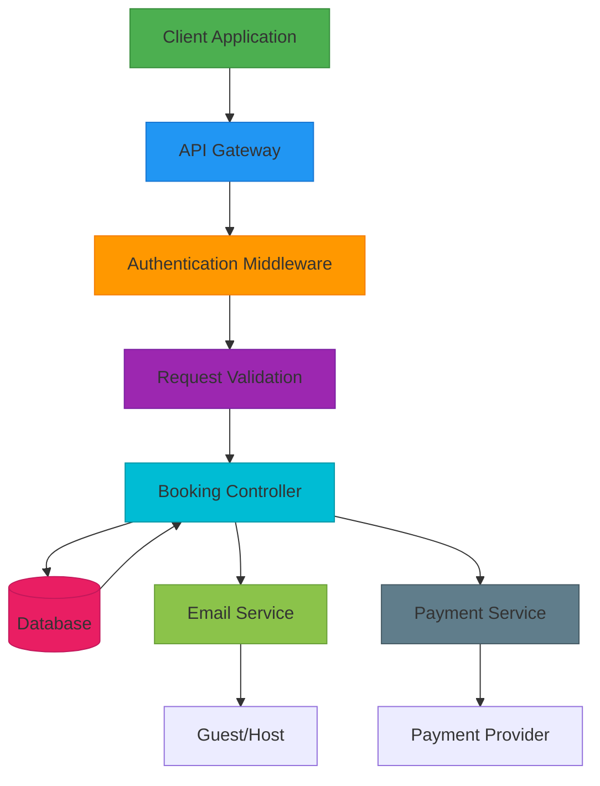
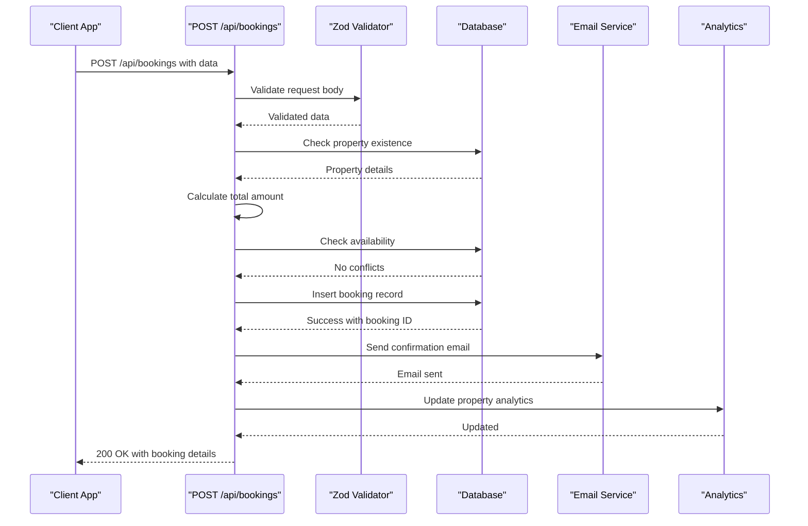
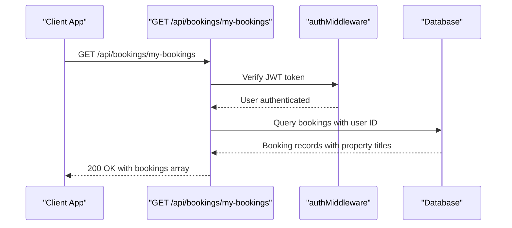
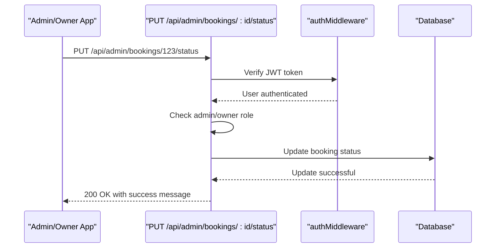
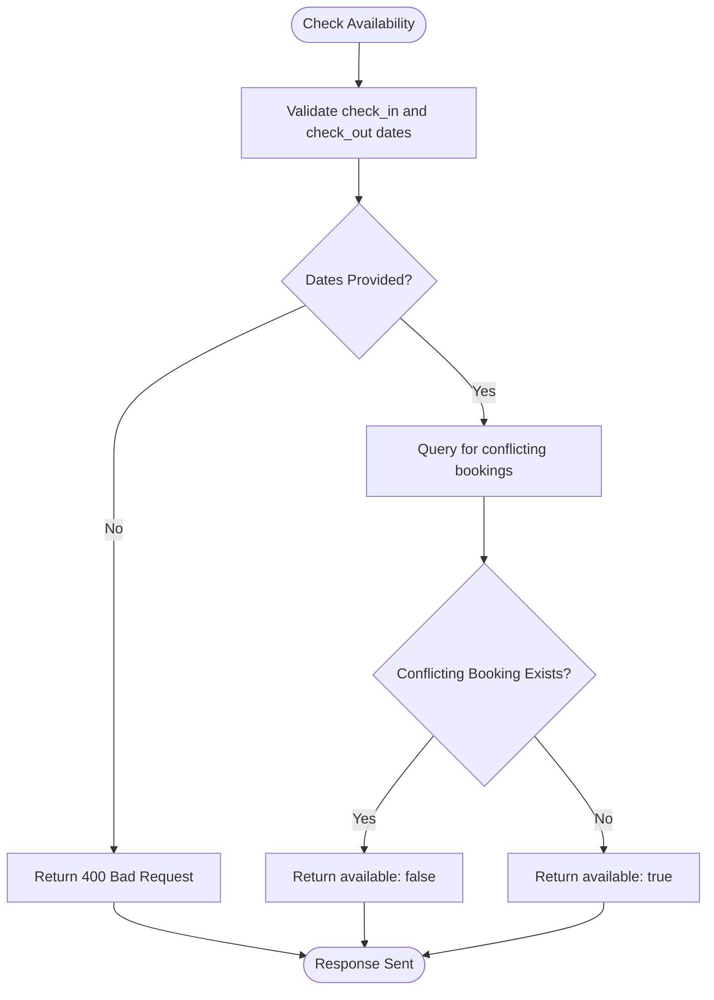
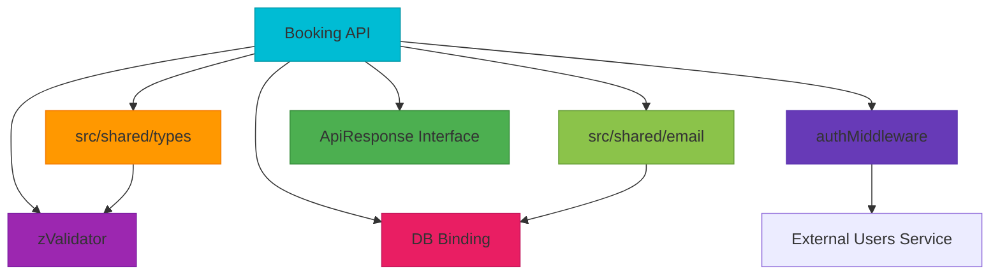

# Bookings API

<cite>
**Referenced Files in This Document**   
- [index.ts](file://src/worker/index.ts#L406-L599)
- [index.ts](file://src/worker/index.ts#L768-L814)
- [index.ts](file://src/worker/index.ts#L890-L947)
- [index.ts](file://src/worker/index.ts#L1456-L1505)
- [types.ts](file://src/shared/types.ts#L34-L62)
- [types.ts](file://src/shared/types.ts#L584-L589)
</cite>

## Table of Contents
1. [Introduction](#introduction)
2. [Project Structure](#project-structure)
3. [Core Components](#core-components)
4. [Architecture Overview](#architecture-overview)
5. [Detailed Component Analysis](#detailed-component-analysis)
6. [Dependency Analysis](#dependency-analysis)
7. [Performance Considerations](#performance-considerations)
8. [Troubleshooting Guide](#troubleshooting-guide)
9. [Conclusion](#conclusion)

## Introduction
This document provides comprehensive documentation for the Bookings API in the HabibiStay platform. The API enables users to manage bookings throughout their lifecycle, including creation, retrieval, status updates, and cancellation. It integrates with property availability checks, payment processing, and email notifications to provide a complete booking management solution. The system uses JWT-based authentication through an external users service and implements robust validation using Zod schemas to ensure data integrity.

## Project Structure
The project follows a layered architecture with distinct separation between frontend, shared utilities, and backend worker logic. The booking functionality is implemented in the Cloudflare Worker at `src/worker/index.ts`, which serves as the backend API. Shared types and validation schemas are defined in `src/shared/types.ts` and reused across the application. The frontend React application in `src/react-app` consumes these APIs through various components like BookingModal and PropertyDetail.

**Diagram sources**
- [index.ts](file://src/worker/index.ts#L0-L199)
- [types.ts](file://src/shared/types.ts#L50-L62)

**Section sources**
- [index.ts](file://src/worker/index.ts#L0-L199)
- [types.ts](file://src/shared/types.ts#L50-L62)

## Core Components
The core booking components include the booking creation endpoint, user bookings retrieval, booking status updates, and availability checking. These components work together to provide a complete booking management system with proper validation, authentication, and business logic enforcement. The implementation uses Hono as the web framework, Zod for request validation, and interacts with a database to persist booking information and check availability constraints.

**Section sources**
- [index.ts](file://src/worker/index.ts#L406-L599)
- [index.ts](file://src/worker/index.ts#L768-L814)
- [types.ts](file://src/shared/types.ts#L34-L62)

## Architecture Overview
The Bookings API follows a RESTful architecture implemented on Cloudflare Workers. The system receives HTTP requests that are processed through middleware for CORS and error handling. Authentication is handled by an external users service using JWT tokens. Validated requests are processed by route handlers that interact with the database to perform CRUD operations on bookings. The architecture includes integration with external services for payments and email notifications, and uses a shared types module to maintain consistency across the codebase.

**Diagram sources**
- [index.ts](file://src/worker/index.ts#L406-L599)
- [index.ts](file://src/worker/index.ts#L768-L814)

## Detailed Component Analysis

### Booking Creation Endpoint
The booking creation endpoint handles the creation of new bookings with comprehensive validation and availability checking. It calculates pricing including service fees and taxes, checks for conflicting bookings, and creates the booking record if available. The endpoint also triggers email notifications and updates analytics data upon successful booking creation.

**Diagram sources**
- [index.ts](file://src/worker/index.ts#L406-L599)
- [types.ts](file://src/shared/types.ts#L53-L62)

**Section sources**
- [index.ts](file://src/worker/index.ts#L406-L599)
- [types.ts](file://src/shared/types.ts#L53-L62)

### User Bookings Retrieval
The user bookings endpoint retrieves all bookings associated with the authenticated user, including both bookings they've made and properties they own. This provides a unified view of all booking activity for the user, whether as a guest or host. The endpoint joins booking data with property information to provide enriched results.

**Diagram sources**
- [index.ts](file://src/worker/index.ts#L768-L814)
- [types.ts](file://src/shared/types.ts#L34-L51)

**Section sources**
- [index.ts](file://src/worker/index.ts#L768-L814)
- [types.ts](file://src/shared/types.ts#L34-L51)

### Booking Status Updates
The booking status update endpoint allows authorized users (admins or property owners) to modify the status of existing bookings. This is used to confirm, reject, or otherwise manage bookings in the system. The endpoint enforces role-based access control to prevent unauthorized status changes.

**Diagram sources**
- [index.ts](file://src/worker/index.ts#L890-L947)
- [types.ts](file://src/shared/types.ts#L34-L51)

**Section sources**
- [index.ts](file://src/worker/index.ts#L890-L947)
- [types.ts](file://src/shared/types.ts#L34-L51)

### Property Availability Checking
The property availability endpoint checks whether a property is available for a given date range by querying for conflicting bookings. This endpoint is used both by the booking creation process and by the frontend to provide real-time availability information to users before they submit a booking request.

**Diagram sources**
- [index.ts](file://src/worker/index.ts#L1456-L1505)
- [types.ts](file://src/shared/types.ts#L53-L62)

**Section sources**
- [index.ts](file://src/worker/index.ts#L1456-L1505)
- [types.ts](file://src/shared/types.ts#L53-L62)

## Dependency Analysis
The booking system has several key dependencies that enable its functionality. The primary dependency is the database, which stores all booking records and is queried for availability checks and booking retrieval. The system also depends on the shared types module for validation schemas, the external users service for authentication, and email services for sending confirmation messages. These dependencies are managed through explicit imports and interface contracts.

**Diagram sources**
- [index.ts](file://src/worker/index.ts#L406-L599)
- [types.ts](file://src/shared/types.ts#L584-L589)

**Section sources**
- [index.ts](file://src/worker/index.ts#L406-L599)
- [types.ts](file://src/shared/types.ts#L584-L589)

## Performance Considerations
The booking API is designed for performance with several optimizations in place. Database queries use parameterized statements to prevent SQL injection and enable query plan caching. The availability check uses a single query with proper indexing on date ranges to quickly identify conflicts. The system also implements analytics updates using SQLite's INSERT OR REPLACE pattern to minimize database round trips. For high-traffic scenarios, additional caching of availability information could further improve performance.

## Troubleshooting Guide
Common issues with the booking API include availability conflicts, validation errors, and authentication problems. When a booking fails with "Property is not available for selected dates", check the database for existing bookings that overlap with the requested dates. For validation errors, verify that the request body matches the CreateBookingSchema structure exactly. Authentication issues typically stem from missing or invalid JWT tokens - ensure the client is properly handling the OAuth flow and including the Authorization header. Database connection issues may require checking the Cloudflare Worker bindings configuration.

**Section sources**
- [index.ts](file://src/worker/index.ts#L406-L599)
- [index.ts](file://src/worker/index.ts#L1456-L1505)
- [types.ts](file://src/shared/types.ts#L53-L62)

## Conclusion
The Bookings API provides a robust and secure system for managing property reservations in the HabibiStay platform. With comprehensive validation, availability checking, and integration with external services, it delivers a reliable booking experience for both guests and hosts. The use of standardized response formats, proper authentication, and clear error handling makes the API easy to consume and maintain. Future enhancements could include idempotency keys for safe retries, webhook notifications for status changes, and more sophisticated pricing rules.