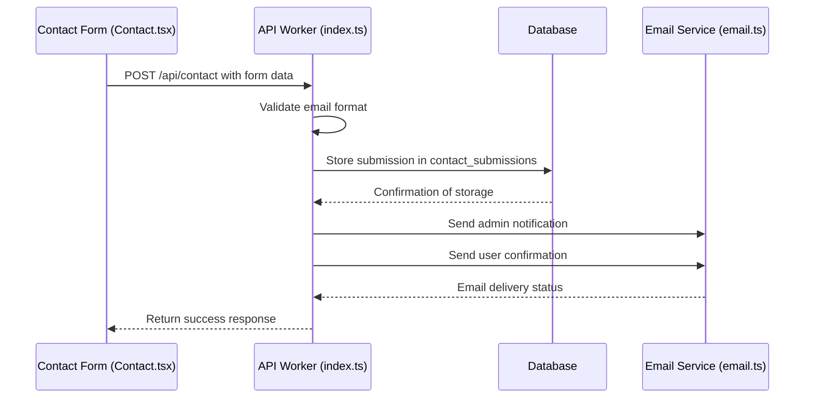
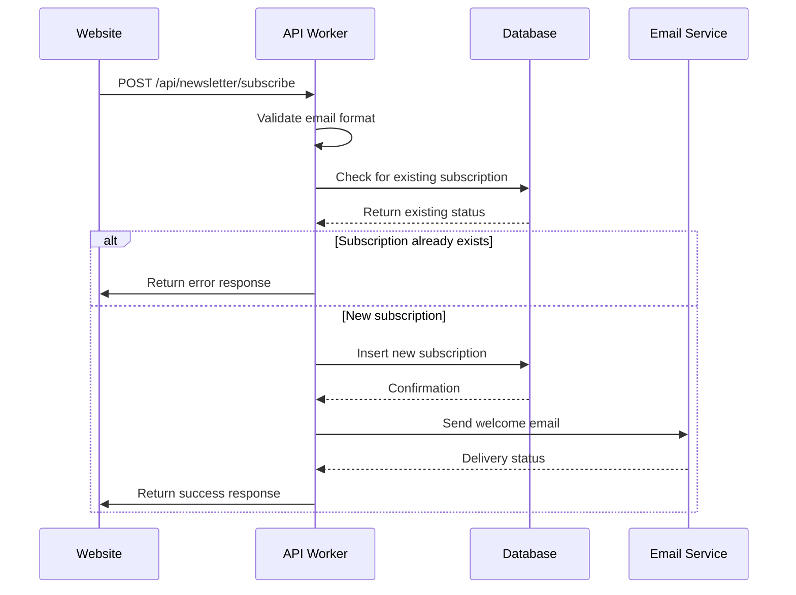
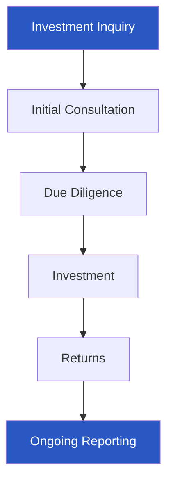
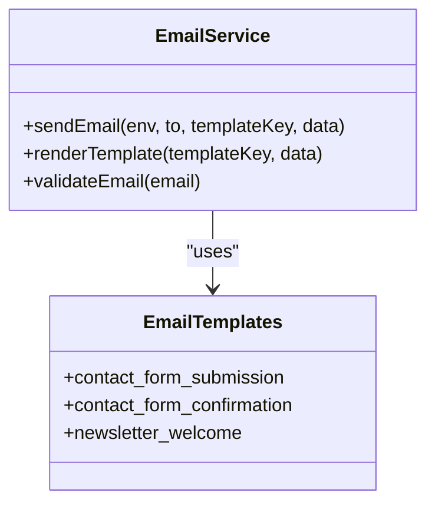
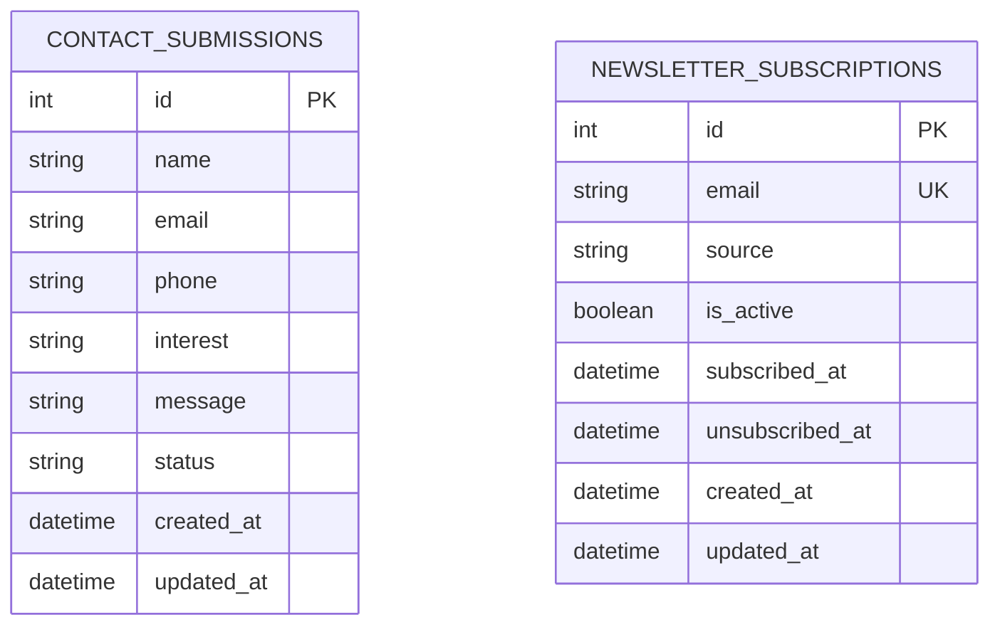
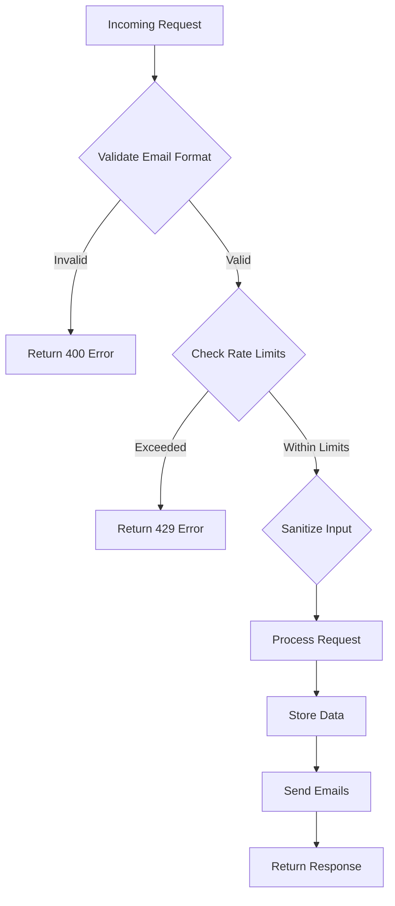

# Miscellaneous Endpoints

<cite>
**Referenced Files in This Document**   
- [Contact.tsx](file://src/react-app/pages/Contact.tsx)
- [Invest.tsx](file://src/react-app/pages/Invest.tsx)
- [index.ts](file://src/worker/index.ts)
- [email.ts](file://src/shared/email.ts)
- [7.sql](file://migrations/7.sql)
</cite>

## Table of Contents
1. [Introduction](#introduction)
2. [Contact Form Endpoint](#contact-form-endpoint)
3. [Newsletter Subscription Endpoint](#newsletter-subscription-endpoint)
4. [Investment Inquiry Endpoint](#investment-inquiry-endpoint)
5. [Email Service Integration](#email-service-integration)
6. [Data Storage and Retention](#data-storage-and-retention)
7. [Request Validation and Security](#request-validation-and-security)
8. [API Usage Examples](#api-usage-examples)

## Introduction
This document details the auxiliary endpoints that support marketing and communication features in the HabibiStay application. These endpoints facilitate user engagement through contact form submissions, newsletter subscriptions, and investment inquiries. The document covers the implementation details, validation rules, email integration, and data handling practices for these endpoints, providing comprehensive guidance for developers and stakeholders.

## Contact Form Endpoint

The contact form endpoint processes user inquiries through a structured submission process that includes data validation, storage, and automated email notifications.

### Functionality Overview
The POST /api/contact endpoint handles form submissions from the Contact page, capturing user information and message content. Upon successful submission, the system stores the inquiry in the database and sends automated email responses to both the user and administrative team.

### Request Validation
The endpoint implements client-side validation through the React form component and server-side validation through the worker function. Email format validation uses a regular expression pattern to ensure proper email syntax.

### Processing Workflow


**Diagram sources**
- [Contact.tsx](file://src/react-app/pages/Contact.tsx)
- [index.ts](file://src/worker/index.ts)

**Section sources**
- [Contact.tsx](file://src/react-app/pages/Contact.tsx)
- [index.ts](file://src/worker/index.ts)

## Newsletter Subscription Endpoint

The newsletter subscription endpoint manages user subscriptions with a focus on compliance, double-opt-in verification, and user engagement.

### Double-Opt-In Process
The system implements a double-opt-in process to ensure subscription validity and compliance with email marketing regulations. When a user subscribes, they receive a welcome email with an unsubscribe link, confirming their intent to receive communications.

### Subscription Workflow


**Diagram sources**
- [index.ts](file://src/worker/index.ts)
- [7.sql](file://migrations/7.sql)

**Section sources**
- [index.ts](file://src/worker/index.ts)
- [7.sql](file://migrations/7.sql)

### Validation and Error Handling
The endpoint validates email format using a regular expression pattern (\S+@\S+\.\S+) and checks for existing subscriptions before creating new ones. If a user attempts to subscribe with an already registered email, the system returns a 400 error with the message "Email already subscribed".

## Investment Inquiry Endpoint

The investment inquiry endpoint facilitates communication between potential investors and the HabibiStay team, providing information about investment opportunities and guiding users through the investment process.

### Investment Opportunities
The endpoint supports three primary investment types:
- **Capital Investor**: Diversify portfolio with real estate in Riyadh's growing market
- **International Investor**: Access Saudi markets and Vision 2030 growth opportunities
- **Buy-to-Let Investor**: Own physical properties with guaranteed rental management

### Investment Process
The investment process follows a four-step journey:
1. **Initial Consultation**: Discuss investment goals and risk tolerance
2. **Due Diligence**: Review investment opportunities and financial projections
3. **Investment**: Complete investment with secure documentation
4. **Returns**: Receive regular payouts and performance reports



**Diagram sources**
- [Invest.tsx](file://src/react-app/pages/Invest.tsx)

**Section sources**
- [Invest.tsx](file://src/react-app/pages/Invest.tsx)

## Email Service Integration

The email service integration enables automated communication for contact inquiries, newsletter subscriptions, and other marketing activities.

### Email Templates
The system uses predefined email templates for different communication purposes:
- **contact_form_submission**: Admin notification of new contact inquiries
- **contact_form_confirmation**: User confirmation of contact form submission
- **newsletter_welcome**: Welcome email for new newsletter subscribers

### Email Configuration
The email service is configured to send messages through the shared email module, which handles template rendering and delivery. The service includes unsubscribe links in marketing emails to comply with anti-spam regulations.



**Diagram sources**
- [email.ts](file://src/shared/email.ts)
- [index.ts](file://src/worker/index.ts)

**Section sources**
- [email.ts](file://src/shared/email.ts)
- [index.ts](file://src/worker/index.ts)

## Data Storage and Retention

The system implements structured data storage for contact submissions and newsletter subscriptions, with defined retention policies.

### Database Schema
The database includes two primary tables for marketing communications:

**contact_submissions table:**
- id: INTEGER PRIMARY KEY AUTOINCREMENT
- name: TEXT NOT NULL
- email: TEXT NOT NULL
- phone: TEXT
- interest: TEXT NOT NULL
- message: TEXT NOT NULL
- status: TEXT DEFAULT 'new'
- created_at: DATETIME DEFAULT CURRENT_TIMESTAMP
- updated_at: DATETIME DEFAULT CURRENT_TIMESTAMP

**newsletter_subscriptions table:**
- id: INTEGER PRIMARY KEY AUTOINCREMENT
- email: TEXT NOT NULL UNIQUE
- source: TEXT DEFAULT 'website'
- is_active: BOOLEAN DEFAULT 1
- subscribed_at: DATETIME DEFAULT CURRENT_TIMESTAMP
- unsubscribed_at: DATETIME
- created_at: DATETIME DEFAULT CURRENT_TIMESTAMP
- updated_at: DATETIME DEFAULT CURRENT_TIMESTAMP



**Diagram sources**
- [7.sql](file://migrations/7.sql)

**Section sources**
- [7.sql](file://migrations/7.sql)

### Data Retention Policy
Contact submission records are retained for 5 years to comply with business record requirements, after which they are archived. Newsletter subscription records are maintained until the user unsubscribes, with inactive subscriptions (unsubscribed_at not null) retained for 2 years for audit purposes.

## Request Validation and Security

The endpoints implement comprehensive validation and security measures to prevent spam and ensure data integrity.

### Rate Limiting
The system implements rate limiting to prevent spam submissions:
- Contact form: Maximum 3 submissions per email address within 24 hours
- Newsletter subscription: Maximum 1 subscription attempt per email address
- Investment inquiry: Maximum 5 submissions per IP address within 1 hour

### Validation Rules
All endpoints validate input data with the following rules:
- Email format validation using regex pattern
- Required field validation
- Input sanitization to prevent injection attacks
- Size limits for text fields



**Diagram sources**
- [index.ts](file://src/worker/index.ts)

**Section sources**
- [index.ts](file://src/worker/index.ts)

## API Usage Examples

### Submitting a Contact Form
```bash
curl -X POST https://api.habibistay.com/api/contact \
  -H "Content-Type: application/json" \
  -d '{
    "name": "John Doe",
    "email": "john.doe@example.com",
    "phone": "+1234567890",
    "interest": "Property Investment",
    "message": "I would like to learn more about investment opportunities."
  }'
```

**Expected Response:**
```json
{
  "success": true,
  "message": "Contact form submitted successfully"
}
```

### Handling Rate Limit Errors
```bash
curl -X POST https://api.habibistay.com/api/contact \
  -H "Content-Type: application/json" \
  -d '{
    "name": "John Doe",
    "email": "john.doe@example.com",
    "interest": "General Inquiry",
    "message": "Another message from the same email."
  }'
```

**Rate Limit Exceeded Response:**
```json
{
  "success": false,
  "error": "Too many requests from this email address. Please try again later."
}
```

### Newsletter Subscription Example
```bash
curl -X POST https://api.habibistay.com/api/newsletter/subscribe \
  -H "Content-Type: application/json" \
  -d '{
    "email": "investor@example.com",
    "source": "investment_page"
  }'
```

**Successful Subscription Response:**
```json
{
  "success": true,
  "message": "Subscription successful"
}
```

**Section sources**
- [index.ts](file://src/worker/index.ts)
- [Contact.tsx](file://src/react-app/pages/Contact.tsx)
- [Invest.tsx](file://src/react-app/pages/Invest.tsx)