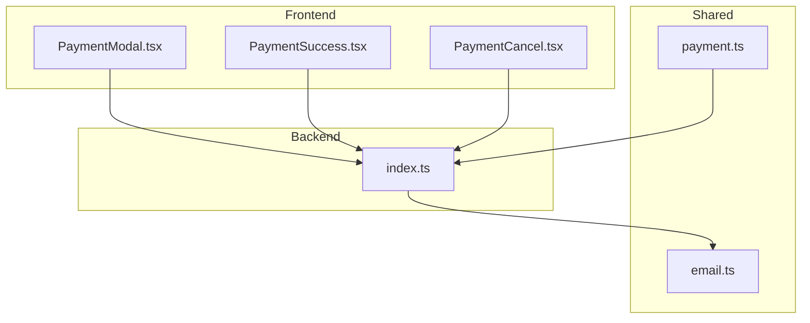
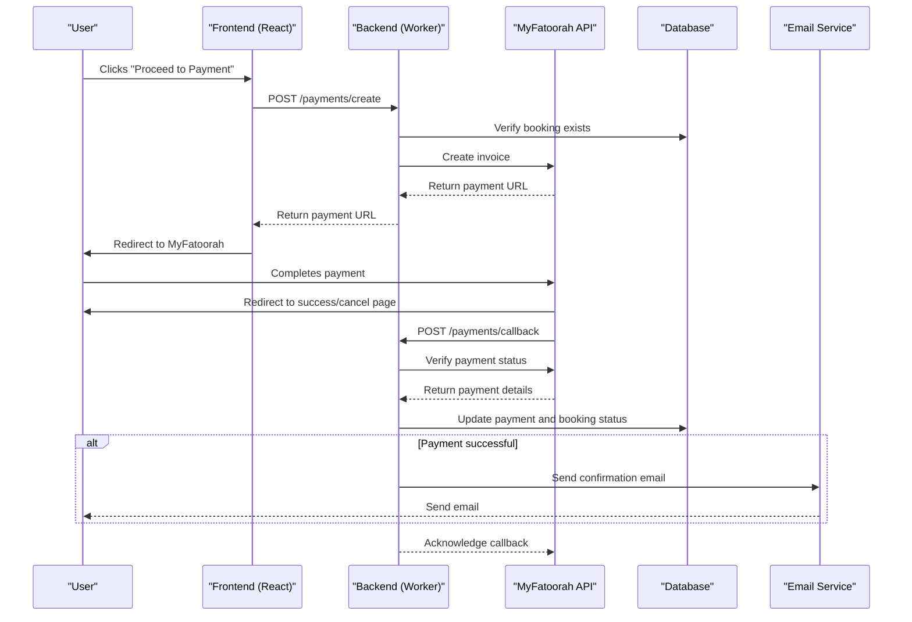
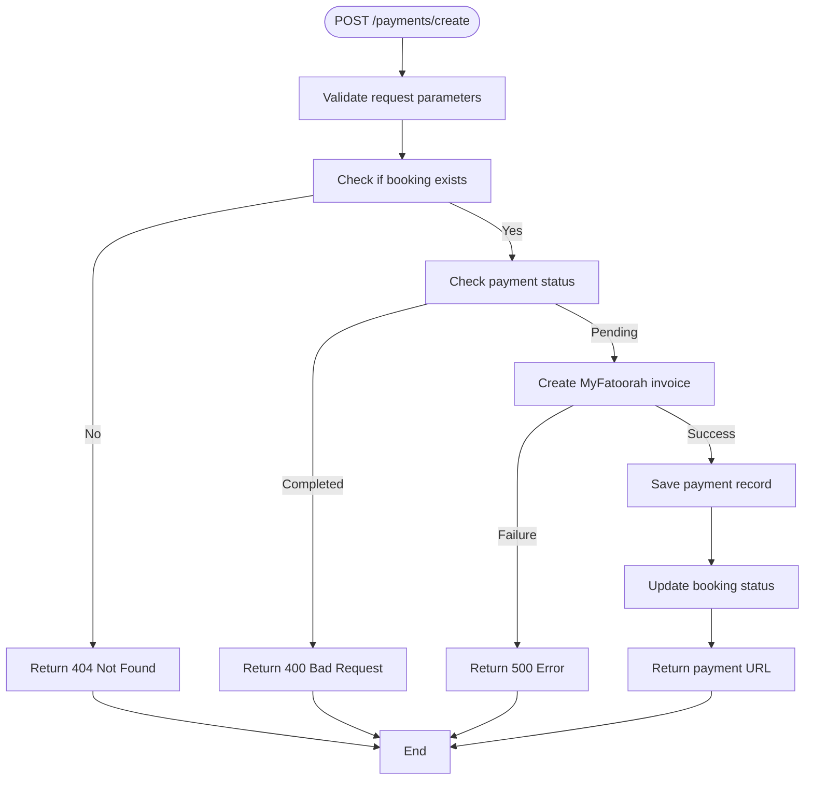
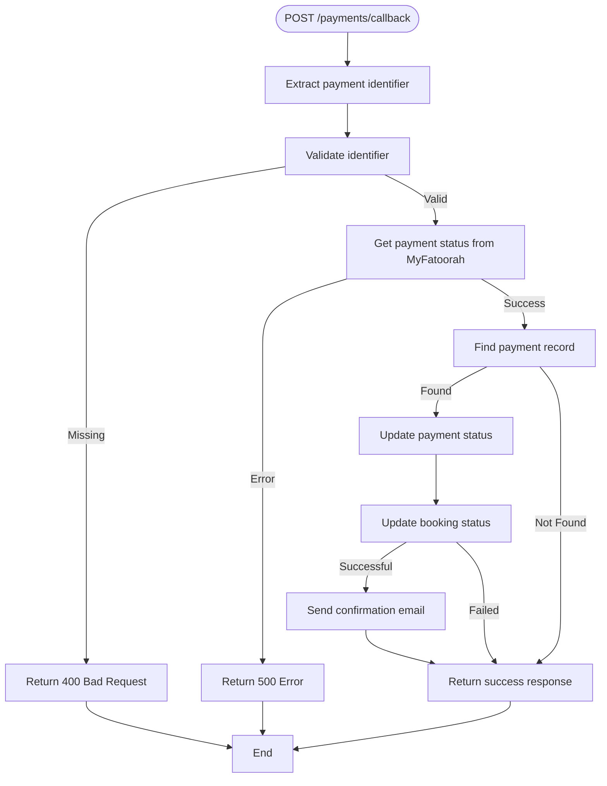
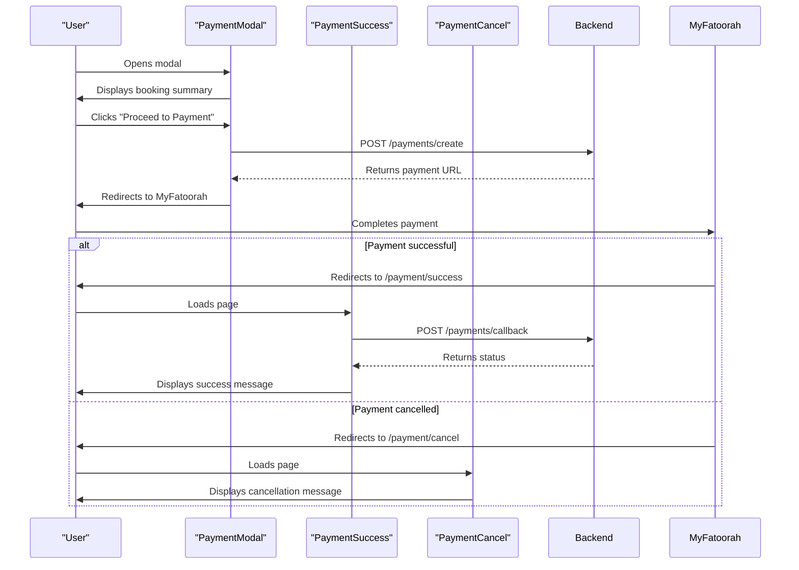

# Payments API

<cite>
**Referenced Files in This Document**   
- [payment.ts](file://src/shared/payment.ts)
- [index.ts](file://src/worker/index.ts)
- [PaymentSuccess.tsx](file://src/react-app/pages/PaymentSuccess.tsx)
- [PaymentCancel.tsx](file://src/react-app/pages/PaymentCancel.tsx)
- [PaymentModal.tsx](file://src/react-app/components/PaymentModal.tsx)
- [email.ts](file://src/shared/email.ts)
</cite>

## Table of Contents
1. [Introduction](#introduction)
2. [Project Structure](#project-structure)
3. [Core Components](#core-components)
4. [Architecture Overview](#architecture-overview)
5. [Detailed Component Analysis](#detailed-component-analysis)
6. [Dependency Analysis](#dependency-analysis)
7. [Performance Considerations](#performance-considerations)
8. [Troubleshooting Guide](#troubleshooting-guide)
9. [Conclusion](#conclusion)

## Introduction
This document provides comprehensive API documentation for the payment processing system integrated with MyFatoorah in the HabibiStay platform. The system handles payment initiation, callback processing, and status verification for booking transactions. The documentation covers the three main endpoints: POST /payments/create for initiating payments, POST /payments/callback for handling MyFatoorah webhooks, and the implicit status checking mechanism. It details request parameters, response schemas, security measures, error handling, and user experience flows for both successful and failed payments.

## Project Structure
The payment processing functionality is distributed across multiple directories in the project structure. The shared business logic and type definitions are located in the `src/shared` directory, while the frontend components are organized in `src/react-app`. The server-side API endpoints are implemented in the Cloudflare Worker at `src/worker/index.ts`. This separation of concerns allows for reusable payment logic across different parts of the application while maintaining clear boundaries between frontend and backend responsibilities.



**Diagram sources**
- [PaymentModal.tsx](file://src/react-app/components/PaymentModal.tsx)
- [PaymentSuccess.tsx](file://src/react-app/pages/PaymentSuccess.tsx)
- [PaymentCancel.tsx](file://src/react-app/pages/PaymentCancel.tsx)
- [payment.ts](file://src/shared/payment.ts)
- [index.ts](file://src/worker/index.ts)
- [email.ts](file://src/shared/email.ts)

**Section sources**
- [payment.ts](file://src/shared/payment.ts)
- [index.ts](file://src/worker/index.ts)

## Core Components
The payment system consists of several core components that work together to process transactions securely. The MyFatoorahService class in `payment.ts` encapsulates the integration with the MyFatoorah API, providing methods for creating invoices and checking payment status. The API endpoints in `index.ts` handle HTTP requests and coordinate between the database, MyFatoorah service, and email service. The frontend components (`PaymentModal.tsx`, `PaymentSuccess.tsx`, and `PaymentCancel.tsx`) provide the user interface for initiating payments and handling the results. The email service in `email.ts` sends confirmation messages to users after successful transactions.

**Section sources**
- [payment.ts](file://src/shared/payment.ts#L1-L165)
- [index.ts](file://src/worker/index.ts#L980-L1200)
- [PaymentModal.tsx](file://src/react-app/components/PaymentModal.tsx#L1-L167)
- [PaymentSuccess.tsx](file://src/react-app/pages/PaymentSuccess.tsx#L1-L222)
- [PaymentCancel.tsx](file://src/react-app/pages/PaymentCancel.tsx#L1-L114)

## Architecture Overview
The payment processing architecture follows a client-server pattern with a secure third-party payment gateway. When a user initiates a payment through the PaymentModal, a request is sent to the server's /payments/create endpoint. The server creates an invoice with MyFatoorah and returns a payment URL. The user is redirected to MyFatoorah's secure payment page where they complete the transaction. After payment completion, MyFatoorah redirects the user to either the success or cancel page and sends a callback to the /payments/callback endpoint. The server verifies the payment status with MyFatoorah, updates the database records, and triggers a confirmation email for successful payments.



**Diagram sources**
- [payment.ts](file://src/shared/payment.ts#L107-L164)
- [index.ts](file://src/worker/index.ts#L980-L1200)
- [PaymentModal.tsx](file://src/react-app/components/PaymentModal.tsx#L50-L80)
- [PaymentSuccess.tsx](file://src/react-app/pages/PaymentSuccess.tsx#L20-L70)

## Detailed Component Analysis

### Payment Creation Endpoint Analysis
The POST /payments/create endpoint initiates a new payment process for a booking. It validates the request parameters against the CreatePaymentSchema, verifies that the booking exists and hasn't already been paid, and creates a payment invoice with MyFatoorah.

#### Request Parameters
The endpoint accepts the following parameters in the request body:
- **booking_id**: The ID of the booking to be paid (required, number)
- **amount**: The payment amount (required, positive number)
- **currency**: The currency code (optional, defaults to 'SAR')
- **return_url**: The URL to redirect to after successful payment (required, URL)
- **cancel_url**: The URL to redirect to if payment is cancelled (required, URL)

#### Processing Logic
The endpoint first retrieves the booking details from the database, including the guest's name and email. It then constructs a payment data object that conforms to MyFatoorah's requirements, including the invoice amount, currency, customer information, and callback URLs. After creating the invoice with MyFatoorah, it saves the payment record to the database with a 'pending' status and returns the payment URL to the client.



**Diagram sources**
- [index.ts](file://src/worker/index.ts#L989-L1076)
- [payment.ts](file://src/shared/payment.ts#L135-L140)

**Section sources**
- [index.ts](file://src/worker/index.ts#L989-L1076)
- [payment.ts](file://src/shared/payment.ts#L1-L41)

### Payment Callback Endpoint Analysis
The POST /payments/callback endpoint serves as the webhook receiver for MyFatoorah payment notifications. It verifies the payment status with MyFatoorah, updates the local database records, and returns the result to the client.

#### Request Parameters
The endpoint accepts the following parameters in the request body:
- **paymentId**: The MyFatoorah payment ID (optional, string)
- **Id**: Alternative payment identifier (optional, string)
- **InvoiceId**: The invoice ID (optional, string)

The endpoint uses the first available identifier to query MyFatoorah for the payment status.

#### Verification and Update Logic
The endpoint first determines which identifier to use for the status check. It then calls MyFatoorah's getPaymentStatus API to retrieve the current payment status. If the payment is successful (status is 'Paid'), it updates both the payment record and the associated booking record in the database. For successful payments, it also triggers a confirmation email to the guest.



**Diagram sources**
- [index.ts](file://src/worker/index.ts#L1078-L1174)
- [payment.ts](file://src/shared/payment.ts#L142-L147)

**Section sources**
- [index.ts](file://src/worker/index.ts#L1078-L1174)
- [email.ts](file://src/shared/email.ts#L200-L249)

### MyFatoorah Service Analysis
The MyFatoorahService class provides a wrapper around the MyFatoorah API, abstracting the HTTP communication and error handling.

#### Class Structure
The service class encapsulates the API key and base URL, providing methods for the key operations:
- **createInvoice**: Creates a new payment invoice
- **getPaymentStatus**: Retrieves the status of a payment by ID
- **getInvoiceStatus**: Retrieves the status of an invoice by ID
- **cancelInvoice**: Cancels an existing invoice

#### Request Handling
The service uses a common makeRequest method to handle HTTP communication, automatically adding the required authorization header and content type. It throws descriptive errors for HTTP failures, which are then handled by the calling code.

```mermaid
classDiagram
class MyFatoorahService {
+string apiKey
+string baseUrl
+constructor(apiKey, baseUrl)
+createInvoice(paymentData) MyFatoorahCreateInvoiceResponse
+getPaymentStatus(paymentId) MyFatoorahPaymentStatusResponse
+getInvoiceStatus(invoiceId) MyFatoorahPaymentStatusResponse
+cancelInvoice(invoiceId) any
-makeRequest(endpoint, method, data) any
}
class MyFatoorahService --> "1" MyFatoorahCreateInvoiceResponse : returns
class MyFatoorahService --> "1" MyFatoorahPaymentStatusResponse : returns
class MyFatoorahCreateInvoiceResponse {
+boolean IsSuccess
+string Message
+any[] ValidationErrors
+Data Data
}
class MyFatoorahPaymentStatusResponse {
+boolean IsSuccess
+string Message
+Data Data
}
class Data {
+number InvoiceId
+string InvoiceStatus
+string InvoiceReference
+string CustomerReference
+string CreatedDate
+string ExpiryDate
+number InvoiceValue
+string Comments
+string CustomerName
+string CustomerMobile
+string CustomerEmail
+string UserDefinedField
+string InvoiceDisplayValue
+number DueDeposit
+string DepositeStatus
+any[] InvoiceItems
+InvoiceTransactions[] InvoiceTransactions
}
class InvoiceTransactions {
+string TransactionDate
+string PaymentGateway
+string ReferenceId
+string TrackId
+string TransactionId
+string PaymentId
+string AuthorizationId
+string TransactionStatus
+string TransactionValue
+number CustomerServiceCharge
+number DueValue
+string PaidCurrency
+string PaidCurrencyValue
+string IpAddress
+string Country
+string Currency
+string Error
+string CardNumber
+string ErrorCode
}
```

**Diagram sources**
- [payment.ts](file://src/shared/payment.ts#L107-L164)

**Section sources**
- [payment.ts](file://src/shared/payment.ts#L107-L164)

### Frontend Components Analysis
The frontend components provide the user interface for the payment process, including initiation, success, and cancellation flows.

#### Payment Initiation Flow
The PaymentModal component displays a summary of the booking and a button to initiate payment. When the user clicks "Proceed to Payment", it sends a request to the /payments/create endpoint and redirects the user to the returned payment URL.

#### Success and Cancellation Handling
The PaymentSuccess and PaymentCancel pages handle the return flows from MyFatoorah. The PaymentSuccess page first calls the /payments/callback endpoint to verify the payment status before displaying the success message. This ensures that users cannot bypass the payment process by directly accessing the success page.



**Diagram sources**
- [PaymentModal.tsx](file://src/react-app/components/PaymentModal.tsx#L50-L80)
- [PaymentSuccess.tsx](file://src/react-app/pages/PaymentSuccess.tsx#L20-L70)
- [PaymentCancel.tsx](file://src/react-app/pages/PaymentCancel.tsx#L1-L114)

**Section sources**
- [PaymentModal.tsx](file://src/react-app/components/PaymentModal.tsx#L1-L167)
- [PaymentSuccess.tsx](file://src/react-app/pages/PaymentSuccess.tsx#L1-L222)
- [PaymentCancel.tsx](file://src/react-app/pages/PaymentCancel.tsx#L1-L114)

## Dependency Analysis
The payment system has dependencies on several external and internal components. The primary external dependency is the MyFatoorah API, which handles the actual payment processing. The system also depends on the database for storing payment and booking records, and on the email service for sending confirmation messages. The frontend components depend on the shared payment types and the backend API endpoints.

```mermaid
graph TD
PM[PaymentModal] --> API[/payments/create]
PS[PaymentSuccess] --> API[/payments/callback]
PC[PaymentCancel] --> UI
API --> MF[MyFatoorahService]
API --> DB[(Database)]
API --> ES[EmailService]
MF --> MyFatoorah[MyFatoorah API]
ES --> SMTP[SMTP Service]
DB --> SQLite[(SQLite)]
```

**Diagram sources**
- [payment.ts](file://src/shared/payment.ts)
- [index.ts](file://src/worker/index.ts)
- [PaymentModal.tsx](file://src/react-app/components/PaymentModal.tsx)
- [PaymentSuccess.tsx](file://src/react-app/pages/PaymentSuccess.tsx)
- [PaymentCancel.tsx](file://src/react-app/pages/PaymentCancel.tsx)
- [email.ts](file://src/shared/email.ts)

**Section sources**
- [payment.ts](file://src/shared/payment.ts)
- [index.ts](file://src/worker/index.ts)
- [email.ts](file://src/shared/email.ts)

## Performance Considerations
The payment processing system is designed with performance and reliability in mind. The use of a worker environment allows for scalable handling of payment requests without blocking the main application. The database operations are optimized with prepared statements to prevent SQL injection and improve query performance. The MyFatoorah API calls are made with appropriate error handling to prevent cascading failures. For high-traffic scenarios, the system could be enhanced with caching mechanisms for frequently accessed booking data and queue-based processing for email notifications to prevent delays in the payment flow.

## Troubleshooting Guide
This section addresses common issues that may occur during payment processing and their solutions.

### Error: "Booking not found"
This error occurs when the booking_id in the payment request does not correspond to an existing booking in the database. Verify that the booking ID is correct and that the booking has been properly created in the system.

### Error: "Payment already completed for this booking"
This error indicates that a payment has already been processed for the specified booking. Check the booking status in the database and ensure that users cannot initiate multiple payments for the same booking.

### Error: "Failed to create payment"
This generic error occurs when the MyFatoorah API returns an error during invoice creation. Check the MyFatoorah dashboard for specific error details and verify that the API credentials are correct and have sufficient permissions.

### Error: "Missing payment identifier"
This error occurs in the callback endpoint when none of the payment identifier fields (paymentId, Id, InvoiceId) are provided in the request. Ensure that MyFatoorah is configured to send one of these identifiers in the callback.

### Payment Status Not Updating
If payment status is not being updated in the database, verify that the callback endpoint is accessible from MyFatoorah's servers and that the database connection is working properly. Check the server logs for any errors during the callback processing.

**Section sources**
- [index.ts](file://src/worker/index.ts#L989-L1174)
- [payment.ts](file://src/shared/payment.ts#L107-L164)

## Conclusion
The HabibiStay payment processing system provides a secure and reliable integration with MyFatoorah for handling booking payments. The system follows a clean architecture with well-defined responsibilities for each component, from the frontend user interface to the backend API endpoints and shared service classes. The implementation includes proper error handling, database transaction management, and user experience considerations for both successful and failed payments. The use of type validation ensures data integrity throughout the payment flow, while the separation of concerns allows for maintainable and extensible code. For future improvements, consider implementing payment status polling for cases where the callback might be delayed or lost, and adding more detailed logging for troubleshooting payment issues.