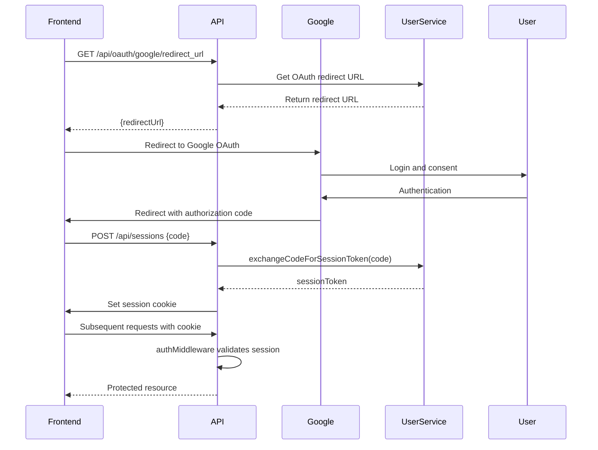

# API Endpoints Reference

<cite>
**Referenced Files in This Document**   
- [index.ts](file://src/worker/index.ts#L0-L2050)
- [types.ts](file://src/shared/types.ts#L0-L600)
- [payment.ts](file://src/shared/payment.ts#L0-L150)
- [email.ts](file://src/shared/email.ts#L0-L200)
- [PropertyDetail.tsx](file://src/react-app/pages/PropertyDetail.tsx#L0-L300)
- [BookingModal.tsx](file://src/react-app/components/BookingModal.tsx#L0-L200)
- [PaymentModal.tsx](file://src/react-app/components/PaymentModal.tsx#L0-L150)
- [ChatBot.tsx](file://src/react-app/components/ChatBot.tsx#L0-L100)
</cite>

## Table of Contents
1. [Introduction](#introduction)
2. [Authentication and Authorization](#authentication-and-authorization)
3. [Property Endpoints](#property-endpoints)
4. [Booking Endpoints](#booking-endpoints)
5. [Payment Endpoints](#payment-endpoints)
6. [Chat and AI Endpoints](#chat-and-ai-endpoints)
7. [User and Profile Endpoints](#user-and-profile-endpoints)
8. [Wishlist Endpoints](#wishlist-endpoints)
9. [Review Endpoints](#review-endpoints)
10. [Admin Endpoints](#admin-endpoints)
11. [Utility Endpoints](#utility-endpoints)
12. [Error Handling](#error-handling)
13. [Data Validation](#data-validation)

## Introduction
The HabibiStay API provides a comprehensive set of RESTful endpoints for managing property listings, bookings, payments, user profiles, and AI-powered chat interactions. Built on the Hono framework, the API serves a premium short-term rental platform focused on the Riyadh, Saudi Arabia market. The endpoints support property search with advanced filtering, booking management, secure payment processing through MyFatoorah, AI-powered customer service via OpenAI integration, and administrative functions for property owners and platform administrators.

The API follows standard REST conventions with JSON request and response payloads, proper HTTP status codes, and comprehensive error handling. Authentication is primarily handled through JWT tokens obtained via Google OAuth, with role-based access control for protected endpoints. The API also implements Zod for request validation, ensuring data integrity across all endpoints.

**Section sources**
- [index.ts](file://src/worker/index.ts#L0-L50)
- [types.ts](file://src/shared/types.ts#L0-L50)

## Authentication and Authorization
The HabibiStay API implements a robust authentication and authorization system using JWT tokens and role-based access control. User authentication is primarily handled through Google OAuth, with session management via secure HTTP-only cookies.

### Authentication Flow


**Diagram sources**
- [index.ts](file://src/worker/index.ts#L150-L250)

### Authentication Endpoints

#### Get OAuth Redirect URL
- **HTTP Method**: GET
- **URL**: `/api/oauth/google/redirect_url`
- **Authentication**: None
- **Description**: Returns the Google OAuth redirect URL for initiating the authentication flow.
- **Response Schema**: 
```json
{
  "redirectUrl": "string"
}
```
- **Example Response**:
```json
{
  "redirectUrl": "https://accounts.google.com/o/oauth2/v2/auth?client_id=..."
}
```

#### Create Session
- **HTTP Method**: POST
- **URL**: `/api/sessions`
- **Authentication**: None
- **Request Body**:
```json
{
  "code": "string"
}
```
- **Response**: Sets a secure HTTP-only cookie with the session token and returns success status.
- **Example Request**:
```bash
curl -X POST https://api.habibistay.com/api/sessions \
  -H "Content-Type: application/json" \
  -d '{"code": "oauth_authorization_code"}'
```

#### Get Current User
- **HTTP Method**: GET
- **URL**: `/api/users/me`
- **Authentication**: Required (JWT via cookie)
- **Access Permissions**: Authenticated users
- **Response Schema**: Returns the authenticated user object.
- **Example Response**:
```json
{
  "id": "auth0|123456",
  "email": "user@example.com",
  "name": "John Doe",
  "avatar": "https://example.com/avatar.jpg",
  "role": "guest"
}
```

#### Logout
- **HTTP Method**: GET
- **URL**: `/api/logout`
- **Authentication**: Required (JWT via cookie)
- **Description**: Invalidates the current session and clears the session cookie.
- **Response**: Success status with cleared cookie.

### Authorization Roles
The API implements role-based access control with the following roles:
- **guest**: Regular users who can browse properties and make bookings
- **host**: Property owners who can manage their properties
- **admin**: Platform administrators with full access to all resources
- **owner**: Equivalent to admin, with access to all administrative functions

Access to protected endpoints is determined by the user's email domain and role claims in the JWT token. Admin and owner access is granted to users with emails containing 'admin' or 'owner' substrings.

**Section sources**
- [index.ts](file://src/worker/index.ts#L150-L300)
- [types.ts](file://src/shared/types.ts#L500-L550)

## Property Endpoints
The property endpoints provide comprehensive functionality for searching, viewing, and managing property listings. These endpoints support advanced search with filtering, sorting, and pagination, as well as CRUD operations for property owners.

### Property Search and Listing

#### Search Properties
- **HTTP Method**: GET
- **URL**: `/api/properties`
- **Authentication**: None (public)
- **Query Parameters**:
  - `location`: string (optional) - Filter by location
  - `guests`: number (optional) - Minimum number of guests
  - `min_price`: number (optional) - Minimum price per night
  - `max_price`: number (optional) - Maximum price per night
  - `amenities`: string[] (optional) - Array of amenities to filter by
  - `bedrooms`: number (optional) - Minimum number of bedrooms
  - `bathrooms`: number (optional) - Minimum number of bathrooms
  - `rating`: number (optional) - Minimum average rating (1-5)
  - `sort_by`: string (optional) - Sort order: price_asc, price_desc, rating, newest, featured
  - `page`: number (optional, default: 1) - Page number for pagination
  - `limit`: number (optional, default: 20) - Number of results per page
- **Response Schema**: Paginated list of properties with average rating and review count
- **Example Request**:
```bash
curl "https://api.habibistay.com/api/properties?location=Riyadh&guests=2&min_price=200&max_price=500&sort_by=price_asc&page=1&limit=10"
```
- **Example Response**:
```json
{
  "success": true,
  "data": [
    {
      "id": 1,
      "user_id": "auth0|123",
      "title": "Luxury Apartment in Downtown Riyadh",
      "description": "Modern apartment with city views",
      "location": "Riyadh",
      "price_per_night": 350,
      "max_guests": 4,
      "bedrooms": 2,
      "bathrooms": 2,
      "amenities": "[\"wifi\",\"kitchen\",\"parking\"]",
      "images": "[\"https://example.com/image1.jpg\",\"https://example.com/image2.jpg\"]",
      "is_featured": true,
      "is_active": true,
      "created_at": "2024-01-15T10:30:00Z",
      "updated_at": "2024-01-15T10:30:00Z",
      "avg_rating": 4.8,
      "review_count": 24
    }
  ],
  "pagination": {
    "page": 1,
    "limit": 10,
    "total": 25,
    "totalPages": 3
  }
}
```

#### Get Featured Properties
- **HTTP Method**: GET
- **URL**: `/api/properties/featured`
- **Authentication**: None (public)
- **Description**: Returns the most recently added featured properties.
- **Response**: Array of up to 2 featured properties.
- **Example Response**:
```json
{
  "success": true,
  "data": [
    {
      "id": 1,
      "title": "Luxury Apartment in Downtown Riyadh",
      "location": "Riyadh",
      "price_per_night": 350,
      "max_guests": 4,
      "images": "[\"https://example.com/image1.jpg\"]",
      "is_featured": true
    }
  ]
}
```

#### Get Property by ID
- **HTTP Method**: GET
- **URL**: `/api/properties/:id`
- **Authentication**: None (public)
- **Path Parameters**:
  - `id`: number - Property ID
- **Response Schema**: Property details with reviews and average rating
- **Example Request**:
```bash
curl "https://api.habibistay.com/api/properties/1"
```
- **Example Response**:
```json
{
  "success": true,
  "data": {
    "id": 1,
    "user_id": "auth0|123",
    "title": "Luxury Apartment in Downtown Riyadh",
    "description": "Modern apartment with city views",
    "location": "Riyadh",
    "price_per_night": 350,
    "max_guests": 4,
    "bedrooms": 2,
    "bathrooms": 2,
    "amenities": "[\"wifi\",\"kitchen\",\"parking\"]",
    "images": "[\"https://example.com/image1.jpg\",\"https://example.com/image2.jpg\"]",
    "is_featured": true,
    "is_active": true,
    "created_at": "2024-01-15T10:30:00Z",
    "updated_at": "2024-01-15T10:30:00Z",
    "avg_rating": 4.8,
    "review_count": 24,
    "reviews": [
      {
        "id": 1,
        "user_id": "auth0|456",
        "property_id": 1,
        "rating": 5,
        "comment": "Excellent stay!",
        "created_at": "2024-01-20T14:30:00Z",
        "reviewer_name": "Sarah Johnson",
        "reviewer_avatar": "https://example.com/avatar.jpg"
      }
    ]
  }
}
```

#### Check Property Availability
- **HTTP Method**: GET
- **URL**: `/api/properties/:id/availability`
- **Authentication**: None (public)
- **Path Parameters**:
  - `id`: number - Property ID
- **Query Parameters**:
  - `check_in`: string (ISO date) - Check-in date
  - `check_out`: string (ISO date) - Check-out date
- **Response Schema**:
```json
{
  "available": boolean,
  "conflicting_booking": number | null
}
```
- **Example Request**:
```bash
curl "https://api.habibistay.com/api/properties/1/availability?check_in=2024-02-01&check_out=2024-02-05"
```
- **Example Response**:
```json
{
  "success": true,
  "data": {
    "available": true,
    "conflicting_booking": null
  }
}
```

### Property Management (Owner/Admin)

#### Create Property
- **HTTP Method**: POST
- **URL**: `/api/properties`
- **Authentication**: Required
- **Access Permissions**: Authenticated users (owners)
- **Request Validation**: Uses `CreatePropertySchema` with Zod
- **Request Body**:
```json
{
  "title": "string",
  "description": "string",
  "location": "string",
  "price_per_night": number,
  "max_guests": number,
  "bedrooms": number,
  "bathrooms": number,
  "amenities": ["string"],
  "images": ["string"]
}
```
- **Validation Rules**:
  - `title`: Required, minimum 1 character
  - `location`: Required, minimum 1 character
  - `price_per_night`: Required, positive number
  - `max_guests`: Required, positive integer
  - `bedrooms`: Optional, positive integer
  - `bathrooms`: Optional, positive integer
  - `amenities`: Optional array of strings
  - `images`: Optional array of URLs
- **Example Request**:
```bash
curl -X POST https://api.habibistay.com/api/properties \
  -H "Content-Type: application/json" \
  -H "Authorization: Bearer jwt_token" \
  -d '{
    "title": "My Luxury Villa",
    "description": "Beautiful villa with pool",
    "location": "Riyadh",
    "price_per_night": 800,
    "max_guests": 8,
    "bedrooms": 4,
    "bathrooms": 4,
    "amenities": ["wifi", "pool", "gym", "parking"],
    "images": ["https://example.com/villa1.jpg", "https://example.com/villa2.jpg"]
  }'
```
- **Example Response**:
```json
{
  "success": true,
  "message": "Property created successfully"
}
```

#### Get User's Properties
- **HTTP Method**: GET
- **URL**: `/api/properties/my-properties`
- **Authentication**: Required
- **Access Permissions**: Authenticated users
- **Response**: All properties owned by the authenticated user.
- **Example Response**:
```json
{
  "success": true,
  "data": [
    {
      "id": 1,
      "title": "My Luxury Villa",
      "location": "Riyadh",
      "price_per_night": 800,
      "max_guests": 8,
      "is_active": true
    }
  ]
}
```

#### Admin: Get All Properties
- **HTTP Method**: GET
- **URL**: `/api/admin/properties`
- **Authentication**: Required
- **Access Permissions**: Admin or owner users
- **Response**: All properties in the system.
- **Example Response**:
```json
{
  "success": true,
  "data": [
    {
      "id": 1,
      "title": "Luxury Apartment",
      "location": "Riyadh",
      "price_per_night": 350,
      "max_guests": 4,
      "is_active": true,
      "user_id": "auth0|123"
    }
  ]
}
```

#### Admin: Update Property Status
- **HTTP Method**: PUT
- **URL**: `/api/admin/properties/:propertyId/status`
- **Authentication**: Required
- **Access Permissions**: Admin or owner users
- **Path Parameters**:
  - `propertyId`: number - Property ID to update
- **Request Body**:
```json
{
  "is_active": boolean
}
```
- **Example Request**:
```bash
curl -X PUT https://api.habibistay.com/api/admin/properties/1/status \
  -H "Content-Type: application/json" \
  -H "Authorization: Bearer jwt_token" \
  -d '{"is_active": false}'
```
- **Example Response**:
```json
{
  "success": true,
  "message": "Property status updated"
}
```

**Section sources**
- [index.ts](file://src/worker/index.ts#L200-L500)
- [types.ts](file://src/shared/types.ts#L0-L50)
- [PropertyDetail.tsx](file://src/react-app/pages/PropertyDetail.tsx#L50-L100)

## Booking Endpoints
The booking endpoints handle the creation and management of reservations for properties. These endpoints support both authenticated and guest bookings, with comprehensive validation and conflict checking.

### Create Booking
- **HTTP Method**: POST
- **URL**: `/api/bookings`
- **Authentication**: None (supports guest bookings)
- **Request Validation**: Uses `CreateBookingSchema` with Zod
- **Request Body**:
```json
{
  "property_id": number,
  "guest_name": "string",
  "guest_email": "string",
  "guest_phone": "string",
  "check_in_date": "string",
  "check_out_date": "string",
  "total_guests": number,
  "special_requests": "string"
}
```
- **Validation Rules**:
  - `property_id`: Required, must exist and be active
  - `guest_name`: Required, minimum 1 character
  - `guest_email`: Required, valid email format
  - `guest_phone`: Optional
  - `check_in_date`: Required, ISO date string
  - `check_out_date`: Required, ISO date string
  - `total_guests`: Required, positive integer
  - `special_requests`: Optional
- **Business Logic**:
  - Calculates total amount including 5% service fee and 15% VAT
  - Checks for date conflicts with existing bookings
  - Sends confirmation email to guest
  - Updates property analytics
- **Example Request**:
```bash
curl -X POST https://api.habibistay.com/api/bookings \
  -H "Content-Type: application/json" \
  -d '{
    "property_id": 1,
    "guest_name": "John Doe",
    "guest_email": "john@example.com",
    "check_in_date": "2024-02-01T00:00:00Z",
    "check_out_date": "2024-02-05T00:00:00Z",
    "total_guests": 2,
    "special_requests": "Late check-in after 8 PM"
  }'
```
- **Example Response**:
```json
{
  "success": true,
  "message": "Booking created successfully",
  "data": {
    "booking_id": 123,
    "total_amount": 1840,
    "base_amount": 1400,
    "service_fee": 70,
    "taxes": 370
  }
}
```

### Get User's Bookings
- **HTTP Method**: GET
- **URL**: `/api/bookings/my-bookings`
- **Authentication**: Required
- **Access Permissions**: Authenticated users
- **Description**: Returns all bookings for the authenticated user, including bookings they made as a guest and bookings for properties they own.
- **Response Schema**: Array of bookings with property titles
- **Example Response**:
```json
{
  "success": true,
  "data": [
    {
      "id": 123,
      "user_id": "guest",
      "property_id": 1,
      "guest_name": "John Doe",
      "guest_email": "john@example.com",
      "check_in_date": "2024-02-01T00:00:00Z",
      "check_out_date": "2024-02-05T00:00:00Z",
      "total_guests": 2,
      "total_amount": 1840,
      "status": "pending",
      "payment_status": "pending",
      "property_title": "Luxury Apartment in Downtown Riyadh",
      "created_at": "2024-01-15T10:30:00Z"
    }
  ]
}
```

### Admin: Get All Bookings
- **HTTP Method**: GET
- **URL**: `/api/admin/bookings`
- **Authentication**: Required
- **Access Permissions**: Admin or owner users
- **Response**: All bookings in the system.
- **Example Response**:
```json
{
  "success": true,
  "data": [
    {
      "id": 123,
      "property_id": 1,
      "guest_name": "John Doe",
      "guest_email": "john@example.com",
      "check_in_date": "2024-02-01T00:00:00Z",
      "check_out_date": "2024-02-05T00:00:00Z",
      "total_guests": 2,
      "total_amount": 1840,
      "status": "pending",
      "payment_status": "pending"
    }
  ]
}
```

### Admin: Update Booking Status
- **HTTP Method**: PUT
- **URL**: `/api/admin/bookings/:bookingId/status`
- **Authentication**: Required
- **Access Permissions**: Admin or owner users
- **Path Parameters**:
  - `bookingId`: number - Booking ID to update
- **Request Body**:
```json
{
  "status": "string"
}
```
- **Valid Status Values**: pending, confirmed, cancelled, rejected
- **Example Request**:
```bash
curl -X PUT https://api.habibistay.com/api/admin/bookings/123/status \
  -H "Content-Type: application/json" \
  -H "Authorization: Bearer jwt_token" \
  -d '{"status": "confirmed"}'
```
- **Example Response**:
```json
{
  "success": true,
  "message": "Booking status updated"
}
```

**Section sources**
- [index.ts](file://src/worker/index.ts#L400-L500)
- [types.ts](file://src/shared/types.ts#L50-L100)
- [BookingModal.tsx](file://src/react-app/components/BookingModal.tsx#L50-L150)

## Payment Endpoints
The payment endpoints handle the creation of payment invoices and processing of payment callbacks through the MyFatoorah payment gateway. These endpoints integrate with the booking system to ensure secure and reliable payment processing.

### Create Payment
- **HTTP Method**: POST
- **URL**: `/api/payments/create`
- **Authentication**: None
- **Request Validation**: Uses `CreatePaymentSchema` with Zod
- **Request Body**:
```json
{
  "booking_id": number,
  "amount": number,
  "currency": "string",
  "return_url": "string",
  "cancel_url": "string"
}
```
- **Validation Rules**:
  - `booking_id`: Required, must exist
  - `amount`: Required, positive number
  - `currency`: Required, valid currency code
  - `return_url`: Required, valid URL
  - `cancel_url`: Required, valid URL
- **Business Logic**:
  - Validates that the booking exists and payment hasn't been completed
  - Creates a payment invoice through MyFatoorah
  - Saves payment record in database
  - Updates booking payment status to "pending"
- **Example Request**:
```bash
curl -X POST https://api.habibistay.com/api/payments/create \
  -H "Content-Type: application/json" \
  -d '{
    "booking_id": 123,
    "amount": 1840,
    "currency": "SAR",
    "return_url": "https://habibistay.com/payment/success",
    "cancel_url": "https://habibistay.com/payment/cancel"
  }'
```
- **Example Response**:
```json
{
  "success": true,
  "data": {
    "payment_url": "https://myfatoorah.com/invoice/abc123",
    "invoice_id": "abc123"
  }
}
```

### Payment Callback
- **HTTP Method**: POST
- **URL**: `/api/payments/callback`
- **Authentication**: None (called by payment gateway)
- **Request Validation**: Uses `PaymentCallbackSchema` with Zod
- **Request Body**:
```json
{
  "paymentId": "string",
  "Id": "string",
  "InvoiceId": "string"
}
```
- **Business Logic**:
  - Called by MyFatoorah when payment status changes
  - Retrieves payment status from MyFatoorah
  - Updates payment record in database
  - Updates booking status based on payment outcome
  - Sends confirmation email for successful payments
- **Example Request** (from payment gateway):
```json
{
  "paymentId": "pay_abc123",
  "Id": "inv_abc123",
  "InvoiceId": "inv_abc123"
}
```
- **Example Response**:
```json
{
  "success": true,
  "data": {
    "status": "success",
    "transaction_id": "txn_abc123"
  }
}
```

**Section sources**
- [index.ts](file://src/worker/index.ts#L1000-L1200)
- [payment.ts](file://src/shared/payment.ts#L0-L150)
- [PaymentModal.tsx](file://src/react-app/components/PaymentModal.tsx#L50-L100)

## Chat and AI Endpoints
The chat and AI endpoints provide an AI-powered customer service experience through integration with OpenAI's GPT models. These endpoints support conversational interactions, dynamic AI configuration, and enhanced chat features with interactive buttons.

### Basic Chat
- **HTTP Method**: POST
- **URL**: `/api/chat`
- **Authentication**: None (public)
- **Request Validation**: Uses `ChatRequestSchema` with Zod
- **Request Body**:
```json
{
  "message": "string",
  "conversation_id": "string"
}
```
- **Business Logic**:
  - Uses a predefined system prompt with featured properties for context
  - Calls OpenAI's GPT-4o-mini model
  - Returns AI-generated response
- **Example Request**:
```bash
curl -X POST https://api.habibistay.com/api/chat \
  -H "Content-Type: application/json" \
  -d '{
    "message": "What properties do you have in Riyadh?",
    "conversation_id": "conv_abc123"
  }'
```
- **Example Response**:
```json
{
  "success": true,
  "data": {
    "message": "I can help you find excellent properties in Riyadh! We have several options including a luxury apartment in Downtown Riyadh at 350 SAR/night and a modern villa in Al Olaya at 600 SAR/night. Would you like more details about any of these?"
  }
}
```

### Enhanced Chat with AI Configuration
- **HTTP Method**: POST
- **URL**: `/api/chat/enhanced`
- **Authentication**: None (public)
- **Request Validation**: Uses `ChatRequestSchema` with Zod
- **Request Body**:
```json
{
  "message": "string",
  "conversation_id": "string"
}
```
- **Business Logic**:
  - Retrieves current AI configuration from database
  - Uses dynamic system prompt based on configuration
  - Maintains conversation history
  - Returns enhanced response with interactive buttons and featured properties
- **Example Request**:
```bash
curl -X POST https://api.habibistay.com/api/chat/enhanced \
  -H "Content-Type: application/json" \
  -d '{
    "message": "I want to book a place for next week",
    "conversation_id": "conv_abc123"
  }'
```
- **Example Response**:
```json
{
  "success": true,
  "data": {
    "message": "I'd be happy to help you book a place for next week! First, could you let me know your preferred location in Riyadh and how many guests will be staying?",
    "conversation_id": "conv_abc123",
    "buttons": [
      {
        "id": "search_properties",
        "text": "🏠 Browse Properties",
        "action": "search",
        "style": "primary"
      },
      {
        "id": "check_availability",
        "text": "📅 Check Availability",
        "action": "availability",
        "style": "secondary"
      }
    ],
    "featured_properties": [
      {
        "id": 1,
        "title": "Luxury Apartment in Downtown Riyadh",
        "location": "Riyadh",
        "price_per_night": 350,
        "max_guests": 4,
        "images": ["https://example.com/image1.jpg"]
      }
    ]
  }
}
```

### Admin: Get AI Configuration
- **HTTP Method**: GET
- **URL**: `/api/admin/ai-config`
- **Authentication**: Required
- **Access Permissions**: Admin or owner users
- **Response**: Current AI configuration or default values
- **Example Response**:
```json
{
  "success": true,
  "data": {
    "model_provider": "openai",
    "model_name": "gpt-4o-mini",
    "temperature": 0.7,
    "max_tokens": 1000,
    "personality": "friendly",
    "language": "en",
    "is_active": true
  }
}
```

### Admin: Update AI Configuration
- **HTTP Method**: PUT
- **URL**: `/api/admin/ai-config`
- **Authentication**: Required
- **Access Permissions**: Admin or owner users
- **Request Body**: AI configuration object
- **Business Logic**:
  - Deactivates current configuration
  - Creates new configuration
  - Supports multiple AI providers (OpenAI, Anthropic, Gemini)
- **Example Request**:
```bash
curl -X PUT https://api.habibistay.com/api/admin/ai-config \
  -H "Content-Type: application/json" \
  -H "Authorization: Bearer jwt_token" \
  -d '{
    "model_provider": "openai",
    "model_name": "gpt-4-turbo",
    "temperature": 0.8,
    "max_tokens": 1500,
    "personality": "professional",
    "language": "en"
  }'
```

### AI Configuration Test
- **HTTP Method**: POST
- **URL**: `/api/chat/test`
- **Authentication**: Required
- **Access Permissions**: Admin or owner users
- **Request Body**:
```json
{
  "message": "string",
  "test_config": "object"
}
```
- **Description**: Tests AI configuration with optional test configuration
- **Response**: Includes response time, tokens used, and model information
- **Example Response**:
```json
{
  "success": true,
  "data": {
    "message": "Hello! I'm Sara, your AI assistant for HabibiStay. How can I help you today?",
    "latency": 450,
    "tokens_used": 45,
    "model_used": "gpt-4o-mini",
    "temperature": 0.7
  }
}
```

**Section sources**
- [index.ts](file://src/worker/index.ts#L500-L600)
- [types.ts](file://src/shared/types.ts#L100-L150)
- [ChatBot.tsx](file://src/react-app/components/ChatBot.tsx#L50-L100)

## User and Profile Endpoints
The user and profile endpoints manage user information, notification settings, and profile data. These endpoints support CRUD operations for user profiles and settings.

### Get User Profile
- **HTTP Method**: GET
- **URL**: `/api/users/profile`
- **Authentication**: Required
- **Access Permissions**: Authenticated users
- **Response**: User profile and notification settings
- **Example Response**:
```json
{
  "success": true,
  "data": {
    "profile": {
      "full_name": "John Doe",
      "phone": "+966501234567",
      "address": "123 Main St",
      "city": "Riyadh",
      "country": "Saudi Arabia",
      "date_of_birth": "1990-01-01",
      "preferred_language": "en",
      "currency": "SAR",
      "bio": "Travel enthusiast",
      "avatar_url": "https://example.com/avatar.jpg"
    },
    "notifications": {
      "email_booking_updates": true,
      "email_marketing": false,
      "sms_booking_updates": true,
      "push_notifications": true
    }
  }
}
```

### Update User Profile
- **HTTP Method**: PUT
- **URL**: `/api/users/profile`
- **Authentication**: Required
- **Access Permissions**: Authenticated users
- **Request Validation**: Uses `CreateUserProfileSchema` with Zod
- **Request Body**: Partial user profile object
- **Business Logic**: Uses UPSERT pattern to create or update profile
- **Example Request**:
```bash
curl -X PUT https://api.habibistay.com/api/users/profile \
  -H "Content-Type: application/json" \
  -H "Authorization: Bearer jwt_token" \
  -d '{
    "full_name": "John Doe",
    "phone": "+966501234567",
    "city": "Riyadh",
    "preferred_language": "en",
    "currency": "SAR"
  }'
```

### Get Notification Settings
- **HTTP Method**: GET
- **URL**: `/api/users/notifications`
- **Authentication**: Required
- **Access Permissions**: Authenticated users
- **Response**: Current notification settings
- **Example Response**:
```json
{
  "success": true,
  "data": {
    "email_booking_updates": true,
    "email_marketing": false,
    "sms_booking_updates": true,
    "push_notifications": true
  }
}
```

### Update Notification Settings
- **HTTP Method**: PUT
- **URL**: `/api/users/notifications`
- **Authentication**: Required
- **Access Permissions**: Authenticated users
- **Request Body**: Notification settings object
- **Example Request**:
```bash
curl -X PUT https://api.habibistay.com/api/users/notifications \
  -H "Content-Type: application/json" \
  -H "Authorization: Bearer jwt_token" \
  -d '{
    "email_booking_updates": true,
    "email_marketing": false,
    "sms_booking_updates": false,
    "push_notifications": true
  }'
```

**Section sources**
- [index.ts](file://src/worker/index.ts#L600-L800)
- [types.ts](file://src/shared/types.ts#L135-L166)

## Wishlist Endpoints
The wishlist endpoints allow users to save properties for future consideration. These endpoints require authentication and provide CRUD operations for wishlist items.

### Get User's Wishlist
- **HTTP Method**: GET
- **URL**: `/api/wishlist`
- **Authentication**: Required
- **Access Permissions**: Authenticated users
- **Response**: List of wishlist items with property details
- **Example Response**:
```json
{
  "success": true,
  "data": [
    {
      "id": 1,
      "property_id": 1,
      "created_at": "2024-01-15T10:30:00Z",
      "property": {
        "id": 1,
        "title": "Luxury Apartment in Downtown Riyadh",
        "location": "Riyadh",
        "price_per_night": 350,
        "max_guests": 4,
        "images": ["https://example.com/image1.jpg"],
        "is_featured": true
      }
    }
  ]
}
```

### Add to Wishlist
- **HTTP Method**: POST
- **URL**: `/api/wishlist/:propertyId`
- **Authentication**: Required
- **Access Permissions**: Authenticated users
- **Path Parameters**:
  - `propertyId`: number - Property ID to add to wishlist
- **Business Logic**: Prevents duplicate entries
- **Example Request**:
```bash
curl -X POST https://api.habibistay.com/api/wishlist/1 \
  -H "Authorization: Bearer jwt_token"
```
- **Example Response**:
```json
{
  "success": true,
  "message": "Added to wishlist"
}
```

### Remove from Wishlist
- **HTTP Method**: DELETE
- **URL**: `/api/wishlist/:propertyId`
- **Authentication**: Required
- **Access Permissions**: Authenticated users
- **Path Parameters**:
  - `propertyId`: number - Property ID to remove from wishlist
- **Example Request**:
```bash
curl -X DELETE https://api.habibistay.com/api/wishlist/1 \
  -H "Authorization: Bearer jwt_token"
```
- **Example Response**:
```json
{
  "success": true,
  "message": "Removed from wishlist"
}
```

**Section sources**
- [index.ts](file://src/worker/index.ts#L550-L650)
- [types.ts](file://src/shared/types.ts#L50-L100)

## Review Endpoints
The review endpoints enable users to submit and view reviews for properties. These endpoints include functionality for detailed reviews with multiple rating categories and helpfulness voting.

### Submit Review
- **HTTP Method**: POST
- **URL**: `/api/reviews`
- **Authentication**: Required
- **Access Permissions**: Authenticated users
- **Request Body**:
```json
{
  "property_id": number,
  "booking_id": number,
  "rating": number,
  "comment": "string",
  "cleanliness_rating": number,
  "communication_rating": number,
  "location_rating": number,
  "value_rating": number
}
```
- **Validation Rules**:
  - `property_id`: Required
  - `rating`: Required, 1-5
  - Other rating fields: 1-5, optional
- **Business Logic**:
  - Prevents multiple reviews for the same property
  - Updates property analytics with new ratings
- **Example Request**:
```bash
curl -X POST https://api.habibistay.com/api/reviews \
  -H "Content-Type: application/json" \
  -H "Authorization: Bearer jwt_token" \
  -d '{
    "property_id": 1,
    "booking_id": 123,
    "rating": 5,
    "comment": "Excellent stay with great communication and clean property",
    "cleanliness_rating": 5,
    "communication_rating": 5,
    "location_rating": 4,
    "value_rating": 5
  }'
```

### Get Reviews for Property
- **HTTP Method**: GET
- **URL**: `/api/reviews/:propertyId`
- **Authentication**: None (public)
- **Path Parameters**:
  - `propertyId`: number - Property ID
- **Response**: List of reviews with reviewer names and avatars
- **Example Response**:
```json
{
  "success": true,
  "data": [
    {
      "id": 1,
      "user_id": "auth0|456",
      "property_id": 1,
      "booking_id": 123,
      "rating": 5,
      "comment": "Excellent stay!",
      "created_at": "2024-01-20T14:30:00Z",
      "reviewer_name": "Sarah Johnson",
      "reviewer_avatar": "https://example.com/avatar.jpg"
    }
  ]
}
```

### Get Review Summary
- **HTTP Method**: GET
- **URL**: `/api/reviews/summary/:propertyId`
- **Authentication**: None (public)
- **Path Parameters**:
  - `propertyId`: number - Property ID
- **Response**: Aggregated review statistics
- **Example Response**:
```json
{
  "success": true,
  "data": {
    "averageRating": 4.8,
    "totalReviews": 24,
    "ratingDistribution": {
      "1": 0,
      "2": 1,
      "3": 2,
      "4": 5,
      "5": 16
    },
    "categoryRatings": {
      "cleanliness": 4.9,
      "communication": 4.7,
      "location": 4.6,
      "value": 4.8
    }
  }
}
```

### Mark Review as Helpful
- **HTTP Method**: POST
- **URL**: `/api/reviews/:id/helpful`
- **Authentication**: None (public)
- **Path Parameters**:
  - `id`: number - Review ID
- **Description**: Increments the helpful count for a review
- **Example Request**:
```bash
curl -X POST https://api.habibistay.com/api/reviews/1/helpful
```

**Section sources**
- [index.ts](file://src/worker/index.ts#L1900-L2000)
- [types.ts](file://src/shared/types.ts#L100-L150)

## Admin Endpoints
The admin endpoints provide administrative functionality for platform management, including statistics, settings, and email management.

### Get Admin Statistics
- **HTTP Method**: GET
- **URL**: `/api/admin/stats`
- **Authentication**: Required
- **Access Permissions**: Admin or owner users
- **Response**: Platform statistics
- **Example Response**:
```json
{
  "success": true,
  "data": {
    "total_users": 150,
    "total_properties": 75,
    "active_properties": 68,
    "total_bookings": 320,
    "pending_bookings": 15,
    "total_revenue": 450000,
    "monthly_growth": 12,
    "occupancy_rate": 85
  }
}
```

### Get Admin Settings
- **HTTP Method**: GET
- **URL**: `/api/admin/settings`
- **Authentication**: Required
- **Access Permissions**: Admin or owner users
- **Response**: All admin settings
- **Example Response**:
```json
{
  "success": true,
  "data": [
    {
      "key": "site_title",
      "value": "HabibiStay",
      "created_at": "2024-01-01T00:00:00Z"
    }
  ]
}
```

### Update Admin Setting
- **HTTP Method**: POST
- **URL**: `/api/admin/settings`
- **Authentication**: Required
- **Access Permissions**: Admin or owner users
- **Request Body**:
```json
{
  "key": "string",
  "value": "string"
}
```
- **Business Logic**: Uses INSERT OR REPLACE to update settings

### Get Email Templates
- **HTTP Method**: GET
- **URL**: `/api/admin/email-templates`
- **Authentication**: Required
- **Access Permissions**: Admin or owner users
- **Response**: All email templates
- **Example Response**:
```json
{
  "success": true,
  "data": [
    {
      "template_key": "booking_confirmation",
      "subject": "Your booking at {{property_title}} is confirmed!",
      "html_content": "<p>Dear {{guest_name}},...</p>",
      "variables": "[\"guest_name\",\"property_title\"]",
      "is_active": true
    }
  ]
}
```

### Initialize Email Templates
- **HTTP Method**: GET
- **URL**: `/api/admin/init-email-templates`
- **Authentication**: Required
- **Access Permissions**: Admin or owner users
- **Description**: Initializes default email templates in the database
- **Example Response**:
```json
{
  "success": true,
  "message": "Email templates initialized successfully"
}
```

**Section sources**
- [index.ts](file://src/worker/index.ts#L800-L900)
- [email.ts](file://src/shared/email.ts#L0-L100)

## Utility Endpoints
The utility endpoints provide various helper functions for the application, including health checks, contact forms, and newsletter subscriptions.

### Health Check
- **HTTP Method**: GET
- **URL**: `/api/health`
- **Authentication**: None (public)
- **Description**: Returns the API status
- **Example Response**:
```json
{
  "success": true,
  "message": "HabibiStay API is running",
  "timestamp": "2024-01-15T10:30:00Z"
}
```

### Contact Form
- **HTTP Method**: POST
- **URL**: `/api/contact`
- **Authentication**: None (public)
- **Request Body**:
```json
{
  "name": "string",
  "email": "string",
  "phone": "string",
  "interest": "string",
  "message": "string"
}
```
- **Business Logic**:
  - Stores submission in database
  - Sends notification email to admin
  - Sends confirmation email to user
- **Example Request**:
```bash
curl -X POST https://api.habibistay.com/api/contact \
  -H "Content-Type: application/json" \
  -d '{
    "name": "John Doe",
    "email": "john@example.com",
    "interest": "host",
    "message": "I would like to list my property on your platform."
  }'
```

### Newsletter Subscription
- **HTTP Method**: POST
- **URL**: `/api/newsletter/subscribe`
- **Authentication**: None (public)
- **Request Body**:
```json
{
  "email": "string",
  "source": "string"
}
```
- **Business Logic**:
  - Prevents duplicate subscriptions
  - Sends welcome email with unsubscribe link
- **Example Request**:
```bash
curl -X POST https://api.habibistay.com/api/newsletter/subscribe \
  -H "Content-Type: application/json" \
  -d '{
    "email": "john@example.com",
    "source": "homepage"
  }'
```

**Section sources**
- [index.ts](file://src/worker/index.ts#L1400-L1500)
- [email.ts](file://src/shared/email.ts#L100-L150)

## Error Handling
The API implements comprehensive error handling with standardized response formats and appropriate HTTP status codes.

### Error Response Format
All error responses follow the same format:
```json
{
  "success": false,
  "error": "string",
  "message": "string"
}
```

### Status Codes
The API uses standard HTTP status codes:
- **200**: Success for GET requests
- **201**: Success for POST requests (created)
- **400**: Bad request - validation error or missing required parameters
- **401**: Unauthorized - missing or invalid authentication
- **403**: Forbidden - insufficient permissions
- **404**: Not found - requested resource does not exist
- **500**: Internal server error - unexpected server error

### Common Error Scenarios
- **Validation Errors**: Return 400 with specific error message
- **Authentication Errors**: Return 401 with "User not authenticated"
- **Authorization Errors**: Return 403 with "Unauthorized"
- **Resource Not Found**: Return 404 with "Property not found" or similar
- **Database Errors**: Return 500 with generic error message

The API includes an error handler middleware that catches unhandled exceptions and returns consistent error responses.

**Section sources**
- [index.ts](file://src/worker/index.ts#L100-L150)
- [types.ts](file://src/shared/types.ts#L550-L570)

## Data Validation
The API uses Zod for comprehensive data validation across all endpoints. Validation schemas are defined in the shared types module and applied to request parameters.

### Validation Schemas
The following Zod schemas are used for validation:

#### Property Validation
```typescript
export const CreatePropertySchema = z.object({
  title: z.string().min(1),
  description: z.string().optional(),
  location: z.string().min(1),
  price_per_night: z.number().positive(),
  max_guests: z.number().int().positive(),
  bedrooms: z.number().int().positive().optional(),
  bathrooms: z.number().int().positive().optional(),
  amenities: z.array(z.string()).optional(),
  images: z.array(z.string()).optional(),
});
```

#### Booking Validation
```typescript
export const CreateBookingSchema = z.object({
  property_id: z.number(),
  guest_name: z.string().min(1),
  guest_email: z.string().email(),
  guest_phone: z.string().optional(),
  check_in_date: z.string(),
  check_out_date: z.string(),
  total_guests: z.number().int().positive(),
  special_requests: z.string().optional(),
});
```

#### Chat Validation
```typescript
export const ChatRequestSchema = z.object({
  message: z.string(),
  conversation_id: z.string().optional(),
});
```

#### Advanced Search Validation
```typescript
export const AdvancedPropertySearchSchema = z.object({
  location: z.string().optional(),
  check_in: z.string().optional(),
  check_out: z.string().optional(),
  guests: z.number().int().positive().optional(),
  min_price: z.number().positive().optional(),
  max_price: z.number().positive().optional(),
  amenities: z.array(z.string()).optional(),
  bedrooms: z.number().int().optional(),
  bathrooms: z.number().int().optional(),
  rating: z.number().min(1).max(5).optional(),
  sort_by: z.enum(['price_asc', 'price_desc', 'rating', 'newest', 'featured']).optional(),
  page: z.number().int().positive().default(1),
  limit: z.number().int().positive().max(50).default(20),
});
```

### Validation Implementation
Validation is implemented using Hono's zValidator middleware:
```typescript
app.post("/api/properties", authMiddleware, zValidator("json", CreatePropertySchema), async (c) => {
  const data = c.req.valid("json");
  // Handler logic with validated data
});
```

The validation occurs before the route handler executes, ensuring that all data processed by the handler has been validated according to the schema.

**Section sources**
- [index.ts](file://src/worker/index.ts#L0-L50)
- [types.ts](file://src/shared/types.ts#L0-L200)