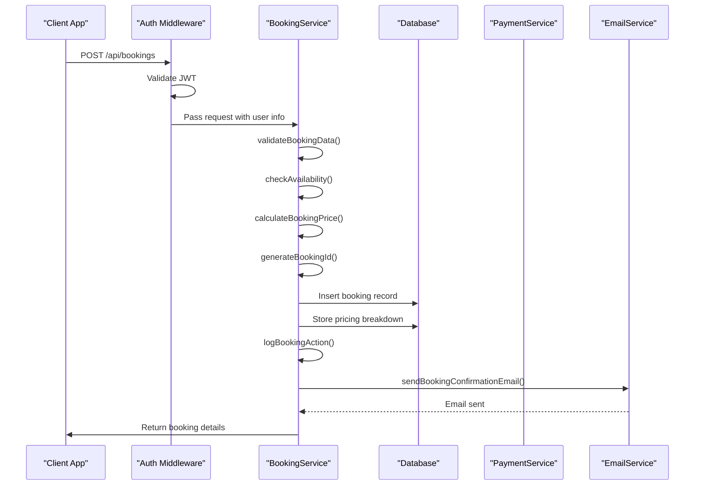
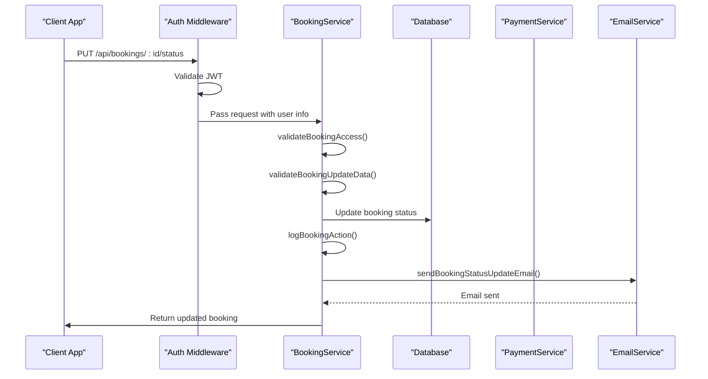

# Booking Endpoints

<cite>
**Referenced Files in This Document**   
- [BookingService.ts](file://src/server/services/BookingService.ts)
- [types.ts](file://src/shared/types.ts)
- [api-endpoints.test.ts](file://src/test/api-endpoints.test.ts)
</cite>

## Table of Contents
1. [Introduction](#introduction)
2. [API Endpoints Overview](#api-endpoints-overview)
3. [Request and Response Schema](#request-and-response-schema)
4. [Validation and Business Logic](#validation-and-business-logic)
5. [Authentication and Authorization](#authentication-and-authorization)
6. [Integration with Payment System](#integration-with-payment-system)
7. [Example Requests and Responses](#example-requests-and-responses)
8. [Sequence Diagrams](#sequence-diagrams)

## Introduction
This document provides comprehensive documentation for the booking system endpoints in the HabibiStay application. It covers the creation, retrieval, and management of bookings, including detailed information about request and response structures, validation rules, authentication requirements, and integration with external systems such as payment gateways. The booking system is designed to ensure data integrity, prevent double bookings, and provide a seamless user experience.

**Section sources**
- [BookingService.ts](file://src/server/services/BookingService.ts#L0-L821)
- [types.ts](file://src/shared/types.ts#L0-L600)

## API Endpoints Overview

### POST /api/bookings (Create a New Booking)
Creates a new booking with full validation of dates, guest information, and property availability.

### GET /api/bookings/user (Retrieve User's Bookings)
Retrieves all bookings associated with the authenticated user.

### GET /api/bookings/:id (Get Booking Details)
Retrieves detailed information about a specific booking by its ID.

### PUT /api/bookings/:id/status (Update Booking Status)
Updates the status of a booking (e.g., cancel, confirm) with role-based access control for admin/owner only.

**Section sources**
- [BookingService.ts](file://src/server/services/BookingService.ts#L68-L821)
- [api-endpoints.test.ts](file://src/test/api-endpoints.test.ts#L0-L582)

## Request and Response Schema

### Request Body Structure
The request body for creating a booking includes the following fields:

- **property_id**: The ID of the property being booked
- **check_in_date**: The check-in date in ISO format (YYYY-MM-DD)
- **check_out_date**: The check-out date in ISO format (YYYY-MM-DD)
- **guests**: Number of guests (1-20)
- **guest_name**: Full name of the guest
- **guest_email**: Valid email address of the guest
- **guest_phone**: Phone number of the guest
- **special_requests**: Optional special requests from the guest

### Response Schema
The response includes the following fields:

- **id**: Unique booking identifier
- **user_id**: ID of the user who made the booking
- **property_id**: ID of the booked property
- **guest_name**: Name of the guest
- **guest_email**: Email of the guest
- **guest_phone**: Phone number of the guest
- **check_in_date**: Check-in date
- **check_out_date**: Check-out date
- **guests**: Number of guests
- **total_amount**: Total amount charged for the booking
- **status**: Current status of the booking (pending, confirmed, cancelled)
- **payment_status**: Status of the payment
- **payment_id**: ID of the payment transaction
- **special_requests**: Special requests from the guest
- **created_at**: Timestamp when the booking was created
- **updated_at**: Timestamp when the booking was last updated
- **property_title**: Title of the booked property
- **property_location**: Location of the booked property
- **property_images**: Array of image URLs for the property
- **user_name**: Name of the user who made the booking
- **pricing_breakdown**: Detailed breakdown of the pricing

**Section sources**
- [types.ts](file://src/shared/types.ts#L0-L600)
- [BookingService.ts](file://src/server/services/BookingService.ts#L68-L821)

## Validation and Business Logic

### Date Validation
The system validates the following date-related rules:
- Check-in date cannot be in the past
- Check-out date must be after check-in date
- The property must be available for the requested dates (no overlapping bookings)

### Availability Check
The availability check is performed using the following SQL query:
```sql
SELECT * FROM bookings 
WHERE property_id = ? 
AND status IN ('confirmed', 'pending')
AND (
  (check_in_date <= ? AND check_out_date > ?) OR
  (check_in_date < ? AND check_out_date >= ?) OR
  (check_in_date >= ? AND check_out_date <= ?)
)
```

### Guest Limits
The number of guests must be between 1 and 20. This is validated both on the client and server side.

### Price Integrity
The total amount is calculated based on the following components:
- Base price per night
- Number of nights
- Service fee (12%)
- Taxes (15% VAT)
- Discounts (weekly or monthly stays)

**Section sources**
- [BookingService.ts](file://src/server/services/BookingService.ts#L68-L821)
- [types.ts](file://src/shared/types.ts#L0-L600)

## Authentication and Authorization

### JWT Authentication
All booking endpoints require JWT authentication. The token is passed in the Authorization header as a Bearer token.

### Role-Based Permissions
The PUT /api/bookings/:id/status endpoint has role-based access control:
- Only the booking guest, property owner, or admin can update a booking
- Admin users have full access to all bookings
- Property owners can manage bookings for their properties
- Regular users can only manage their own bookings

The access check is performed using the following logic:
```typescript
const booking = await this.db.get(`
  SELECT b.user_id, b.property_id, p.owner_id 
  FROM bookings b
  LEFT JOIN properties p ON b.property_id = p.id
  WHERE b.id = ?
`, [bookingId]);

const user = await this.db.get('SELECT role FROM users WHERE id = ?', [userId]);

// Allow access if user is the booking guest, property owner, or admin
if (booking.user_id !== userId && booking.owner_id !== userId && user?.role !== 'admin') {
  throw new Error('Access denied');
}
```

**Section sources**
- [BookingService.ts](file://src/server/services/BookingService.ts#L68-L821)
- [api-endpoints.test.ts](file://src/test/api-endpoints.test.ts#L0-L582)

## Integration with Payment System

### Payment Processing
When a booking is created, the system integrates with the payment gateway (MyFatoorah) to process the payment. The payment status is updated accordingly.

### Refund Processing
When a booking is cancelled, the system calculates the cancellation fee based on the flexible cancellation policy and processes the refund if applicable. The refund amount is calculated as:
- 0% fee if cancelled 7 or more days before check-in
- 10% fee if cancelled 1-6 days before check-in
- 50% fee if cancelled on or after the check-in date

The refund is processed through the payment gateway using the processRefund method of the PaymentService.

### Booking Status and Property Availability
The booking status directly affects property availability:
- When a booking is created with status "pending" or "confirmed", the property is marked as unavailable for those dates
- When a booking is cancelled, the property becomes available for those dates again
- The availability check excludes the current booking when updating dates to allow modifications to existing bookings

**Section sources**
- [BookingService.ts](file://src/server/services/BookingService.ts#L68-L821)
- [api-endpoints.test.ts](file://src/test/api-endpoints.test.ts#L0-L582)

## Example Requests and Responses

### Successful Booking Creation
```json
{
  "success": true,
  "data": {
    "id": "HBS12345678ABCD",
    "user_id": "test-user-id",
    "property_id": 1,
    "guest_name": "John Doe",
    "guest_email": "john@example.com",
    "guest_phone": "+966501234567",
    "check_in_date": "2024-12-01",
    "check_out_date": "2024-12-05",
    "guests": 2,
    "total_amount": 1150,
    "status": "pending",
    "payment_status": "pending",
    "special_requests": "Early check-in if possible",
    "created_at": "2024-11-15T10:30:00Z",
    "updated_at": "2024-11-15T10:30:00Z",
    "property_title": "Luxury Apartment",
    "property_location": "Riyadh",
    "property_images": ["image1.jpg", "image2.jpg"],
    "user_name": "John Doe",
    "pricing_breakdown": {
      "base_price": 250,
      "nights": 4,
      "subtotal": 1000,
      "service_fee": 120,
      "taxes": 180,
      "discounts": 0,
      "total_amount": 1150,
      "breakdown": {
        "nightlyRate": 250,
        "cleaningFee": 0,
        "serviceFee": 120,
        "taxes": 180,
        "discounts": []
      }
    }
  }
}
```

### Error Response for Invalid Date Range
```json
{
  "success": false,
  "error": "Invalid date range"
}
```

### curl Command for Creating a Booking
```bash
curl -X POST https://api.habibistay.com/api/bookings \
  -H "Authorization: Bearer YOUR_JWT_TOKEN" \
  -H "Content-Type: application/json" \
  -d '{
    "property_id": 1,
    "check_in_date": "2024-12-01",
    "check_out_date": "2024-12-05",
    "guests": 2,
    "guest_name": "John Doe",
    "guest_email": "john@example.com",
    "guest_phone": "+966501234567",
    "special_requests": "Early check-in if possible"
  }'
```

**Section sources**
- [api-endpoints.test.ts](file://src/test/api-endpoints.test.ts#L0-L582)
- [BookingService.ts](file://src/server/services/BookingService.ts#L68-L821)

## Sequence Diagrams



**Diagram sources**
- [BookingService.ts](file://src/server/services/BookingService.ts#L68-L821)
- [api-endpoints.test.ts](file://src/test/api-endpoints.test.ts#L0-L582)



**Diagram sources**
- [BookingService.ts](file://src/server/services/BookingService.ts#L68-L821)
- [api-endpoints.test.ts](file://src/test/api-endpoints.test.ts#L0-L582)