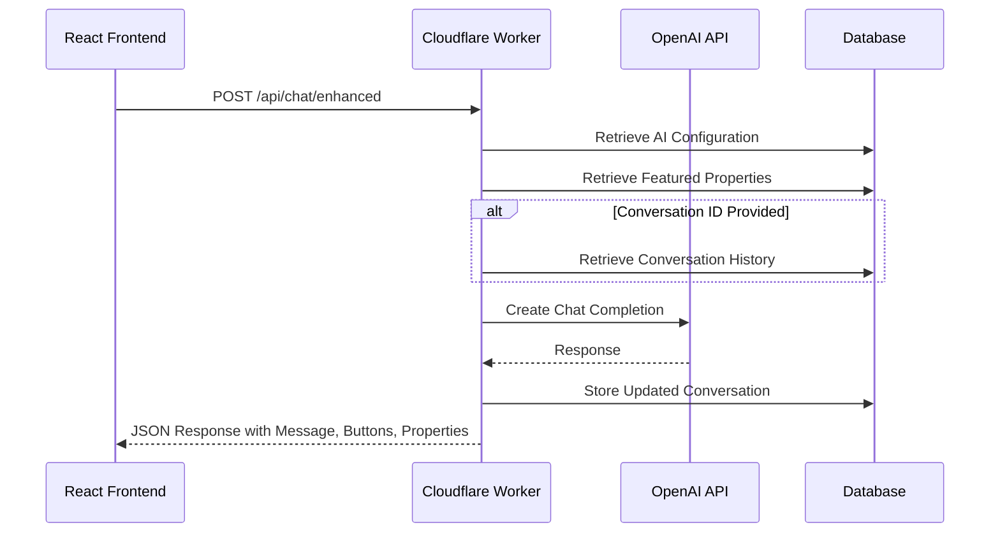
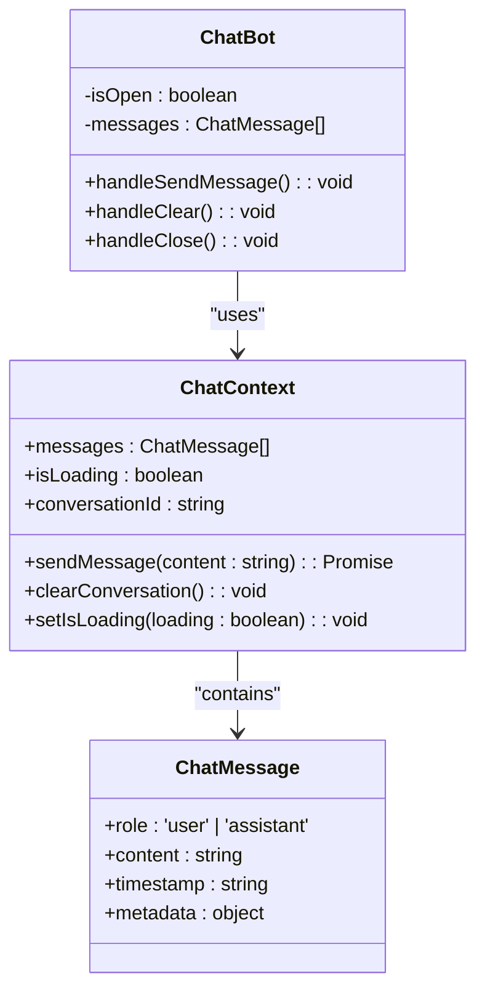

# Chat Endpoints

<cite>
**Referenced Files in This Document**   
- [ChatContext.tsx](file://src/react-app/contexts/ChatContext.tsx)
- [ChatBot.tsx](file://src/react-app/components/ChatBot.tsx)
- [index.ts](file://src/worker/index.ts)
- [AIConfigPanel.tsx](file://src/react-app/components/admin/AIConfigPanel.tsx)
</cite>

## Table of Contents
1. [Introduction](#introduction)
2. [Core API Endpoint](#core-api-endpoint)
3. [Request Structure](#request-structure)
4. [Response Format](#response-format)
5. [Authentication and User Association](#authentication-and-user-association)
6. [Rate Limiting and Abuse Prevention](#rate-limiting-and-abuse-prevention)
7. [Chat Context Management](#chat-context-management)
8. [Prompt Engineering and AI Configuration](#prompt-engineering-and-ai-configuration)
9. [Frontend Integration and Streaming](#frontend-integration-and-streaming)
10. [Error Handling](#error-handling)
11. [Security Considerations](#security-considerations)
12. [Testing and Administration](#testing-and-administration)

## Introduction
This document provides comprehensive documentation for the AI chatbot API endpoints in the HabibiStay application, which leverages OpenAI's GPT-4o-mini model to power conversational interactions. The chat system enables guests to discover properties, receive recommendations, and get assistance with bookings through a natural language interface. The primary endpoint, POST /api/chat/enhanced, supports message history persistence through conversation IDs and delivers rich responses with interactive elements. The system is designed with security, scalability, and user experience in mind, incorporating JWT authentication, rate limiting, and dynamic prompt engineering based on configurable AI personalities.

## Core API Endpoint
The primary chat endpoint processes user messages and returns AI-generated responses with contextual awareness of available properties and user intent.



**Diagram sources**
- [index.ts](file://src/worker/index.ts#L1650-L1849)
- [ChatContext.tsx](file://src/react-app/contexts/ChatContext.tsx#L189-L219)

**Section sources**
- [index.ts](file://src/worker/index.ts#L1650-L1849)
- [ChatContext.tsx](file://src/react-app/contexts/ChatContext.tsx#L189-L219)

## Request Structure
The chat endpoint accepts a JSON payload with user message and conversation context.

**Request Schema**
- message: string (required) - The user's text input
- conversation_id: string (optional) - Session identifier for message history

**Sample Request Body**
```json
{
  "message": "Can you recommend a luxury property for 4 guests?",
  "conversation_id": "session_12345"
}
```

**curl Command**
```bash
curl -X POST https://habibistay.com/api/chat/enhanced \
  -H "Content-Type: application/json" \
  -d '{
    "message": "Hello! I need a property for 2 guests in Riyadh.",
    "conversation_id": "session_abc123"
  }'
```

**Section sources**
- [index.ts](file://src/worker/index.ts#L1650-L1849)
- [ChatContext.tsx](file://src/react-app/contexts/ChatContext.tsx#L189-L219)

## Response Format
The API returns a structured JSON response containing the AI message, conversation context, and interactive elements.

**Response Structure**
- success: boolean - Indicates request success
- data: object - Contains response payload
  - message: string - AI-generated text response
  - conversation_id: string - Session identifier (new or existing)
  - buttons: array - Interactive action buttons
  - featured_properties: array - Relevant property listings

**Sample Response**
```json
{
  "success": true,
  "data": {
    "message": "I'd be happy to help you find a perfect stay! Here are some excellent options for 4 guests:",
    "conversation_id": "session_12345",
    "buttons": [
      {
        "id": "search_properties",
        "text": "🏠 Browse Properties",
        "action": "search",
        "style": "primary"
      },
      {
        "id": "check_availability",
        "text": "📅 Check Availability",
        "action": "availability",
        "style": "secondary"
      }
    ],
    "featured_properties": [
      {
        "id": "prop_001",
        "title": "Luxury Villa in Diplomatic Quarter",
        "location": "Riyadh",
        "price_per_night": 1200,
        "max_guests": 6,
        "description": "Spacious villa with private pool and modern amenities"
      }
    ]
  }
}
```

**Section sources**
- [index.ts](file://src/worker/index.ts#L1750-L1849)

## Authentication and User Association
The chat system uses JWT-based authentication to associate conversations with authenticated users.

**Authentication Flow**
1. Users authenticate via Google OAuth
2. Server issues JWT containing user identity
3. JWT is included in Authorization header for chat requests
4. Backend verifies JWT and associates conversation with user ID

**User Data in Context**
- User authentication is required for personalized experiences
- Conversation history is linked to user sessions
- User preferences and booking history can influence recommendations
- Admin users have access to AI configuration endpoints

**Section sources**
- [index.ts](file://src/worker/index.ts#L1650-L1849)
- [ChatContext.tsx](file://src/react-app/contexts/ChatContext.tsx#L189-L219)

## Rate Limiting and Abuse Prevention
The API implements rate limiting to prevent abuse and ensure fair usage.

**Rate Limit Configuration**
- Standard users: 10 messages per minute
- Implemented using rateLimitMiddleware in API routes
- Prevents excessive API calls that could impact performance
- Protects against automated scraping or denial-of-service attacks

**Implementation Details**
- Rate limiting is applied to authenticated endpoints
- Counter resets every 60 seconds
- Excessive requests return 429 Too Many Requests status
- Admin endpoints have higher limits (100 requests per 10 minutes)

**Section sources**
- [index.ts](file://src/worker/index.ts#L850-L949)

## Chat Context Management
The application maintains conversation state using the ChatContext React context and database persistence.



**Diagram sources**
- [ChatContext.tsx](file://src/react-app/contexts/ChatContext.tsx)
- [ChatBot.tsx](file://src/react-app/components/ChatBot.tsx)

**Section sources**
- [ChatContext.tsx](file://src/react-app/contexts/ChatContext.tsx)
- [ChatBot.tsx](file://src/react-app/components/ChatBot.tsx)

## Prompt Engineering and AI Configuration
The system uses dynamic prompt engineering to customize the AI assistant's behavior based on configurable parameters.

**AI Configuration Parameters**
- model_provider: 'openai' - AI service provider
- model_name: 'gpt-4o-mini' - Specific model to use
- temperature: 0.7 - Creativity vs. determinism (0-1)
- max_tokens: 1000 - Maximum response length
- personality: 'friendly' | 'professional' | 'casual' - Tone of voice
- language: 'en' - Response language
- system_prompt: string - Custom instructions for AI

**Dynamic System Prompt**
The system constructs a context-aware prompt that includes:
- AI personality and brand guidelines
- Current featured properties with details
- Instructions for interactive response formatting
- Cultural context for Saudi Arabia market

**Section sources**
- [index.ts](file://src/worker/index.ts#L1550-L1749)
- [AIConfigPanel.tsx](file://src/react-app/components/admin/AIConfigPanel.tsx)

## Frontend Integration and Streaming
The React frontend integrates with the chat API to provide a responsive user experience.

**Integration Workflow**
1. User types message in ChatBot component
2. sendMessage function called with message content
3. Request sent to /api/chat/enhanced with conversation ID
4. Response received and added to message history
5. UI updates with AI response and interactive buttons

**Streaming Considerations**
- Current implementation uses standard HTTP response (not streaming)
- Responses are delivered as complete JSON objects
- Loading state displayed during request processing
- Future enhancement could implement SSE for true streaming

**Section sources**
- [ChatContext.tsx](file://src/react-app/contexts/ChatContext.tsx#L189-L219)
- [ChatBot.tsx](file://src/react-app/components/ChatBot.tsx)

## Error Handling
The system implements comprehensive error handling for various failure scenarios.

**Error Types and Responses**
- **401 Unauthorized**: User not authenticated
- **403 Forbidden**: Insufficient permissions
- **400 Bad Request**: Invalid input parameters
- **429 Too Many Requests**: Rate limit exceeded
- **500 Internal Server Error**: Backend processing failure
- **503 Service Unavailable**: AI provider outage

**Client-Side Error Management**
- Network errors caught and displayed to users
- Loading states prevent duplicate submissions
- Clear error messages guide user recovery
- Conversation state preserved during errors

**Section sources**
- [index.ts](file://src/worker/index.ts#L1650-L1849)
- [ChatContext.tsx](file://src/react-app/contexts/ChatContext.tsx#L189-L219)

## Security Considerations
The chat system incorporates multiple security measures to protect user data and system integrity.

**Data Protection Measures**
- Chat logs stored in encrypted database
- Conversation history associated with authenticated users only
- JWT tokens with limited expiration
- Input validation to prevent injection attacks
- Environment variables for API keys

**Privacy and Compliance**
- Chat logs retained for service improvement
- Users can clear conversation history
- No personally identifiable information stored in chat messages
- Compliance with Saudi data protection regulations
- Regular security audits and penetration testing

**Section sources**
- [index.ts](file://src/worker/index.ts)
- [ChatContext.tsx](file://src/react-app/contexts/ChatContext.tsx)