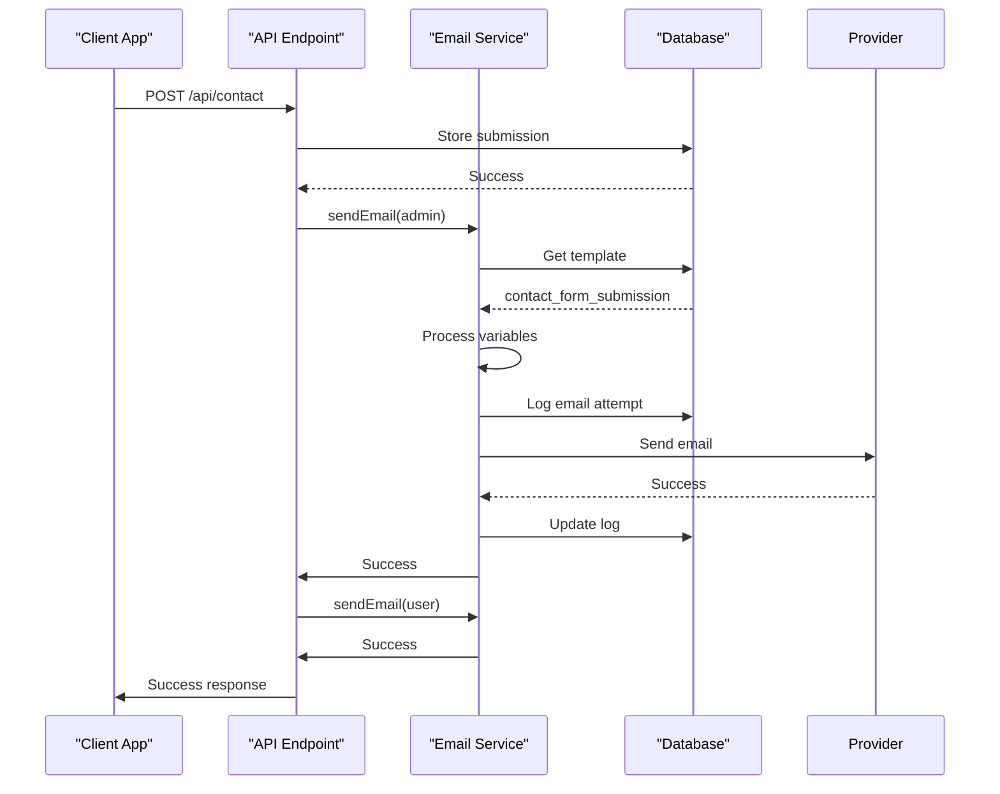

# Marketing Endpoints

<cite>
**Referenced Files in This Document**   
- [index.ts](file://src/worker/index.ts#L1490-L1584)
- [index.ts](file://src/worker/index.ts#L1786-L1821)
- [index.ts](file://src/worker/index.ts#L80-L120)
- [security-utils.ts](file://src/shared/security-utils.ts#L40-L95)
- [Contact.tsx](file://src/react-app/pages/Contact.tsx#L0-L34)
- [Invest.tsx](file://src/react-app/pages/Invest.tsx#L0-L290)
</cite>

## Table of Contents
1. [Introduction](#introduction)
2. [Contact Form Endpoint](#contact-form-endpoint)
3. [Newsletter Subscription Endpoint](#newsletter-subscription-endpoint)
4. [Investment Inquiry Integration](#investment-inquiry-integration)
5. [Backend Processing and Email Notifications](#backend-processing-and-email-notifications)
6. [Security Measures](#security-measures)
7. [Request and Response Examples](#request-and-response-examples)
8. [Testing with curl](#testing-with-curl)

## Introduction
This document provides comprehensive documentation for the marketing and communication endpoints of the HabibiStay application. These endpoints facilitate user engagement through contact forms, newsletter subscriptions, and investment inquiries. The implementation focuses on robust validation, secure processing, and effective communication via email notifications. The endpoints are designed to support business growth by capturing leads and maintaining user relationships while adhering to security best practices and data privacy standards.

## Contact Form Endpoint

### Endpoint Details
- **URL**: `POST /api/contact`
- **Purpose**: Handles submissions from the website's contact form, capturing user inquiries and routing them to administrative staff.

### Request Validation
The endpoint implements server-side validation to ensure data integrity:
- **Required fields**: name, email, interest, message
- **Email format**: Basic regex validation (`/\S+@\S+\.\S+/`)
- **Field presence**: All required fields must be present in the request body

The validation occurs immediately upon request receipt:
```typescript
if (!name || !email || !interest || !message) {
  return c.json<ApiResponse>({
    success: false,
    error: "Required fields missing",
  }, 400);
}
```

### Data Storage
Upon successful validation, submission data is stored in the `contact_submissions` table:
```sql
INSERT INTO contact_submissions (name, email, phone, interest, message, created_at)
VALUES (?, ?, ?, ?, ?, CURRENT_TIMESTAMP)
```

The database schema includes:
- **id**: Primary key, auto-incrementing
- **name**: Text, not null
- **email**: Text, not null
- **phone**: Text, nullable
- **interest**: Text, not null
- **message**: Text, not null
- **status**: Text, default 'new'
- **created_at**: DATETIME, default current timestamp

### Processing Flow
The contact form submission follows a sequential processing pattern:
1. Validate incoming request data
2. Store submission in database
3. Send notification email to admin
4. Send confirmation email to user
5. Return success response

**Section sources**
- [index.ts](file://src/worker/index.ts#L1490-L1584)

## Newsletter Subscription Endpoint

### Endpoint Details
- **URL**: `POST /api/newsletter/subscribe`
- **Purpose**: Manages newsletter subscriptions, allowing users to opt-in to marketing communications.

### Request Validation
The endpoint includes specific validation rules:
- **Email requirement**: Email field must be present
- **Email format**: Validated using regex (`/\S+@\S+\.\S+/`)
- **Duplicate prevention**: Checks for existing active subscriptions

```typescript
if (!email || !/\S+@\S+\.\S+/.test(email)) {
  return c.json<ApiResponse>({
    success: false,
    error: "Valid email address required",
  }, 400);
}
```

### Subscription Logic
The endpoint implements the following business logic:
1. Validate email format
2. Check for existing active subscription
3. If duplicate found, return error response
4. If new subscriber, create subscription record
5. Send welcome email with unsubscribe link
6. Return success response

```typescript
// Check if already subscribed
const existing = await c.env.DB.prepare(
  "SELECT id FROM newsletter_subscriptions WHERE email = ? AND is_active = 1"
).bind(email).first();

if (existing) {
  return c.json<ApiResponse>({
    success: false,
    error: "Email already subscribed",
  }, 400);
}
```

### Data Storage
Subscription data is stored in the `newsletter_subscriptions` table:
```sql
INSERT OR REPLACE INTO newsletter_subscriptions (email, source, is_active, subscribed_at)
VALUES (?, ?, 1, CURRENT_TIMESTAMP)
```

The schema includes:
- **id**: Primary key, auto-incrementing
- **email**: Text, not null, unique
- **source**: Text, default 'website'
- **is_active**: Boolean, default 1
- **subscribed_at**: DATETIME, default current timestamp
- **unsubscribed_at**: DATETIME, nullable
- **created_at**: DATETIME, default current timestamp
- **updated_at**: DATETIME, default current timestamp

### Welcome Email
Successful subscriptions trigger a welcome email containing:
- Personalized greeting
- Confirmation of subscription
- Unsubscribe URL with encoded email parameter
- Brand information and support details

**Section sources**
- [index.ts](file://src/worker/index.ts#L1786-L1821)

## Investment Inquiry Integration

### Frontend Implementation
The investment inquiry functionality is implemented through the `/invest` page, which provides information about investment opportunities but does not include a direct form submission endpoint.

The `Invest.tsx` component displays:
- Investment types (Capital Investor, International Investor, Buy-to-Let Investor)
- Key advantages and metrics
- Investment process steps
- Market opportunity information
- Call-to-action buttons

### Inquiry Flow
Users interested in property investment are directed to use alternative channels:
- **Schedule Consultation**: Links to `/contact` page
- **Request Investor Deck**: Links to `/contact` page
- **Market Insights**: Links to `/blog` page

```tsx
<Link
  to="/contact"
  className="bg-white text-[#2957c3] px-8 py-4 rounded-lg font-semibold hover:bg-gray-100 transition-colors inline-flex items-center justify-center"
>
  Request Investor Deck <ArrowRight className="ml-2 h-5 w-5" />
</Link>
```

### User Journey
The investment inquiry process follows this user journey:
1. User visits `/invest` page to learn about opportunities
2. User selects appropriate call-to-action based on interest
3. User is redirected to `/contact` page
4. User fills out contact form with investment inquiry
5. Form submission is processed by `/api/contact` endpoint

This approach consolidates all inquiry types through a single, well-maintained contact endpoint rather than creating separate endpoints for each inquiry type.

**Section sources**
- [Invest.tsx](file://src/react-app/pages/Invest.tsx#L0-L290)

## Backend Processing and Email Notifications

### Email Service Architecture
The application uses a modular email service implementation that supports template-based messaging. The service is designed to be extensible for various email providers.

### Email Template System
Email templates are stored in the database with the following structure:
- **template_key**: Unique identifier for the template
- **subject**: Email subject line
- **html_content**: HTML body content
- **variables**: JSON string of available variables
- **is_active**: Boolean flag for template status

Templates are initialized via the `/api/admin/init-email-templates` endpoint, which inserts predefined templates into the database.

### Email Sending Process
The email sending process follows this sequence:
1. Retrieve template from database by template_key
2. Process template variables (replace placeholders)
3. Log email attempt in email_logs table
4. Send email via provider interface
5. Update log with final status



**Diagram sources**
- [index.ts](file://src/worker/index.ts#L1490-L1584)
- [index.ts](file://src/worker/index.ts#L80-L120)

### Template Processing
The system supports variable replacement in templates using double curly brace syntax (`{{variable}}`). Default variables are automatically included:
- **site_name**: "HabibiStay"
- **site_url**: "https://habibistay.com"
- **support_email**: "support@habibistay.com"
- **current_year**: Current year

### Email Types
The marketing endpoints utilize the following email templates:
- **contact_form_submission**: Notification to admin
- **contact_form_confirmation**: Confirmation to user
- **newsletter_welcome**: Welcome email for subscribers

Each template serves a specific purpose in the user communication workflow, ensuring timely notifications and confirmations.

**Section sources**
- [index.ts](file://src/worker/index.ts#L80-L120)

## Security Measures

### Rate Limiting
The application implements rate limiting to prevent abuse and denial-of-service attacks. The rate limiter is configured with:
- **Default limit**: 100 requests per 15 minutes
- **Configurable parameters**: Maximum requests and window duration

The implementation uses an in-memory map to track request counts by identifier:
```typescript
class RateLimiter {
  private requests = new Map<string, { count: number; resetTime: number }>();
  
  constructor(
    private maxRequests: number = 100,
    private windowMs: number = 15 * 60 * 1000 // 15 minutes
  ) {}
  
  isAllowed(identifier: string): boolean {
    const now = Date.now();
    const userRequests = this.requests.get(identifier);
    
    if (!userRequests || now > userRequests.resetTime) {
      this.requests.set(identifier, {
        count: 1,
        resetTime: now + this.windowMs
      });
      return true;
    }
    
    if (userRequests.count >= this.maxRequests) {
      return false;
    }
    
    userRequests.count++;
    return true;
  }
}
```

### Spam Prevention
The current implementation includes basic spam prevention measures:
- **Field validation**: Ensures required fields are present
- **Email format validation**: Uses regex to validate email structure
- **Duplicate detection**: Prevents multiple newsletter subscriptions

The code includes placeholders for more advanced spam prevention:
```typescript
// This is a placeholder for actual email service integration
// You would integrate with services like:
// - Resend (resend.com)
// - SendGrid
// - Amazon SES
// - Mailgun
```

Future enhancements could include CAPTCHA integration or honeypot fields to further reduce automated spam submissions.

### GDPR Compliance
The system incorporates several GDPR-compliant data handling practices:
- **Newsletter unsubscribe**: All welcome emails include an unsubscribe URL
- **Data minimization**: Only necessary fields are collected
- **Data retention**: Submission data is stored with timestamps
- **User rights**: The architecture supports data access and deletion operations

The newsletter subscription table includes explicit fields for compliance:
- **is_active**: Allows for soft deletion of subscriptions
- **unsubscribed_at**: Tracks when users opt-out
- **subscribed_at**: Records consent timestamp

### Input Sanitization
The application employs input sanitization to prevent XSS and other injection attacks:
- **HTML escaping**: Special characters are converted to HTML entities
- **String sanitization**: Removes or replaces potentially harmful characters
- **Parameterized queries**: Prevents SQL injection through prepared statements

The `sanitizeHtml` utility function handles basic HTML sanitization:
```typescript
export function sanitizeHtml(input: string): string {
  if (typeof input !== 'string') return '';
  
  return input
    .replace(/</g, '&lt;')
    .replace(/>/g, '&gt;')
    .replace(/"/g, '&quot;')
    .replace(/'/g, '&#x27;')
    .replace(/\//g, '&#x2F;');
}
```

**Section sources**
- [security-utils.ts](file://src/shared/security-utils.ts#L40-L95)

## Request and Response Examples

### Contact Form Submission
**Request**:
```json
{
  "name": "John Doe",
  "email": "john.doe@example.com",
  "phone": "+1234567890",
  "interest": "Property Investment",
  "message": "I'm interested in learning more about investment opportunities in Riyadh."
}
```

**Success Response**:
```json
{
  "success": true,
  "message": "Contact form submitted successfully"
}
```

**Validation Error Response**:
```json
{
  "success": false,
  "error": "Required fields missing"
}
```

### Newsletter Subscription
**Request**:
```json
{
  "email": "jane.smith@example.com",
  "source": "invest_page"
}
```

**Success Response**:
```json
{
  "success": true,
  "message": "Successfully subscribed to newsletter"
}
```

**Duplicate Subscription Response**:
```json
{
  "success": false,
  "error": "Email already subscribed"
}
```

**Invalid Email Response**:
```json
{
  "success": false,
  "error": "Valid email address required"
}
```

### Database Schema Examples
**Contact Submissions Table**:
```sql
CREATE TABLE contact_submissions (
  id INTEGER PRIMARY KEY AUTOINCREMENT,
  name TEXT NOT NULL,
  email TEXT NOT NULL,
  phone TEXT,
  interest TEXT NOT NULL,
  message TEXT NOT NULL,
  status TEXT DEFAULT 'new',
  created_at DATETIME DEFAULT CURRENT_TIMESTAMP,
  updated_at DATETIME DEFAULT CURRENT_TIMESTAMP
);
```

**Newsletter Subscriptions Table**:
```sql
CREATE TABLE newsletter_subscriptions (
  id INTEGER PRIMARY KEY AUTOINCREMENT,
  email TEXT NOT NULL UNIQUE,
  source TEXT DEFAULT 'website',
  is_active BOOLEAN DEFAULT 1,
  subscribed_at DATETIME DEFAULT CURRENT_TIMESTAMP,
  unsubscribed_at DATETIME,
  created_at DATETIME DEFAULT CURRENT_TIMESTAMP,
  updated_at DATETIME DEFAULT CURRENT_TIMESTAMP
);
```

**Section sources**
- [index.ts](file://src/worker/index.ts#L1490-L1584)
- [index.ts](file://src/worker/index.ts#L1786-L1821)

## Testing with curl

### Testing Contact Endpoint
Submit a test contact form:
```bash
curl -X POST https://api.habibistay.com/api/contact \
  -H "Content-Type: application/json" \
  -d '{
    "name": "Test User",
    "email": "test@example.com",
    "interest": "General Inquiry",
    "message": "This is a test message from curl."
  }'
```

Expected success response:
```json
{"success":true,"message":"Contact form submitted successfully"}
```

Test missing required fields:
```bash
curl -X POST https://api.habibistay.com/api/contact \
  -H "Content-Type: application/json" \
  -d '{
    "name": "Test User",
    "email": "test@example.com"
  }'
```

Expected error response:
```json
{"success":false,"error":"Required fields missing"}
```

### Testing Newsletter Endpoint
Subscribe to newsletter:
```bash
curl -X POST https://api.habibistay.com/api/newsletter/subscribe \
  -H "Content-Type: application/json" \
  -d '{
    "email": "test.subscriber@example.com",
    "source": "curl_test"
  }'
```

Expected success response:
```json
{"success":true,"message":"Successfully subscribed to newsletter"}
```

Test duplicate subscription:
```bash
curl -X POST https://api.habibistay.com/api/newsletter/subscribe \
  -H "Content-Type: application/json" \
  -d '{
    "email": "test.subscriber@example.com"
  }'
```

Expected error response:
```json
{"success":false,"error":"Email already subscribed"}
```

Test invalid email:
```bash
curl -X POST https://api.habibistay.com/api/newsletter/subscribe \
  -H "Content-Type: application/json" \
  -d '{
    "email": "invalid-email"
  }'
```

Expected error response:
```json
{"success":false,"error":"Valid email address required"}
```

### Testing with Rate Limiting
To test rate limiting, send multiple requests in quick succession:
```bash
# Send 101 requests within 15 minutes to trigger rate limiting
for i in {1..101}; do
  curl -X POST https://api.habibistay.com/api/newsletter/subscribe \
    -H "Content-Type: application/json" \
    -d "{\"email\": \"test$i@example.com\"}" \
    -w "Response code: %{http_code}\n" \
    -o /dev/null
done
```

After exceeding the rate limit, subsequent requests will be blocked until the window resets.

**Section sources**
- [index.ts](file://src/worker/index.ts#L1490-L1584)
- [index.ts](file://src/worker/index.ts#L1786-L1821)