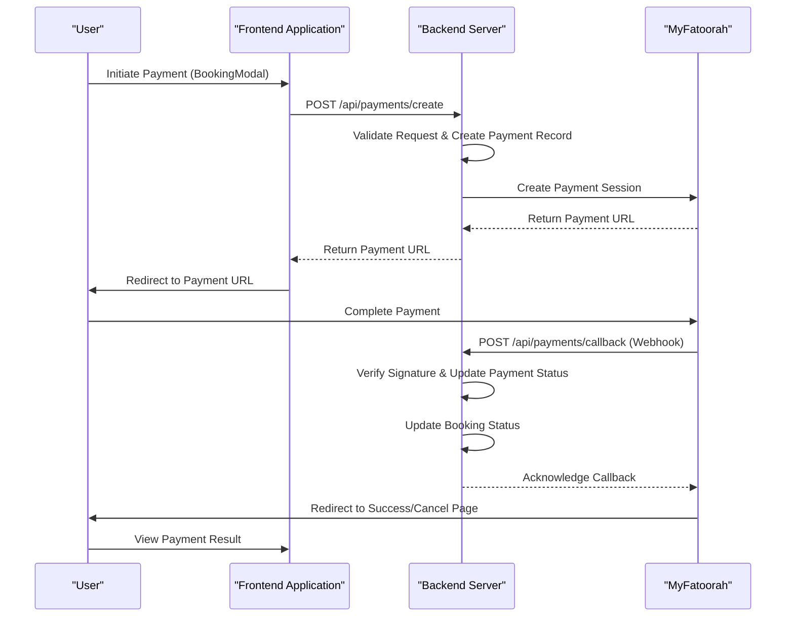
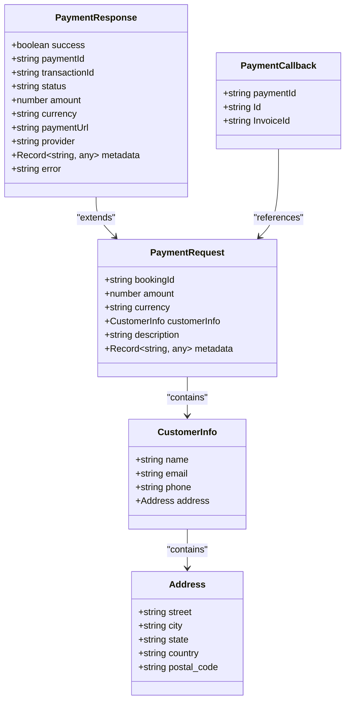
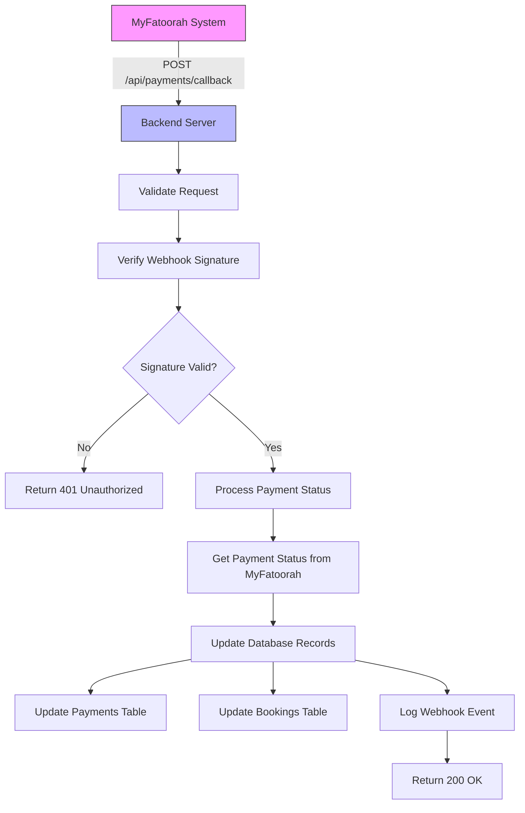
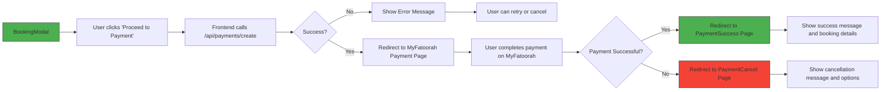
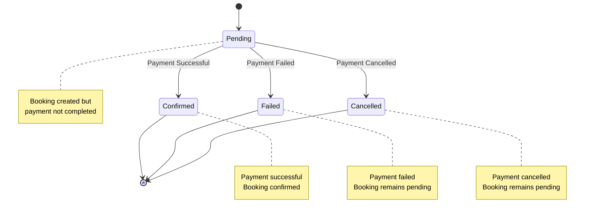

# Payment Endpoints

<cite>
**Referenced Files in This Document**   
- [PaymentService.ts](file://src/server/services/PaymentService.ts)
- [payment.ts](file://src/shared/payment.ts)
- [PaymentModal.tsx](file://src/react-app/components/PaymentModal.tsx)
- [PaymentSuccess.tsx](file://src/react-app/pages/PaymentSuccess.tsx)
- [PaymentCancel.tsx](file://src/react-app/pages/PaymentCancel.tsx)
- [index.ts](file://src/worker/index.ts)
</cite>

## Table of Contents
1. [Introduction](#introduction)
2. [Payment Flow Overview](#payment-flow-overview)
3. [API Endpoints](#api-endpoints)
   - [POST /api/payments/create](#post-apipaymentscreate)
   - [POST /api/payments/callback](#post-apipaymentscallback)
   - [GET /api/payments/:id](#get-apipaymentsid)
4. [Request and Response Schemas](#request-and-response-schemas)
5. [Server-to-Server Callback Mechanism](#server-to-server-callback-mechanism)
6. [Authentication Requirements](#authentication-requirements)
7. [JSON Examples](#json-examples)
8. [Testing with cURL](#testing-with-curl)
9. [User Interface Flow](#user-interface-flow)
10. [Payment Status and Booking Updates](#payment-status-and-booking-updates)

## Introduction
This document provides comprehensive API documentation for payment processing endpoints integrated with MyFatoorah in the HabibiStay application. The documentation covers the complete payment lifecycle including payment initiation, server-to-server callback handling, and payment status retrieval. The system supports multiple payment providers with MyFatoorah as the primary integration.

## Payment Flow Overview
The payment processing system follows a standard e-commerce payment flow with a focus on security and reliability. The process begins with a booking reference and initiates a payment session through MyFatoorah. Upon completion, a server-to-server callback updates the payment status, which in turn updates the booking record. The system handles success, failure, and cancellation scenarios with appropriate user feedback.



**Diagram sources**
- [PaymentService.ts](file://src/server/services/PaymentService.ts)
- [PaymentModal.tsx](file://src/react-app/components/PaymentModal.tsx)
- [index.ts](file://src/worker/index.ts)

**Section sources**
- [PaymentService.ts](file://src/server/services/PaymentService.ts)
- [PaymentModal.tsx](file://src/react-app/components/PaymentModal.tsx)
- [index.ts](file://src/worker/index.ts)

## API Endpoints

### POST /api/payments/create
Initiates a payment session with a booking reference. This endpoint creates a payment record in the database and returns a redirect URL to the MyFatoorah payment gateway.

**Request Parameters**
- **booking_id**: Unique identifier for the booking (required)
- **amount**: Payment amount in decimal format (required, must be positive)
- **currency**: Currency code (required, e.g., SAR, USD)
- **customerInfo**: Object containing customer details
  - **name**: Customer's full name (required)
  - **email**: Customer's email address (required)
  - **phone**: Customer's phone number
- **description**: Description of the payment/booking
- **metadata**: Additional key-value pairs for storing contextual information

**Authentication**: JWT token required in Authorization header

**Section sources**
- [PaymentService.ts](file://src/server/services/PaymentService.ts#L108-L147)
- [PaymentModal.tsx](file://src/react-app/components/PaymentModal.tsx#L49-L63)

### POST /api/payments/callback
Secure webhook endpoint that receives payment status updates from MyFatoorah. This server-to-server callback mechanism ensures payment status is updated reliably.

**Request Parameters**
- **paymentId**: Internal payment identifier
- **Id**: MyFatoorah payment identifier
- **InvoiceId**: MyFatoorah invoice identifier

**Security Requirements**
- Signature verification to prevent spoofing
- Idempotency handling to prevent duplicate processing
- HTTPS required

**Section sources**
- [index.ts](file://src/worker/index.ts#L1113-L1152)
- [PaymentService.ts](file://src/server/services/PaymentService.ts#L79-L855)

### GET /api/payments/:id
Retrieves detailed information about a specific payment using its unique identifier.

**Path Parameters**
- **id**: Payment identifier (required)

**Response Schema**
- **paymentId**: Internal payment identifier
- **transactionId**: MyFatoorah transaction identifier
- **status**: Current payment status (pending, completed, failed, cancelled)
- **amount**: Payment amount
- **currency**: Currency code
- **paymentUrl**: URL for payment redirection (if applicable)
- **provider**: Payment provider (e.g., myfatoorah)
- **metadata**: Additional information stored with the payment

**Authentication**: JWT token required in Authorization header

**Section sources**
- [PaymentService.ts](file://src/server/services/PaymentService.ts#L79-L855)

## Request and Response Schemas
The payment system uses standardized schemas for request validation and response formatting. These schemas ensure data consistency across the application.



**Diagram sources**
- [payment.ts](file://src/shared/payment.ts)
- [PaymentService.ts](file://src/server/services/PaymentService.ts)

**Section sources**
- [payment.ts](file://src/shared/payment.ts#L0-L165)

## Server-to-Server Callback Mechanism
The server-to-server callback mechanism ensures reliable payment status updates through a secure webhook system. This process is critical for maintaining data consistency between the application and payment provider.



**Diagram sources**
- [index.ts](file://src/worker/index.ts#L1113-L1209)
- [PaymentService.ts](file://src/server/services/PaymentService.ts#L79-L855)

**Section sources**
- [index.ts](file://src/worker/index.ts#L1113-L1209)
- [PaymentService.ts](file://src/server/services/PaymentService.ts#L79-L855)

## Authentication Requirements
The payment endpoints have specific authentication requirements to ensure security and data protection.

- **Frontend API calls**: Require JWT token in Authorization header
- **Server-to-server callbacks**: Require signature verification using provider-specific secrets
- **Payment creation**: Authenticated user session required
- **Payment retrieval**: User must have permission to view the payment

The system implements additional security measures including:
- Input validation for all parameters
- Rate limiting on public endpoints
- HTTPS enforcement for all payment-related communications
- Secure storage of sensitive data

**Section sources**
- [PaymentService.ts](file://src/server/services/PaymentService.ts#L79-L855)
- [index.ts](file://src/worker/index.ts#L1113-L1209)

## JSON Examples

### Payment Initiation Request
```json
{
  "booking_id": "BKG-2023-001",
  "amount": 1250.50,
  "currency": "SAR",
  "customerInfo": {
    "name": "John Doe",
    "email": "john.doe@example.com",
    "phone": "+966501234567"
  },
  "description": "HabibiStay Booking - Deluxe Room",
  "metadata": {
    "property_id": "PROP-001",
    "check_in": "2023-12-01",
    "check_out": "2023-12-05"
  }
}
```

### Callback Payload
```json
{
  "paymentId": "PAY_1678901234_abc123xyz",
  "Id": "PAY-1234567890",
  "InvoiceId": "INV-9876543210"
}
```

### Payment Response
```json
{
  "success": true,
  "paymentId": "PAY_1678901234_abc123xyz",
  "transactionId": "INV-9876543210",
  "status": "pending",
  "amount": 1250.50,
  "currency": "SAR",
  "paymentUrl": "https://pay.myfatoorah.com/invoice/abc123xyz",
  "provider": "myfatoorah",
  "metadata": {
    "invoiceId": 9876543210,
    "invoiceStatus": "Pending"
  }
}
```

**Section sources**
- [payment.ts](file://src/shared/payment.ts#L0-L165)
- [PaymentService.ts](file://src/server/services/PaymentService.ts#L285-L319)

## Testing with cURL
The following cURL example demonstrates how to test the payment creation endpoint:

```bash
curl -X POST https://api.habibistay.com/api/payments/create \
  -H "Authorization: Bearer YOUR_JWT_TOKEN" \
  -H "Content-Type: application/json" \
  -d '{
    "booking_id": "BKG-2023-001",
    "amount": 1250.50,
    "currency": "SAR",
    "customerInfo": {
      "name": "John Doe",
      "email": "john.doe@example.com",
      "phone": "+966501234567"
    },
    "description": "HabibiStay Booking - Deluxe Room"
  }'
```

Expected successful response:
```json
{
  "success": true,
  "data": {
    "paymentId": "PAY_1678901234_abc123xyz",
    "transactionId": "INV-9876543210",
    "status": "pending",
    "amount": 1250.50,
    "currency": "SAR",
    "paymentUrl": "https://pay.myfatoorah.com/invoice/abc123xyz",
    "provider": "myfatoorah"
  }
}
```

**Section sources**
- [PaymentService.ts](file://src/server/services/PaymentService.ts#L285-L319)
- [PaymentModal.tsx](file://src/react-app/components/PaymentModal.tsx#L49-L63)

## User Interface Flow
The user interface flow for payment processing is designed to be intuitive and user-friendly, guiding users through the payment process with clear feedback at each stage.



**Diagram sources**
- [PaymentModal.tsx](file://src/react-app/components/PaymentModal.tsx)
- [PaymentSuccess.tsx](file://src/react-app/pages/PaymentSuccess.tsx)
- [PaymentCancel.tsx](file://src/react-app/pages/PaymentCancel.tsx)

**Section sources**
- [PaymentModal.tsx](file://src/react-app/components/PaymentModal.tsx#L49-L167)
- [PaymentSuccess.tsx](file://src/react-app/pages/PaymentSuccess.tsx#L0-L199)
- [PaymentCancel.tsx](file://src/react-app/pages/PaymentCancel.tsx#L0-L114)

## Payment Status and Booking Updates
The payment status directly affects the booking record in the system. When a payment is successfully processed, the associated booking status is updated to "confirmed". This ensures data consistency across the application.



The system updates both the payments and bookings tables in the database when payment status changes:
1. Payment record status is updated to reflect the current state
2. Booking record status is updated to "confirmed" for successful payments
3. Timestamps are updated to reflect the last modification time
4. Webhook events are logged for auditing and troubleshooting

**Section sources**
- [PaymentService.ts](file://src/server/services/PaymentService.ts#L79-L855)
- [index.ts](file://src/worker/index.ts#L1113-L1209)