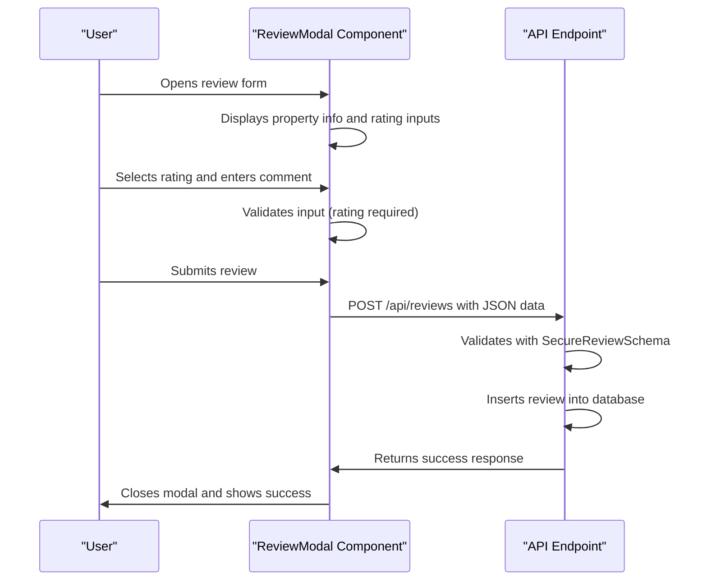

# Review Endpoints

<cite>
**Referenced Files in This Document**   
- [worker/index.ts](file://src/worker/index.ts#L1950-L2100)
- [shared/secure-validation.ts](file://src/shared/secure-validation.ts#L140-L180)
- [react-app/components/ReviewModal.tsx](file://src/react-app/components/ReviewModal.tsx#L0-L186)
- [react-app/components/PropertyCard.tsx](file://src/react-app/components/PropertyCard.tsx#L0-L426)
- [react-app/components/ReviewList.tsx](file://src/react-app/components/ReviewList.tsx#L0-L338)
- [shared/types.ts](file://src/shared/types.ts)
</cite>

## Table of Contents
1. [Review Endpoints Overview](#review-endpoints-overview)
2. [API Endpoints](#api-endpoints)
3. [Request and Response Schemas](#request-and-response-schemas)
4. [Zod Validation](#zod-validation)
5. [Example Requests and Responses](#example-requests-and-responses)
6. [Frontend Integration](#frontend-integration)
7. [Business Logic](#business-logic)

## Review Endpoints Overview

The review system enables users to submit feedback for properties they have stayed at, view reviews for specific properties, and access their own submitted reviews. The system enforces verification that users have completed a booking before allowing them to submit a review. Reviews include a mandatory rating (1-5), an optional comment, and are displayed with user information and timestamps.

**Section sources**
- [worker/index.ts](file://src/worker/index.ts#L1950-L2100)

## API Endpoints

### POST /api/reviews (Submit Review)
Allows authenticated users to submit a new review for a property they've booked and completed.

- **Authentication**: Required (user must be logged in)
- **Authorization**: User must have completed a booking at the property
- **Method**: POST
- **Content-Type**: application/json

### GET /api/reviews/property/:propertyId (Fetch Property Reviews)
Retrieves all reviews for a specific property along with the average rating.

- **Authentication**: Not required (public endpoint)
- **Method**: GET
- **Query Parameters**:
  - `page`: Page number for pagination (default: 1)
  - `limit`: Number of reviews per page (default: 10)
  - `sort_by`: Sorting criteria (newest, oldest, highest, lowest, helpful)
  - `rating`: Filter by specific rating (1-5)

### GET /api/reviews/user (Get User's Reviews)
Retrieves all reviews submitted by the authenticated user.

- **Authentication**: Required
- **Method**: GET

**Section sources**
- [worker/index.ts](file://src/worker/index.ts#L1950-L2100)

## Request and Response Schemas

### Request Schema (POST /api/reviews)

```json
{
  "property_id": 123,
  "booking_id": 456,
  "rating": 5,
  "comment": "Excellent stay with great hospitality"
}
```

**Field Descriptions**:
- **property_id**: : The ID of the property being reviewed (number, required)
- **booking_id**: : The ID of the completed booking that verifies the stay (number, required)
- **rating**: : Overall rating from 1 to 5 (number, required)
- **comment**: : Review comment with minimum length requirement (string, optional)

### Response Schema (GET /api/reviews/property/:propertyId)

```json
{
  "success": true,
  "data": [
    {
      "id": 1,
      "property_id": 123,
      "user_id": 789,
      "rating": 5,
      "comment": "Excellent stay with great hospitality",
      "cleanliness_rating": 5,
      "communication_rating": 5,
      "location_rating": 4,
      "value_rating": 5,
      "helpful_count": 3,
      "created_at": "2024-01-15T10:30:00Z",
      "user": {
        "id": 789,
        "name": "John Doe",
        "avatar": "https://example.com/avatar.jpg"
      }
    }
  ]
}
```

**Field Descriptions**:
- **id**: : Unique identifier for the review
- **property_id**: : ID of the reviewed property
- **user_id**: : ID of the user who submitted the review
- **rating**: : Overall rating (1-5)
- **comment**: : Review text
- **cleanliness_rating**: : Rating for cleanliness (1-5)
- **communication_rating**: : Rating for host communication (1-5)
- **location_rating**: : Rating for location (1-5)
- **value_rating**: : Rating for value (1-5)
- **helpful_count**: : Number of users who found the review helpful
- **created_at**: : Timestamp of review submission
- **user**: : User information including name and avatar

**Section sources**
- [worker/index.ts](file://src/worker/index.ts#L1950-L2100)
- [react-app/components/ReviewList.tsx](file://src/react-app/components/ReviewList.tsx#L0-L338)

## Zod Validation

The review system uses Zod for schema validation to ensure data integrity and security.

```typescript
export const SecureReviewSchema = z.object({
  property_id: z.number().int().positive(),
  booking_id: z.number().int().positive(),
  rating: z.number().int().min(1, 'Minimum rating is 1').max(5, 'Maximum rating is 5'),
  comment: z.string()
    .min(10, 'Review must be at least 10 characters')
    .max(1000, 'Review too long')
    .regex(/^[a-zA-Z0-9\s\u0600-\u06FF\-.,!?()]+$/, 'Review contains invalid characters'),
  
  categories: z.object({
    cleanliness: z.number().int().min(1).max(5),
    communication: z.number().int().min(1).max(5),
    location: z.number().int().min(1).max(5),
    value: z.number().int().min(1).max(5)
  }).optional()
});
```

**Validation Rules**:
- **rating**: : Must be an integer between 1 and 5 inclusive
- **comment**: : Must be a string with minimum 10 characters and maximum 1000 characters
- **comment**: : Must only contain alphanumeric characters, spaces, Arabic characters (Unicode range \u0600-\u06FF), and basic punctuation
- **property_id**: : Must be a positive integer
- **booking_id**: : Must be a positive integer

**Section sources**
- [shared/secure-validation.ts](file://src/shared/secure-validation.ts#L140-L180)

## Example Requests and Responses

### Example: Submitting a Review (curl)

```bash
curl -X POST https://api.habibistay.com/api/reviews \
  -H "Content-Type: application/json" \
  -H "Authorization: Bearer jwt_token_here" \
  -d '{
    "property_id": 123,
    "booking_id": 456,
    "rating": 5,
    "comment": "Amazing experience! The property was clean, the host was responsive, and the location was perfect."
  }'
```

**Successful Response**:
```json
{
  "success": true,
  "data": {
    "id": 789
  }
}
```

### Example: Paginated Property Reviews Response

```json
{
  "success": true,
  "data": [
    {
      "id": 101,
      "property_id": 123,
      "user_id": 789,
      "rating": 5,
      "comment": "Perfect getaway with family",
      "cleanliness_rating": 5,
      "communication_rating": 5,
      "location_rating": 5,
      "value_rating": 4,
      "helpful_count": 2,
      "created_at": "2024-01-20T14:22:00Z",
      "user": {
        "id": 789,
        "name": "Sarah Johnson",
        "avatar": "https://example.com/avatars/sarah.jpg"
      }
    },
    {
      "id": 102,
      "property_id": 123,
      "user_id": 790,
      "rating": 4,
      "comment": "Great place to stay, would recommend",
      "cleanliness_rating": 4,
      "communication_rating": 5,
      "location_rating": 4,
      "value_rating": 4,
      "helpful_count": 1,
      "created_at": "2024-01-18T09:15:00Z",
      "user": {
        "id": 790,
        "name": "Mike Chen",
        "avatar": null
      }
    }
  ]
}
```

**Section sources**
- [worker/index.ts](file://src/worker/index.ts#L1950-L2100)
- [react-app/components/ReviewList.tsx](file://src/react-app/components/ReviewList.tsx#L0-L338)

## Frontend Integration

### ReviewModal Integration

The `ReviewModal` component provides the user interface for submitting reviews. It integrates with the POST /api/reviews endpoint and enforces the same validation rules.



**Diagram sources**
- [react-app/components/ReviewModal.tsx](file://src/react-app/components/ReviewModal.tsx#L0-L186)
- [worker/index.ts](file://src/worker/index.ts#L1950-L2100)

### PropertyCard Rating Display

The `PropertyCard` component displays the average rating for properties in search results and listings.

```mermaid
flowchart TD
A[Property Data] --> B{Has average_rating?}
B --> |Yes| C[Display Star Icon]
C --> D[Show average_rating.toFixed(1)]
D --> E{Has review_count?}
E --> |Yes| F[Display (review_count)]
E --> |No| G[End]
B --> |No| H[Don't display rating]
```

**Key Implementation**:
```tsx
{property.average_rating && property.average_rating > 0 && (
  <div className="flex items-center">
    <Star className="h-3 w-3 text-yellow-400 fill-current mr-1" />
    <span className="text-xs text-gray-600">
      {property.average_rating.toFixed(1)}
      {property.review_count && property.review_count > 0 && (
        <span className="text-gray-400"> ({property.review_count})</span>
      )}
    </span>
  </div>
)}
```

**Section sources**
- [react-app/components/PropertyCard.tsx](file://src/react-app/components/PropertyCard.tsx#L0-L426)

## Business Logic

### Review Submission Logic

1. User must be authenticated to submit a review
2. System verifies the user has a completed booking at the property via booking_id
3. Rating must be between 1-5 (inclusive)
4. Comment must be at least 10 characters if provided
5. Review is associated with both the property and the specific booking
6. Upon successful submission, the review is added to the database with timestamp

### Average Rating Calculation

The average rating displayed on PropertyCard is calculated server-side and included in the property data:

```sql
SELECT AVG(rating) as average_rating, COUNT(*) as review_count
FROM reviews 
WHERE property_id = ?
```

The average is calculated from all reviews for the property and rounded to one decimal place for display.

### Verified Stay Verification

The system ensures users can only review properties they've actually stayed at by requiring a valid booking_id that:
- Belongs to the user submitting the review
- Is associated with the property being reviewed
- Has a completed status (check-out date has passed)

This creates a "verified" status implicitly, ensuring review authenticity without requiring additional badges in the UI.

**Section sources**
- [worker/index.ts](file://src/worker/index.ts#L1950-L2100)
- [shared/secure-validation.ts](file://src/shared/secure-validation.ts#L140-L180)
- [react-app/components/PropertyCard.tsx](file://src/react-app/components/PropertyCard.tsx#L0-L426)