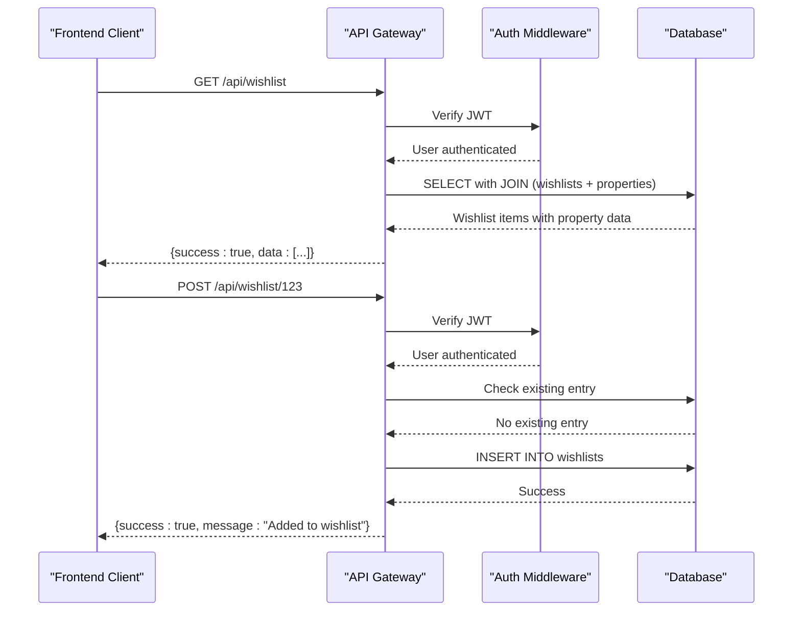
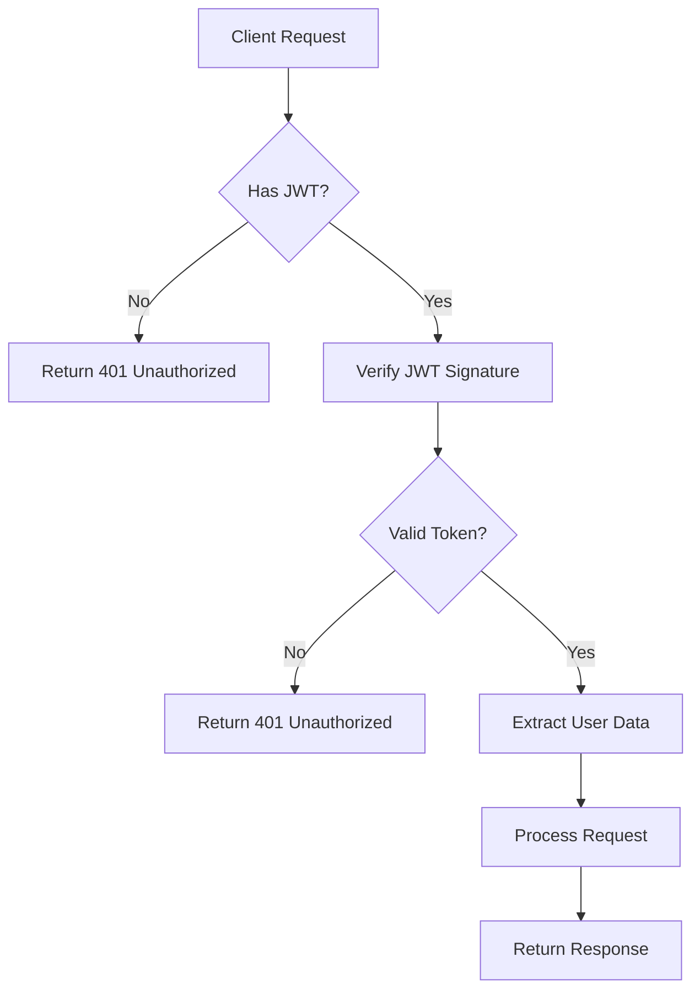
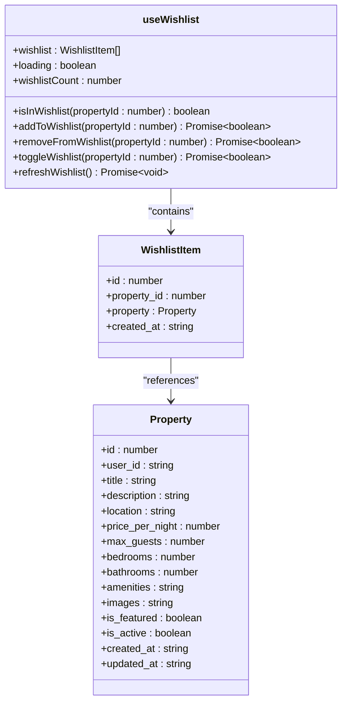
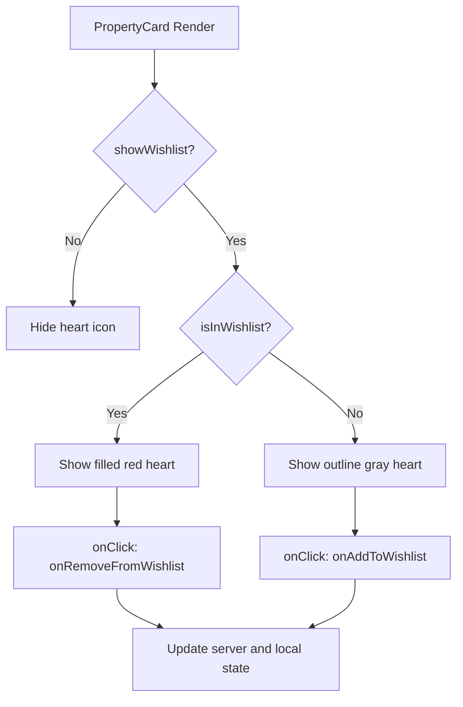
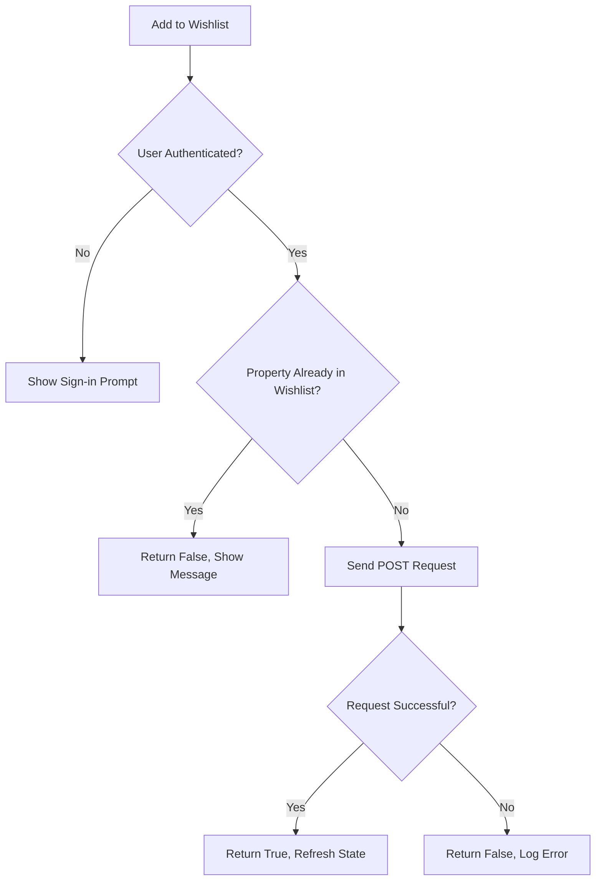

# Wishlist Endpoints

<cite>
**Referenced Files in This Document**   
- [src/worker/index.ts](file://src/worker/index.ts)
- [src/react-app/hooks/useWishlist.ts](file://src/react-app/hooks/useWishlist.ts)
- [src/react-app/components/PropertyCard.tsx](file://src/react-app/components/PropertyCard.tsx)
- [src/react-app/pages/Wishlist.tsx](file://src/react-app/pages/Wishlist.tsx)
- [src/shared/types.ts](file://src/shared/types.ts)
</cite>

## Table of Contents
1. [Introduction](#introduction)
2. [API Endpoints Overview](#api-endpoints-overview)
3. [Request and Response Schema](#request-and-response-schema)
4. [Authentication Mechanism](#authentication-mechanism)
5. [Wishlist State Management](#wishlist-state-management)
6. [PropertyCard Integration](#propertycard-integration)
7. [Example JSON Response](#example-json-response)
8. [Curl Command Examples](#curl-command-examples)
9. [Idempotency and Error Handling](#idempotency-and-error-handling)
10. [Performance Considerations](#performance-considerations)

## Introduction

This document provides comprehensive documentation for the wishlist management API endpoints in the HabibiStay application. The wishlist functionality enables users to save properties of interest for future reference, with seamless integration across frontend components and backend services. The system is built around three core endpoints: adding a property to the wishlist, removing a property from the wishlist, and retrieving all wishlist items for the current user.

The implementation leverages modern web technologies including React for the frontend, Cloudflare Workers for the backend API, and JWT-based authentication for secure user identification. The wishlist state is synchronized between client and server, ensuring consistent user experience across devices.

**Section sources**
- [src/worker/index.ts](file://src/worker/index.ts#L600-L799)
- [src/react-app/hooks/useWishlist.ts](file://src/react-app/hooks/useWishlist.ts#L0-L121)

## API Endpoints Overview

The wishlist system exposes three primary RESTful API endpoints that follow standard HTTP conventions:

**POST /api/wishlist/:propertyId** - Adds a property to the authenticated user's wishlist. The property ID is passed as a URL parameter. This endpoint implements idempotency checks to prevent duplicate entries.

**DELETE /api/wishlist/:propertyId** - Removes a property from the authenticated user's wishlist. The property ID is specified in the URL path.

**GET /api/wishlist** - Retrieves all wishlist items for the currently authenticated user, including full property details and timestamps.

These endpoints are implemented in the Cloudflare Worker environment, providing low-latency responses and global availability. The API follows a consistent response format with a `success` boolean flag, optional `data` payload, and error messages when applicable.



**Diagram sources**
- [src/worker/index.ts](file://src/worker/index.ts#L600-L799)
- [src/react-app/hooks/useWishlist.ts](file://src/react-app/hooks/useWishlist.ts#L0-L121)

**Section sources**
- [src/worker/index.ts](file://src/worker/index.ts#L600-L799)
- [src/react-app/hooks/useWishlist.ts](file://src/react-app/hooks/useWishlist.ts#L0-L121)

## Request and Response Schema

### Request Parameters

All wishlist endpoints require authentication and use the following parameter:

**:propertyId** - The unique identifier of the property to be added or removed from the wishlist. This is passed as a URL parameter in the route path.

### Response Structure

All endpoints return a standardized JSON response format:

```
{
  "success": boolean,
  "data"?: any,
  "error"?: string,
  "message"?: string
}
```

**GET /api/wishlist Response Schema**

The response contains an array of wishlist items with complete property details:

```
{
  "success": true,
  "data": [
    {
      "id": number,
      "property_id": number,
      "created_at": string,
      "property": {
        "id": number,
        "user_id": string,
        "title": string,
        "description": string,
        "location": string,
        "price_per_night": number,
        "max_guests": number,
        "bedrooms": number,
        "bathrooms": number,
        "amenities": string,
        "images": string,
        "is_featured": boolean,
        "is_active": boolean,
        "created_at": string,
        "updated_at": string
      }
    }
  ]
}
```

**POST and DELETE Response Schema**

These endpoints return a simple success confirmation:

```
{
  "success": boolean,
  "message": string
}
```

**WishlistItem Interface**

The frontend uses the following TypeScript interface to type the wishlist data:

```typescript
interface WishlistItem {
  id: number;
  property_id: number;
  property: Property;
  created_at: string;
}
```

**Section sources**
- [src/worker/index.ts](file://src/worker/index.ts#L600-L799)
- [src/react-app/hooks/useWishlist.ts](file://src/react-app/hooks/useWishlist.ts#L4-L10)
- [src/shared/types.ts](file://src/shared/types.ts#L125)

## Authentication Mechanism

The wishlist endpoints require user authentication via JWT (JSON Web Token) to identify the current user. Authentication is enforced through a middleware function applied to all wishlist routes.

When a user logs in, they receive a JWT that contains their user information. This token must be included in the request headers for all wishlist operations. The auth middleware extracts the user information from the JWT and makes it available to the route handlers.

If a request is made without a valid JWT or without authentication, the server returns a 401 Unauthorized status code with the following response:

```json
{
  "success": false,
  "error": "User not authenticated"
}
```

The frontend hook `useWishlist` automatically handles authentication checks and prompts users to sign in when attempting to modify their wishlist while unauthenticated.



**Diagram sources**
- [src/worker/index.ts](file://src/worker/index.ts#L600-L799)
- [src/react-app/hooks/useWishlist.ts](file://src/react-app/hooks/useWishlist.ts#L0-L121)

**Section sources**
- [src/worker/index.ts](file://src/worker/index.ts#L600-L799)
- [src/react-app/hooks/useWishlist.ts](file://src/react-app/hooks/useWishlist.ts#L0-L121)

## Wishlist State Management

The application uses a custom React hook `useWishlist` to manage wishlist state on the client side. This hook provides a clean API for components to interact with the wishlist functionality.

The hook maintains the following state variables:
- **wishlist**: Array of WishlistItem objects
- **loading**: Boolean indicating fetch status
- **wishlistCount**: Number of items in the wishlist

Key functions provided by the hook:

**isInWishlist(propertyId)** - Checks if a property is already in the user's wishlist by searching the local state.

**addToWishlist(propertyId)** - Sends a POST request to add a property to the wishlist and refreshes the local state.

**removeFromWishlist(propertyId)** - Sends a DELETE request to remove a property and updates the local state.

**toggleWishlist(propertyId)** - Convenience function that adds or removes a property based on its current state.

The hook automatically fetches the user's wishlist when the component mounts and when the user authentication state changes.



**Diagram sources**
- [src/react-app/hooks/useWishlist.ts](file://src/react-app/hooks/useWishlist.ts#L0-L121)
- [src/shared/types.ts](file://src/shared/types.ts#L125)

**Section sources**
- [src/react-app/hooks/useWishlist.ts](file://src/react-app/hooks/useWishlist.ts#L0-L121)

## PropertyCard Integration

The `PropertyCard` component integrates wishlist functionality through visual indicators and user interaction. The heart icon state reflects whether a property is in the user's wishlist.

The component accepts the following props related to wishlist functionality:
- **showWishlist**: Boolean to control visibility of the wishlist button
- **isInWishlist**: Boolean indicating the current wishlist state
- **onAddToWishlist**: Callback function triggered when adding to wishlist
- **onRemoveFromWishlist**: Callback function triggered when removing from wishlist

The heart icon appearance changes based on the `isInWishlist` prop:
- **Filled red heart**: Property is in the wishlist
- **Outline gray heart**: Property is not in the wishlist

Clicking the heart icon triggers the appropriate action through the callback functions, which are typically provided by the `useWishlist` hook.



**Diagram sources**
- [src/react-app/components/PropertyCard.tsx](file://src/react-app/components/PropertyCard.tsx#L0-L199)

**Section sources**
- [src/react-app/components/PropertyCard.tsx](file://src/react-app/components/PropertyCard.tsx#L0-L199)

## Example JSON Response

The following is an example response from the GET /api/wishlist endpoint:

```json
{
  "success": true,
  "data": [
    {
      "id": 42,
      "property_id": 187,
      "created_at": "2025-01-15T08:30:45.123Z",
      "property": {
        "id": 187,
        "user_id": "user_123abc",
        "title": "Luxury Villa with Private Pool",
        "description": "Beautiful modern villa with private pool and garden. Perfect for families and groups.",
        "location": "Jeddah, Saudi Arabia",
        "price_per_night": 850,
        "max_guests": 8,
        "bedrooms": 4,
        "bathrooms": 3,
        "amenities": "[\"wifi\",\"parking\",\"pool\",\"gym\",\"kitchen\",\"air_conditioning\"]",
        "images": "[\"https://example.com/images/villa1.jpg\",\"https://example.com/images/villa2.jpg\",\"https://example.com/images/villa3.jpg\"]",
        "is_featured": true,
        "is_active": true,
        "created_at": "2024-11-20T14:22:10.456Z",
        "updated_at": "2025-01-10T09:15:33.789Z"
      }
    },
    {
      "id": 38,
      "property_id": 203,
      "created_at": "2025-01-10T16:45:22.876Z",
      "property": {
        "id": 203,
        "user_id": "user_456def",
        "title": "City Center Apartment",
        "description": "Modern apartment in the heart of the city with stunning views and all amenities.",
        "location": "Riyadh, Saudi Arabia",
        "price_per_night": 420,
        "max_guests": 4,
        "bedrooms": 2,
        "bathrooms": 2,
        "amenities": "[\"wifi\",\"parking\",\"gym\",\"kitchen\",\"air_conditioning\",\"balcony\"]",
        "images": "[\"https://example.com/images/apartment1.jpg\",\"https://example.com/images/apartment2.jpg\"]",
        "is_featured": false,
        "is_active": true,
        "created_at": "2024-12-05T11:30:15.234Z",
        "updated_at": "2025-01-08T13:20:44.567Z"
      }
    }
  ]
}
```

**Section sources**
- [src/worker/index.ts](file://src/worker/index.ts#L600-L799)

## Curl Command Examples

### Add Property to Wishlist

```bash
curl -X POST "https://habibistay.com/api/wishlist/187" \
  -H "Authorization: Bearer YOUR_JWT_TOKEN" \
  -H "Content-Type: application/json"
```

Successful response:
```json
{
  "success": true,
  "message": "Added to wishlist"
}
```

Error response (already in wishlist):
```json
{
  "success": false,
  "error": "Property already in wishlist"
}
```

### Remove Property from Wishlist

```bash
curl -X DELETE "https://habibistay.com/api/wishlist/187" \
  -H "Authorization: Bearer YOUR_JWT_TOKEN" \
  -H "Content-Type: application/json"
```

Successful response:
```json
{
  "success": true,
  "message": "Removed from wishlist"
}
```

### Retrieve User's Wishlist

```bash
curl -X GET "https://habibistay.com/api/wishlist" \
  -H "Authorization: Bearer YOUR_JWT_TOKEN" \
  -H "Content-Type: application/json"
```

Response:
```json
{
  "success": true,
  "data": [
    {
      "id": 42,
      "property_id": 187,
      "created_at": "2025-01-15T08:30:45.123Z",
      "property": {
        "id": 187,
        "title": "Luxury Villa with Private Pool",
        "location": "Jeddah, Saudi Arabia",
        "price_per_night": 850,
        "max_guests": 8,
        "bedrooms": 4,
        "bathrooms": 3
      }
    }
  ]
}
```

**Section sources**
- [src/worker/index.ts](file://src/worker/index.ts#L600-L799)

## Idempotency and Error Handling

The wishlist API implements idempotency for the POST endpoint to prevent duplicate entries. When a user attempts to add a property that is already in their wishlist, the server returns a 400 Bad Request response with the message "Property already in wishlist" rather than creating a duplicate record.

This is achieved through a database query that checks for existing entries before insertion:

```sql
SELECT id FROM wishlists WHERE user_id = ? AND property_id = ?
```

If a matching record is found, the insertion is skipped and an error response is returned.

Error handling is implemented at both the server and client levels:

**Server-side errors:**
- 401 Unauthorized: User not authenticated
- 400 Bad Request: Invalid request or duplicate entry
- 500 Internal Server Error: Database or server issues

**Client-side error handling:**
- Network errors are caught and logged to the console
- Authentication failures trigger user prompts to sign in
- Server error messages are displayed to users when appropriate

The `useWishlist` hook returns boolean values indicating success or failure of operations, allowing components to respond appropriately to different outcomes.



**Diagram sources**
- [src/worker/index.ts](file://src/worker/index.ts#L600-L799)
- [src/react-app/hooks/useWishlist.ts](file://src/react-app/hooks/useWishlist.ts#L0-L121)

**Section sources**
- [src/worker/index.ts](file://src/worker/index.ts#L600-L799)
- [src/react-app/hooks/useWishlist.ts](file://src/react-app/hooks/useWishlist.ts#L0-L121)

## Performance Considerations

The wishlist functionality includes several performance optimizations to ensure responsive user experience:

**Database Query Optimization**
The GET endpoint uses a JOIN operation to retrieve wishlist items with their associated property data in a single query, minimizing database round trips:

```sql
SELECT w.*, p.* FROM wishlists w
JOIN properties p ON w.property_id = p.id
WHERE w.user_id = ? AND p.is_active = 1
ORDER BY w.created_at DESC
```

The query includes filtering for active properties only, preventing inactive listings from appearing in the wishlist.

**Client-side State Management**
The `useWishlist` hook caches the wishlist data in React state, reducing the need for repeated API calls. The state is only refreshed when necessary (on mount, after mutations, or when explicitly refreshed).

For the DELETE operation, the frontend optimistically updates the UI by filtering the removed property from the local state before the server response is received, providing immediate visual feedback.

**Selective Data Fetching**
While the API returns complete property data, components can choose to render only essential information. The PropertyCard component, for example, only displays key details like title, location, price, and main image.

**Loading States**
The Wishlist page implements loading states with skeleton screens to provide visual feedback during data fetching, improving perceived performance.

**Rate Limiting Considerations**
Although not explicitly implemented in the current code, production deployments should consider rate limiting for wishlist operations to prevent abuse.

**Section sources**
- [src/worker/index.ts](file://src/worker/index.ts#L600-L799)
- [src/react-app/hooks/useWishlist.ts](file://src/react-app/hooks/useWishlist.ts#L0-L121)
- [src/react-app/components/PropertyCard.tsx](file://src/react-app/components/PropertyCard.tsx#L0-L199)