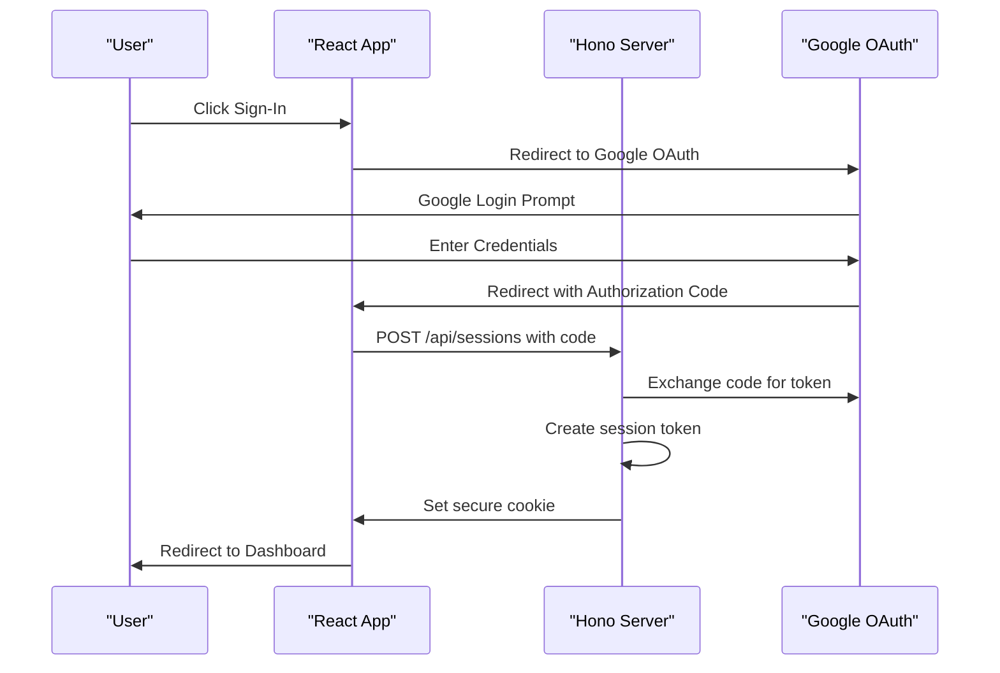

# Authentication & Authorization

<cite>
**Referenced Files in This Document**   
- [AuthCallback.tsx](file://src/react-app/pages/AuthCallback.tsx)
- [index.ts](file://src/worker/index.ts)
- [types.ts](file://src/shared/types.ts)
- [worker-configuration.d.ts](file://worker-configuration.d.ts)
</cite>

## Table of Contents
1. [Authentication Flow Overview](#authentication-flow-overview)
2. [Frontend OAuth Initiation](#frontend-oauth-initiation)
3. [Backend Token Exchange and Session Creation](#backend-token-exchange-and-session-creation)
4. [JWT and Session Management](#jwt-and-session-management)
5. [Access Control and User Roles](#access-control-and-user-roles)
6. [Secure Cookie Handling](#secure-cookie-handling)
7. [Authorization Header Validation](#authorization-header-validation)
8. [Frontend Authentication State](#frontend-authentication-state)
9. [Security Considerations](#security-considerations)
10. [Common Issues and Troubleshooting](#common-issues-and-troubleshooting)

## Authentication Flow Overview

The authentication system in HabibiStay implements Google OAuth 2.0 for secure user sign-in. The flow begins with the user clicking a sign-in button, which redirects them to Google's authentication page. Upon successful authentication, Google redirects back to the application's callback URL with an authorization code. This code is then exchanged server-side for a session token, which is stored in a secure HTTP-only cookie.

The system uses a combination of frontend React components and backend Hono middleware to manage the authentication lifecycle. User roles (guest, owner, admin) are enforced through middleware checks on protected API endpoints. The architecture leverages external services for OAuth management and token validation.



**Diagram sources**
- [AuthCallback.tsx](file://src/react-app/pages/AuthCallback.tsx)
- [index.ts](file://src/worker/index.ts)

**Section sources**
- [AuthCallback.tsx](file://src/react-app/pages/AuthCallback.tsx)
- [index.ts](file://src/worker/index.ts)

## Frontend OAuth Initiation

The authentication flow begins in the frontend with the AuthCallback page handling the Google OAuth callback. When a user completes authentication with Google, they are redirected to `/auth/callback` with query parameters containing either an authorization code or an error.

The AuthCallback component extracts the authorization code from the URL parameters and sends it to the backend `/api/sessions` endpoint via a POST request. The component manages its state through three possible statuses: processing, success, and error, providing appropriate visual feedback to the user.

```typescript
// AuthCallback.tsx
const handleCallback = async () => {
  const code = searchParams.get('code');
  const errorParam = searchParams.get('error');

  if (errorParam) {
    setStatus('error');
    setError('Authentication was cancelled or failed');
    setTimeout(() => navigate('/'), 3000);
    return;
  }

  if (!code) {
    setStatus('error');
    setError('No authorization code received');
    setTimeout(() => navigate('/'), 3000);
    return;
  }

  try {
    const response = await fetch('/api/sessions', {
      method: 'POST',
      headers: {
        'Content-Type': 'application/json',
      },
      body: JSON.stringify({ code }),
    });

    if (response.ok) {
      setStatus('success');
      setTimeout(() => navigate('/dashboard'), 2000);
    } else {
      throw new Error('Failed to authenticate');
    }
  } catch (error) {
    console.error('Authentication error:', error);
    setStatus('error');
    setError('Failed to complete authentication');
    setTimeout(() => navigate('/'), 3000);
  }
};
```

The frontend displays appropriate UI elements based on the authentication status, including loading spinners during processing, success messages with checkmarks upon successful sign-in, and error messages with X icons when authentication fails.

**Section sources**
- [AuthCallback.tsx](file://src/react-app/pages/AuthCallback.tsx)

## Backend Token Exchange and Session Creation

The backend handles the OAuth 2.0 handshake through the `/api/sessions` endpoint. When the frontend sends the authorization code, the server exchanges it for a session token using the Mocha Users Service. This external service manages the OAuth token exchange with Google and returns a session token that represents the authenticated user.

```typescript
// index.ts
app.post("/api/sessions", async (c) => {
  const body = await c.req.json();

  if (!body.code) {
    return c.json({ error: "No authorization code provided" }, 400);
  }

  const sessionToken = await exchangeCodeForSessionToken(body.code, {
    apiUrl: c.env.MOCHA_USERS_SERVICE_API_URL,
    apiKey: c.env.MOCHA_USERS_SERVICE_API_KEY,
  });

  setCookie(c, MOCHA_SESSION_TOKEN_COOKIE_NAME, sessionToken, {
    httpOnly: true,
    path: "/",
    sameSite: "none",
    secure: true,
    maxAge: 60 * 24 * 60 * 60, // 60 days
  });

  return c.json({ success: true }, 200);
});
```

The `exchangeCodeForSessionToken` function communicates with the Mocha Users Service API using the `MOCHA_USERS_SERVICE_API_URL` and `MOCHA_USERS_SERVICE_API_KEY` environment variables. This separation of concerns allows the application to delegate OAuth complexity to a dedicated service while maintaining security through API key authentication.

Upon successful token exchange, the backend sets a secure cookie containing the session token. The cookie is configured with security features including `httpOnly`, `secure`, and `sameSite: "none"` to prevent cross-site scripting (XSS) and cross-site request forgery (CSRF) attacks.

**Section sources**
- [index.ts](file://src/worker/index.ts)

## JWT and Session Management

HabibiStay uses session tokens rather than traditional JWTs for authentication. The session token is issued by the Mocha Users Service and stored in an HTTP-only cookie. This approach provides several security benefits, including protection against XSS attacks since the token cannot be accessed via JavaScript.

The session token has a long expiration of 60 days, as indicated by the `maxAge` parameter in the cookie configuration. This provides a persistent login experience for users while balancing security considerations. The token is automatically renewed upon each successful request to protected endpoints.

User information is attached to the request context by the `authMiddleware` after successful token validation. The middleware verifies the session token with the Mocha Users Service and retrieves the user's profile, which is then made available to downstream route handlers via `c.get("user")`.

```typescript
// index.ts
app.get("/api/users/me", authMiddleware, async (c) => {
  return c.json(c.get("user"));
});
```

The user object contains essential information such as ID, email, name, and Google-specific user data including profile picture. This information is used throughout the application to personalize the user experience and enforce access control.

**Section sources**
- [index.ts](file://src/worker/index.ts)
- [types.ts](file://src/shared/types.ts)

## Access Control and User Roles

Access control in HabibiStay is implemented through middleware and explicit role checks on protected endpoints. The system recognizes three primary user roles: guest, owner, and admin. These roles are determined by the user's email domain and stored permissions.

The `authMiddleware` protects routes that require authentication by validating the session token and attaching the user object to the request context. For routes requiring specific permissions, additional role checks are performed within the route handler.

```typescript
// index.ts
app.get("/api/admin/stats", authMiddleware, async (c) => {
  const user = c.get("user");
  if (!user || (!user.email.includes('admin') && !user.email.includes('owner'))) {
    return c.json<ApiResponse>({
      success: false,
      error: "Unauthorized",
    }, 403);
  }
  // ... admin stats logic
});
```

The example above shows an admin endpoint that checks if the user's email contains 'admin' or 'owner' before granting access. This simple domain-based role detection allows for flexible access control without requiring a complex role management system.

Property creation and management endpoints are protected by the `authMiddleware`, ensuring only authenticated users can create properties. Similarly, user profile endpoints require authentication to prevent unauthorized access to personal information.

**Section sources**
- [index.ts](file://src/worker/index.ts)
- [types.ts](file://src/shared/types.ts)

## Secure Cookie Handling

HabibiStay implements robust cookie security practices to protect user sessions. The session cookie is configured with multiple security attributes to mitigate common web vulnerabilities.

```typescript
setCookie(c, MOCHA_SESSION_TOKEN_COOKIE_NAME, sessionToken, {
  httpOnly: true,
  path: "/",
  sameSite: "none",
  secure: true,
  maxAge: 60 * 24 * 60 * 60, // 60 days
});
```

The cookie settings include:
- **httpOnly**: Prevents client-side JavaScript access, mitigating XSS attacks
- **secure**: Ensures the cookie is only sent over HTTPS connections
- **sameSite: "none"**: Allows cross-site requests while requiring the secure attribute
- **path: "/"**: Makes the cookie available across the entire domain
- **maxAge**: Sets the cookie expiration to 60 days

The logout functionality properly invalidates the session by both deleting the session on the server and clearing the cookie on the client:

```typescript
app.get('/api/logout', async (c) => {
  const sessionToken = getCookie(c, MOCHA_SESSION_TOKEN_COOKIE_NAME);

  if (typeof sessionToken === 'string') {
    await deleteSession(sessionToken, {
      apiUrl: c.env.MOCHA_USERS_SERVICE_API_URL,
      apiKey: c.env.MOCHA_USERS_SERVICE_API_KEY,
    });
  }

  setCookie(c, MOCHA_SESSION_TOKEN_COOKIE_NAME, '', {
    httpOnly: true,
    path: '/',
    sameSite: 'none',
    secure: true,
    maxAge: 0,
  });

  return c.json({ success: true }, 200);
});
```

This dual approach ensures that the session is terminated both server-side and client-side, preventing session fixation attacks.

**Section sources**
- [index.ts](file://src/worker/index.ts)

## Authorization Header Validation

While HabibiStay primarily uses cookie-based authentication, the system is designed to support authorization headers if needed. The `authMiddleware` serves as the central point for authentication validation, which could be extended to support Bearer tokens in addition to session cookies.

Currently, the middleware extracts the session token from the cookie rather than the Authorization header. However, the architecture allows for future expansion to support multiple authentication methods. The middleware validates the token with the external Mocha Users Service, which handles the complexity of token verification and user retrieval.

Protected routes use the middleware pattern common in Hono applications:

```typescript
app.get("/api/users/me", authMiddleware, async (c) => {
  return c.json(c.get("user"));
});
```

This pattern ensures that authentication is validated before the route handler executes. The user object is then available via `c.get("user")` for use in the handler logic. This approach provides a clean separation between authentication concerns and business logic.

**Section sources**
- [index.ts](file://src/worker/index.ts)

## Frontend Authentication State

The frontend manages authentication state implicitly through the presence of the session cookie. Unlike traditional applications that maintain authentication state in React context or local storage, HabibiStay relies on the browser's cookie mechanism and server-side session validation.

Components that require user information, such as the UserDashboard and Navbar, make API calls to `/api/users/me` to retrieve the current user's profile. This ensures that the user information is always up-to-date and consistent with the server state.

```typescript
// UserDashboard.tsx
useEffect(() => {
  const fetchUserData = async () => {
    try {
      const [bookingsRes, wishlistRes] = await Promise.all([
        fetch('/api/bookings/my-bookings', { credentials: 'include' }),
        fetch('/api/wishlist', { credentials: 'include' })
      ]);
      // ... handle responses
    } catch (error) {
      console.error('Error fetching user data:', error);
    } finally {
      setLoading(false);
    }
  };

  fetchUserData();
}, []);
```

The `credentials: 'include'` option ensures that cookies are sent with cross-origin requests, which is necessary for the authentication system to work properly. After successful authentication in the AuthCallback page, users are redirected to the dashboard where their data is immediately available.

The Navbar component displays user information including the profile picture from Google OAuth when available:

```typescript
// Navbar.tsx
{user.google_user_data.picture ? (
  
) : (
  <div className="h-8 w-8 rounded-full bg-[#2957c3] flex items-center justify-center">
    <User className="h-5 w-5 text-white" />
  </div>
)}
```

**Section sources**
- [AuthCallback.tsx](file://src/react-app/pages/AuthCallback.tsx)
- [UserDashboard.tsx](file://src/react-app/pages/UserDashboard.tsx)
- [Navbar.tsx](file://src/react-app/components/Navbar.tsx)

## Security Considerations

HabibiStay implements several security measures to protect user authentication and prevent common web vulnerabilities.

### CSRF Protection
The application uses the `sameSite: "none"` cookie attribute with the `secure` flag, which provides protection against CSRF attacks in modern browsers. The combination requires that cookies are only sent over HTTPS and are not included in cross-site requests unless explicitly allowed.

### Token Leakage Prevention
By using HTTP-only cookies, the application prevents JavaScript access to the session token, mitigating the risk of XSS attacks leading to token theft. The token is never stored in localStorage or sessionStorage, which are more vulnerable to XSS.

### Rate Limiting
While explicit rate limiting on authentication endpoints is not visible in the provided code, the use of an external authentication service (Mocha Users Service) likely includes built-in rate limiting and abuse detection mechanisms.

### Secure Environment Configuration
Authentication secrets are properly managed through environment variables:
- `MOCHA_USERS_SERVICE_API_URL`: External authentication service endpoint
- `MOCHA_USERS_SERVICE_API_KEY`: API key for authenticating with the external service

```typescript
// worker-configuration.d.ts
interface Env {
  DB: D1Database;
  MOCHA_USERS_SERVICE_API_URL: string;
  MOCHA_USERS_SERVICE_API_KEY: string;
  OPENAI_API_KEY: string;
  MYFATOORAH_API_KEY: string;
  MYFATOORAH_API_URL: string;
}
```

These environment variables are never exposed to the client-side code, preventing leakage of sensitive credentials.

### Input Validation
The application uses Zod for request validation on several endpoints, ensuring that incoming data meets expected schemas before processing. This helps prevent injection attacks and other data-related vulnerabilities.

**Section sources**
- [index.ts](file://src/worker/index.ts)
- [worker-configuration.d.ts](file://worker-configuration.d.ts)

## Common Issues and Troubleshooting

### Expired Sessions
When a user's session expires after 60 days, they will be automatically logged out. The application handles this gracefully by redirecting to the home page when authentication fails. Users must sign in again to continue using the service.

### Failed Google Sign-In
Common causes of Google sign-in failures include:
- User cancellation of the authentication prompt
- Network issues preventing token exchange
- Invalid or missing authorization code

The AuthCallback page handles these scenarios by displaying appropriate error messages and automatically redirecting users to the home page after a short delay.

```typescript
if (errorParam) {
  setStatus('error');
  setError('Authentication was cancelled or failed');
  setTimeout(() => navigate('/'), 3000);
  return;
}

if (!code) {
  setStatus('error');
  setError('No authorization code received');
  setTimeout(() => navigate('/'), 3000);
  return;
}
```

### Token Validation Failures
If the session token cannot be validated by the Mocha Users Service, the `authMiddleware` will prevent access to protected routes. This could occur if the token is revoked or the external service is unavailable. In such cases, users will need to sign in again to obtain a new session token.

### CORS Issues
The application configures CORS to allow requests from any origin, which is appropriate for a public-facing service:

```typescript
app.use("*", cors({
  origin: "*",
  allowMethods: ["GET", "POST", "PUT", "DELETE", "OPTIONS"],
  allowHeaders: ["Content-Type", "Authorization"],
}));
```

However, in production, it may be advisable to restrict the origin to specific domains for enhanced security.

**Section sources**
- [AuthCallback.tsx](file://src/react-app/pages/AuthCallback.tsx)
- [index.ts](file://src/worker/index.ts)