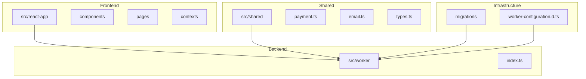
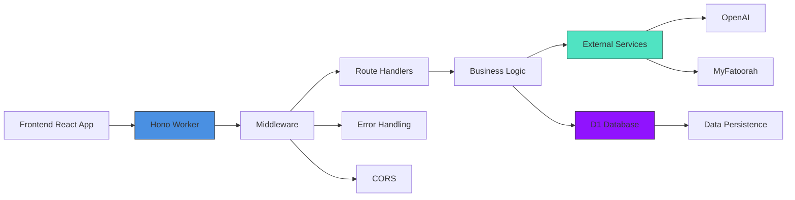
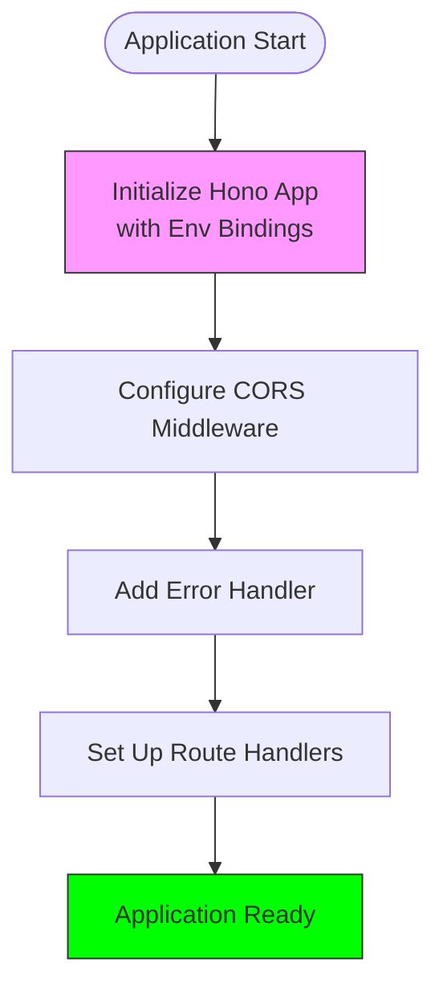
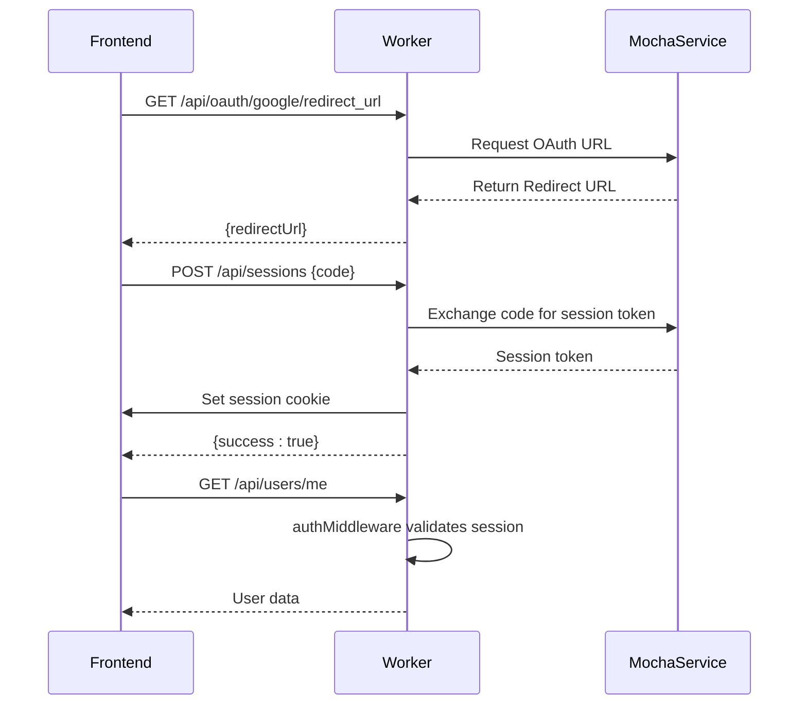
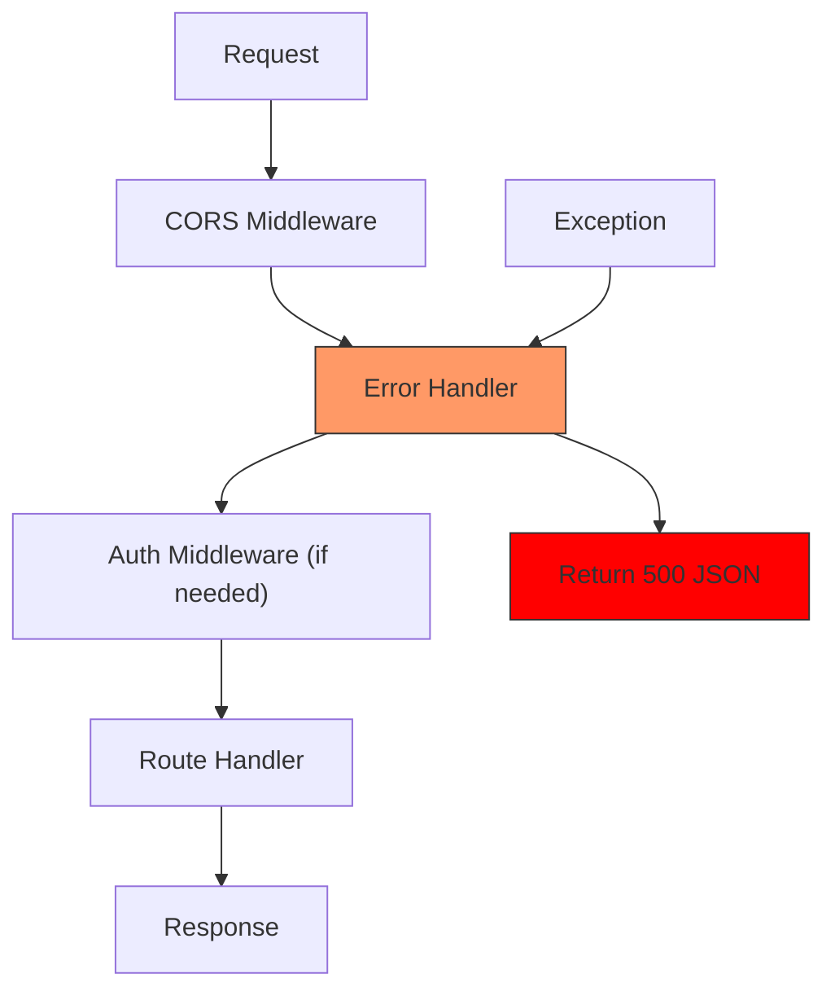
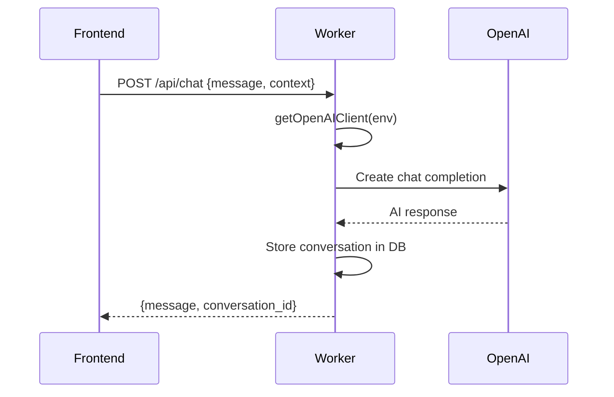
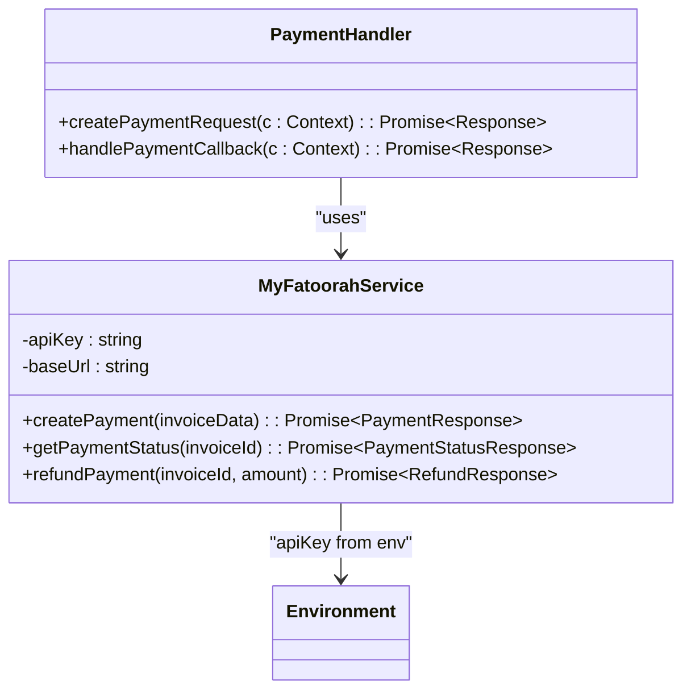
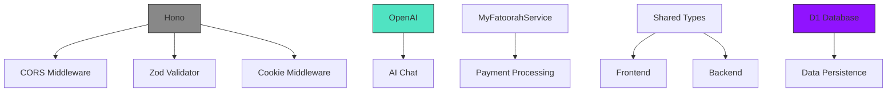

# Backend Architecture

<cite>
**Referenced Files in This Document**   
- [src/worker/index.ts](file://src/worker/index.ts#L0-L1886)
- [worker-configuration.d.ts](file://worker-configuration.d.ts#L0-L8)
- [src/shared/payment.ts](file://src/shared/payment.ts#L62-L113)
- [src/shared/email.ts](file://src/shared/email.ts)
</cite>

## Table of Contents
1. [Introduction](#introduction)
2. [Project Structure](#project-structure)
3. [Core Components](#core-components)
4. [Architecture Overview](#architecture-overview)
5. [Detailed Component Analysis](#detailed-component-analysis)
6. [Dependency Analysis](#dependency-analysis)
7. [Performance Considerations](#performance-considerations)
8. [Troubleshooting Guide](#troubleshooting-guide)
9. [Conclusion](#conclusion)

## Introduction
This document provides a comprehensive overview of the backend API system for HabibiStay, a modern property booking platform with AI integration. The backend is implemented using the Hono framework within the Cloudflare Workers environment, enabling a serverless, globally distributed architecture. The system handles API requests from the frontend, processes business logic, interacts with a D1 database, and integrates with external services such as MyFatoorah for payments and OpenAI for AI-powered chat functionality. This documentation details the technical architecture, request handling, security model, and integration patterns.

## Project Structure
The project follows a modular structure with clear separation of concerns. The backend logic resides in the `src/worker` directory, while shared utilities and types are located in `src/shared`. The frontend React application is in `src/react-app`, and database migrations are managed in the `migrations` directory.



**Diagram sources**
- [src/worker/index.ts](file://src/worker/index.ts#L0-L1886)
- [worker-configuration.d.ts](file://worker-configuration.d.ts#L0-L8)

**Section sources**
- [src/worker/index.ts](file://src/worker/index.ts#L0-L1886)
- [worker-configuration.d.ts](file://worker-configuration.d.ts#L0-L8)

## Core Components
The backend system is built around several core components: the Hono application instance, middleware for CORS and error handling, service clients for OpenAI and MyFatoorah, and utility functions for email and analytics. The application is stateless and designed for serverless execution in Cloudflare Workers, with all persistent data stored in the D1 database.

**Section sources**
- [src/worker/index.ts](file://src/worker/index.ts#L0-L1886)
- [worker-configuration.d.ts](file://worker-configuration.d.ts#L0-L8)

## Architecture Overview
The backend architecture follows a serverless model using Cloudflare Workers with Hono as the web framework. The system receives HTTP requests from the frontend, processes them through middleware, executes business logic, and returns JSON responses. External service integrations are abstracted through service classes, and all configuration is managed via environment variables.



**Diagram sources**
- [src/worker/index.ts](file://src/worker/index.ts#L0-L1886)
- [worker-configuration.d.ts](file://worker-configuration.d.ts#L0-L8)

## Detailed Component Analysis

### Hono Framework Setup
The Hono framework is initialized with type safety for environment bindings, enabling access to Cloudflare Workers' platform features such as D1 databases and environment variables. The application instance is configured with CORS middleware to allow cross-origin requests from the frontend.



**Diagram sources**
- [src/worker/index.ts](file://src/worker/index.ts#L24-L30)

**Section sources**
- [src/worker/index.ts](file://src/worker/index.ts#L24-L30)

### Route Definitions and Request Handling
The backend exposes a RESTful API with routes for authentication, property management, bookings, payments, and AI interactions. Route handlers use Zod validation for request data and follow a consistent pattern of extracting parameters, processing business logic, and returning structured JSON responses.

#### Authentication Flow


**Diagram sources**
- [src/worker/index.ts](file://src/worker/index.ts#L130-L179)

**Section sources**
- [src/worker/index.ts](file://src/worker/index.ts#L130-L179)

### Middleware Implementation
The application uses several middleware functions to handle cross-cutting concerns. The CORS middleware allows requests from any origin, while the error handling middleware catches uncaught exceptions and returns consistent error responses.



**Diagram sources**
- [src/worker/index.ts](file://src/worker/index.ts#L79-L131)

**Section sources**
- [src/worker/index.ts](file://src/worker/index.ts#L79-L131)

### External Service Integration
The backend integrates with two key external services: OpenAI for AI-powered chat functionality and MyFatoorah for payment processing. These integrations are abstracted through service classes that encapsulate the API details and provide a clean interface for the route handlers.

#### OpenAI Integration


**Diagram sources**
- [src/worker/index.ts](file://src/worker/index.ts#L34-L40)

#### MyFatoorah Payment Integration


**Diagram sources**
- [src/shared/payment.ts](file://src/shared/payment.ts#L62-L113)
- [src/worker/index.ts](file://src/worker/index.ts#L41-L47)

**Section sources**
- [src/shared/payment.ts](file://src/shared/payment.ts#L62-L113)
- [src/worker/index.ts](file://src/worker/index.ts#L41-L47)

### Environment Configuration and Security
The application uses environment variables for configuration, with all sensitive credentials and API keys stored securely in the Cloudflare Workers environment. The Env interface defines the expected bindings, ensuring type safety and preventing runtime errors due to missing configuration.

```mermaid
classDiagram
class Env {
DB : D1Database
MOCHA_USERS_SERVICE_API_URL : string
MOCHA_USERS_SERVICE_API_KEY : string
OPENAI_API_KEY : string
MYFATOORAH_API_KEY : string
MYFATOORAH_API_URL : string
}
class Worker {
+app : Hono<{Bindings : Env}>
+getOpenAIClient(env : Env) : OpenAI
+getMyFatoorahService(env : Env) : MyFatoorahService
}
Worker --> Env : "type binding"
```

**Diagram sources**
- [worker-configuration.d.ts](file://worker-configuration.d.ts#L0-L8)
- [src/worker/index.ts](file://src/worker/index.ts#L24-L47)

**Section sources**
- [worker-configuration.d.ts](file://worker-configuration.d.ts#L0-L8)
- [src/worker/index.ts](file://src/worker/index.ts#L24-L47)

## Dependency Analysis
The backend has minimal external dependencies, relying primarily on the Hono framework and official clients for OpenAI. All shared code between frontend and backend is contained in the src/shared directory, ensuring consistency in data structures and business logic.



**Diagram sources**
- [package.json](file://package.json)
- [src/worker/index.ts](file://src/worker/index.ts#L1-L50)

**Section sources**
- [package.json](file://package.json)
- [src/worker/index.ts](file://src/worker/index.ts#L1-L50)

## Performance Considerations
The serverless architecture inherently handles scalability, but cold starts can impact performance. The application minimizes cold start impact by keeping dependencies lean and initializing service clients on demand. Database queries are optimized with appropriate indexing, and the stateless nature of Cloudflare Workers ensures consistent performance across regions.

The use of D1 database with prepared statements helps prevent SQL injection and improves query performance. For high-frequency operations like property view tracking, the application uses upsert patterns to minimize database round trips.

**Section sources**
- [src/worker/index.ts](file://src/worker/index.ts#L94-L105)

## Troubleshooting Guide
The system includes comprehensive error handling and logging to facilitate troubleshooting. All errors are caught by the global error handler middleware, which logs the error details and returns a consistent error response to the client.

Database operations include error handling with specific logging to the email_logs table when email sending fails. External service calls are wrapped in try-catch blocks, and failures are logged appropriately.

For debugging, developers can examine:
- Console logs in Cloudflare Workers dashboard
- Error messages in the email_logs table
- API request patterns in the analytics_events table
- Payment status in the MyFatoorah dashboard

**Section sources**
- [src/worker/index.ts](file://src/worker/index.ts#L79-L92)
- [src/worker/index.ts](file://src/worker/index.ts#L55-L77)

## Conclusion
The HabibiStay backend architecture effectively leverages the Cloudflare Workers platform and Hono framework to create a scalable, secure, and maintainable serverless API. The clean separation of concerns, consistent error handling, and well-defined integration points with external services make the system robust and easy to extend. The use of type-safe environment bindings and shared types between frontend and backend ensures consistency and reduces bugs. This architecture is well-suited for a global audience with low-latency requirements and can easily accommodate future feature additions.