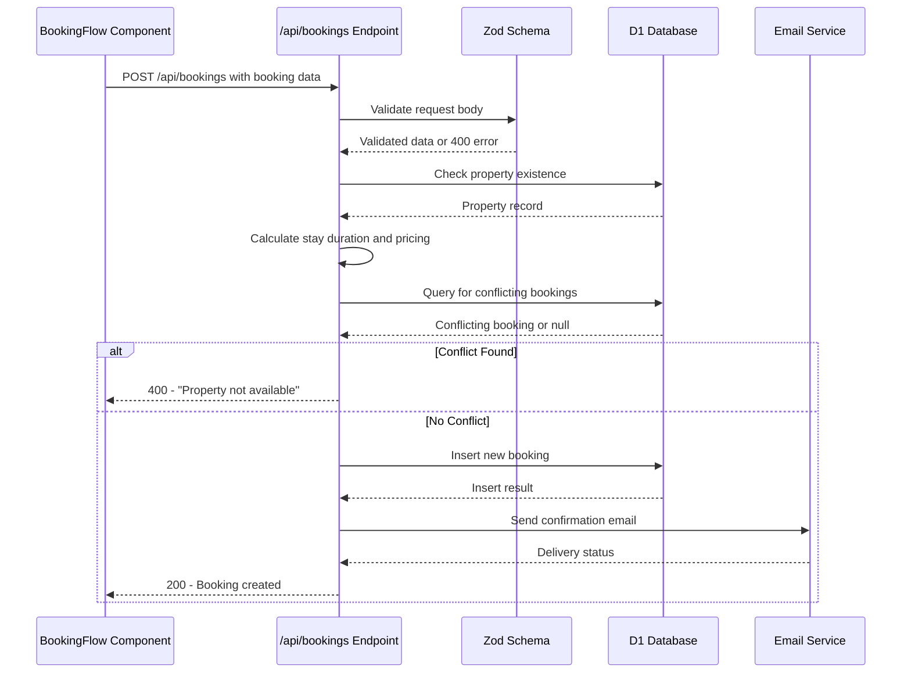
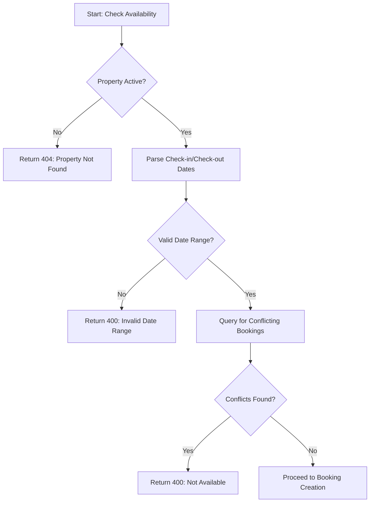

# Booking Validation

<cite>
**Referenced Files in This Document**   
- [index.ts](file://src/worker/index.ts#L440-L522)
- [types.ts](file://src/shared/types.ts#L53-L62)
- [BookingFlow.tsx](file://src/react-app/components/BookingFlow.tsx)
- [PropertyService.ts](file://src/server/services/PropertyService.ts#L200-L250)
</cite>

## Table of Contents
1. [Introduction](#introduction)
2. [Validation Architecture Overview](#validation-architecture-overview)
3. [Domain Models and Schema Validation](#domain-models-and-schema-validation)
4. [Date Conflict Checking and Availability Logic](#date-conflict-checking-and-availability-logic)
5. [Guest Count and Property Capacity Validation](#guest-count-and-property-capacity-validation)
6. [API Endpoint Flow and Request Processing](#api-endpoint-flow-and-request-processing)
7. [Concurrency and Race Condition Handling](#concurrency-and-race-condition-handling)
8. [Timezone and Date Range Edge Cases](#timezone-and-date-range-edge-cases)
9. [Performance Optimization and Indexing](#performance-optimization-and-indexing)
10. [Troubleshooting Common Issues](#troubleshooting-common-issues)

## Introduction
The booking validation system in HabibiStay ensures that all reservation requests are checked against business rules, property availability, and data integrity constraints before being processed for payment. This document details the implementation of the backend validation logic that runs when a user submits a booking request via the `/api/bookings` endpoint. The system integrates frontend input validation with robust server-side checks using D1 database queries, Zod schema validation, and atomic operations to prevent overbooking. The validation process includes date range overlap detection, guest count verification, property status checks, and pricing calculation, ensuring data consistency and a reliable user experience.

## Validation Architecture Overview



**Diagram sources**
- [index.ts](file://src/worker/index.ts#L440-L522)
- [BookingFlow.tsx](file://src/react-app/components/BookingFlow.tsx)

**Section sources**
- [index.ts](file://src/worker/index.ts#L440-L522)

## Domain Models and Schema Validation

The booking validation process begins with strict schema validation using Zod to ensure all required fields are present and correctly formatted. The `CreateBookingSchema` defines the structure and constraints for incoming booking requests.

```typescript
export const CreateBookingSchema = z.object({
  property_id: z.number(),
  guest_name: z.string().min(1),
  guest_email: z.string().email(),
  guest_phone: z.string().optional(),
  check_in_date: z.string(),
  total_guests: z.number().int().positive(),
  check_out_date: z.string(),
  special_requests: z.string().optional(),
});
```

This schema enforces:
- **property_id**: Must be a valid number corresponding to an existing property
- **guest_name**: Required string with at least one character
- **guest_email**: Must be a properly formatted email address
- **total_guests**: Positive integer (cannot be zero or negative)
- **check_in_date/check_out_date**: String-formatted dates in ISO format

The validation occurs via Hono's `zValidator` middleware, which automatically returns a 400 Bad Request response if the payload doesn't match the schema, preventing malformed data from entering the processing pipeline.

**Section sources**
- [types.ts](file://src/shared/types.ts#L53-L62)

## Date Conflict Checking and Availability Logic

The system prevents double bookings by checking for time-range overlaps with existing reservations using a comprehensive D1 SQL query. The logic accounts for all possible overlap scenarios between the requested dates and existing bookings.



**Diagram sources**
- [index.ts](file://src/worker/index.ts#L460-L478)

**Section sources**
- [index.ts](file://src/worker/index.ts#L440-L522)

The core availability check uses the following SQL logic to detect overlapping reservations:

```sql
SELECT id FROM bookings 
WHERE property_id = ? 
AND status NOT IN ('cancelled', 'rejected')
AND (
  (check_in_date <= ? AND check_out_date > ?) OR
  (check_in_date < ? AND check_out_date >= ?) OR
  (check_in_date >= ? AND check_out_date <= ?)
)
```

This query handles three overlapping scenarios:
1. **Existing booking starts before and ends during** the requested period
2. **Existing booking starts during and ends after** the requested period
3. **Existing booking is entirely within** the requested period

The check excludes cancelled and rejected bookings from conflict detection, allowing those dates to be rebooked.

## Guest Count and Property Capacity Validation

While the Zod schema validates that `total_guests` is a positive integer, the actual capacity check against the property's maximum occupancy occurs in the frontend component. The `BookingFlow` component enforces this rule before submission:

```tsx
if (formData.guest_count > property.max_guests) {
  newErrors.guest_count = `Maximum ${property.max_guests} guests allowed`;
}
```

This client-side validation provides immediate feedback to users. However, there is currently no server-side validation in the `/api/bookings` endpoint to verify that the guest count does not exceed the property's `max_guests` limit, creating a potential vulnerability if requests bypass the frontend validation.

**Section sources**
- [BookingFlow.tsx](file://src/react-app/components/BookingFlow.tsx)
- [PropertyService.ts](file://src/server/services/PropertyService.ts#L200-L250)

## API Endpoint Flow and Request Processing

The `/api/bookings` endpoint follows a sequential validation and processing flow:

1. **Authentication**: `authMiddleware` verifies user session
2. **Rate Limiting**: Prevents abuse with `rateLimitMiddleware`
3. **Schema Validation**: `zValidator` ensures payload structure
4. **Property Validation**: Confirms property exists and is active
5. **Date Validation**: Checks for valid date range (check-out after check-in)
6. **Availability Check**: Queries for conflicting bookings
7. **Booking Creation**: Inserts new booking record
8. **Notification**: Sends confirmation email
9. **Analytics**: Updates property performance metrics

The endpoint calculates pricing dynamically based on the number of nights and property rate, applying a 5% service fee and 15% VAT. This ensures consistent pricing logic across the application.

**Section sources**
- [index.ts](file://src/worker/index.ts#L440-L522)

## Concurrency and Race Condition Handling

The current implementation does not use transaction locking or atomic operations to prevent race conditions during high-concurrency booking scenarios. This creates a potential vulnerability where two simultaneous requests for the same property and dates could both pass the availability check and create overlapping bookings.

A recommended improvement would be to wrap the availability check and booking creation in a database transaction with appropriate locking mechanisms. For D1, this could be implemented using:

```sql
BEGIN IMMEDIATE TRANSACTION;
-- Availability check
-- Booking insertion
COMMIT;
```

Alternatively, using a unique constraint on `(property_id, check_in_date, check_out_date)` combinations could prevent duplicate bookings at the database level.

**Section sources**
- [index.ts](file://src/worker/index.ts#L440-L522)

## Timezone and Date Range Edge Cases

The system handles dates using JavaScript's `Date` objects and ISO string formatting, which defaults to UTC. This creates potential timezone mismatches when users in different regions submit bookings. The implementation normalizes dates to UTC through `toISOString()`, ensuring consistent storage and comparison.

The system properly handles same-day check-in/check-out scenarios by using `Math.ceil()` when calculating nights:

```javascript
const nights = Math.ceil((checkOut.getTime() - checkIn.getTime()) / (1000 * 60 * 60 * 24));
```

This ensures that even very short stays (e.g., check-in and check-out on the same day) are counted as at least one night. The validation rejects invalid date ranges where check-out is before or equal to check-in:

```javascript
if (nights <= 0) {
  return c.json({ error: "Invalid date range" }, 400);
}
```

**Section sources**
- [index.ts](file://src/worker/index.ts#L450-L455)

## Performance Optimization and Indexing

For optimal query performance, the following database indexes should exist:

```sql
-- Critical indexes for booking validation
CREATE INDEX IF NOT EXISTS idx_bookings_property_status_dates 
ON bookings(property_id, status, check_in_date, check_out_date);

CREATE INDEX IF NOT EXISTS idx_properties_active 
ON properties(id, is_active);
```

The availability query filters by `property_id` and `status` first, making these the ideal leading columns in a composite index. This allows the database to quickly narrow down relevant bookings before applying the date overlap logic.

Without proper indexing, the availability check could perform full table scans, leading to performance degradation as the number of bookings grows.

**Section sources**
- [index.ts](file://src/worker/index.ts#L460-L478)

## Troubleshooting Common Issues

### Common Error Scenarios

| Error Message | Cause | Resolution |
|-------------|------|------------|
| "Property not found" | Invalid property_id or inactive property | Verify property exists and is active |
| "Invalid date range" | Check-out before or same as check-in | Ensure check-out date is after check-in |
| "Property is not available for selected dates" | Overlapping booking exists | Select different dates or contact support |
| "Failed to create booking" | Database insertion error | Check database connectivity and constraints |

### Input Sanitization Issues
The system currently lacks input sanitization for string fields like `guest_name` and `special_requests`, potentially allowing XSS attacks if these values are rendered without escaping. Implementing a sanitization layer using a library like DOMPurify or the existing `sanitizeString` utility would mitigate this risk.

### Recommended Improvements
1. Add server-side guest count validation against property capacity
2. Implement database transactions to prevent race conditions
3. Add input sanitization for all string fields
4. Include timezone information in date processing
5. Add comprehensive logging for debugging validation failures

**Section sources**
- [index.ts](file://src/worker/index.ts#L440-L522)
- [types.ts](file://src/shared/types.ts#L53-L62)