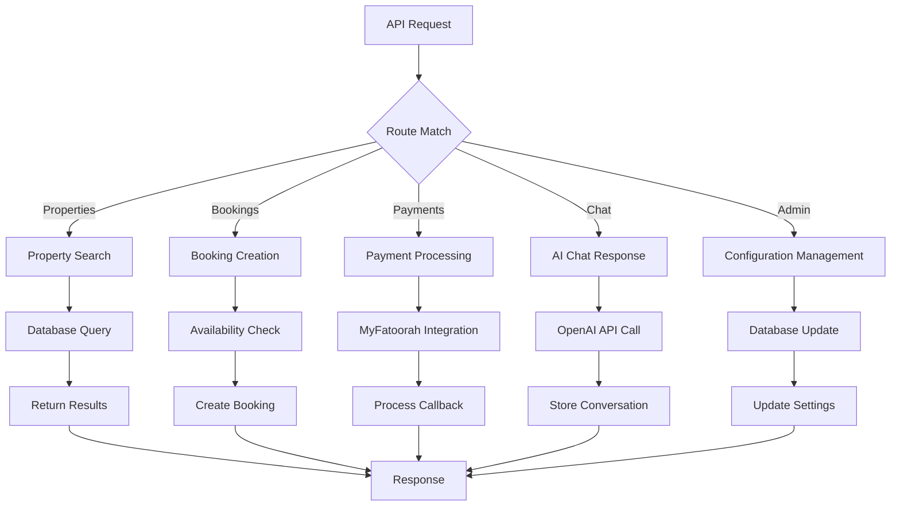
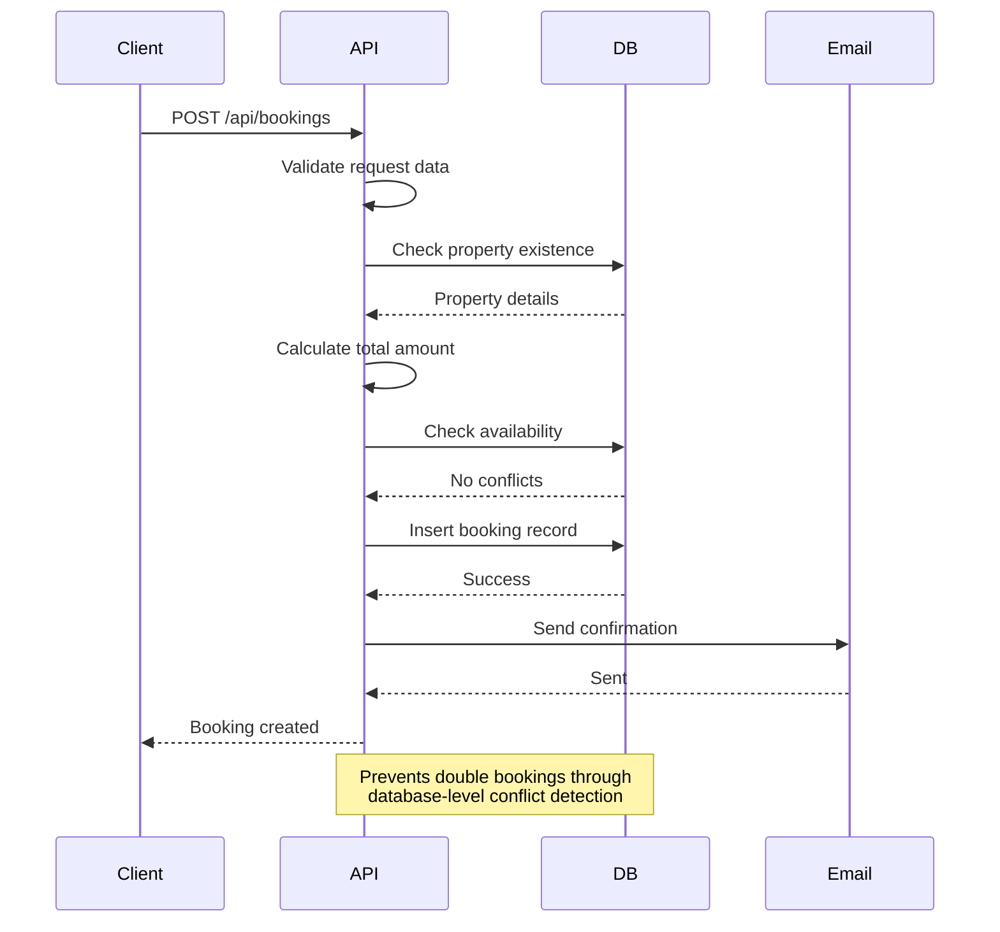
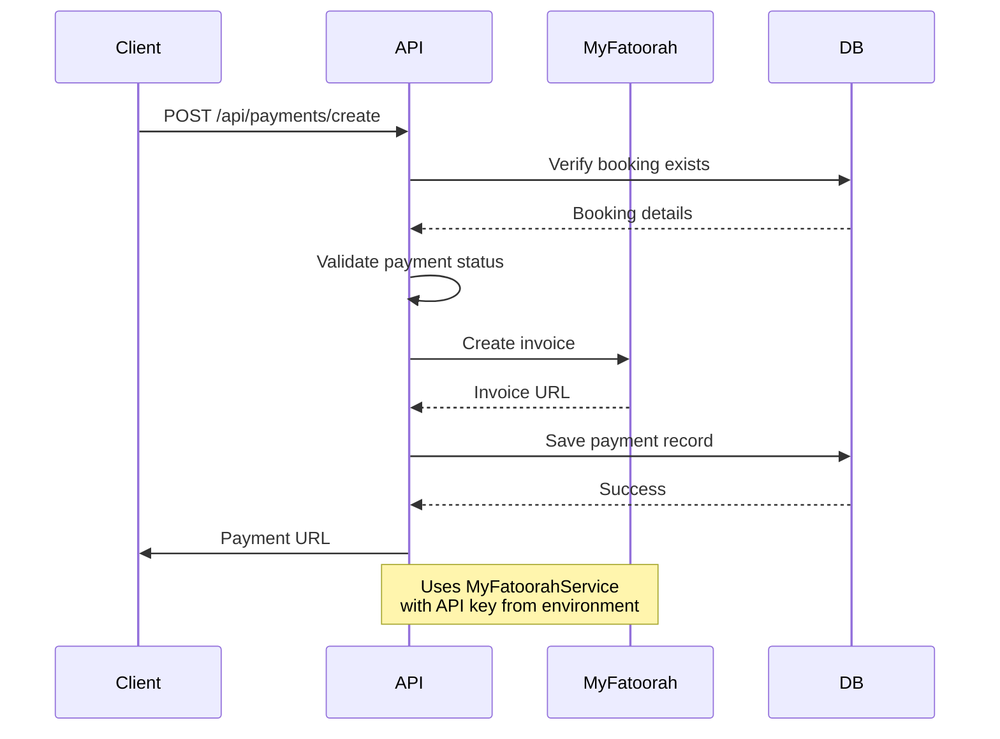
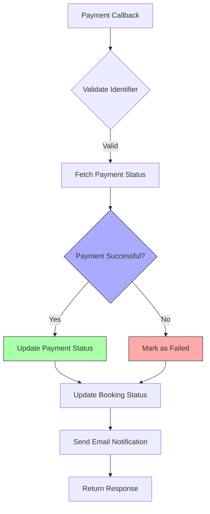
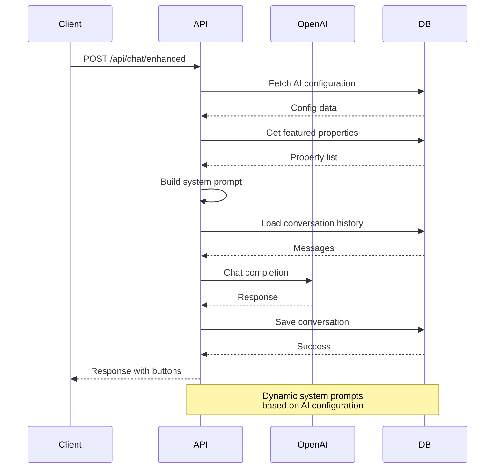
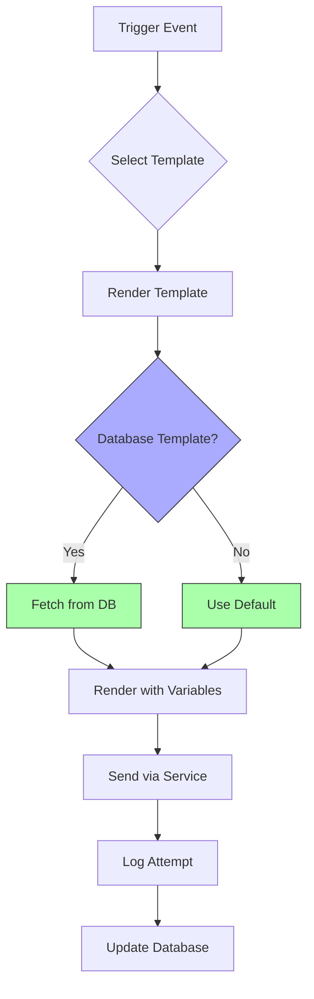
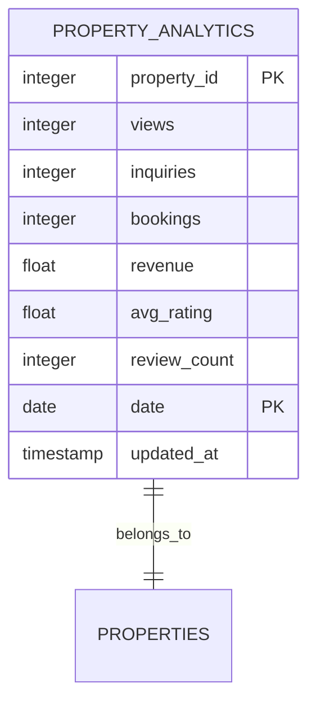
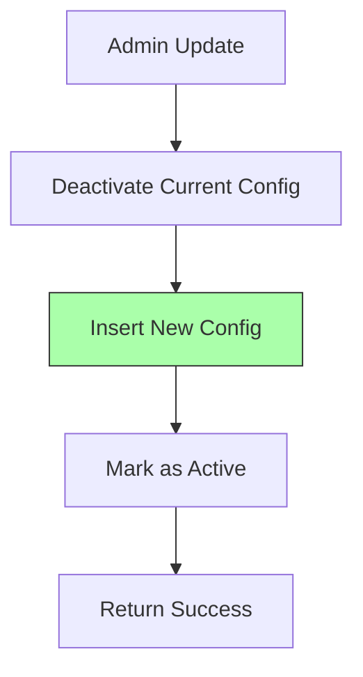

# Business Logic Layer

<cite>
**Referenced Files in This Document**   
- [src/worker/index.ts](file://src/worker/index.ts)
- [src/shared/payment.ts](file://src/shared/payment.ts)
- [src/shared/email.ts](file://src/shared/types.ts)
- [src/shared/types.ts](file://src/shared/types.ts)
- [src/react-app/contexts/ChatContext.tsx](file://src/react-app/contexts/ChatContext.tsx)
- [src/react-app/components/admin/AIConfigPanel.tsx](file://src/react-app/components/admin/AIConfigPanel.tsx)
</cite>

## Table of Contents
1. [Introduction](#introduction)
2. [Project Structure](#project-structure)
3. [Core Business Logic Components](#core-business-logic-components)
4. [Booking and Availability Management](#booking-and-availability-management)
5. [Payment Processing Workflow](#payment-processing-workflow)
6. [AI Chat Integration and Dynamic Configuration](#ai-chat-integration-and-dynamic-configuration)
7. [Email and Notification System](#email-and-notification-system)
8. [Analytics and Property Performance](#analytics-and-property-performance)
9. [Error Handling and Resilience Patterns](#error-handling-and-resilience-patterns)
10. [Configuration and Admin Controls](#configuration-and-admin-controls)

## Introduction
The Business Logic Layer of HabibiStay orchestrates core operations including booking validation, payment processing, property availability checks, and AI-driven guest interactions. This document details the implementation of these workflows, focusing on integration with external services like MyFatoorah for payments and OpenAI for chat responses. The system is built using Hono on Cloudflare Workers, enabling serverless execution with low latency. Key features include dynamic AI configuration, idempotent payment callbacks, and real-time property analytics.

## Project Structure
The project follows a layered architecture with clear separation between frontend, shared utilities, and backend worker logic. The business logic resides primarily in the worker module, while shared types and services are accessible across the application.

```mermaid
graph TB
subgraph "Frontend"
ReactApp[src/react-app]
Components[Components]
Contexts[Contexts]
end
subgraph "Shared"
Shared[src/shared]
Types[types.ts]
Payment[payment.ts]
Email[email.ts]
end
subgraph "Backend"
Worker[src/worker]
Index[index.ts]
end
ReactApp --> Shared
Shared --> Worker
Worker --> External[External Services]
style ReactApp fill:#f9f,stroke:#333
style Shared fill:#bbf,stroke:#333
style Worker fill:#f96,stroke:#333
```

**Diagram sources**
- [src/worker/index.ts](file://src/worker/index.ts#L1-L20)
- [src/shared/types.ts](file://src/shared/types.ts#L1-L10)

**Section sources**
- [src/worker/index.ts](file://src/worker/index.ts#L1-L50)
- [src/shared/types.ts](file://src/shared/types.ts#L1-L20)

## Core Business Logic Components
The core business logic is implemented in the worker's index.ts file, which defines RESTful endpoints for property search, booking creation, payment processing, and AI chat interactions. The system uses Zod for request validation and leverages Cloudflare's D1 database for persistent storage.



**Diagram sources**
- [src/worker/index.ts](file://src/worker/index.ts#L200-L1000)

**Section sources**
- [src/worker/index.ts](file://src/worker/index.ts#L1-L200)

## Booking and Availability Management
The booking system implements comprehensive validation to prevent double bookings and ensure data integrity. When a booking request is received, the system performs multiple checks including property existence, date validity, and availability conflicts.

### Booking Creation Workflow


**Diagram sources**
- [src/worker/index.ts](file://src/worker/index.ts#L400-L450)

**Section sources**
- [src/worker/index.ts](file://src/worker/index.ts#L400-L500)

### Property Availability Check
The availability check uses a comprehensive date overlap algorithm to detect conflicting bookings:

```sql
SELECT id FROM bookings 
WHERE property_id = ? 
AND status NOT IN ('cancelled', 'rejected')
AND (
  (check_in_date <= ? AND check_out_date > ?) OR
  (check_in_date < ? AND check_out_date >= ?) OR
  (check_in_date >= ? AND check_out_date <= ?)
)
```

This query ensures that no two bookings can overlap in time for the same property, preventing double bookings under all possible overlap scenarios.

## Payment Processing Workflow
The payment system integrates with MyFatoorah to create secure payment invoices and handle callback notifications. The workflow ensures idempotency and maintains consistent booking states.

### Payment Creation Sequence


**Diagram sources**
- [src/worker/index.ts](file://src/worker/index.ts#L1000-L1050)
- [src/shared/payment.ts](file://src/shared/payment.ts#L1-L20)

**Section sources**
- [src/worker/index.ts](file://src/worker/index.ts#L1000-L1100)

### Payment Callback Processing
The system handles payment callbacks with robust error handling and state management:



**Diagram sources**
- [src/worker/index.ts](file://src/worker/index.ts#L1050-L1150)

**Section sources**
- [src/worker/index.ts](file://src/worker/index.ts#L1050-L1200)

## AI Chat Integration and Dynamic Configuration
The AI chat system, powered by OpenAI, provides an interactive assistant named Sara that helps guests find properties and complete bookings. The system supports dynamic configuration of AI behavior through admin settings.

### Enhanced Chat Workflow


**Diagram sources**
- [src/worker/index.ts](file://src/worker/index.ts#L1600-L1700)
- [src/react-app/contexts/ChatContext.tsx](file://src/react-app/contexts/ChatContext.tsx#L189-L219)

**Section sources**
- [src/worker/index.ts](file://src/worker/index.ts#L1600-L1800)

### AI Configuration Options
The system supports configurable AI parameters:

**Configuration Options**
- model_provider: openai, anthropic, gemini
- model_name: gpt-4o, gpt-4o-mini, claude-3-5-sonnet, etc.
- temperature: 0.0-1.0 (creativity control)
- max_tokens: Maximum response length
- personality: professional, friendly, casual
- language: en, ar (future)

These settings can be modified through the admin interface and take effect immediately for new conversations.

## Email and Notification System
The email system handles transactional communications including booking confirmations, payment receipts, and contact form notifications. Emails are logged for auditing and troubleshooting.

### Email Processing Flow


**Diagram sources**
- [src/worker/index.ts](file://src/worker/index.ts#L50-L100)
- [src/shared/email.ts](file://src/shared/email.ts#L1-L20)

**Section sources**
- [src/worker/index.ts](file://src/worker/index.ts#L50-L150)

## Analytics and Property Performance
The system tracks property performance through analytics records that capture views, bookings, and revenue metrics. This data is used for owner dashboards and business intelligence.

### Analytics Data Model


The analytics system uses daily aggregation with conflict resolution to update metrics:

```sql
INSERT INTO property_analytics (property_id, views, date) 
VALUES (?, 1, ?)
ON CONFLICT(property_id, date) 
DO UPDATE SET views = views + 1, updated_at = CURRENT_TIMESTAMP
```

**Diagram sources**
- [src/worker/index.ts](file://src/worker/index.ts#L1200-L1250)

**Section sources**
- [src/worker/index.ts](file://src/worker/index.ts#L1200-L1300)

## Error Handling and Resilience Patterns
The system implements comprehensive error handling to ensure reliability and data consistency across all operations.

### Error Recovery Strategies
**Payment Failures**: When payment creation fails, the system logs the error and returns a client-friendly message without exposing sensitive details. The booking remains in "pending" status, allowing retry.

**Double Booking Prevention**: The availability check uses database constraints and transactional integrity to prevent race conditions. The date overlap query covers all possible conflict scenarios.

**Chatbot Latency**: The AI system includes timeout handling and fallback responses. Admin configuration allows adjusting model parameters to balance quality and response time.

**Idempotency**: Payment callbacks include idempotency checks by verifying the invoice ID against existing records, preventing duplicate processing.

## Configuration and Admin Controls
Administrators can configure key system parameters through dedicated API endpoints and UI components.

### AI Configuration Management
The AI configuration system allows dynamic updates to the chat assistant's behavior:



The system maintains only one active configuration at a time, ensuring consistency across all chat sessions.

**Section sources**
- [src/worker/index.ts](file://src/worker/index.ts#L1400-L1600)
- [src/react-app/components/admin/AIConfigPanel.tsx](file://src/react-app/components/admin/AIConfigPanel.tsx#L138-L205)