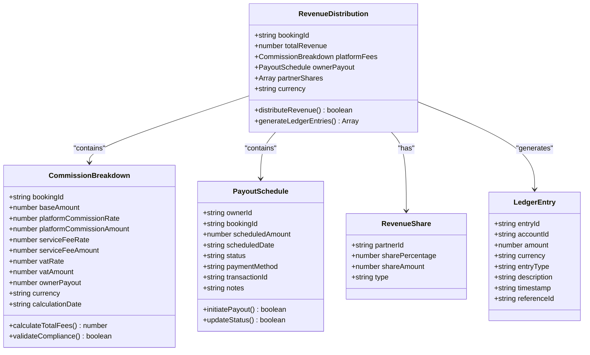
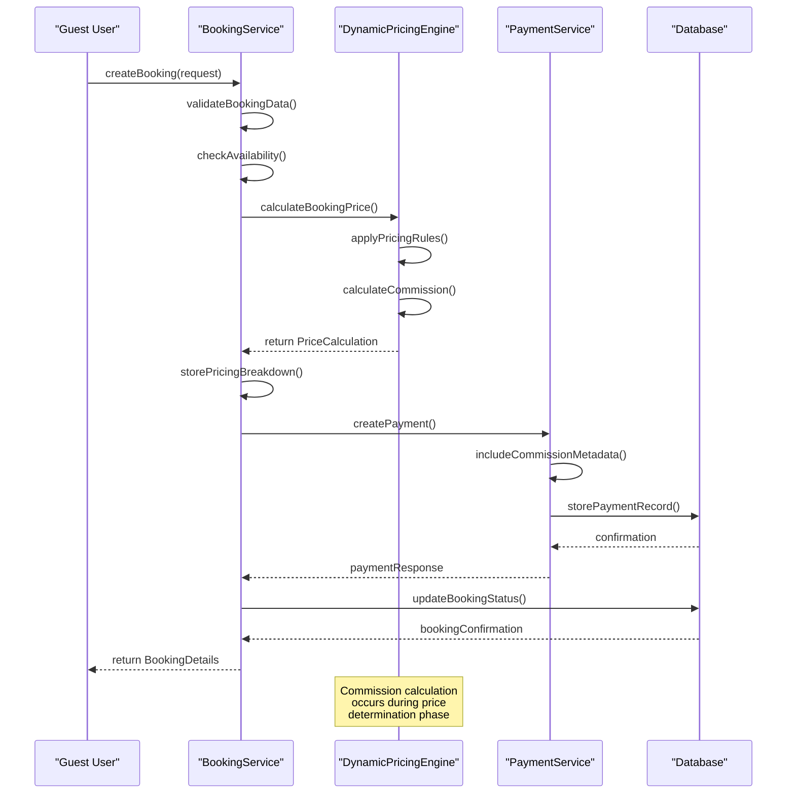
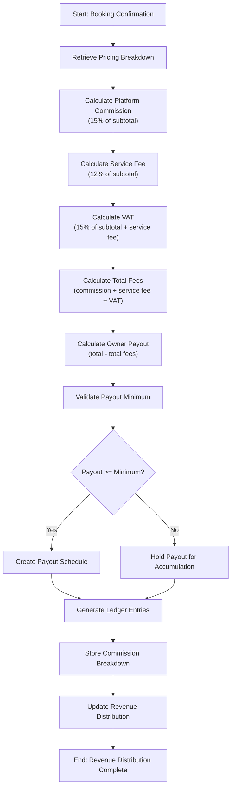
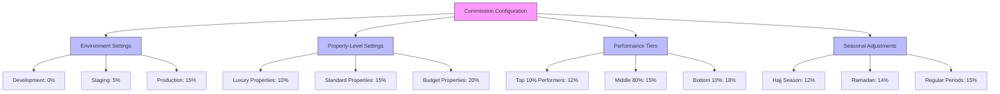
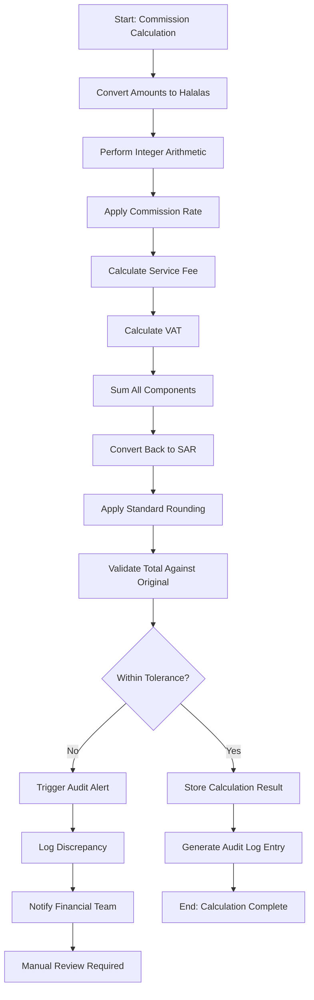

# Commission Calculations

<cite>
**Referenced Files in This Document**   
- [BookingService.ts](file://src/server/services/BookingService.ts)
- [PaymentService.ts](file://src/server/services/PaymentService.ts)
- [dynamic-pricing-engine.ts](file://src/shared/dynamic-pricing-engine.ts)
- [dynamic-pricing-types.ts](file://src/shared/dynamic-pricing-types.ts)
- [payment.ts](file://src/shared/payment.ts)
</cite>

## Table of Contents
1. [Introduction](#introduction)
2. [Commission Calculation Overview](#commission-calculation-overview)
3. [Domain Models](#domain-models)
4. [Commission Application Flow](#commission-application-flow)
5. [Revenue Distribution Logic](#revenue-distribution-logic)
6. [Integration with Payment System](#integration-with-payment-system)
7. [Configuration and Dynamic Rates](#configuration-and-dynamic-rates)
8. [Error Handling and Financial Accuracy](#error-handling-and-financial-accuracy)
9. [Example Calculation](#example-calculation)

## Introduction
This document details the commission calculation logic within the HabibiStay platform, focusing on how platform fees are computed and owner payouts are determined. The system integrates dynamic pricing, tax compliance, and financial accuracy requirements specific to Saudi Arabia. The commission structure is applied during the booking process and reflected in payment transactions, with comprehensive audit trails and reconciliation capabilities.

## Commission Calculation Overview
The commission calculation system determines platform fees and property owner payouts based on booking amounts, applying both fixed and variable rate models. The core logic resides in the pricing and booking services, where commission percentages are calculated before payment processing.

The system implements a 15% platform commission by default, with additional service fees and VAT (Value Added Tax) applied according to Saudi Arabian financial regulations. Commission rates can be configured at multiple levels, including property-specific settings, performance-based tiers, and environmental variables.

**Section sources**
- [BookingService.ts](file://src/server/services/BookingService.ts#L500-L550)
- [dynamic-pricing-engine.ts](file://src/shared/dynamic-pricing-engine.ts#L30-L100)

## Domain Models
The commission calculation system utilizes several key domain models that define the structure of financial transactions and revenue distribution.



**Diagram sources**
- [dynamic-pricing-types.ts](file://src/shared/dynamic-pricing-types.ts#L100-L200)
- [payment.ts](file://src/shared/payment.ts#L10-L50)

**Section sources**
- [dynamic-pricing-types.ts](file://src/shared/dynamic-pricing-types.ts#L1-L265)
- [payment.ts](file://src/shared/payment.ts#L1-L100)

## Commission Application Flow
The commission calculation occurs during the booking creation process, specifically within the price calculation workflow. When a user initiates a booking, the system calculates the total amount including all fees and commissions.



**Diagram sources**
- [BookingService.ts](file://src/server/services/BookingService.ts#L100-L300)
- [PaymentService.ts](file://src/server/services/PaymentService.ts#L100-L200)

**Section sources**
- [BookingService.ts](file://src/server/services/BookingService.ts#L1-L822)
- [PaymentService.ts](file://src/server/services/PaymentService.ts#L1-L856)

## Revenue Distribution Logic
The revenue distribution logic determines how the total booking amount is allocated between the platform and property owners. This process occurs after successful payment verification and involves creating detailed ledger entries.

The system applies a hierarchical calculation process:
1. Calculate base booking amount based on nightly rates and duration
2. Apply property-specific pricing rules and discounts
3. Calculate platform commission (15% of subtotal)
4. Apply service fees (12% of subtotal)
5. Calculate VAT (15% of subtotal plus service fees)
6. Determine net owner payout



**Diagram sources**
- [BookingService.ts](file://src/server/services/BookingService.ts#L500-L550)
- [dynamic-pricing-engine.ts](file://src/shared/dynamic-pricing-engine.ts#L150-L200)

**Section sources**
- [BookingService.ts](file://src/server/services/BookingService.ts#L500-L550)
- [dynamic-pricing-engine.ts](file://src/shared/dynamic-pricing-engine.ts#L30-L200)

## Integration with Payment System
The commission calculation is tightly integrated with the payment processing system, ensuring that fee information is included in transaction metadata and properly recorded in the financial ledger.

When a payment is created, the commission breakdown is included in the metadata, which is then stored with the payment record in the database. This integration ensures that all financial data is traceable and auditable.

```mermaid
classDiagram
class PaymentRequest {
+string bookingId
+number amount
+string currency
+string description
+CustomerInfo customerInfo
+Record<string, any> metadata
}
class PaymentResponse {
+boolean success
+string paymentId
+string transactionId
+string status
+number amount
+string currency
+string paymentUrl
+string provider
+Record<string, any> metadata
}
class CommissionMetadata {
+number platformCommission
+number serviceFee
+number vat
+number ownerPayout
+string currency
+number commissionRate
+string calculationMethod
}
PaymentRequest --> CommissionMetadata : "includes in metadata"
PaymentResponse --> CommissionMetadata : "includes in metadata"
CommissionMetadata --> RevenueDistribution : "used to create"
note right of CommissionMetadata
Commission metadata is embedded<br/>in payment transactions to ensure<br/>financial transparency and auditability
end note
```

**Diagram sources**
- [PaymentService.ts](file://src/server/services/PaymentService.ts#L20-L50)
- [payment.ts](file://src/shared/payment.ts#L10-L30)

**Section sources**
- [PaymentService.ts](file://src/server/services/PaymentService.ts#L1-L856)
- [payment.ts](file://src/shared/payment.ts#L1-L100)

## Configuration and Dynamic Rates
The commission system supports configurable rates and dynamic adjustments based on various factors including property performance, booking volume, and market conditions.

Commission rates can be configured at multiple levels:
- Environment-based rates (development, staging, production)
- Property-specific commission structures
- Performance-based tiers that adjust rates based on occupancy and revenue metrics
- Seasonal adjustments aligned with tourism patterns in Saudi Arabia

The system also supports tax inclusion configurations, ensuring compliance with local financial regulations. VAT (15%) is automatically applied to all transactions, with proper reporting capabilities for tax reconciliation.



**Diagram sources**
- [dynamic-pricing-engine.ts](file://src/shared/dynamic-pricing-engine.ts#L300-L400)
- [BookingService.ts](file://src/server/services/BookingService.ts#L500-L550)

**Section sources**
- [dynamic-pricing-engine.ts](file://src/shared/dynamic-pricing-engine.ts#L1-L638)
- [BookingService.ts](file://src/server/services/BookingService.ts#L500-L550)

## Error Handling and Financial Accuracy
The system implements robust error handling and financial accuracy measures to prevent miscalculations and ensure data integrity.

Key financial accuracy features include:
- Decimal arithmetic for precise monetary calculations
- Audit logging of all commission calculations
- Reconciliation reports for financial verification
- Rounding error prevention through standardized rounding rules
- Currency precision management to prevent loss in conversion

The system uses integer-based arithmetic for monetary values (in halalas, the subunit of SAR) to avoid floating-point precision issues. All calculations are performed using exact arithmetic, with proper rounding applied at the final presentation stage.



**Diagram sources**
- [dynamic-pricing-engine.ts](file://src/shared/dynamic-pricing-engine.ts#L150-L200)
- [BookingService.ts](file://src/server/services/BookingService.ts#L500-L550)

**Section sources**
- [dynamic-pricing-engine.ts](file://src/shared/dynamic-pricing-engine.ts#L1-L638)
- [BookingService.ts](file://src/server/services/BookingService.ts#L500-L550)

## Example Calculation
This section provides a concrete example of how a 15% platform commission is applied to a 1000 SAR booking, demonstrating the complete calculation process and ledger entry generation.

**Scenario**: A guest books a property for 1000 SAR (subtotal). The system applies a 15% platform commission, 12% service fee, and 15% VAT according to Saudi Arabian financial regulations.

```mermaid
flowchart LR
A["Base Booking Amount: 1000 SAR"] --> B["Platform Commission (15%): 150 SAR"]
A --> C["Service Fee (12%): 120 SAR"]
B --> D["Subtotal + Fees: 1270 SAR"]
D --> E["VAT (15%): 190.50 SAR"]
E --> F["Total Amount: 1460.50 SAR"]
A --> G["Owner Payout: 850 SAR"]
B --> H["Platform Revenue: 460.50 SAR"]
style A fill:#e6f3ff,stroke:#333
style B fill:#ffe6e6,stroke:#333
style C fill:#ffe6e6,stroke:#333
style D fill:#e6f3ff,stroke:#333
style E fill:#ffe6e6,stroke:#333
style F fill:#e6f3ff,stroke:#333
style G fill:#d9ead3,stroke:#333
style H fill:#d9ead3,stroke:#333
note right of H
Platform Revenue breakdown:<br/>
- Commission: 150 SAR<br/>
- Service Fee: 120 SAR<br/>
- VAT: 190.50 SAR
end note
```

The system generates the following ledger entries:

**Ledger Entries for 1000 SAR Booking**
- **Entry 1**: Debit - Guest Payment, Amount: 1460.50 SAR, Description: "Booking payment received"
- **Entry 2**: Credit - Owner Payout Liability, Amount: 850 SAR, Description: "Owner payout for booking"
- **Entry 3**: Credit - Platform Commission Revenue, Amount: 150 SAR, Description: "15% platform commission"
- **Entry 4**: Credit - Service Fee Revenue, Amount: 120 SAR, Description: "Service fee (12%)"
- **Entry 5**: Credit - VAT Payable, Amount: 190.50 SAR, Description: "VAT (15%) on transaction"

The CommissionBreakdown object for this transaction would contain:
- bookingId: "HBS12345678"
- baseAmount: 1000
- platformCommissionRate: 0.15
- platformCommissionAmount: 150
- serviceFeeRate: 0.12
- serviceFeeAmount: 120
- vatRate: 0.15
- vatAmount: 190.50
- ownerPayout: 850
- currency: "SAR"
- calculationDate: "2025-01-15T10:30:00Z"

This example demonstrates the complete financial flow from booking to revenue distribution, ensuring transparency and compliance with Saudi Arabian financial regulations.

**Section sources**
- [BookingService.ts](file://src/server/services/BookingService.ts#L500-L550)
- [dynamic-pricing-engine.ts](file://src/shared/dynamic-pricing-engine.ts#L30-L100)
- [PaymentService.ts](file://src/server/services/PaymentService.ts#L200-L250)