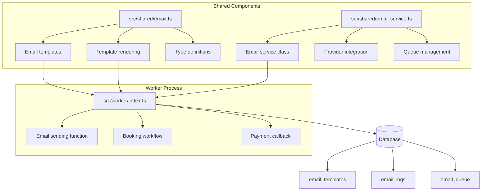
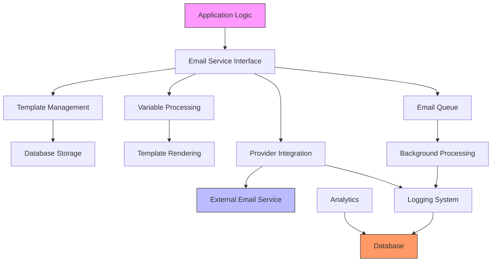
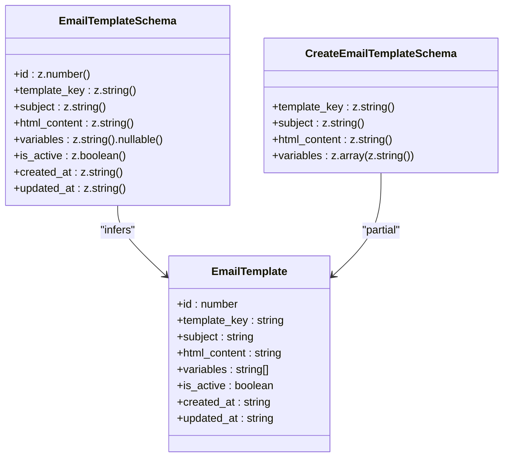
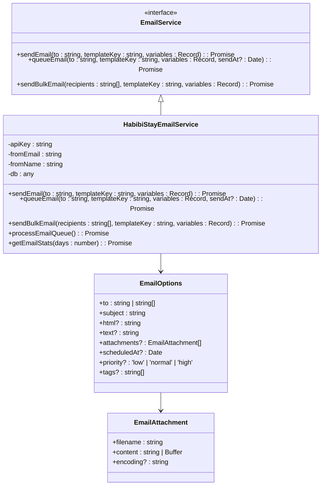
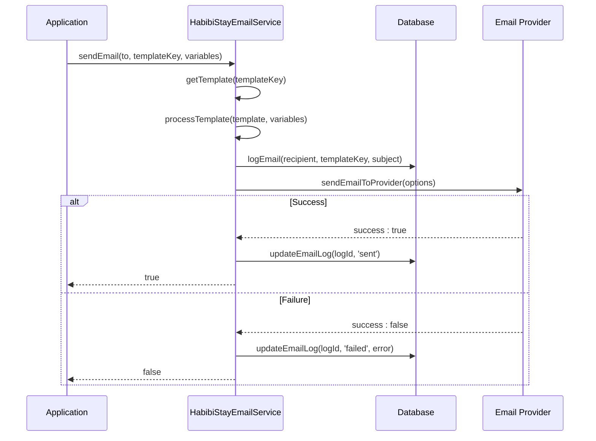
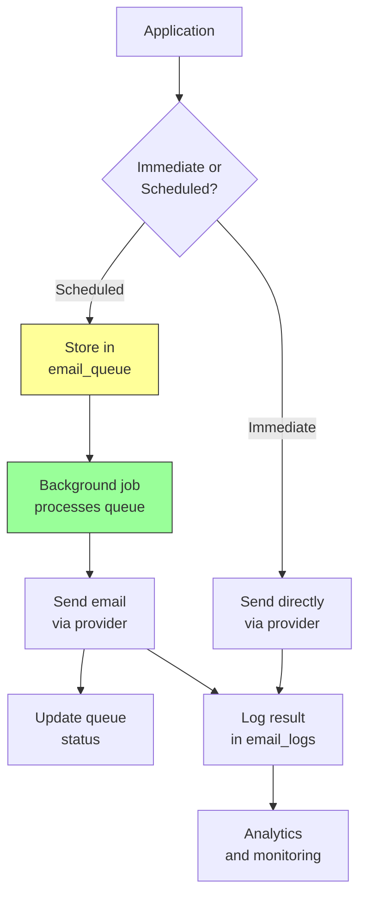
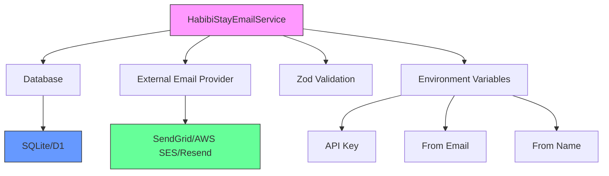

# Email Service Integration

<cite>
**Referenced Files in This Document**   
- [src/shared/email.ts](file://src/shared/email.ts)
- [src/shared/email-service.ts](file://src/shared/email-service.ts)
- [src/worker/index.ts](file://src/worker/index.ts)
</cite>

## Table of Contents
1. [Introduction](#introduction)
2. [Project Structure](#project-structure)
3. [Core Components](#core-components)
4. [Architecture Overview](#architecture-overview)
5. [Detailed Component Analysis](#detailed-component-analysis)
6. [Dependency Analysis](#dependency-analysis)
7. [Performance Considerations](#performance-considerations)
8. [Troubleshooting Guide](#troubleshooting-guide)
9. [Conclusion](#conclusion)

## Introduction
The email service integration in HabibiStay provides a robust, provider-agnostic solution for sending transactional and marketing emails across the platform. This system abstracts the complexity of email delivery by offering a clean interface for sending emails using predefined templates, while handling logging, queuing, and error recovery. The service supports key use cases such as booking confirmations, payment notifications, and user onboarding emails. It is designed with scalability, reliability, and compliance in mind, featuring built-in logging, retry mechanisms, and analytics. The implementation separates concerns between template management, email rendering, provider integration, and delivery tracking, making it maintainable and extensible.

## Project Structure
The email functionality is distributed across multiple directories in the HabibiStay codebase, following a modular architecture that separates shared utilities from worker-specific implementations. The core email logic resides in the `src/shared` directory, while the execution and integration occur in the `src/worker` module.

**Diagram sources**
- [src/shared/email.ts](file://src/shared/email.ts)
- [src/shared/email-service.ts](file://src/shared/email-service.ts)
- [src/worker/index.ts](file://src/worker/index.ts)

**Section sources**
- [src/shared/email.ts](file://src/shared/email.ts)
- [src/shared/email-service.ts](file://src/shared/email-service.ts)
- [src/worker/index.ts](file://src/worker/index.ts)

## Core Components
The email system consists of several core components that work together to deliver emails reliably. These include the email template system, the rendering engine, the service interface, and the delivery mechanism. The system uses Zod for schema validation of email templates and messages, ensuring data integrity. Templates are stored in the database and can be dynamically loaded at runtime. The service supports both immediate and queued email delivery, with the ability to schedule emails for future sending. All email activity is logged for auditing and troubleshooting purposes.

**Section sources**
- [src/shared/email.ts](file://src/shared/email.ts#L1-L250)
- [src/shared/email-service.ts](file://src/shared/email-service.ts#L1-L400)

## Architecture Overview
The email service follows a layered architecture that separates concerns and promotes reusability. At the foundation is the template system, which defines the structure and content of emails. Above this is the rendering layer, which merges dynamic data with templates. The service layer provides the public API for sending emails, while the delivery layer handles the actual transmission through a provider. The logging and queuing systems provide reliability and observability.

**Diagram sources**
- [src/shared/email-service.ts](file://src/shared/email-service.ts#L1-L400)
- [src/worker/index.ts](file://src/worker/index.ts#L1-L2500)

## Detailed Component Analysis

### Email Template System
The template system provides a structured way to define and manage email content. Templates are defined with a unique key, subject line, HTML content, and a list of required variables. The system includes validation schemas to ensure template integrity.

**Diagram sources**
- [src/shared/email.ts](file://src/shared/email.ts#L1-L50)

#### Template Variables and Placeholders
The system uses a simple placeholder syntax `{{ variable_name }}` to inject dynamic content into templates. During rendering, these placeholders are replaced with actual values from the provided variables object. The system also supports conditional blocks using `{{#variable}}content{{/variable}}` syntax, which only includes content if the variable has a truthy value.

**Section sources**
- [src/shared/email.ts](file://src/shared/email.ts#L78-L250)

### Email Service Implementation
The `HabibiStayEmailService` class provides a comprehensive interface for sending emails through various channels. It abstracts the underlying email provider, allowing for easy switching between services like SendGrid, AWS SES, or Resend.

**Diagram sources**
- [src/shared/email-service.ts](file://src/shared/email-service.ts#L50-L400)

#### Email Sending Workflow
The process of sending an email involves several steps to ensure reliability and proper logging. The workflow begins with template retrieval and variable processing, followed by logging the attempt, sending through the provider, and updating the log with the result.

**Diagram sources**
- [src/shared/email-service.ts](file://src/shared/email-service.ts#L130-L230)

### Email Queue and Background Processing
For improved reliability and performance, the system includes a queuing mechanism that allows emails to be sent asynchronously. This is particularly useful for bulk emails or when the provider service is temporarily unavailable.

**Diagram sources**
- [src/shared/email-service.ts](file://src/shared/email-service.ts#L220-L300)

**Section sources**
- [src/shared/email-service.ts](file://src/shared/email-service.ts#L220-L300)

## Dependency Analysis
The email service has several key dependencies that enable its functionality. The primary dependency is the database, which stores templates, logs, and queue items. The service also depends on an external email provider for actual delivery, though this is abstracted through the `sendEmailToProvider` method. The system uses Zod for runtime type checking and validation of email data. The worker environment provides the execution context and access to environment variables.

**Diagram sources**
- [src/shared/email-service.ts](file://src/shared/email-service.ts#L1-L50)
- [src/worker/index.ts](file://src/worker/index.ts#L40-L83)

## Performance Considerations
The email service is designed with performance and scalability in mind. The queuing system allows for asynchronous processing, preventing email delivery from blocking critical application workflows. Bulk email operations use `Promise.allSettled` to handle multiple deliveries concurrently while isolating failures. The system limits queue processing to 50 items at a time to prevent resource exhaustion. Template variables are processed efficiently using regular expressions, and database queries are parameterized to prevent injection attacks. For high-volume scenarios, the system could be enhanced with rate limiting, connection pooling, and provider-specific optimizations.

## Troubleshooting Guide
Common issues with the email service typically fall into several categories: configuration errors, template problems, delivery failures, and database issues.

**Configuration Issues**
- **Missing API key**: Ensure the email provider API key is set in environment variables
- **Incorrect from address**: Verify the from email and name are properly configured
- **Provider not integrated**: The current implementation is a placeholder and requires actual provider integration

**Template Issues**
- **Template not found**: Check that the template key exists in the database
- **Missing variables**: Ensure all required variables are provided when sending
- **Invalid HTML**: Validate that template HTML is well-formed and doesn't contain syntax errors

**Delivery Failures**
- **Provider errors**: Check the provider's status page and API documentation
- **Rate limiting**: Implement retry logic with exponential backoff
- **Spam filtering**: Ensure proper SPF, DKIM, and DMARC records are configured

**Database Issues**
- **Connection problems**: Verify database connectivity and credentials
- **Table schema**: Ensure email-related tables exist with correct structure
- **Permission errors**: Check that the database user has required privileges

The system includes comprehensive logging to help diagnose issues. Email attempts and results are recorded in the `email_logs` table, including any error messages. The `processEmailQueue` method can be used to retry failed deliveries. For immediate debugging, console logs provide visibility into the email sending process.

**Section sources**
- [src/shared/email-service.ts](file://src/shared/email-service.ts#L130-L230)
- [src/worker/index.ts](file://src/worker/index.ts#L85-L120)

## Conclusion
The email service integration in HabibiStay provides a solid foundation for transactional and marketing communications. By abstracting the email provider interface and implementing robust logging and queuing, the system ensures reliable delivery while maintaining flexibility for future enhancements. The template-based approach allows for consistent branding and easy content updates. The current implementation serves as a framework that can be extended with actual provider integrations, attachment support, and advanced features like A/B testing and engagement tracking. With proper configuration and monitoring, this system can effectively support the communication needs of the HabibiStay platform.