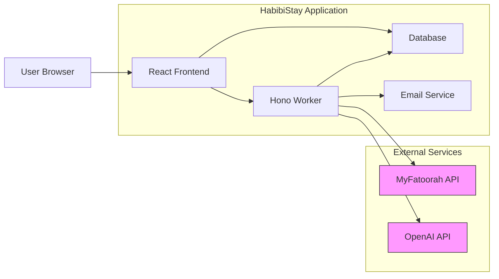
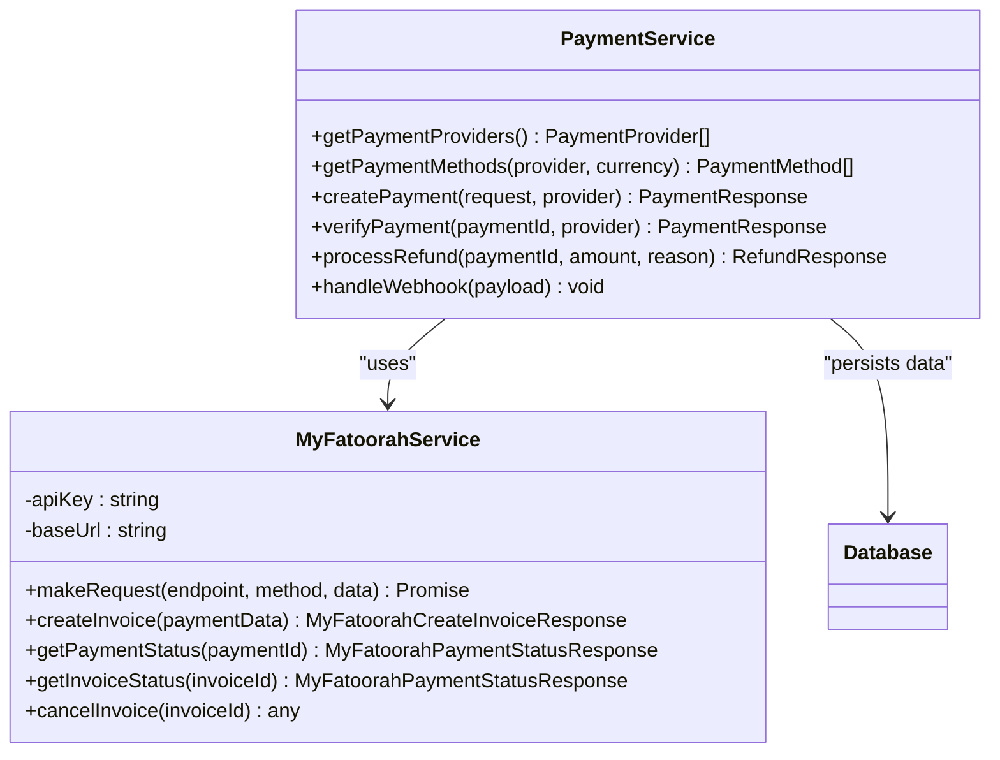
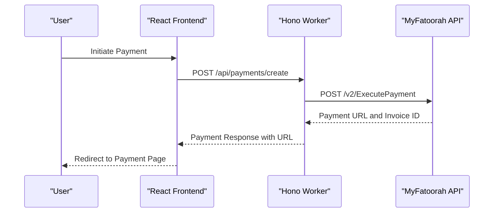
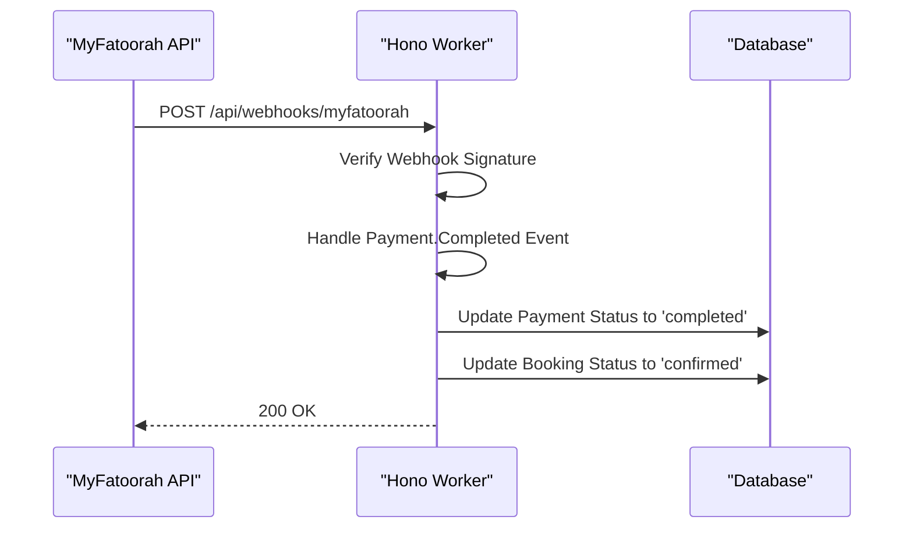
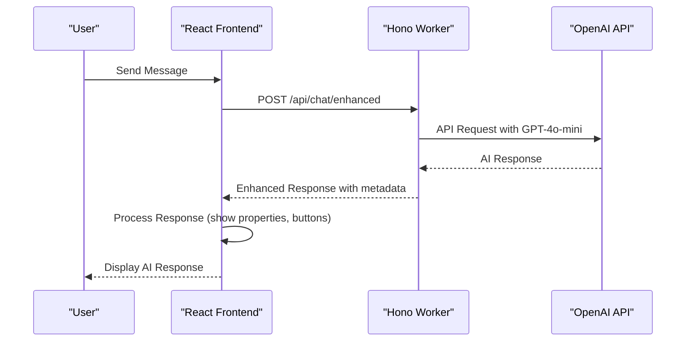
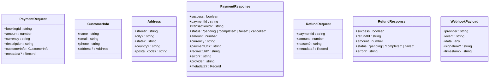
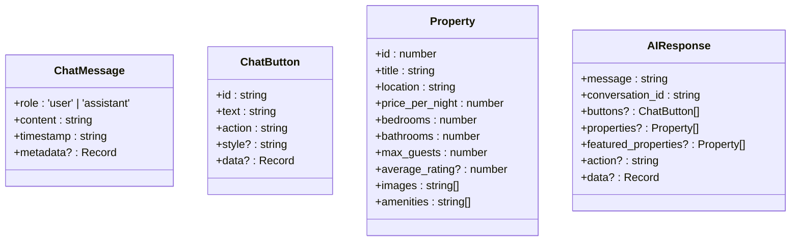
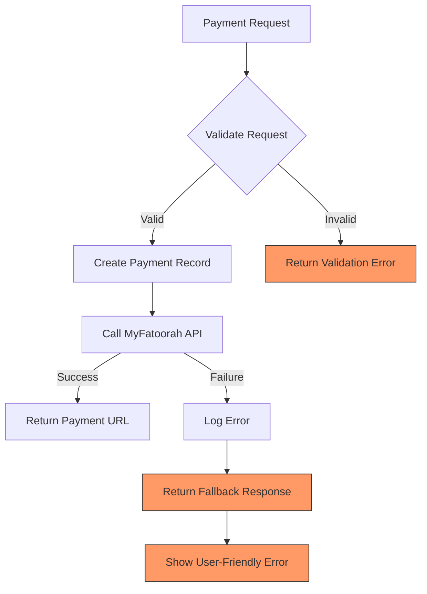

# External Service Integration

<cite>
**Referenced Files in This Document**   
- [index.ts](file://src/worker/index.ts)
- [PaymentService.ts](file://src/server/services/PaymentService.ts)
- [payment.ts](file://src/shared/payment.ts)
- [ChatContext.tsx](file://src/react-app/contexts/ChatContext.tsx)
- [ChatBot.tsx](file://src/react-app/components/ChatBot.tsx)
- [types.ts](file://src/shared/types.ts)
</cite>

## Table of Contents
1. [Introduction](#introduction)
2. [Project Structure](#project-structure)
3. [Core Components](#core-components)
4. [Architecture Overview](#architecture-overview)
5. [Detailed Component Analysis](#detailed-component-analysis)
6. [Payment Integration with MyFatoorah](#payment-integration-with-myfatoorah)
7. [AI Chat Integration with OpenAI](#ai-chat-integration-with-openai)
8. [Domain Models and Type Definitions](#domain-models-and-type-definitions)
9. [Error Handling and Resilience Patterns](#error-handling-and-resilience-patterns)
10. [Configuration and Environment Management](#configuration-and-environment-management)
11. [Security Considerations](#security-considerations)
12. [Conclusion](#conclusion)

## Introduction
This document provides a comprehensive analysis of the external service integration layer in the HabibiStay application, focusing on the implementation details of MyFatoorah for payment processing and OpenAI for AI-powered chat functionality. The system is built using a modern stack with Hono as the backend framework, React for the frontend, and TypeScript for type safety across the codebase. The integration layer handles secure communication with third-party APIs, implements robust error handling and retry mechanisms, and provides a seamless user experience for booking accommodations and interacting with the AI assistant Sara.

## Project Structure
The HabibiStay application follows a well-organized project structure with clear separation of concerns between frontend, backend, shared utilities, and worker processes. The codebase is structured to promote reusability and maintainability, with shared types and utilities accessible across different parts of the application.

```mermaid
graph TB
subgraph "Frontend"
A[react-app]
A --> B[components]
A --> C[contexts]
A --> D[pages]
A --> E[hooks]
end
subgraph "Backend"
F[server]
F --> G[services]
F --> H[utils]
end
subgraph "Shared"
I[shared]
I --> J[types]
I --> K[payment]
I --> L[email]
I --> M[security]
end
subgraph "Worker"
N[worker]
N --> O[index.ts]
end
A < --> I
F < --> I
N < --> I
N < --> F
```

**Diagram sources**
- [index.ts](file://src/worker/index.ts)
- [PaymentService.ts](file://src/server/services/PaymentService.ts)
- [payment.ts](file://src/shared/payment.ts)

## Core Components
The external service integration in HabibiStay is primarily handled by two core components: the PaymentService for MyFatoorah integration and the ChatContext for OpenAI integration. These components are designed with modularity and reusability in mind, leveraging shared utilities and types across the application.

The PaymentService class in `PaymentService.ts` provides a comprehensive interface for handling payment operations including creation, verification, refunds, and webhook processing. It supports multiple payment providers with MyFatoorah as the primary provider, and is configured through environment variables for security and flexibility.

The ChatContext in `ChatContext.tsx` manages the state and functionality of the AI chat interface, handling message sending and receiving, voice input/output, conversation persistence, and interaction with the OpenAI API through the `/api/chat/enhanced` endpoint.

**Section sources**
- [PaymentService.ts](file://src/server/services/PaymentService.ts)
- [ChatContext.tsx](file://src/react-app/contexts/ChatContext.tsx)

## Architecture Overview
The external service integration architecture in HabibiStay follows a layered approach with clear separation between the frontend, backend, and external services. The architecture is designed to be secure, scalable, and resilient to failures in external dependencies.



**Diagram sources**
- [index.ts](file://src/worker/index.ts)
- [PaymentService.ts](file://src/server/services/PaymentService.ts)
- [ChatContext.tsx](file://src/react-app/contexts/ChatContext.tsx)

## Detailed Component Analysis
This section provides a detailed analysis of the key components involved in external service integration, including their implementation patterns, data flows, and interaction with external APIs.

### Payment Service Analysis
The PaymentService class is the central component for handling payment operations in HabibiStay. It provides a unified interface for interacting with different payment providers, with current implementation focusing on MyFatoorah.



**Diagram sources**
- [PaymentService.ts](file://src/server/services/PaymentService.ts)
- [payment.ts](file://src/shared/payment.ts)

## Payment Integration with MyFatoorah
The MyFatoorah payment integration in HabibiStay is implemented through a combination of backend services and frontend components that work together to provide a seamless payment experience.

### Payment Creation Flow
The payment creation process begins when a user initiates a booking and proceeds to payment. The frontend sends a payment request to the backend, which then communicates with the MyFatoorah API to create a payment invoice.



**Diagram sources**
- [PaymentService.ts](file://src/server/services/PaymentService.ts)
- [payment.ts](file://src/shared/payment.ts)

### Payment Verification and Webhook Handling
After a payment is completed, MyFatoorah sends a webhook notification to the application, which is processed to update the payment and booking status in the database.



**Diagram sources**
- [PaymentService.ts](file://src/server/services/PaymentService.ts)

### MyFatoorah Service Implementation
The MyFatoorahService class in `payment.ts` provides a clean wrapper around the MyFatoorah API, handling authentication, request formatting, and response parsing.

```typescript
export class MyFatoorahService {
  private apiKey: string;
  private baseUrl: string;
  
  constructor(apiKey: string, baseUrl: string = 'https://apitest.myfatoorah.com') {
    this.apiKey = apiKey;
    this.baseUrl = baseUrl;
  }

  private async makeRequest(endpoint: string, method: 'GET' | 'POST', data?: any): Promise<any> {
    const url = `${this.baseUrl}${endpoint}`;
    
    const headers: Record<string, string> = {
      'Authorization': `Bearer ${this.apiKey}`,
      'Content-Type': 'application/json',
    };

    const config: RequestInit = {
      method,
      headers,
    };

    if (data && method === 'POST') {
      config.body = JSON.stringify(data);
    }

    const response = await fetch(url, config);
    
    if (!response.ok) {
      throw new Error(`MyFatoorah API error: ${response.status} ${response.statusText}`);
    }

    return response.json();
  }
}
```

**Section sources**
- [payment.ts](file://src/shared/payment.ts#L115-L164)

## AI Chat Integration with OpenAI
The AI chat integration in HabibiStay leverages the OpenAI API to provide an intelligent assistant named Sara that helps users find accommodations and answer questions about properties.

### Chat Flow and Message Processing
The chat functionality is implemented using a context-based state management pattern in React, with the ChatContext handling all aspects of the chat interface and communication with the backend.



**Diagram sources**
- [ChatContext.tsx](file://src/react-app/contexts/ChatContext.tsx)
- [index.ts](file://src/worker/index.ts)

### OpenAI Client Initialization
The OpenAI client is initialized in the worker's entry point file with the API key injected from environment variables.

```typescript
// Initialize OpenAI client
function getOpenAIClient(env: Env): OpenAI {
  return new OpenAI({
    apiKey: env.OPENAI_API_KEY,
  });
}
```

**Section sources**
- [index.ts](file://src/worker/index.ts#L43-L48)

### Chat Context Implementation
The ChatContext manages the state of the chat interface, including messages, conversation state, and user interactions.

```typescript
const sendMessage = useCallback(async (content: string, action?: string) => {
  if (!content.trim() || isLoading) return;

  setIsLoading(true);
  
  // Add user message
  const userMessage: ChatMessage = {
    role: 'user',
    content: content.trim(),
    timestamp: new Date().toISOString(),
    metadata: { action },
  };
  
  addMessage(userMessage);

  try {
    // Send to enhanced chat endpoint
    const response = await fetch('/api/chat/enhanced', {
      method: 'POST',
      headers: {
        'Content-Type': 'application/json',
      },
      body: JSON.stringify({
        message: content.trim(),
        conversation_id: conversationId,
      }),
    });

    if (!response.ok) {
      throw new Error(`HTTP error! status: ${response.status}`);
    }

    const result = await response.json();
    
    if (result.success && result.data) {
      const aiResponse: any = result.data;
      
      // Update conversation ID if new
      if (aiResponse.conversation_id && aiResponse.conversation_id !== conversationId) {
        setConversationId(aiResponse.conversation_id);
      }
      
      // Add Sara's response
      const assistantMessage: ChatMessage = {
        role: 'assistant',
        content: aiResponse.message,
        timestamp: new Date().toISOString(),
        metadata: {
          buttons: aiResponse.buttons,
          properties: aiResponse.properties || aiResponse.featured_properties,
          action: aiResponse.action,
          data: aiResponse.data,
        },
      };
      
      addMessage(assistantMessage);
    }
  } catch (error) {
    console.error('Error sending message:', error);
    
    // Add error message
    const errorMessage: ChatMessage = {
      role: 'assistant',
      content: "I'm sorry, I'm having trouble connecting right now. Please try again in a moment.",
      timestamp: new Date().toISOString(),
      metadata: {
        error: true,
        buttons: [
          { id: 'retry', text: '🔄 Retry', action: 'retry', style: 'primary' },
          { id: 'contact_support', text: '📞 Contact Support', action: 'contact', style: 'secondary' },
        ],
      },
    };
    
    addMessage(errorMessage);
  } finally {
    setIsLoading(false);
  }
}, [isLoading, conversationId, addMessage, voiceEnabled, synthesis]);
```

**Section sources**
- [ChatContext.tsx](file://src/react-app/contexts/ChatContext.tsx#L189-L219)

## Domain Models and Type Definitions
The application uses a comprehensive set of TypeScript interfaces and types to ensure type safety and consistency across the codebase. These domain models define the structure of data exchanged between components and external services.

### Payment Domain Models
The payment system uses several key interfaces to define the structure of payment-related data:



**Diagram sources**
- [types.ts](file://src/shared/types.ts)

### Chat Domain Models
The chat system uses domain models to represent messages, buttons, and other interactive elements:



**Diagram sources**
- [types.ts](file://src/shared/types.ts)

## Error Handling and Resilience Patterns
The external service integration layer implements robust error handling and resilience patterns to ensure reliability and a good user experience even when external services are unavailable.

### Payment Error Handling
The payment system includes comprehensive error handling for various failure scenarios:



**Diagram sources**
- [PaymentService.ts](file://src/server/services/PaymentService.ts)

### Retry and Fallback Mechanisms
While the current implementation does not explicitly show retry logic, it includes fallback responses and error recovery mechanisms:

```typescript
private async createMyFatoorahPayment(paymentId: string, request: PaymentRequest): Promise<PaymentResponse> {
  try {
    // API call to MyFatoorah
    const response = await fetch(`${this.myFatoorahConfig.baseUrl}/v2/ExecutePayment`, {
      method: 'POST',
      headers: {
        'Authorization': `Bearer ${this.myFatoorahConfig.apiKey}`,
        'Content-Type': 'application/json'
      },
      body: JSON.stringify({
        // payment data
      })
    });

    const data = await response.json();

    if (!data.IsSuccess) {
      throw new Error(data.Message || 'Payment creation failed');
    }

    return {
      success: true,
      // successful response
    };
  } catch (error) {
    return {
      success: false,
      paymentId,
      status: 'failed',
      amount: request.amount,
      currency: request.currency,
      provider: 'myfatoorah',
      error: error.message
    };
  }
}
```

**Section sources**
- [PaymentService.ts](file://src/server/services/PaymentService.ts#L285-L319)

## Configuration and Environment Management
The application uses environment variables to configure external service integrations, ensuring that sensitive credentials are not hardcoded in the source code.

### Environment Variable Configuration
The payment and AI services are configured using environment variables that are injected at runtime:

```typescript
constructor(private db: Database) {
  this.myFatoorahConfig = {
    apiKey: process.env.MYFATOORAH_API_KEY || '',
    baseUrl: process.env.MYFATOORAH_BASE_URL || 'https://api.myfatoorah.com',
    webhookSecret: process.env.MYFATOORAH_WEBHOOK_SECRET || ''
  };

  this.paypalConfig = {
    clientId: process.env.PAYPAL_CLIENT_ID || '',
    clientSecret: process.env.PAYPAL_CLIENT_SECRET || '',
    mode: (process.env.PAYPAL_MODE as 'sandbox' | 'live') || 'sandbox',
    webhookId: process.env.PAYPAL_WEBHOOK_ID || ''
  };
}
```

**Section sources**
- [PaymentService.ts](file://src/server/services/PaymentService.ts#L71-L106)

### Service Initialization with Environment Variables
The worker initializes external service clients using environment variables:

```typescript
// Initialize OpenAI client
function getOpenAIClient(env: Env): OpenAI {
  return new OpenAI({
    apiKey: env.OPENAI_API_KEY,
  });
}

// Initialize MyFatoorah service
function getMyFatoorahService(env: Env): MyFatoorahService {
  return new MyFatoorahService(
    env.MYFATOORAH_API_KEY,
    env.MYFATOORAH_API_URL || 'https://apitest.myfatoorah.com'
  );
}
```

**Section sources**
- [index.ts](file://src/worker/index.ts#L43-L55)

## Security Considerations
The external service integration layer implements several security measures to protect sensitive data and prevent unauthorized access.

### Authentication and Authorization
The system uses API keys for authenticating with external services and includes webhook signature verification:

```typescript
// MyFatoorah API requests include Bearer token authentication
const headers: Record<string, string> = {
  'Authorization': `Bearer ${this.apiKey}`,
  'Content-Type': 'application/json',
};

// Webhook signature verification
async function verifyWebhookSignature(payload: WebhookPayload): Promise<boolean> {
  // Implement signature verification for each provider
  if (payload.provider === 'myfatoorah') {
    // Implement MyFatoorah signature verification
    return true; // Placeholder
  } else if (payload.provider === 'paypal') {
    // Implement PayPal signature verification
    return true; // Placeholder
  }
  return false;
}
```

**Section sources**
- [payment.ts](file://src/shared/payment.ts#L115-L120)
- [PaymentService.ts](file://src/server/services/PaymentService.ts#L220-L266)

### Data Validation and Sanitization
The application includes input validation to prevent injection attacks and ensure data integrity:

```typescript
private async validatePaymentRequest(request: PaymentRequest): Promise<void> {
  if (!request.bookingId) {
    throw new Error('Booking ID is required');
  }

  if (!request.amount || request.amount <= 0) {
    throw new Error('Valid payment amount is required');
  }

  if (!request.currency) {
    throw new Error('Currency is required');
  }

  if (!request.customerInfo.name || !request.customerInfo.email) {
    throw new Error('Customer name and email are required');
  }
}
```

**Section sources**
- [PaymentService.ts](file://src/server/services/PaymentService.ts#L700-L720)

## Conclusion
The external service integration layer in HabibiStay demonstrates a well-designed and implemented approach to connecting with third-party services for payment processing and AI-powered chat functionality. The system leverages MyFatoorah for secure payment processing, handling the complete payment lifecycle from creation to verification and refund processing. For AI capabilities, the application integrates with OpenAI's GPT-4o-mini model through a well-structured chat interface that provides users with an intelligent assistant to help with accommodation searches and booking inquiries.

Key strengths of the implementation include:
- Clean separation of concerns between frontend, backend, and shared utilities
- Comprehensive type definitions that ensure type safety across the codebase
- Secure handling of API credentials through environment variables
- Robust error handling and fallback mechanisms
- Well-structured API communication patterns using fetch and Hono's built-in utilities

The architecture is scalable and maintainable, with clear pathways for adding additional payment providers or AI services in the future. The use of standardized patterns for request/response handling, error management, and configuration makes the codebase accessible to developers and ensures consistent behavior across different integration points.