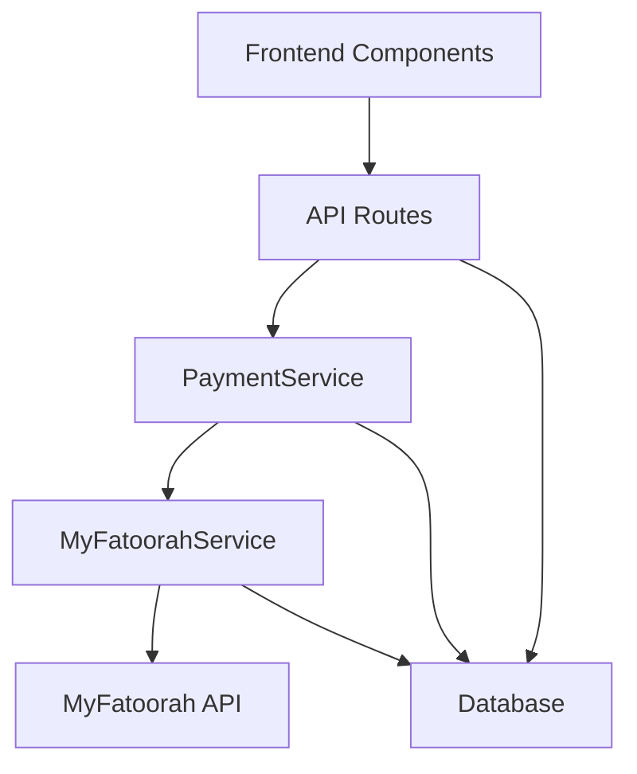
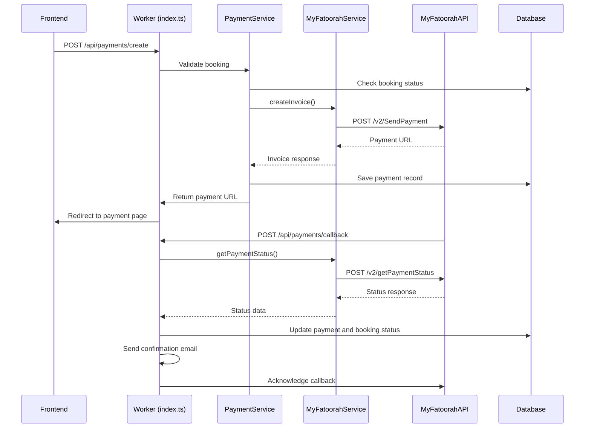
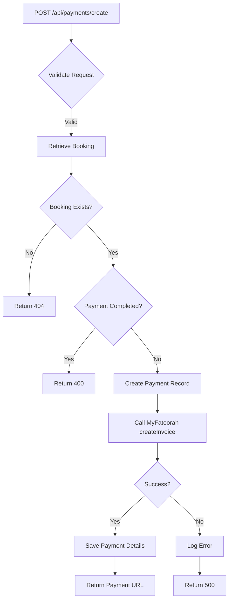

# MyFatoorah Payment Integration

<cite>
**Referenced Files in This Document**   
- [PaymentService.ts](file://src/server/services/PaymentService.ts#L71-L473)
- [payment.ts](file://src/shared/payment.ts#L37-L164)
- [index.ts](file://src/worker/index.ts#L1023-L1151)
- [types.ts](file://src/shared/types.ts#L42-L54)
</cite>

## Table of Contents
1. [Project Structure](#project-structure)
2. [Core Components](#core-components)
3. [Architecture Overview](#architecture-overview)
4. [Payment Lifecycle Implementation](#payment-lifecycle-implementation)
5. [Domain Models and Type Definitions](#domain-models-and-type-definitions)
6. [Security and Compliance](#security-and-compliance)
7. [Error Handling and Logging](#error-handling-and-logging)
8. [Troubleshooting Guide](#troubleshooting-guide)

## Project Structure

The HabibiStay project follows a modular architecture with clear separation of concerns. The payment integration is implemented across multiple directories:

- **src/react-app**: Contains frontend components including PaymentModal.tsx and related UI elements
- **src/shared**: Houses shared utilities, types, and the MyFatoorahService class
- **src/server/services**: Contains the PaymentService implementation with business logic
- **src/worker**: Implements API routes and handlers using Hono framework
- **src/shared/types.ts**: Defines Zod schemas and TypeScript interfaces used throughout the application

The payment functionality is primarily coordinated through the worker entry point (index.ts) which routes requests to the shared payment utilities and server-side services.



**Diagram sources**
- [index.ts](file://src/worker/index.ts)
- [PaymentService.ts](file://src/server/services/PaymentService.ts)
- [payment.ts](file://src/shared/payment.ts)

## Core Components

The MyFatoorah payment integration consists of several core components that work together to process payments securely:

1. **MyFatoorahService**: A utility class in src/shared/payment.ts that encapsulates the MyFatoorah API client functionality
2. **PaymentService**: A server-side service in src/server/services/PaymentService.ts that handles business logic and database operations
3. **API Routes**: Implemented in src/worker/index.ts, these routes expose endpoints for creating payments and handling callbacks
4. **Type Definitions**: Shared types and Zod schemas in src/shared/types.ts and src/shared/payment.ts that ensure data consistency

The implementation follows a layered architecture where API routes delegate to service classes, which in turn use utility classes to communicate with external payment gateways.

**Section sources**
- [PaymentService.ts](file://src/server/services/PaymentService.ts#L71-L473)
- [payment.ts](file://src/shared/payment.ts#L37-L164)
- [index.ts](file://src/worker/index.ts#L1023-L1151)

## Architecture Overview

The payment architecture follows a clean separation of concerns with well-defined interfaces between components. The system is designed to be secure, reliable, and maintainable.



**Diagram sources**
- [index.ts](file://src/worker/index.ts#L1023-L1151)
- [PaymentService.ts](file://src/server/services/PaymentService.ts#L285-L319)
- [payment.ts](file://src/shared/payment.ts#L115-L164)

## Payment Lifecycle Implementation

### Environment Configuration
The MyFatoorah integration is configured using environment variables for security and flexibility:

- **MYFATOORAH_API_KEY**: Authentication key for MyFatoorah API access
- **MYFATOORAH_BASE_URL**: Base URL for MyFatoorah API endpoints
- **MYFATOORAH_WEBHOOK_SECRET**: Secret for verifying webhook signatures

These variables are securely loaded in the PaymentService constructor and MyFatoorahService initialization, with fallback to default values for sandbox testing.

```typescript
// Configuration in PaymentService.ts
this.myFatoorahConfig = {
  apiKey: process.env.MYFATOORAH_API_KEY || '',
  baseUrl: process.env.MYFATOORAH_BASE_URL || 'https://api.myfatoorah.com',
  webhookSecret: process.env.MYFATOORAH_WEBHOOK_SECRET || ''
};
```

### Payment Creation
The payment creation process begins with a POST request to `/api/payments/create`:

1. The request is validated against the CreatePaymentSchema
2. Booking details are retrieved from the database
3. A payment record is created with status 'pending'
4. MyFatoorahService.createInvoice() is called with formatted payment data
5. The user is redirected to the payment URL returned by MyFatoorah



**Diagram sources**
- [index.ts](file://src/worker/index.ts#L1023-L1068)
- [payment.ts](file://src/shared/payment.ts#L115-L164)

### Webhook Processing
The system handles payment status updates through webhook callbacks at POST /api/payments/callback:

1. The callback request is validated using PaymentCallbackSchema
2. The payment status is retrieved from MyFatoorah using getPaymentStatus()
3. The local payment and booking records are updated based on the status
4. Confirmation emails are sent for successful payments
5. The callback is acknowledged to MyFatoorah

The implementation includes error handling and logging to ensure reliability.

**Section sources**
- [index.ts](file://src/worker/index.ts#L1112-L1151)
- [PaymentService.ts](file://src/server/services/PaymentService.ts#L220-L266)

## Domain Models and Type Definitions

### PaymentRequest and PaymentResponse
The system uses well-defined TypeScript interfaces to ensure type safety:

```typescript
// From PaymentService.ts
export interface PaymentRequest {
  bookingId: string;
  amount: number;
  currency: string;
  description: string;
  customerInfo: {
    name: string;
    email: string;
    phone: string;
    address?: {
      street?: string;
      city?: string;
      state?: string;
      country?: string;
      postal_code?: string;
    };
  };
  metadata?: Record<string, any>;
}

export interface PaymentResponse {
  success: boolean;
  paymentId: string;
  transactionId?: string;
  status: 'pending' | 'completed' | 'failed' | 'cancelled';
  amount: number;
  currency: string;
  paymentUrl?: string;
  redirectUrl?: string;
  error?: string;
  provider: string;
  metadata?: Record<string, any>;
}
```

### MyFatoorah API Contracts
The shared payment module defines interfaces that map directly to MyFatoorah's API responses:

```typescript
// From payment.ts
export interface MyFatoorahCreateInvoiceResponse {
  IsSuccess: boolean;
  Message: string;
  ValidationErrors: any[];
  Data: {
    InvoiceId: number;
    InvoiceURL: string;
    CustomerReference: string;
    UserDefinedField: string;
  };
}

export interface MyFatoorahPaymentStatusResponse {
  IsSuccess: boolean;
  Message: string;
  Data: {
    InvoiceId: number;
    InvoiceStatus: string;
    InvoiceReference: string;
    CustomerReference: string;
    CreatedDate: string;
    ExpiryDate: string;
    InvoiceValue: number;
    Comments: string;
    CustomerName: string;
    CustomerMobile: string;
    CustomerEmail: string;
    UserDefinedField: string;
    InvoiceDisplayValue: string;
    DueDeposit: number;
    DepositeStatus: string;
    InvoiceItems: any[];
    InvoiceTransactions: Array<{
      TransactionDate: string;
      PaymentGateway: string;
      ReferenceId: string;
      TrackId: string;
      TransactionId: string;
      PaymentId: string;
      AuthorizationId: string;
      TransactionStatus: string;
      TransactionValue: string;
      CustomerServiceCharge: number;
      DueValue: number;
      PaidCurrency: string;
      PaidCurrencyValue: string;
      IpAddress: string;
      Country: string;
      Currency: string;
      Error: string;
      CardNumber: string;
      ErrorCode: string;
    }>;
  };
}
```

These interfaces ensure that the application can properly parse and validate responses from the MyFatoorah API.

**Section sources**
- [PaymentService.ts](file://src/server/services/PaymentService.ts#L42-L54)
- [payment.ts](file://src/shared/payment.ts#L62-L113)

## Security and Compliance

### Secure Configuration
The system implements several security measures:

- Environment variables are used to store sensitive credentials
- The MYFATOORAH_API_KEY is never exposed to the client-side
- API requests are made server-side to prevent credential leakage
- Input validation is performed using Zod schemas

### PCI Compliance
The implementation follows PCI DSS guidelines by:

- Not storing sensitive card data
- Using MyFatoorah's hosted payment page for card entry
- Encrypting data in transit and at rest
- Implementing proper access controls

```typescript
// From security-config.ts
export const COMPLIANCE_CONFIG = {
  pciDss: {
    enabled: true,
    tokenizeCards: true,
    encryptTransmission: true,
    logCardAccess: true,
    requireStrongAuth: true
  }
};
```

### Webhook Security
Webhook endpoints are protected by:

- Signature verification using MYFATOORAH_WEBHOOK_SECRET
- Input validation using Zod schemas
- Rate limiting to prevent abuse
- Comprehensive logging for audit trails

**Section sources**
- [PaymentService.ts](file://src/server/services/PaymentService.ts#L71-L106)
- [security-config.ts](file://src/shared/security-config.ts#L303-L336)

## Error Handling and Logging

### Try-Catch Wrappers
The implementation uses comprehensive error handling with try-catch blocks:

```typescript
// Example from PaymentService.ts
private async createMyFatoorahPayment(paymentId: string, request: PaymentRequest): Promise<PaymentResponse> {
  try {
    // API call
  } catch (error) {
    return {
      success: false,
      paymentId,
      status: 'failed',
      amount: request.amount,
      currency: request.currency,
      provider: 'myfatoorah',
      error: error.message
    };
  }
}
```

### Audit Logging
All payment operations are logged for audit and troubleshooting:

- Payment creation attempts
- Payment status updates
- Webhook processing
- Error conditions

The logging includes timestamps, IP addresses, and relevant metadata to facilitate debugging and compliance auditing.

**Section sources**
- [PaymentService.ts](file://src/server/services/PaymentService.ts#L825-L855)
- [index.ts](file://src/worker/index.ts#L172-L178)

## Troubleshooting Guide

### Common Issues and Solutions

**Failed Transactions**
- **Cause**: Invalid payment details or insufficient funds
- **Solution**: Check the error message in the response and guide the user to try again with different payment method

**Duplicate Payments**
- **Cause**: Multiple submissions of the payment form
- **Solution**: The system checks booking payment status before creating new payments, preventing duplicates

**Unverified Webhooks**
- **Cause**: Missing or invalid signature
- **Solution**: Ensure MYFATOORAH_WEBHOOK_SECRET is correctly configured and verify the signature implementation

### Mitigation Strategies

**Idempotency Keys**
The system uses the booking ID as a natural idempotency key, preventing duplicate processing of the same payment request.

**Server-Side Validation**
All payment operations include server-side validation of:
- Booking existence and status
- Amount and currency
- Customer information

**Retry Logic**
For transient failures (network issues, timeouts), the system implements retry logic with exponential backoff in the MyFatoorahService.makeRequest method.

**Testing in Sandbox Mode**
Developers can test the payment flow using:
- MYFATOORAH_BASE_URL set to sandbox environment
- Test API keys provided by MyFatoorah
- Mock data in test cases

```typescript
// Example test setup
process.env.MYFATOORAH_API_KEY = 'test-myfatoorah-key';
process.env.MYFATOORAH_BASE_URL = 'https://apitest.myfatoorah.com';
```

**Section sources**
- [PaymentService.ts](file://src/server/services/PaymentService.ts#L285-L319)
- [index.ts](file://src/worker/index.ts#L1023-L1151)
- [api-endpoints.test.ts](file://src/test/api-endpoints.test.ts#L369-L418)