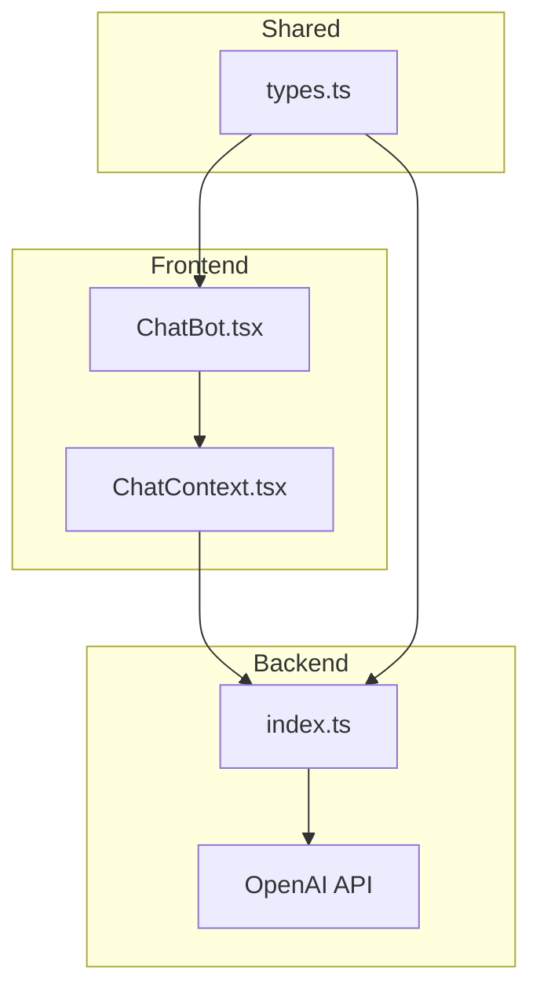
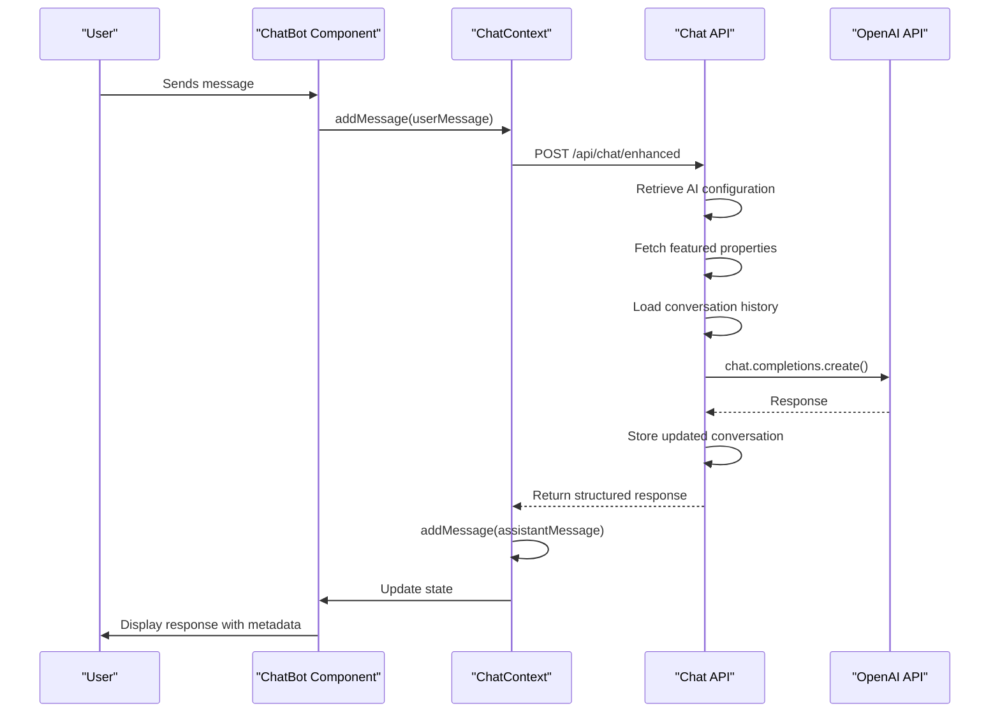
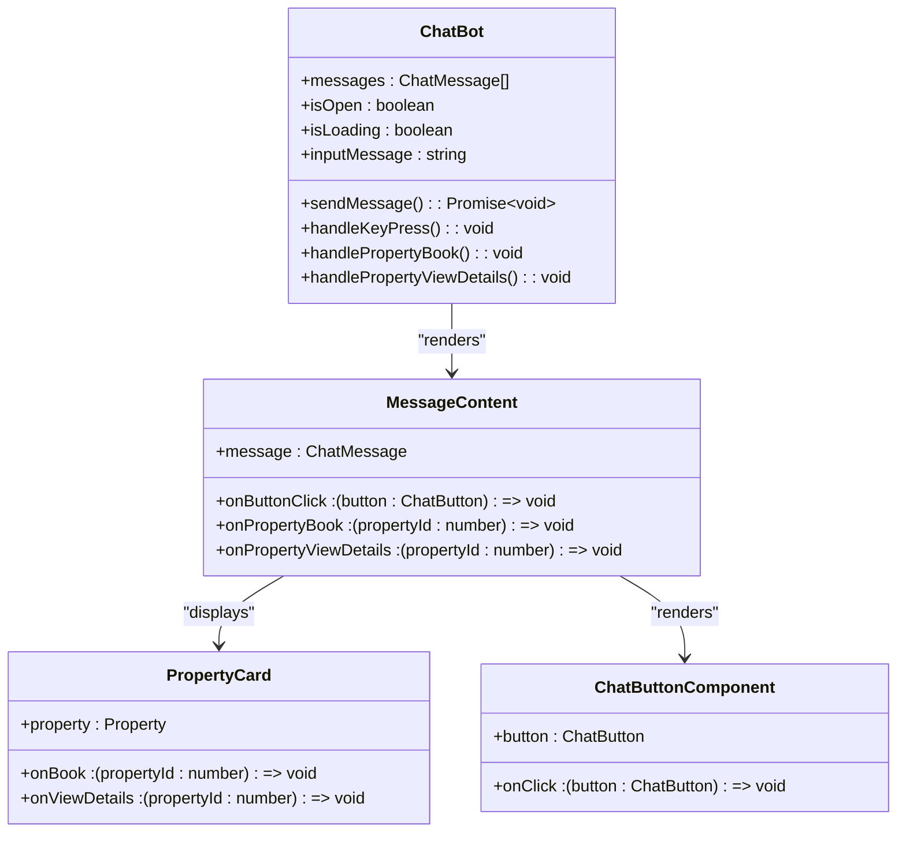
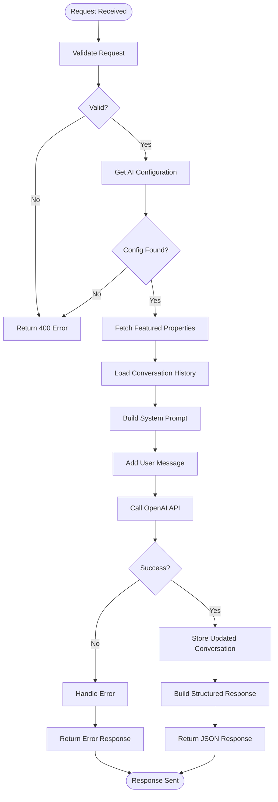
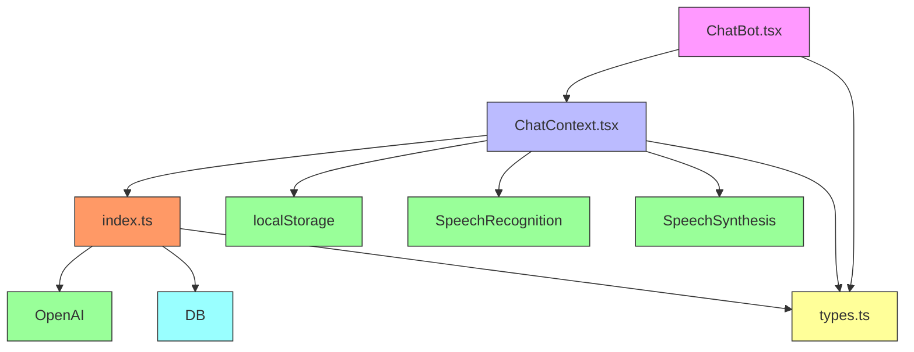

# OpenAI Chatbot Integration

<cite>
**Referenced Files in This Document**   
- [src/worker/index.ts](file://src/worker/index.ts#L600-L800)
- [src/react-app/components/ChatBot.tsx](file://src/react-app/components/ChatBot.tsx#L0-L452)
- [src/react-app/contexts/ChatContext.tsx](file://src/react-app/contexts/ChatContext.tsx#L0-L453)
- [src/shared/types.ts](file://src/shared/types.ts)
</cite>

## Table of Contents
1. [Introduction](#introduction)
2. [Project Structure](#project-structure)
3. [Core Components](#core-components)
4. [Architecture Overview](#architecture-overview)
5. [Detailed Component Analysis](#detailed-component-analysis)
6. [Dependency Analysis](#dependency-analysis)
7. [Performance Considerations](#performance-considerations)
8. [Troubleshooting Guide](#troubleshooting-guide)
9. [Conclusion](#conclusion)

## Introduction
This document provides a comprehensive analysis of the OpenAI GPT-4o-mini integration powering the AI chatbot 'Sara' in HabibiStay. The chatbot serves as an intelligent accommodation assistant, helping users discover properties, check availability, and initiate bookings through natural language conversations. The system combines frontend React components with a Hono-based backend worker that interfaces with OpenAI's API to generate contextual responses. This documentation details the architecture, data flow, and implementation specifics of the chatbot integration, focusing on how user messages are processed, how context is maintained, and how responses are streamed back to the user interface.

## Project Structure
The HabibiStay project follows a modular structure with clear separation between frontend, shared types, backend services, and worker logic. The chatbot functionality is distributed across multiple components:

- **Frontend**: React components in `src/react-app` handle the user interface and state management
- **Shared Types**: Domain models defined in `src/shared/types.ts` are used across frontend and backend
- **Backend Worker**: The Hono-based API in `src/worker/index.ts` processes chat requests and integrates with OpenAI
- **Security & Utilities**: Shared security middleware and validation utilities ensure robust operation

The chatbot specifically leverages the ChatBot component for UI, ChatContext for state, and the worker's `/api/chat/enhanced` endpoint for AI processing.



**Diagram sources**
- [src/react-app/components/ChatBot.tsx](file://src/react-app/components/ChatBot.tsx#L0-L452)
- [src/react-app/contexts/ChatContext.tsx](file://src/react-app/contexts/ChatContext.tsx#L0-L453)
- [src/worker/index.ts](file://src/worker/index.ts#L0-L2443)

**Section sources**
- [src/react-app/components/ChatBot.tsx](file://src/react-app/components/ChatBot.tsx#L0-L452)
- [src/react-app/contexts/ChatContext.tsx](file://src/react-app/contexts/ChatContext.tsx#L0-L453)
- [src/worker/index.ts](file://src/worker/index.ts#L0-L2443)

## Core Components
The chatbot system consists of three core components that work together to provide an intelligent conversational interface:

1. **ChatBot Component**: The React UI component that renders the chat interface, handles user input, and displays responses with rich content including property cards and action buttons.

2. **ChatContext**: The state management system that maintains conversation history, handles voice input/output, manages booking state, and orchestrates API calls to the backend.

3. **Chat API Endpoint**: The Hono-based backend endpoint that processes chat requests, retrieves contextual data, interfaces with OpenAI, and returns structured responses with metadata.

These components work in concert to create a seamless conversational experience where users can discover properties, check availability, and initiate bookings through natural language interactions.

**Section sources**
- [src/react-app/components/ChatBot.tsx](file://src/react-app/components/ChatBot.tsx#L0-L452)
- [src/react-app/contexts/ChatContext.tsx](file://src/react-app/contexts/ChatContext.tsx#L0-L453)
- [src/worker/index.ts](file://src/worker/index.ts#L600-L800)

## Architecture Overview
The chatbot architecture follows a client-server pattern with intelligent context management and AI integration. When a user interacts with the chatbot, the request flows through a well-defined pipeline that enriches the conversation with relevant context before sending it to OpenAI.



**Diagram sources**
- [src/react-app/components/ChatBot.tsx](file://src/react-app/components/ChatBot.tsx#L0-L452)
- [src/react-app/contexts/ChatContext.tsx](file://src/react-app/contexts/ChatContext.tsx#L0-L453)
- [src/worker/index.ts](file://src/worker/index.ts#L600-L800)

## Detailed Component Analysis

### ChatBot Component Analysis
The ChatBot component provides the user interface for interacting with Sara, the AI assistant. It renders a floating chat window that can be toggled open and closed, displaying a conversation history with both user and assistant messages.



**Diagram sources**
- [src/react-app/components/ChatBot.tsx](file://src/react-app/components/ChatBot.tsx#L0-L452)

**Section sources**
- [src/react-app/components/ChatBot.tsx](file://src/react-app/components/ChatBot.tsx#L0-L452)

### ChatContext Analysis
The ChatContext provides state management for the chatbot, maintaining conversation history, handling voice interactions, and managing the booking flow. It serves as the central orchestrator between the UI and backend API.

```mermaid
classDiagram
class ChatContext {
+messages : ChatMessage[]
+isOpen : boolean
+isLoading : boolean
+conversationId : string | null
+featuredProperties : Property[]
+currentBooking : Partial~CreateBookingData~ | null
+voiceEnabled : boolean
+isListening : boolean
+sendMessage() : Promise~void~
+addMessage() : void
+toggleChat() : void
+closeChat() : void
+showPropertyCard() : void
+initiateBooking() : void
+updateBookingData() : void
+handleButtonClick() : void
+toggleVoice() : void
+startListening() : void
+stopListening() : void
+clearConversation() : void
}
class SpeechRecognition {
+onresult : (event) => void
+onerror : (event) => void
+onend : () => void
+start() : void
+stop() : void
}
class SpeechSynthesis {
+speak() : void
}
ChatContext --> SpeechRecognition : "uses"
ChatContext --> SpeechSynthesis : "uses"
ChatContext --> "localStorage" : "persists state"
```

**Diagram sources**
- [src/react-app/contexts/ChatContext.tsx](file://src/react-app/contexts/ChatContext.tsx#L0-L453)

**Section sources**
- [src/react-app/contexts/ChatContext.tsx](file://src/react-app/contexts/ChatContext.tsx#L0-L453)

### Chat API Endpoint Analysis
The chat API endpoint in the worker handles incoming chat requests, enriches them with context, and interfaces with OpenAI to generate intelligent responses. It supports conversation persistence and dynamic AI configuration.



**Diagram sources**
- [src/worker/index.ts](file://src/worker/index.ts#L1600-L1800)

**Section sources**
- [src/worker/index.ts](file://src/worker/index.ts#L1600-L1800)

## Dependency Analysis
The chatbot system has a well-defined dependency structure that ensures separation of concerns while enabling rich functionality. The frontend components depend on shared types and the backend API, while the backend depends on external services like OpenAI.



**Diagram sources**
- [src/react-app/components/ChatBot.tsx](file://src/react-app/components/ChatBot.tsx#L0-L452)
- [src/react-app/contexts/ChatContext.tsx](file://src/react-app/contexts/ChatContext.tsx#L0-L453)
- [src/worker/index.ts](file://src/worker/index.ts#L0-L2443)

**Section sources**
- [src/react-app/components/ChatBot.tsx](file://src/react-app/components/ChatBot.tsx#L0-L452)
- [src/react-app/contexts/ChatContext.tsx](file://src/react-app/contexts/ChatContext.tsx#L0-L453)
- [src/worker/index.ts](file://src/worker/index.ts#L0-L2443)

## Performance Considerations
The chatbot implementation includes several performance optimizations to ensure responsive interactions:

- **Conversation Persistence**: Conversation state is stored in localStorage to maintain context across sessions
- **Rate Limiting**: The API implements rate limiting (1000 requests per 15 minutes) to prevent abuse
- **Caching**: Featured properties are fetched once and cached in the ChatContext
- **Efficient Rendering**: The React components use memoization and efficient rendering patterns
- **Connection Reuse**: The OpenAI client is initialized once per request context

The system is designed to handle typical conversation loads while maintaining sub-second response times for user interactions.

## Troubleshooting Guide
Common issues and their solutions for the chatbot integration:

**API Configuration Issues**
- **Symptom**: "OpenAI API key not configured" error
- **Solution**: Ensure OPENAI_API_KEY is set in environment variables or in the ai_config database table

**Conversation State Problems**
- **Symptom**: Conversation history not persisting
- **Solution**: Check localStorage permissions and ensure STORAGE_KEY is correctly set

**Voice Interface Failures**
- **Symptom**: Voice input not working
- **Solution**: Ensure the browser supports SpeechRecognition and the site is served over HTTPS

**Context Loss**
- **Symptom**: AI responses lack context about properties
- **Solution**: Verify the database query for featured properties is returning results

**Performance Degradation**
- **Symptom**: Slow response times
- **Solution**: Check OpenAI API status, verify rate limits, and monitor database performance

**Section sources**
- [src/worker/index.ts](file://src/worker/index.ts#L600-L800)
- [src/react-app/contexts/ChatContext.tsx](file://src/react-app/contexts/ChatContext.tsx#L0-L453)

## Conclusion
The OpenAI chatbot integration in HabibiStay provides a sophisticated conversational interface that enhances the user experience by making property discovery and booking more intuitive. By combining React frontend components with a Hono-based backend and OpenAI's language model, the system delivers intelligent, context-aware responses that can guide users through the entire booking journey. The architecture supports conversation persistence, voice interaction, and dynamic AI configuration, making it a robust solution for customer engagement. Future enhancements could include streaming responses for more immediate feedback, expanded context awareness, and integration with additional property data sources.