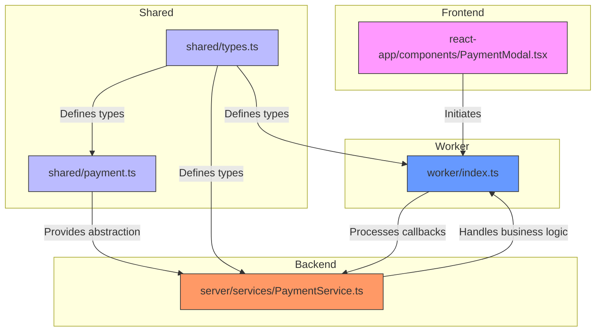
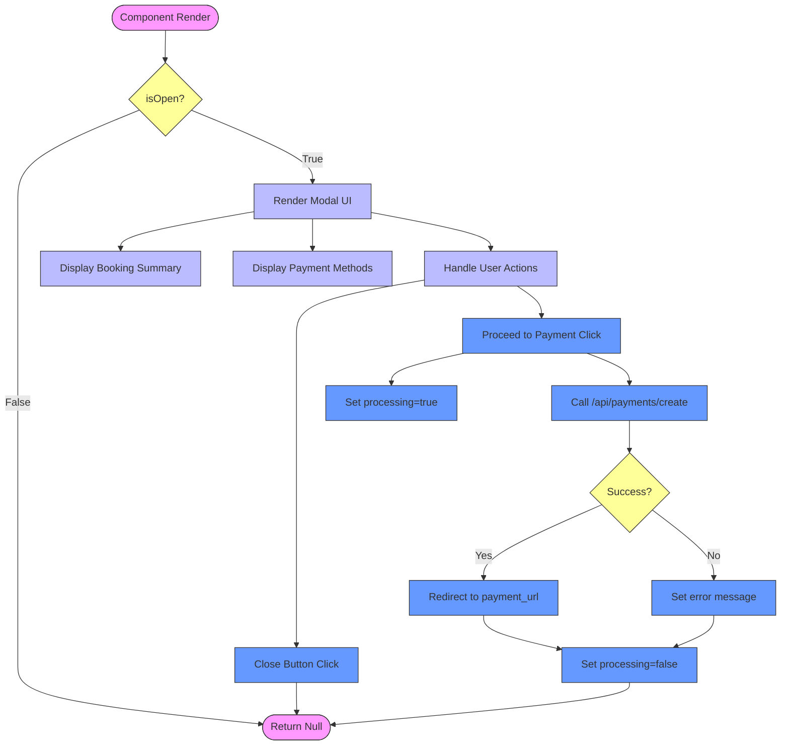
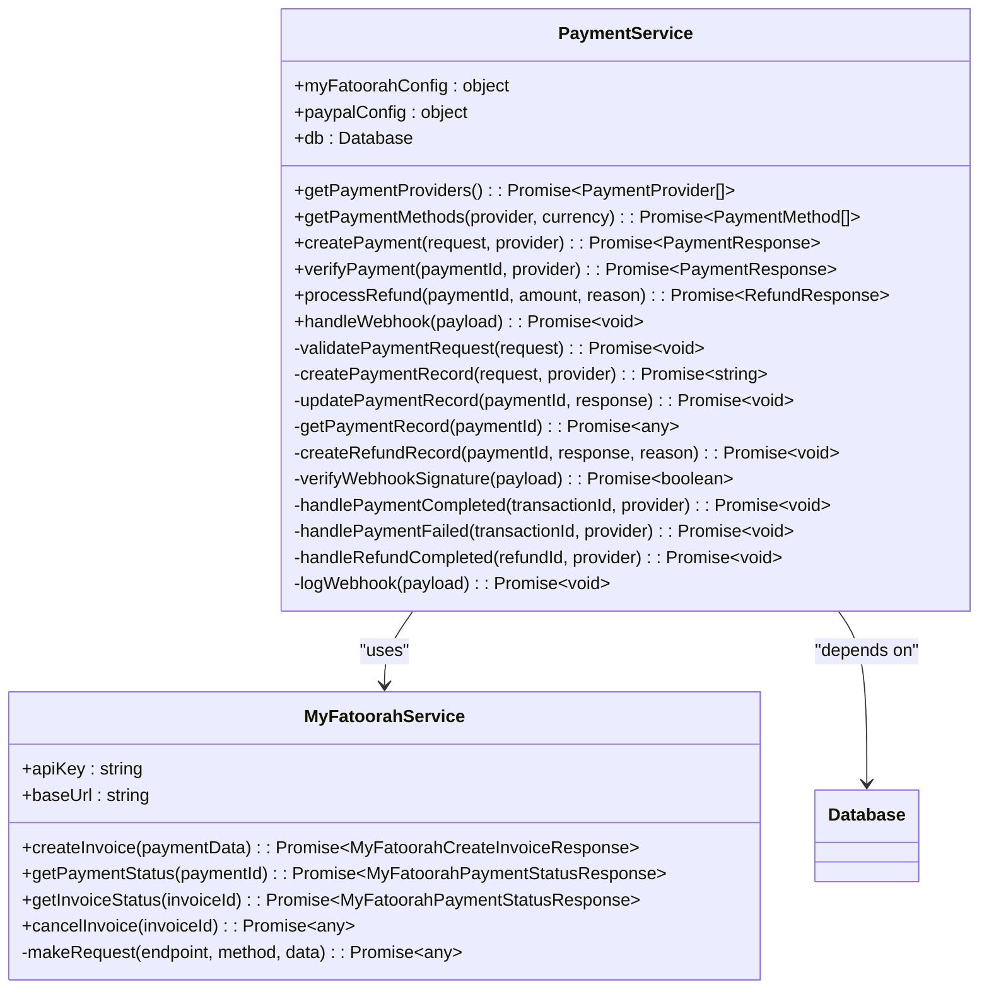
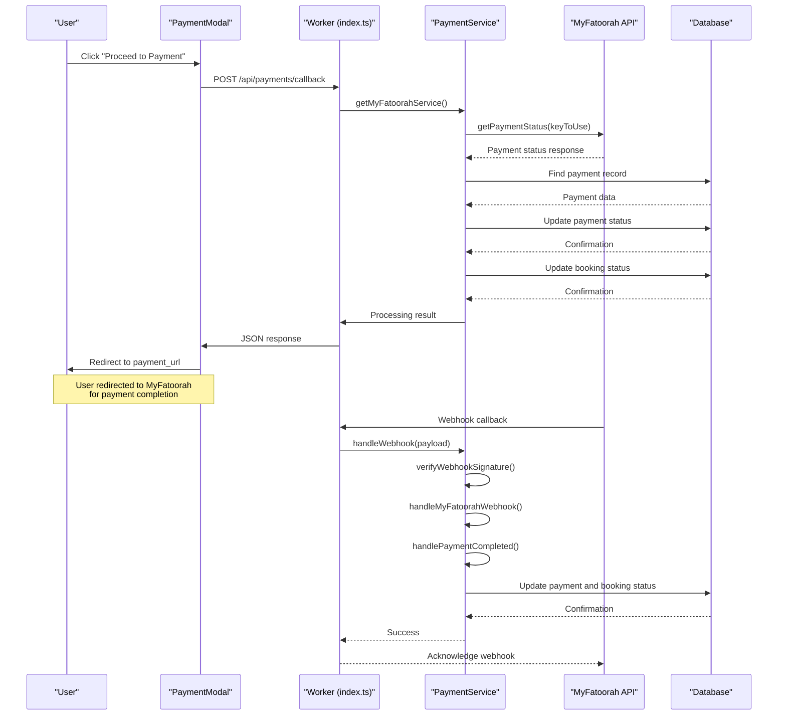
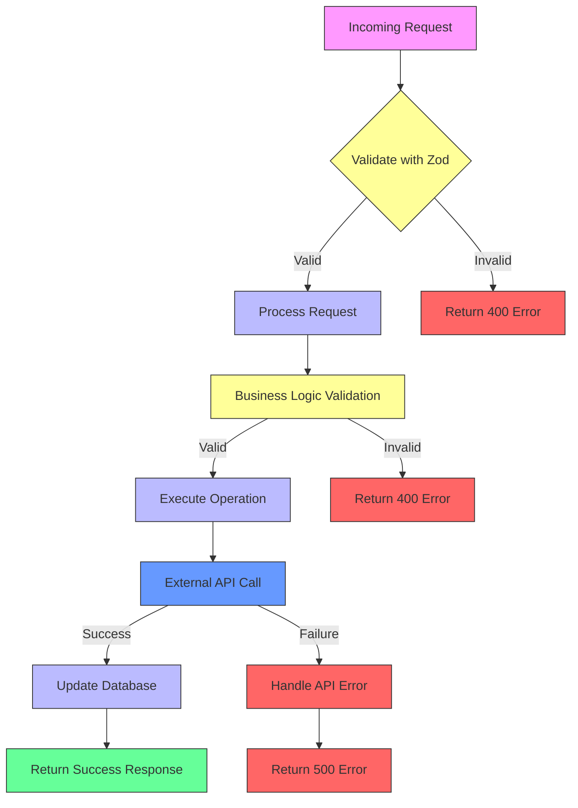

# Payment Processing Workflow

<cite>
**Referenced Files in This Document**   
- [payment.ts](file://src/shared/payment.ts)
- [PaymentService.ts](file://src/server/services/PaymentService.ts)
- [index.ts](file://src/worker/index.ts)
- [types.ts](file://src/shared/types.ts)
- [PaymentModal.tsx](file://src/react-app/components/PaymentModal.tsx)
</cite>

## Table of Contents
1. [Introduction](#introduction)
2. [Project Structure](#project-structure)
3. [Core Components](#core-components)
4. [Architecture Overview](#architecture-overview)
5. [Detailed Component Analysis](#detailed-component-analysis)
6. [Payment Flow Sequence](#payment-flow-sequence)
7. [Domain Models and Types](#domain-models-and-types)
8. [Error Handling and Validation](#error-handling-and-validation)
9. [Security and Compliance](#security-and-compliance)
10. [Configuration and Environment](#configuration-and-environment)
11. [Troubleshooting Guide](#troubleshooting-guide)
12. [Conclusion](#conclusion)

## Introduction
This document provides a comprehensive analysis of the payment processing workflow in the HabibiStay application, focusing on the integration with MyFatoorah for secure transaction handling. The system enables users to complete bookings through a secure payment gateway, with robust handling of payment creation, callback processing, and status updates. The workflow spans frontend components, backend services, and third-party payment provider integration, ensuring a seamless and secure payment experience. This documentation covers the end-to-end process from payment initiation in the frontend to backend processing and webhook callback handling, providing both high-level overviews and detailed technical insights.

## Project Structure
The payment processing functionality is distributed across multiple directories in the project structure, following a modular architecture that separates concerns between frontend, shared utilities, backend services, and worker processes. The core payment logic is organized to promote reusability and maintainability, with clear separation between UI components, business logic, and external service integrations.



**Diagram sources**
- [PaymentModal.tsx](file://src/react-app/components/PaymentModal.tsx)
- [payment.ts](file://src/shared/payment.ts)
- [types.ts](file://src/shared/types.ts)
- [PaymentService.ts](file://src/server/services/PaymentService.ts)
- [index.ts](file://src/worker/index.ts)

**Section sources**
- [PaymentModal.tsx](file://src/react-app/components/PaymentModal.tsx)
- [payment.ts](file://src/shared/payment.ts)
- [types.ts](file://src/shared/types.ts)
- [PaymentService.ts](file://src/server/services/PaymentService.ts)
- [index.ts](file://src/worker/index.ts)

## Core Components
The payment processing system consists of several core components that work together to handle transactions securely and efficiently. These components include the frontend payment modal, shared payment abstraction, backend payment service, and worker-based API endpoints. The architecture follows a service-oriented pattern where business logic is encapsulated in reusable services, and the shared module provides type definitions and utility functions that can be used across different parts of the application.

The system is designed with extensibility in mind, supporting multiple payment providers (MyFatoorah and PayPal) through a common interface. This allows for easy addition of new payment gateways in the future without significant changes to the core architecture. The use of Zod for schema validation ensures data integrity throughout the payment process, from user input to database storage.

**Section sources**
- [payment.ts](file://src/shared/payment.ts#L1-L165)
- [PaymentService.ts](file://src/server/services/PaymentService.ts#L1-L199)
- [index.ts](file://src/worker/index.ts#L1100-L1299)
- [types.ts](file://src/shared/types.ts#L200-L399)

## Architecture Overview
The payment processing architecture follows a layered approach with clear separation of concerns between presentation, business logic, and data access layers. The system is designed to handle both synchronous and asynchronous operations, with immediate payment initiation followed by asynchronous status updates via webhook callbacks.

```mermaid
graph TD
A[User Interface] --> B[Payment Modal]
B --> C[API Request to /api/payments/callback]
C --> D[Worker Process]
D --> E[Payment Service]
E --> F[MyFatoorah API]
F --> G[Payment Gateway]
G --> H[User Redirect]
H --> I[Payment Completion]
I --> J[Webhook Callback]
J --> C
E --> K[Database]
D --> K
style A fill:#f9f,stroke:#333
style B fill:#f9f,stroke:#333
style C fill:#69f,stroke:#333
style D fill:#69f,stroke:#333
style E fill:#f96,stroke:#333
style F fill:#f96,stroke:#333
style G fill:#f96,stroke:#333
style H fill:#f96,stroke:#333
style I fill:#f96,stroke:#333
style J fill:#69f,stroke:#333
style K fill:#333,stroke:#333
```



**Diagram sources**
- [PaymentModal.tsx](file://src/react-app/components/PaymentModal.tsx)
- [index.ts](file://src/worker/index.ts#L1100-L1299)
- [PaymentService.ts](file://src/server/services/PaymentService.ts)

## Detailed Component Analysis

### Payment Modal Component
The PaymentModal component is a React functional component that provides the user interface for initiating a payment. It displays booking details and handles the payment initiation process, including error handling and loading states.



**Diagram sources**
- [PaymentModal.tsx](file://src/react-app/components/PaymentModal.tsx#L1-L167)

**Section sources**
- [PaymentModal.tsx](file://src/react-app/components/PaymentModal.tsx#L1-L167)

### Payment Service Implementation
The PaymentService class provides the core business logic for handling payments, including integration with MyFatoorah and PayPal. It encapsulates the complexity of external API calls and provides a clean interface for payment operations.



**Diagram sources**
- [PaymentService.ts](file://src/server/services/PaymentService.ts#L1-L855)
- [payment.ts](file://src/shared/payment.ts#L1-L165)

**Section sources**
- [PaymentService.ts](file://src/server/services/PaymentService.ts#L1-L855)

## Payment Flow Sequence
The payment processing workflow follows a well-defined sequence of operations from initiation to completion. This section details the step-by-step flow of a typical payment transaction.



**Diagram sources**
- [PaymentModal.tsx](file://src/react-app/components/PaymentModal.tsx#L50-L100)
- [index.ts](file://src/worker/index.ts#L1100-L1299)
- [PaymentService.ts](file://src/server/services/PaymentService.ts#L226-L250)

**Section sources**
- [PaymentModal.tsx](file://src/react-app/components/PaymentModal.tsx#L50-L100)
- [index.ts](file://src/worker/index.ts#L1100-L1299)
- [PaymentService.ts](file://src/server/services/PaymentService.ts#L226-L250)

## Domain Models and Types
The payment system utilizes a comprehensive set of domain models and types to ensure type safety and data consistency across the application. These models are defined using Zod schemas for validation and TypeScript types for type checking.

### Payment Domain Models
The system defines several key models for representing payment-related data:

**Payment Schema**
```typescript
export const PaymentSchema = z.object({
  id: z.number(),
  booking_id: z.number(),
  payment_provider: z.string(),
  payment_id: z.string().nullable(),
  invoice_id: z.string().nullable(),
  amount: z.number(),
  currency: z.string(),
  status: z.string(),
  payment_method: z.string().nullable(),
  transaction_id: z.string().nullable(),
  payment_url: z.string().nullable(),
  metadata: z.string().nullable(),
  created_at: z.string(),
  updated_at: z.string(),
});
```

**Payment Status Types**
```typescript
export type PaymentStatus = 'pending' | 'processing' | 'completed' | 'failed' | 'refunded';
export type PaymentGateway = 'myfatoorah' | 'paypal' | 'stripe';
```

**Enhanced Payment Schema**
```typescript
export const EnhancedPaymentSchema = z.object({
  id: z.number(),
  booking_id: z.number(),
  payment_id: z.string(),
  gateway: z.enum(['myfatoorah', 'paypal', 'stripe']),
  amount: z.number(),
  currency: z.string(),
  status: z.enum(['pending', 'processing', 'completed', 'failed', 'refunded']),
  gateway_response: z.any().optional(),
  created_at: z.string(),
  updated_at: z.string(),
});
```

**Payment Request Schema**
```typescript
export const PaymentRequestSchema = z.object({
  InvoiceAmount: z.number().positive(),
  CurrencyIso: z.string().default('SAR'),
  CustomerName: z.string(),
  CustomerEmail: z.string().email(),
  CustomerPhone: z.string().optional(),
  CallBackUrl: z.string().url(),
  ErrorUrl: z.string().url(),
  Language: z.enum(['en', 'ar']).default('en'),
  DisplayCurrencyIso: z.string().default('SAR'),
  MobileCountryCode: z.string().optional(),
  CustomerReference: z.string().optional(),
  UserDefinedField: z.string().optional(),
});
```

These models ensure that payment data is consistently structured and validated throughout the system, from the frontend input to database storage and API responses.

**Section sources**
- [types.ts](file://src/shared/types.ts#L200-L399)
- [payment.ts](file://src/shared/payment.ts#L1-L50)

## Error Handling and Validation
The payment system implements comprehensive error handling and validation mechanisms to ensure reliability and data integrity. These mechanisms operate at multiple levels of the application stack.

### Frontend Validation
The PaymentModal component includes client-side validation to provide immediate feedback to users:

- Validates that required fields are present before submission
- Handles network errors during API calls
- Provides user-friendly error messages for different failure scenarios
- Implements loading states to prevent duplicate submissions

### Backend Validation
The system employs server-side validation through Zod schemas:



**Diagram sources**
- [payment.ts](file://src/shared/payment.ts#L1-L50)
- [index.ts](file://src/worker/index.ts#L1100-L1299)

The PaymentService class includes specific validation methods:

```typescript
private async validatePaymentRequest(request: PaymentRequest): Promise<void> {
  if (!request.bookingId) {
    throw new Error('Booking ID is required');
  }

  if (!request.amount || request.amount <= 0) {
    throw new Error('Valid payment amount is required');
  }

  if (!request.currency) {
    throw new Error('Currency is required');
  }

  if (!request.customerInfo.name || !request.customerInfo.email) {
    throw new Error('Customer name and email are required');
  }
}
```

### Error Recovery
The system implements several error recovery mechanisms:

- Retry logic for transient failures in external API calls
- Comprehensive logging of errors for debugging and monitoring
- Graceful degradation when payment providers are unavailable
- Database transactions to ensure data consistency during updates

**Section sources**
- [payment.ts](file://src/shared/payment.ts#L1-L165)
- [PaymentService.ts](file://src/server/services/PaymentService.ts#L750-L799)
- [index.ts](file://src/worker/index.ts#L1100-L1299)

## Security and Compliance
The payment processing system implements multiple security measures to protect sensitive data and ensure compliance with industry standards.

### Secure Credential Management
The system uses environment variables to store sensitive credentials:

```typescript
constructor(private db: Database) {
  this.myFatoorahConfig = {
    apiKey: process.env.MYFATOORAH_API_KEY || '',
    baseUrl: process.env.MYFATOORAH_BASE_URL || 'https://api.myfatoorah.com',
    webhookSecret: process.env.MYFATOORAH_WEBHOOK_SECRET || ''
  };

  this.paypalConfig = {
    clientId: process.env.PAYPAL_CLIENT_ID || '',
    clientSecret: process.env.PAYPAL_CLIENT_SECRET || '',
    mode: (process.env.PAYPAL_MODE as 'sandbox' | 'live') || 'sandbox',
    webhookId: process.env.PAYPAL_WEBHOOK_ID || ''
  };
}
```

### Data Protection
The system follows security best practices:

- **PCI Compliance**: Sensitive payment data is handled by MyFatoorah, reducing PCI scope
- **Encryption**: All data in transit is encrypted using HTTPS/TLS
- **Input Validation**: Comprehensive validation using Zod schemas prevents injection attacks
- **Rate Limiting**: API endpoints are protected against abuse
- **Authentication**: Access to sensitive operations requires proper authentication

### Webhook Security
The system implements webhook signature verification to prevent unauthorized callbacks:

```typescript
private async verifyWebhookSignature(payload: WebhookPayload): Promise<boolean> {
  // Implement signature verification for each provider
  if (payload.provider === 'myfatoorah') {
    // Implement MyFatoorah signature verification
    return true; // Placeholder
  } else if (payload.provider === 'paypal') {
    // Implement PayPal signature verification
    return true; // Placeholder
  }
  return false;
}
```

### Secure Payment Flow
The payment flow is designed with security as a priority:

- Users are redirected to MyFatoorah's secure payment page for card entry
- No sensitive payment data is stored in the application database
- All payment-related operations are logged for audit purposes
- Regular security reviews are conducted on the payment codebase

**Section sources**
- [PaymentService.ts](file://src/server/services/PaymentService.ts#L80-L104)
- [payment.ts](file://src/shared/payment.ts#L1-L165)
- [index.ts](file://src/worker/index.ts#L1100-L1299)

## Configuration and Environment
The payment system is highly configurable through environment variables, allowing for different settings in development, testing, and production environments.

### Environment Variables
The system uses the following environment variables for configuration:

**Payment Provider Configuration**
- `MYFATOORAH_API_KEY`: API key for MyFatoorah integration
- `MYFATOORAH_BASE_URL`: Base URL for MyFatoorah API (test vs live)
- `MYFATOORAH_WEBHOOK_SECRET`: Secret for verifying webhook signatures
- `PAYPAL_CLIENT_ID`: Client ID for PayPal integration
- `PAYPAL_CLIENT_SECRET`: Client secret for PayPal integration
- `PAYPAL_MODE`: Operation mode (sandbox or live)
- `PAYPAL_WEBHOOK_ID`: Webhook ID for PayPal events

**Application Configuration**
- `APP_URL`: Base URL of the application for callback URLs
- `DATABASE_URL`: Connection string for the database

### Configuration Management
The configuration is managed through a structured approach:

```typescript
constructor(private db: Database) {
  this.myFatoorahConfig = {
    apiKey: process.env.MYFATOORAH_API_KEY || '',
    baseUrl: process.env.MYFATOORAH_BASE_URL || 'https://api.myfatoorah.com',
    webhookSecret: process.env.MYFATOORAH_WEBHOOK_SECRET || ''
  };

  this.paypalConfig = {
    clientId: process.env.PAYPAL_CLIENT_ID || '',
    clientSecret: process.env.PAYPAL_CLIENT_SECRET || '',
    mode: (process.env.PAYPAL_MODE as 'sandbox' | 'live') || 'sandbox',
    webhookId: process.env.PAYPAL_WEBHOOK_ID || ''
  };
}
```

This approach ensures that:
- Sensitive credentials are not hardcoded in the source code
- Configuration can be easily changed between environments
- Default values provide fallback options when variables are not set
- Type safety is maintained through TypeScript

**Section sources**
- [PaymentService.ts](file://src/server/services/PaymentService.ts#L80-L104)

## Troubleshooting Guide
This section addresses common issues that may occur during payment processing and their solutions.

### Common Issues and Solutions

**Issue: Unverified Webhook Payloads**
- **Symptoms**: Webhook callbacks are rejected with "Invalid webhook signature" errors
- **Cause**: Signature verification fails due to incorrect secret or tampered payload
- **Solution**: 
  - Verify that `MYFATOORAH_WEBHOOK_SECRET` matches the secret configured in MyFatoorah dashboard
  - Ensure the webhook URL is correctly configured in MyFatoorah
  - Check server logs for signature verification details

**Issue: Expired Payment Links**
- **Symptoms**: Users receive "Payment link expired" errors when attempting to pay
- **Cause**: MyFatoorah payment links have a limited validity period
- **Solution**:
  - Implement a retry mechanism to generate new payment links
  - Notify users to complete payment promptly
  - Consider implementing payment link reminders

**Issue: Inconsistent Payment Statuses**
- **Symptoms**: Payment status in the application doesn't match the status in MyFatoorah
- **Cause**: Webhook delivery failure or processing error
- **Solution**:
  - Implement a reconciliation process that periodically verifies payment statuses
  - Add manual status verification capability for administrators
  - Ensure webhook endpoints are highly available

**Issue: Failed Payment Creation**
- **Symptoms**: API returns "Failed to create payment" errors
- **Cause**: Invalid request data or MyFatoorah API issues
- **Solution**:
  - Validate all required fields in the payment request
  - Check MyFatoorah API status
  - Verify API credentials are correct

### Diagnostic Tools
The system provides several tools for troubleshooting:

- **Webhook Logs**: All webhook events are logged in the `webhook_logs` table
- **Payment Records**: Complete payment history is stored in the `payments` table
- **Error Logging**: Comprehensive error logging in server logs
- **Database Queries**: Direct database queries for status verification

### Monitoring Recommendations
To ensure reliable payment processing:

- Set up monitoring for webhook endpoint availability
- Implement alerts for failed payment attempts
- Monitor payment success rates and investigate drops
- Regularly review webhook logs for unusual patterns

**Section sources**
- [PaymentService.ts](file://src/server/services/PaymentService.ts#L229-L232)
- [index.ts](file://src/worker/index.ts#L1100-L1299)
- [PaymentService.ts](file://src/server/services/PaymentService.ts#L845-L855)

## Conclusion
The payment processing workflow in HabibiStay provides a robust and secure system for handling transactions through MyFatoorah. The architecture follows best practices with clear separation of concerns, comprehensive error handling, and strong security measures. The system is designed to be reliable, maintainable, and extensible, supporting both current requirements and future enhancements.

Key strengths of the implementation include:
- Modular design with reusable components
- Comprehensive validation at multiple levels
- Secure handling of sensitive data
- Robust error handling and recovery mechanisms
- Detailed logging for troubleshooting and monitoring

The system effectively balances user experience with security requirements, redirecting users to MyFatoorah's secure payment page while maintaining control over the overall booking process. With proper monitoring and maintenance, this payment workflow provides a reliable foundation for the HabibiStay platform's transaction processing needs.