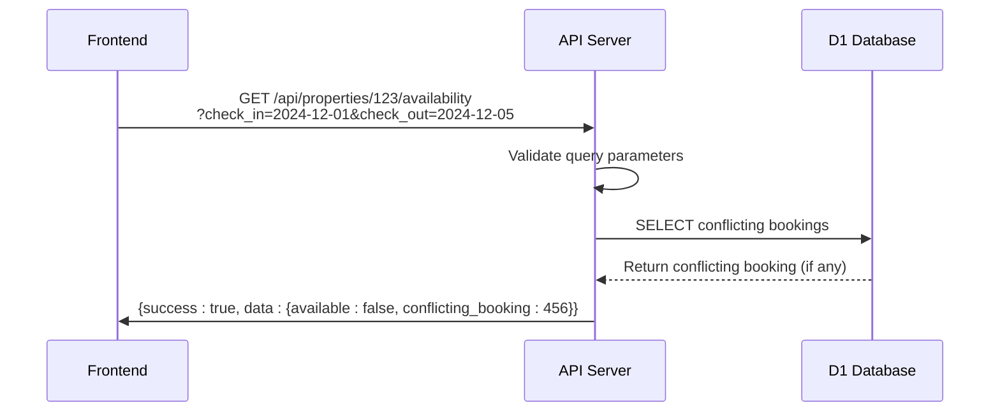
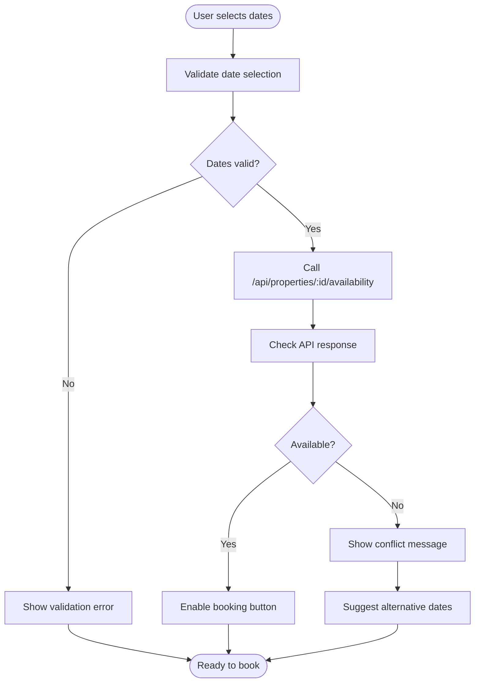
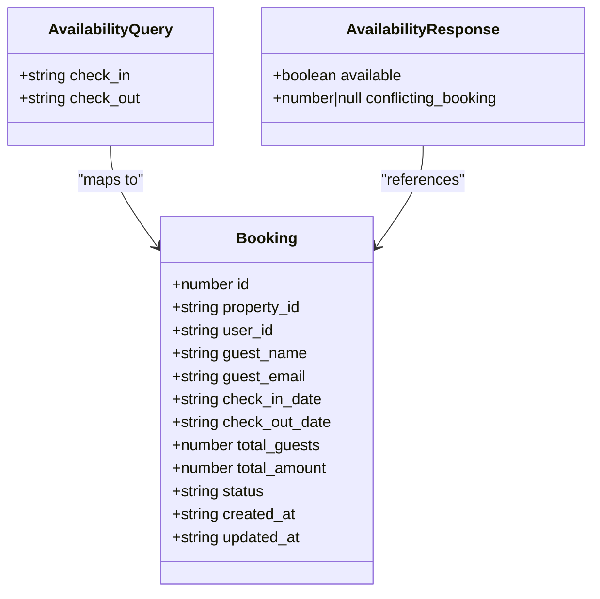
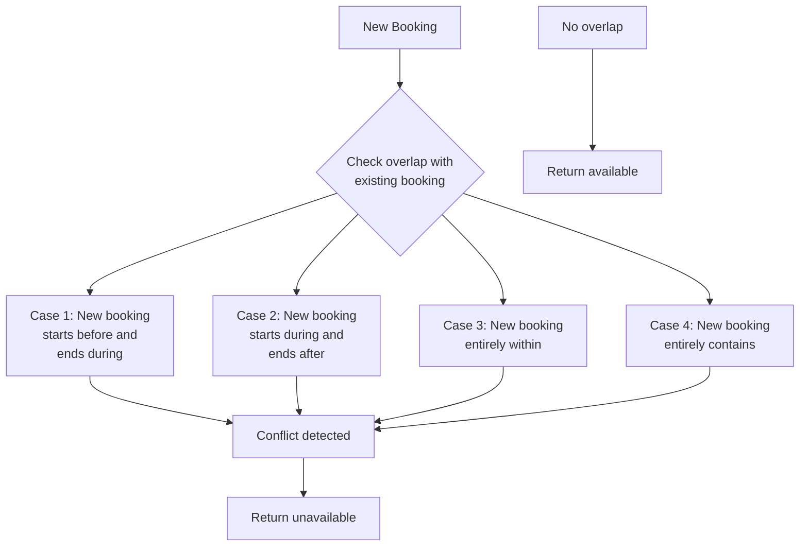

# Property Availability Checks

<cite>
**Referenced Files in This Document**   
- [src/worker/index.ts](file://src/worker/index.ts#L1498-L1520)
- [src/server/services/BookingService.ts](file://src/server/services/BookingService.ts#L414-L456)
- [src/react-app/pages/PropertyDetail.tsx](file://src/react-app/pages/PropertyDetail.tsx#L121-L121)
- [src/react-app/components/BookingModal.tsx](file://src/react-app/components/BookingModal.tsx#L121-L121)
- [src/shared/types.ts](file://src/shared/types.ts#L100-L110)
- [src/test/api-endpoints.test.ts](file://src/test/api-endpoints.test.ts#L276-L285)
</cite>

## Table of Contents
1. [Introduction](#introduction)
2. [Availability Endpoint Implementation](#availability-endpoint-implementation)
3. [Database Query Logic](#database-query-logic)
4. [Frontend Integration](#frontend-integration)
5. [Domain Models](#domain-models)
6. [Date Overlap Detection](#date-overlap-detection)
7. [Testing and Validation](#testing-and-validation)
8. [Performance Considerations](#performance-considerations)

## Introduction
The property availability checking mechanism in HabibiStay ensures accurate real-time booking capacity by validating date ranges against existing bookings. This system prevents double bookings and maintains data integrity across the platform. The availability check is implemented through a dedicated API endpoint that queries the D1 database to determine if a property can accommodate a requested stay period. The mechanism is integrated into both the booking flow and property detail views, providing immediate feedback to users during the reservation process.

## Availability Endpoint Implementation

The `/api/properties/:id/availability` endpoint provides a simple interface for checking property availability. This endpoint accepts check-in and check-out dates as query parameters and returns a JSON response indicating availability status.



**Diagram sources**
- [src/worker/index.ts](file://src/worker/index.ts#L1498-L1520)

**Section sources**
- [src/worker/index.ts](file://src/worker/index.ts#L1498-L1520)

## Database Query Logic

The availability check uses a SQL query to detect overlapping bookings by examining three possible overlap scenarios:
1. New booking starts before and ends during an existing booking
2. New booking starts during and ends after an existing booking
3. New booking falls entirely within an existing booking

```sql
SELECT id FROM bookings 
WHERE property_id = ? 
AND status NOT IN ('cancelled', 'rejected')
AND (
  (check_in_date <= ? AND check_out_date > ?) OR
  (check_in_date < ? AND check_out_date >= ?) OR
  (check_in_date >= ? AND check_out_date <= ?)
)
```

The query parameters are bound in the following order:
- propertyId
- checkIn (used twice)
- checkOut (used twice)
- checkIn (again)
- checkOut (again)

This comprehensive overlap detection ensures that no conflicting bookings are missed, maintaining data integrity across the system.

**Section sources**
- [src/worker/index.ts](file://src/worker/index.ts#L1505-L1515)

## Frontend Integration

The availability check is integrated into the frontend through date picker interactions in both the PropertyDetail and BookingModal components. When users select check-in and check-out dates, the application automatically triggers the availability API call.



**Diagram sources**
- [src/react-app/pages/PropertyDetail.tsx](file://src/react-app/pages/PropertyDetail.tsx#L121-L121)
- [src/react-app/components/BookingModal.tsx](file://src/react-app/components/BookingModal.tsx#L121-L121)

**Section sources**
- [src/react-app/pages/PropertyDetail.tsx](file://src/react-app/pages/PropertyDetail.tsx#L121-L121)
- [src/react-app/components/BookingModal.tsx](file://src/react-app/components/BookingModal.tsx#L121-L121)

## Domain Models

The availability system uses specific data structures to represent queries and responses. These models ensure consistent data exchange between frontend and backend components.



**Diagram sources**
- [src/shared/types.ts](file://src/shared/types.ts#L100-L110)

**Section sources**
- [src/shared/types.ts](file://src/shared/types.ts#L100-L110)

## Date Overlap Detection

The system employs a robust algorithm to detect partial date overlaps between bookings. The logic accounts for all possible overlap scenarios to prevent double bookings.



The implementation uses inclusive start dates and exclusive end dates, following the standard booking industry practice where check-out day is not included in the stay period.

**Section sources**
- [src/worker/index.ts](file://src/worker/index.ts#L1505-L1515)

## Testing and Validation

The availability system includes comprehensive tests to ensure reliability under various scenarios. Test cases cover valid date ranges, edge cases, and error conditions.

```typescript
// Example test case
it('should return unavailable when conflicting booking exists', async () => {
  const req = new Request('http://localhost/api/properties/1/availability?check_in=2024-12-01&check_out=2024-12-05');
  const res = await app.request(req, mockEnv);
  
  expect(res.status).toBe(200);
  const data = await res.json();
  expect(data.success).toBe(true);
  expect(data.data.available).toBe(false);
  expect(data.data.conflicting_booking).toBe(456);
});
```

The tests validate that:
- Required parameters are enforced
- Date overlap logic works correctly
- Appropriate HTTP status codes are returned
- Response structure is consistent

**Section sources**
- [src/test/api-endpoints.test.ts](file://src/test/api-endpoints.test.ts#L276-L285)

## Performance Considerations

The availability checking system incorporates several performance optimizations:

1. **Database Indexing**: The bookings table should have indexes on `property_id`, `check_in_date`, and `check_out_date` columns to accelerate query performance.

2. **Query Optimization**: The SQL query is designed to leverage index usage efficiently, with the property_id filter applied first to narrow the result set.

3. **Caching Strategy**: While not implemented in the current code, a caching layer could store recent availability results to reduce database load for frequently accessed properties.

4. **Rate Limiting**: The API is protected by rate limiting middleware to prevent abuse and ensure system stability under heavy load.

These optimizations ensure that availability checks remain responsive even during peak traffic periods, providing a smooth user experience.