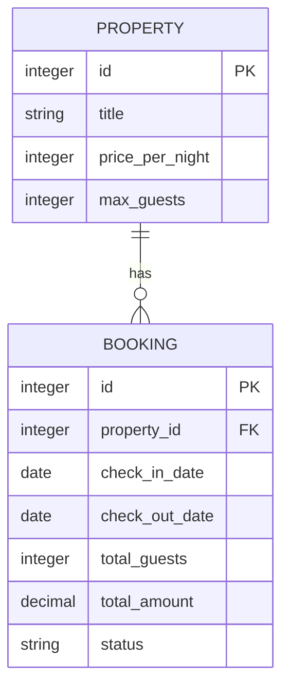
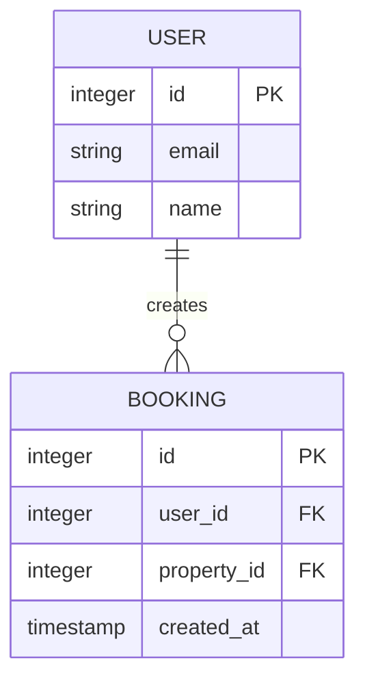
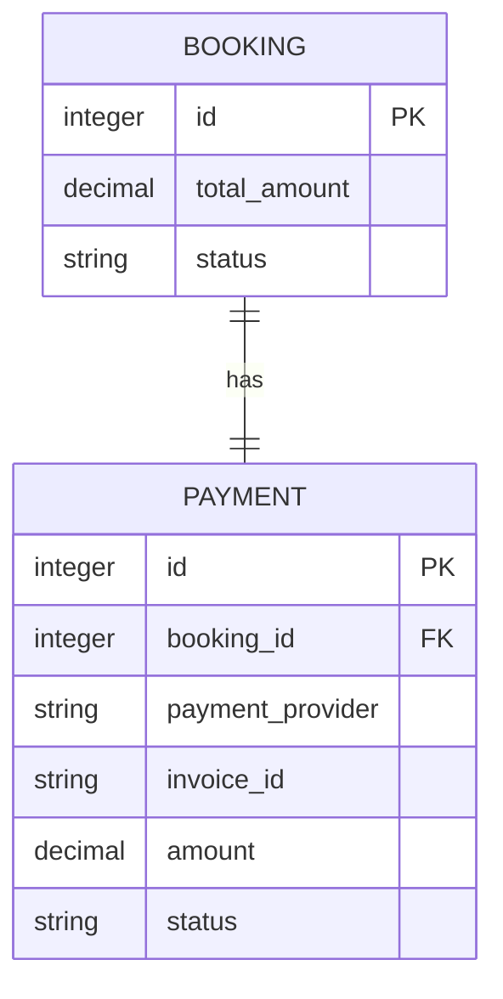

# Booking Model

<cite>
**Referenced Files in This Document**   
- [src/worker/index.ts](file://src/worker/index.ts#L400-L600)
- [migrations/5.sql](file://migrations/5.sql)
- [src/shared/types.ts](file://src/shared/types.ts)
</cite>

## Table of Contents
1. [Booking Data Model Overview](#booking-data-model-overview)
2. [Field Definitions](#field-definitions)
3. [Constraints and Business Logic](#constraints-and-business-logic)
4. [Relationships](#relationships)
5. [Schema Definition](#schema-definition)
6. [TypeScript Interface](#typescript-interface)
7. [Sample Booking Record](#sample-booking-record)
8. [Data Access Patterns](#data-access-patterns)
9. [Performance Optimizations](#performance-optimizations)
10. [Security Considerations](#security-considerations)

## Booking Data Model Overview

The Booking model in HabibiStay represents a reservation made by a user (or guest) for a property. It captures essential details about the stay, financial information, and booking status. The model is central to the platform's core functionality, enabling property availability management, payment processing, and user experience tracking.

The Booking entity serves as a bridge between Users, Properties, and Payments, maintaining referential integrity through foreign key relationships. It supports both authenticated users and guest bookings, with appropriate security and access controls.

**Section sources**
- [src/worker/index.ts](file://src/worker/index.ts#L400-L600)
- [migrations/5.sql](file://migrations/5.sql)

## Field Definitions

The Booking model contains the following fields:

- **id**: Unique identifier for the booking (Primary Key)
- **user_id**: Reference to the User who made the booking (Foreign Key to User table)
- **property_id**: Reference to the Property being booked (Foreign Key to Property table)
- **guest_name**: Name of the guest (for guest bookings)
- **guest_email**: Email address of the guest
- **guest_phone**: Phone number of the guest
- **check_in_date**: Date when the guest will check in
- **check_out_date**: Date when the guest will check out
- **total_guests**: Number of guests staying at the property
- **special_requests**: Any special requests from the guest
- **total_amount**: Total amount charged for the booking (including taxes and fees)
- **status**: Current status of the booking (pending, confirmed, cancelled, completed)
- **payment_status**: Status of payment processing (pending, completed, failed)
- **created_at**: Timestamp when the booking was created
- **updated_at**: Timestamp when the booking was last updated

**Section sources**
- [migrations/5.sql](file://migrations/5.sql)
- [src/worker/index.ts](file://src/worker/index.ts#L400-L600)

## Constraints and Business Logic

The Booking model enforces several constraints and business rules to ensure data integrity and proper operation:

### Date Validation
The system validates that check-out date occurs after check-in date. This is enforced in the API layer with the following logic:
```typescript
const checkIn = new Date(data.check_in_date);
const checkOut = new Date(data.check_out_date);
const nights = Math.ceil((checkOut.getTime() - checkIn.getTime()) / (1000 * 60 * 60 * 24));

if (nights <= 0) {
  return c.json<ApiResponse>({
    success: false,
    error: "Invalid date range",
  }, 400);
}
```

### Availability Check
Before creating a booking, the system checks for overlapping reservations to prevent double-booking:
```typescript
const conflictingBooking = await c.env.DB.prepare(`
  SELECT id FROM bookings 
  WHERE property_id = ? 
  AND status NOT IN ('cancelled', 'rejected')
  AND (
    (check_in_date <= ? AND check_out_date > ?) OR
    (check_in_date < ? AND check_out_date >= ?) OR
    (check_in_date >= ? AND check_out_date <= ?)
  )
`).bind(
  data.property_id,
  data.check_in_date, data.check_in_date,
  data.check_out_date, data.check_out_date,
  data.check_in_date, data.check_out_date
).first();
```

### Status Transitions
The booking status follows a specific lifecycle:
- **pending**: Initial state when booking is created
- **confirmed**: After successful payment
- **cancelled**: When user or host cancels the booking
- **completed**: After the stay has ended

Status transitions are managed through API endpoints that validate the current state before allowing changes.

### Guest Capacity
While not explicitly shown in the code, the system should validate that total_guests does not exceed the property's max_guests capacity, which is stored in the properties table.

**Section sources**
- [src/worker/index.ts](file://src/worker/index.ts#L400-L600)

## Relationships

The Booking model maintains several important relationships with other entities in the system.

### One-to-Many Relationships

#### With Property
Each Property can have multiple Bookings, but each Booking belongs to only one Property. This relationship is established through the property_id foreign key.



**Diagram sources**
- [migrations/5.sql](file://migrations/5.sql)
- [migrations/4.sql](file://migrations/4.sql)

#### With User
Each User can have multiple Bookings (as guest or host), but each Booking is associated with one User. This relationship is established through the user_id foreign key.



**Diagram sources**
- [migrations/5.sql](file://migrations/5.sql)
- [migrations/1.sql](file://migrations/1.sql)

### One-to-One Relationship with Payment

Each Booking has exactly one Payment record, and each Payment is associated with one Booking. This ensures that each reservation has a clear financial record.



**Diagram sources**
- [src/worker/index.ts](file://src/worker/index.ts#L1000-L1200)
- [migrations/6.sql](file://migrations/6.sql)

## Schema Definition

The Booking table is defined in the database migration file with the following SQL schema:

```sql
CREATE TABLE bookings (
  id INTEGER PRIMARY KEY AUTOINCREMENT,
  user_id TEXT NOT NULL,
  property_id INTEGER NOT NULL,
  guest_name TEXT NOT NULL,
  guest_email TEXT NOT NULL,
  guest_phone TEXT,
  check_in_date TEXT NOT NULL,
  check_out_date TEXT NOT NULL,
  total_guests INTEGER NOT NULL,
  special_requests TEXT,
  total_amount DECIMAL(10,2) NOT NULL,
  status TEXT DEFAULT 'pending',
  payment_status TEXT DEFAULT 'pending',
  created_at TEXT DEFAULT (datetime('now')),
  updated_at TEXT DEFAULT (datetime('now')),
  
  FOREIGN KEY (property_id) REFERENCES properties(id),
  INDEX idx_bookings_property_dates (property_id, check_in_date, check_out_date),
  INDEX idx_bookings_user (user_id),
  INDEX idx_bookings_status (status),
  INDEX idx_bookings_dates (check_in_date, check_out_date)
);
```

The schema includes:
- Primary key on id
- Foreign key constraint on property_id referencing the properties table
- Appropriate indexes for query performance
- Default values for status and timestamps
- NOT NULL constraints on required fields

**Section sources**
- [migrations/5.sql](file://migrations/5.sql)

## TypeScript Interface

Based on the codebase, the Booking model is represented in TypeScript with the following interface:

```typescript
interface Booking {
  id: number;
  user_id: string;
  property_id: number;
  guest_name: string;
  guest_email: string;
  guest_phone: string | null;
  check_in_date: string;
  check_out_date: string;
  total_guests: number;
  special_requests: string | null;
  total_amount: number;
  status: 'pending' | 'confirmed' | 'cancelled' | 'completed' | 'rejected';
  payment_status: 'pending' | 'completed' | 'failed';
  created_at: string;
  updated_at: string;
}
```

Additionally, the CreateBookingSchema validation schema ensures that incoming booking requests contain valid data:

```typescript
const CreateBookingSchema = z.object({
  property_id: z.number().int().positive(),
  guest_name: z.string().min(1).max(100),
  guest_email: z.string().email(),
  guest_phone: z.string().optional(),
  check_in_date: z.string().datetime(),
  check_out_date: z.string().datetime(),
  total_guests: z.number().int().min(1).max(16),
  special_requests: z.string().max(1000).optional(),
});
```

**Section sources**
- [src/worker/index.ts](file://src/worker/index.ts#L400-L600)
- [src/shared/types.ts](file://src/shared/types.ts)

## Sample Booking Record

Here is an example of a complete booking record as it would appear in the database:

```json
{
  "id": 12345,
  "user_id": "auth0|66a1b2c3d4e5f6g7h8i9j0k1",
  "property_id": 789,
  "guest_name": "Ahmed Al-Farsi",
  "guest_email": "ahmed.farsi@email.com",
  "guest_phone": "+966501234567",
  "check_in_date": "2024-06-15T00:00:00Z",
  "check_out_date": "2024-06-20T00:00:00Z",
  "total_guests": 2,
  "special_requests": "High floor room with city view, if possible",
  "total_amount": 2875.00,
  "status": "confirmed",
  "payment_status": "completed",
  "created_at": "2024-05-10T14:30:22Z",
  "updated_at": "2024-05-10T14:35:45Z"
}
```

This booking represents a 5-night stay (June 15-20, 2024) for two guests at a property with ID 789. The total amount of 2,875 SAR includes the base rate, 5% service fee, and 15% VAT. The booking is confirmed with completed payment.

**Section sources**
- [src/worker/index.ts](file://src/worker/index.ts#L400-L600)

## Data Access Patterns

The worker implementation reveals several key data access patterns for the Booking model.

### Availability Checks

The system provides an API endpoint to check property availability for specific dates:

```typescript
app.get("/api/properties/:id/availability", async (c) => {
  const propertyId = c.req.param("id");
  const checkIn = c.req.query("check_in");
  const checkOut = c.req.query("check_out");

  const conflictingBooking = await c.env.DB.prepare(`
    SELECT id FROM bookings 
    WHERE property_id = ? 
    AND status NOT IN ('cancelled', 'rejected')
    AND (
      (check_in_date <= ? AND check_out_date > ?) OR
      (check_in_date < ? AND check_out_date >= ?) OR
      (check_in_date >= ? AND check_out_date <= ?)
    )
  `).bind(propertyId, checkIn, checkIn, checkOut, checkOut, checkIn, checkOut).first();

  return c.json<ApiResponse>({
    success: true,
    data: {
      available: !conflictingBooking,
      conflicting_booking: conflictingBooking?.id || null,
    },
  });
});
```

### Booking History Retrieval

Users can retrieve their booking history through the following endpoint:

```typescript
app.get("/api/bookings/my-bookings", authMiddleware, async (c) => {
  const user = c.get("user");
  if (!user) {
    return c.json<ApiResponse>({
      success: false,
      error: "User not authenticated",
    }, 401);
  }

  const { results } = await c.env.DB.prepare(`
    SELECT b.*, p.title as property_title FROM bookings b
    LEFT JOIN properties p ON b.property_id = p.id
    WHERE b.user_id = ? OR p.user_id = ?
    ORDER BY b.created_at DESC
  `).bind(user.id, user.id).all();

  return c.json<ApiResponse>({
    success: true,
    data: results,
  });
});
```

This query retrieves bookings where the user is either the guest (b.user_id = user.id) or the host (p.user_id = user.id), ordered by creation date.

**Section sources**
- [src/worker/index.ts](file://src/worker/index.ts#L400-L600)

## Performance Optimizations

The Booking model implementation includes several performance optimizations to ensure efficient query execution and scalability.

### Composite Indexes

The schema includes a composite index on (property_id, check_in_date, check_out_date) to optimize availability checks:

```sql
INDEX idx_bookings_property_dates (property_id, check_in_date, check_out_date)
```

This index dramatically improves the performance of queries that check for conflicting bookings when users attempt to make a reservation.

### Additional Indexes

Additional indexes are created on frequently queried fields:

```sql
INDEX idx_bookings_user (user_id)
INDEX idx_bookings_status (status)
INDEX idx_bookings_dates (check_in_date, check_out_date)
```

These indexes optimize:
- User booking history retrieval
- Status-based filtering (e.g., finding all pending bookings)
- Date range queries for reporting and analytics

### Query Optimization

The API endpoints use parameterized queries to prevent SQL injection and leverage database query planning:

```typescript
const conflictingBooking = await c.env.DB.prepare(`
  SELECT id FROM bookings 
  WHERE property_id = ? 
  AND status NOT IN ('cancelled', 'rejected')
  AND (
    (check_in_date <= ? AND check_out_date > ?) OR
    (check_in_date < ? AND check_out_date >= ?) OR
    (check_in_date >= ? AND check_out_date <= ?)
  )
`).bind(propertyId, checkIn, checkIn, checkOut, checkOut, checkIn, checkOut).first();
```

The query is designed to efficiently detect overlapping date ranges using a combination of conditions that cover all possible overlap scenarios.

**Section sources**
- [migrations/5.sql](file://migrations/5.sql)
- [src/worker/index.ts](file://src/worker/index.ts#L400-L600)

## Security Considerations

The Booking model implementation includes several security measures to protect user data and prevent unauthorized access.

### Authentication and Authorization

All booking-related endpoints require authentication:

```typescript
app.get("/api/bookings/my-bookings", authMiddleware, async (c) => {
  const user = c.get("user");
  if (!user) {
    return c.json<ApiResponse>({
      success: false,
      error: "User not authenticated",
    }, 401);
  }
  // ...
});
```

The authMiddleware ensures that only authenticated users can access booking data.

### Data Access Control

The system enforces that users can only access their own bookings or bookings for properties they own:

```typescript
WHERE b.user_id = ? OR p.user_id = ?
```

This query pattern ensures that a user can see bookings where they are either the guest or the host, but cannot access bookings belonging to other users.

### Input Validation

All incoming booking data is validated using Zod schemas:

```typescript
app.post("/api/bookings", authMiddleware, rateLimitMiddleware(20, 60 * 1000), zValidator("json", CreateBookingSchema), async (c) => {
  const data = c.req.valid("json");
  // ...
});
```

This prevents invalid or malicious data from being stored in the database.

### Rate Limiting

Booking creation is protected by rate limiting to prevent abuse:

```typescript
rateLimitMiddleware(20, 60 * 1000)
```

This limits users to 20 booking attempts per minute, helping to prevent automated attacks.

**Section sources**
- [src/worker/index.ts](file://src/worker/index.ts#L400-L600)