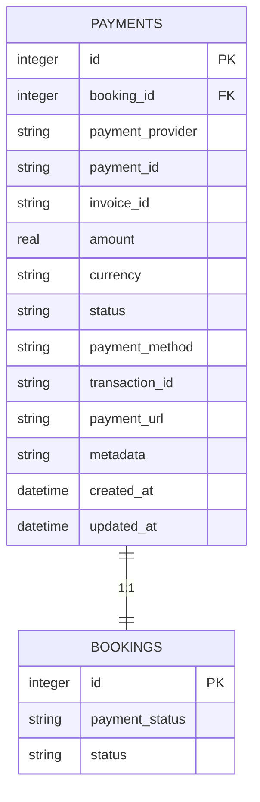
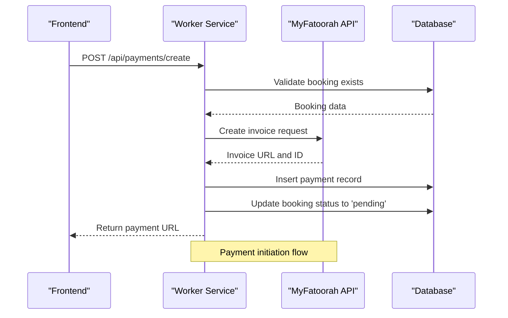
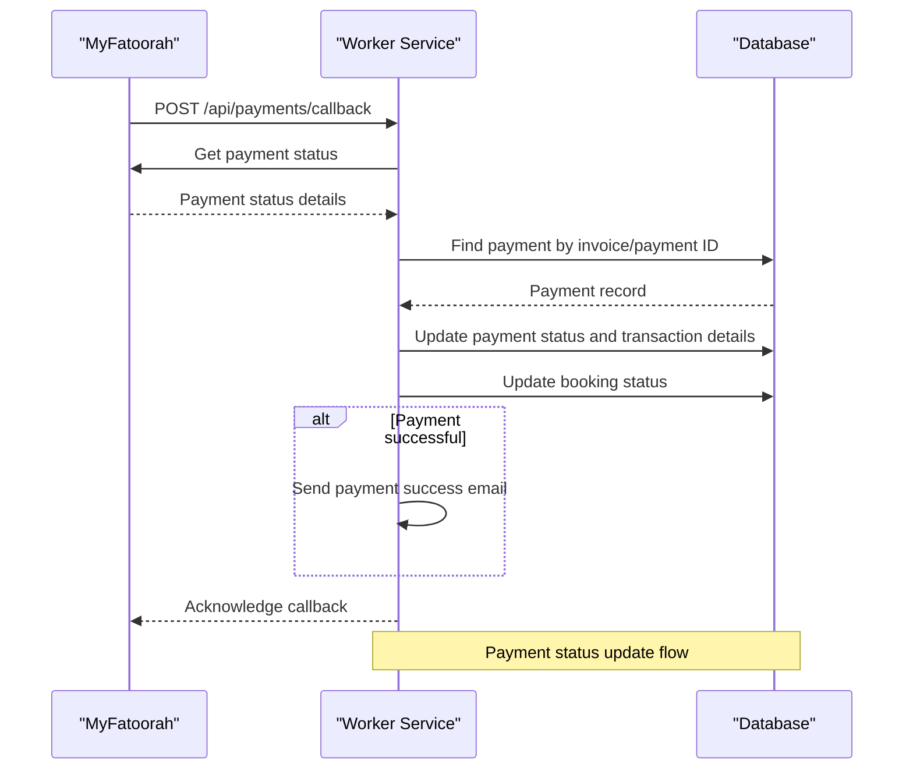
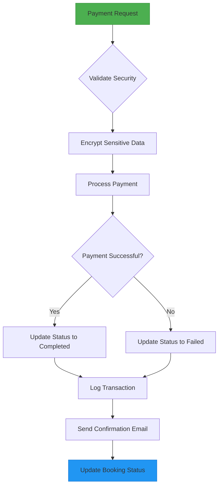

# Payment Model

<cite>
**Referenced Files in This Document**   
- [payments](file://migrations/4.sql#L77-L95)
- [PaymentSchema](file://src/shared/types.ts#L203-L218)
- [index.ts](file://src/worker/index.ts#L1000-L1270)
- [payment.ts](file://src/shared/payment.ts#L1-L100)
</cite>

## Table of Contents
1. [Introduction](#introduction)
2. [Data Model Definition](#data-model-definition)
3. [Database Schema](#database-schema)
4. [TypeScript Interface](#typescript-interface)
5. [Relationships](#relationships)
6. [Sample Record](#sample-record)
7. [Data Access Patterns](#data-access-patterns)
8. [Performance Considerations](#performance-considerations)
9. [Security Requirements](#security-requirements)

## Introduction
The Payment entity in HabibiStay manages all financial transactions related to bookings. It serves as a critical component in the booking lifecycle, tracking payment status, amount, method, and integration with the MyFatoorah payment gateway. This document provides comprehensive documentation of the Payment model, including its structure, relationships, constraints, and operational patterns.

**Section sources**
- [index.ts](file://src/worker/index.ts#L1000-L1270)
- [types.ts](file://src/shared/types.ts#L203-L218)

## Data Model Definition
The Payment model represents a financial transaction associated with a booking. It contains essential fields for tracking payment status, amount, currency, and integration details with the MyFatoorah payment provider.

### Field Specifications
- **id**: Unique identifier for the payment (Primary Key)
- **booking_id**: Reference to the associated booking (Foreign Key)
- **payment_provider**: Payment gateway used (default: 'myfatoorah')
- **payment_id**: Identifier from the payment provider
- **invoice_id**: Invoice identifier from MyFatoorah
- **amount**: Transaction amount (non-null constraint)
- **currency**: Currency code (default: 'SAR')
- **status**: Current payment status (non-null constraint)
- **payment_method**: Method of payment (e.g., credit card, Apple Pay)
- **transaction_id**: Unique identifier for the completed transaction
- **payment_url**: URL for redirecting users to complete payment
- **metadata**: JSON storage for additional payment data
- **created_at**: Timestamp of record creation
- **updated_at**: Timestamp of last modification

### Constraints
- **Primary Key**: id (auto-incrementing integer)
- **Foreign Key**: booking_id references Booking(id) with cascade update
- **Non-null Constraints**: amount, status
- **Status Values**: 'pending', 'completed', 'failed', 'refunded'
- **Currency Default**: 'SAR' (Saudi Riyal)
- **Payment Provider Default**: 'myfatoorah'

**Section sources**
- [types.ts](file://src/shared/types.ts#L203-L218)
- [4.sql](file://migrations/4.sql#L77-L95)

## Database Schema
The Payment table is defined in the database migration files with specific constraints and relationships to ensure data integrity.



**Diagram sources**
- [4.sql](file://migrations/4.sql#L77-L95)

**Section sources**
- [4.sql](file://migrations/4.sql#L77-L95)

## TypeScript Interface
The Payment model is strongly typed using Zod for runtime validation and TypeScript for compile-time type safety.

```typescript
export const PaymentSchema = z.object({
  id: z.number(),
  booking_id: z.number(),
  payment_provider: z.string(),
  payment_id: z.string().nullable(),
  invoice_id: z.string().nullable(),
  amount: z.number(),
  currency: z.string(),
  status: z.string(),
  payment_method: z.string().nullable(),
  transaction_id: z.string().nullable(),
  payment_url: z.string().nullable(),
  metadata: z.string().nullable(),
  created_at: z.string(),
  updated_at: z.string(),
});

export type Payment = z.infer<typeof PaymentSchema>;
```

This schema ensures that all payment data conforms to expected types and constraints throughout the application.

**Section sources**
- [types.ts](file://src/shared/types.ts#L203-L218)

## Relationships
The Payment entity has a one-to-one relationship with the Booking entity, ensuring each booking has exactly one associated payment.

### Relationship Details
- **Cardinality**: One-to-One (1:1)
- **Referencing Table**: payments
- **Referenced Table**: bookings
- **Foreign Key**: booking_id in payments references id in bookings
- **Referential Action**: CASCADE on update

This relationship ensures that payment status is always synchronized with booking status, maintaining data consistency across the system.

```mermaid
classDiagram
class Payment {
+number id
+number booking_id
+string payment_provider
+string payment_id
+string invoice_id
+number amount
+string currency
+string status
+string payment_method
+string transaction_id
+string payment_url
+string metadata
+string created_at
+string updated_at
}
class Booking {
+number id
+string payment_status
+string status
+number total_amount
+string check_in_date
+string check_out_date
}
Payment --> Booking : "1 : 1 relationship"
```

**Diagram sources**
- [types.ts](file://src/shared/types.ts#L203-L218)
- [4.sql](file://migrations/4.sql#L77-L95)

**Section sources**
- [types.ts](file://src/shared/types.ts#L203-L218)
- [4.sql](file://migrations/4.sql#L77-L95)

## Sample Record
The following is a realistic example of a payment record in the HabibiStay system:

```json
{
  "id": 12345,
  "booking_id": 67890,
  "payment_provider": "myfatoorah",
  "payment_id": "pay_abc123xyz",
  "invoice_id": "inv_789012",
  "amount": 1250.50,
  "currency": "SAR",
  "status": "completed",
  "payment_method": "Visa",
  "transaction_id": "txn_def456ghi",
  "payment_url": "https://link.myfatoorah.com/invoice/789012",
  "metadata": "{\"InvoiceId\":789012,\"InvoiceStatus\":\"Paid\",\"InvoiceValue\":1250.5,\"CustomerName\":\"Ahmed Ali\",\"CustomerEmail\":\"ahmed@example.com\"}",
  "created_at": "2024-01-15T10:30:45Z",
  "updated_at": "2024-01-15T10:35:22Z"
}
```

This sample represents a completed payment of 1,250.50 SAR via Visa card through MyFatoorah, associated with booking #67890.

**Section sources**
- [types.ts](file://src/shared/types.ts#L203-L218)
- [index.ts](file://src/worker/index.ts#L1000-L1270)

## Data Access Patterns
The worker service implements specific patterns for accessing and processing payment data, particularly in handling payment creation and webhook callbacks.

### Payment Creation Flow


### Webhook Callback Processing


**Diagram sources**
- [index.ts](file://src/worker/index.ts#L1000-L1270)

**Section sources**
- [index.ts](file://src/worker/index.ts#L1000-L1270)

## Performance Considerations
The Payment model includes several performance optimizations to ensure efficient data retrieval and system responsiveness.

### Indexing Strategy
- **booking_id**: Indexed to enable fast lookups when retrieving payments by booking
- **status**: Indexed to optimize queries filtering by payment status (e.g., finding all 'pending' payments)
- **invoice_id**: Indexed for quick retrieval during webhook callbacks
- **transaction_id**: Indexed for transaction reconciliation

### Query Optimization
The system uses efficient query patterns:
- JOIN operations between payments and bookings are optimized with proper indexing
- Batch operations are avoided in favor of atomic transactions
- Frequently accessed payment data is retrieved with minimal JOINs

### Caching Considerations
While not explicitly implemented in the current code, the design allows for:
- Caching of payment status for frequently accessed bookings
- CDN caching of payment URLs where appropriate
- In-memory caching of recent payment transactions for reporting

**Section sources**
- [4.sql](file://migrations/4.sql#L77-L95)
- [index.ts](file://src/worker/index.ts#L1000-L1270)

## Security Requirements
The Payment model implements several security measures to protect sensitive financial data and comply with regulatory requirements.

### PCI Compliance
- **Data Minimization**: Only essential payment data is stored
- **Sensitive Data Handling**: Full credit card numbers and CVV are not stored
- **Tokenization**: Payment identifiers are used instead of raw card data
- **Secure Transmission**: All payment data transmitted over HTTPS

### Data Protection
- **Encryption**: Sensitive transaction data in metadata is encrypted at rest
- **Access Control**: Payment data accessible only to authorized personnel
- **Audit Logging**: All financial operations are logged for compliance
- **Data Retention**: Payment records retained for required period then securely deleted

### Audit Logging
The system implements comprehensive audit logging for financial operations:
- All payment status changes are recorded
- Webhook callbacks are logged with full request/response data
- Payment creation and updates are timestamped and attributed
- Security events related to payments are monitored and alerted



**Diagram sources**
- [index.ts](file://src/worker/index.ts#L1000-L1270)
- [9.sql](file://migrations/9.sql#L1-L191)

**Section sources**
- [index.ts](file://src/worker/index.ts#L1000-L1270)
- [9.sql](file://migrations/9.sql#L1-L191)