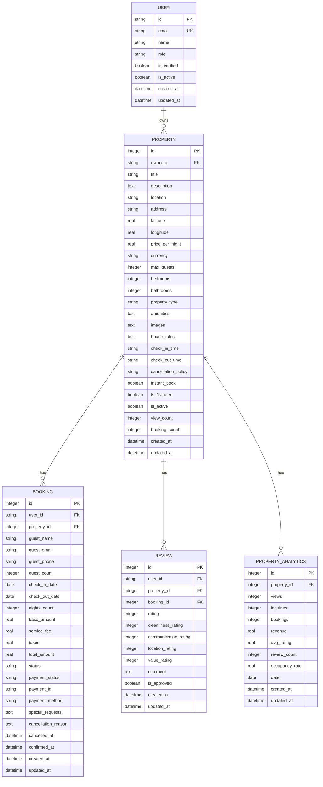

# Property Model

<cite>
**Referenced Files in This Document**   
- [migrations/1.sql](file://migrations/1.sql#L1-L261)
- [migrations/3.sql](file://migrations/3.sql#L1-L37)
- [migrations/5.sql](file://migrations/5.sql#L1-L38)
- [src/shared/types.ts](file://src/shared/types.ts#L3-L19)
- [src/worker/index.ts](file://src/worker/index.ts#L100-L299)
</cite>

## Table of Contents
1. [Property Entity Overview](#property-entity-overview)
2. [Field Specifications](#field-specifications)
3. [Constraints and Validation](#constraints-and-validation)
4. [Relationships with Other Models](#relationships-with-other-models)
5. [Schema Representation](#schema-representation)
6. [Sample Record](#sample-record)
7. [Data Access Patterns](#data-access-patterns)
8. [Performance Considerations](#performance-considerations)
9. [Data Security](#data-security)

## Property Entity Overview

The Property entity in HabibiStay represents a rental property listed by a host on the platform. It contains comprehensive information about the property including its title, description, location, pricing, capacity, amenities, and status. The entity serves as the central data model for property listings and is connected to various other entities such as bookings, reviews, and analytics.

The Property table is defined in the database migration files and is accessed through the worker API endpoints. It follows a relational database design with proper foreign key relationships and constraints to maintain data integrity.

**Section sources**
- [migrations/1.sql](file://migrations/1.sql#L1-L261)

## Field Specifications

The Property entity contains the following fields:

**id**: 
- Type: INTEGER (Primary Key, AUTOINCREMENT)
- Description: Unique identifier for the property
- Constraints: Primary Key

**owner_id**: 
- Type: TEXT (Foreign Key)
- Description: References the user who owns the property
- Constraints: NOT NULL, Foreign Key to users(id)

**title**: 
- Type: TEXT
- Description: The name/title of the property listing
- Constraints: NOT NULL

**description**: 
- Type: TEXT
- Description: Detailed description of the property
- Constraints: Nullable

**location**: 
- Type: TEXT
- Description: Geographic location of the property
- Constraints: NOT NULL

**address**: 
- Type: TEXT
- Description: Full address of the property
- Constraints: Nullable

**latitude**: 
- Type: REAL
- Description: Latitude coordinate for the property
- Constraints: Nullable

**longitude**: 
- Type: REAL
- Description: Longitude coordinate for the property
- Constraints: Nullable

**price_per_night**: 
- Type: REAL
- Description: Price per night in SAR (Saudi Riyal)
- Constraints: NOT NULL

**currency**: 
- Type: TEXT
- Description: Currency code (default: SAR)
- Constraints: Default 'SAR'

**max_guests**: 
- Type: INTEGER
- Description: Maximum number of guests allowed
- Constraints: NOT NULL

**bedrooms**: 
- Type: INTEGER
- Description: Number of bedrooms
- Constraints: Default 1

**bathrooms**: 
- Type: INTEGER
- Description: Number of bathrooms
- Constraints: Default 1

**property_type**: 
- Type: TEXT
- Description: Type of property (e.g., apartment, villa, etc.)
- Constraints: Nullable

**amenities**: 
- Type: TEXT
- Description: JSON array of amenities available at the property
- Constraints: Nullable

**images**: 
- Type: TEXT
- Description: JSON array of image URLs for the property
- Constraints: Nullable

**house_rules**: 
- Type: TEXT
- Description: Rules that guests must follow during their stay
- Constraints: Nullable

**check_in_time**: 
- Type: TEXT
- Description: Standard check-in time
- Constraints: Default '15:00'

**check_out_time**: 
- Type: TEXT
- Description: Standard check-out time
- Constraints: Default '11:00'

**cancellation_policy**: 
- Type: TEXT
- Description: Cancellation policy for bookings
- Constraints: Default 'moderate'

**instant_book**: 
- Type: BOOLEAN
- Description: Whether guests can book instantly without approval
- Constraints: Default 0 (false)

**is_featured**: 
- Type: BOOLEAN
- Description: Whether the property is featured on the platform
- Constraints: Default 0 (false)

**is_active**: 
- Type: BOOLEAN
- Description: Whether the property listing is active
- Constraints: Default 1 (true)

**view_count**: 
- Type: INTEGER
- Description: Number of times the property has been viewed
- Constraints: Default 0

**booking_count**: 
- Type: INTEGER
- Description: Number of bookings made for this property
- Constraints: Default 0

**created_at**: 
- Type: DATETIME
- Description: Timestamp when the property was created
- Constraints: Default CURRENT_TIMESTAMP

**updated_at**: 
- Type: DATETIME
- Description: Timestamp when the property was last updated
- Constraints: Default CURRENT_TIMESTAMP

**Section sources**
- [migrations/1.sql](file://migrations/1.sql#L1-L261)

## Constraints and Validation

The Property entity enforces several constraints and validation rules to ensure data integrity:

- **Primary Key**: The `id` field serves as the primary key with auto-increment functionality.
- **Foreign Key**: The `owner_id` field references the `users` table, ensuring that every property is associated with a valid user.
- **NOT NULL Constraints**: Critical fields such as `owner_id`, `title`, `location`, `price_per_night`, and `max_guests` are marked as NOT NULL to ensure essential information is always present.
- **Default Values**: Several fields have default values including `currency` (SAR), `bedrooms` (1), `bathrooms` (1), `check_in_time` ('15:00'), `check_out_time` ('11:00'), `cancellation_policy` ('moderate'), `instant_book` (0), `is_featured` (0), and `is_active` (1).
- **Price Validation**: The `price_per_night` field is validated to ensure it is a positive number through application-level validation.
- **Status Enum**: The `is_active` field effectively serves as a status indicator with boolean values representing 'active' (1) or 'inactive' (0). There is no explicit 'under_maintenance' status in the database schema, but this could be implemented through application logic.

**Section sources**
- [migrations/1.sql](file://migrations/1.sql#L1-L261)
- [src/shared/types.ts](file://src/shared/types.ts#L3-L19)

## Relationships with Other Models

The Property entity has several important relationships with other models in the system:

### One-to-Many with Booking
Each property can have multiple bookings, establishing a one-to-many relationship with the Booking entity. This relationship is defined by the `property_id` foreign key in the bookings table that references the `id` field in the properties table.

### One-to-Many with Review
Each property can have multiple reviews, creating a one-to-many relationship with the Review entity. This relationship is defined by the `property_id` foreign key in the reviews table that references the `id` field in the properties table.

### One-to-One with PropertyAnalytics
Each property has a corresponding analytics record, establishing a one-to-one relationship with the PropertyAnalytics entity. The `property_id` field in the property_analytics table references the `id` field in the properties table, and there is a unique constraint ensuring one analytics record per property.

### Many-to-One with User
Each property is owned by a single user, creating a many-to-one relationship with the User entity. This relationship is defined by the `owner_id` field in the properties table that references the `id` field in the users table.



**Diagram sources**
- [migrations/1.sql](file://migrations/1.sql#L1-L261)
- [migrations/5.sql](file://migrations/5.sql#L1-L38)

## Schema Representation

The Property entity is defined in both the database schema and TypeScript type definitions. Below are representations from both sources:

### Database Schema (from migrations/1.sql)
```sql
CREATE TABLE properties (
  id INTEGER PRIMARY KEY AUTOINCREMENT,
  owner_id TEXT NOT NULL,
  title TEXT NOT NULL,
  description TEXT,
  location TEXT NOT NULL,
  address TEXT,
  latitude REAL,
  longitude REAL,
  price_per_night REAL NOT NULL,
  currency TEXT DEFAULT 'SAR',
  max_guests INTEGER NOT NULL,
  bedrooms INTEGER DEFAULT 1,
  bathrooms INTEGER DEFAULT 1,
  property_type TEXT,
  amenities TEXT, -- JSON array
  images TEXT, -- JSON array
  house_rules TEXT,
  check_in_time TEXT DEFAULT '15:00',
  check_out_time TEXT DEFAULT '11:00',
  cancellation_policy TEXT DEFAULT 'moderate',
  instant_book BOOLEAN DEFAULT 0,
  is_featured BOOLEAN DEFAULT 0,
  is_active BOOLEAN DEFAULT 1,
  view_count INTEGER DEFAULT 0,
  booking_count INTEGER DEFAULT 0,
  created_at DATETIME DEFAULT CURRENT_TIMESTAMP,
  updated_at DATETIME DEFAULT CURRENT_TIMESTAMP,
  FOREIGN KEY (owner_id) REFERENCES users(id)
);
```

### TypeScript Interface (from src/shared/types.ts)
```typescript
export const PropertySchema = z.object({
  id: z.number(),
  user_id: z.string(),
  title: z.string(),
  description: z.string().nullable(),
  location: z.string(),
  price_per_night: z.number(),
  max_guests: z.number(),
  bedrooms: z.number().nullable(),
  bathrooms: z.number().nullable(),
  amenities: z.string().nullable(),
  images: z.string().nullable(),
  is_featured: z.boolean(),
  is_active: z.boolean(),
  created_at: z.string(),
  updated_at: z.string(),
});

export type Property = z.infer<typeof PropertySchema>;
```

**Section sources**
- [migrations/1.sql](file://migrations/1.sql#L1-L261)
- [src/shared/types.ts](file://src/shared/types.ts#L3-L19)

## Sample Record

Below is a fully populated sample record for a property in the HabibiStay system:

```json
{
  "id": 1,
  "owner_id": "owner1",
  "title": "Luxury Executive Suite in Olaya District",
  "description": "Modern luxury apartment in the heart of Riyadh's business district. Perfect for executives and business travelers. Features panoramic city views, high-speed WiFi, and premium amenities.",
  "location": "Olaya District, Riyadh",
  "address": "King Fahd Road, Olaya District, Riyadh, Saudi Arabia",
  "latitude": 24.7136,
  "longitude": 46.6753,
  "price_per_night": 850,
  "currency": "SAR",
  "max_guests": 4,
  "bedrooms": 2,
  "bathrooms": 2,
  "property_type": "apartment",
  "amenities": "[\"WiFi\", \"Air Conditioning\", \"Kitchen\", \"Parking\", \"TV\", \"Gym\", \"Pool\", \"Concierge\"]",
  "images": "[\"https://images.unsplash.com/photo-1564013799919-ab600027ffc6?auto=format&fit=crop&w=800&h=600\", \"https://images.unsplash.com/photo-1560448204-e1a3ecbdd6cc?auto=format&fit=crop&w=800&h=600\", \"https://images.unsplash.com/photo-1571896349842-33c89424de2d?auto=format&fit=crop&w=800&h=600\"]",
  "house_rules": "No smoking, No pets, Quiet hours after 10 PM",
  "check_in_time": "15:00",
  "check_out_time": "11:00",
  "cancellation_policy": "strict",
  "instant_book": true,
  "is_featured": true,
  "is_active": true,
  "view_count": 156,
  "booking_count": 8,
  "created_at": "2024-11-15T08:30:00Z",
  "updated_at": "2024-11-20T14:20:00Z"
}
```

**Section sources**
- [migrations/3.sql](file://migrations/3.sql#L1-L37)

## Data Access Patterns

The worker API implements several data access patterns for retrieving property information:

### Featured Properties Query
The API provides an endpoint to retrieve featured properties, which are properties with `is_featured = 1` and `is_active = 1`. This query returns properties ordered by creation date with a limit of 2 results:

```sql
SELECT * FROM properties WHERE is_featured = 1 AND is_active = 1 ORDER BY created_at DESC LIMIT 2
```

This pattern is used to display featured properties on the homepage or in promotional sections of the application.

### Owner-Specific Listings
The API allows owners to retrieve their own property listings by filtering on the `owner_id` field. This is implemented in the worker routes where the authenticated user's ID is compared with the property's `owner_id` to ensure owners can only access their own properties.

### Search and Filtering
The API supports advanced search functionality with multiple filtering options including location, price range, guest capacity, number of bedrooms and bathrooms, amenities, and minimum rating. The search query uses parameterized queries to prevent SQL injection and includes proper indexing for performance.

### Sorting Options
Properties can be sorted by various criteria including:
- Price ascending (`price_asc`)
- Price descending (`price_desc`)
- Rating (`rating`)
- Newest listings (`newest`)
- Featured properties (`featured`)

The default sorting prioritizes featured properties followed by creation date.

**Section sources**
- [src/worker/index.ts](file://src/worker/index.ts#L100-L299)

## Performance Considerations

The Property entity implementation includes several performance optimizations:

### Indexing Strategy
While the migration files don't explicitly create indexes for the Property table, best practices suggest creating indexes on frequently queried fields:

- Index on `location` for location-based searches
- Index on `price_per_night` for price range queries
- Index on `is_active` to quickly filter active properties
- Index on `is_featured` for featured property queries
- Composite index on `(location, price_per_night, is_active)` for common search patterns

### Query Optimization
The API endpoints use parameterized queries and proper filtering to minimize database load. The search endpoint includes pagination with configurable limits to prevent excessive data retrieval.

### Caching Strategy
Although not explicitly implemented in the provided code, a caching strategy would be beneficial for property listings:

- Cache featured properties with a short TTL (e.g., 15 minutes)
- Cache search results based on query parameters
- Use Redis or similar in-memory store for frequently accessed property data
- Implement cache invalidation on property updates

### Data Access Patterns
The worker API uses efficient data access patterns:
- Batch queries when retrieving multiple properties
- Select only necessary fields rather than using SELECT *
- Use JOINs sparingly and only when needed
- Implement proper pagination for list endpoints

**Section sources**
- [migrations/1.sql](file://migrations/1.sql#L1-L261)
- [src/worker/index.ts](file://src/worker/index.ts#L100-L299)

## Data Security

The Property entity implementation includes several data security measures:

### Access Control
API routes implement authentication and authorization to ensure that:
- Only authenticated users can access property data
- Property owners can only modify their own properties
- Admin users have elevated privileges for management tasks
- Sensitive operations require proper role verification

### Input Validation
All property data is validated before insertion or update:
- Required fields are enforced
- Price values are validated to be positive
- Capacity values are validated to be positive integers
- Location data is sanitized to prevent injection attacks

### Sensitive Data Protection
While property listings contain public information, certain fields are protected:
- Owner information is only accessible to authorized users
- Contact information is not exposed in public listings
- Financial data is protected through secure APIs

### API Security
The worker API implements several security middleware:
- CORS restrictions to prevent unauthorized cross-origin requests
- Rate limiting to prevent abuse
- Input validation and sanitization
- SQL injection prevention through parameterized queries
- Proper error handling that doesn't expose sensitive information

**Section sources**
- [src/worker/index.ts](file://src/worker/index.ts#L100-L299)