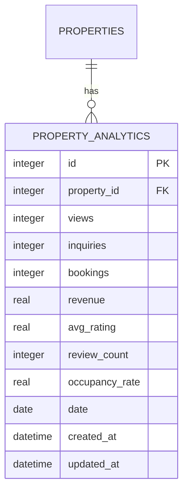
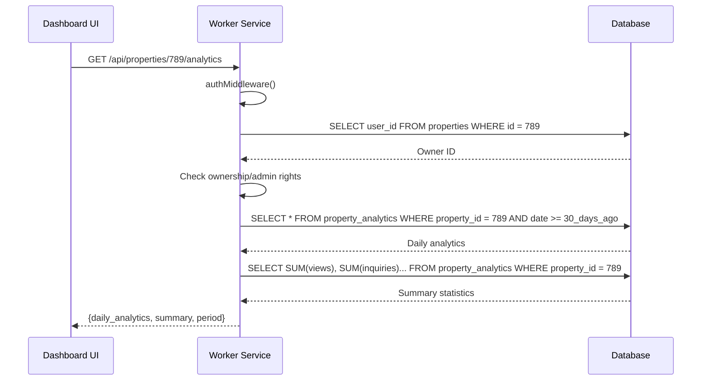
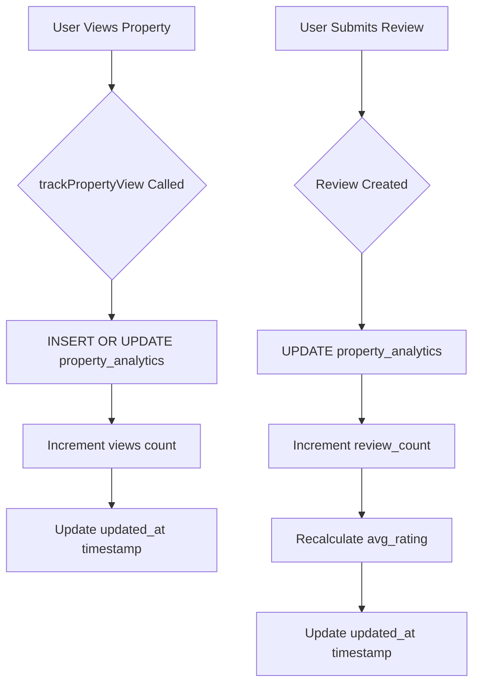

# PropertyAnalytics Model

<cite>
**Referenced Files in This Document**   
- [migrations/5.sql](file://migrations/5.sql#L1-L36)
- [src/shared/types.ts](file://src/shared/types.ts#L168-L200)
- [src/worker/index.ts](file://src/worker/index.ts#L200-L2443)
</cite>

## Table of Contents
1. [Introduction](#introduction)
2. [Data Model Schema](#data-model-schema)
3. [Field Specifications](#field-specifications)
4. [Relationships and Constraints](#relationships-and-constraints)
5. [TypeScript Interface](#typescript-interface)
6. [Sample Analytics Record](#sample-analytics-record)
7. [Data Access Patterns](#data-access-patterns)
8. [Update Mechanisms](#update-mechanisms)
9. [Performance Considerations](#performance-considerations)
10. [Data Accuracy and Business Impact](#data-accuracy-and-business-impact)

## Introduction
The PropertyAnalytics model in HabibiStay serves as a central component for tracking and analyzing property performance metrics. This model captures key business indicators such as views, bookings, revenue, and ratings, enabling property owners and administrators to make data-driven decisions. The analytics data is derived from raw user interactions and transactions, providing aggregated insights into property performance over time.

**Section sources**
- [migrations/5.sql](file://migrations/5.sql#L1-L36)
- [src/shared/types.ts](file://src/shared/types.ts#L168-L200)

## Data Model Schema
The PropertyAnalytics table is designed to store daily performance metrics for each property, enabling time-series analysis and trend identification. The schema is implemented in the database migration system and reflects a denormalized structure optimized for read performance.



**Diagram sources**
- [migrations/5.sql](file://migrations/5.sql#L1-L36)

**Section sources**
- [migrations/5.sql](file://migrations/5.sql#L1-L36)

## Field Specifications
The PropertyAnalytics entity contains the following fields with their respective data types, constraints, and purposes:

- **id**: integer, primary key, auto-incremented identifier for the analytics record
- **property_id**: integer, foreign key referencing the properties table, not null
- **views**: integer, default 0, counts the number of times a property listing has been viewed
- **inquiries**: integer, default 0, tracks the number of inquiries or messages sent about the property
- **bookings**: integer, default 0, records the number of confirmed bookings for the property
- **revenue**: real, default 0, stores the total revenue generated by the property (in local currency)
- **avg_rating**: real, default 0, maintains the average rating from guest reviews
- **review_count**: integer, default 0, counts the total number of reviews received
- **occupancy_rate**: real, default 0, represents the percentage of available nights that are booked
- **date**: date, not null, specifies the date for which the analytics are recorded (enables daily aggregation)
- **created_at**: datetime, default CURRENT_TIMESTAMP, records when the analytics record was created
- **updated_at**: datetime, default CURRENT_TIMESTAMP, tracks the last modification time of the record

All numeric fields have default values of 0 and are constrained to non-negative values through application logic. The combination of property_id and date serves as a composite unique key, ensuring one record per property per day.

**Section sources**
- [migrations/5.sql](file://migrations/5.sql#L1-L36)

## Relationships and Constraints
The PropertyAnalytics model maintains a one-to-one relationship with the Property entity through the property_id foreign key. This relationship enables the association of analytics data with specific properties in the system.

Although the migration file does not explicitly define a foreign key constraint between property_analytics.property_id and properties.id, the application enforces referential integrity through business logic. The property_id field is not nullable, ensuring that every analytics record is associated with a valid property.

The table design implements a daily aggregation pattern, where each record represents analytics for a specific property on a specific date. This approach allows for efficient time-series analysis and trend identification while maintaining data granularity.

```mermaid
classDiagram
class Property {
+integer id
+string title
+string location
+real price_per_night
+integer bedrooms
+integer bathrooms
+boolean is_active
+datetime created_at
+datetime updated_at
}
class PropertyAnalytics {
+integer id
+integer property_id
+integer views
+integer inquiries
+integer bookings
+real revenue
+real avg_rating
+integer review_count
+real occupancy_rate
+date date
+datetime created_at
+datetime updated_at
}
Property ||--o{ PropertyAnalytics : "has analytics"
```

**Diagram sources**
- [migrations/5.sql](file://migrations/5.sql#L1-L36)

**Section sources**
- [migrations/5.sql](file://migrations/5.sql#L1-L36)
- [src/worker/index.ts](file://src/worker/index.ts#L1210-L1255)

## TypeScript Interface
The PropertyAnalytics model is represented in the application code through a TypeScript interface defined using Zod for runtime type checking and validation. This interface ensures data consistency between the database and application layers.

```typescript
export const PropertyAnalyticsSchema = z.object({
  id: z.number(),
  property_id: z.number(),
  views: z.number(),
  inquiries: z.number(),
  bookings: z.number(),
  revenue: z.number(),
  avg_rating: z.number(),
  review_count: z.number(),
  occupancy_rate: z.number(),
  date: z.string(),
  created_at: z.string(),
  updated_at: z.string(),
});

export type PropertyAnalytics = z.infer<typeof PropertyAnalyticsSchema>;
```

This interface defines all fields as numbers (for numeric types) and strings (for dates and timestamps), reflecting the JSON serialization format used in API responses. The type definition is used throughout the application for data validation, API request/response handling, and type safety.

**Section sources**
- [src/shared/types.ts](file://src/shared/types.ts#L168-L200)

## Sample Analytics Record
The following is a realistic example of a PropertyAnalytics record with sample metrics for a high-performing property:

```json
{
  "id": 12345,
  "property_id": 789,
  "views": 42,
  "inquiries": 8,
  "bookings": 3,
  "revenue": 2175.50,
  "avg_rating": 4.8,
  "review_count": 24,
  "occupancy_rate": 0.78,
  "date": "2024-01-15",
  "created_at": "2024-01-15T00:05:00Z",
  "updated_at": "2024-01-15T23:45:30Z"
}
```

This record indicates that on January 15, 2024, the property received 42 views, generated 8 inquiries, and secured 3 bookings totaling 2,175.50 in revenue. The property maintains a strong reputation with an average rating of 4.8 from 24 reviews and an occupancy rate of 78%.

**Section sources**
- [src/shared/types.ts](file://src/shared/types.ts#L168-L200)

## Data Access Patterns
The PropertyAnalytics data is accessed through specific API endpoints in the worker service, primarily for owner dashboards and administrative reporting. The main access pattern involves retrieving analytics for a specific property over a defined time period.

The `/api/properties/:id/analytics` endpoint retrieves analytics data for the last 30 days, returning both daily records and aggregated summary statistics. This endpoint implements authentication and authorization checks to ensure that only property owners or administrators can access the data.



**Diagram sources**
- [src/worker/index.ts](file://src/worker/index.ts#L1210-L1255)

**Section sources**
- [src/worker/index.ts](file://src/worker/index.ts#L1210-L1255)

## Update Mechanisms
The PropertyAnalytics table is updated through application-level triggers rather than database triggers. These updates occur atomically when specific user actions take place, ensuring data consistency and accuracy.

Property views are tracked when users access the property detail page through the `trackPropertyView` function, which increments the views count for the current date. Similarly, when a new review is submitted, the analytics are updated to reflect the new review count and adjusted average rating.



The update mechanism uses SQLite's INSERT OR UPDATE (upsert) functionality with the ON CONFLICT clause to handle both new daily records and updates to existing records atomically. This approach prevents race conditions and ensures data integrity even under concurrent access.

**Diagram sources**
- [src/worker/index.ts](file://src/worker/index.ts#L200-L2443)

**Section sources**
- [src/worker/index.ts](file://src/worker/index.ts#L200-L2443)

## Performance Considerations
The PropertyAnalytics model is designed with performance optimization in mind, particularly for read-heavy access patterns typical of analytics dashboards. While no explicit indexes are defined in the migration files, the query patterns suggest the need for strategic indexing.

The primary query pattern involves filtering by property_id and date range, which would benefit from a composite index on (property_id, date). This index would significantly improve the performance of the 30-day analytics retrieval used in owner dashboards.

Atomic updates are implemented using SQLite's upsert functionality, which ensures data consistency without requiring separate read-modify-write operations. This approach minimizes the risk of race conditions and improves write performance.

For aggregation queries that calculate platform-wide statistics, the system may benefit from materialized views or periodic batch processing to avoid expensive real-time calculations on large datasets.

**Section sources**
- [src/worker/index.ts](file://src/worker/index.ts#L1210-L1255)

## Data Accuracy and Business Impact
The accuracy of PropertyAnalytics data is critical for business decision-making, as it directly informs property pricing strategies, marketing efforts, and operational improvements. The data is derived from raw user interactions and transactions, with metrics calculated and updated in near real-time.

The update frequency is effectively real-time for user-facing metrics like views and reviews, with updates occurring immediately when user actions take place. This real-time nature ensures that property owners have access to current performance data, enabling timely responses to market conditions.

The analytics data informs several key business decisions:
- **Pricing optimization**: Revenue and occupancy data guides dynamic pricing strategies
- **Marketing effectiveness**: View and inquiry metrics measure the success of promotional campaigns
- **Property improvements**: Rating trends highlight areas for operational enhancement
- **Investment decisions**: Performance metrics support expansion and acquisition strategies

By providing a comprehensive view of property performance, the PropertyAnalytics model serves as a foundation for data-driven decision-making across the HabibiStay platform.

**Section sources**
- [src/worker/index.ts](file://src/worker/index.ts#L200-L2443)
- [src/shared/types.ts](file://src/shared/types.ts#L168-L200)