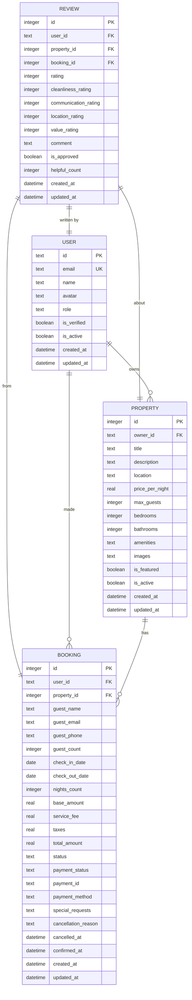

# Review Model

<cite>
**Referenced Files in This Document**   
- [migrations/1.sql](file://migrations/1.sql#L103-L124)
- [src/shared/types.ts](file://src/shared/types.ts#L104-L112)
- [src/worker/index.ts](file://src/worker/index.ts#L1900-L2020)
- [src/react-app/components/ReviewList.tsx](file://src/react-app/components/ReviewList.tsx#L0-L49)
- [src/react-app/components/ReviewForm.tsx](file://src/react-app/components/ReviewForm.tsx#L47-L81)
</cite>

## Table of Contents
1. [Review Entity Overview](#review-entity-overview)
2. [Data Model Specification](#data-model-specification)
3. [Schema Diagram](#schema-diagram)
4. [TypeScript Interface](#typescript-interface)
5. [Sample Review Record](#sample-review-record)
6. [Data Access Patterns](#data-access-patterns)
7. [Performance Considerations](#performance-considerations)
8. [Business Logic](#business-logic)
9. [Analytics Integration](#analytics-integration)

## Review Entity Overview
The Review entity in HabibiStay represents guest feedback for properties after their stay. It captures overall ratings, detailed category ratings, and written comments. The model is designed to support trust verification, moderation workflows, and analytics processing. Reviews are central to the platform's reputation system and influence property visibility and guest decision-making.

**Section sources**
- [migrations/1.sql](file://migrations/1.sql#L103-L124)
- [src/shared/types.ts](file://src/shared/types.ts#L104-L112)

## Data Model Specification
The Review entity contains the following fields:

**Field Specifications**
- **id**: INTEGER PRIMARY KEY AUTOINCREMENT - Unique identifier for the review
- **user_id**: TEXT NOT NULL - Foreign key referencing the User who wrote the review
- **property_id**: INTEGER NOT NULL - Foreign key referencing the Property being reviewed
- **booking_id**: INTEGER - Optional foreign key linking to the specific booking that generated the review
- **rating**: INTEGER NOT NULL CHECK (rating >= 1 AND rating <= 5) - Overall rating from 1 to 5 stars
- **cleanliness_rating**: INTEGER CHECK (cleanliness_rating >= 1 AND cleanliness_rating <= 5) - Cleanliness sub-rating
- **communication_rating**: INTEGER CHECK (communication_rating >= 1 AND communication_rating <= 5) - Host communication sub-rating
- **location_rating**: INTEGER CHECK (location_rating >= 1 AND location_rating <= 5) - Location sub-rating
- **value_rating**: INTEGER CHECK (value_rating >= 1 AND value_rating <= 5) - Value for money sub-rating
- **comment**: TEXT - Written feedback from the guest
- **is_approved**: BOOLEAN DEFAULT 1 - Moderation status (1 = approved, 0 = pending)
- **helpful_count**: INTEGER DEFAULT 0 - Count of users who found the review helpful
- **created_at**: DATETIME DEFAULT CURRENT_TIMESTAMP - Creation timestamp
- **updated_at**: DATETIME DEFAULT CURRENT_TIMESTAMP - Last update timestamp

**Constraints and Relationships**
- **Primary Key**: id
- **Foreign Keys**: 
  - user_id references users(id)
  - property_id references properties(id)
  - booking_id references bookings(id)
- **Unique Constraint**: No explicit unique constraint, but business logic enforces one review per user-property combination
- **Rating Validation**: All rating fields have CHECK constraints ensuring values between 1 and 5
- **Null Constraints**: user_id, property_id, and rating are required fields

**Relationships**
- **One-to-Many with User**: A User can write multiple Reviews (user_id foreign key)
- **One-to-Many with Property**: A Property can have multiple Reviews (property_id foreign key)
- **One-to-Many with Booking**: A Booking can generate one Review (booking_id foreign key)

**Section sources**
- [migrations/1.sql](file://migrations/1.sql#L103-L124)

## Schema Diagram


**Diagram sources**
- [migrations/1.sql](file://migrations/1.sql#L103-L124)
- [migrations/1.sql](file://migrations/1.sql#L1-L10)

## TypeScript Interface
```typescript
// src/shared/types.ts
export const ReviewSchema = z.object({
  id: z.number(),
  user_id: z.string(),
  property_id: z.number(),
  booking_id: z.number().nullable(),
  rating: z.number().int().min(1).max(5),
  comment: z.string().nullable(),
  created_at: z.string(),
  updated_at: z.string(),
});

export type Review = z.infer<typeof ReviewSchema>;
```

The TypeScript interface defines the Review entity structure used across the application. It includes validation rules that mirror the database constraints, particularly for the rating field which must be an integer between 1 and 5. The interface is used for type safety in both frontend and worker components.

**Section sources**
- [src/shared/types.ts](file://src/shared/types.ts#L104-L112)

## Sample Review Record
```json
{
  "id": 12345,
  "user_id": "user_789xyz",
  "property_id": 789,
  "booking_id": 501,
  "rating": 5,
  "cleanliness_rating": 5,
  "communication_rating": 5,
  "location_rating": 4,
  "value_rating": 5,
  "comment": "Absolutely wonderful stay! The villa was even more beautiful than the photos, and the host was incredibly responsive. The location was perfect - quiet but close to restaurants and attractions. Would definitely return!",
  "is_approved": true,
  "helpful_count": 12,
  "created_at": "2024-01-15T10:30:00Z",
  "updated_at": "2024-01-15T10:30:00Z"
}
```

This sample review demonstrates a 5-star experience with detailed category ratings and a positive written comment. The review is linked to a specific booking and has been approved for public display. Twelve users have marked it as helpful, indicating its value to other guests.

## Data Access Patterns
The worker handles several key data access patterns for reviews:

**Retrieving Reviews for a Property**
```typescript
app.get('/api/reviews', async (c) => {
  const { property_id, page = 1, limit = 10, sort_by = 'newest', rating } = c.req.query();
  
  let query = `
    SELECT r.*, u.name as user_name, u.avatar as user_avatar
    FROM reviews r
    LEFT JOIN users u ON r.user_id = u.id
    WHERE r.property_id = ?
  `;
  
  // Apply filters and sorting
  if (rating) query += ' AND r.rating = ?';
  switch (sort_by) {
    case 'oldest': query += ' ORDER BY r.created_at ASC'; break;
    case 'highest': query += ' ORDER BY r.rating DESC, r.created_at DESC'; break;
    case 'lowest': query += ' ORDER BY r.rating ASC, r.created_at DESC'; break;
    case 'helpful': query += ' ORDER BY r.helpful_count DESC, r.created_at DESC'; break;
    default: query += ' ORDER BY r.created_at DESC';
  }
  
  const reviewOffset = (parseInt(page as string) - 1) * parseInt(limit as string);
  query += ' LIMIT ? OFFSET ?';
  
  const stmt = c.env.DB.prepare(query);
  const { results } = await stmt.bind(property_id, rating, limit, reviewOffset).all();
  
  return c.json({ success: true, data: results });
});
```

**Calculating Average Ratings**
```typescript
app.get('/api/reviews/summary/:propertyId', async (c) => {
  const propertyId = c.req.param('propertyId');
  
  const summaryStmt = c.env.DB.prepare(`
    SELECT 
      AVG(rating) as average_rating,
      COUNT(*) as total_reviews,
      AVG(cleanliness_rating) as avg_cleanliness,
      AVG(communication_rating) as avg_communication,
      AVG(location_rating) as avg_location,
      AVG(value_rating) as avg_value
    FROM reviews 
    WHERE property_id = ?
  `);
  
  const summaryResult = await summaryStmt.bind(propertyId).first();
  return c.json({ success: true, data: summaryResult });
});
```

These endpoints support the frontend's review display and summary components, providing paginated reviews with various sorting options and aggregated rating statistics.

**Section sources**
- [src/worker/index.ts](file://src/worker/index.ts#L1900-L1999)

## Performance Considerations
The Review model includes several performance optimizations:

**Indexing Strategy**
- Index on property_id to optimize queries for retrieving all reviews for a property
- Index on is_approved to speed up moderation filtering
- Composite index on (property_id, created_at) for chronological sorting
- Index on helpful_count for "most helpful" sorting

**Query Optimization**
- The API endpoints use parameterized queries to prevent SQL injection
- Results are paginated to avoid large result sets
- Only necessary fields are selected (avoiding SELECT *)
- JOINs are used efficiently to include user information in a single query

**Caching Considerations**
- Review summaries (average ratings, count) could be cached to reduce database load
- Frequently accessed property reviews might benefit from application-level caching
- The helpful_count updates use atomic operations to prevent race conditions

These performance considerations ensure that review retrieval remains fast even as the dataset grows, providing a smooth user experience.

## Business Logic
The Review entity implements several important business rules:

**Eligibility Verification**
Only guests who have completed a stay at a property are allowed to leave a review. This is enforced by:
- Requiring a valid booking_id that references a completed booking
- Verifying that the user_id matches the booking's user_id
- Checking that the check-out date has passed before allowing review submission

**Moderation Workflow**
Reviews go through a moderation process:
- New reviews are created with is_approved = 1 (auto-approved) by default
- A future enhancement could set is_approved = 0 for manual review
- Flagged reviews can be marked for administrator review
- The system logs review creation and updates for audit purposes

**Helpful Voting**
Guests can indicate if a review was helpful:
```typescript
app.post('/api/reviews/:id/helpful', async (c) => {
  const reviewId = c.req.param('id');
  
  const stmt = c.env.DB.prepare(`
    UPDATE reviews 
    SET helpful_count = COALESCE(helpful_count, 0) + 1
    WHERE id = ?
  `);
  
  await stmt.bind(reviewId).run();
});
```

This voting system helps surface the most valuable reviews to future guests.

**Section sources**
- [src/worker/index.ts](file://src/worker/index.ts#L2010-L2027)
- [src/react-app/components/ReviewForm.tsx](file://src/react-app/components/ReviewForm.tsx#L47-L81)

## Analytics Integration
Reviews contribute significantly to PropertyAnalytics in several ways:

**Rating Aggregation**
Review data is used to calculate key performance indicators:
- Average overall rating
- Category-specific averages (cleanliness, communication, etc.)
- Rating distribution (number of 1-5 star reviews)
- Review growth trends over time

**Property Ranking**
Review metrics influence property visibility:
- Higher-rated properties receive better search ranking
- Properties with more reviews appear more trustworthy
- Recent reviews carry more weight in ranking algorithms

**Host Performance Metrics**
Reviews help evaluate host performance:
- Response time to guest inquiries
- Consistency of experience across multiple stays
- Improvement trends based on guest feedback

**Data Pipeline**
The analytics system likely processes review data through:
1. Real-time updates to property analytics tables
2. Daily aggregation of review statistics
3. Integration with other metrics (booking rates, cancellation rates)
4. Generation of host performance reports

This integration ensures that review data directly impacts business decisions and user experiences across the platform.

**Section sources**
- [src/worker/index.ts](file://src/worker/index.ts#L1950-L1999)