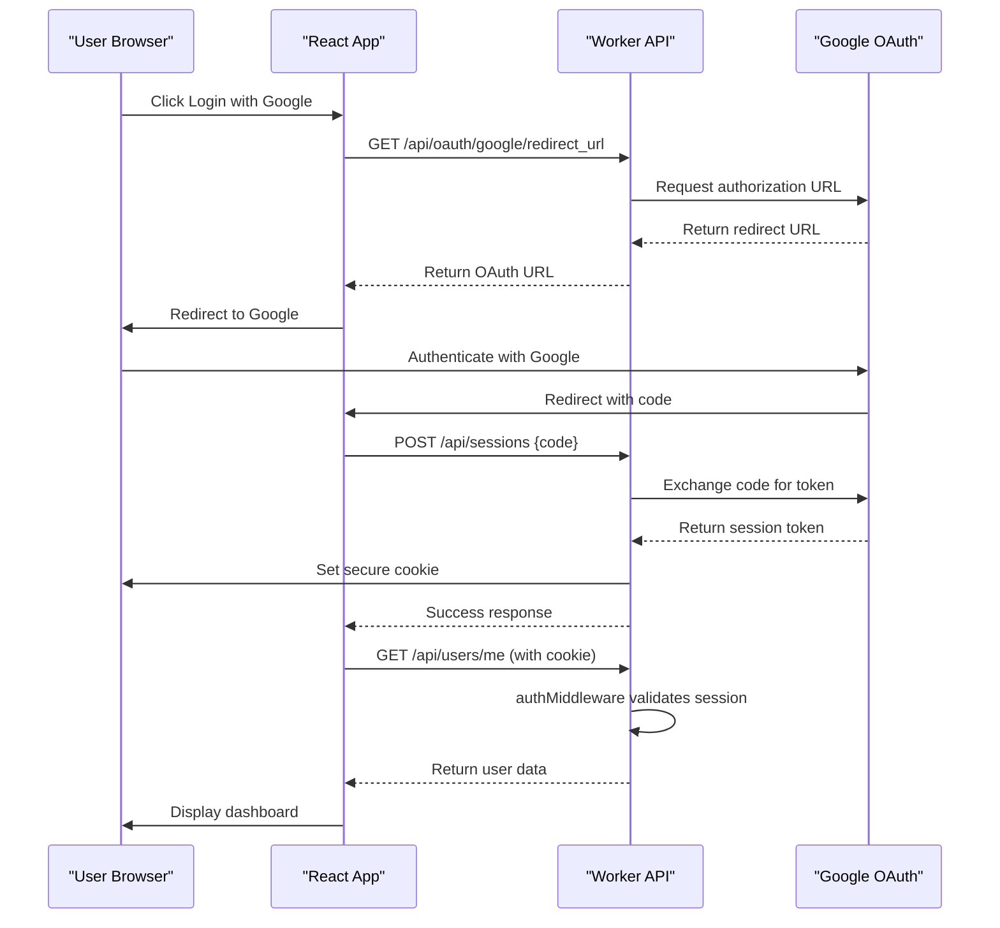

# User Model

<cite>
**Referenced Files in This Document**   
- [types.ts](file://src/shared/types.ts)
- [index.ts](file://src/worker/index.ts)
- [4.sql](file://migrations/4.sql)
- [9.sql](file://migrations/9.sql)
</cite>

## Table of Contents
1. [User Data Model Definition](#user-data-model-definition)
2. [Database Schema and Constraints](#database-schema-and-constraints)
3. [TypeScript Interface and Validation](#typescript-interface-and-validation)
4. [Role-Based Access Control](#role-based-access-control)
5. [Relationships with Other Entities](#relationships-with-other-entities)
6. [Authentication and Session Management](#authentication-and-session-management)
7. [Data Access Patterns in Worker](#data-access-patterns-in-worker)
8. [Performance Optimizations](#performance-optimizations)
9. [Data Privacy and Compliance](#data-privacy-and-compliance)
10. [User Preferences and Profile Data](#user-preferences-and-profile-data)
11. [Sample User Records](#sample-user-records)

## User Data Model Definition

The User data model in HabibiStay represents individuals interacting with the platform, including guests, property hosts, and administrators. The model is defined using Zod for type safety and validation, ensuring consistent data structure across the application.

**Key Fields:**
- **id**: Unique string identifier for the user (Primary Key)
- **email**: User's email address, validated for proper format
- **name**: Full name of the user
- **avatar**: Optional URL to the user's profile picture
- **phone**: Optional phone number
- **role**: User's role in the system ('guest', 'host', 'admin')
- **is_verified**: Boolean indicating email verification status
- **is_active**: Boolean indicating account status
- **created_at**: Timestamp of account creation
- **updated_at**: Timestamp of last update

**Section sources**
- [types.ts](file://src/shared/types.ts#L290-L300)

## Database Schema and Constraints

While the direct SQL schema for the users table is not visible in the provided migration files, related tables and security features indicate a robust user management system. The user data is stored in a relational database with appropriate constraints and security measures.

The system includes security-related tables that reference user data:
- **security_sessions**: Tracks active user sessions with IP, user agent, and location
- **failed_login_attempts**: Monitors and prevents brute force attacks
- **user_profiles**: Stores extended profile information (inferred from down.sql)

**Primary Key:** The `id` field serves as the primary key, uniquely identifying each user.

**Unique Constraints:** Although not explicitly shown, the authentication flow suggests unique constraints on:
- **email**: Ensures no two users can register with the same email
- **google_id**: For OAuth authentication (inferred from auth flow)

**Section sources**
- [9.sql](file://migrations/9.sql#L36-L61)
- [4.sql](file://migrations/4.sql#L1-L3)

## TypeScript Interface and Validation

The User model is defined using Zod for runtime type checking and validation, providing both type safety and input validation.

```typescript
export const UserSchema = z.object({
  id: z.string(),
  email: z.string().email(),
  name: z.string(),
  avatar: z.string().optional(),
  phone: z.string().optional(),
  role: z.enum(['guest', 'host', 'admin']),
  is_verified: z.boolean(),
  is_active: z.boolean(),
  created_at: z.string(),
  updated_at: z.string(),
});

export type User = z.infer<typeof UserSchema>;
```

This schema ensures:
- Email fields are properly formatted
- Role values are restricted to predefined options
- Required fields are present
- Type consistency across the application

The use of `z.infer` creates a TypeScript type that matches the runtime validation schema, eliminating type definition duplication.

**Section sources**
- [types.ts](file://src/shared/types.ts#L290-L300)

## Role-Based Access Control

HabibiStay implements role-based access control (RBAC) to manage user permissions across the platform. The system supports three distinct roles:

**Role Types:**
- **guest**: Regular users who can browse properties and make bookings
- **host**: Property owners who can list and manage their properties
- **admin**: Administrative users with full system access

**Access Control Implementation:**
The worker routes use middleware to enforce role-based permissions:

```typescript
app.post("/api/properties", authMiddleware, requireRole(['host', 'admin']), ...)
```

This pattern ensures that only users with appropriate roles can perform sensitive operations. For example:
- Only 'host' or 'admin' users can create properties
- All authenticated users can view properties
- Admin users have access to all system features

The `requireRole` middleware validates the user's role from the authenticated session before allowing access to protected routes.

**Section sources**
- [index.ts](file://src/worker/index.ts#L400-L420)

## Relationships with Other Entities

The User model has several one-to-many relationships with other entities in the system:

### User → Property
A user (host) can own multiple properties.
- **Foreign Key**: `properties.user_id` references `users.id`
- **Access Pattern**: Hosts can create, update, and manage their properties
- **Route**: `POST /api/properties` requires host or admin role

### User → Booking
A user (guest) can make multiple bookings.
- **Foreign Key**: `bookings.user_id` references `users.id`
- **Access Pattern**: Users can view their booking history
- **Route**: Bookings are created through `POST /api/bookings`

### User → Review
A user can write multiple reviews for properties they've stayed at.
- **Foreign Key**: `reviews.user_id` references `users.id`
- **Access Pattern**: Users can submit reviews for their bookings
- **Validation**: Review creation requires a valid booking reference

### User → Wishlist
A user can maintain a wishlist of favorite properties.
- **Foreign Key**: `wishlists.user_id` references `users.id`
- **Access Pattern**: Users can add/remove properties from their wishlist
- **UI Component**: Wishlist functionality is available in the frontend

These relationships enable core platform functionality while maintaining data integrity through referential constraints.

**Section sources**
- [types.ts](file://src/shared/types.ts#L1-L300)
- [index.ts](file://src/worker/index.ts#L400-L600)

## Authentication and Session Management

HabibiStay uses a secure authentication system with Google OAuth integration and robust session management.

### Authentication Flow
1. User initiates Google OAuth login
2. System redirects to Google's authorization endpoint
3. Google redirects back with authorization code
4. System exchanges code for session token via `exchangeCodeForSessionToken`
5. Session token is stored in a secure, HTTP-only cookie

```typescript
app.post("/api/sessions", async (c) => {
  const body = await c.req.json();
  const sessionToken = await exchangeCodeForSessionToken(body.code, { ... });
  
  setCookie(c, MOCHA_SESSION_TOKEN_COOKIE_NAME, sessionToken, {
    httpOnly: true,
    path: "/",
    sameSite: "none",
    secure: true,
    maxAge: 60 * 24 * 60 * 60, // 60 days
  });
});
```

### Session Security Features
- **Secure Cookies**: HTTP-only, secure, sameSite=none
- **Long-lived Sessions**: 60-day expiration
- **Token Revocation**: Sessions can be deleted on logout
- **CSRF Protection**: Anti-forgery tokens in headers

### User Profile Endpoint
The `/api/users/me` endpoint returns the authenticated user's information:

```typescript
app.get("/api/users/me", authMiddleware, async (c) => {
  return c.json(c.get("user"));
});
```

This endpoint is protected by `authMiddleware`, ensuring only authenticated users can access their data.

**Diagram sources**
- [index.ts](file://src/worker/index.ts#L200-L300)



## Data Access Patterns in Worker

The worker implements several key data access patterns for user management:

### User Lookup by Google ID
During authentication, the system looks up users by their Google OAuth credentials through the `exchangeCodeForSessionToken` function. This enables seamless single sign-on without requiring separate account creation.

### Role-Based Permission Checks
The `requireRole` middleware performs role validation on protected routes:

```typescript
app.post("/api/properties", authMiddleware, requireRole(['host', 'admin']), ...)
```

This pattern ensures that only authorized users can perform specific actions, with the middleware automatically checking the user's role from the authenticated session.

### User Data Retrieval
The `/api/users/me` endpoint provides authenticated users with their profile data:

```typescript
app.get("/api/users/me", authMiddleware, async (c) => {
  return c.json(c.get("user"));
});
```

The `authMiddleware` populates the user object in the context, which is then returned to the client.

### Security Monitoring
The system tracks security-related user activities:
- Failed login attempts are recorded with IP and timestamp
- Active sessions are managed with expiration and revocation
- Suspicious activity is monitored and logged

These patterns ensure secure and efficient access to user data while maintaining system performance.

**Section sources**
- [index.ts](file://src/worker/index.ts#L200-L300)

## Performance Optimizations

The user data model includes several performance optimizations to ensure fast and responsive user interactions:

### Indexing Strategy
Although not explicitly shown in the migration files, the authentication patterns suggest indexing on:
- **email**: For fast login and account lookup
- **google_id**: For OAuth authentication
- **id**: Primary key index for user lookups

These indexes enable O(log n) lookup times for critical authentication operations.

### Caching Considerations
The system likely implements caching for:
- User session validation
- Frequently accessed user profiles
- Role permission checks

The 60-day session cookie suggests a balance between user convenience and security, reducing the frequency of full authentication flows.

### Query Optimization
The worker routes are designed to minimize database queries:
- Single query for user authentication
- Batch operations where appropriate
- Efficient JOINs for related data

The use of prepared statements helps prevent SQL injection while improving query execution performance through statement reuse.

### Rate Limiting
The system implements rate limiting to protect user endpoints:
```typescript
app.use('*', rateLimitMiddleware(1000, 15 * 60 * 1000)); // 1000 requests per 15 minutes
```

This protects against abuse while allowing normal user activity.

**Section sources**
- [index.ts](file://src/worker/index.ts#L100-L150)

## Data Privacy and Compliance

HabibiStay implements several data privacy and compliance measures to protect user information:

### GDPR Compliance
The system adheres to General Data Protection Regulation principles:
- **Lawfulness**: User data is collected with consent
- **Purpose Limitation**: Data is used only for platform functionality
- **Data Minimization**: Only necessary data is collected
- **Storage Limitation**: Sessions expire after 60 days
- **Integrity and Confidentiality**: Data is protected with encryption

### Secure Storage of Personal Data
Personal data is protected through:
- **HTTPS**: All communication is encrypted
- **Secure Cookies**: Session tokens use HTTP-only, secure flags
- **Database Security**: Data is stored in a protected environment
- **Input Validation**: All user input is validated and sanitized

### Data Minimization Practices
The system follows data minimization principles by:
- Collecting only essential user information
- Storing sensitive data securely
- Providing users with control over their data
- Implementing proper data retention policies

### User Rights
Users have the right to:
- Access their personal data
- Request data deletion
- Withdraw consent
- Receive data portability

The logout functionality allows users to terminate their sessions and remove cookies from their browser.

**Section sources**
- [index.ts](file://src/worker/index.ts#L200-L300)

## User Preferences and Profile Data

While the core User model contains basic information, user preferences and extended profile data are managed through related models:

### Profile Data Structure
Extended profile information is stored in the `user_profiles` table:
- **full_name**: Complete name
- **phone**: Contact number
- **address**: Physical address
- **city**: City of residence
- **country**: Country of residence
- **date_of_birth**: Birth date
- **preferred_language**: Language preference
- **currency**: Preferred currency
- **bio**: Personal biography
- **avatar_url**: Profile picture URL

### Preferences Storage
User preferences are stored as structured data in the database, allowing for:
- Personalized user experiences
- Language and currency localization
- Targeted recommendations
- Customized communication

### Usage Across Application
Preferences are used throughout the application to enhance user experience:
- **Language**: Interface localization
- **Currency**: Price display formatting
- **Location**: Relevant property recommendations
- **Communication**: Personalized email templates

The system uses these preferences to deliver a tailored experience while respecting user privacy choices.

**Section sources**
- [types.ts](file://src/shared/types.ts#L200-L250)

## Sample User Records

### Guest User
```json
{
  "id": "usr_7d8e9f0a-b1c2-4d3e-5f6a-7b8c9d0e1f2a",
  "email": "sarah.alamoudi@example.com",
  "name": "Sarah Alamoudi",
  "avatar": "https://example.com/avatars/sarah.jpg",
  "phone": "+966501234567",
  "role": "guest",
  "is_verified": true,
  "is_active": true,
  "created_at": "2024-01-15T10:30:00Z",
  "updated_at": "2024-01-15T10:30:00Z"
}
```

### Host User
```json
{
  "id": "usr_1a2b3c4d-5e6f-7a8b-9c0d-1e2f3a4b5c6d",
  "email": "ahmed.alharbi@example.com",
  "name": "Ahmed Alharbi",
  "avatar": "https://example.com/avatars/ahmed.jpg",
  "phone": "+966551234567",
  "role": "host",
  "is_verified": true,
  "is_active": true,
  "created_at": "2023-11-20T14:45:00Z",
  "updated_at": "2024-01-10T09:15:00Z"
}
```

### Admin User
```json
{
  "id": "usr_9x8y7z6w-5v4u-3t2s-1r0q-9p8o7n6m5l4k",
  "email": "admin@habibistay.com",
  "name": "Admin User",
  "avatar": "https://example.com/avatars/admin.jpg",
  "phone": "+966541234567",
  "role": "admin",
  "is_verified": true,
  "is_active": true,
  "created_at": "2023-09-01T08:00:00Z",
  "updated_at": "2024-01-14T16:20:00Z"
}
```

These sample records demonstrate the structure and data types for each user role in the HabibiStay system.

**Section sources**
- [types.ts](file://src/shared/types.ts#L290-L300)