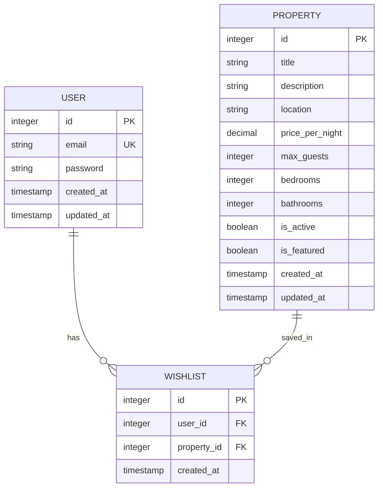

# Wishlist Model

<cite>
**Referenced Files in This Document**   
- [Wishlist.tsx](file://src/react-app/pages/Wishlist.tsx)
- [index.ts](file://src/worker/index.ts)
- [5.sql](file://migrations/5.sql)
</cite>

## Table of Contents
1. [Introduction](#introduction)
2. [Data Model Definition](#data-model-definition)
3. [Schema Diagram](#schema-diagram)
4. [TypeScript Interface](#typescript-interface)
5. [Sample Data](#sample-data)
6. [Data Access Patterns](#data-access-patterns)
7. [Performance Optimizations](#performance-optimizations)
8. [Business Logic](#business-logic)
9. [Usage in Personalization and Analytics](#usage-in-personalization-and-analytics)

## Introduction
The Wishlist model in HabibiStay enables users to save properties they are interested in for future reference or booking. This document provides a comprehensive overview of the wishlist data model, including its structure, relationships, access patterns, and business logic. The model supports key user experience features such as property discovery, comparison, and personalization.

**Section sources**
- [Wishlist.tsx](file://src/react-app/pages/Wishlist.tsx#L1-L296)
- [index.ts](file://src/worker/index.ts#L1-L2443)

## Data Model Definition
The Wishlist table stores user preferences for properties, establishing a many-to-many relationship between users and properties through a dedicated junction table.

### Fields
- **id**: Unique identifier for the wishlist entry (Primary Key)
- **user_id**: Reference to the User who saved the property (Foreign Key)
- **property_id**: Reference to the Property being saved (Foreign Key)
- **created_at**: Timestamp when the property was added to the wishlist

### Constraints
- **Primary Key**: `id` ensures each wishlist entry is uniquely identifiable
- **Foreign Keys**: 
  - `user_id` references `users.id` with cascade delete behavior
  - `property_id` references `properties.id` with cascade delete behavior
- **Unique Constraint**: Composite constraint on `user_id` and `property_id` combination to prevent duplicate entries

### Relationships
- **User (One-to-Many)**: A user can have multiple wishlist entries
- **Property (One-to-Many)**: A property can be saved by multiple users

```sql
CREATE TABLE wishlist (
  id INTEGER PRIMARY KEY AUTOINCREMENT,
  user_id INTEGER NOT NULL,
  property_id INTEGER NOT NULL,
  created_at DATETIME DEFAULT CURRENT_TIMESTAMP,
  FOREIGN KEY (user_id) REFERENCES users (id) ON DELETE CASCADE,
  FOREIGN KEY (property_id) REFERENCES properties (id) ON DELETE CASCADE,
  UNIQUE (user_id, property_id)
);
```

**Section sources**
- [5.sql](file://migrations/5.sql#L1-L15)

## Schema Diagram


**Diagram sources**
- [5.sql](file://migrations/5.sql#L1-L15)

## TypeScript Interface
The frontend application defines a TypeScript interface that represents the structure of wishlist data including the associated property details.

```typescript
interface WishlistItem {
  id: number;
  property_id: number;
  created_at: string;
  property: Property;
}
```

The `WishlistItem` interface extends the basic wishlist entry with the full `Property` object, enabling the frontend to display comprehensive property information without additional API calls.

**Section sources**
- [Wishlist.tsx](file://src/react-app/pages/Wishlist.tsx#L5-L10)

## Sample Data
```json
{
  "id": 123,
  "user_id": 456,
  "property_id": 789,
  "created_at": "2025-01-15T10:30:00Z",
  "property": {
    "id": 789,
    "title": "Luxury Villa in Al Olaya",
    "description": "Spacious villa with private pool and modern amenities in central Riyadh.",
    "location": "Al Olaya, Riyadh",
    "price_per_night": 850,
    "max_guests": 8,
    "bedrooms": 4,
    "bathrooms": 3,
    "images": "[\"https://example.com/image1.jpg\", \"https://example.com/image2.jpg\"]",
    "amenities": "[\"Pool\", \"WiFi\", \"Air Conditioning\", \"Parking\"]",
    "is_featured": true,
    "is_active": true
  }
}
```

## Data Access Patterns
The worker implementation provides RESTful endpoints for managing wishlist data, supporting common user interactions.

### API Endpoints
- **GET /api/wishlist**: Retrieve all wishlist entries for the authenticated user
- **POST /api/wishlist/:propertyId**: Add a property to the user's wishlist
- **DELETE /api/wishlist/:propertyId**: Remove a property from the user's wishlist

### Worker Implementation
The worker handles wishlist operations through database interactions that maintain data integrity and enforce business rules.

```typescript
// Retrieve user's wishlist with property details
app.get("/api/wishlist", authMiddleware, async (c) => {
  const user = c.get("user");
  if (!user) {
    return c.json<ApiResponse>({ success: false, error: "User not authenticated" }, 401);
  }

  const { results } = await c.env.DB.prepare(`
    SELECT w.*, p.* as property 
    FROM wishlist w
    LEFT JOIN properties p ON w.property_id = p.id
    WHERE w.user_id = ?
    ORDER BY w.created_at DESC
  `).bind(user.id).all();

  return c.json<ApiResponse<WishlistItem[]>>({ success: true, data: results as WishlistItem[] });
});

// Add property to wishlist
app.post("/api/wishlist/:propertyId", authMiddleware, async (c) => {
  const user = c.get("user");
  const propertyId = c.req.param("propertyId");

  if (!user) {
    return c.json<ApiResponse>({ success: false, error: "User not authenticated" }, 401);
  }

  // Check if user owns the property
  const property = await c.env.DB.prepare(
    "SELECT user_id FROM properties WHERE id = ?"
  ).bind(propertyId).first();

  if (property && (property as any).user_id === user.id) {
    return c.json<ApiResponse>({ 
      success: false, 
      error: "You cannot wishlist your own property" 
    }, 400);
  }

  const { success } = await c.env.DB.prepare(`
    INSERT INTO wishlist (user_id, property_id)
    VALUES (?, ?)
  `).bind(user.id, propertyId).run();

  return c.json<ApiResponse>({ 
    success, 
    message: success ? "Property added to wishlist" : "Failed to add to wishlist" 
  });
});

// Remove property from wishlist
app.delete("/api/wishlist/:propertyId", authMiddleware, async (c) => {
  const user = c.get("user");
  const propertyId = c.req.param("propertyId");

  if (!user) {
    return c.json<ApiResponse>({ success: false, error: "User not authenticated" }, 401);
  }

  const { success } = await c.env.DB.prepare(`
    DELETE FROM wishlist 
    WHERE user_id = ? AND property_id = ?
  `).bind(user.id, propertyId).run();

  return c.json<ApiResponse>({ 
    success, 
    message: success ? "Property removed from wishlist" : "Property not found in wishlist" 
  });
});
```

**Section sources**
- [index.ts](file://src/worker/index.ts#L1-L2443)

## Performance Optimizations
The wishlist model incorporates several performance optimizations to ensure responsive user experiences, especially as the dataset grows.

### Indexing Strategy
- **Single Index on user_id**: Enables fast retrieval of all wishlist entries for a specific user
- **Composite Index for Unique Constraint**: The UNIQUE constraint on (user_id, property_id) automatically creates a composite index that optimizes both uniqueness checks and queries filtering by both fields

### Query Optimization
- **JOIN with Properties Table**: The GET endpoint performs a LEFT JOIN with the properties table to retrieve complete property information in a single query, reducing the need for additional API calls
- **Ordered Results**: Results are ordered by created_at in descending order to display the most recently saved properties first, aligning with user expectations

## Business Logic
The wishlist implementation includes several business rules that enhance the user experience and maintain data quality.

### Ownership Prevention
Users are prevented from adding their own properties to their wishlist, as this would not provide meaningful functionality and could clutter the interface.

```typescript
// Check if user owns the property before adding to wishlist
if (property && (property as any).user_id === user.id) {
  return c.json<ApiResponse>({ 
    success: false, 
    error: "You cannot wishlist your own property" 
  }, 400);
}
```

### Duplicate Prevention
The unique constraint on the (user_id, property_id) combination ensures that users cannot add the same property to their wishlist multiple times, preventing data redundancy and UI confusion.

## Usage in Personalization and Analytics
Wishlist data serves as a valuable signal for personalization features and business analytics.

### Personalization Features
- **Recommendation Engine**: Wishlist data contributes to user preference profiling, helping the AI assistant recommend similar properties
- **Targeted Marketing**: Users who save certain types of properties can receive personalized email campaigns featuring similar listings
- **Search Ranking**: Properties that are frequently saved may be prioritized in search results for similar queries

### Analytics
- **Popularity Metrics**: The number of times a property appears in wishlists serves as a measure of its appeal to potential guests
- **User Behavior Analysis**: Wishlist patterns help understand user preferences, search behavior, and decision-making timelines
- **Conversion Funnel Analysis**: Tracking the journey from wishlist addition to booking completion provides insights into the effectiveness of property listings and pricing strategies

**Section sources**
- [index.ts](file://src/worker/index.ts#L1-L2443)
- [Wishlist.tsx](file://src/react-app/pages/Wishlist.tsx#L1-L296)