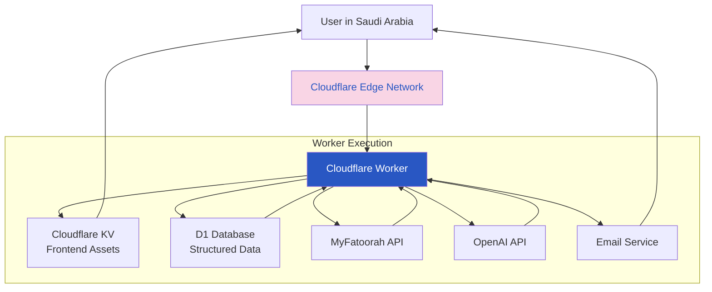
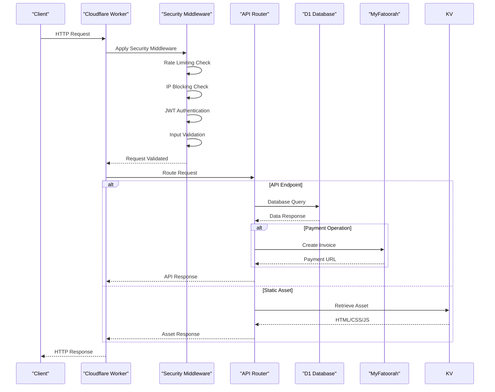
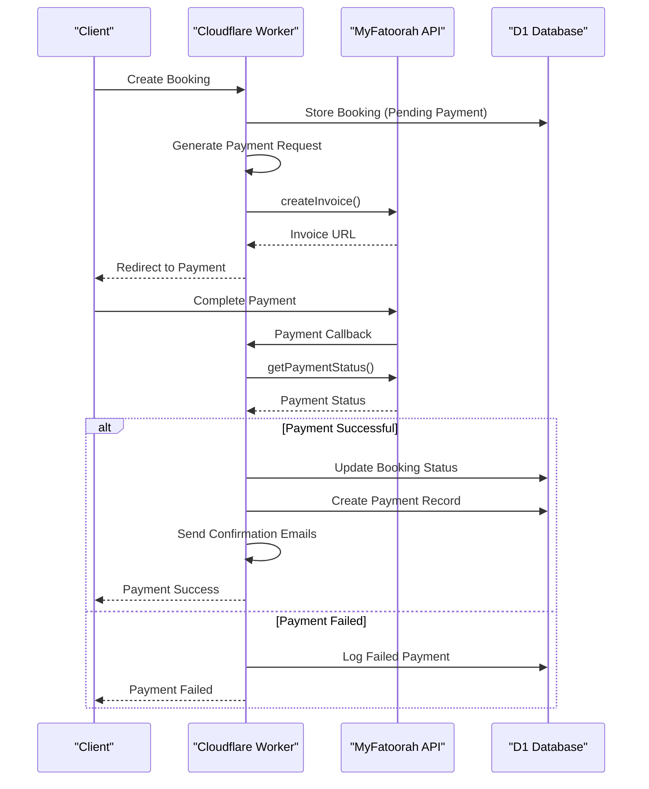
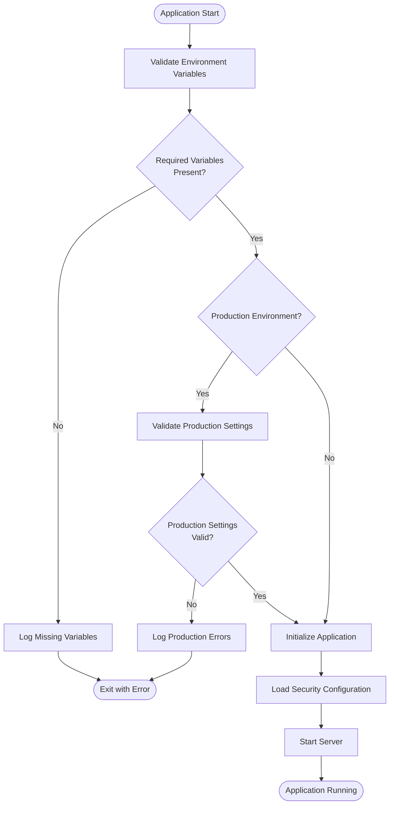
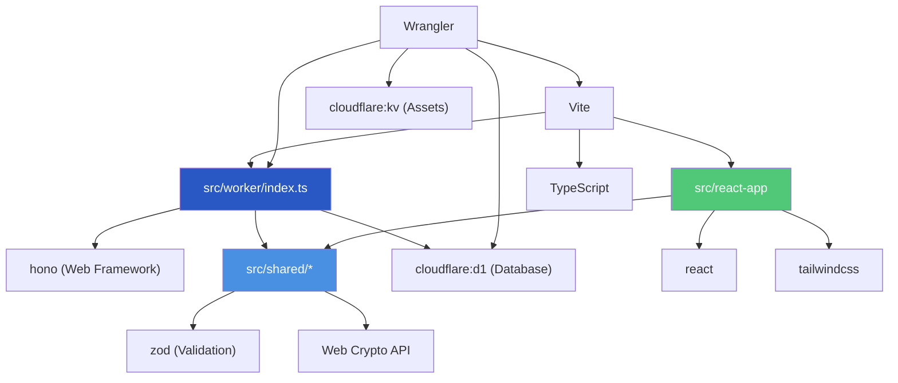
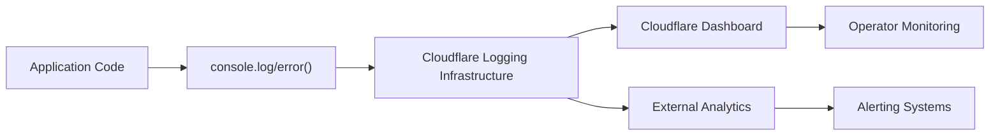

# Serverless Deployment Architecture

<cite>
**Referenced Files in This Document**   
- [src/worker/index.ts](file://src/worker/index.ts)
- [src/shared/security-middleware.ts](file://src/shared/security-middleware.ts)
- [src/shared/security-utils.ts](file://src/shared/security-utils.ts)
- [src/shared/security-config.ts](file://src/shared/security-config.ts)
- [src/shared/payment.ts](file://src/shared/payment.ts)
- [src/shared/email.ts](file://src/shared/email.ts)
- [src/shared/types.ts](file://src/shared/types.ts)
- [vite.config.ts](file://vite.config.ts)
- [tsconfig.worker.json](file://tsconfig.worker.json)
- [wrangler.jsonc](file://wrangler.jsonc)
</cite>

## Table of Contents
1. [Introduction](#introduction)
2. [Project Structure](#project-structure)
3. [Core Components](#core-components)
4. [Architecture Overview](#architecture-overview)
5. [Detailed Component Analysis](#detailed-component-analysis)
6. [Dependency Analysis](#dependency-analysis)
7. [Performance Considerations](#performance-considerations)
8. [Troubleshooting Guide](#troubleshooting-guide)
9. [Conclusion](#conclusion)

## Introduction
This document provides comprehensive architectural documentation for the Cloudflare Workers deployment model used in HabibiStay, a serverless application serving users primarily in Saudi Arabia. The architecture leverages Cloudflare's global edge network to deliver low-latency responses, combining frontend asset serving with backend API logic within a single worker. The system integrates payment processing via MyFatoorah, AI capabilities through OpenAI, and secure database operations using D1. This documentation details the serverless execution environment, compilation process, security measures, and operational characteristics that enable HabibiStay's scalable and secure operation.

## Project Structure
The HabibiStay repository follows a modular structure with clear separation between frontend, shared utilities, and serverless worker components. The architecture is organized into three main directories: `react-app` for frontend components, `shared` for cross-cutting concerns, and `worker` for serverless logic. Configuration files for Vite, TypeScript, and Wrangler define the build and deployment pipeline.

```mermaid
graph TB
subgraph "Frontend"
ReactApp[src/react-app]
Components[components/]
Pages[pages/]
App[App.tsx]
end
subgraph "Shared"
Shared[src/shared]
Types[types.ts]
Payment[payment.ts]
Email[email.ts]
Security[security-middleware.ts]
end
subgraph "Backend"
Worker[src/worker]
Index[index.ts]
end
subgraph "Configuration"
Vite[vite.config.ts]
TsWorker[tsconfig.worker.json]
Wrangler[wrangler.jsonc]
end
ReactApp --> Shared
Worker --> Shared
Vite --> Worker
TsWorker --> Worker
Wrangler --> Worker
```

**Diagram sources**
- [src/worker/index.ts](file://src/worker/index.ts)
- [src/shared/types.ts](file://src/shared/types.ts)
- [vite.config.ts](file://vite.config.ts)

**Section sources**
- [src/worker/index.ts](file://src/worker/index.ts)
- [src/shared/types.ts](file://src/shared/types.ts)
- [vite.config.ts](file://vite.config.ts)

## Core Components
The HabibiStay architecture centers around several core components that work together to deliver a seamless serverless experience. The Cloudflare Worker serves as the unified entry point, handling both API requests and static asset delivery. The system uses Hono as the web framework for routing, with middleware for authentication, rate limiting, and security. Shared TypeScript files define data structures and business logic used across both frontend and backend. The architecture integrates payment processing through MyFatoorah, AI capabilities via OpenAI, and email services for user communication. Environment variables and secrets are securely managed through Cloudflare's environment configuration system.

**Section sources**
- [src/worker/index.ts](file://src/worker/index.ts)
- [src/shared/types.ts](file://src/shared/types.ts)
- [src/shared/payment.ts](file://src/shared/payment.ts)

## Architecture Overview
HabibiStay employs a serverless architecture built on Cloudflare Workers, leveraging the edge computing network to deliver content with minimal latency to users in Saudi Arabia. The architecture combines frontend asset serving with backend API logic in a single worker bundle, reducing complexity and improving performance. The worker handles all HTTP requests, serving static assets from Cloudflare's global network while executing API routes for booking, payment, and user management operations.



**Diagram sources**
- [src/worker/index.ts](file://src/worker/index.ts)
- [wrangler.jsonc](file://wrangler.jsonc)
- [src/shared/payment.ts](file://src/shared/payment.ts)

## Detailed Component Analysis

### Cloudflare Worker Implementation
The Cloudflare Worker implementation serves as the central component of HabibiStay's architecture, handling all incoming requests and orchestrating the application's functionality. The worker uses the Hono framework for routing and middleware management, with a comprehensive security layer that includes authentication, rate limiting, and input validation.

#### Worker Request Flow


**Diagram sources**
- [src/worker/index.ts](file://src/worker/index.ts#L1-L2443)
- [src/shared/security-middleware.ts](file://src/shared/security-middleware.ts#L1-L385)

**Section sources**
- [src/worker/index.ts](file://src/worker/index.ts#L1-L2443)
- [src/shared/security-middleware.ts](file://src/shared/security-middleware.ts#L1-L385)

### Security Middleware System
The security middleware system provides comprehensive protection for the HabibiStay application, implementing multiple layers of defense against common web vulnerabilities. The system includes rate limiting, IP blocking, JWT authentication, CSRF protection, and input validation, all implemented as reusable middleware functions.

#### Security Middleware Architecture
```mermaid
classDiagram
class MiddlewareHandler {
<<interface>>
+handle(request, next) : Promise~void~
}
class SecurityMiddleware {
+rateLimitMiddleware(maxRequests, windowMs)
+ipBlockingMiddleware()
+authMiddleware()
+requireRole(requiredRoles)
+csrfMiddleware()
+inputValidationMiddleware()
+requestLoggingMiddleware()
+suspiciousActivityMiddleware()
+sqlInjectionMiddleware()
}
class RateLimiter {
-requests : Map~string, {count : number, resetTime : number}~
+isAllowed(identifier : string) : boolean
+cleanup() : void
}
class IPSecurity {
-blockedIPs : Set~string~
-suspiciousActivity : Map~string, {count : number, lastAttempt : number}~
+blockIP(ip : string) : void
+isBlocked(ip : string) : boolean
+recordSuspiciousActivity(ip : string) : boolean
}
class CSRFProtection {
-tokens : Map~string, {token : string, expiry : number}~
+generateToken(sessionId : string) : string
+validateToken(sessionId : string, token : string) : boolean
+cleanup() : void
}
class AuditLogger {
-logs : AuditLog[]
+log(log : AuditLog) : void
+getUserActivity(userId : string, limit : number) : AuditLog[]
+getFailedAttempts(ip : string, timeWindow : number) : AuditLog[]
}
MiddlewareHandler <|-- SecurityMiddleware
SecurityMiddleware --> RateLimiter : "uses"
SecurityMiddleware --> IPSecurity : "uses"
SecurityMiddleware --> CSRFProtection : "uses"
SecurityMiddleware --> AuditLogger : "uses"
```

**Diagram sources**
- [src/shared/security-middleware.ts](file://src/shared/security-middleware.ts#L1-L385)
- [src/shared/security-utils.ts](file://src/shared/security-utils.ts#L1-L385)

**Section sources**
- [src/shared/security-middleware.ts](file://src/shared/security-middleware.ts#L1-L385)
- [src/shared/security-utils.ts](file://src/shared/security-utils.ts#L1-L385)

### Payment Processing System
The payment processing system integrates with MyFatoorah to handle financial transactions for property bookings. The system creates payment invoices, processes callbacks, and manages payment status, all within the serverless worker environment. The implementation follows PCI DSS compliance requirements by avoiding direct handling of sensitive card data.

#### Payment Processing Flow


**Diagram sources**
- [src/shared/payment.ts](file://src/shared/payment.ts#L1-L165)
- [src/worker/index.ts](file://src/worker/index.ts#L1-L2443)

**Section sources**
- [src/shared/payment.ts](file://src/shared/payment.ts#L1-L165)
- [src/worker/index.ts](file://src/worker/index.ts#L1-L2443)

### Environment Configuration System
The environment configuration system manages secrets and settings for the HabibiStay application, ensuring secure access to external services and databases. The system validates required environment variables at startup and provides default values for non-production environments.

#### Environment Configuration Flow


**Diagram sources**
- [src/shared/security-config.ts](file://src/shared/security-config.ts#L1-L336)
- [wrangler.jsonc](file://wrangler.jsonc#L1-L21)

**Section sources**
- [src/shared/security-config.ts](file://src/shared/security-config.ts#L1-L336)
- [wrangler.jsonc](file://wrangler.jsonc#L1-L21)

## Dependency Analysis
The HabibiStay architecture has a well-defined dependency structure that enables code reuse while maintaining separation of concerns. The worker depends on shared utility modules for security, payment processing, and data validation, while the frontend components also utilize these shared modules for consistent behavior.



**Diagram sources**
- [src/worker/index.ts](file://src/worker/index.ts)
- [src/shared/types.ts](file://src/shared/types.ts)
- [vite.config.ts](file://vite.config.ts)
- [wrangler.jsonc](file://wrangler.jsonc)

**Section sources**
- [src/worker/index.ts](file://src/worker/index.ts)
- [src/shared/types.ts](file://src/shared/types.ts)
- [vite.config.ts](file://vite.config.ts)
- [wrangler.jsonc](file://wrangler.jsonc)

## Performance Considerations

### Serverless Execution Environment
HabibiStay leverages Cloudflare Workers' serverless execution environment, which provides several performance benefits for users in Saudi Arabia. The edge computing model ensures that requests are processed at the nearest Cloudflare data center, minimizing latency. The worker runs in a lightweight V8 isolate, enabling fast cold starts compared to traditional container-based serverless platforms.

The architecture is stateless by design, with all persistent data stored in D1 (Cloudflare's SQLite database) or KV (key-value storage for assets). This statelessness ensures consistent behavior across requests and enables seamless scaling to handle traffic spikes. However, developers must be mindful of the CPU and memory constraints of the worker environment, optimizing code for efficiency.

### Cold Start Behavior
Cloudflare Workers exhibit minimal cold start times due to their V8 isolate architecture. When a worker is invoked after a period of inactivity, the isolate can be spun up in milliseconds, significantly faster than traditional serverless platforms that require container initialization. This fast cold start behavior is particularly beneficial for HabibiStay, as it ensures responsive performance even during periods of low traffic.

The Vite compilation process, configured in `vite.config.ts`, optimizes the worker bundle for fast startup by minimizing bundle size and leveraging Cloudflare's native support for ES modules. The `tsconfig.worker.json` configuration ensures type safety while targeting the Cloudflare Workers environment.

### Latency Optimization for Saudi Arabia
The global distribution model of Cloudflare Workers provides significant latency advantages for users in Saudi Arabia. With multiple Cloudflare data centers in the Middle East region, including locations in Dubai and Istanbul, users experience sub-100ms response times for API requests and static asset delivery.

The worker's ability to serve both frontend assets and API responses from the edge eliminates the need for round-trips to a centralized origin server, further reducing latency. For database operations, D1's distributed architecture ensures that data is replicated across multiple regions, with read operations served from the nearest location.

### Scalability and Resource Constraints
Cloudflare Workers automatically scale to handle incoming traffic, with no configuration required from the developer. Each worker can handle thousands of requests per second across the global network. However, there are CPU and memory limits per request that developers must consider:

- **CPU Time**: Workers have a maximum execution time of 50ms for free tier and up to 5 seconds for paid plans
- **Memory**: Workers have access to up to 128MB of memory
- **Outbound Requests**: Workers can make HTTP requests to external services, but these are subject to rate limits

To optimize worker execution, HabibiStay follows best practices such as:
- Minimizing synchronous operations
- Using efficient data structures
- Caching frequently accessed data in KV
- Implementing proper error handling to avoid unnecessary retries
- Using streaming responses for large payloads

### Local Development and Preview
The local development workflow for HabibiStay is streamlined using Wrangler's development server. Developers can run `wrangler dev` to start a local server that simulates the Cloudflare Workers environment, including access to bound services like D1 and KV. This allows for rapid iteration and testing without deploying to the cloud.

Preview deployments are automatically created for pull requests, providing a live URL where stakeholders can test changes before merging. The Vite configuration in `vite.config.ts` enables hot module replacement for frontend changes, while the worker reloads automatically when source files are modified.

**Section sources**
- [vite.config.ts](file://vite.config.ts)
- [tsconfig.worker.json](file://tsconfig.worker.json)
- [wrangler.jsonc](file://wrangler.jsonc)

## Troubleshooting Guide

### Common Issues and Solutions
When developing or operating HabibiStay, several common issues may arise. Understanding these issues and their solutions is critical for maintaining system reliability.

**Environment Variable Issues**
- **Symptom**: Application fails to start with "Missing required environment variable" errors
- **Solution**: Ensure all required environment variables (JWT_SECRET, OPENAI_API_KEY, MYFATOORAH_API_KEY, DATABASE_URL) are configured in wrangler.jsonc or through the Cloudflare dashboard

**Payment Integration Problems**
- **Symptom**: Payment redirects fail or return errors
- **Solution**: Verify MyFatoorah API credentials and ensure the callback URLs are correctly configured in the MyFatoorah dashboard

**Database Connection Errors**
- **Symptom**: Database queries fail with connection timeouts
- **Solution**: Check D1 database binding configuration in wrangler.jsonc and verify database ID and name match the deployed database

**Security Middleware Conflicts**
- **Symptom**: Valid requests are blocked by rate limiting or IP blocking
- **Solution**: Review security middleware configuration and adjust thresholds as needed for development environments

### Logging and Monitoring
HabibiStay uses console statements for logging, which are captured by Cloudflare Analytics and can be viewed in the Cloudflare dashboard. The security middleware includes comprehensive audit logging that records key events such as authentication attempts, rate limit violations, and suspicious activity.

The audit logger in `src/shared/security-utils.ts` maintains an in-memory log of security events, which is written to the console for collection by Cloudflare's logging infrastructure. This enables operators to monitor system activity and investigate security incidents.



**Diagram sources**
- [src/shared/security-utils.ts](file://src/shared/security-utils.ts#L300-L385)
- [src/worker/index.ts](file://src/worker/index.ts)

**Section sources**
- [src/shared/security-utils.ts](file://src/shared/security-utils.ts#L300-L385)
- [src/worker/index.ts](file://src/worker/index.ts)

## Conclusion
HabibiStay's serverless architecture on Cloudflare Workers provides a robust, scalable, and secure foundation for serving users in Saudi Arabia. By combining frontend asset serving with backend API logic in a single worker, the architecture minimizes latency and simplifies deployment. The comprehensive security middleware system protects against common web vulnerabilities, while the integration with MyFatoorah and OpenAI enables rich functionality for payments and AI assistance.

The use of Vite for compilation and Wrangler for deployment creates a streamlined development workflow, with local testing and preview deployments enabling rapid iteration. The global distribution of Cloudflare's edge network ensures low-latency responses for users across Saudi Arabia, while the stateless, serverless nature of the architecture enables automatic scaling to handle traffic spikes.

Key strengths of the architecture include:
- Minimal cold start times due to V8 isolates
- Low latency for Middle East users through edge computing
- Comprehensive security measures including rate limiting, IP blocking, and input validation
- Efficient resource utilization within worker constraints
- Seamless integration of frontend and backend in a unified deployment

This architecture positions HabibiStay for success in the Saudi Arabian market, providing a responsive, secure, and scalable platform for property bookings and management.