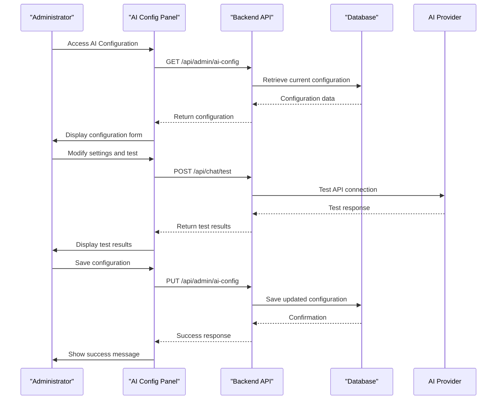
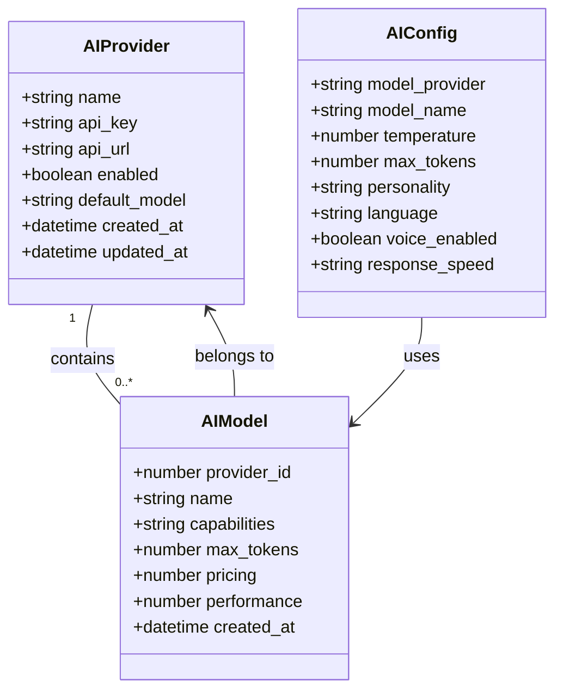
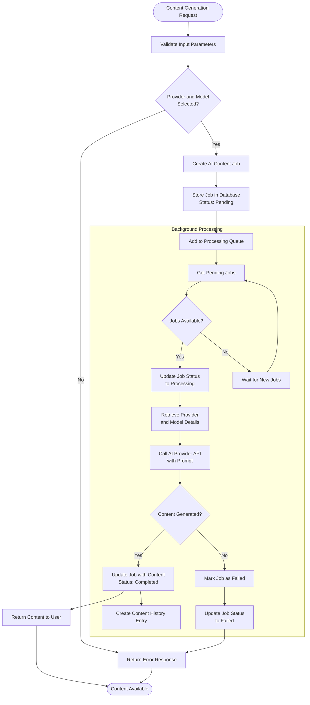
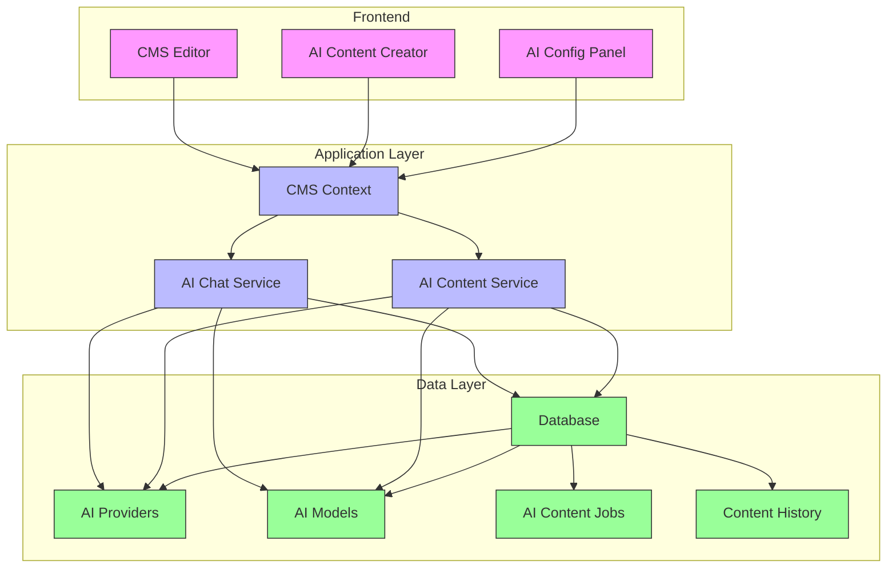

# CMS AI Content Generation

<cite>
**Referenced Files in This Document**   
- [AIConfigPanel.tsx](file://src/react-app/components/admin/AIConfigPanel.tsx)
- [AIContentCreator.tsx](file://src/react-app/components/cms/AIContentCreator.tsx)
- [ai-content-service.ts](file://src/shared/ai-content-service.ts)
- [ai-chat-service.ts](file://src/shared/ai-chat-service.ts)
- [types.ts](file://src/shared/types.ts)
- [CMSContext.tsx](file://src/react-app/contexts/CMSContext.tsx)
</cite>

## Table of Contents
1. [Introduction](#introduction)
2. [AI Provider Configuration](#ai-provider-configuration)
3. [Model Selection](#model-selection)
4. [Content Generation Workflow](#content-generation-workflow)
5. [Practical Examples](#practical-examples)
6. [Troubleshooting Guide](#troubleshooting-guide)
7. [Architecture Overview](#architecture-overview)

## Introduction
The CMS AI Content Generation system enables administrators and content creators to leverage artificial intelligence for generating high-quality content through an intuitive interface. This documentation covers the complete workflow from AI provider configuration to content generation, including practical examples and troubleshooting guidance for users working through the CMS admin interface.

The system supports multiple AI providers including OpenAI, Anthropic, and Google Gemini, with configurable models, response settings, and personality profiles. Content generation is handled through a job-based system that processes requests asynchronously, ensuring optimal performance and reliability.

**Section sources**
- [AIConfigPanel.tsx](file://src/react-app/components/admin/AIConfigPanel.tsx)
- [AIContentCreator.tsx](file://src/react-app/components/cms/AIContentCreator.tsx)

## AI Provider Configuration

The AI provider configuration interface allows administrators to set up and manage AI services used for content generation and chat functionality. The configuration panel provides comprehensive controls for selecting providers, setting API credentials, and defining system behavior.

Key configuration options include:
- **Model Provider**: Selection between OpenAI, Anthropic, and Google Gemini
- **API Key Management**: Secure storage of provider API keys
- **System Prompts**: Customizable instructions that define the AI's behavior and personality
- **Content Moderation**: Built-in safeguards to prevent inappropriate content generation
- **Rate Limiting**: Controls to manage API usage and prevent abuse

The configuration is stored in the database and retrieved by the AI services when processing requests. Administrators can test their configuration before saving to ensure connectivity and proper functionality.

**Diagram sources**
- [AIConfigPanel.tsx](file://src/react-app/components/admin/AIConfigPanel.tsx#L100-L200)
- [ai-chat-service.ts](file://src/shared/ai-chat-service.ts#L300-L400)

**Section sources**
- [AIConfigPanel.tsx](file://src/react-app/components/admin/AIConfigPanel.tsx)
- [ai-chat-service.ts](file://src/shared/ai-chat-service.ts)

## Model Selection

The system supports multiple AI models from different providers, allowing administrators to choose the optimal model based on performance requirements, cost considerations, and specific use cases. Model selection is available both in the administrative configuration panel and during content creation.

### Available Providers and Models

**OpenAI Models:**
- GPT-4o (Latest): Most capable model with vision capabilities
- GPT-4o Mini: Fast and cost-effective option
- GPT-4 Turbo: High-performance model
- GPT-3.5 Turbo: Fast and affordable option

**Anthropic Models:**
- Claude 3.5 Sonnet: Latest and most capable
- Claude 3 Opus: Most powerful model
- Claude 3 Haiku: Fastest response times

**Google Gemini Models:**
- Gemini 1.5 Pro: Most advanced capabilities
- Gemini 1.5 Flash: Fast and efficient
- Gemini Pro: Balanced performance

The model selection interface dynamically updates based on the chosen provider, ensuring only compatible models are available for selection. Each model includes a description to help users understand its capabilities and appropriate use cases.

**Diagram sources**
- [types.ts](file://src/shared/types.ts#L600-L650)
- [AIConfigPanel.tsx](file://src/react-app/components/admin/AIConfigPanel.tsx#L50-L100)

**Section sources**
- [AIConfigPanel.tsx](file://src/react-app/components/admin/AIConfigPanel.tsx)
- [types.ts](file://src/shared/types.ts)

## Content Generation Workflow

The AI content generation workflow consists of several stages, from initial request to final content delivery. The system uses a job-based architecture to handle content generation asynchronously, ensuring responsive user experience and reliable processing.

### Workflow Stages

1. **Request Initiation**: User submits a content generation request with a prompt and model selection
2. **Job Creation**: System creates an AI content job in the database with status "pending"
3. **Job Processing**: Background service processes pending jobs in order
4. **Content Generation**: Selected AI provider generates content based on the prompt
5. **Content Storage**: Generated content is stored in the database with version history
6. **Delivery**: Content is delivered to the user interface for review and insertion

The workflow supports both immediate generation for simple requests and queued processing for complex tasks, ensuring optimal resource utilization.

**Diagram sources**
- [ai-content-service.ts](file://src/shared/ai-content-service.ts#L80-L160)
- [AIContentCreator.tsx](file://src/react-app/components/cms/AIContentCreator.tsx#L30-L80)

**Section sources**
- [ai-content-service.ts](file://src/shared/ai-content-service.ts)
- [AIContentCreator.tsx](file://src/react-app/components/cms/AIContentCreator.tsx)

## Practical Examples

This section provides practical examples of using the AI content generation system through the CMS admin interface.

### Example 1: Creating Property Descriptions

To generate a property description:

1. Navigate to the CMS content editor
2. Click the "AI Content Creator" button
3. Select "OpenAI" as the provider
4. Choose "GPT-4o Mini" as the model
5. Enter a prompt such as: "Create a compelling description for a luxury villa in Riyadh with pool, modern amenities, and city views. Focus on comfort, luxury, and convenience. Use a professional tone."
6. Click "Generate Content"
7. Review the generated content and click "Insert Content" to add it to your page

### Example 2: Generating Blog Content

For blog content generation:

1. Open the AI Content Creator panel
2. Select "Anthropic" as the provider
3. Choose "Claude 3.5 Sonnet" as the model
4. Enter a detailed prompt: "Write a 300-word blog post about the best family vacation destinations in Saudi Arabia. Include cultural experiences, outdoor activities, and family-friendly accommodations. Use a friendly and engaging tone."
5. Adjust temperature to 0.8 for more creative responses
6. Generate and review the content
7. Use the "Save to History" option to keep a copy for future reference

### Example 3: Configuring AI Assistant Personality

To configure the AI assistant personality:

1. Navigate to the AI Configuration panel
2. Select "professional" personality for formal customer service
3. Customize the system prompt to include specific brand guidelines
4. Set temperature to 0.5 for consistent responses
5. Enable context memory to maintain conversation history
6. Test the configuration with sample queries
7. Save the configuration

These examples demonstrate the flexibility of the system in generating various types of content while maintaining brand voice and quality standards.

**Section sources**
- [AIConfigPanel.tsx](file://src/react-app/components/admin/AIConfigPanel.tsx)
- [AIContentCreator.tsx](file://src/react-app/components/cms/AIContentCreator.tsx)

## Troubleshooting Guide

This section addresses common issues encountered when using the AI content generation system and provides solutions.

### Common Issues and Solutions

**Issue: AI Configuration Test Fails**
- **Cause**: Incorrect API key or network connectivity issues
- **Solution**: Verify the API key is correct and has proper permissions. Check network connectivity to the AI provider. Ensure the API key is not rate-limited.

**Issue: Content Generation Stuck in "Pending" Status**
- **Cause**: Background job processor not running or database connection issues
- **Solution**: Check that the AI job processor service is running. Verify database connectivity and permissions. Restart the processing service if necessary.

**Issue: Poor Quality Content Generation**
- **Cause**: Insufficient prompt detail or inappropriate model selection
- **Solution**: Provide more detailed prompts with specific requirements. Try different models or adjust temperature settings. Consider using a more advanced model for complex content.

**Issue: Slow Response Times**
- **Cause**: Network latency or provider API performance issues
- **Solution**: Monitor API response times. Consider switching to a faster model like GPT-4o Mini or Claude 3 Haiku. Check for rate limiting on the API key.

**Issue: Content Moderation Blocks Valid Content**
- **Cause**: Overly sensitive moderation settings
- **Solution**: Review moderation logs to understand what triggered the block. Adjust moderation sensitivity settings if appropriate. Whitelist common false positives.

### Debugging Steps

1. Check browser console for JavaScript errors
2. Verify API endpoints are accessible
3. Review network requests for error responses
4. Check server logs for processing errors
5. Validate database connectivity and permissions
6. Confirm AI provider API keys are valid and active

Following these troubleshooting steps should resolve most common issues with the AI content generation system.

**Section sources**
- [AIConfigPanel.tsx](file://src/react-app/components/admin/AIConfigPanel.tsx)
- [ai-content-service.ts](file://src/shared/ai-content-service.ts)
- [ai-chat-service.ts](file://src/shared/ai-chat-service.ts)

## Architecture Overview

The CMS AI content generation system follows a modular architecture with clear separation of concerns between components. The architecture consists of frontend interfaces, service layers, and data storage components that work together to deliver AI-powered content generation capabilities.

The architecture enables scalable content generation with support for multiple AI providers, model flexibility, and comprehensive content management. The separation of concerns ensures maintainability and extensibility of the system.

**Diagram sources**
- [CMSContext.tsx](file://src/react-app/contexts/CMSContext.tsx)
- [ai-content-service.ts](file://src/shared/ai-content-service.ts)
- [ai-chat-service.ts](file://src/shared/ai-chat-service.ts)

**Section sources**
- [CMSContext.tsx](file://src/react-app/contexts/CMSContext.tsx)
- [ai-content-service.ts](file://src/shared/ai-content-service.ts)
- [ai-chat-service.ts](file://src/shared/ai-chat-service.ts)