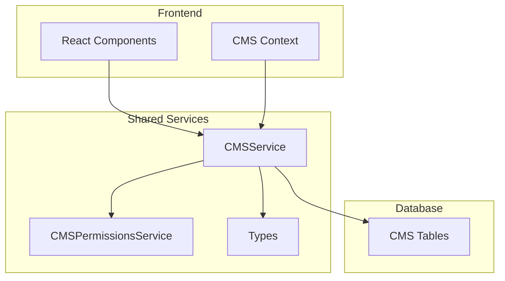
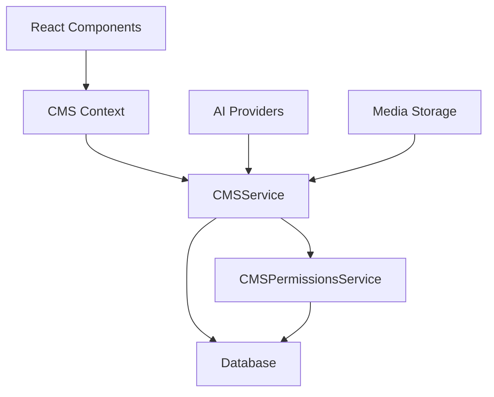
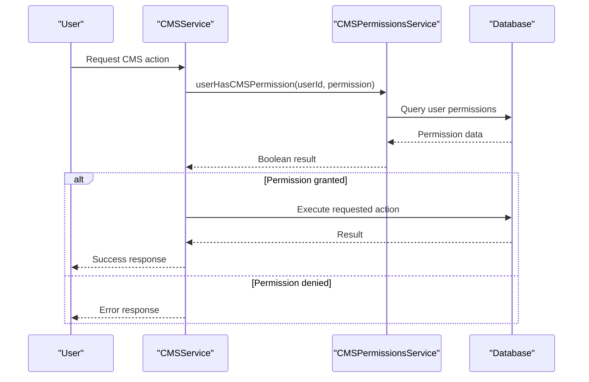
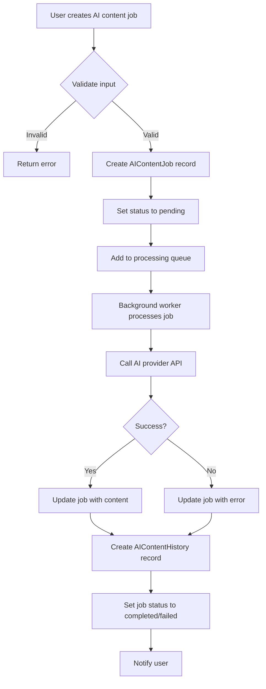
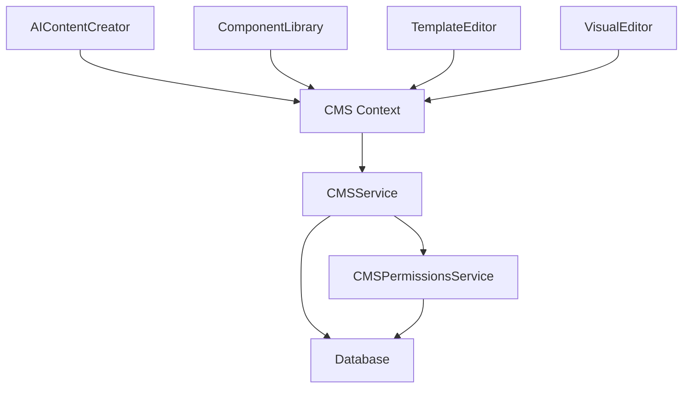

# CMS API Endpoints

<cite>
**Referenced Files in This Document**   
- [cms-service.ts](file://src/shared/cms-service.ts)
- [types.ts](file://src/shared/types.ts)
- [cms-permissions-service.ts](file://src/shared/cms-permissions-service.ts)
- [AIContentCreator.tsx](file://src/react-app/components/cms/AIContentCreator.tsx)
- [ComponentLibrary.tsx](file://src/react-app/components/cms/ComponentLibrary.tsx)
- [TemplateEditor.tsx](file://src/react-app/components/cms/TemplateEditor.tsx)
- [VisualEditor.tsx](file://src/react-app/components/cms/VisualEditor.tsx)
</cite>

## Table of Contents
1. [Introduction](#introduction)
2. [Project Structure](#project-structure)
3. [Core Components](#core-components)
4. [Architecture Overview](#architecture-overview)
5. [Detailed Component Analysis](#detailed-component-analysis)
6. [Dependency Analysis](#dependency-analysis)
7. [Performance Considerations](#performance-considerations)
8. [Troubleshooting Guide](#troubleshooting-guide)
9. [Conclusion](#conclusion)

## Introduction
This document provides comprehensive documentation for the CMS API endpoints in the HabibiStay platform. The system enables content management for pages, templates, components, media, and AI-powered content generation. The API supports full CRUD operations with versioning, inheritance, and role-based access control. This documentation covers all endpoints, request/response formats, authentication requirements, and practical usage examples to facilitate seamless integration.

## Project Structure
The CMS functionality is organized across multiple directories with a clear separation of concerns. The core CMS logic resides in the shared module, while React components provide the user interface for content management. The structure follows a modular pattern with distinct services for different CMS entities.



**Diagram sources**
- [cms-service.ts](file://src/shared/cms-service.ts)
- [cms-permissions-service.ts](file://src/shared/cms-permissions-service.ts)
- [types.ts](file://src/shared/types.ts)

**Section sources**
- [cms-service.ts](file://src/shared/cms-service.ts)
- [types.ts](file://src/shared/types.ts)

## Core Components
The CMS system consists of several core components that work together to provide a comprehensive content management solution. The CMSService class serves as the primary interface for all CMS operations, handling database interactions for pages, templates, components, media, and AI content. Each entity type has dedicated methods for creation, retrieval, update, and deletion (CRUD operations). The service uses Zod for schema validation and type safety, ensuring data integrity throughout the system.

The CMSPermissionsService provides role-based access control, determining what actions users can perform based on their permissions. This service integrates with the main CMSService to enforce security policies. The system also includes AI-powered content generation capabilities, allowing users to create content using various AI providers and models.

**Section sources**
- [cms-service.ts](file://src/shared/cms-service.ts)
- [cms-permissions-service.ts](file://src/shared/cms-permissions-service.ts)
- [types.ts](file://src/shared/types.ts)

## Architecture Overview
The CMS architecture follows a service-oriented pattern with a clear separation between the frontend components and backend services. The React components in the cms directory provide the user interface, while the shared services handle business logic and data persistence. The system uses a context pattern to manage CMS state across components.



**Diagram sources**
- [cms-service.ts](file://src/shared/cms-service.ts)
- [cms-permissions-service.ts](file://src/shared/cms-permissions-service.ts)
- [AIContentCreator.tsx](file://src/react-app/components/cms/AIContentCreator.tsx)

## Detailed Component Analysis

### CMSService Analysis
The CMSService class provides a comprehensive API for managing all CMS entities. It follows a consistent pattern across all entity types, with dedicated methods for each CRUD operation.

#### Class Diagram
```mermaid
classDiagram
class CMSService {
-db : D1Database
+getAllPages() : Promise~Page[]~
+getPageById(id : number) : Promise~Page | null~
+getPageBySlug(slug : string) : Promise~Page | null~
+createPage(page : Omit~Page, 'id' | 'created_at' | 'updated_at'~) : Promise~Page~
+updatePage(id : number, page : Partial~Page~) : Promise~Page~
+deletePage(id : number) : Promise~boolean~
+getAllTemplates() : Promise~Template[]~
+getTemplateById(id : number) : Promise~Template | null~
+createTemplate(template : Omit~Template, 'id' | 'created_at' | 'updated_at'~) : Promise~Template~
+updateTemplate(id : number, template : Partial~Template~) : Promise~Template~
+deleteTemplate(id : number) : Promise~boolean~
+getAllComponents() : Promise~Component[]~
+getComponentById(id : number) : Promise~Component | null~
+createComponent(component : Omit~Component, 'id' | 'created_at' | 'updated_at'~) : Promise~Component~
+updateComponent(id : number, component : Partial~Component~) : Promise~Component~
+deleteComponent(id : number) : Promise~boolean~
+getAllMedia() : Promise~Media[]~
+getMediaById(id : number) : Promise~Media | null~
+createMedia(media : Omit~Media, 'id' | 'created_at'~) : Promise~Media~
+deleteMedia(id : number) : Promise~boolean~
+createContentVersion(version : Omit~ContentVersion, 'id' | 'created_at'~) : Promise~ContentVersion~
+getContentVersions(contentId : number, contentType : string) : Promise~ContentVersion[]~
+getAllAIProviders() : Promise~CMSAIProvider[]~
+getAIProviderById(id : number) : Promise~CMSAIProvider | null~
+createAIProvider(provider : Omit~CMSAIProvider, 'id' | 'created_at' | 'updated_at'~) : Promise~CMSAIProvider~
+updateAIProvider(id : number, provider : Partial~CMSAIProvider~) : Promise~CMSAIProvider~
+deleteAIProvider(id : number) : Promise~boolean~
+getModelsByProvider(providerId : number) : Promise~AIModel[]~
+createAIModel(model : Omit~AIModel, 'id' | 'created_at'~) : Promise~AIModel~
+updateAIModel(id : number, model : Partial~AIModel~) : Promise~AIModel~
+deleteAIModel(id : number) : Promise~boolean~
+createAIContentJob(job : Omit~AIContentJob, 'id' | 'created_at' | 'status'~) : Promise~AIContentJob~
+updateAIContentJob(id : number, job : Partial~AIContentJob~) : Promise~AIContentJob~
+getAIContentJobById(id : number) : Promise~AIContentJob | null~
+getPendingAIContentJobs() : Promise~AIContentJob[]~
+createAIContentHistory(history : Omit~AIContentHistory, 'id' | 'created_at'~) : Promise~AIContentHistory~
+getAIContentHistoryByJob(jobId : number) : Promise~AIContentHistory[]~
}
class CMSPermissionsService {
-db : D1Database
+getUserCMSPermissions(userId : string) : Promise~string[]~
+userHasCMSPermission(userId : string, permission : string) : Promise~boolean~
+userHasAnyCMSPermission(userId : string, permissions : string[]) : Promise~boolean~
+userHasAllCMSPermissions(userId : string, permissions : string[]) : Promise~boolean~
+grantCMSPermission(userId : string, permission : string) : Promise~void~
+revokeCMSPermission(userId : string, permission : string) : Promise~void~
+getAllCMSPermissions() : Promise~{name : string, description : string}[]~
+getUsersWithCMSPermission(permission : string) : Promise~any[]~
}
class Page {
+id : number
+title : string
+slug : string
+template_id : number | null
+content : string | null
+metadata : string | null
+status : 'draft' | 'published' | 'archived'
+created_by : string | null
+updated_by : string | null
+created_at : string
+updated_at : string
+published_at : string | null
}
class Template {
+id : number
+name : string
+description : string | null
+content_structure : string | null
+preview_image : string | null
+is_default : boolean
+parent_template_id : number | null
+design_settings : string | null
+created_by : string | null
+updated_by : string | null
+created_at : string
+updated_at : string
}
class Component {
+id : number
+type : string
+name : string
+properties : string | null
+styles : string | null
+created_by : string | null
+updated_by : string | null
+created_at : string
+updated_at : string
}
class Media {
+id : number
+filename : string
+original_name : string
+mime_type : string
+size : number
+url : string
+alt_text : string | null
+caption : string | null
+created_by : string | null
+created_at : string
}
class ContentVersion {
+id : number
+content_id : number
+content_type : 'page' | 'template' | 'component'
+data : string | null
+created_by : string | null
+created_at : string
+comment : string | null
}
class CMSAIProvider {
+id : number
+name : string
+api_key : string | null
+api_url : string | null
+enabled : boolean
+default_model : string | null
+created_at : string
+updated_at : string
}
class AIModel {
+id : number
+provider_id : number
+name : string
+capabilities : string | null
+max_tokens : number | null
+pricing : number | null
+performance : number | null
+created_at : string
}
class AIContentJob {
+id : number
+provider_id : number
+model_id : number
+prompt : string
+content : string | null
+status : 'pending' | 'processing' | 'completed' | 'failed'
+created_by : string | null
+created_at : string
+completed_at : string | null
+metadata : string | null
}
class AIContentHistory {
+id : number
+job_id : number
+content : string
+version : number
+created_by : string | null
+created_at : string
}
CMSService --> CMSPermissionsService : "uses"
CMSService --> Page : "manages"
CMSService --> Template : "manages"
CMSService --> Component : "manages"
CMSService --> Media : "manages"
CMSService --> ContentVersion : "manages"
CMSService --> CMSAIProvider : "manages"
CMSService --> AIModel : "manages"
CMSService --> AIContentJob : "manages"
CMSService --> AIContentHistory : "manages"
```

**Diagram sources**
- [cms-service.ts](file://src/shared/cms-service.ts)
- [types.ts](file://src/shared/types.ts)

**Section sources**
- [cms-service.ts](file://src/shared/cms-service.ts)
- [types.ts](file://src/shared/types.ts)

### CMSPermissionsService Analysis
The CMSPermissionsService handles all permission-related operations for the CMS, providing a secure way to manage user access to CMS features.

#### Sequence Diagram


**Diagram sources**
- [cms-permissions-service.ts](file://src/shared/cms-permissions-service.ts)
- [cms-service.ts](file://src/shared/cms-service.ts)

**Section sources**
- [cms-permissions-service.ts](file://src/shared/cms-permissions-service.ts)

### AI Content Generation Flow
The AI content generation system allows users to create content using AI providers and models, with a job-based processing system.

#### Flowchart


**Diagram sources**
- [cms-service.ts](file://src/shared/cms-service.ts)
- [AIContentCreator.tsx](file://src/react-app/components/cms/AIContentCreator.tsx)

**Section sources**
- [cms-service.ts](file://src/shared/cms-service.ts)
- [AIContentCreator.tsx](file://src/react-app/components/cms/AIContentCreator.tsx)

## Dependency Analysis
The CMS system has a well-defined dependency structure with clear relationships between components. The CMSService depends on the CMSPermissionsService for access control and on the database for data persistence. The React components depend on the CMSService through the CMS context.



**Diagram sources**
- [cms-service.ts](file://src/shared/cms-service.ts)
- [cms-permissions-service.ts](file://src/shared/cms-permissions-service.ts)
- [AIContentCreator.tsx](file://src/react-app/components/cms/AIContentCreator.tsx)
- [ComponentLibrary.tsx](file://src/react-app/components/cms/ComponentLibrary.tsx)
- [TemplateEditor.tsx](file://src/react-app/components/cms/TemplateEditor.tsx)
- [VisualEditor.tsx](file://src/react-app/components/cms/VisualEditor.tsx)

**Section sources**
- [cms-service.ts](file://src/shared/cms-service.ts)
- [cms-permissions-service.ts](file://src/shared/cms-permissions-service.ts)

## Performance Considerations
The CMS API is designed with performance in mind, using efficient database queries and caching patterns. All retrieval methods use prepared statements to prevent SQL injection and improve query performance. The system implements proper indexing on frequently queried fields like IDs, slugs, and status fields.

For large datasets, consider implementing pagination on retrieval methods. The current implementation returns all records for getAll methods, which could impact performance with large datasets. Future enhancements could include pagination parameters (page, limit) and optimized queries with proper indexing.

The AI content generation system uses a job queue pattern to handle potentially long-running operations, preventing UI blocking and allowing for asynchronous processing. This design ensures that the main application remains responsive while AI content is being generated.

## Troubleshooting Guide
When integrating with the CMS API, several common issues may arise. Here are solutions to the most frequent problems:

**Authentication Errors**: Ensure the user has the required CMS permissions. Use the CMSPermissionsService to verify permissions before making CMS API calls.

**Database Connection Issues**: Verify the D1Database instance is properly initialized and available to the CMSService. Check that the database schema matches the expected structure.

**Validation Errors**: All data is validated using Zod schemas. Ensure your data conforms to the expected types and formats defined in the types.ts file.

**AI Content Generation Failures**: Check that the AI provider is enabled and has a valid API key. Verify the model exists and is compatible with the provider.

**Template Inheritance Issues**: When using template inheritance, ensure the parent template exists and is accessible. Circular inheritance (template A inherits from B, B inherits from A) should be avoided.

**Performance Problems**: For large datasets, implement client-side pagination or request server-side pagination support. Monitor database query performance and add indexes as needed.

**Section sources**
- [cms-service.ts](file://src/shared/cms-service.ts)
- [cms-permissions-service.ts](file://src/shared/cms-permissions-service.ts)
- [types.ts](file://src/shared/types.ts)

## Conclusion
The CMS API provides a comprehensive set of endpoints for managing content in the HabibiStay platform. With support for pages, templates, components, media, and AI-powered content generation, the system offers a flexible and extensible content management solution. The API follows consistent patterns across all entity types, making it easy to learn and use. Security is handled through the CMSPermissionsService, ensuring proper access control. The system is designed for performance and scalability, with efficient database queries and asynchronous processing for AI content generation. By following the patterns and best practices documented here, developers can successfully integrate with the CMS API and build powerful content management features.