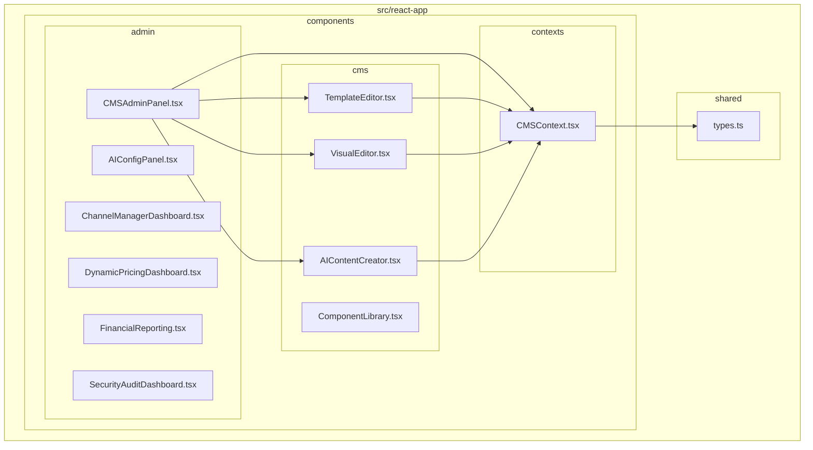
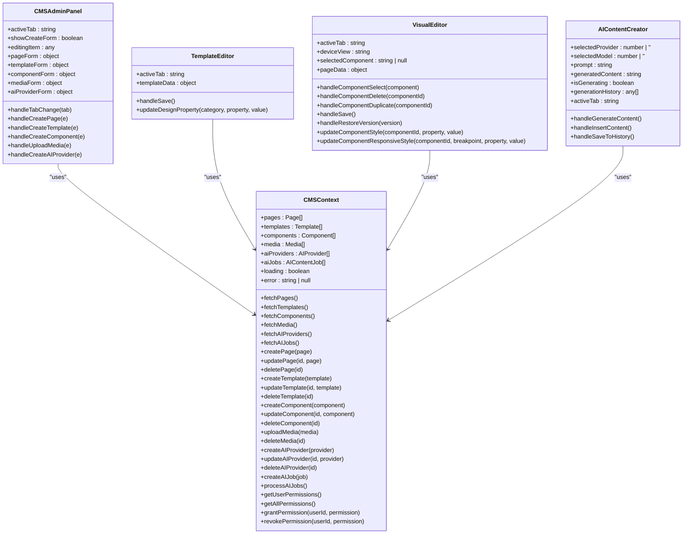
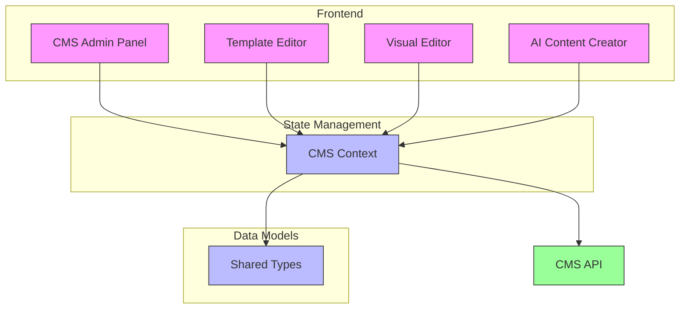
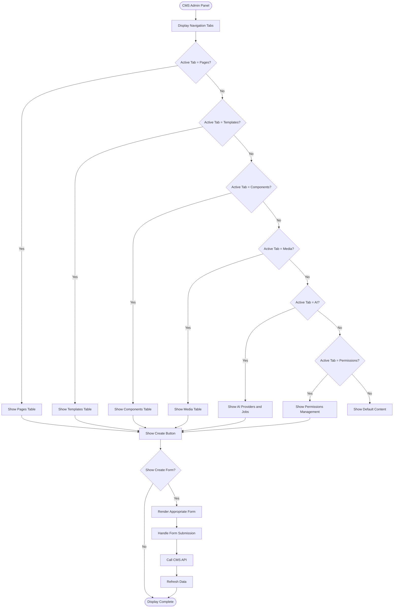
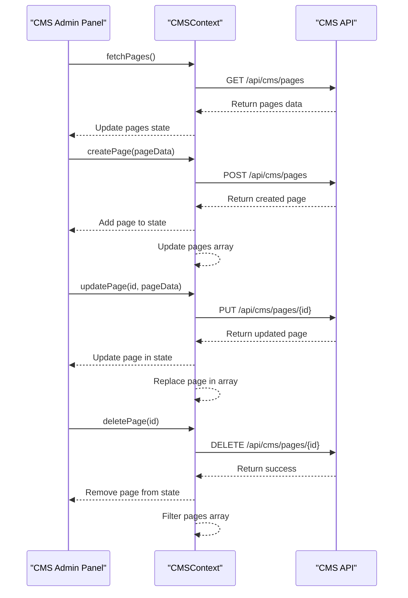
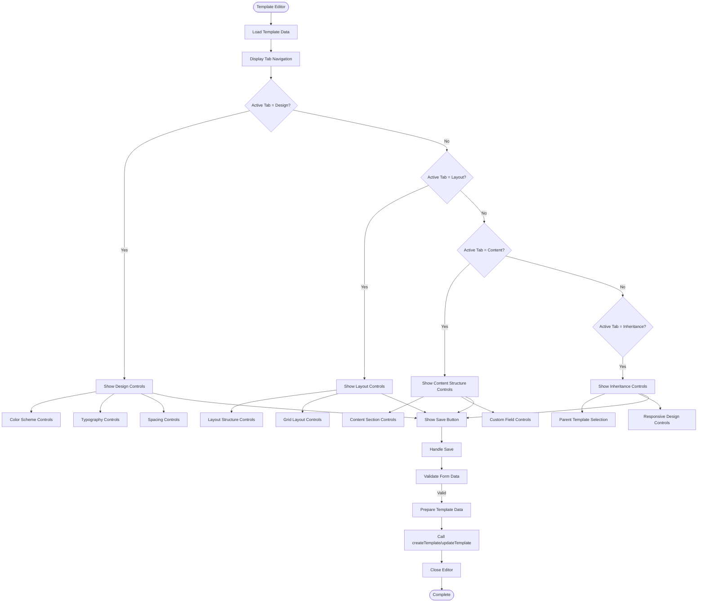
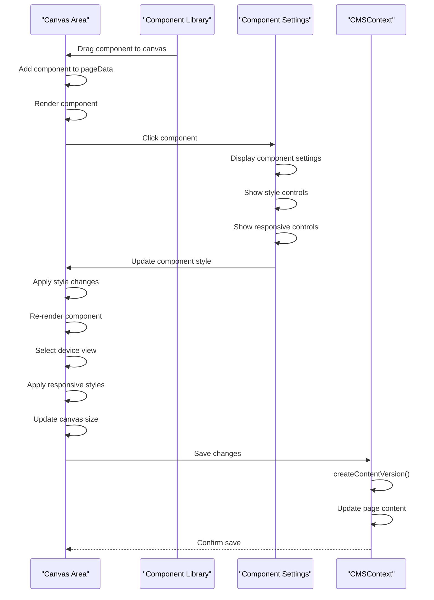
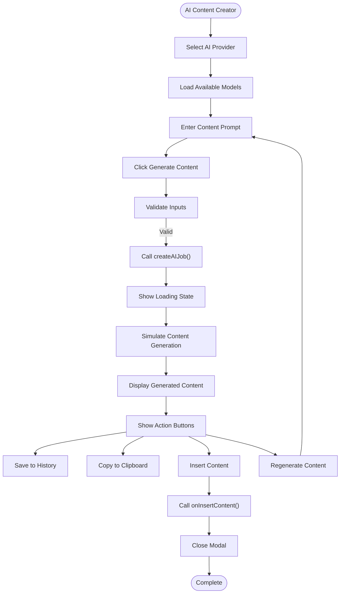
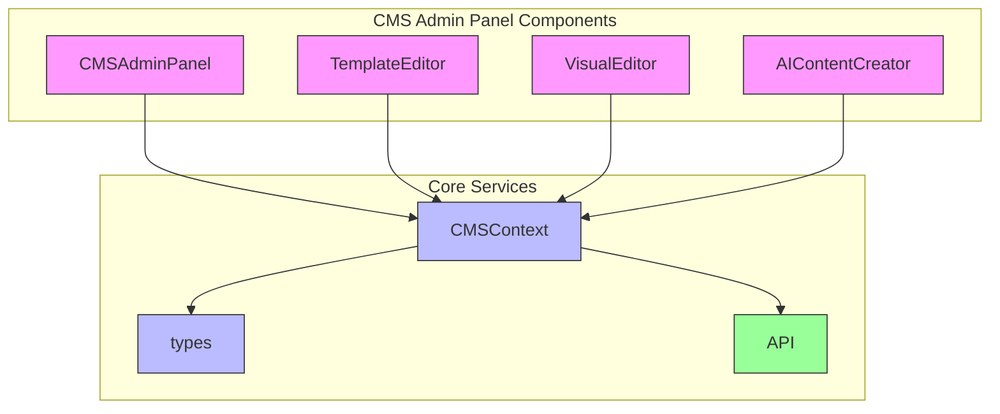

# CMS Admin Panel

<cite>
**Referenced Files in This Document**   
- [CMSAdminPanel.tsx](file://src/react-app/components/admin/CMSAdminPanel.tsx)
- [CMSContext.tsx](file://src/react-app/contexts/CMSContext.tsx)
- [types.ts](file://src/shared/types.ts)
- [TemplateEditor.tsx](file://src/react-app/components/cms/TemplateEditor.tsx)
- [VisualEditor.tsx](file://src/react-app/components/cms/VisualEditor.tsx)
- [AIContentCreator.tsx](file://src/react-app/components/cms/AIContentCreator.tsx)
</cite>

## Table of Contents
1. [Introduction](#introduction)
2. [Project Structure](#project-structure)
3. [Core Components](#core-components)
4. [Architecture Overview](#architecture-overview)
5. [Detailed Component Analysis](#detailed-component-analysis)
6. [Dependency Analysis](#dependency-analysis)
7. [Performance Considerations](#performance-considerations)
8. [Troubleshooting Guide](#troubleshooting-guide)
9. [Conclusion](#conclusion)

## Introduction

The CMS Admin Panel is a comprehensive content management system designed to manage website content, templates, components, media, and AI integrations. It provides a user-friendly interface for administrators to create, edit, and manage various aspects of a website through a centralized dashboard. The system integrates AI-powered content generation, visual editing capabilities, and template management with responsive design controls. This documentation provides a detailed analysis of the CMS Admin Panel's architecture, components, functionality, and implementation patterns.

## Project Structure

The CMS Admin Panel is organized within a React application structure with clear separation of concerns. The components are organized into logical directories based on their functionality, with admin-specific components separated from general CMS utilities.

**Diagram sources**
- [CMSAdminPanel.tsx](file://src/react-app/components/admin/CMSAdminPanel.tsx)
- [TemplateEditor.tsx](file://src/react-app/components/cms/TemplateEditor.tsx)
- [VisualEditor.tsx](file://src/react-app/components/cms/VisualEditor.tsx)
- [AIContentCreator.tsx](file://src/react-app/components/cms/AIContentCreator.tsx)
- [CMSContext.tsx](file://src/react-app/contexts/CMSContext.tsx)
- [types.ts](file://src/shared/types.ts)

**Section sources**
- [CMSAdminPanel.tsx](file://src/react-app/components/admin/CMSAdminPanel.tsx)
- [CMSContext.tsx](file://src/react-app/contexts/CMSContext.tsx)

## Core Components

The CMS Admin Panel consists of several core components that work together to provide a comprehensive content management experience. The main component is the CMSAdminPanel, which serves as the central interface for managing all aspects of the content system. It integrates with specialized editors for templates and visual content, as well as AI-powered content creation tools.

The system uses a context-based architecture with CMSContext providing centralized state management and API access for all CMS-related data including pages, templates, components, media, and AI providers. This context pattern enables efficient data sharing across components without prop drilling.

**Diagram sources**
- [CMSAdminPanel.tsx](file://src/react-app/components/admin/CMSAdminPanel.tsx)
- [CMSContext.tsx](file://src/react-app/contexts/CMSContext.tsx)
- [TemplateEditor.tsx](file://src/react-app/components/cms/TemplateEditor.tsx)
- [VisualEditor.tsx](file://src/react-app/components/cms/VisualEditor.tsx)
- [AIContentCreator.tsx](file://src/react-app/components/cms/AIContentCreator.tsx)

**Section sources**
- [CMSAdminPanel.tsx](file://src/react-app/components/admin/CMSAdminPanel.tsx)
- [CMSContext.tsx](file://src/react-app/contexts/CMSContext.tsx)
- [TemplateEditor.tsx](file://src/react-app/components/cms/TemplateEditor.tsx)
- [VisualEditor.tsx](file://src/react-app/components/cms/VisualEditor.tsx)
- [AIContentCreator.tsx](file://src/react-app/components/cms/AIContentCreator.tsx)

## Architecture Overview

The CMS Admin Panel follows a component-based architecture with a centralized state management system. The architecture is built on React with TypeScript, utilizing React Context for state management and component composition for UI organization.

**Diagram sources**
- [CMSAdminPanel.tsx](file://src/react-app/components/admin/CMSAdminPanel.tsx)
- [CMSContext.tsx](file://src/react-app/contexts/CMSContext.tsx)
- [types.ts](file://src/shared/types.ts)

**Section sources**
- [CMSAdminPanel.tsx](file://src/react-app/components/admin/CMSAdminPanel.tsx)
- [CMSContext.tsx](file://src/react-app/contexts/CMSContext.tsx)

## Detailed Component Analysis

### CMS Admin Panel Analysis

The CMSAdminPanel component serves as the main interface for the content management system, providing tabs for managing different types of content including pages, templates, components, media, AI providers, and permissions.

**Diagram sources**
- [CMSAdminPanel.tsx](file://src/react-app/components/admin/CMSAdminPanel.tsx)

**Section sources**
- [CMSAdminPanel.tsx](file://src/react-app/components/admin/CMSAdminPanel.tsx)

### CMS Context Analysis

The CMSContext provides centralized state management and API access for all CMS-related functionality. It handles data fetching, creation, updating, and deletion operations for various content types.

**Diagram sources**
- [CMSContext.tsx](file://src/react-app/contexts/CMSContext.tsx)

**Section sources**
- [CMSContext.tsx](file://src/react-app/contexts/CMSContext.tsx)

### Template Editor Analysis

The TemplateEditor component provides a comprehensive interface for creating and editing templates with design, layout, content structure, and inheritance controls.

**Diagram sources**
- [TemplateEditor.tsx](file://src/react-app/components/cms/TemplateEditor.tsx)

**Section sources**
- [TemplateEditor.tsx](file://src/react-app/components/cms/TemplateEditor.tsx)

### Visual Editor Analysis

The VisualEditor component provides a drag-and-drop interface for creating and editing page content with real-time preview across different device sizes.

**Diagram sources**
- [VisualEditor.tsx](file://src/react-app/components/cms/VisualEditor.tsx)

**Section sources**
- [VisualEditor.tsx](file://src/react-app/components/cms/VisualEditor.tsx)

### AI Content Creator Analysis

The AIContentCreator component provides an interface for generating content using AI models from various providers, with history tracking and content insertion capabilities.

**Diagram sources**
- [AIContentCreator.tsx](file://src/react-app/components/cms/AIContentCreator.tsx)

**Section sources**
- [AIContentCreator.tsx](file://src/react-app/components/cms/AIContentCreator.tsx)

## Dependency Analysis

The CMS Admin Panel has a well-defined dependency structure with clear relationships between components and services. The main dependencies are organized around the CMSContext, which serves as the central hub for data and API access.

**Diagram sources**
- [CMSAdminPanel.tsx](file://src/react-app/components/admin/CMSAdminPanel.tsx)
- [CMSContext.tsx](file://src/react-app/contexts/CMSContext.tsx)
- [TemplateEditor.tsx](file://src/react-app/components/cms/TemplateEditor.tsx)
- [VisualEditor.tsx](file://src/react-app/components/cms/VisualEditor.tsx)
- [AIContentCreator.tsx](file://src/react-app/components/cms/AIContentCreator.tsx)
- [types.ts](file://src/shared/types.ts)

**Section sources**
- [CMSAdminPanel.tsx](file://src/react-app/components/admin/CMSAdminPanel.tsx)
- [CMSContext.tsx](file://src/react-app/contexts/CMSContext.tsx)

## Performance Considerations

The CMS Admin Panel implements several performance optimizations to ensure a responsive user experience:

1. **State Management**: The use of React Context with proper state updates minimizes unnecessary re-renders by only updating components when relevant data changes.

2. **Data Fetching**: The CMSContext implements efficient data fetching patterns with loading states and error handling to provide feedback during API operations.

3. **Component Optimization**: Components are designed with performance in mind, using React.memo and useCallback where appropriate to prevent unnecessary re-renders.

4. **Lazy Loading**: Modal components like TemplateEditor, VisualEditor, and AIContentCreator are only rendered when needed, reducing initial load time.

5. **API Optimization**: The API calls are structured to fetch only necessary data, with proper error handling and loading states to maintain UI responsiveness.

6. **Event Handling**: Event handlers are properly bound and optimized to prevent memory leaks and ensure efficient execution.

The system could benefit from additional performance enhancements such as:
- Implementing pagination for large datasets in tables
- Adding debouncing for search and filter operations
- Implementing virtual scrolling for long lists
- Adding caching mechanisms for frequently accessed data

## Troubleshooting Guide

### Common Issues and Solutions

**Issue**: CMS Admin Panel not loading data
- **Cause**: API endpoint unreachable or authentication issues
- **Solution**: Check network connection, verify API endpoint URL, ensure authentication tokens are valid

**Issue**: Template changes not saving
- **Cause**: Form validation errors or API submission failures
- **Solution**: Check browser console for error messages, verify all required fields are filled, ensure proper permissions

**Issue**: Visual Editor components not rendering correctly
- **Cause**: CSS conflicts or missing component definitions
- **Solution**: Check browser developer tools for CSS errors, verify component definitions in shared types

**Issue**: AI content generation failing
- **Cause**: Invalid API keys or disabled AI providers
- **Solution**: Verify AI provider configuration, check API key validity, ensure provider is enabled

**Issue**: Permission errors when performing actions
- **Cause**: Insufficient user permissions
- **Solution**: Check user permissions in the permissions tab, contact administrator to grant required permissions

### Debugging Steps

1. **Check Browser Console**: Look for JavaScript errors or API call failures
2. **Verify Network Requests**: Use browser developer tools to inspect API calls and responses
3. **Validate Form Data**: Ensure all required fields are filled correctly
4. **Check Authentication**: Verify user is properly authenticated and has necessary permissions
5. **Review API Documentation**: Confirm API endpoints and payload structures
6. **Test in Isolation**: Test individual components separately to identify the source of issues

### Error Handling

The CMS Admin Panel implements comprehensive error handling through:
- Centralized error state in CMSContext
- User-friendly error messages displayed in the UI
- Detailed error logging in the browser console
- Graceful degradation when API calls fail
- Loading states to indicate ongoing operations

**Section sources**
- [CMSAdminPanel.tsx](file://src/react-app/components/admin/CMSAdminPanel.tsx)
- [CMSContext.tsx](file://src/react-app/contexts/CMSContext.tsx)

## Conclusion

The CMS Admin Panel is a robust and feature-rich content management system that provides comprehensive tools for managing website content. Its component-based architecture with centralized state management through React Context enables efficient data flow and component communication. The system integrates advanced features like AI-powered content generation, visual editing with responsive design controls, and template management with inheritance capabilities.

The panel offers a user-friendly interface with intuitive navigation between different content management areas, including pages, templates, components, media, and AI providers. The implementation follows modern React patterns with TypeScript for type safety and better developer experience.

Key strengths of the system include:
- Modular component architecture
- Comprehensive API integration
- Real-time content editing capabilities
- AI-powered content generation
- Responsive design controls
- Permission-based access control

The system could be further enhanced with features like collaborative editing, advanced analytics, workflow automation, and enhanced accessibility features. Overall, the CMS Admin Panel provides a solid foundation for managing digital content with a focus on usability, flexibility, and extensibility.