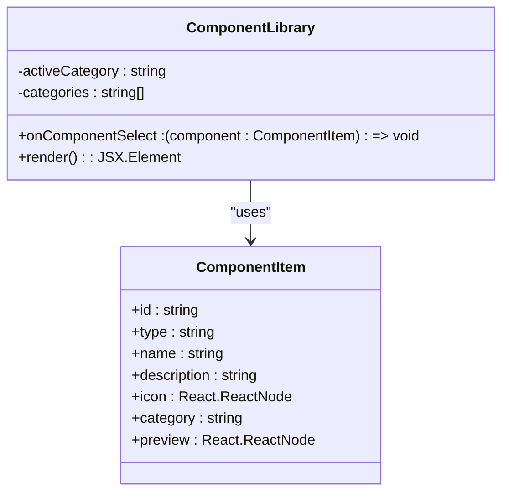
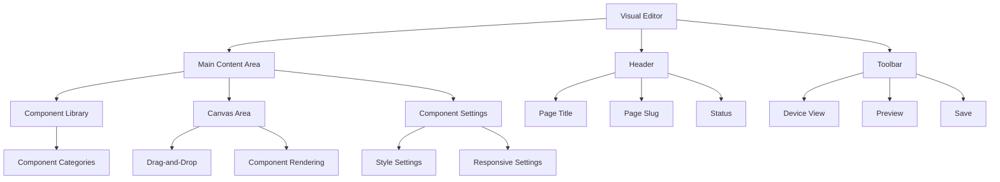
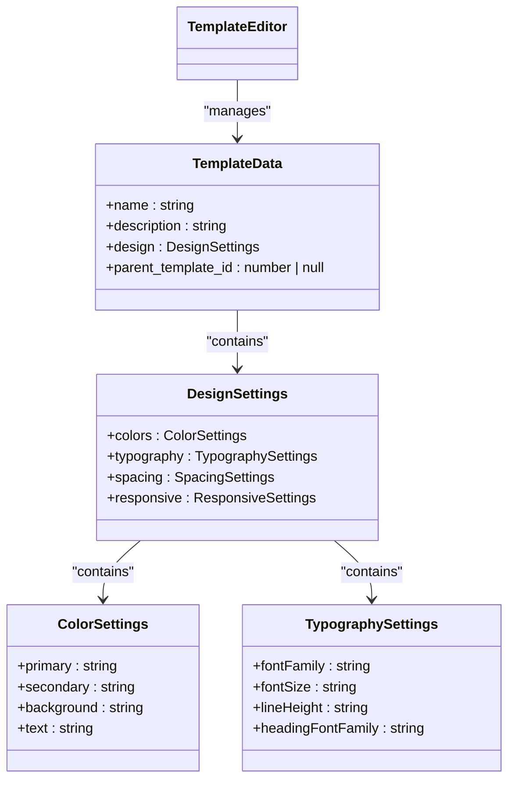
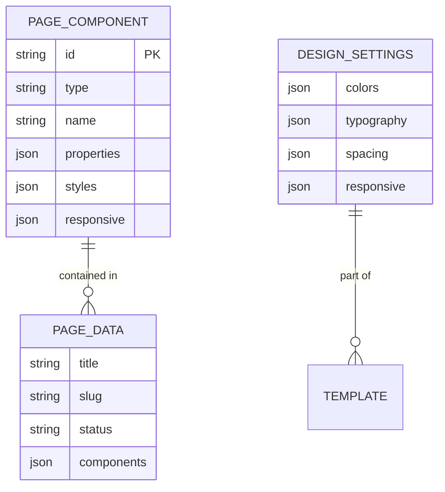
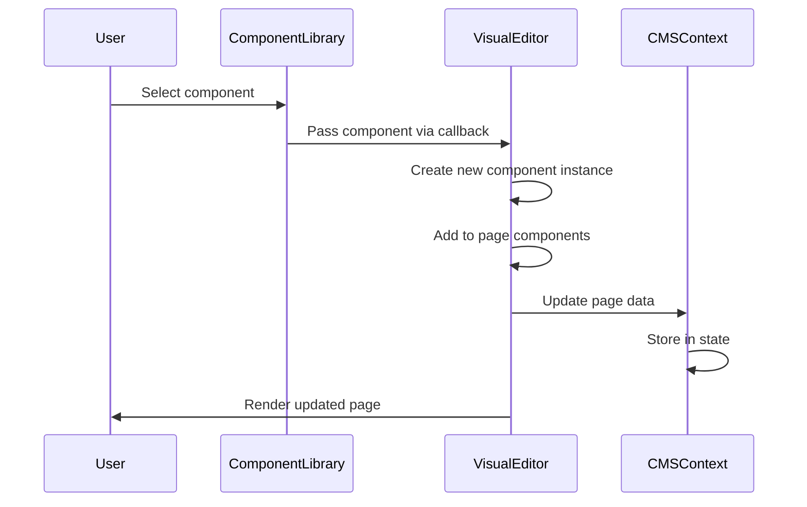
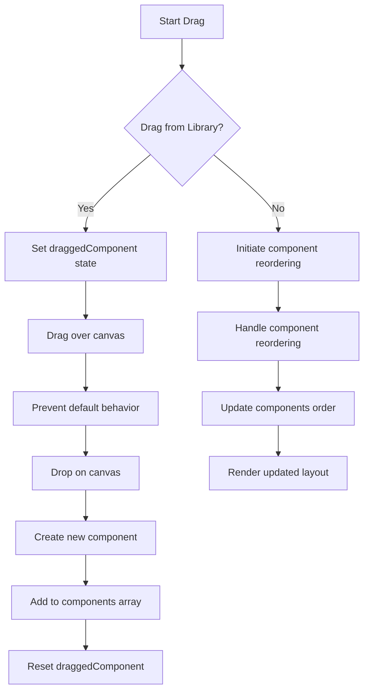
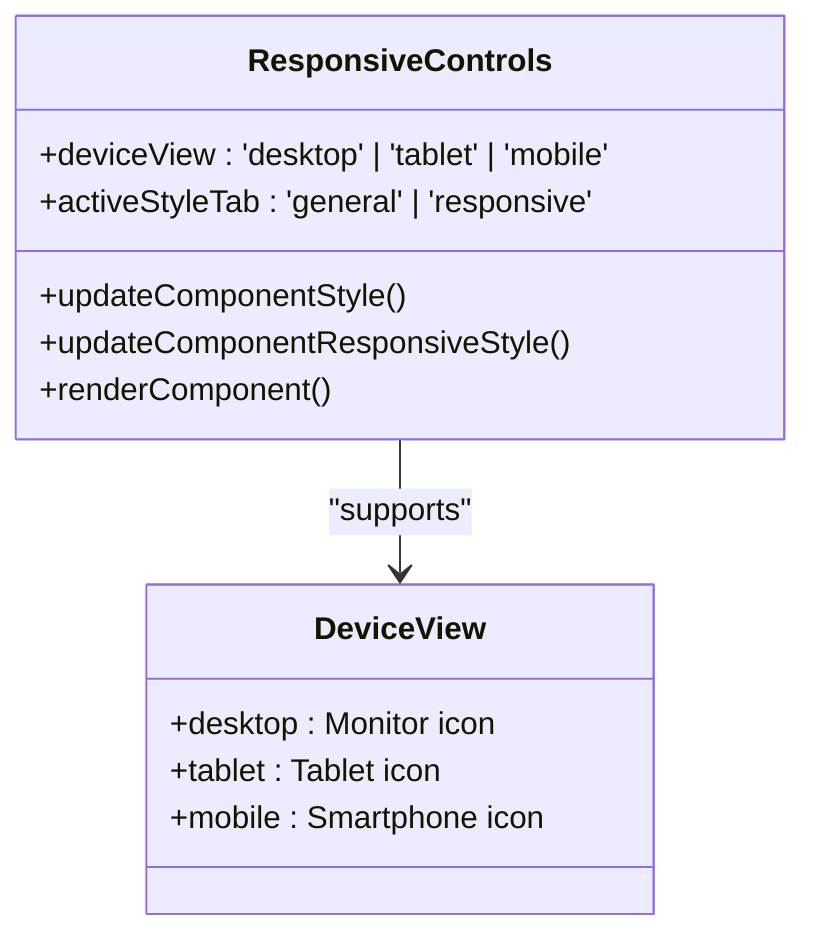
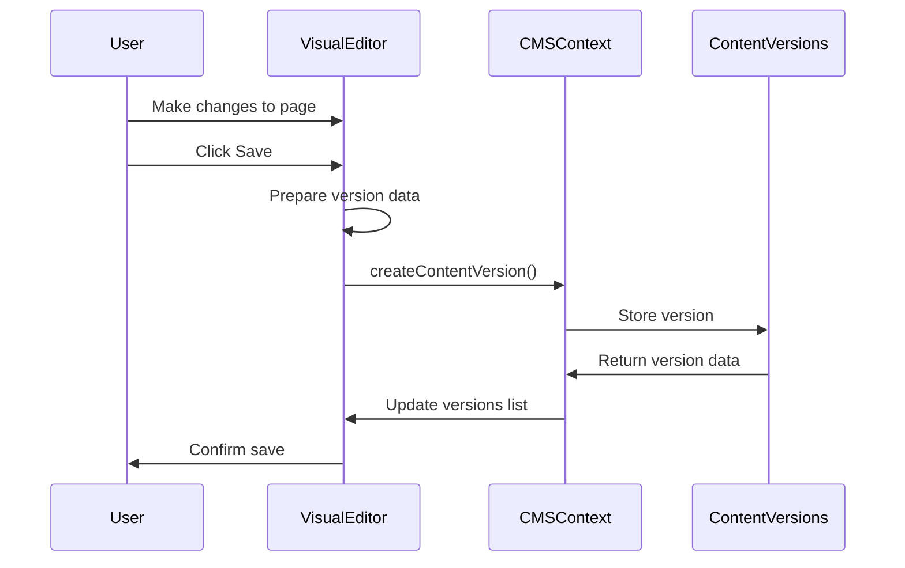

# CMS Components Library

<cite>
**Referenced Files in This Document**   
- [ComponentLibrary.tsx](file://src/react-app/components/cms/ComponentLibrary.tsx)
- [VisualEditor.tsx](file://src/react-app/components/cms/VisualEditor.tsx)
- [TemplateEditor.tsx](file://src/react-app/components/cms/TemplateEditor.tsx)
- [CMSContext.tsx](file://src/react-app/contexts/CMSContext.tsx)
- [types.ts](file://src/shared/types.ts)
- [CMS_FEATURES_SUMMARY.md](file://CMS_FEATURES_SUMMARY.md)
- [CMS_IMPLEMENTATION.md](file://CMS_IMPLEMENTATION.md)
- [CMS_RESPONSIVE_DESIGN_COMPLETED.md](file://CMS_RESPONSIVE_DESIGN_COMPLETED.md)
</cite>

## Table of Contents
1. [Introduction](#introduction)
2. [Component Library Overview](#component-library-overview)
3. [Visual Editor](#visual-editor)
4. [Template System](#template-system)
5. [Core Data Structures](#core-data-structures)
6. [Component Creation and Management](#component-creation-and-management)
7. [Drag-and-Drop Functionality](#drag-and-drop-functionality)
8. [Responsive Design Controls](#responsive-design-controls)
9. [Content Versioning](#content-versioning)
10. [Practical Examples](#practical-examples)
11. [Troubleshooting Guide](#troubleshooting-guide)

## Introduction

The CMS Components Library is a comprehensive system for creating, managing, and arranging website components through a visual interface. This documentation provides detailed information about the component library, visual editor, and template system that enable non-technical users to build and customize web pages without coding knowledge.

The system is built on React with TypeScript and integrates with a CMS context for state management. It features a drag-and-drop interface, responsive design controls, content versioning, and template inheritance. The component library contains pre-built UI elements that can be easily customized and arranged on pages.

**Section sources**
- [CMS_FEATURES_SUMMARY.md](file://CMS_FEATURES_SUMMARY.md#L1-L232)
- [CMS_IMPLEMENTATION.md](file://CMS_IMPLEMENTATION.md#L1-L196)

## Component Library Overview

The Component Library provides a collection of pre-built UI components that can be added to pages through a drag-and-drop interface. Each component has a type, name, description, icon, category, and preview.



**Diagram sources**
- [ComponentLibrary.tsx](file://src/react-app/components/cms/ComponentLibrary.tsx#L1-L317)

The library organizes components into categories (Layout, Content, Media, Interactive) and allows filtering by category. When a component is selected, it is passed to the parent component via the `onComponentSelect` callback.

Available components include:
- **Layout**: Hero Section, Content Card, Navigation Menu
- **Content**: Text Block, Testimonial, Property Card
- **Media**: Image, Image Gallery, Map
- **Interactive**: Button, Contact Form, Search Bar

Each component has a visual preview that shows how it will appear on the page. The library uses Lucide React icons for visual representation and Tailwind CSS for styling.

**Section sources**
- [ComponentLibrary.tsx](file://src/react-app/components/cms/ComponentLibrary.tsx#L1-L317)
- [CMS_FEATURES_SUMMARY.md](file://CMS_FEATURES_SUMMARY.md#L1-L232)

## Visual Editor

The Visual Editor provides a drag-and-drop interface for building pages by arranging components. It includes a canvas area, component library, and component settings panel.



**Diagram sources**
- [VisualEditor.tsx](file://src/react-app/components/cms/VisualEditor.tsx#L1-L849)

The editor supports three device views (desktop, tablet, mobile) that can be toggled to preview responsive designs. When a component is added to the canvas, it can be selected to access its settings, duplicated, or deleted.

Key features:
- **Device preview**: Switch between desktop, tablet, and mobile views
- **Component selection**: Click on components to edit their properties
- **Action buttons**: Duplicate and delete components
- **Drag-and-drop**: Add components from the library to the canvas
- **Real-time preview**: See changes immediately

The editor uses the CMS context to manage page data and save content. It also implements content versioning, automatically creating a new version when changes are saved.

**Section sources**
- [VisualEditor.tsx](file://src/react-app/components/cms/VisualEditor.tsx#L1-L849)
- [CMSContext.tsx](file://src/react-app/contexts/CMSContext.tsx#L1-L647)

## Template System

The Template System allows for the creation and management of page templates with customizable design properties. Templates can inherit from other templates, creating a hierarchy of design consistency.



**Diagram sources**
- [TemplateEditor.tsx](file://src/react-app/components/cms/TemplateEditor.tsx#L1-L769)

The Template Editor provides four tabs for configuration:
- **Design**: Color scheme, typography, and spacing
- **Layout**: Page structure and grid layout
- **Content Structure**: Content organization and custom fields
- **Inheritance**: Template inheritance and responsive controls

Templates support inheritance, allowing child templates to inherit properties from parent templates while overriding specific settings. This creates a consistent design system across the site while allowing for customization.

The system also includes responsive design controls at the template level, allowing for breakpoint customization and device-specific styling.

**Section sources**
- [TemplateEditor.tsx](file://src/react-app/components/cms/TemplateEditor.tsx#L1-L769)
- [CMS_FEATURES_SUMMARY.md](file://CMS_FEATURES_SUMMARY.md#L1-L232)

## Core Data Structures

The CMS Components Library uses several key data structures to represent components, pages, and templates.



**Diagram sources**
- [types.ts](file://src/shared/types.ts#L1-L739)
- [VisualEditor.tsx](file://src/react-app/components/cms/VisualEditor.tsx#L1-L849)
- [TemplateEditor.tsx](file://src/react-app/components/cms/TemplateEditor.tsx#L1-L769)

The primary data structure is `PageComponent`, which represents a component on a page:

```typescript
interface PageComponent {
  id: string;
  type: string;
  name: string;
  properties: Record<string, any>;
  styles: Record<string, any>;
  responsive?: {
    mobile?: Record<string, any>;
    tablet?: Record<string, any>;
    desktop?: Record<string, any>;
  };
}
```

This structure includes:
- **id**: Unique identifier for the component
- **type**: Component type (e.g., "hero", "text", "image")
- **name**: Display name for the component
- **properties**: Component-specific properties
- **styles**: CSS styles for the component
- **responsive**: Device-specific style overrides

The `responsive` property allows for different styles on mobile, tablet, and desktop views, enabling responsive design without custom CSS.

**Section sources**
- [types.ts](file://src/shared/types.ts#L1-L739)
- [VisualEditor.tsx](file://src/react-app/components/cms/VisualEditor.tsx#L1-L849)

## Component Creation and Management

Components are created and managed through the Component Library and Visual Editor. The process involves selecting a component from the library and adding it to the page canvas.



**Diagram sources**
- [ComponentLibrary.tsx](file://src/react-app/components/cms/ComponentLibrary.tsx#L1-L317)
- [VisualEditor.tsx](file://src/react-app/components/cms/VisualEditor.tsx#L1-L849)

When a component is selected from the library, the `handleComponentSelect` function in the Visual Editor creates a new instance with a unique ID and default properties:

```typescript
const handleComponentSelect = (component: ComponentItem) => {
  const newComponent: PageComponent = {
    id: `comp_${Date.now()}`,
    type: component.type,
    name: component.name,
    properties: {},
    styles: {},
    responsive: {
      mobile: {},
      tablet: {},
      desktop: {}
    }
  };
  
  setPageData(prev => ({
    ...prev,
    components: [...prev.components, newComponent]
  }));
};
```

Components can be managed through the visual interface:
- **Delete**: Remove a component from the page
- **Duplicate**: Create a copy of a component
- **Reorder**: Change the position of components
- **Customize**: Modify component properties and styles

The CMS Context provides state management for all components, ensuring changes are persisted and accessible throughout the application.

**Section sources**
- [VisualEditor.tsx](file://src/react-app/components/cms/VisualEditor.tsx#L1-L849)
- [ComponentLibrary.tsx](file://src/react-app/components/cms/ComponentLibrary.tsx#L1-L317)

## Drag-and-Drop Functionality

The drag-and-drop functionality enables intuitive component placement on the page canvas. Users can drag components from the library or rearrange existing components on the canvas.



**Diagram sources**
- [VisualEditor.tsx](file://src/react-app/components/cms/VisualEditor.tsx#L1-L849)

The implementation uses HTML5 drag-and-drop events:
- **onDragOver**: Prevents default behavior to allow dropping
- **onDrop**: Handles the drop event and adds the component

In the Visual Editor, the canvas area has event handlers for drag operations:

```typescript
<div 
  ref={canvasRef}
  className="flex-1 overflow-auto bg-gray-100 p-8"
  onDragOver={(e) => e.preventDefault()}
  onDrop={(e) => {
    e.preventDefault();
    if (draggedComponent) {
      handleComponentSelect(draggedComponent);
      setDraggedComponent(null);
    }
  }}
>
```

When a component is dragged from the library, the `draggedComponent` state is set. On drop, the component is added to the page and the state is reset. This creates a seamless drag-and-drop experience for building pages.

**Section sources**
- [VisualEditor.tsx](file://src/react-app/components/cms/VisualEditor.tsx#L1-L849)

## Responsive Design Controls

The responsive design controls allow customization of component appearance across different device sizes (mobile, tablet, desktop).



**Diagram sources**
- [VisualEditor.tsx](file://src/react-app/components/cms/VisualEditor.tsx#L1-L849)
- [CMS_RESPONSIVE_DESIGN_COMPLETED.md](file://CMS_RESPONSIVE_DESIGN_COMPLETED.md#L1-L181)

The system implements responsive design through:
- **Device view switching**: Toggle between desktop, tablet, and mobile previews
- **Responsive style tabs**: Separate general and responsive style settings
- **Device-specific properties**: Customize padding, font size, and other properties per device

When rendering components, the system applies styles based on the current device view:

```typescript
const renderComponent = (component: PageComponent) => {
  let componentStyles = { ...component.styles };
  
  if (component.responsive) {
    switch (deviceView) {
      case 'mobile':
        componentStyles = { ...componentStyles, ...component.responsive.mobile };
        break;
      case 'tablet':
        componentStyles = { ...componentStyles, ...component.responsive.tablet };
        break;
      case 'desktop':
        componentStyles = { ...componentStyles, ...component.responsive.desktop };
        break;
    }
  }
  
  // Apply styles to component
};
```

Users can customize responsive properties in the component settings panel, with separate controls for mobile, tablet, and desktop views. This enables precise control over how components appear on different devices without writing CSS.

**Section sources**
- [VisualEditor.tsx](file://src/react-app/components/cms/VisualEditor.tsx#L1-L849)
- [CMS_RESPONSIVE_DESIGN_COMPLETED.md](file://CMS_RESPONSIVE_DESIGN_COMPLETED.md#L1-L181)

## Content Versioning

The content versioning system automatically tracks changes to pages and allows for restoration of previous versions.



**Diagram sources**
- [VisualEditor.tsx](file://src/react-app/components/cms/VisualEditor.tsx#L1-L849)
- [CMSContext.tsx](file://src/react-app/contexts/CMSContext.tsx#L1-L647)

When a page is saved, the system creates a new content version:

```typescript
const handleSave = async () => {
  // Create a content version before saving
  if (pageId) {
    try {
      await createContentVersion({
        content_id: pageId,
        content_type: 'page',
        data: JSON.stringify(pageData.components),
        comment: `Saved version at ${new Date().toLocaleString()}`,
        created_by: 'current_user'
      });
      
      // Reload versions
      loadContentVersions(pageId);
    } catch (error) {
      console.error('Failed to create content version:', error);
    }
  }
  
  onSave({
    ...pageData,
    content: JSON.stringify(pageData.components)
  });
};
```

Key features:
- **Automatic version creation**: A new version is created on each save
- **Version history**: List of all saved versions with timestamps
- **Restore functionality**: Ability to revert to any previous version
- **Current version indicator**: Visual indication of the active version

The version data is stored as JSON, capturing the complete component structure at the time of saving. This allows for complete restoration of page content to any previous state.

**Section sources**
- [VisualEditor.tsx](file://src/react-app/components/cms/VisualEditor.tsx#L1-L849)
- [CMSContext.tsx](file://src/react-app/contexts/CMSContext.tsx#L1-L647)

## Practical Examples

### Creating a Property Listing Page

To create a property listing page using the CMS Components Library:

1. **Open the Visual Editor**
   - Navigate to the CMS admin panel
   - Click "Create New Page"
   - Enter page title and slug

2. **Add Components**
   - Select "Hero Section" from the Layout category
   - Add "Property Card" from the Content category
   - Include "Image Gallery" from the Media category
   - Add "Contact Form" from the Interactive category

3. **Customize Components**
   - Select the Hero Section
   - Change text to "Luxury Properties in Riyadh"
   - Update button text to "View Properties"
   - Set background gradient to blue and purple

4. **Configure Responsive Design**
   - Switch to mobile view
   - Adjust font sizes for better readability
   - Modify padding for touch-friendly spacing
   - Preview on all device sizes

5. **Save and Publish**
   - Click "Save" to create a content version
   - Change status from "Draft" to "Published"
   - Confirm the page is available at the specified slug

### Building a Template with Inheritance

To create a template that inherits from a base template:

1. **Create Base Template**
   - Open Template Editor
   - Set name to "Base Template"
   - Configure color scheme with primary blue
   - Set font family to Inter
   - Define spacing values
   - Save as default template

2. **Create Child Template**
   - Open Template Editor
   - Set name to "Property Template"
   - Select "Base Template" as parent
   - Customize colors with different primary color
   - Add property-specific layout sections
   - Save template

3. **Verify Inheritance**
   - The child template inherits typography and spacing
   - Custom colors override the parent template
   - Responsive breakpoints are inherited
   - Additional layout sections are specific to the child

4. **Apply to Pages**
   - Create a new page
   - Select "Property Template"
   - Add content using components
   - Save and publish

**Section sources**
- [VisualEditor.tsx](file://src/react-app/components/cms/VisualEditor.tsx#L1-L849)
- [TemplateEditor.tsx](file://src/react-app/components/cms/TemplateEditor.tsx#L1-L769)
- [CMS_FEATURES_SUMMARY.md](file://CMS_FEATURES_SUMMARY.md#L1-L232)

## Troubleshooting Guide

### Common Issues and Solutions

**Issue: Components not appearing in the library**
- **Cause**: Component data not properly loaded
- **Solution**: 
  - Check that `componentLibrary` array is defined
  - Verify component imports from Lucide React
  - Ensure all required properties are included
  - Refresh the page to reload the component library

**Issue: Drag-and-drop not working**
- **Cause**: Missing event handlers or state management
- **Solution**:
  - Verify `onDragOver` prevents default behavior
  - Check that `draggedComponent` state is properly set
  - Ensure `onDrop` handler calls `handleComponentSelect`
  - Confirm the canvas has the necessary event listeners

**Issue: Responsive settings not applying**
- **Cause**: Style application logic error
- **Solution**:
  - Check that `deviceView` state is correctly updated
  - Verify the `renderComponent` function applies responsive styles
  - Ensure the responsive property structure is correct
  - Test with different device views

**Issue: Content versions not saving**
- **Cause**: API call failure or data formatting issue
- **Solution**:
  - Verify `createContentVersion` function is called
  - Check that page data is properly serialized to JSON
  - Confirm the CMS context has the necessary permissions
  - Review browser console for error messages

**Issue: Template inheritance not working**
- **Cause**: Parent template ID not properly set
- **Solution**:
  - Verify the `parent_template_id` is correctly assigned
  - Check that the parent template exists
  - Ensure the template data structure includes inheritance properties
  - Confirm the template editor loads existing templates

### Debugging Tips

1. **Use Browser Developer Tools**
   - Check the console for JavaScript errors
   - Inspect component state in React DevTools
   - Monitor network requests for API calls

2. **Verify Data Flow**
   - Trace the component selection from library to canvas
   - Confirm state updates are properly propagated
   - Check that all callbacks are correctly implemented

3. **Test Responsiveness**
   - Use device emulation in browser developer tools
   - Test on actual mobile and tablet devices
   - Verify breakpoints are correctly applied

4. **Check Permissions**
   - Ensure the user has admin privileges
   - Verify CMS permissions are properly configured
   - Check that API endpoints require authentication

**Section sources**
- [VisualEditor.tsx](file://src/react-app/components/cms/VisualEditor.tsx#L1-L849)
- [ComponentLibrary.tsx](file://src/react-app/components/cms/ComponentLibrary.tsx#L1-L317)
- [TemplateEditor.tsx](file://src/react-app/components/cms/TemplateEditor.tsx#L1-L769)
- [CMSContext.tsx](file://src/react-app/contexts/CMSContext.tsx#L1-L647)