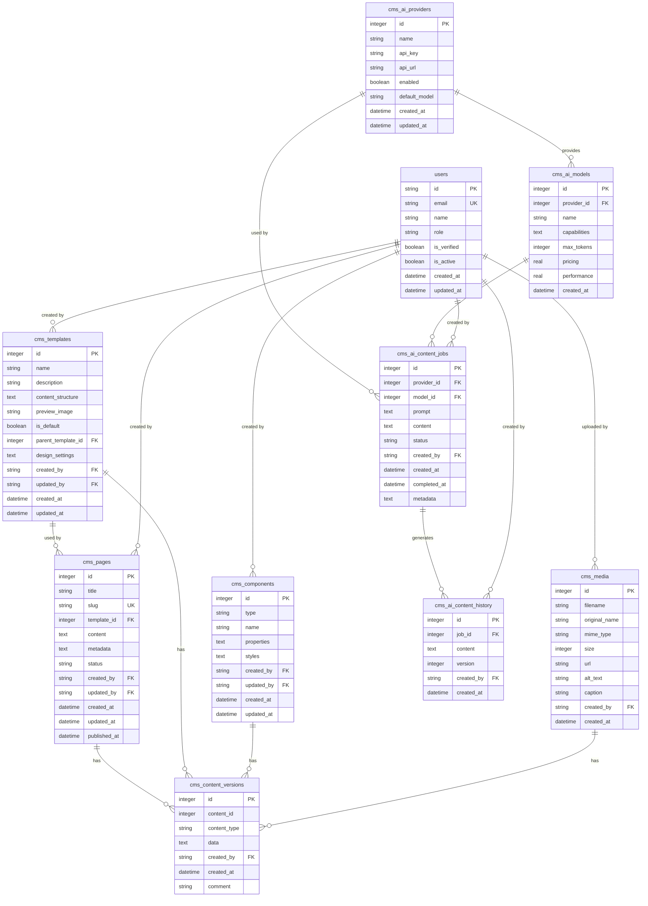
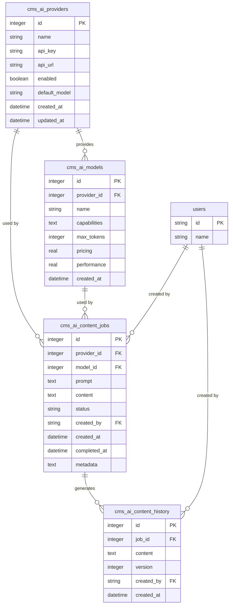
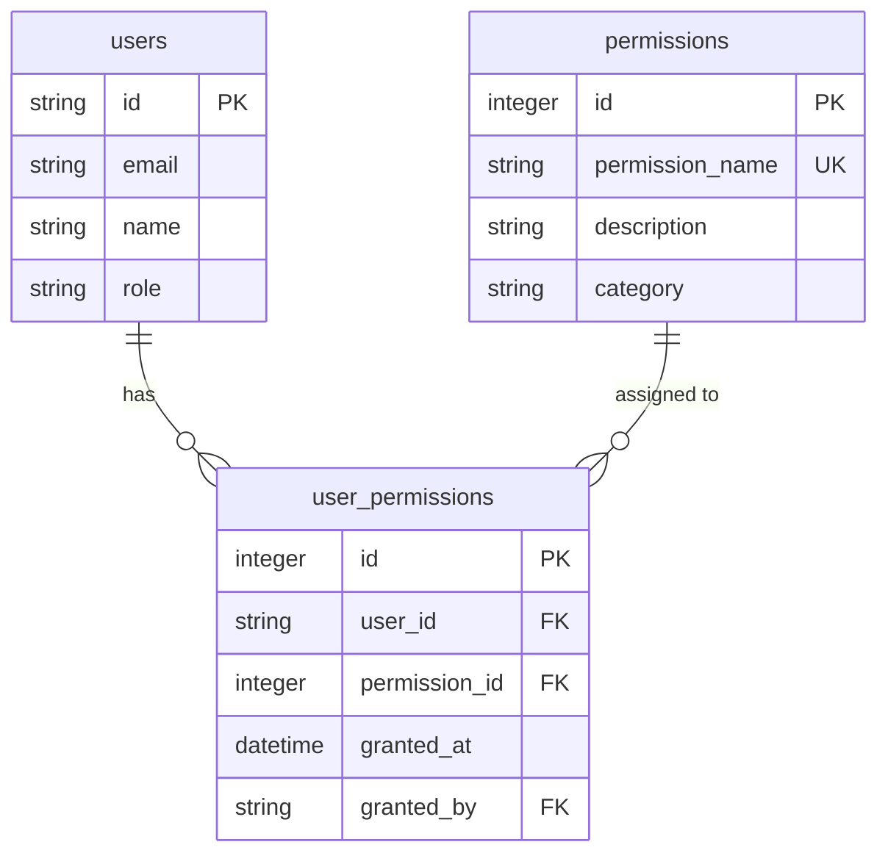

# CMS Data Models

<cite>
**Referenced Files in This Document**   
- [types.ts](file://src/shared/types.ts)
- [cms-service.ts](file://src/shared/cms-service.ts)
- [cms-permissions-service.ts](file://src/shared/cms-permissions-service.ts)
- [11.sql](file://migrations/11.sql)
- [CMS_FEATURES_SUMMARY.md](file://CMS_FEATURES_SUMMARY.md)
- [CMS_IMPLEMENTATION.md](file://CMS_IMPLEMENTATION.md)
</cite>

## Table of Contents
1. [Introduction](#introduction)
2. [Core Data Models](#core-data-models)
3. [Page Model](#page-model)
4. [Template Model](#template-model)
5. [Component Model](#component-model)
6. [Media Model](#media-model)
7. [Content Versioning Model](#content-versioning-model)
8. [AI Provider Models](#ai-provider-models)
9. [Relationships and Constraints](#relationships-and-constraints)
10. [Permissions System](#permissions-system)
11. [Practical Examples](#practical-examples)
12. [Troubleshooting Guide](#troubleshooting-guide)

## Introduction
The HabibiStay CMS implements a comprehensive content management system with support for pages, templates, components, media assets, and AI-powered content generation. This document details the data models that form the foundation of the CMS, including field definitions, relationships, constraints, and practical usage patterns. The system is designed to provide administrators with a flexible and powerful interface for managing website content while maintaining data integrity and security.

## Core Data Models

The CMS data models are defined in the `types.ts` file using Zod schemas for type safety and validation. These models represent the core entities that make up the content management system, including pages, templates, components, media assets, and AI-related functionality. The models are used throughout the application for data validation, TypeScript type inference, and database operations.



**Diagram sources**
- [types.ts](file://src/shared/types.ts)
- [11.sql](file://migrations/11.sql)

**Section sources**
- [types.ts](file://src/shared/types.ts#L1-L738)
- [11.sql](file://migrations/11.sql#L1-L143)

## Page Model

The Page model represents individual website pages within the CMS. Each page has a title, slug (URL identifier), optional template reference, content structure, metadata, and publication status. Pages can be in draft, published, or archived states, allowing for content review before publication.

### Field Descriptions
- **id**: Unique identifier for the page (auto-incrementing integer)
- **title**: Display title of the page (required string)
- **slug**: URL-friendly identifier for the page (required, unique string)
- **template_id**: Reference to the template used for this page (nullable integer, foreign key to cms_templates)
- **content**: JSON structure containing the page's content and component configuration (nullable text)
- **metadata**: JSON structure containing SEO metadata, page settings, and other metadata (nullable text)
- **status**: Publication status of the page (string, constrained to: 'draft', 'published', 'archived')
- **created_by**: User ID of the creator (nullable string, foreign key to users)
- **updated_by**: User ID of the last modifier (nullable string, foreign key to users)
- **created_at**: Timestamp of creation (datetime, defaults to current timestamp)
- **updated_at**: Timestamp of last update (datetime, automatically updated)
- **published_at**: Timestamp when the page was published (nullable datetime)

### Constraints and Indexes
- Unique constraint on `slug` field to prevent URL conflicts
- Index on `slug` for fast lookup when serving public pages
- Index on `status` for efficient filtering of published vs. draft content
- Index on `template_id` for template-based queries
- Foreign key constraints to ensure referential integrity with templates and users

### Usage Examples
Pages are created through the CMS admin interface and can be accessed publicly via the `/page/:slug` route when in 'published' status. The content field typically contains a JSON structure that defines which components are used on the page and their configuration.

**Section sources**
- [types.ts](file://src/shared/types.ts#L320-L334)
- [11.sql](file://migrations/11.sql#L4-L25)
- [cms-service.ts](file://src/shared/cms-service.ts#L50-L100)

## Template Model

The Template model defines reusable page layouts and designs that can be applied to multiple pages. Templates include a content structure definition, design settings, and support for inheritance, allowing for consistent branding and layout across the website.

### Field Descriptions
- **id**: Unique identifier for the template (auto-incrementing integer)
- **name**: Display name of the template (required string)
- **description**: Brief description of the template's purpose (nullable string)
- **content_structure**: JSON structure defining the template's layout and default components (nullable text)
- **preview_image**: URL to a preview image of the template (nullable string)
- **is_default**: Flag indicating if this template should be used by default for new pages (boolean)
- **parent_template_id**: Reference to a parent template for inheritance (nullable integer, foreign key to cms_templates)
- **design_settings**: JSON structure containing responsive breakpoints, color schemes, typography, and other design properties (nullable text)
- **created_by**: User ID of the creator (nullable string, foreign key to users)
- **updated_by**: User ID of the last modifier (nullable string, foreign key to users)
- **created_at**: Timestamp of creation (datetime, defaults to current timestamp)
- **updated_at**: Timestamp of last update (datetime, automatically updated)

### Template Inheritance
The template system supports inheritance through the `parent_template_id` field. When a template inherits from another template, it inherits the parent's content structure and design settings, which can then be overridden or extended. This creates a hierarchy that allows for consistent base designs with specialized variations.

### Constraints and Indexes
- Index on `parent_template_id` to optimize inheritance queries
- Foreign key constraint from `parent_template_id` to `id` within the same table
- Foreign key constraints to ensure referential integrity with users

**Section sources**
- [types.ts](file://src/shared/types.ts#L336-L351)
- [11.sql](file://migrations/11.sql#L27-L48)
- [cms-service.ts](file://src/shared/cms-service.ts#L102-L152)

## Component Model

The Component model represents reusable UI elements that can be added to pages and templates. Components are the building blocks of the visual editor, allowing non-technical users to create rich content through a drag-and-drop interface.

### Field Descriptions
- **id**: Unique identifier for the component (auto-incrementing integer)
- **type**: Component type identifier (required string, e.g., 'hero', 'card', 'testimonial')
- **name**: Display name of the component (required string)
- **properties**: JSON structure containing the component's configurable properties (nullable text)
- **styles**: JSON structure containing styling information, including responsive design settings (nullable text)
- **created_by**: User ID of the creator (nullable string, foreign key to users)
- **updated_by**: User ID of the last modifier (nullable string, foreign key to users)
- **created_at**: Timestamp of creation (datetime, defaults to current timestamp)
- **updated_at**: Timestamp of last update (datetime, automatically updated)

### Component Properties
The `properties` field contains a JSON structure that defines the configurable aspects of a component. For example, a "Hero" component might have properties for headline, subheadline, call-to-action text, and button link. The structure is flexible and can be extended to support new component types.

### Responsive Design
The `styles` field supports responsive design through a JSON structure that can define different styling rules for various breakpoints (mobile, tablet, desktop). This allows components to adapt their appearance based on the viewing device.

**Section sources**
- [types.ts](file://src/shared/types.ts#L353-L364)
- [11.sql](file://migrations/11.sql#L50-L63)
- [cms-service.ts](file://src/shared/cms-service.ts#L154-L204)

## Media Model

The Media model manages digital assets such as images, videos, and documents that can be used within pages, templates, and components. The model stores metadata about the files while the actual files are stored externally.

### Field Descriptions
- **id**: Unique identifier for the media asset (auto-incrementing integer)
- **filename**: System filename of the asset (required string)
- **original_name**: Original filename when uploaded (required string)
- **mime_type**: MIME type of the file (required string, e.g., 'image/jpeg', 'video/mp4')
- **size**: File size in bytes (required integer)
- **url**: Public URL where the asset can be accessed (required string)
- **alt_text**: Alternative text for accessibility and SEO (nullable string)
- **caption**: Descriptive caption for the asset (nullable string)
- **created_by**: User ID of the uploader (nullable string, foreign key to users)
- **created_at**: Timestamp of upload (datetime, defaults to current timestamp)

### Asset Management
Media assets are typically uploaded through the CMS admin interface and can be referenced by pages, templates, and components. The model stores metadata about the assets while the actual files are stored in a cloud storage service, with the `url` field providing the public access point.

### Constraints and Indexes
- The `url` field is required and typically points to a CDN or cloud storage endpoint
- Foreign key constraint from `created_by` to users table

**Section sources**
- [types.ts](file://src/shared/types.ts#L366-L379)
- [11.sql](file://migrations/11.sql#L65-L78)
- [cms-service.ts](file://src/shared/cms-service.ts#L206-L256)

## Content Versioning Model

The Content Versioning model provides a system for tracking changes to content over time, enabling rollback to previous versions and maintaining a history of content modifications.

### Field Descriptions
- **id**: Unique identifier for the version record (auto-incrementing integer)
- **content_id**: ID of the content item being versioned (required integer)
- **content_type**: Type of content being versioned (required string, constrained to: 'page', 'template', 'component')
- **data**: JSON-serialized snapshot of the content at the time of versioning (nullable text)
- **created_by**: User ID of the user who created this version (nullable string, foreign key to users)
- **created_at**: Timestamp of version creation (datetime, defaults to current timestamp)
- **comment**: Optional comment describing the changes in this version (nullable string)

### Versioning Strategy
The CMS automatically creates a new version record whenever content is saved. This provides a complete history of changes that can be reviewed and restored if needed. The `content_type` and `content_id` fields create a polymorphic relationship that allows versioning of different content types with a single table.

### Usage Patterns
- When editing a page, template, or component, the system creates a new version record upon save
- Users can view the version history and compare differences between versions
- Previous versions can be restored, creating a new current version based on the historical data

**Section sources**
- [types.ts](file://src/shared/types.ts#L381-L392)
- [11.sql](file://migrations/11.sql#L80-L91)
- [cms-service.ts](file://src/shared/cms-service.ts#L258-L308)

## AI Provider Models

The CMS includes a comprehensive AI integration system with models for AI providers, models, content generation jobs, and content history. This enables AI-powered content creation and editing within the CMS.

### AI Provider Model
Represents an AI service provider (e.g., OpenAI, Anthropic, Gemini) that can be used for content generation.

**Fields:**
- **id**: Unique identifier (auto-incrementing integer)
- **name**: Provider name (required string)
- **api_key**: Authentication key for the provider (nullable string)
- **api_url**: Base URL for the provider's API (nullable string)
- **enabled**: Whether the provider is active (boolean)
- **default_model**: Default model to use with this provider (nullable string)
- **created_at**: Creation timestamp
- **updated_at**: Last update timestamp

### AI Model Model
Represents a specific AI model available from a provider.

**Fields:**
- **id**: Unique identifier (auto-incrementing integer)
- **provider_id**: Reference to the provider (required integer, foreign key)
- **name**: Model name (required string)
- **capabilities**: JSON array of model capabilities (nullable text)
- **max_tokens**: Maximum tokens the model can process (nullable integer)
- **pricing**: Cost per token or request (nullable real)
- **performance**: Performance rating or metrics (nullable real)
- **created_at**: Creation timestamp

### AI Content Job Model
Represents a request for AI-generated content.

**Fields:**
- **id**: Unique identifier (auto-incrementing integer)
- **provider_id**: Selected provider (required integer, foreign key)
- **model_id**: Selected model (required integer, foreign key)
- **prompt**: Input prompt for the AI (required text)
- **content**: Generated content (nullable text)
- **status**: Job status (string, constrained to: 'pending', 'processing', 'completed', 'failed')
- **created_by**: User who requested the content (nullable string, foreign key)
- **created_at**: Creation timestamp
- **completed_at**: Completion timestamp (nullable datetime)
- **metadata**: Additional job metadata (nullable text)

### AI Content History Model
Tracks the evolution of AI-generated content through refinement cycles.

**Fields:**
- **id**: Unique identifier (auto-incrementing integer)
- **job_id**: Reference to the content job (required integer, foreign key)
- **content**: Content version (required text)
- **version**: Version number in the refinement sequence (required integer)
- **created_by**: User who created this version (nullable string, foreign key)
- **created_at**: Creation timestamp



**Diagram sources**
- [types.ts](file://src/shared/types.ts#L400-L458)
- [11.sql](file://migrations/11.sql#L93-L138)

**Section sources**
- [types.ts](file://src/shared/types.ts#L400-L458)
- [11.sql](file://migrations/11.sql#L93-L138)
- [cms-service.ts](file://src/shared/cms-service.ts#L310-L458)

## Relationships and Constraints

The CMS data models are interconnected through a series of relationships that maintain data integrity and enable rich functionality.

### Primary Relationships
- **Pages → Templates**: A page uses one template (optional), but a template can be used by many pages
- **Templates → Templates**: Templates can inherit from other templates, creating a hierarchical relationship
- **Content → Versions**: Pages, templates, and components can have multiple version records
- **AI Providers → AI Models**: A provider offers multiple models
- **AI Providers/Models → Content Jobs**: Content generation jobs reference both a provider and model
- **Content Jobs → Content History**: Each job can generate multiple content versions through refinement

### Referential Integrity
The database schema enforces referential integrity through foreign key constraints:
- `cms_pages.template_id` references `cms_templates.id`
- `cms_pages.created_by` and `updated_by` reference `users.id`
- `cms_templates.parent_template_id` references `cms_templates.id`
- `cms_templates.created_by` and `updated_by` reference `users.id`
- `cms_components.created_by` and `updated_by` reference `users.id`
- `cms_media.created_by` references `users.id`
- `cms_content_versions.created_by` references `users.id`
- `cms_ai_models.provider_id` references `cms_ai_providers.id`
- `cms_ai_content_jobs.provider_id` and `model_id` reference their respective tables
- `cms_ai_content_jobs.created_by` references `users.id`
- `cms_ai_content_history.job_id` references `cms_ai_content_jobs.id`
- `cms_ai_content_history.created_by` references `users.id`

### Data Validation
All models use Zod schemas for validation, ensuring data consistency:
- Required fields are enforced
- Data types are validated
- String lengths and numeric ranges are constrained
- Enumerated values are validated against allowed options
- JSON fields are validated for proper structure

**Section sources**
- [types.ts](file://src/shared/types.ts)
- [11.sql](file://migrations/11.sql)
- [cms-service.ts](file://src/shared/cms-service.ts)

## Permissions System

The CMS implements a role-based access control (RBAC) system that governs user permissions for CMS operations. The system is defined in the database migration and implemented in the `CMSPermissionsService` class.

### Permission Structure
The permissions system is organized into categories with specific actions:

**Pages:**
- `cms.pages.view`: View CMS pages
- `cms.pages.create`: Create CMS pages
- `cms.pages.edit`: Edit CMS pages
- `cms.pages.delete`: Delete CMS pages
- `cms.pages.publish`: Publish CMS pages

**Templates:**
- `cms.templates.view`: View CMS templates
- `cms.templates.create`: Create CMS templates
- `cms.templates.edit`: Edit CMS templates
- `cms.templates.delete`: Delete CMS templates

**Components:**
- `cms.components.view`: View CMS components
- `cms.components.create`: Create CMS components
- `cms.components.edit`: Edit CMS components
- `cms.components.delete`: Delete CMS components

**Media:**
- `cms.media.view`: View CMS media
- `cms.media.upload`: Upload CMS media
- `cms.media.delete`: Delete CMS media

**AI Integration:**
- `cms.ai.view`: View CMS AI providers
- `cms.ai.create`: Create CMS AI providers
- `cms.ai.edit`: Edit CMS AI providers
- `cms.ai.delete`: Delete CMS AI providers

**Settings:**
- `cms.settings`: Manage CMS settings

### Implementation
The permissions are stored in the `permissions` table and assigned to users through the `user_permissions` junction table. The `CMSPermissionsService` class provides methods to:
- Retrieve a user's CMS permissions
- Check if a user has a specific permission
- Grant or revoke permissions
- List all available CMS permissions



**Diagram sources**
- [10.sql](file://migrations/10.sql#L1-L149)
- [cms-permissions-service.ts](file://src/shared/cms-permissions-service.ts)

**Section sources**
- [10.sql](file://migrations/10.sql#L1-L149)
- [cms-permissions-service.ts](file://src/shared/cms-permissions-service.ts#L1-L172)

## Practical Examples

### Creating a New Page
```typescript
// Example of creating a new page through the CMSService
const newPage = {
  title: "About Us",
  slug: "about",
  template_id: 1,
  content: JSON.stringify({
    components: [
      { id: "hero-1", type: "hero", properties: { headline: "Welcome" } },
      { id: "text-1", type: "text", properties: { content: "Our story..." } }
    ]
  }),
  metadata: JSON.stringify({
    seo: {
      title: "About HabibiStay - Luxury Accommodations",
      description: "Learn about our mission to provide exceptional stays",
      keywords: ["about", "mission", "story"]
    }
  }),
  status: "draft",
  created_by: "user-123"
};

const createdPage = await cmsService.createPage(newPage);
console.log(`Page created with ID: ${createdPage.id}`);
```

### Using Template Inheritance
```typescript
// Create a base template for all property pages
const basePropertyTemplate = {
  name: "Base Property Template",
  content_structure: JSON.stringify({
    sections: [
      { id: "hero", component: "property-hero", position: 1 },
      { id: "gallery", component: "image-gallery", position: 2 },
      { id: "amenities", component: "amenities-list", position: 3 }
    ]
  }),
  design_settings: JSON.stringify({
    breakpoints: {
      mobile: 480,
      tablet: 768,
      desktop: 1024
    },
    colors: {
      primary: "#000000",
      secondary: "#FFFFFF"
    }
  }),
  is_default: false,
  created_by: "user-123"
};

// Create a specialized template that inherits from the base
const luxuryPropertyTemplate = {
  name: "Luxury Property Template",
  description: "Enhanced template for premium properties",
  content_structure: JSON.stringify({
    sections: [
      { id: "hero", component: "property-hero", position: 1 },
      { id: "gallery", component: "image-gallery", position: 2 },
      { id: "amenities", component: "amenities-list", position: 3 },
      { id: "features", component: "premium-features", position: 4 }
    ]
  }),
  design_settings: JSON.stringify({
    colors: {
      primary: "#000000",
      secondary: "#FFFFFF",
      accent: "#D4AF37" // Gold accent for luxury properties
    }
  }),
  is_default: true,
  parent_template_id: basePropertyTemplate.id, // Inherit from base template
  created_by: "user-123"
};
```

### AI Content Generation Workflow
```typescript
// Create an AI content job for generating property descriptions
const aiJob = {
  provider_id: 1,
  model_id: 3,
  prompt: "Generate a compelling description for a luxury villa in Dubai with pool and sea view. Focus on the premium experience and amenities. Keep it under 200 words.",
  created_by: "user-123",
  metadata: JSON.stringify({
    property_id: 456,
    target_audience: "luxury travelers",
    tone: "elegant and inviting"
  })
};

const job = await cmsService.createAIContentJob(aiJob);

// Later, retrieve the completed content
const completedJob = await cmsService.getAIContentJobById(job.id);
if (completedJob?.status === 'completed' && completedJob.content) {
  // Create content history entry
  await cmsService.createAIContentHistory({
    job_id: completedJob.id,
    content: completedJob.content,
    version: 1,
    created_by: "user-123"
  });
  
  // Update the page content with the AI-generated text
  const pageUpdate = {
    content: JSON.stringify({
      components: [
        // ... other components
        { 
          id: "description-1", 
          type: "text", 
          properties: { content: completedJob.content } 
        }
      ]
    })
  };
  
  await cmsService.updatePage(789, pageUpdate);
}
```

## Troubleshooting Guide

### Common Issues and Solutions

**Issue: Page not appearing on the public site**
- **Cause**: The page status is not set to 'published'
- **Solution**: Update the page status to 'published' in the CMS admin panel
- **Verification**: Check that the page slug is unique and not conflicting with existing pages

**Issue: Template changes not reflecting on pages**
- **Cause**: Pages store a snapshot of the template content at the time of creation
- **Solution**: Either manually update the affected pages or implement a template propagation feature
- **Prevention**: Consider using template inheritance for shared content that needs to be updated globally

**Issue: AI content generation job stuck in 'pending' status**
- **Cause**: The background worker process may not be running or is experiencing issues
- **Solution**: 
  1. Check the worker logs for errors
  2. Verify that the AI provider API key is valid and has sufficient quota
  3. Restart the worker process
  4. Manually process pending jobs with: `await cmsService.getPendingAIContentJobs()`

**Issue: Component not rendering correctly**
- **Cause**: The component's properties or styles JSON is malformed
- **Solution**: 
  1. Validate the JSON structure in the database
  2. Check the component's React implementation for rendering errors
  3. Test with a minimal properties structure to isolate the issue

**Issue: Media upload failing**
- **Cause**: The external storage service may be unreachable or the upload URL is incorrect
- **Solution**:
  1. Verify the storage service credentials and connectivity
  2. Check that the file size is within limits
  3. Ensure the MIME type is supported
  4. Validate that the user has the 'cms.media.upload' permission

### Debugging Tips

**Enable Detailed Logging**
```typescript
// In development, enable verbose logging for CMS operations
console.log('Creating page with data:', JSON.stringify(pageData, null, 2));
console.log('Database query:', query);
console.log('Query parameters:', values);
```

**Validate Data Before Operations**
```typescript
// Always validate data against Zod schemas before database operations
try {
  const validatedPage = PageSchema.parse(pageData);
  // Proceed with database operation
} catch (error) {
  console.error('Page validation failed:', error);
  // Return user-friendly error message
}
```

**Check Database Constraints**
When encountering database errors, verify:
- Foreign key references exist
- Unique constraints are not violated
- Required fields are populated
- Data types match the schema

**Test Permission Scenarios**
```typescript
// Verify user permissions before sensitive operations
const hasPermission = await permissionsService.userHasCMSPermission(
  userId, 
  'cms.pages.delete'
);
if (!hasPermission) {
  throw new Error('User does not have permission to delete pages');
}
```

**Monitor AI Provider Health**
```typescript
// Implement health checks for AI providers
async function checkProviderHealth(providerId: number) {
  const provider = await cmsService.getAIProviderById(providerId);
  if (!provider?.enabled) {
    return { healthy: false, message: 'Provider is disabled' };
  }
  
  // Test API connectivity
  try {
    const response = await fetch(`${provider.api_url}/models`, {
      headers: { 'Authorization': `Bearer ${provider.api_key}` }
    });
    return { healthy: response.ok, message: response.statusText };
  } catch (error) {
    return { healthy: false, message: error.message };
  }
}
```

**Section sources**
- [cms-service.ts](file://src/shared/cms-service.ts)
- [cms-permissions-service.ts](file://src/shared/cms-permissions-service.ts)
- [types.ts](file://src/shared/types.ts)
- [CMS_IMPLEMENTATION.md](file://CMS_IMPLEMENTATION.md)
- [CMS_FEATURES_SUMMARY.md](file://CMS_FEATURES_SUMMARY.md)