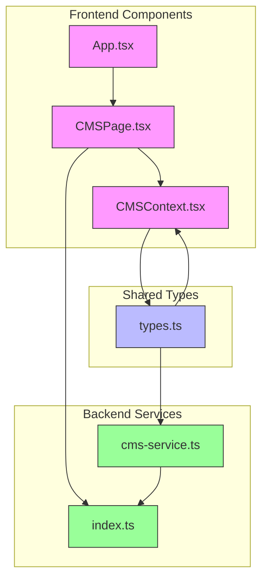
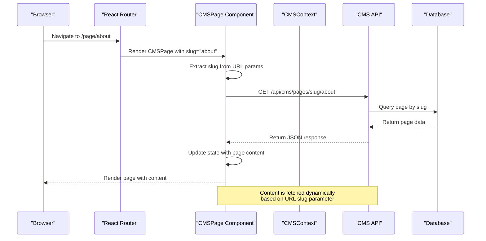
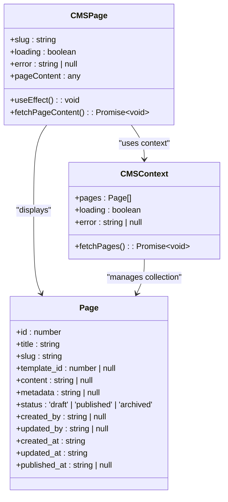
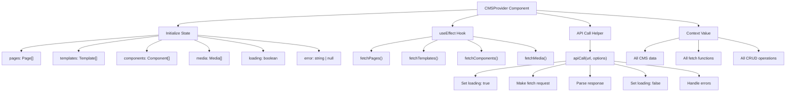
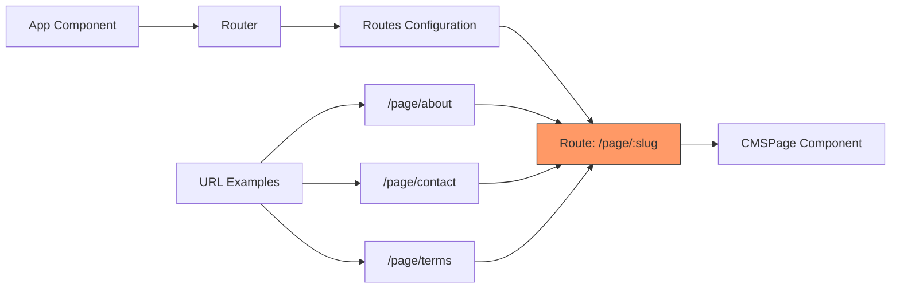
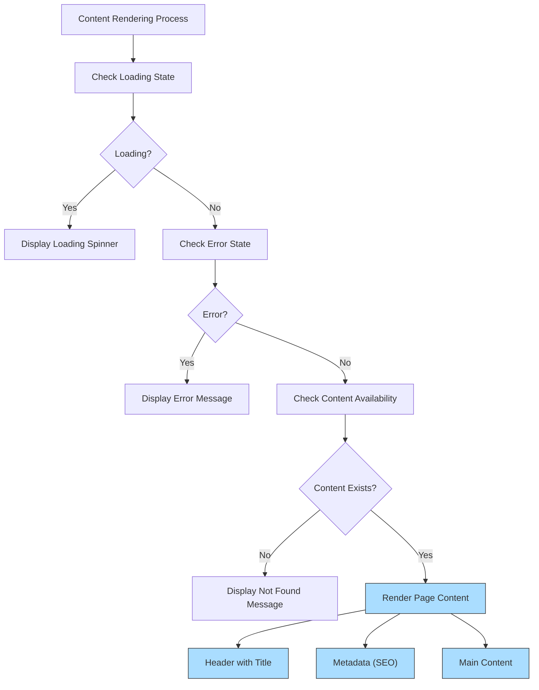

# CMS Frontend Integration

<cite>
**Referenced Files in This Document**   
- [CMSPage.tsx](file://src/react-app/pages/CMSPage.tsx)
- [CMSContext.tsx](file://src/react-app/contexts/CMSContext.tsx)
- [App.tsx](file://src/react-app/App.tsx)
- [types.ts](file://src/shared/types.ts)
- [index.ts](file://src/worker/index.ts)
- [cms-service.ts](file://src/shared/cms-service.ts)
</cite>

## Table of Contents
1. [Introduction](#introduction)
2. [Project Structure](#project-structure)
3. [Core Components](#core-components)
4. [Architecture Overview](#architecture-overview)
5. [Detailed Component Analysis](#detailed-component-analysis)
6. [Routing Implementation](#routing-implementation)
7. [Content Rendering Patterns](#content-rendering-patterns)
8. [Troubleshooting Guide](#troubleshooting-guide)

## Introduction
This document provides comprehensive documentation for the CMS Frontend Integration in the HabibiStay application. It covers the implementation of the CMSPage component, routing configuration, and content rendering patterns that enable dynamic display of CMS-managed content on the frontend. The system allows administrators to create and manage pages through a content management system, which are then rendered dynamically on the client side based on URL slugs. The integration includes error handling, loading states, and proper context management for CMS functionality.

## Project Structure
The CMS frontend integration is organized within the React application structure with specific components and contexts dedicated to CMS functionality. The core CMS-related files are located in designated directories following a feature-based organization pattern.



**Diagram sources**
- [CMSPage.tsx](file://src/react-app/pages/CMSPage.tsx)
- [CMSContext.tsx](file://src/react-app/contexts/CMSContext.tsx)
- [App.tsx](file://src/react-app/App.tsx)
- [types.ts](file://src/shared/types.ts)
- [index.ts](file://src/worker/index.ts)
- [cms-service.ts](file://src/shared/cms-service.ts)

**Section sources**
- [CMSPage.tsx](file://src/react-app/pages/CMSPage.tsx)
- [CMSContext.tsx](file://src/react-app/contexts/CMSContext.tsx)
- [App.tsx](file://src/react-app/App.tsx)

## Core Components
The CMS frontend integration revolves around several core components that work together to fetch, manage, and display CMS content. The primary component is CMSPage, which handles the rendering of CMS-managed pages based on URL parameters. This component relies on the CMSContext for state management and data fetching functionality. The CMSContext provides a centralized store for all CMS-related data including pages, templates, components, and media assets.

The integration follows React best practices with proper separation of concerns, using custom hooks for state management and context for global CMS data access. The system is designed to be scalable, allowing for the addition of new CMS features without significant refactoring of the frontend components.

**Section sources**
- [CMSPage.tsx](file://src/react-app/pages/CMSPage.tsx#L1-L104)
- [CMSContext.tsx](file://src/react-app/contexts/CMSContext.tsx#L1-L646)

## Architecture Overview
The CMS frontend integration follows a client-server architecture where the React frontend communicates with a backend API to retrieve CMS content. The architecture is designed with separation of concerns, with distinct layers for routing, component rendering, state management, and API communication.



**Diagram sources**
- [CMSPage.tsx](file://src/react-app/pages/CMSPage.tsx#L1-L104)
- [index.ts](file://src/worker/index.ts#L0-L799)

## Detailed Component Analysis

### CMSPage Component Analysis
The CMSPage component is responsible for rendering CMS-managed content based on the URL slug parameter. It uses React Router's useParams hook to extract the slug from the URL and fetches the corresponding page content from the CMS API.



**Diagram sources**
- [CMSPage.tsx](file://src/react-app/pages/CMSPage.tsx#L1-L104)
- [CMSContext.tsx](file://src/react-app/contexts/CMSContext.tsx#L1-L646)
- [types.ts](file://src/shared/types.ts#L0-L738)

**Section sources**
- [CMSPage.tsx](file://src/react-app/pages/CMSPage.tsx#L1-L104)

#### Implementation Details
The CMSPage component implements several key patterns for robust content rendering:

1. **URL Parameter Handling**: Uses React Router's useParams to extract the slug parameter from the URL path
2. **Asynchronous Data Fetching**: Implements useEffect with async/await pattern to fetch page content
3. **Loading States**: Displays a spinner during content loading
4. **Error Handling**: Shows user-friendly error messages for failed requests
5. **Content Rendering**: Uses dangerouslySetInnerHTML to render HTML content from the CMS

The component handles three main states:
- **Loading state**: Displayed when content is being fetched
- **Error state**: Shown when an error occurs during fetching
- **Content state**: Renders the actual page content when available

#### Code Example
```typescript
const { slug } = useParams<{ slug: string }>();
const { loading, error } = useCMS();
const [pageContent, setPageContent] = useState<any>(null);

useEffect(() => {
  const fetchPageContent = async () => {
    if (!slug) return;
    
    try {
      const response = await fetch(`/api/cms/pages/slug/${slug}`);
      const data = await response.json();
      
      if (data.success) {
        setPageContent(data.data);
      }
    } catch (err) {
      console.error('Failed to fetch page content:', err);
    }
  };

  fetchPageContent();
}, [slug]);
```

### CMS Context Analysis
The CMSContext provides a centralized state management solution for all CMS-related data in the application. It uses React's Context API to make CMS data available to components throughout the component tree without prop drilling.



**Diagram sources**
- [CMSContext.tsx](file://src/react-app/contexts/CMSContext.tsx#L1-L646)
- [types.ts](file://src/shared/types.ts#L0-L738)

**Section sources**
- [CMSContext.tsx](file://src/react-app/contexts/CMSContext.tsx#L1-L646)

#### Key Features
The CMSContext implements several important features:

1. **State Management**: Maintains state for pages, templates, components, media, and AI-related CMS features
2. **Data Fetching**: Provides methods to fetch all CMS data types from the backend
3. **CRUD Operations**: Includes functions for creating, updating, and deleting CMS entities
4. **Error Handling**: Centralized error state management with detailed error messages
5. **Loading States**: Global loading indicator for all CMS operations

The context uses a helper function `apiCall` to standardize API requests, handling loading states, error management, and response parsing consistently across all CMS operations.

## Routing Implementation
The CMS routing is implemented using React Router, with a specific route pattern that maps to the CMSPage component. The routing configuration enables dynamic content rendering based on URL slugs, allowing for SEO-friendly URLs and clean navigation.



**Diagram sources**
- [App.tsx](file://src/react-app/App.tsx#L0-L77)
- [CMSPage.tsx](file://src/react-app/pages/CMSPage.tsx#L1-L104)

**Section sources**
- [App.tsx](file://src/react-app/App.tsx#L0-L77)

### Route Configuration
The CMS routes are defined in the App.tsx file, which serves as the main application component. The route pattern `/page/:slug` uses a dynamic parameter to capture the page identifier from the URL.

```typescript
<Route path="/page/:slug" element={<CMSPage />} />
```

This routing pattern enables the following URL structures:
- `/page/about` - Renders the About page
- `/page/contact` - Renders the Contact page  
- `/page/terms` - Renders the Terms page
- `/page/privacy` - Renders the Privacy page

The dynamic slug parameter is extracted using React Router's useParams hook and used to fetch the corresponding CMS content from the backend API.

### Route Parameters
The CMSPage component uses the following route parameter:

**:slug** - A string parameter that identifies the CMS page to be displayed. This corresponds to the `slug` field in the Page model and is used to query the CMS API for the appropriate content.

The component extracts this parameter using:
```typescript
const { slug } = useParams<{ slug: string }>();
```

## Content Rendering Patterns
The CMS frontend implements several content rendering patterns to ensure consistent and secure display of CMS-managed content. These patterns address different aspects of content presentation, from basic rendering to advanced features like metadata handling and fallback content.



**Diagram sources**
- [CMSPage.tsx](file://src/react-app/pages/CMSPage.tsx#L1-L104)

**Section sources**
- [CMSPage.tsx](file://src/react-app/pages/CMSPage.tsx#L1-L104)

### Rendering States
The CMSPage component implements three primary rendering states:

1. **Loading State**: Displayed when content is being fetched from the API
```typescript
if (loading) {
  return (
    <div className="min-h-screen bg-gray-50 flex items-center justify-center">
      <div className="animate-spin rounded-full h-12 w-12 border-b-2 border-[#2957c3]"></div>
    </div>
  );
}
```

2. **Error State**: Shown when an error occurs during content fetching
```typescript
if (error) {
  return (
    <div className="min-h-screen bg-gray-50 flex items-center justify-center">
      <div className="text-center">
        <h2 className="text-2xl font-bold text-gray-900 mb-4">Error Loading Page</h2>
        <p className="text-gray-600 mb-6">{error}</p>
        <button onClick={() => window.location.reload()}>
          Try Again
        </button>
      </div>
    </div>
  );
}
```

3. **Content State**: Renders the actual page content when successfully fetched
```typescript
return (
  <div className="min-h-screen bg-white">
    {/* Page Header */}
    <div className="bg-gradient-to-r from-[#2957c3] to-blue-800 text-white py-16">
      <h1 className="text-4xl font-bold mb-4">{pageContent.title}</h1>
      {pageContent.metadata && (
        <div dangerouslySetInnerHTML={{ 
          __html: JSON.parse(pageContent.metadata)?.seoDescription || '' 
        }} />
      )}
    </div>

    {/* Page Content */}
    <div className="max-w-7xl mx-auto px-4 sm:px-6 lg:px-8 py-12">
      {pageContent.content ? (
        <div dangerouslySetInnerHTML={{ __html: pageContent.content }} />
      ) : (
        <div className="text-center py-12">
          <p className="text-gray-500 text-lg">
            This page is under construction. Please check back later.
          </p>
        </div>
      )}
    </div>
  </div>
);
```

### Security Considerations
The implementation uses `dangerouslySetInnerHTML` to render HTML content from the CMS, which requires careful consideration of security implications. The backend API should sanitize content before storage to prevent XSS attacks. Additionally, the application should implement Content Security Policy (CSP) headers to mitigate potential security risks.

### Metadata Rendering
The component handles metadata rendering by parsing the JSON metadata field and extracting SEO-related information:
```typescript
{pageContent.metadata && (
  <div 
    className="text-lg opacity-90"
    dangerouslySetInnerHTML={{ 
      __html: JSON.parse(pageContent.metadata)?.seoDescription || '' 
    }}
  />
)}
```

This allows administrators to include SEO descriptions and other metadata in the CMS, which is then rendered in the page header.

## Troubleshooting Guide
This section provides guidance for common issues encountered when implementing and using the CMS frontend integration.

### Common Issues and Solutions

**:issue: Page content not loading**
- **Symptom**: Loading spinner displays indefinitely
- **Possible causes**:
  - Network connectivity issues
  - Backend API endpoint not available
  - Incorrect slug parameter
  - CORS policy restrictions
- **Solutions**:
  1. Check browser developer tools for network errors
  2. Verify the API endpoint `/api/cms/pages/slug/{slug}` is accessible
  3. Confirm the slug parameter in the URL matches a published page in the CMS
  4. Check server logs for API errors

**:issue: "Page Not Found" message displayed**
- **Symptom**: "The page you're looking for doesn't exist" message appears
- **Possible causes**:
  - No page exists with the specified slug
  - Page status is not "published"
  - Database query issue
- **Solutions**:
  1. Verify the page exists in the CMS with the correct slug
  2. Ensure the page status is set to "published"
  3. Check the backend implementation of `getPageBySlug` in cms-service.ts
  4. Verify the database contains the expected data

**:issue: Content rendering issues**
- **Symptom**: Content appears broken or incorrectly formatted
- **Possible causes**:
  - HTML content contains invalid syntax
  - CSS styling conflicts
  - Missing or incorrect content in the CMS
- **Solutions**:
  1. Validate the HTML content in the CMS
  2. Check for CSS class conflicts with existing styles
  3. Verify the content field in the database contains valid HTML
  4. Test with simple content to isolate the issue

**:issue: Error state not displaying properly**
- **Symptom**: Errors are logged to console but not displayed to users
- **Possible causes**:
  - Error state not properly propagated
  - Context provider not correctly implemented
  - Error handling logic issues
- **Solutions**:
  1. Verify the CMSContext is properly wrapped around the application
  2. Check that error state is correctly set in the apiCall helper function
  3. Ensure the CMSPage component is using the useCMS hook correctly
  4. Test error scenarios by temporarily modifying the API endpoint

### Debugging Tips
1. **Use browser developer tools** to inspect network requests and responses
2. **Check console logs** for JavaScript errors and API call failures
3. **Verify API responses** match the expected structure (success, data, error fields)
4. **Test with known good data** to isolate whether issues are data-related or code-related
5. **Review server logs** for backend errors and database query issues

### Performance Optimization
1. **Implement client-side caching** to reduce API calls for frequently accessed pages
2. **Add loading skeletons** to improve perceived performance
3. **Implement code splitting** for the CMSPage component if it becomes large
4. **Optimize images** in CMS content for faster loading
5. **Consider server-side rendering** for critical CMS pages to improve SEO and initial load performance

**Section sources**
- [CMSPage.tsx](file://src/react-app/pages/CMSPage.tsx#L1-L104)
- [CMSContext.tsx](file://src/react-app/contexts/CMSContext.tsx#L1-L646)
- [index.ts](file://src/worker/index.ts#L0-L799)
- [cms-service.ts](file://src/shared/cms-service.ts#L0-L150)