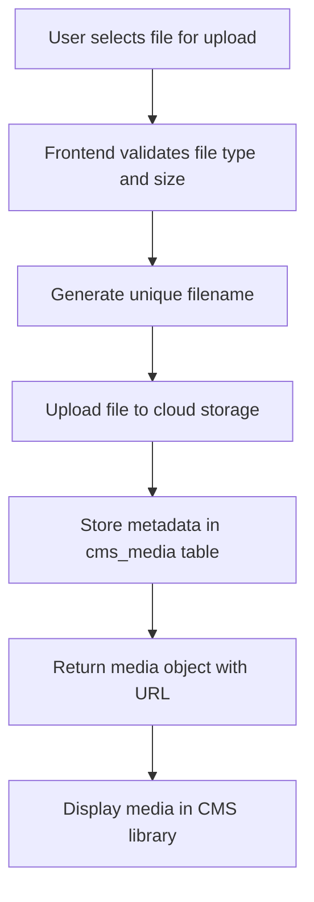
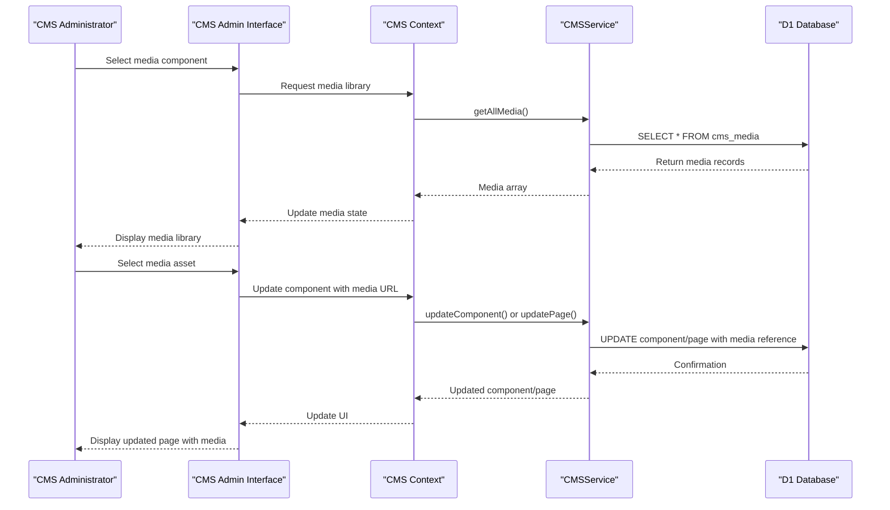
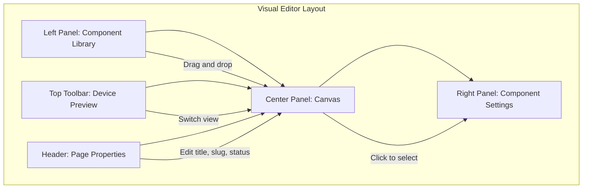
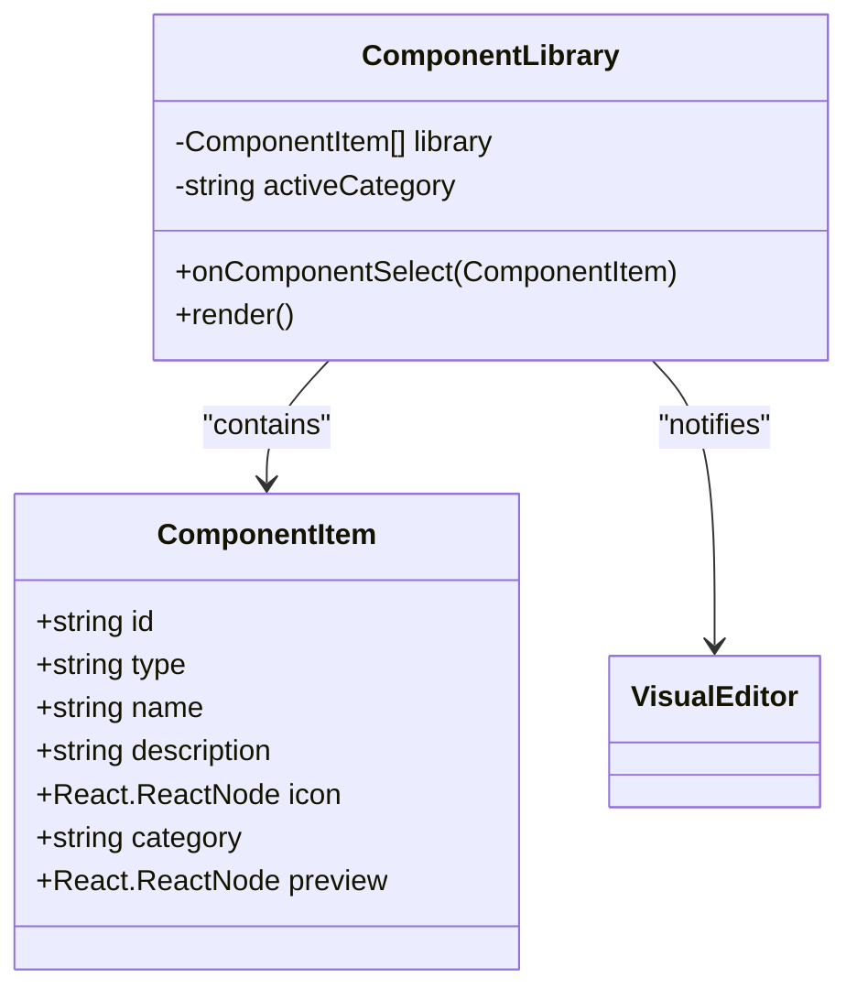
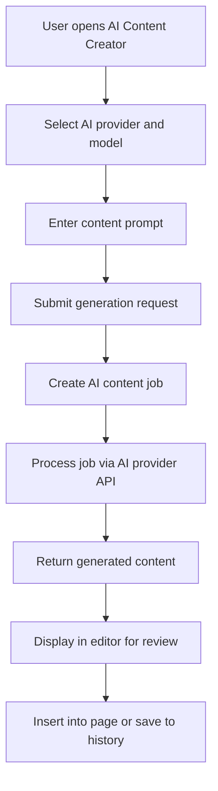
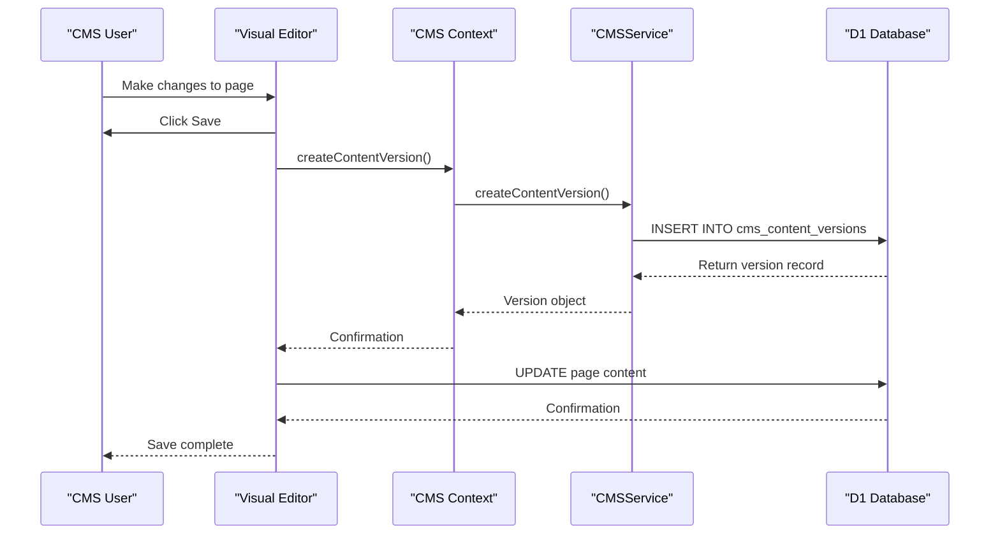

# CMS Media Management

<cite>
**Referenced Files in This Document**   
- [CMSAdminPanel.tsx](file://src/react-app/components/admin/CMSAdminPanel.tsx)
- [VisualEditor.tsx](file://src/react-app/components/cms/VisualEditor.tsx)
- [ComponentLibrary.tsx](file://src/react-app/components/cms/ComponentLibrary.tsx)
- [AIContentCreator.tsx](file://src/react-app/components/cms/AIContentCreator.tsx)
- [CMSContext.tsx](file://src/react-app/contexts/CMSContext.tsx)
- [cms-service.ts](file://src/shared/cms-service.ts)
- [types.ts](file://src/shared/types.ts)
- [README_CMS.md](file://src/shared/README_CMS.md)
</cite>

## Table of Contents
1. [Introduction](#introduction)
2. [Media Upload and Organization](#media-upload-and-organization)
3. [Media Usage Workflow](#media-usage-workflow)
4. [Visual Editor Interface](#visual-editor-interface)
5. [Component Library Integration](#component-library-integration)
6. [AI Content and Media Generation](#ai-content-and-media-generation)
7. [Content Versioning and History](#content-versioning-and-history)
8. [Troubleshooting Guide](#troubleshooting-guide)

## Introduction

The CMS Media Management system provides a comprehensive solution for handling media assets within the HabibiStay platform. This documentation details the complete workflow for media upload, organization, and usage through the CMS admin interface. The system is designed to enable content creators and administrators to efficiently manage visual content, integrate media into pages and components, and maintain version control for all media-related changes.

The CMS architecture follows a modular design with distinct components for media management, visual editing, and AI-powered content creation. The system leverages a React-based frontend with TypeScript, a Cloudflare Workers backend, and a D1 database for persistent storage. Media assets are stored externally with references maintained in the database, allowing for efficient retrieval and management.

**Section sources**
- [README_CMS.md](file://src/shared/README_CMS.md#L1-L133)

## Media Upload and Organization

The media management system provides a structured approach to uploading and organizing digital assets. Administrators can upload various media types including images, videos, and documents through the CMS admin interface. The system stores essential metadata for each media asset, including filename, original name, MIME type, file size, URL, alternative text, and caption.

The media upload process is handled through the `uploadMedia` function in the CMS context, which communicates with the backend service to store media references in the database. When a user uploads a media file, the system generates a unique filename and stores the file in cloud storage, while recording the metadata in the `cms_media` table.

**Diagram sources**
- [CMSContext.tsx](file://src/react-app/contexts/CMSContext.tsx#L300-L315)
- [cms-service.ts](file://src/shared/cms-service.ts#L250-L270)
- [types.ts](file://src/shared/types.ts#L640-L655)

The media organization system categorizes assets based on their properties and usage patterns. The CMS interface displays media files in a tabular format with columns for filename, MIME type, size, and actions. Users can filter and search through their media library to quickly locate specific assets. Each media item includes action buttons for previewing and deleting the asset.

The database schema for media management includes the following fields:
- **id**: Unique identifier for the media asset
- **filename**: System-generated filename for the stored file
- **original_name**: Original filename from the upload
- **mime_type**: MIME type of the file (e.g., image/jpeg, video/mp4)
- **size**: File size in bytes
- **url**: Public URL for accessing the media
- **alt_text**: Alternative text for accessibility
- **caption**: Descriptive caption for the media
- **created_by**: User ID of the uploader
- **created_at**: Timestamp of upload

**Section sources**
- [CMSAdminPanel.tsx](file://src/react-app/components/admin/CMSAdminPanel.tsx#L400-L430)
- [cms-service.ts](file://src/shared/cms-service.ts#L250-L270)
- [types.ts](file://src/shared/types.ts#L640-L655)

## Media Usage Workflow

The media usage workflow enables content creators to incorporate uploaded media into pages and components through a visual interface. The system provides multiple pathways for media integration, including direct selection from the media library and drag-and-drop functionality within the visual editor.

When creating or editing a page, users can insert media components such as images, galleries, and videos. The ComponentLibrary provides pre-configured media components that can be added to the page canvas. Each media component maintains a reference to the media asset through its URL property, allowing for dynamic rendering.

**Diagram sources**
- [VisualEditor.tsx](file://src/react-app/components/cms/VisualEditor.tsx#L300-L350)
- [CMSContext.tsx](file://src/react-app/contexts/CMSContext.tsx#L200-L250)
- [cms-service.ts](file://src/shared/cms-service.ts#L150-L200)

The media usage system supports responsive design principles, allowing different media assets or configurations for various device breakpoints (desktop, tablet, mobile). When a media component is selected in the visual editor, users can configure responsive properties such as different images for different screen sizes or adjusted layout properties.

Media assets can be reused across multiple pages and components, promoting consistency and reducing storage requirements. The system maintains referential integrity by tracking which pages and components reference each media asset. This enables impact analysis when considering media deletion, as the system can identify all dependent content.

**Section sources**
- [VisualEditor.tsx](file://src/react-app/components/cms/VisualEditor.tsx#L300-L350)
- [ComponentLibrary.tsx](file://src/react-app/components/cms/ComponentLibrary.tsx#L150-L200)

## Visual Editor Interface

The Visual Editor provides a WYSIWYG (What You See Is What You Get) interface for creating and editing content with integrated media management. The editor features a three-panel layout with a component library on the left, a canvas in the center, and component settings on the right.

The canvas area supports drag-and-drop functionality for adding components from the library. Users can also click on component previews in the library to add them directly to the canvas. Each component on the canvas is rendered with visual indicators when selected, including a border highlight and action buttons for duplication and deletion.

**Diagram sources**
- [VisualEditor.tsx](file://src/react-app/components/cms/VisualEditor.tsx#L100-L200)
- [ComponentLibrary.tsx](file://src/react-app/components/cms/ComponentLibrary.tsx#L100-L150)

The editor supports real-time preview across different device sizes through the device view selector in the toolbar. Users can toggle between desktop, tablet, and mobile views to ensure responsive design consistency. When switching device views, the editor applies responsive styles specific to that breakpoint, allowing for targeted adjustments.

The component settings panel provides granular control over media component properties. For image components, users can adjust padding, margin, background color, text alignment, and responsive properties. The settings are organized into tabs for general styling and responsive configuration, enabling focused editing based on the current task.

The visual editor implements a state management system that tracks changes to page content. Before saving, the editor serializes the component configuration into a JSON structure stored in the page's content field. This approach enables flexible content modeling while maintaining database efficiency.

**Section sources**
- [VisualEditor.tsx](file://src/react-app/components/cms/VisualEditor.tsx#L100-L800)

## Component Library Integration

The Component Library serves as a repository of reusable UI elements, including specialized media components. The library is organized into categories such as Layout, Content, Media, and Interactive, allowing users to quickly locate appropriate components for their needs.

Media-specific components in the library include:
- **Image**: Single image with optional caption
- **Gallery**: Grid of images with lightbox functionality
- **Map**: Interactive map with location markers
- **Property Card**: Card displaying property information with image

**Diagram sources**
- [ComponentLibrary.tsx](file://src/react-app/components/cms/ComponentLibrary.tsx#L10-L100)
- [VisualEditor.tsx](file://src/react-app/components/cms/VisualEditor.tsx#L10-L50)

The component library implements a category-based filtering system that allows users to narrow their view to specific component types. When a user selects a component from the library, the `onComponentSelect` callback passes the component definition to the visual editor, which creates a new instance on the canvas.

Each component in the library includes a visual preview that demonstrates its appearance and basic functionality. These previews are rendered using simplified versions of the actual components, providing users with a clear understanding of how the component will look when added to a page.

The component library is extensible, allowing developers to add new media components by defining them in the `componentLibrary` array. Each component definition includes metadata, an icon, and a preview rendering. This modular approach facilitates the addition of specialized media components such as video players, image carousels, or interactive media galleries.

**Section sources**
- [ComponentLibrary.tsx](file://src/react-app/components/cms/ComponentLibrary.tsx#L10-L300)

## AI Content and Media Generation

The CMS integrates AI-powered content creation capabilities that extend to media generation and enhancement. The AI Content Creator component allows users to generate text content that can be paired with media assets, creating cohesive multimedia experiences.

The AI system connects to external AI providers such as OpenAI, Anthropic, and Gemini through configured API endpoints. Users can select a provider and model, then input a prompt describing the desired content. The system creates an AI content job that is processed asynchronously, with the generated content returned for review and insertion.

**Diagram sources**
- [AIContentCreator.tsx](file://src/react-app/components/cms/AIContentCreator.tsx#L10-L100)
- [cms-service.ts](file://src/shared/cms-service.ts#L400-L450)

While the current implementation focuses on text content generation, the architecture supports integration with AI-powered media generation services. The system could be extended to generate images, videos, or audio content based on textual prompts, creating a comprehensive AI-powered media production workflow.

The AI content generation process includes safeguards such as content review before insertion and version tracking of generated content. Generated content is stored in the AI content history, allowing users to revisit and reuse previously generated material. This feature promotes consistency in tone and style across media-rich content.

**Section sources**
- [AIContentCreator.tsx](file://src/react-app/components/cms/AIContentCreator.tsx#L10-L350)
- [cms-service.ts](file://src/shared/cms-service.ts#L400-L500)

## Content Versioning and History

The CMS implements a comprehensive content versioning system that tracks changes to pages, templates, and components, including those involving media assets. Each time content is saved, a new version is created and stored in the `cms_content_versions` table, preserving the previous state.

The versioning system captures the following information for each version:
- **content_id**: ID of the content being versioned
- **content_type**: Type of content (page, template, component)
- **data**: JSON representation of the content
- **created_by**: User ID of the person saving the version
- **created_at**: Timestamp of version creation
- **comment**: Optional comment describing the changes

**Diagram sources**
- [VisualEditor.tsx](file://src/react-app/components/cms/VisualEditor.tsx#L200-L250)
- [CMSContext.tsx](file://src/react-app/contexts/CMSContext.tsx#L400-L420)
- [cms-service.ts](file://src/shared/cms-service.ts#L270-L290)

The version history interface allows users to browse previous versions of content, view the changes made, and restore earlier versions if needed. This feature is particularly valuable for media management, as it enables recovery from accidental deletions or unwanted modifications to media configurations.

The system automatically creates a version when saving content, but users can also add descriptive comments to explain significant changes. This practice enhances collaboration by providing context for content evolution over time. The version history is accessible through the Visual Editor's versions tab, where users can see a chronological list of all saved versions with timestamps and comments.

**Section sources**
- [VisualEditor.tsx](file://src/react-app/components/cms/VisualEditor.tsx#L150-L200)
- [cms-service.ts](file://src/shared/cms-service.ts#L270-L300)

## Troubleshooting Guide

This section addresses common issues encountered when managing media assets through the CMS admin interface and provides solutions for resolution.

### Media Upload Failures
**Symptoms**: Upload progress hangs, error message appears, or file doesn't appear in library.
**Solutions**:
1. Check file size limits (maximum 10MB for images, 50MB for videos)
2. Verify supported file types (JPG, PNG, GIF, SVG for images; MP4, WebM for videos)
3. Ensure stable internet connection
4. Clear browser cache and retry
5. Check browser console for specific error messages

### Media Not Displaying on Pages
**Symptoms**: Media component shows placeholder instead of image.
**Solutions**:
1. Verify the media URL is correct and accessible
2. Check that the media asset hasn't been deleted
3. Ensure proper component configuration in the JSON structure
4. Validate that the media component type matches the asset type
5. Test the media URL directly in a browser tab

### Responsive Media Issues
**Symptoms**: Media appears correctly on one device view but not others.
**Solutions**:
1. Check responsive settings in the component properties panel
2. Verify that responsive styles are properly configured for each breakpoint
3. Ensure the canvas device view matches the intended target
4. Test on actual devices if possible
5. Validate that media URLs are accessible across all environments

### Performance Optimization
For optimal media management performance:
1. Compress images before upload (use WebP format when possible)
2. Use appropriately sized images for their intended display size
3. Limit the number of high-resolution images on a single page
4. Implement lazy loading for images below the fold
5. Use CDN-hosted media URLs when available

### Permission Issues
**Symptoms**: Unable to upload, edit, or delete media assets.
**Solutions**:
1. Verify user has appropriate CMS permissions (admin role required)
2. Check that the CMS session is still active
3. Ensure API endpoints are properly authenticated
4. Contact system administrator if permission escalation is needed

**Section sources**
- [CMSAdminPanel.tsx](file://src/react-app/components/admin/CMSAdminPanel.tsx)
- [VisualEditor.tsx](file://src/react-app/components/cms/VisualEditor.tsx)
- [CMSContext.tsx](file://src/react-app/contexts/CMSContext.tsx)
- [cms-service.ts](file://src/shared/cms-service.ts)