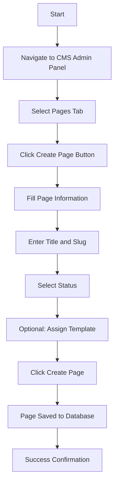
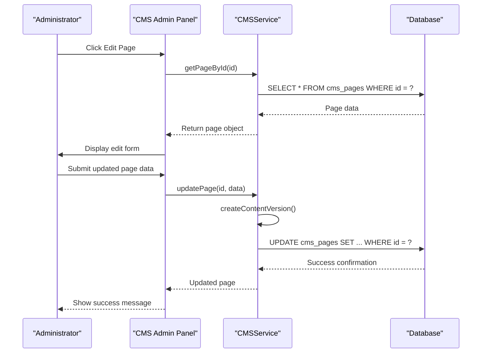
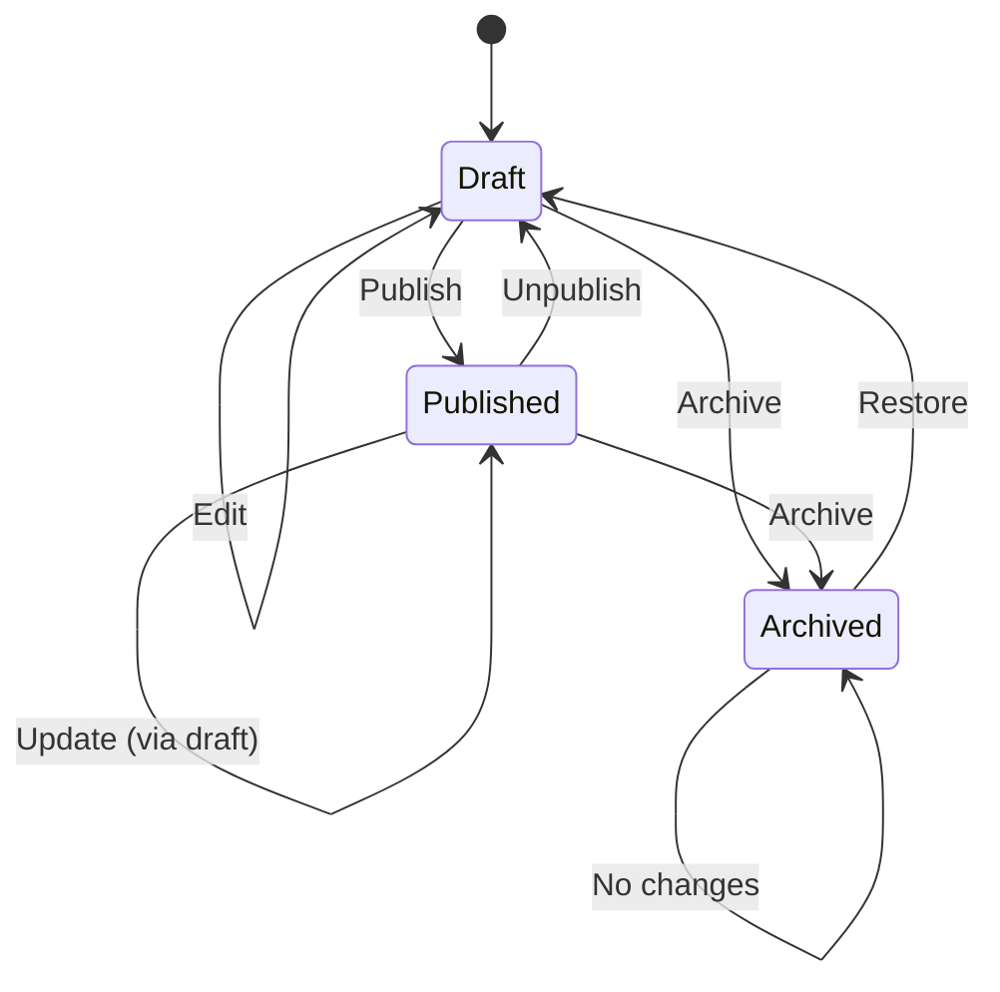
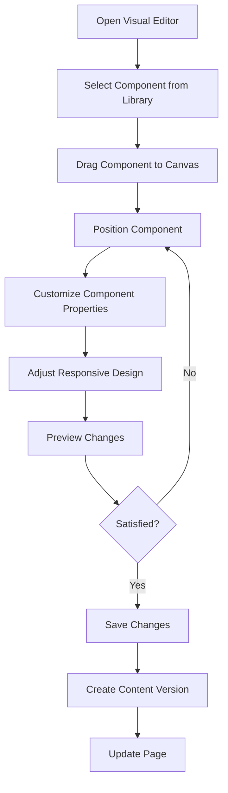
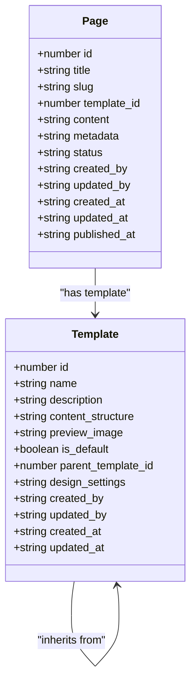
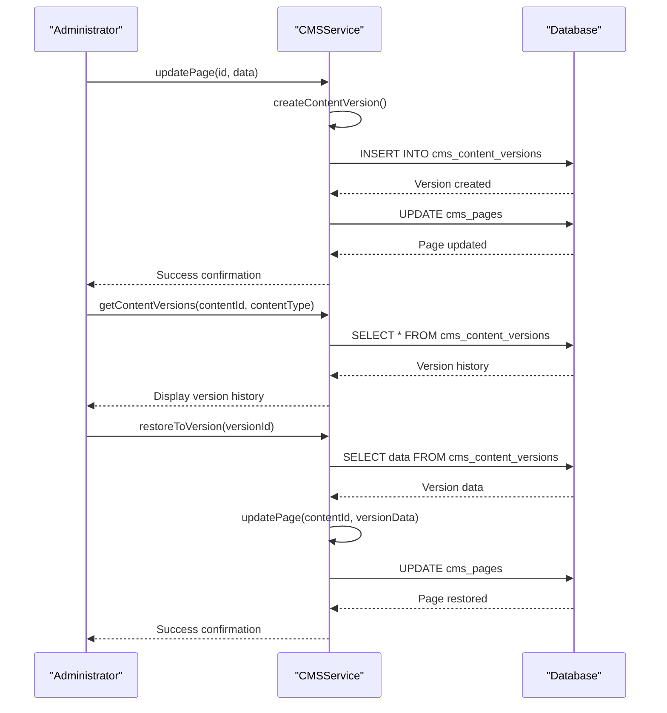
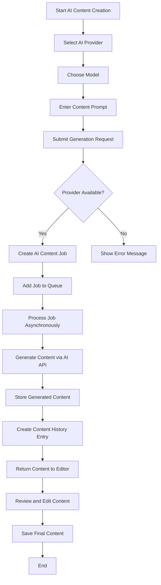
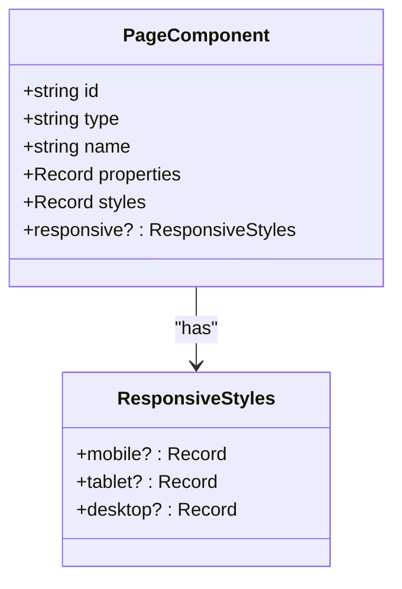
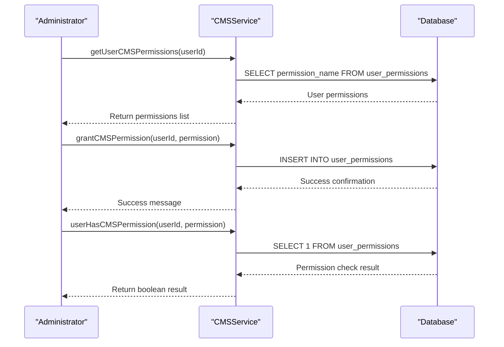

# CMS Pages Management

<cite>
**Referenced Files in This Document**   
- [CMS_IMPLEMENTATION.md](file://CMS_IMPLEMENTATION.md)
- [CMS_FEATURES_SUMMARY.md](file://CMS_FEATURES_SUMMARY.md)
- [CMS_COMPLETED_WORK.md](file://CMS_COMPLETED_WORK.md)
- [CMS_PROGRESS_SUMMARY.md](file://CMS_PROGRESS_SUMMARY.md)
- [CMS_RESPONSIVE_DESIGN_COMPLETED.md](file://CMS_RESPONSIVE_DESIGN_COMPLETED.md)
- [src/shared/cms-service.ts](file://src/shared/cms-service.ts)
- [src/shared/types.ts](file://src/shared/types.ts)
- [src/react-app/components/admin/CMSAdminPanel.tsx](file://src/react-app/components/admin/CMSAdminPanel.tsx)
- [src/worker/index.ts](file://src/worker/index.ts)
- [src/shared/cms-permissions-service.ts](file://src/shared/cms-permissions-service.ts)
- [src/react-app/components/cms/README_RESPONSIVE.md](file://src/react-app/components/cms/README_RESPONSIVE.md)
- [migrations/11.sql](file://migrations/11.sql)
</cite>

## Table of Contents
1. [Introduction](#introduction)
2. [Page Creation Workflow](#page-creation-workflow)
3. [Page Editing Process](#page-editing-process)
4. [Publishing and Status Management](#publishing-and-status-management)
5. [Visual Editing Interface](#visual-editing-interface)
6. [Template System](#template-system)
7. [Content Versioning](#content-versioning)
8. [AI Content Creation](#ai-content-creation)
9. [Responsive Design Controls](#responsive-design-controls)
10. [User Permission Management](#user-permission-management)
11. [API Endpoints](#api-endpoints)
12. [Troubleshooting Guide](#troubleshooting-guide)
13. [Best Practices](#best-practices)

## Introduction

The HabibiStay CMS provides a comprehensive content management system that enables administrators to create, edit, and manage website pages through a user-friendly interface without requiring coding knowledge. This documentation covers the complete workflow for managing CMS pages, including creation, editing, publishing, and status management. The system includes advanced features such as AI-powered content creation, responsive design controls, content versioning, and role-based access control.

The CMS architecture consists of a backend service layer that handles all CRUD operations for CMS entities, RESTful API endpoints that expose these operations, and a React-based frontend interface that provides a visual editor for content management. The system is designed to be intuitive for content administrators while providing robust functionality for advanced content management needs.

**Section sources**
- [CMS_IMPLEMENTATION.md](file://CMS_IMPLEMENTATION.md)
- [CMS_FEATURES_SUMMARY.md](file://CMS_FEATURES_SUMMARY.md)
- [CMS_COMPLETED_WORK.md](file://CMS_COMPLETED_WORK.md)

## Page Creation Workflow

Creating a new page in the HabibiStay CMS involves several steps through the admin interface. The process begins by navigating to the CMS admin panel and selecting the "Pages" tab, where administrators can initiate the page creation process.

### Step-by-Step Creation Process

1. **Navigate to CMS Admin Panel**: Access the admin dashboard and select the "Content Management" section.
2. **Select Pages Tab**: Click on the "Pages" tab in the CMS interface.
3. **Initiate Creation**: Click the "Create Page" button to open the page creation form.
4. **Fill Required Information**: Enter the page title, slug, and select the status (draft, published, or archived).
5. **Assign Template**: Optionally select a template from the available templates to define the page layout.
6. **Save Page**: Click "Create Page" to save the new page to the database.

The page creation form requires the following fields:
- **Title**: The display title of the page (required)
- **Slug**: The URL-friendly identifier for the page (required)
- **Status**: The current status of the page (draft, published, or archived)
- **Template**: Optional template assignment for page layout

When a page is created, it is stored in the `cms_pages` database table with all relevant metadata. The system automatically generates timestamps for creation and updates, and tracks the user who created the page.



**Diagram sources**
- [src/react-app/components/admin/CMSAdminPanel.tsx](file://src/react-app/components/admin/CMSAdminPanel.tsx#L200-L250)
- [src/shared/cms-service.ts](file://src/shared/cms-service.ts#L40-L75)
- [migrations/11.sql](file://migrations/11.sql)

**Section sources**
- [src/react-app/components/admin/CMSAdminPanel.tsx](file://src/react-app/components/admin/CMSAdminPanel.tsx)
- [src/shared/cms-service.ts](file://src/shared/cms-service.ts#L40-L75)

## Page Editing Process

The page editing process in the HabibiStay CMS allows administrators to modify existing pages through both a form-based interface and a visual editor. The system provides two distinct editing modes to accommodate different content management needs.

### Form-Based Editing

Form-based editing is accessed by clicking the edit icon next to a page in the pages list. This opens a form with all page properties that can be modified:

- **Title**: Modify the page display title
- **Slug**: Update the URL identifier (caution: changing slug affects page URL)
- **Status**: Change the publication status
- **Template**: Reassign the page to a different template
- **Content**: Edit the page content in JSON format
- **Metadata**: Update page metadata such as SEO information

When changes are submitted, the system creates a new content version automatically, preserving the previous version for potential rollback.

### Visual Editing

The visual editor provides a drag-and-drop interface for page content management. To access the visual editor:

1. Click the "Visual Edit" button for the desired page
2. The editor loads the page with its assigned template
3. Use the component library to add new elements to the page
4. Drag and drop components to rearrange layout
5. Click on components to modify their properties
6. Use the responsive design controls to adjust styling for different device sizes
7. Save changes to update the page

The visual editor includes a component library with pre-built UI elements such as text blocks, image galleries, call-to-action buttons, and property listings. Each component can be customized with specific properties and styles.



**Diagram sources**
- [src/react-app/components/admin/CMSAdminPanel.tsx](file://src/react-app/components/admin/CMSAdminPanel.tsx#L500-L550)
- [src/shared/cms-service.ts](file://src/shared/cms-service.ts#L77-L105)
- [src/worker/index.ts](file://src/worker/index.ts#L770-L799)

**Section sources**
- [src/react-app/components/admin/CMSAdminPanel.tsx](file://src/react-app/components/admin/CMSAdminPanel.tsx)
- [src/shared/cms-service.ts](file://src/shared/cms-service.ts#L77-L105)

## Publishing and Status Management

The HabibiStay CMS implements a comprehensive status management system that controls page visibility and publication state. Pages can exist in one of three statuses: draft, published, or archived.

### Status Definitions

- **Draft**: Pages in draft status are only visible to administrators in the CMS interface. They are not accessible to the public and do not appear in search results.
- **Published**: Pages in published status are publicly accessible at their designated URL (`/page/:slug`). They are indexed by search engines and available to all website visitors.
- **Archived**: Pages in archived status are removed from public view but retained in the database for potential future reference or restoration.

### Publishing Workflow

The publishing workflow allows administrators to control when content becomes publicly available:

1. **Create in Draft**: New pages are automatically created with "draft" status
2. **Edit and Review**: Make content changes while the page remains in draft status
3. **Preview**: Use the preview function to see how the page will appear when published
4. **Publish**: Change the status to "published" to make the page publicly accessible
5. **Update**: Make changes to published pages, which can be saved as draft updates before republishing
6. **Archive**: Remove a page from public view by changing its status to "archived"

The system prevents direct editing of published pages to maintain content integrity. When a published page needs updates, administrators must first change its status to "draft," make the necessary changes, and then republish it.

### API Access Control

The CMS API enforces strict access control based on page status:
- Admin endpoints (`/api/cms/pages`) return all pages regardless of status
- Public endpoint (`/api/cms/pages/slug/:slug`) only returns pages with "published" status
- Authentication is required for all admin operations
- Only users with "admin" role can modify page status



**Diagram sources**
- [src/shared/cms-service.ts](file://src/shared/cms-service.ts#L50-L55)
- [src/worker/index.ts](file://src/worker/index.ts#L770-L799)
- [src/shared/types.ts](file://src/shared/types.ts#L600-L605)

**Section sources**
- [src/shared/cms-service.ts](file://src/shared/cms-service.ts#L50-L55)
- [src/worker/index.ts](file://src/worker/index.ts#L770-L799)

## Visual Editing Interface

The visual editing interface is a core component of the HabibiStay CMS, providing a user-friendly way to create and modify page content without requiring HTML or CSS knowledge. The interface combines drag-and-drop functionality with real-time preview capabilities.

### Key Features

- **Drag-and-Drop Components**: Add and arrange page elements by dragging them from the component library
- **Real-Time Preview**: See changes immediately as they are made
- **Component Customization**: Modify component properties through an intuitive interface
- **Layout Management**: Adjust page layout with visual tools
- **Responsive Design Controls**: Customize appearance for different device sizes

### Component Library

The component library includes a variety of pre-built elements that can be added to pages:

- **Text Block**: For paragraphs, headings, and other text content
- **Image Gallery**: For displaying multiple images
- **Call-to-Action Button**: For interactive elements
- **Property Listing**: For showcasing available properties
- **Testimonial Carousel**: For displaying customer reviews
- **Contact Form**: For lead generation
- **Map Integration**: For showing property locations

Each component has customizable properties that can be modified through the editing interface, such as text content, colors, fonts, spacing, and alignment.

### Workflow

1. **Enter Visual Editor**: Click "Visual Edit" on a page in the CMS panel
2. **Select Components**: Browse the component library and select elements to add
3. **Add Components**: Drag components onto the page canvas
4. **Arrange Layout**: Position components by dragging them to the desired location
5. **Customize Properties**: Click on components to modify their appearance and behavior
6. **Adjust Responsive Design**: Use device preview to customize appearance for mobile, tablet, and desktop
7. **Save Changes**: Commit changes to the page

The visual editor automatically saves content versions with each significant change, allowing for easy rollback if needed.



**Diagram sources**
- [src/react-app/components/admin/CMSAdminPanel.tsx](file://src/react-app/components/admin/CMSAdminPanel.tsx#L650-L680)
- [src/react-app/components/cms/VisualEditor.tsx](file://src/react-app/components/cms/VisualEditor.tsx)
- [src/shared/types.ts](file://src/shared/types.ts#L620-L635)

**Section sources**
- [src/react-app/components/admin/CMSAdminPanel.tsx](file://src/react-app/components/admin/CMSAdminPanel.tsx)
- [src/react-app/components/cms/VisualEditor.tsx](file://src/react-app/components/cms/VisualEditor.tsx)

## Template System

The template system in the HabibiStay CMS provides a way to maintain consistent design and layout across multiple pages. Templates define the overall structure and styling of pages, allowing for efficient content creation and brand consistency.

### Template Features

- **Visual Template Editor**: Create and modify templates with a user-friendly interface
- **Pre-built Component Library**: Access commonly used UI elements
- **Template Inheritance**: Create child templates that inherit from parent templates
- **Responsive Design Controls**: Customize template appearance for different device sizes
- **Color Scheme and Typography**: Define brand-specific styling

### Template Creation

To create a new template:

1. Navigate to the "Templates" tab in the CMS admin panel
2. Click "Create Template"
3. Enter template name and description
4. Define content structure using JSON format
5. Upload a preview image
6. Set as default template (optional)
7. Save the template

### Template Inheritance

The template inheritance system allows for hierarchical template organization:

- **Parent Templates**: Define base layout and styling
- **Child Templates**: Inherit from parent templates and override specific elements
- **Customization**: Child templates can modify specific sections while maintaining overall structure

This approach enables efficient template management, where changes to a parent template automatically propagate to all child templates, while still allowing for page-specific customization.

### Template Assignment

Templates can be assigned to pages during creation or editing:

- New pages can be created with a specific template
- Existing pages can have their template changed
- Pages without a template assignment use the default template
- Template changes affect page layout but preserve page content



**Diagram sources**
- [src/shared/types.ts](file://src/shared/types.ts#L606-L620)
- [src/shared/cms-service.ts](file://src/shared/cms-service.ts#L107-L142)
- [migrations/11.sql](file://migrations/11.sql)

**Section sources**
- [src/shared/types.ts](file://src/shared/types.ts#L606-L620)
- [src/shared/cms-service.ts](file://src/shared/cms-service.ts#L107-L142)

## Content Versioning

The HabibiStay CMS includes a robust content versioning system that tracks changes to pages and other content entities, enabling rollback to previous versions and maintaining a complete history of content modifications.

### Versioning Features

- **Automatic Version Creation**: A new version is created whenever content is saved
- **Version History Tracking**: All previous versions are stored with timestamps and author information
- **Content Rollback**: Ability to restore content to any previous version
- **Version Comparison**: Side-by-side comparison of different versions
- **Commenting**: Add comments to explain the purpose of changes

### Version Data Structure

Each content version includes the following information:
- **Content ID**: The ID of the content item (page, template, etc.)
- **Content Type**: The type of content (page, template, component)
- **Data**: The complete content data in JSON format
- **Created By**: The user who made the changes
- **Created At**: Timestamp of when the version was created
- **Comment**: Optional comment explaining the changes

### Version Management Workflow

1. **Edit Content**: Make changes to a page or other content
2. **Save Changes**: When saving, the system automatically creates a new version
3. **View History**: Access the version history from the content editing interface
4. **Compare Versions**: Select two versions to compare differences
5. **Restore Version**: Choose a previous version to restore the content
6. **Add Comment**: Optionally add a comment when creating a new version

The versioning system is integrated with the content editing workflow, ensuring that no changes are lost and providing a safety net for content administrators.



**Diagram sources**
- [src/shared/cms-service.ts](file://src/shared/cms-service.ts#L255-L278)
- [src/worker/index.ts](file://src/worker/index.ts#L1480-L1499)
- [src/shared/types.ts](file://src/shared/types.ts#L640-L648)

**Section sources**
- [src/shared/cms-service.ts](file://src/shared/cms-service.ts#L255-L278)
- [src/worker/index.ts](file://src/worker/index.ts#L1480-L1499)

## AI Content Creation

The HabibiStay CMS includes advanced AI-powered content creation capabilities that integrate with multiple AI providers to generate and edit content automatically.

### AI Integration Features

- **Multi-Provider Support**: Integration with OpenAI, Claude, Gemini, and OpenRouter
- **Automatic Model Selection**: Intelligent selection of the best model for each task
- **Content Generation**: Create new content from prompts
- **Content Editing**: Refine and improve existing content
- **AI Content History**: Track all AI-generated content and revisions
- **Provider and Model Management**: Configure and manage AI providers

### AI Content Workflow

1. **Access AI Content Creator**: Click the "Generate Content" button in the AI tab
2. **Select AI Provider**: Choose from available AI providers
3. **Select Model**: Choose a specific model from the selected provider
4. **Enter Prompt**: Provide a detailed description of the desired content
5. **Generate Content**: Submit the request to create content
6. **Review and Edit**: Examine the generated content and make manual adjustments
7. **Save Content**: Save the final content to the appropriate page or component

### AI Provider Management

The CMS allows administrators to manage AI providers through the admin interface:

- **Add New Providers**: Configure new AI providers with API keys and endpoints
- **Enable/Disable Providers**: Control which providers are available for content generation
- **Set Default Models**: Specify default models for each provider
- **Monitor Performance**: Track usage and performance metrics for different models

The AI content system processes requests asynchronously, with a job queue that handles content generation tasks. This ensures that the CMS interface remains responsive even when generating complex content.



**Diagram sources**
- [src/shared/cms-service.ts](file://src/shared/cms-service.ts#L360-L440)
- [src/shared/ai-content-service.ts](file://src/shared/ai-content-service.ts)
- [src/react-app/components/cms/AIContentCreator.tsx](file://src/react-app/components/cms/AIContentCreator.tsx)

**Section sources**
- [src/shared/cms-service.ts](file://src/shared/cms-service.ts#L360-L440)
- [src/shared/ai-content-service.ts](file://src/shared/ai-content-service.ts)

## Responsive Design Controls

The responsive design system in the HabibiStay CMS allows content creators to customize how components appear on different device sizes without writing any code. This ensures that all pages look great on smartphones, tablets, and desktop computers.

### Responsive Design Features

- **Device-Specific Styling**: Apply different styles for mobile, tablet, and desktop views
- **Breakpoint Customization**: Define custom breakpoints for responsive behavior
- **Property-Specific Adjustments**: Modify specific properties (padding, font size, etc.) for each device type
- **Real-Time Device Preview**: Switch between device views to preview changes
- **Visual Device Switching**: Easy toggling between different device previews

### Implementation Details

The responsive design system is implemented through an extended component data structure that includes device-specific styling:

```typescript
interface PageComponent {
  id: string;
  type: string;
  name: string;
  properties: Record<string, any>;
  styles: Record<string, any>;
  responsive?: {
    mobile?: Record<string, any>;
    tablet?: Record<string, any>;
    desktop?: Record<string, any>;
  };
}
```

When rendering components, the system applies styles in the following order:
1. Base styles from the `styles` property
2. Device-specific overrides from the `responsive` property based on the current viewport size

### Default Breakpoints

The system uses the following default breakpoints:
- **Mobile**: Up to 768px (smartphones and small screens)
- **Tablet**: 769px to 1024px (tablets and medium screens)
- **Desktop**: 1025px and above (desktop computers and large screens)

These breakpoints can be customized in the template settings for specific design requirements.

### Usage Workflow

1. **Select Component**: Choose a component in the visual editor
2. **Open Responsive Tab**: Click on the "Responsive" tab in the settings panel
3. **Choose Device Type**: Select the device type to customize (mobile, tablet, desktop)
4. **Adjust Properties**: Modify the desired properties for the selected device
5. **Preview Changes**: Switch between device views to see the impact of changes
6. **Save**: Commit the responsive design changes

The system follows a mobile-first approach, encouraging content creators to start with mobile styles and progressively enhance for larger screens.



**Diagram sources**
- [src/react-app/components/cms/README_RESPONSIVE.md](file://src/react-app/components/cms/README_RESPONSIVE.md)
- [src/shared/types.ts](file://src/shared/types.ts#L620-L635)
- [CMS_RESPONSIVE_DESIGN_COMPLETED.md](file://CMS_RESPONSIVE_DESIGN_COMPLETED.md)

**Section sources**
- [src/react-app/components/cms/README_RESPONSIVE.md](file://src/react-app/components/cms/README_RESPONSIVE.md)
- [CMS_RESPONSIVE_DESIGN_COMPLETED.md](file://CMS_RESPONSIVE_DESIGN_COMPLETED.md)

## User Permission Management

The HabibiStay CMS implements a comprehensive role-based access control (RBAC) system that manages user permissions for CMS operations. This ensures that only authorized users can perform specific actions within the content management system.

### Permission System Features

- **Role-Based Access Control**: Users are assigned roles that determine their permissions
- **Fine-Grained Permissions**: Specific permissions for different CMS operations
- **Permission Granting and Revocation**: Administrators can assign or remove permissions
- **Permission-Based UI Access**: Interface elements are shown or hidden based on user permissions
- **User Permission Assignment**: Manage permissions for individual users

### Permission Types

The CMS defines several permission categories:
- **cms.pages.read**: View pages in the admin interface
- **cms.pages.write**: Create, edit, and delete pages
- **cms.pages.publish**: Change page status and publish content
- **cms.templates.manage**: Manage templates
- **cms.components.manage**: Manage components
- **cms.media.manage**: Manage media assets
- **cms.ai.manage**: Manage AI providers and models
- **cms.permissions.manage**: Manage user permissions

### Permission Management Workflow

1. **Access Permissions Tab**: Navigate to the "Permissions" tab in the CMS admin panel
2. **View User Permissions**: See all permissions assigned to the current user
3. **Grant Permissions**: Assign permissions to other users
4. **Revoke Permissions**: Remove permissions from users
5. **View Users with Permission**: See all users who have a specific permission

The permission system is enforced at both the API and UI levels. API endpoints validate user permissions before processing requests, and the admin interface hides or disables UI elements based on the user's permissions.



**Diagram sources**
- [src/shared/cms-permissions-service.ts](file://src/shared/cms-permissions-service.ts)
- [src/worker/index.ts](file://src/worker/index.ts#L1525-L1607)
- [src/shared/types.ts](file://src/shared/types.ts#L650-L670)

**Section sources**
- [src/shared/cms-permissions-service.ts](file://src/shared/cms-permissions-service.ts)
- [src/worker/index.ts](file://src/worker/index.ts#L1525-L1607)

## API Endpoints

The HabibiStay CMS exposes a comprehensive set of RESTful API endpoints that enable programmatic access to all CMS functionality. These endpoints follow standard HTTP methods and return consistent JSON responses.

### Authentication and Authorization

All CMS admin endpoints require authentication and are protected by role-based access control:
- **Authentication**: JWT-based authentication for all requests
- **Authorization**: Only users with 'admin' role can access CMS admin endpoints
- **Public Access**: Limited to published content through specific public endpoints

### Pages Endpoints

- **GET /api/cms/pages**: List all pages (admin only)
- **GET /api/cms/pages/:id**: Get specific page by ID (admin only)
- **POST /api/cms/pages**: Create new page (admin only)
- **PUT /api/cms/pages/:id**: Update page (admin only)
- **DELETE /api/cms/pages/:id**: Delete page (admin only)
- **GET /api/cms/pages/slug/:slug**: Get published page by slug (public)

### Templates Endpoints

- **GET /api/cms/templates**: List all templates (admin only)
- **GET /api/cms/templates/:id**: Get specific template (admin only)
- **POST /api/cms/templates**: Create new template (admin only)
- **PUT /api/cms/templates/:id**: Update template (admin only)
- **DELETE /api/cms/templates/:id**: Delete template (admin only)

### Components Endpoints

- **GET /api/cms/components**: List all components (admin only)
- **GET /api/cms/components/:id**: Get specific component (admin only)
- **POST /api/cms/components**: Create new component (admin only)
- **PUT /api/cms/components/:id**: Update component (admin only)
- **DELETE /api/cms/components/:id**: Delete component (admin only)

### Media Endpoints

- **GET /api/cms/media**: List all media assets (admin only)
- **GET /api/cms/media/:id**: Get specific media asset (admin only)
- **POST /api/cms/media**: Upload new media (admin only)
- **DELETE /api/cms/media/:id**: Delete media asset (admin only)

### AI Endpoints

- **GET /api/cms/ai/providers**: List all AI providers (admin only)
- **GET /api/cms/ai/providers/:id**: Get specific AI provider (admin only)
- **POST /api/cms/ai/providers**: Create new AI provider (admin only)
- **PUT /api/cms/ai/providers/:id**: Update AI provider (admin only)
- **DELETE /api/cms/ai/providers/:id**: Delete AI provider (admin only)
- **GET /api/cms/ai/providers/:providerId/models**: List models for a provider (admin only)
- **POST /api/cms/ai/models**: Create new AI model (admin only)
- **PUT /api/cms/ai/models/:id**: Update AI model (admin only)
- **DELETE /api/cms/ai/models/:id**: Delete AI model (admin only)
- **GET /api/cms/ai/jobs**: List pending content jobs (admin only)
- **POST /api/cms/ai/generate**: Create new content generation job (admin only)
- **PUT /api/cms/ai/jobs/:id**: Update content job (admin only)

### Permissions Endpoints

- **GET /api/cms/permissions**: Get all CMS permissions for current user (admin only)
- **GET /api/cms/permissions/all**: Get all available CMS permissions (admin only)
- **GET /api/cms/permissions/check/:permission**: Check if user has specific CMS permission (admin only)
- **POST /api/cms/permissions/grant**: Grant CMS permission to user (admin only)
- **POST /api/cms/permissions/revoke**: Revoke CMS permission from user (admin only)
- **GET /api/cms/permissions/users/:permission**: Get users with specific CMS permission (admin only)

All API endpoints return a consistent response format:
```json
{
  "success": boolean,
  "data": any,
  "error": string,
  "message": string
}
```

**Section sources**
- [CMS_IMPLEMENTATION.md](file://CMS_IMPLEMENTATION.md)
- [src/worker/index.ts](file://src/worker/index.ts#L770-L1607)

## Troubleshooting Guide

This section provides solutions to common issues encountered when managing pages through the CMS admin interface.

### Common Issues and Solutions

**Issue: Page not appearing on the website**
- **Cause**: Page status is not set to "published"
- **Solution**: Edit the page and change its status to "published"

**Issue: Changes not saving**
- **Cause**: Permission issues or network connectivity problems
- **Solution**: 
  1. Verify you have the necessary permissions
  2. Check your internet connection
  3. Refresh the page and try again
  4. Check browser console for error messages

**Issue: Visual editor not loading**
- **Cause**: Browser compatibility issues or cached JavaScript files
- **Solution**:
  1. Try a different browser (Chrome, Firefox, or Safari)
  2. Clear browser cache and reload the page
  3. Disable browser extensions that might interfere

**Issue: Image not displaying**
- **Cause**: Incorrect URL or missing media asset
- **Solution**:
  1. Verify the image URL is correct
  2. Check if the image exists in the media library
  3. Re-upload the image if necessary

**Issue: Template changes not applying**
- **Cause**: Page is not assigned to the updated template
- **Solution**:
  1. Edit the page and verify it's assigned to the correct template
  2. If using template inheritance, ensure the parent template is properly configured

**Issue: AI content generation failing**
- **Cause**: AI provider configuration issues or rate limiting
- **Solution**:
  1. Verify the AI provider is enabled and has a valid API key
  2. Check if you've reached rate limits for the AI service
  3. Try a different AI provider or model

### Error Handling

The CMS provides clear error messages for common issues:
- **Authentication errors**: "Access denied - please log in"
- **Permission errors**: "You don't have permission to perform this action"
- **Validation errors**: Specific messages about missing or invalid fields
- **Server errors**: "An error occurred - please try again later"

When encountering persistent issues, administrators should:
1. Check the browser console for detailed error messages
2. Verify API endpoints are accessible
3. Confirm database connectivity
4. Review server logs for backend errors

**Section sources**
- [CMS_IMPLEMENTATION.md](file://CMS_IMPLEMENTATION.md)
- [src/shared/cms-service.ts](file://src/shared/cms-service.ts)
- [src/worker/index.ts](file://src/worker/index.ts)

## Best Practices

Following these best practices will help ensure efficient and effective content management through the CMS.

### Content Creation Best Practices

- **Use Descriptive Slugs**: Create URL-friendly slugs that describe the page content
- **Maintain Consistent Branding**: Follow brand guidelines for colors, fonts, and tone
- **Optimize for SEO**: Include relevant keywords in page titles and content
- **Use Alt Text for Images**: Improve accessibility and SEO with descriptive alt text
- **Mobile-First Design**: Design for mobile devices first, then enhance for larger screens

### Workflow Best Practices

- **Work in Draft Mode**: Make significant changes in draft status before publishing
- **Use Content Versions**: Leverage the versioning system to track changes
- **Preview Before Publishing**: Always preview changes before making them public
- **Schedule Content Updates**: Plan content updates in advance for consistency
- **Collaborate Effectively**: Use comments and version notes to communicate with team members

### Technical Best Practices

- **Optimize Media Files**: Compress images and videos to improve page load times
- **Use Templates Wisely**: Create reusable templates for consistent page layouts
- **Organize Components**: Maintain a well-organized component library
- **Monitor Performance**: Regularly check page load times and fix performance issues
- **Backup Regularly**: Ensure regular backups of CMS content

### Security Best Practices

- **Limit Admin Access**: Only grant admin permissions to trusted users
- **Rotate API Keys**: Regularly update API keys for AI providers and other services
- **Review Permissions**: Periodically review user permissions and remove unnecessary access
- **Monitor Activity**: Regularly check audit logs for suspicious activity
- **Keep Software Updated**: Ensure the CMS and all dependencies are up to date

By following these best practices, content administrators can maintain a high-quality, secure, and efficient content management workflow.

**Section sources**
- [CMS_FEATURES_SUMMARY.md](file://CMS_FEATURES_SUMMARY.md)
- [CMS_COMPLETED_WORK.md](file://CMS_COMPLETED_WORK.md)
- [CMS_IMPLEMENTATION.md](file://CMS_IMPLEMENTATION.md)