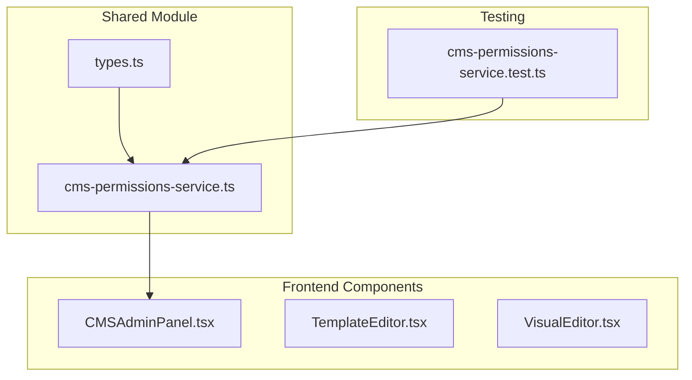
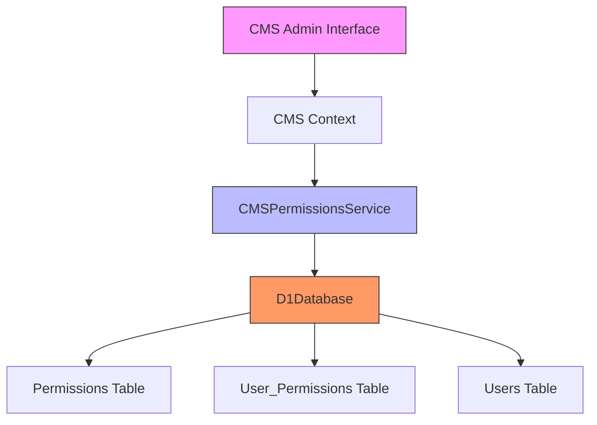
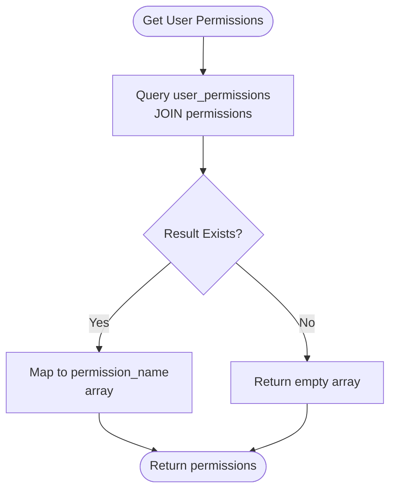
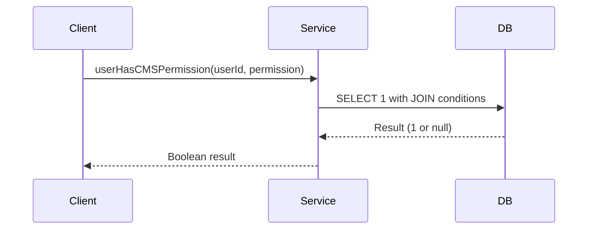
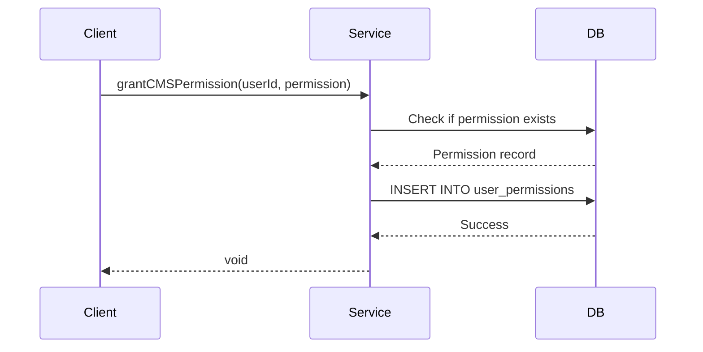
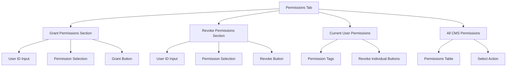
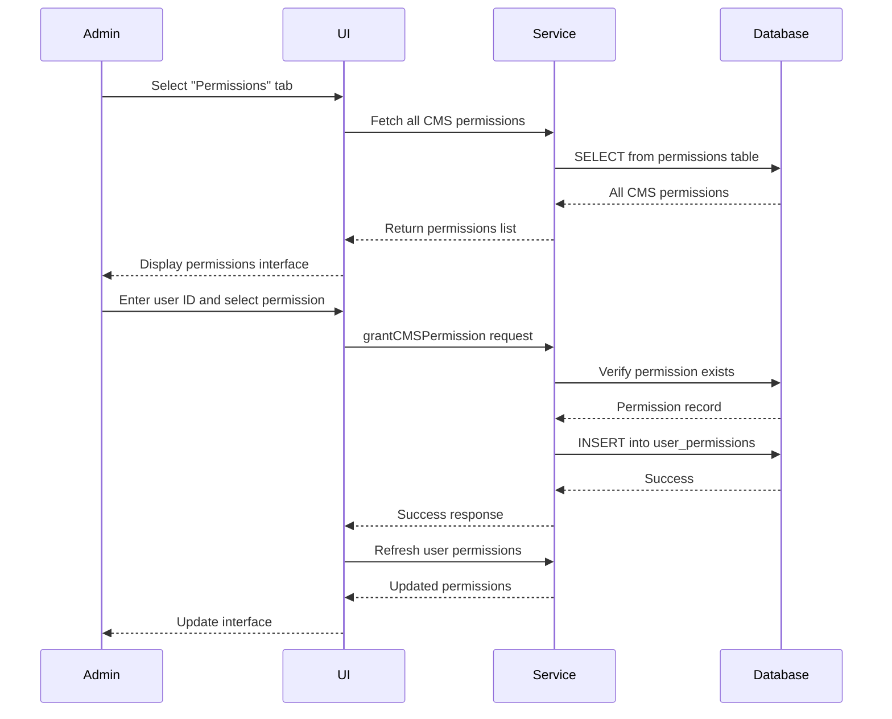
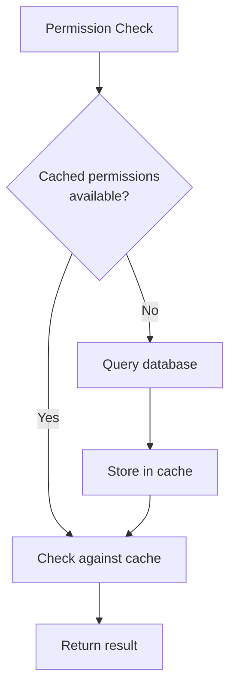

# CMS Permissions Management

<cite>
**Referenced Files in This Document**   
- [cms-permissions-service.ts](file://src/shared/cms-permissions-service.ts#L1-L172)
- [cms-permissions-service.test.ts](file://tests/unit/cms-permissions-service.test.ts#L1-L191)
- [CMSAdminPanel.tsx](file://src/react-app/components/admin/CMSAdminPanel.tsx#L1-L1140)
</cite>

## Table of Contents
1. [Introduction](#introduction)
2. [Project Structure](#project-structure)
3. [Core Components](#core-components)
4. [Architecture Overview](#architecture-overview)
5. [Detailed Component Analysis](#detailed-component-analysis)
6. [Permission System Implementation](#permission-system-implementation)
7. [Role-Based Access Control](#role-based-access-control)
8. [User Permission Assignment](#user-permission-assignment)
9. [Practical Examples](#practical-examples)
10. [Troubleshooting Guide](#troubleshooting-guide)

## Introduction
This document provides comprehensive documentation for the CMS Permissions Management system in the HabibiStay platform. The system implements a robust role-based access control (RBAC) mechanism that governs user access to content management features. The documentation covers the permission system architecture, implementation details, and practical usage through the admin interface.

## Project Structure
The CMS permissions functionality is distributed across multiple directories in the project structure. The core permission logic resides in the shared module, while the user interface components are located in the admin section of the React application.



**Diagram sources**
- [cms-permissions-service.ts](file://src/shared/cms-permissions-service.ts#L1-L172)
- [CMSAdminPanel.tsx](file://src/react-app/components/admin/CMSAdminPanel.tsx#L1-L1140)
- [cms-permissions-service.test.ts](file://tests/unit/cms-permissions-service.test.ts#L1-L191)

**Section sources**
- [cms-permissions-service.ts](file://src/shared/cms-permissions-service.ts#L1-L172)
- [CMSAdminPanel.tsx](file://src/react-app/components/admin/CMSAdminPanel.tsx#L1-L1140)

## Core Components
The CMS permissions system consists of three primary components:
1. **CMSPermissionsService**: Backend service handling permission logic and database operations
2. **CMSAdminPanel**: Frontend interface for managing permissions
3. **Permission Data Model**: Database schema defining permissions and user assignments

The system follows a service-oriented architecture where the frontend components interact with the backend service through well-defined methods, ensuring separation of concerns and maintainability.

**Section sources**
- [cms-permissions-service.ts](file://src/shared/cms-permissions-service.ts#L1-L172)
- [CMSAdminPanel.tsx](file://src/react-app/components/admin/CMSAdminPanel.tsx#L1-L1140)

## Architecture Overview
The CMS permissions system implements a layered architecture with clear separation between data access, business logic, and presentation layers.



**Diagram sources**
- [cms-permissions-service.ts](file://src/shared/cms-permissions-service.ts#L1-L172)
- [CMSAdminPanel.tsx](file://src/react-app/components/admin/CMSAdminPanel.tsx#L1-L1140)

## Detailed Component Analysis

### CMSPermissionsService Analysis
The CMSPermissionsService class provides a comprehensive API for managing CMS-related permissions. It encapsulates all database operations related to permission checking and assignment.

```mermaid
classDiagram
class CMSPermissionsService {
+db : D1Database
+getUserCMSPermissions(userId : string) Promise~string[]~
+userHasCMSPermission(userId : string, permission : string) Promise~boolean~
+userHasAnyCMSPermission(userId : string, permissions : string[]) Promise~boolean~
+userHasAllCMSPermissions(userId : string, permissions : string[]) Promise~boolean~
+grantCMSPermission(userId : string, permission : string) Promise~void~
+revokeCMSPermission(userId : string, permission : string) Promise~void~
+getAllCMSPermissions() Promise~{name : string, description : string}[]~
+getUsersWithCMSPermission(permission : string) Promise~any[]~
}
class D1Database {
+prepare(sql : string) Statement
}
class Statement {
+bind(...params) Statement
+all() Promise~{results : any[]}~
+first() Promise~any~
+run() Promise~{success : boolean}~
}
CMSPermissionsService --> D1Database : "uses"
```

**Diagram sources**
- [cms-permissions-service.ts](file://src/shared/cms-permissions-service.ts#L1-L172)

**Section sources**
- [cms-permissions-service.ts](file://src/shared/cms-permissions-service.ts#L1-L172)

## Permission System Implementation

### Data Model and Database Schema
The permission system is built on a relational data model with three key tables:
- **permissions**: Stores all available permissions with their names, descriptions, and categories
- **users**: Contains user information
- **user_permissions**: Junction table linking users to their assigned permissions

Permissions are categorized by type, with CMS permissions specifically marked with the category 'cms'. This allows the system to distinguish between CMS-related permissions and other types of permissions that might exist in the application.

### Service Methods
The CMSPermissionsService exposes several methods for different permission operations:

#### Permission Retrieval Methods


**Diagram sources**
- [cms-permissions-service.ts](file://src/shared/cms-permissions-service.ts#L10-L25)

#### Permission Checking Methods
The service provides multiple methods for checking permissions with different logical operators:



**Diagram sources**
- [cms-permissions-service.ts](file://src/shared/cms-permissions-service.ts#L30-L45)

#### Permission Assignment Methods


**Diagram sources**
- [cms-permissions-service.ts](file://src/shared/cms-permissions-service.ts#L95-L115)

**Section sources**
- [cms-permissions-service.ts](file://src/shared/cms-permissions-service.ts#L1-L172)

## Role-Based Access Control

### Permission Categories and Structure
The CMS permission system follows a hierarchical naming convention using dot notation:
- **cms.pages.view**: View CMS pages
- **cms.pages.create**: Create CMS pages
- **cms.pages.edit**: Edit CMS pages
- **cms.templates.view**: View templates
- **cms.components.manage**: Manage components
- **cms.media.upload**: Upload media files

This hierarchical structure allows for logical grouping of related permissions and potential future implementation of permission inheritance.

### Access Control Patterns
The system implements several access control patterns:

#### Single Permission Check
Verifies if a user has a specific permission:
```typescript
const canViewPages = await cmsPermissionsService.userHasCMSPermission(
  'user123', 
  'cms.pages.view'
);
```

#### Multiple Permission Checks
Supports both "any" and "all" logical operations:
```typescript
// Check if user has ANY of the listed permissions
const canEditContent = await cmsPermissionsService.userHasAnyCMSPermission(
  'user123',
  ['cms.pages.edit', 'cms.pages.create', 'cms.pages.delete']
);

// Check if user has ALL of the listed permissions
const isCMSAdmin = await cmsPermissionsService.userHasAllCMSPermissions(
  'user123',
  ['cms.pages.manage', 'cms.templates.manage', 'cms.components.manage']
);
```

**Section sources**
- [cms-permissions-service.ts](file://src/shared/cms-permissions-service.ts#L1-L172)

## User Permission Assignment

### Admin Interface Implementation
The CMSAdminPanel component provides a user-friendly interface for managing permissions through the "Permissions" tab.



**Diagram sources**
- [CMSAdminPanel.tsx](file://src/react-app/components/admin/CMSAdminPanel.tsx#L1-L1140)

### Permission Management Workflow
The permission assignment process follows these steps:



**Diagram sources**
- [CMSAdminPanel.tsx](file://src/react-app/components/admin/CMSAdminPanel.tsx#L1-L1140)
- [cms-permissions-service.ts](file://src/shared/cms-permissions-service.ts#L1-L172)

**Section sources**
- [CMSAdminPanel.tsx](file://src/react-app/components/admin/CMSAdminPanel.tsx#L1-L1140)

## Practical Examples

### Example 1: Granting Page Management Permissions
To grant a user the ability to manage CMS pages, an administrator would:

1. Navigate to the CMS Admin Panel
2. Select the "Permissions" tab
3. In the "Grant Permissions" section:
   - Enter the user's ID in the User ID field
   - Select "cms.pages.manage" from the permission dropdown
   - Click the "Grant Permission" button

The system would then:
- Validate that the "cms.pages.manage" permission exists
- Create a record in the user_permissions table linking the user to this permission
- Confirm the operation and refresh the permissions display

### Example 2: Creating a Content Editor Role
A content editor role can be created by assigning the following permissions:
- cms.pages.view
- cms.pages.create
- cms.pages.edit
- cms.media.upload
- cms.components.use

These permissions can be assigned individually through the admin interface or programmatically using the service API:

```typescript
// Programmatic role creation
const editorPermissions = [
  'cms.pages.view',
  'cms.pages.create',
  'cms.pages.edit',
  'cms.media.upload',
  'cms.components.use'
];

for (const permission of editorPermissions) {
  await cmsPermissionsService.grantCMSPermission('user456', permission);
}
```

### Example 3: Checking Permissions in Components
Components can check user permissions to conditionally render UI elements:

```typescript
// In a React component
const PageManagementControls = () => {
  const [canManagePages, setCanManagePages] = useState(false);
  
  useEffect(() => {
    const checkPermissions = async () => {
      const hasPermission = await cmsPermissionsService.userHasAnyCMSPermission(
        currentUser.id,
        ['cms.pages.create', 'cms.pages.edit', 'cms.pages.delete']
      );
      setCanManagePages(hasPermission);
    };
    
    checkPermissions();
  }, []);
  
  if (!canManagePages) return null;
  
  return (
    <div className="page-controls">
      <button>Create Page</button>
      <button>Edit Page</button>
      <button>Delete Page</button>
    </div>
  );
};
```

**Section sources**
- [cms-permissions-service.ts](file://src/shared/cms-permissions-service.ts#L1-L172)
- [CMSAdminPanel.tsx](file://src/react-app/components/admin/CMSAdminPanel.tsx#L1-L1140)

## Troubleshooting Guide

### Common Issues and Solutions

#### Issue 1: Permission Not Found Error
**Symptom**: `Error: CMS Permission cms.pages.create not found`

**Cause**: The specified permission does not exist in the permissions table or is not categorized as a CMS permission.

**Solution**:
1. Verify the permission exists in the database:
```sql
SELECT * FROM permissions WHERE permission_name = 'cms.pages.create';
```
2. Ensure the permission has category = 'cms'
3. If missing, add the permission to the database

#### Issue 2: Permission Changes Not Reflecting
**Symptom**: After granting a permission, the user still cannot access the restricted feature.

**Cause**: The frontend may be caching permission information.

**Solution**:
1. Ensure the frontend refreshes the user's permissions after assignment
2. Implement a refresh mechanism in the UI:
```typescript
// After granting permission
await cmsPermissionsService.grantCMSPermission(userId, permission);
const updatedPermissions = await cmsPermissionsService.getUserCMSPermissions(userId);
setUserPermissions(updatedPermissions);
```

#### Issue 3: Performance Issues with Permission Checks
**Symptom**: Slow response times when checking permissions for users with many assigned permissions.

**Cause**: The current implementation makes separate database queries for different permission operations.

**Optimization Recommendations**:
1. Implement permission caching at the application level
2. Fetch all user permissions once and store them in memory/session
3. Perform subsequent checks against the cached permissions



**Section sources**
- [cms-permissions-service.ts](file://src/shared/cms-permissions-service.ts#L1-L172)
- [cms-permissions-service.test.ts](file://tests/unit/cms-permissions-service.test.ts#L1-L191)