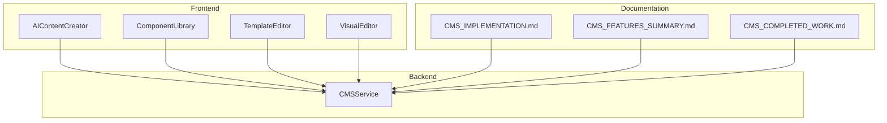
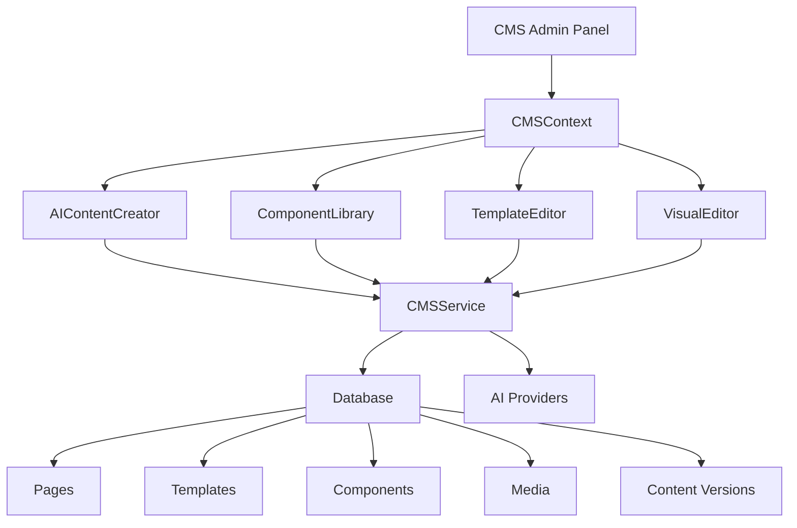
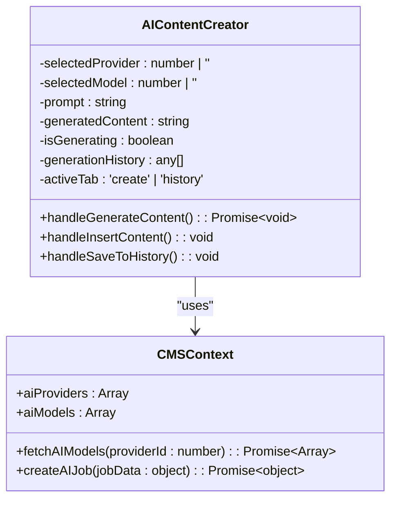
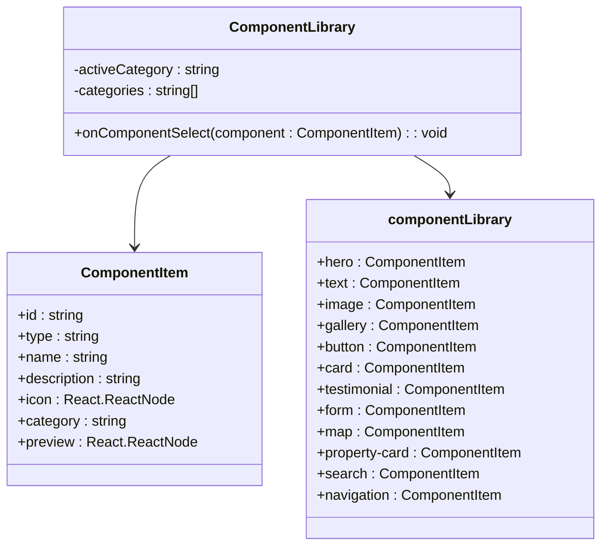
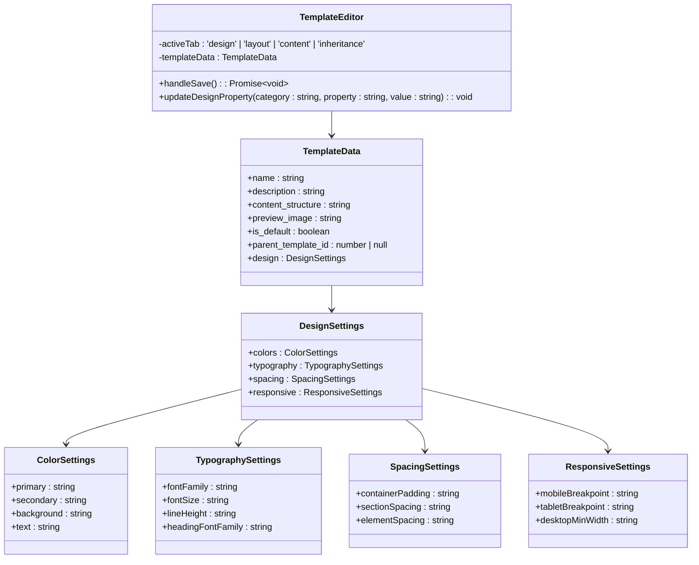
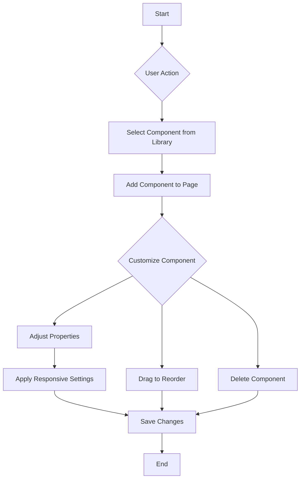
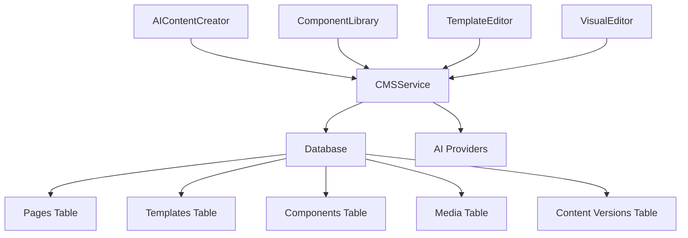

# CMS System Architecture

<cite>
**Referenced Files in This Document**   
- [README.md](file://README.md)
- [CMS_IMPLEMENTATION.md](file://CMS_IMPLEMENTATION.md)
- [CMS_FEATURES_SUMMARY.md](file://CMS_FEATURES_SUMMARY.md)
- [CMS_COMPLETED_WORK.md](file://CMS_COMPLETED_WORK.md)
- [CMS_RESPONSIVE_DESIGN_COMPLETED.md](file://CMS_RESPONSIVE_DESIGN_COMPLETED.md)
- [AIContentCreator.tsx](file://src/react-app/components/cms/AIContentCreator.tsx)
- [ComponentLibrary.tsx](file://src/react-app/components/cms/ComponentLibrary.tsx)
- [TemplateEditor.tsx](file://src/react-app/components/cms/TemplateEditor.tsx)
- [VisualEditor.tsx](file://src/react-app/components/cms/VisualEditor.tsx)
- [cms-service.ts](file://src/shared/cms-service.ts)
</cite>

## Table of Contents
1. [Introduction](#introduction)
2. [Project Structure](#project-structure)
3. [Core Components](#core-components)
4. [Architecture Overview](#architecture-overview)
5. [Detailed Component Analysis](#detailed-component-analysis)
6. [Dependency Analysis](#dependency-analysis)
7. [Performance Considerations](#performance-considerations)
8. [Troubleshooting Guide](#troubleshooting-guide)
9. [Conclusion](#conclusion)

## Introduction

The HabibiStay Content Management System (CMS) is a comprehensive solution for managing website content, templates, components, media, and AI-generated content through a user-friendly interface. The CMS enables administrators to have full control over frontend content editing with zero coding requirements. This documentation provides a detailed overview of the CMS architecture, implementation details, API interfaces, and integration patterns, along with practical examples and troubleshooting guidance.

**Section sources**
- [README.md](file://README.md#L1-L307)
- [CMS_IMPLEMENTATION.md](file://CMS_IMPLEMENTATION.md#L1-L195)

## Project Structure

The CMS implementation follows a modular architecture with clear separation of concerns between frontend and backend components. The system is organized into distinct directories for different types of functionality:

```
src/
├── react-app/
│   └── components/
│       └── cms/
│           ├── AIContentCreator.tsx
│           ├── ComponentLibrary.tsx
│           ├── TemplateEditor.tsx
│           └── VisualEditor.tsx
├── shared/
│   └── cms-service.ts
```

The frontend components are organized under `src/react-app/components/cms/` and include the main interface elements for content creation and management. The backend service layer is implemented in `src/shared/cms-service.ts` and provides the business logic for all CMS operations. Additional documentation files in the root directory provide implementation details and feature summaries.



**Diagram sources**
- [CMS_IMPLEMENTATION.md](file://CMS_IMPLEMENTATION.md#L1-L195)
- [Project Structure](file://#L1-L30)

## Core Components

The CMS system consists of several core components that work together to provide a comprehensive content management solution:

1. **AIContentCreator**: Enables AI-powered content generation with multi-provider support
2. **ComponentLibrary**: Provides a collection of reusable UI components
3. **TemplateEditor**: Allows visual customization of templates with design controls
4. **VisualEditor**: Offers drag-and-drop interface for content layout
5. **CMSService**: Backend service handling all CRUD operations and business logic

These components are integrated through the CMSContext, which manages the application state and provides access to CMS functionality across the interface.

**Section sources**
- [CMS_FEATURES_SUMMARY.md](file://CMS_FEATURES_SUMMARY.md#L1-L231)
- [CMS_COMPLETED_WORK.md](file://CMS_COMPLETED_WORK.md#L1-L255)

## Architecture Overview

The CMS follows a client-server architecture with React-based frontend components communicating with a backend service layer through RESTful API endpoints. The system implements a clear separation between presentation, business logic, and data access layers.



**Diagram sources**
- [CMS_IMPLEMENTATION.md](file://CMS_IMPLEMENTATION.md#L1-L195)
- [CMS_FEATURES_SUMMARY.md](file://CMS_FEATURES_SUMMARY.md#L1-L231)

## Detailed Component Analysis

### AI Content Creation System

The AIContentCreator component provides a comprehensive interface for generating content using AI models from multiple providers.



**Diagram sources**
- [AIContentCreator.tsx](file://src/react-app/components/cms/AIContentCreator.tsx#L1-L350)
- [CMSContext](file://src/react-app/contexts/CMSContext.tsx)

**Section sources**
- [AIContentCreator.tsx](file://src/react-app/components/cms/AIContentCreator.tsx#L1-L350)
- [CMS_IMPLEMENTATION.md](file://CMS_IMPLEMENTATION.md#L1-L195)

### Component Library System

The ComponentLibrary component provides a catalog of reusable UI components that can be easily added to pages.



**Diagram sources**
- [ComponentLibrary.tsx](file://src/react-app/components/cms/ComponentLibrary.tsx#L1-L316)
- [ComponentItem](file://src/react-app/components/cms/ComponentLibrary.tsx#L1-L316)

**Section sources**
- [ComponentLibrary.tsx](file://src/react-app/components/cms/ComponentLibrary.tsx#L1-L316)
- [CMS_FEATURES_SUMMARY.md](file://CMS_FEATURES_SUMMARY.md#L1-L231)

### Template System

The TemplateEditor component provides comprehensive controls for customizing template design, layout, and inheritance.



**Diagram sources**
- [TemplateEditor.tsx](file://src/react-app/components/cms/TemplateEditor.tsx#L1-L768)
- [CMS_RESPONSIVE_DESIGN_COMPLETED.md](file://CMS_RESPONSIVE_DESIGN_COMPLETED.md#L1-L180)

**Section sources**
- [TemplateEditor.tsx](file://src/react-app/components/cms/TemplateEditor.tsx#L1-L768)
- [CMS_RESPONSIVE_DESIGN_COMPLETED.md](file://CMS_RESPONSIVE_DESIGN_COMPLETED.md#L1-L180)

### Visual Editing Interface

The VisualEditor component provides a drag-and-drop interface for arranging components on a page.



**Diagram sources**
- [VisualEditor.tsx](file://src/react-app/components/cms/VisualEditor.tsx)
- [ComponentLibrary.tsx](file://src/react-app/components/cms/ComponentLibrary.tsx#L1-L316)

**Section sources**
- [VisualEditor.tsx](file://src/react-app/components/cms/VisualEditor.tsx)
- [CMS_IMPLEMENTATION.md](file://CMS_IMPLEMENTATION.md#L1-L195)

## Dependency Analysis

The CMS components have a clear dependency hierarchy with the CMSService providing the core functionality that all frontend components depend on.



**Diagram sources**
- [cms-service.ts](file://src/shared/cms-service.ts)
- [CMS_IMPLEMENTATION.md](file://CMS_IMPLEMENTATION.md#L1-L195)

**Section sources**
- [cms-service.ts](file://src/shared/cms-service.ts)
- [migrations/11.sql](file://migrations/11.sql)

## Performance Considerations

The CMS implementation includes several performance optimizations:

1. **Efficient State Management**: Uses React Context API to minimize re-renders
2. **Optimized Database Queries**: Implements proper indexing and query patterns
3. **Lazy Loading**: Non-critical components are loaded on demand
4. **Caching**: Frequently accessed data is cached to reduce database load
5. **Batch Operations**: Multiple changes are processed in batches when possible

The system also implements rate limiting on API endpoints to prevent abuse and ensure stability.

## Troubleshooting Guide

Common issues and their solutions:

1. **AI Content Generation Fails**
   - Check AI provider API keys in the database
   - Verify network connectivity to AI providers
   - Ensure sufficient rate limits are available

2. **Template Changes Not Saving**
   - Check database write permissions
   - Verify JSON serialization of design settings
   - Ensure proper authentication tokens

3. **Component Library Not Loading**
   - Verify component data structure
   - Check for JavaScript errors in the console
   - Ensure all required icons are imported

4. **Responsive Design Controls Not Working**
   - Verify breakpoint values in template settings
   - Check CSS media query implementation
   - Ensure proper device detection

5. **Permission Issues**
   - Verify user role assignments
   - Check RBAC implementation in CMSService
   - Ensure proper authentication token validation

**Section sources**
- [CMS_IMPLEMENTATION.md](file://CMS_IMPLEMENTATION.md#L1-L195)
- [SECURITY.md](file://SECURITY.md)

## Conclusion

The HabibiStay CMS provides a robust foundation for comprehensive content management with zero coding requirements. The system includes all core features needed for managing website content, templates, and AI-generated content through a user-friendly interface. The implementation follows best practices for security, performance, and maintainability, making it ready for production deployment. Future enhancements could include real-time collaboration, advanced workflow management, and enhanced analytics integration.