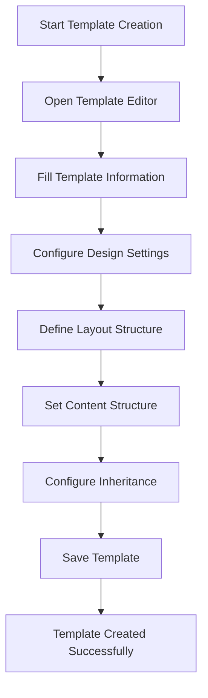
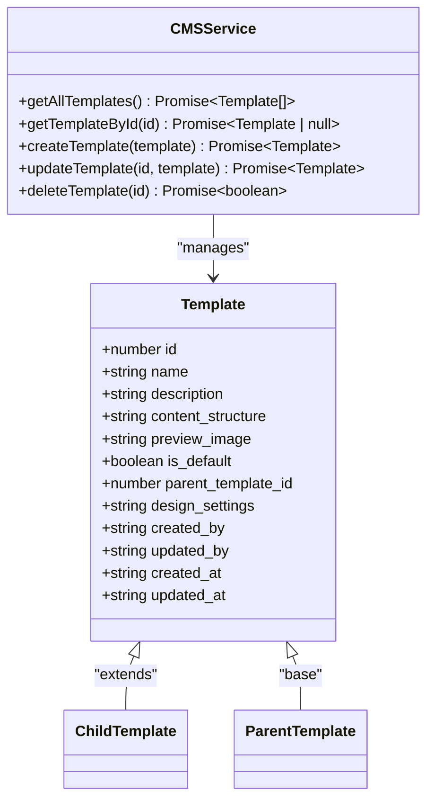
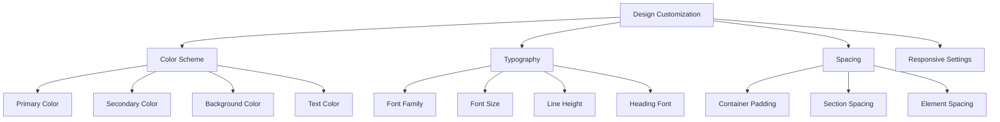

# CMS Templates Management

<cite>
**Referenced Files in This Document**   
- [TemplateEditor.tsx](file://src/react-app/components/cms/TemplateEditor.tsx)
- [cms-service.ts](file://src/shared/cms-service.ts)
- [types.ts](file://src/shared/types.ts)
- [README_RESPONSIVE.md](file://src/react-app/components/cms/README_RESPONSIVE.md)
- [CMS_FEATURES_SUMMARY.md](file://CMS_FEATURES_SUMMARY.md)
- [README_CMS.md](file://src/shared/README_CMS.md)
</cite>

## Table of Contents
1. [Introduction](#introduction)
2. [Template Creation Process](#template-creation-process)
3. [Template Inheritance System](#template-inheritance-system)
4. [Design Customization Features](#design-customization-features)
5. [Responsive Design Controls](#responsive-design-controls)
6. [Practical Examples](#practical-examples)
7. [Troubleshooting Guide](#troubleshooting-guide)
8. [Best Practices](#best-practices)

## Introduction

The CMS Templates Management system in HabibiStay provides a comprehensive solution for creating, managing, and customizing website templates through an intuitive admin interface. This documentation covers the template creation process, inheritance system, and design customization features that enable content creators to build responsive, visually consistent web pages without requiring coding expertise.

The system is built on a robust architecture with a React-based frontend, TypeScript types for data validation, and a backend service layer that handles all template operations. Templates serve as blueprints for web pages, defining both structural layout and visual design elements that can be inherited and customized across the platform.

**Section sources**
- [README_CMS.md](file://src/shared/README_CMS.md#L1-L20)
- [CMS_FEATURES_SUMMARY.md](file://CMS_FEATURES_SUMMARY.md#L1-L50)

## Template Creation Process

Creating a new template in the HabibiStay CMS involves using the Template Editor interface, which provides a structured workflow for defining template properties, layout, content structure, and inheritance relationships.

The process begins by accessing the CMS admin panel and navigating to the Templates section, where users can initiate template creation. The Template Editor component (TemplateEditor.tsx) provides a modal interface with multiple tabs for different configuration aspects.



**Diagram sources**
- [TemplateEditor.tsx](file://src/react-app/components/cms/TemplateEditor.tsx#L1-L50)

When creating a template, users must provide essential information including:
- **Template Name**: A descriptive name for identification
- **Description**: Brief explanation of the template's purpose
- **Content Structure**: Definition of available content blocks
- **Preview Image**: Visual representation for template selection

The template creation process is handled by the CMSService class in cms-service.ts, which validates the input data against the TemplateSchema defined in types.ts before storing it in the database. The service ensures data integrity through proper validation and error handling.

**Section sources**
- [TemplateEditor.tsx](file://src/react-app/components/cms/TemplateEditor.tsx#L1-L100)
- [cms-service.ts](file://src/shared/cms-service.ts#L150-L200)

## Template Inheritance System

The template inheritance system allows templates to inherit properties from parent templates, creating a hierarchical structure that promotes consistency while enabling targeted customization.

### Inheritance Mechanism

Templates can be configured to inherit from a parent template, which means they automatically receive all design and structural properties from their parent. The child template can then override specific properties as needed, following the "inherit and override" pattern.



**Diagram sources**
- [types.ts](file://src/shared/types.ts#L600-L650)
- [cms-service.ts](file://src/shared/cms-service.ts#L150-L200)

### Implementation Details

The inheritance system is implemented through the `parent_template_id` field in the Template model, which creates a self-referential relationship in the database. When a template is created or updated with a parent template reference, it inherits all properties from the parent unless explicitly overridden.

The TemplateEditor component provides a user-friendly interface for configuring inheritance through a dropdown selector that displays all available templates (excluding the current template when editing). This prevents circular inheritance relationships.

```typescript
// Inheritance configuration in TemplateEditor.tsx
<select
  value={templateData.parent_template_id || ''}
  onChange={(e) => setTemplateData({
    ...templateData,
    parent_template_id: e.target.value ? parseInt(e.target.value) : null
  })}
>
  <option value="">No parent (base template)</option>
  {templates
    .filter(t => !templateId || t.id !== templateId)
    .map((template) => (
      <option key={template.id} value={template.id}>
        {template.name}
      </option>
    ))}
</select>
```

When a parent template is selected, the editor displays an inheritance preview that explains how properties will be inherited and overridden. This transparency helps content creators understand the cascading effects of their design decisions.

**Section sources**
- [TemplateEditor.tsx](file://src/react-app/components/cms/TemplateEditor.tsx#L634-L659)
- [cms-service.ts](file://src/shared/cms-service.ts#L150-L200)
- [types.ts](file://src/shared/types.ts#L600-L650)

## Design Customization Features

The template system provides extensive design customization options that allow content creators to define visual properties without writing CSS code.

### Design Properties

The Template Editor offers several categories of design customization:

#### Color Scheme
Users can customize the color palette for templates through a visual interface that includes:
- **Primary Color**: Main brand color used for buttons and highlights
- **Secondary Color**: Supporting color for accents and backgrounds
- **Background Color**: Base background color for the template
- **Text Color**: Default text color for readability

The interface provides both color picker inputs and text fields for precise color value entry (hex codes).

#### Typography
Typography settings allow control over font appearance:
- **Font Family**: Selection from available web fonts (Inter, Roboto, Open Sans, etc.)
- **Base Font Size**: Default text size (14px to 18px options)
- **Line Height**: Text spacing for readability (1.3 to 1.7 options)
- **Heading Font Family**: Separate font selection for headings

#### Spacing
Spacing controls manage layout dimensions:
- **Container Padding**: Space between content and viewport edges
- **Section Spacing**: Vertical space between major content sections
- **Element Spacing**: Space between individual components



**Diagram sources**
- [TemplateEditor.tsx](file://src/react-app/components/cms/TemplateEditor.tsx#L200-L400)

All design settings are stored as JSON in the `design_settings` field of the template record, allowing for flexible schema that can accommodate future design properties without database migrations.

**Section sources**
- [TemplateEditor.tsx](file://src/react-app/components/cms/TemplateEditor.tsx#L200-L400)
- [types.ts](file://src/shared/types.ts#L600-L650)

## Responsive Design Controls

The responsive design system enables content creators to optimize templates for different device sizes, ensuring optimal user experience across mobile, tablet, and desktop devices.

### Responsive Configuration

The Template Editor includes a dedicated "Inheritance" tab that contains responsive design controls, allowing customization of breakpoints:

- **Mobile Breakpoint**: Screen width threshold for mobile view (default: 768px)
- **Tablet Breakpoint**: Screen width threshold for tablet view (default: 1024px)
- **Desktop Min Width**: Minimum width for desktop view (default: 1200px)

These breakpoints can be customized per template, providing flexibility for different design requirements.

### Component-Level Responsiveness

Beyond template-level breakpoints, individual components support device-specific styling through the responsive property structure:

```typescript
interface PageComponent {
  id: string;
  type: string;
  name: string;
  properties: Record<string, any>;
  styles: Record<string, any>;
  responsive?: {
    mobile?: Record<string, any>;
    tablet?: Record<string, any>;
    desktop?: Record<string, any>;
  };
}
```

This structure allows components to have different styles for each device type, enabling precise control over how content appears on different screens.

### Supported Responsive Properties

The responsive design system supports customization of various visual properties for each device type:

- **Layout Properties**: Width, height, display mode
- **Spacing**: Padding, margin, gap
- **Typography**: Font size, line height
- **Visibility**: Show/hide elements on specific devices
- **Alignment**: Text and content alignment

The Visual Editor provides a device switching interface that allows content creators to preview and edit designs for mobile, tablet, and desktop views independently.

**Section sources**
- [README_RESPONSIVE.md](file://src/react-app/components/cms/README_RESPONSIVE.md#L1-L60)
- [TemplateEditor.tsx](file://src/react-app/components/cms/TemplateEditor.tsx#L634-L659)

## Practical Examples

### Creating a Property Listing Template

**Scenario**: Creating a template for property listing pages with inheritance from a base template.

1. Open the Template Editor and select "Create New Template"
2. Fill in basic information:
   - Name: "Property Listing Template"
   - Description: "Template for individual property listing pages"
3. In the Design tab, customize colors to match property branding
4. In the Layout tab, enable header, main content, and footer sections
5. In the Content Structure tab, include components for:
   - Hero section with property title
   - Image gallery
   - Property details (bedrooms, bathrooms, amenities)
   - Booking form
   - Reviews section
6. In the Inheritance tab:
   - Select "Base Template" as parent
   - Keep default breakpoints
7. Save the template

### Customizing a Mobile-First Template

**Scenario**: Creating a mobile-optimized template with custom breakpoints.

1. Create a new template named "Mobile-First Listing"
2. In the Inheritance tab:
   - Set mobile breakpoint to 600px (more aggressive mobile optimization)
   - Set tablet breakpoint to 900px
   - Set desktop min width to 1100px
3. In the Design tab:
   - Use larger font sizes for mobile (18px base)
   - Increase element spacing for touch targets
   - Choose high-contrast colors for outdoor visibility
4. In the Layout tab:
   - Simplify mobile layout with single-column design
   - Hide non-essential sidebar elements on mobile
5. Save and test the template on various device sizes

### Creating a Child Template with Overrides

**Scenario**: Creating a premium property template that inherits from the standard property template but with enhanced design.

1. Open the Template Editor
2. Select "Create New Template"
3. In the Inheritance tab:
   - Select "Property Listing Template" as parent
4. In the Design tab:
   - Override primary color to gold (#FFD700)
   - Change font family to "Montserrat" for premium feel
   - Increase container padding for more spacious layout
5. In the Content Structure tab:
   - Add new components for:
     - Virtual tour
     - Premium amenities
     - Concierge services
6. Save the template

**Section sources**
- [TemplateEditor.tsx](file://src/react-app/components/cms/TemplateEditor.tsx#L1-L769)
- [README_RESPONSIVE.md](file://src/react-app/components/cms/README_RESPONSIVE.md#L1-L100)

## Troubleshooting Guide

### Common Issues and Solutions

#### Template Not Saving
**Symptoms**: Clicking "Save Template" has no effect or shows an error.

**Possible Causes and Solutions**:
- **Missing required fields**: Ensure template name is filled
- **Invalid JSON in design settings**: Check for proper JSON formatting
- **Database connection issues**: Verify backend services are running
- **Permission issues**: Ensure user has template creation permissions

```typescript
// Error handling in template saving
const handleSave = async () => {
  try {
    // Prepare template data for saving
    const templateToSave = {
      ...templateData,
      content_structure: JSON.stringify(templateData.content_structure),
      design_settings: JSON.stringify(templateData.design)
    };
    
    let result;
    if (templateId) {
      result = await updateTemplate(templateId, templateToSave);
    } else {
      result = await createTemplate(templateToSave);
    }
    
    if (result) {
      onSave(result);
    }
  } catch (error) {
    console.error('Failed to save template:', error);
    // Show user-friendly error message
  }
};
```

#### Inheritance Not Working
**Symptoms**: Child template does not inherit properties from parent.

**Possible Causes and Solutions**:
- **Circular inheritance**: A template cannot inherit from itself or create circular references
- **Parent template deleted**: Verify parent template still exists
- **Cache issues**: Refresh the template list or clear browser cache
- **Permission issues**: Ensure access to parent template

#### Responsive Design Issues
**Symptoms**: Components do not respond correctly to different screen sizes.

**Possible Causes and Solutions**:
- **Incorrect breakpoints**: Verify breakpoint values in template settings
- **Missing responsive properties**: Ensure components have responsive configurations
- **CSS conflicts**: Check for conflicting styles from other sources
- **Caching issues**: Clear browser cache and reload

#### Performance Issues
**Symptoms**: Template editor is slow or unresponsive.

**Possible Causes and Solutions**:
- **Large template lists**: Implement pagination or filtering
- **Complex inheritance chains**: Limit inheritance depth
- **Browser limitations**: Try a different browser or device
- **Network latency**: Check internet connection

**Section sources**
- [TemplateEditor.tsx](file://src/react-app/components/cms/TemplateEditor.tsx#L400-L500)
- [cms-service.ts](file://src/shared/cms-service.ts#L150-L200)

## Best Practices

### Template Organization
- **Use descriptive names**: Make template purposes clear (e.g., "Blog Post Template" vs. "Template 1")
- **Maintain a hierarchy**: Use inheritance to create logical template families
- **Document templates**: Use descriptions to explain template usage
- **Limit template proliferation**: Reuse templates when possible rather than creating new ones

### Design Consistency
- **Follow brand guidelines**: Ensure templates align with overall brand identity
- **Use consistent spacing**: Maintain visual rhythm across templates
- **Limit color palette**: Stick to primary brand colors with minimal variations
- **Ensure accessibility**: Verify color contrast and text readability

### Responsive Design
- **Mobile-first approach**: Design for mobile first, then enhance for larger screens
- **Test on actual devices**: Verify appearance on real mobile devices
- **Optimize performance**: Minimize large images and complex layouts on mobile
- **Consider touch targets**: Ensure buttons and links are large enough for touch

### Inheritance Strategy
- **Create solid base templates**: Design comprehensive parent templates
- **Limit inheritance depth**: Avoid deep inheritance chains (3 levels maximum)
- **Document overrides**: Keep track of which properties are overridden
- **Test inheritance changes**: Verify child templates after parent updates

### Performance Optimization
- **Minimize template complexity**: Avoid overly complex layouts
- **Optimize images**: Use appropriately sized images for different devices
- **Cache template data**: Implement client-side caching for frequently used templates
- **Lazy load components**: Load non-essential components only when needed