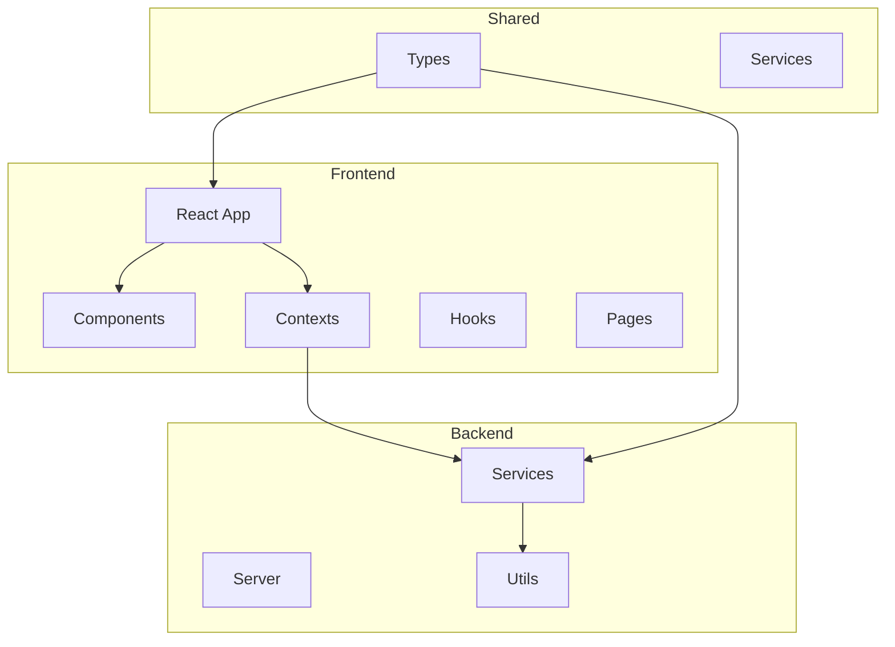
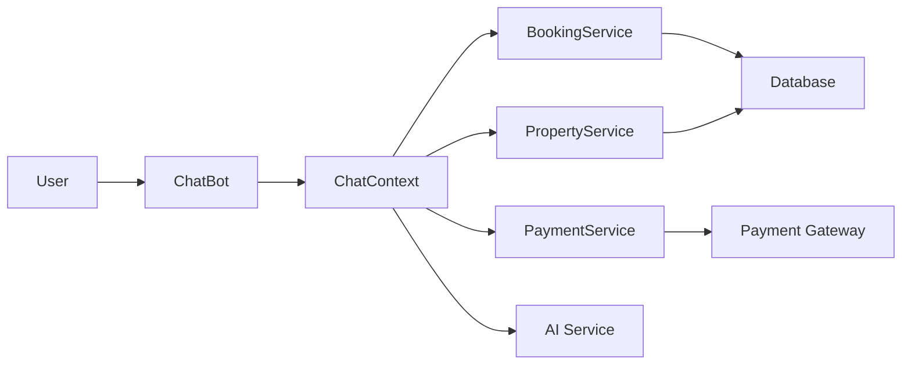
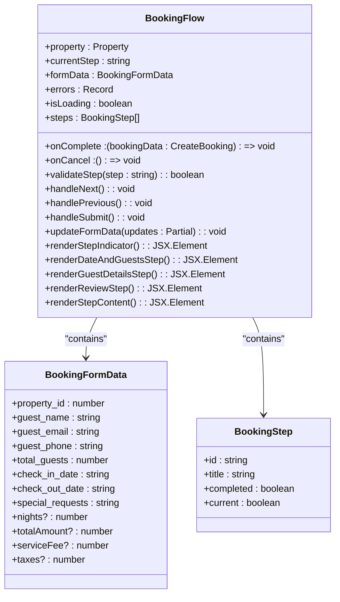
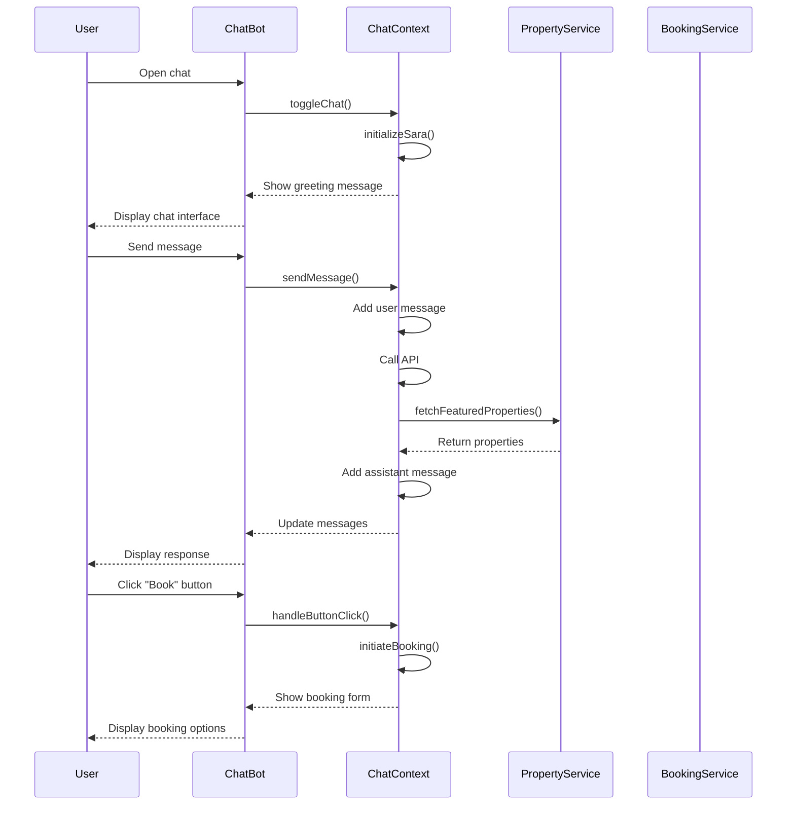
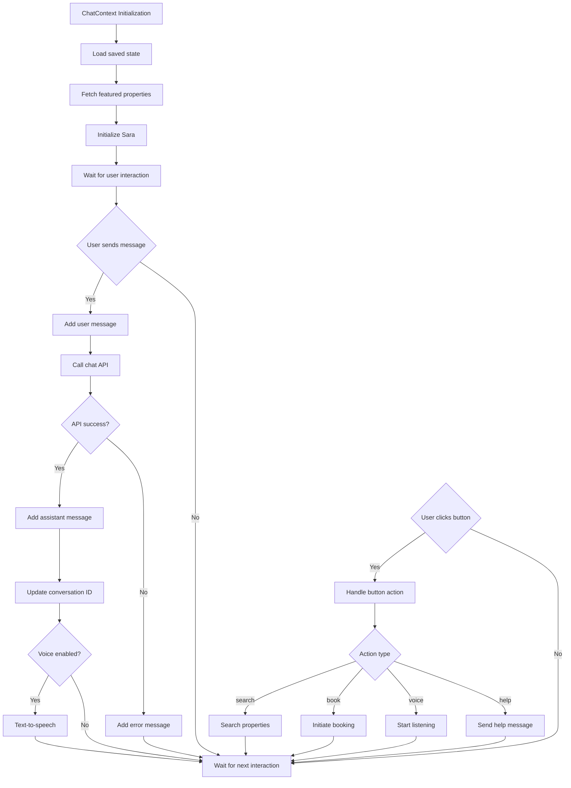
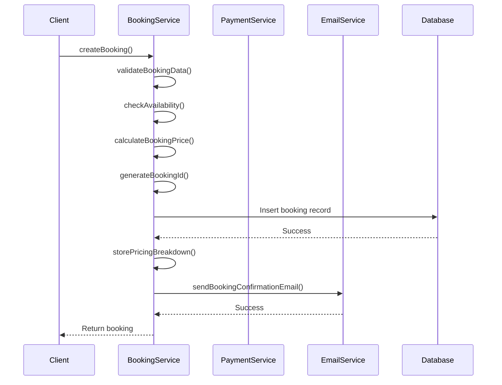
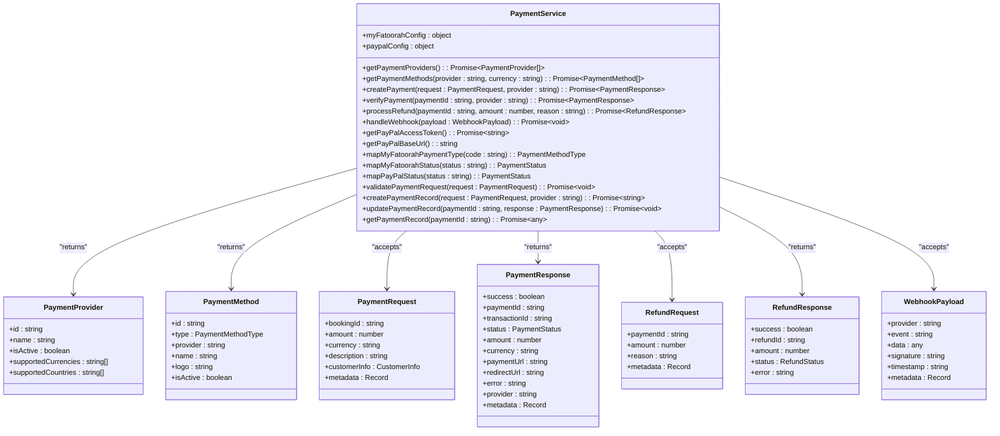
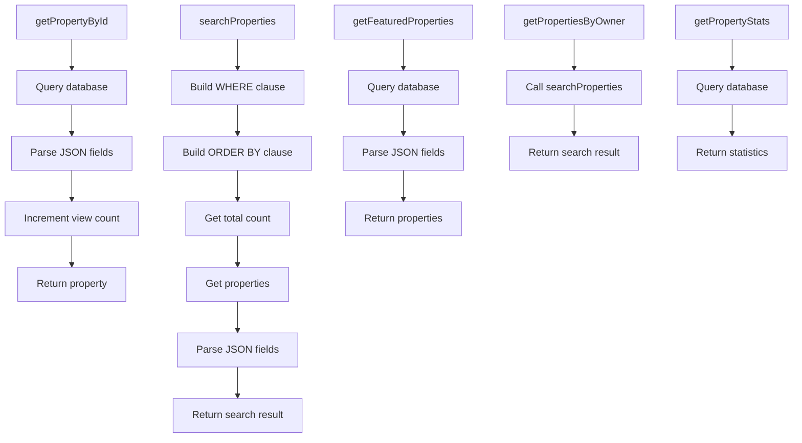
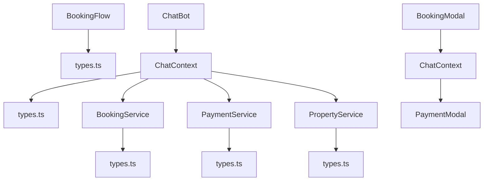

# Chatbot Booking Flow

<cite>
**Referenced Files in This Document**   
- [BookingFlow.tsx](file://src/react-app/components/BookingFlow.tsx)
- [ChatBot.tsx](file://src/react-app/components/ChatBot.tsx)
- [ChatContext.tsx](file://src/react-app/contexts/ChatContext.tsx)
- [types.ts](file://src/shared/types.ts)
- [BookingService.ts](file://src/server/services/BookingService.ts)
- [PaymentService.ts](file://src/server/services/PaymentService.ts)
- [PropertyService.ts](file://src/server/services/PropertyService.ts)
- [BookingModal.tsx](file://src/react-app/components/BookingModal.tsx)
</cite>

## Table of Contents
1. [Introduction](#introduction)
2. [Project Structure](#project-structure)
3. [Core Components](#core-components)
4. [Architecture Overview](#architecture-overview)
5. [Detailed Component Analysis](#detailed-component-analysis)
6. [Dependency Analysis](#dependency-analysis)
7. [Performance Considerations](#performance-considerations)
8. [Troubleshooting Guide](#troubleshooting-guide)
9. [Conclusion](#conclusion)

## Introduction
This document provides a comprehensive analysis of the chatbot booking flow in the HabibiStay application. The system enables users to book properties through an AI-powered chat interface, with seamless integration between frontend components and backend services. The documentation covers the booking process, data collection, and integration with property and booking systems, including practical examples and troubleshooting guidance.

## Project Structure
The project follows a modular structure with clear separation of concerns. The frontend React application is organized into components, contexts, hooks, and pages, while the backend services handle business logic for bookings, payments, and properties. Shared types ensure consistency across the application.

**Diagram sources**
- [src/react-app/components](file://src/react-app/components)
- [src/server/services](file://src/server/services)
- [src/shared/types.ts](file://src/shared/types.ts)

**Section sources**
- [src/react-app/components](file://src/react-app/components)
- [src/server/services](file://src/server/services)
- [src/shared/types.ts](file://src/shared/types.ts)

## Core Components
The chatbot booking flow consists of several core components that work together to provide a seamless booking experience. The BookingFlow component manages the multi-step booking process, while the ChatBot component provides the conversational interface. The ChatContext manages the state and logic for the chat interaction, and various services handle backend operations.

**Section sources**
- [BookingFlow.tsx](file://src/react-app/components/BookingFlow.tsx)
- [ChatBot.tsx](file://src/react-app/components/ChatBot.tsx)
- [ChatContext.tsx](file://src/react-app/contexts/ChatContext.tsx)

## Architecture Overview
The chatbot booking flow follows a client-server architecture with a React frontend and Node.js backend. The system uses a context-based state management approach for the chat functionality, with services handling business logic and data persistence.

**Diagram sources**
- [ChatBot.tsx](file://src/react-app/components/ChatBot.tsx)
- [ChatContext.tsx](file://src/react-app/contexts/ChatContext.tsx)
- [BookingService.ts](file://src/server/services/BookingService.ts)
- [PaymentService.ts](file://src/server/services/PaymentService.ts)
- [PropertyService.ts](file://src/server/services/PropertyService.ts)

## Detailed Component Analysis

### Booking Flow Component Analysis
The BookingFlow component implements a multi-step booking process with validation and pricing calculation. It manages the user interface for collecting booking information and coordinates with backend services to complete the booking.

**Diagram sources**
- [BookingFlow.tsx](file://src/react-app/components/BookingFlow.tsx#L1-L540)

**Section sources**
- [BookingFlow.tsx](file://src/react-app/components/BookingFlow.tsx#L1-L540)

### Chat Bot Component Analysis
The ChatBot component provides a conversational interface for booking properties. It uses the ChatContext to manage state and handles user interactions through a message-based system. The component supports both widget and full-screen modes.

**Diagram sources**
- [ChatBot.tsx](file://src/react-app/components/ChatBot.tsx#L1-L664)
- [ChatContext.tsx](file://src/react-app/contexts/ChatContext.tsx#L1-L707)

**Section sources**
- [ChatBot.tsx](file://src/react-app/components/ChatBot.tsx#L1-L664)
- [ChatContext.tsx](file://src/react-app/contexts/ChatContext.tsx#L1-L707)

### Chat Context Analysis
The ChatContext provides state management and business logic for the chatbot functionality. It handles message management, user interactions, and integration with backend services for property search and booking.

**Diagram sources**
- [ChatContext.tsx](file://src/react-app/contexts/ChatContext.tsx#L1-L707)

**Section sources**
- [ChatContext.tsx](file://src/react-app/contexts/ChatContext.tsx#L1-L707)

### Booking Service Analysis
The BookingService handles all booking-related operations, including creation, updating, cancellation, and searching. It integrates with the PaymentService for payment processing and the EmailService for notifications.

**Diagram sources**
- [BookingService.ts](file://src/server/services/BookingService.ts#L1-L822)

**Section sources**
- [BookingService.ts](file://src/server/services/BookingService.ts#L1-L822)

### Payment Service Analysis
The PaymentService manages payment operations with multiple payment providers, including MyFatoorah and PayPal. It handles payment creation, verification, refunds, and webhook processing.

**Diagram sources**
- [PaymentService.ts](file://src/server/services/PaymentService.ts#L1-L960)

**Section sources**
- [PaymentService.ts](file://src/server/services/PaymentService.ts#L1-L960)

### Property Service Analysis
The PropertyService handles property-related operations, including searching, retrieving, and managing property data. It integrates with the database to provide property information and statistics.

**Diagram sources**
- [PropertyService.ts](file://src/server/services/PropertyService.ts#L1-L305)

**Section sources**
- [PropertyService.ts](file://src/server/services/PropertyService.ts#L1-L305)

## Dependency Analysis
The chatbot booking flow has a well-defined dependency structure with clear separation between frontend and backend components. The system uses shared types to ensure consistency across the application.

**Diagram sources**
- [BookingFlow.tsx](file://src/react-app/components/BookingFlow.tsx)
- [ChatBot.tsx](file://src/react-app/components/ChatBot.tsx)
- [ChatContext.tsx](file://src/react-app/contexts/ChatContext.tsx)
- [BookingService.ts](file://src/server/services/BookingService.ts)
- [PaymentService.ts](file://src/server/services/PaymentService.ts)
- [PropertyService.ts](file://src/server/services/PropertyService.ts)
- [BookingModal.tsx](file://src/react-app/components/BookingModal.tsx)

**Section sources**
- [BookingFlow.tsx](file://src/react-app/components/BookingFlow.tsx)
- [ChatBot.tsx](file://src/react-app/components/ChatBot.tsx)
- [ChatContext.tsx](file://src/react-app/contexts/ChatContext.tsx)
- [BookingService.ts](file://src/server/services/BookingService.ts)
- [PaymentService.ts](file://src/server/services/PaymentService.ts)
- [PropertyService.ts](file://src/server/services/PropertyService.ts)
- [BookingModal.tsx](file://src/react-app/components/BookingModal.tsx)

## Performance Considerations
The chatbot booking flow is designed with performance in mind. The frontend uses React's built-in optimization features, such as memoization and lazy loading, to minimize re-renders. The backend services are designed to be stateless and can be easily scaled horizontally. The database queries are optimized with appropriate indexing, and the system uses caching where appropriate to reduce database load.

The chat context uses localStorage to persist conversation state, reducing the need for server requests when the user returns to the site. The property search functionality includes pagination and filtering to minimize the amount of data transferred. The payment service uses asynchronous processing for webhook handling to ensure high availability.

## Troubleshooting Guide
When troubleshooting issues with the chatbot booking flow, consider the following common problems and solutions:

1. **Chatbot not responding**: Check that the chat API endpoint is accessible and that the AI service is running. Verify that the conversation ID is being properly maintained.

2. **Booking validation errors**: Ensure that all required fields are filled out correctly. Check that the check-in and check-out dates are valid and that the number of guests does not exceed the property's maximum.

3. **Payment processing failures**: Verify that the payment provider credentials are correct and that the payment gateway is accessible. Check the webhook configuration and ensure that the callback URLs are correct.

4. **Property search not returning results**: Confirm that the search criteria are valid and that the property database contains active properties. Check that the availability check is working correctly.

5. **State management issues**: If the chat context state is not being maintained correctly, check the localStorage implementation and ensure that the state is being properly serialized and deserialized.

When debugging, use the browser's developer tools to inspect network requests and console logs. The system includes comprehensive error handling and logging, which can help identify the source of issues.

## Conclusion
The chatbot booking flow in HabibiStay provides a seamless and intuitive way for users to book properties through a conversational interface. The system is well-architected with clear separation of concerns between frontend and backend components. The use of shared types ensures consistency across the application, while the modular design allows for easy maintenance and extension.

The integration between the chatbot, booking service, payment service, and property service creates a cohesive user experience that guides users through the booking process. The system includes robust error handling and validation to ensure data integrity and provide helpful feedback to users.

Future enhancements could include additional payment providers, more sophisticated AI capabilities, and enhanced analytics to improve the booking experience. The current architecture provides a solid foundation for these and other improvements.