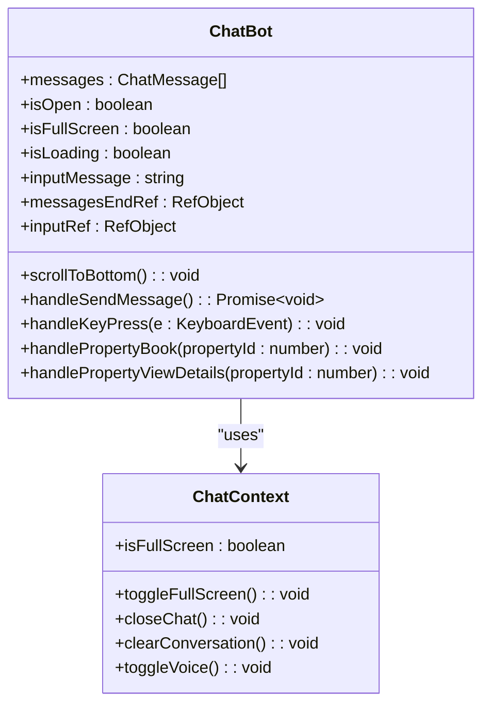
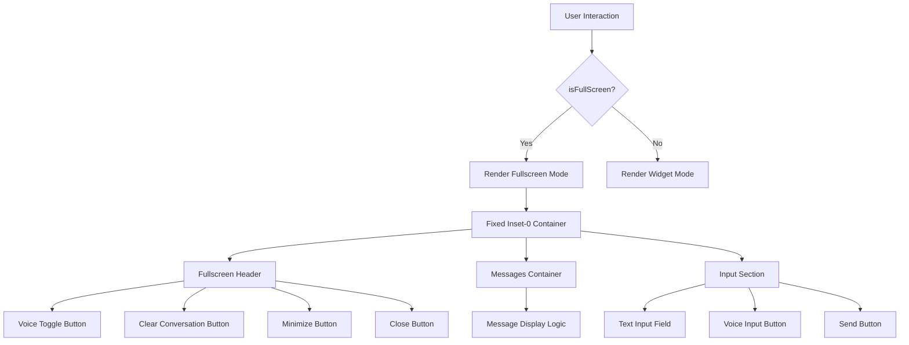
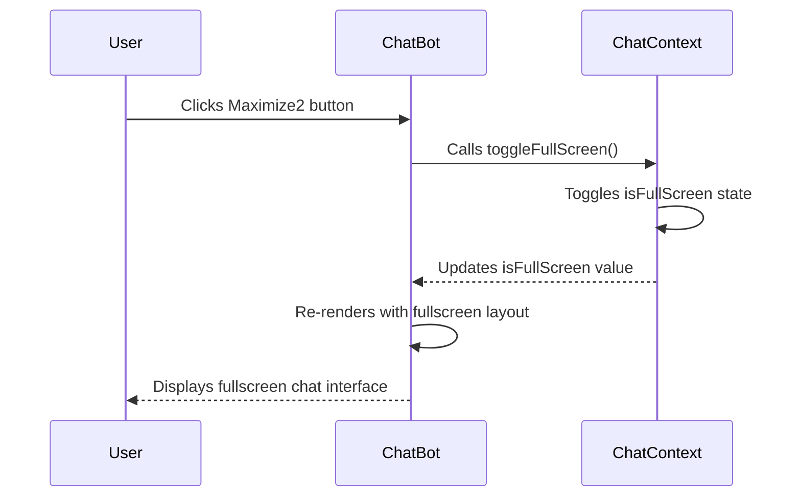
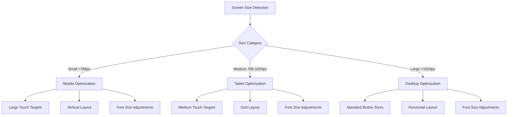
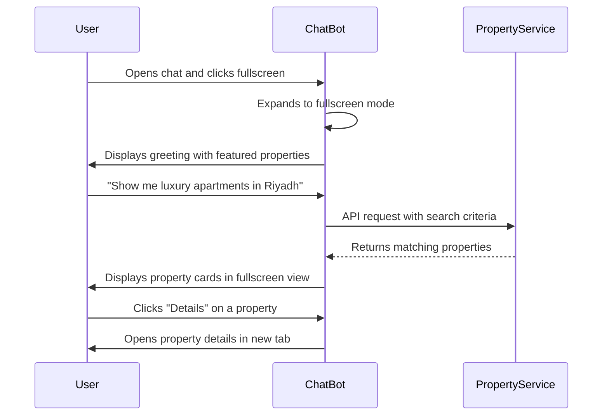
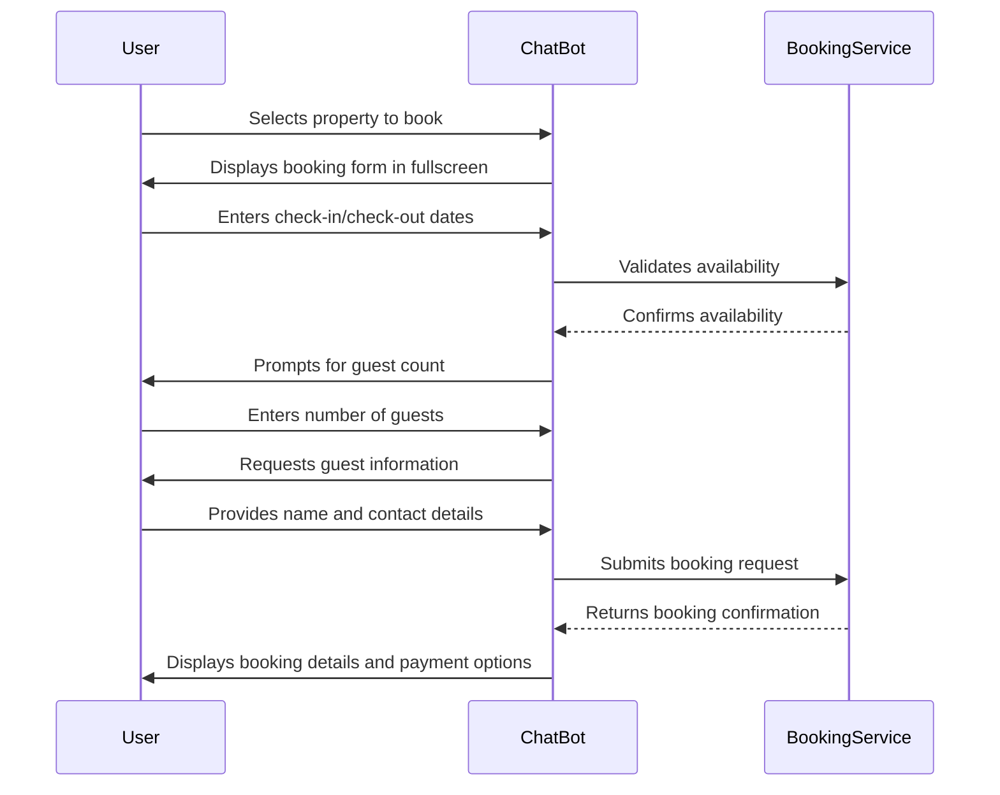
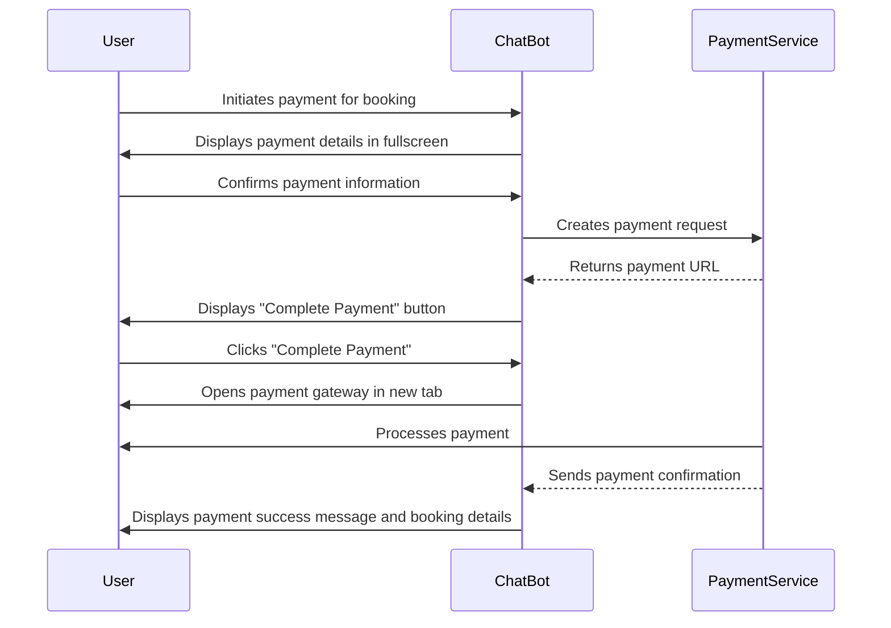

# Chatbot Fullscreen Mode

<cite>
**Referenced Files in This Document**   
- [ChatBot.tsx](file://src/react-app/components/ChatBot.tsx)
- [ChatContext.tsx](file://src/react-app/contexts/ChatContext.tsx)
- [responsive.ts](file://src/react-app/utils/responsive.ts)
- [CMS_RESPONSIVE_DESIGN_COMPLETED.md](file://CMS_RESPONSIVE_DESIGN_COMPLETED.md)
</cite>

## Table of Contents
1. [Introduction](#introduction)
2. [Fullscreen Mode Implementation](#fullscreen-mode-implementation)
3. [Activation Methods](#activation-methods)
4. [Responsive Design Considerations](#responsive-design-considerations)
5. [Practical Examples](#practical-examples)
6. [Troubleshooting Guide](#troubleshooting-guide)
7. [Conclusion](#conclusion)

## Introduction
The Chatbot Fullscreen Mode is a key feature of the HabibiStay platform, designed to enhance user experience during property search, booking, and payment processes. This documentation provides comprehensive details about the fullscreen mode implementation, activation methods, and responsive design considerations. The chatbot, named Sara, serves as a personal accommodation assistant that helps users find the perfect stay in Riyadh through an intuitive interface that seamlessly transitions between widget and fullscreen modes.

**Section sources**
- [ChatBot.tsx](file://src/react-app/components/ChatBot.tsx#L1-L50)

## Fullscreen Mode Implementation

The fullscreen mode implementation is a React component that provides an immersive experience for users interacting with the chatbot assistant. The implementation uses a state-based approach to manage the transition between widget and fullscreen modes.



**Diagram sources**
- [ChatBot.tsx](file://src/react-app/components/ChatBot.tsx#L254-L315)
- [ChatContext.tsx](file://src/react-app/contexts/ChatContext.tsx#L53-L71)

The fullscreen mode is implemented as a conditional rendering pattern within the ChatBot component. When the `isFullScreen` state is true, the component renders a full-screen interface that covers the entire viewport with a white background and a fixed position.



**Diagram sources**
- [ChatBot.tsx](file://src/react-app/components/ChatBot.tsx#L332-L388)

The fullscreen mode provides several key features:
- **Complete screen coverage**: The chat interface expands to cover the entire viewport with `fixed inset-0` positioning
- **Enhanced header controls**: Additional buttons for voice control, conversation clearing, minimizing, and closing
- **Optimized layout**: A column-based flex layout that maximizes the available screen space for messages and input
- **Persistent functionality**: All chatbot features remain available in fullscreen mode

The implementation uses React's useState and useEffect hooks to manage the component's state and side effects. The fullscreen state is controlled through the ChatContext, which provides a centralized state management system for the chatbot functionality.

**Section sources**
- [ChatBot.tsx](file://src/react-app/components/ChatBot.tsx#L332-L388)
- [ChatContext.tsx](file://src/react-app/contexts/ChatContext.tsx#L63-L63)

## Activation Methods

The fullscreen mode can be activated through multiple methods, providing users with flexible options to expand the chatbot interface.

### Primary Activation Method

The primary method for activating fullscreen mode is through the maximize button in the chatbot widget header. This button is represented by the Maximize2 icon from the Lucide React library.

```typescript
// Widget mode header button
<button
  onClick={() => {
    toggleFullScreen();
    // When entering full screen, we want to ensure Sara is properly initialized
    if (messages.length === 0) {
      // This will trigger the initialization in the context
    }
  }}
  className="p-1 rounded hover:bg-white hover:bg-opacity-10 transition-colors"
  title="Full screen"
>
  <Maximize2 className="h-4 w-4" />
</button>
```

**Section sources**
- [ChatBot.tsx](file://src/react-app/components/ChatBot.tsx#L496-L529)

### Secondary Activation Methods

While the maximize button is the primary activation method, there are several other ways users can interact with the fullscreen functionality:

1. **Keyboard shortcuts**: Although not explicitly implemented in the current code, the foundation exists for adding keyboard shortcuts
2. **Programmatic activation**: The `toggleFullScreen` function can be called programmatically from other parts of the application
3. **URL parameters**: The application could be extended to support fullscreen mode activation via URL parameters

### State Management

The fullscreen state is managed through the ChatContext, which provides a centralized state management system for the chatbot. The context uses React's useState hook to maintain the `isFullScreen` state.

```typescript
// In ChatContext.tsx
const [isFullScreen, setIsFullScreen] = useState(false);

const toggleFullScreen = useCallback(() => {
  setIsFullScreen(prev => !prev);
}, []);
```

The `toggleFullScreen` function is exposed through the context and can be used by any component that consumes the ChatContext. This approach ensures consistent state management across the application.



**Diagram sources**
- [ChatBot.tsx](file://src/react-app/components/ChatBot.tsx#L254-L315)
- [ChatContext.tsx](file://src/react-app/contexts/ChatContext.tsx#L63-L63)

When transitioning to fullscreen mode, the system performs several important functions:
- **State update**: The `isFullScreen` state is toggled from false to true
- **Layout re-rendering**: The component re-renders with the fullscreen layout
- **Focus management**: The input field is automatically focused when the chat opens
- **Initialization check**: If the conversation is empty, the system prepares to initialize the chatbot

**Section sources**
- [ChatBot.tsx](file://src/react-app/components/ChatBot.tsx#L496-L529)

## Responsive Design Considerations

The fullscreen mode implementation incorporates comprehensive responsive design principles to ensure optimal user experience across different devices and screen sizes.

### Responsive Utilities

The application uses a dedicated responsive design system implemented in the `responsive.ts` utility file. This system provides a collection of predefined classes and functions that ensure consistent responsive behavior across the application.

```typescript
// Responsive utilities from responsive.ts
export const responsiveClasses = {
  // Typography
  text: {
    h1: 'text-2xl sm:text-3xl md:text-4xl lg:text-5xl font-bold',
    h2: 'text-xl sm:text-2xl md:text-3xl lg:text-4xl font-bold',
    h3: 'text-lg sm:text-xl md:text-2xl lg:text-3xl font-semibold',
    h4: 'text-base sm:text-lg md:text-xl lg:text-2xl font-semibold',
    body: 'text-sm sm:text-base',
    small: 'text-xs sm:text-sm',
  },
  
  // Buttons
  button: {
    primary: 'w-full sm:w-auto px-4 py-2 sm:px-6 sm:py-3 text-sm sm:text-base',
    secondary: 'w-full sm:w-auto px-3 py-2 sm:px-4 sm:py-2 text-xs sm:text-sm',
    icon: 'p-2 sm:p-3',
  },
  
  // Cards and containers
  card: {
    base: 'bg-white rounded-lg shadow-md overflow-hidden',
    padding: 'p-4 sm:p-6',
    image: 'aspect-[4/3] sm:aspect-[16/9] w-full object-cover',
  },
};
```

**Section sources**
- [responsive.ts](file://src/react-app/utils/responsive.ts#L19-L150)

### Breakpoint System

The responsive design system follows a mobile-first approach with the following breakpoints:

- **sm**: 640px (Small devices - landscape phones)
- **md**: 768px (Medium devices - tablets)
- **lg**: 1024px (Large devices - desktops)
- **xl**: 1280px (Extra large devices - large desktops)
- **2xl**: 1536px (2X Large devices - larger desktops)

These breakpoints are defined in the `breakpoints` constant within the responsive utilities:

```typescript
export const breakpoints = {
  sm: '640px',
  md: '768px',
  lg: '1024px',
  xl: '1280px',
  '2xl': '1536px'
};
```

The fullscreen mode specifically adapts to these breakpoints by:
- Adjusting font sizes for better readability
- Modifying padding and spacing for touch targets
- Optimizing button sizes for different input methods
- Ensuring content is properly contained within the viewport



**Diagram sources**
- [responsive.ts](file://src/react-app/utils/responsive.ts#L4-L17)

### Touch and Gesture Optimization

The fullscreen mode includes specific optimizations for touch devices, ensuring a smooth user experience on mobile and tablet devices.

```typescript
// Touch and gesture optimizations
export const utils = {
  // Touch targets (minimum 44px for accessibility)
  touchTarget: 'min-h-[44px] min-w-[44px] flex items-center justify-center',
  touchButton: 'min-h-[44px] min-w-[44px] flex items-center justify-center touch-manipulation',
  
  // Mobile-specific interactions
  noScrollbar: 'scrollbar-hide',
  smoothScroll: 'scroll-smooth',
  overscrollBehavior: 'overscroll-contain',
  
  // Mobile-optimized focus states
  focusVisible: 'focus:outline-none focus-visible:ring-2 focus-visible:ring-[#2957c3] focus-visible:ring-offset-2',
};
```

Key touch optimizations include:
- **Minimum touch targets**: All interactive elements have a minimum size of 44px to meet accessibility standards
- **Smooth scrolling**: The messages container uses smooth scrolling for a better user experience
- **Overscroll containment**: Prevents unwanted overscroll effects on mobile devices
- **Focus visibility**: Enhanced focus states for keyboard navigation

The fullscreen mode also considers device-specific features such as:
- **Notch detection**: The system can detect devices with notches (like iPhone X and newer models)
- **Orientation detection**: The application can detect whether the device is in portrait or landscape mode
- **Hover capability**: The system detects whether the device supports hover interactions

```typescript
// Device detection functions
const hasNotch = (): boolean => {
  if (typeof window === 'undefined') return false;
  return window.screen.height === 812 && window.screen.width === 375 ||
         window.screen.height === 896 && window.screen.width === 414 ||
         window.screen.height === 844 && window.screen.width === 390 ||
         window.screen.height === 926 && window.screen.width === 428;
};

const getOrientation = (): 'portrait' | 'landscape' => {
  if (typeof window === 'undefined') return 'portrait';
  return window.innerHeight > window.innerWidth ? 'portrait' : 'landscape';
};

const canHover = (): boolean => {
  if (typeof window === 'undefined') return true;
  return window.matchMedia('(hover: hover)').matches;
};
```

**Section sources**
- [responsive.ts](file://src/react-app/utils/responsive.ts#L197-L241)

## Practical Examples

This section provides practical examples of using the fullscreen mode during property search, booking, and payment processes.

### Property Search Process

When searching for properties, the fullscreen mode provides an immersive experience that allows users to easily browse and compare different accommodation options.



In fullscreen mode, property cards are displayed with optimal spacing and readability:
- Images are sized appropriately for the larger viewport
- Key details (bedrooms, bathrooms, guests) are clearly visible
- Amenities are displayed with intuitive icons
- Price information is prominently displayed
- Action buttons (Details, Book) are easily accessible

### Booking Process

The fullscreen mode enhances the booking process by providing ample space for the multi-step booking flow.



During the booking process in fullscreen mode:
- Each step of the booking flow is clearly presented
- Form fields have adequate space and proper labeling
- Error messages are displayed prominently
- Progress indicators help users understand their position in the process
- Back and cancel options are easily accessible

### Payment Process

The fullscreen mode provides a secure and focused environment for completing payments.



In the payment process, fullscreen mode offers several advantages:
- Sensitive payment information is displayed in a dedicated, distraction-free environment
- Security indicators (lock icons, secure connection) are prominently displayed
- Payment options are clearly presented
- Users can easily review booking details before confirming payment
- Success and error states are clearly communicated

## Troubleshooting Guide

This section addresses common issues users may encounter with the fullscreen mode and provides solutions.

### Common Issues and Solutions

**Issue: Fullscreen button not visible**
- **Cause**: The chatbot widget may be in a collapsed state
- **Solution**: Click the chatbot icon to open the widget, then look for the maximize button in the header

**Issue: Fullscreen mode not covering entire screen**
- **Cause**: CSS conflicts or browser-specific rendering issues
- **Solution**: Ensure the component uses `fixed inset-0` positioning and check for conflicting styles

**Issue: Content cut off in fullscreen mode**
- **Cause**: Insufficient height allocation for messages or input sections
- **Solution**: Verify that the flex layout properly distributes space with `flex-1` on the messages container

**Issue: Voice input not working in fullscreen mode**
- **Cause**: Browser permissions or microphone access issues
- **Solution**: Check browser permissions for microphone access and ensure the site is served over HTTPS

### Debugging Tips

When troubleshooting fullscreen mode issues, consider the following:

1. **Check the isFullScreen state**: Use browser developer tools to inspect the React component state and verify that `isFullScreen` is properly toggling
2. **Inspect CSS classes**: Verify that the correct classes are being applied when transitioning to fullscreen mode
3. **Test on different devices**: Ensure the fullscreen mode works correctly on various screen sizes and device types
4. **Check for JavaScript errors**: Look for any console errors that might prevent the fullscreen functionality from working

### Performance Considerations

To ensure optimal performance in fullscreen mode:

- **Minimize re-renders**: Use React.memo and useCallback to prevent unnecessary re-renders
- **Optimize images**: Ensure property images are properly sized and compressed
- **Lazy load content**: Consider lazy loading non-essential components when in fullscreen mode
- **Monitor memory usage**: Ensure the fullscreen mode doesn't consume excessive memory, especially on mobile devices

**Section sources**
- [ChatBot.tsx](file://src/react-app/components/ChatBot.tsx#L332-L388)
- [responsive.ts](file://src/react-app/utils/responsive.ts#L197-L241)

## Conclusion

The Chatbot Fullscreen Mode is a comprehensive feature that significantly enhances the user experience on the HabibiStay platform. By providing an immersive interface for property search, booking, and payment processes, the fullscreen mode allows users to interact with the chatbot assistant Sara in a distraction-free environment.

The implementation leverages React's state management capabilities through the ChatContext, ensuring consistent behavior across the application. The responsive design system, documented in CMS_RESPONSIVE_DESIGN_COMPLETED.md, ensures that the fullscreen mode works optimally across different devices and screen sizes.

Key benefits of the fullscreen mode include:
- **Enhanced usability**: Larger interface elements and improved layout for better interaction
- **Improved focus**: Full-screen coverage minimizes distractions during critical processes
- **Consistent experience**: Responsive design ensures optimal presentation on all devices
- **Accessibility**: Touch target optimization and clear visual hierarchy

The fullscreen mode is seamlessly integrated into the overall chatbot functionality, allowing users to easily transition between widget and fullscreen modes based on their preferences and needs. This flexibility ensures that users can access the chatbot in the most appropriate format for their current context and device.