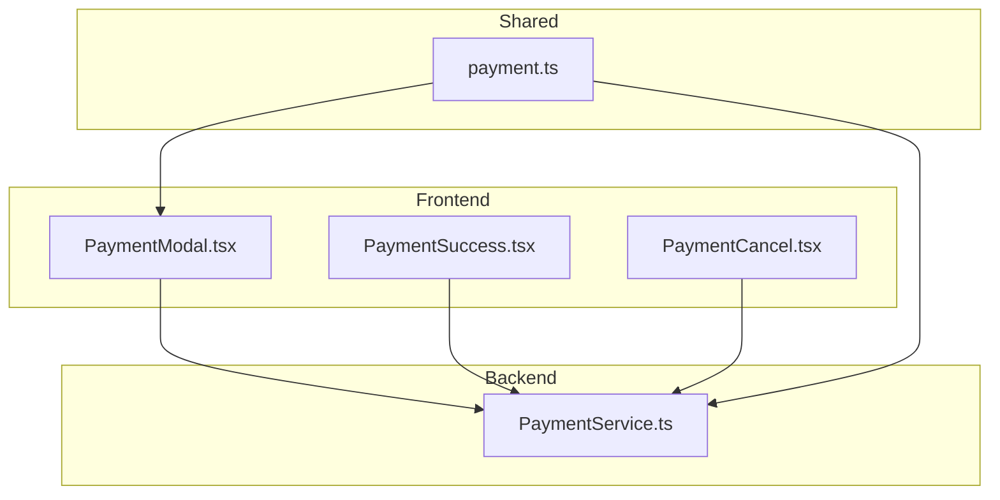
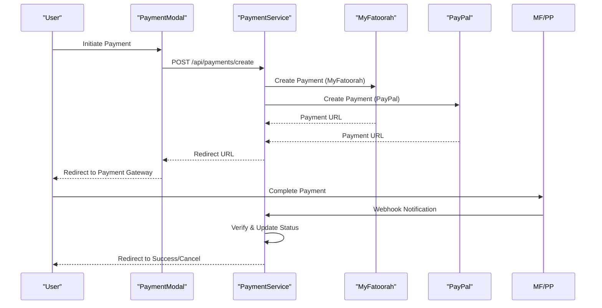
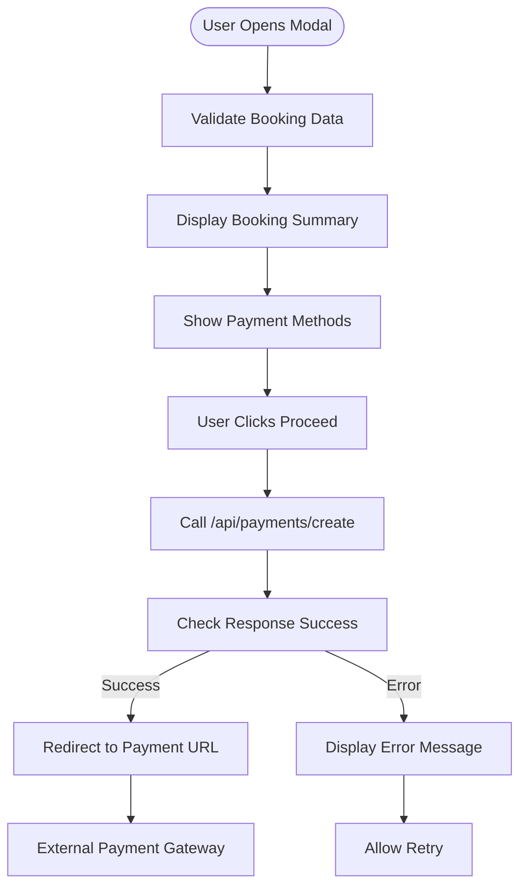
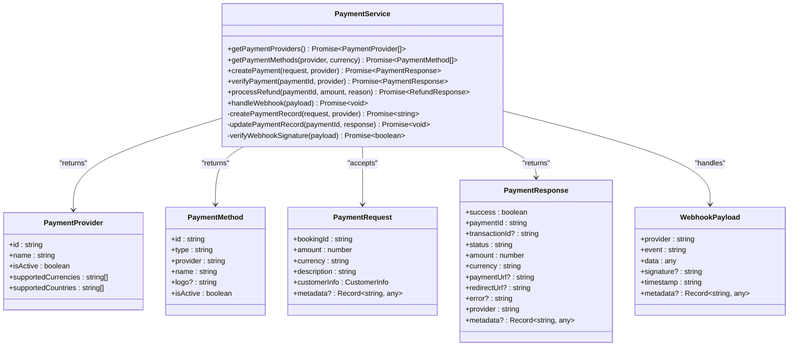
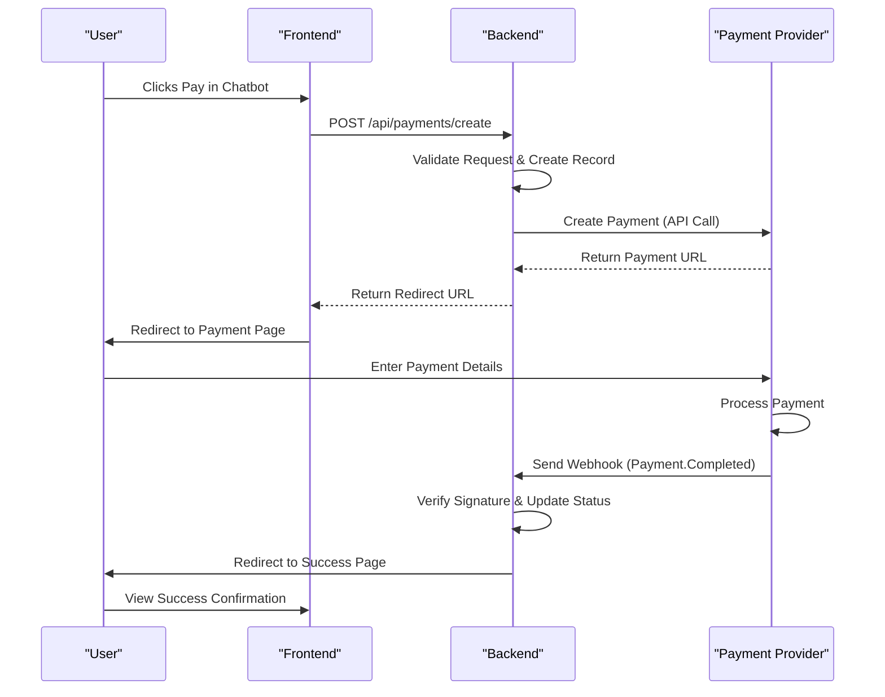
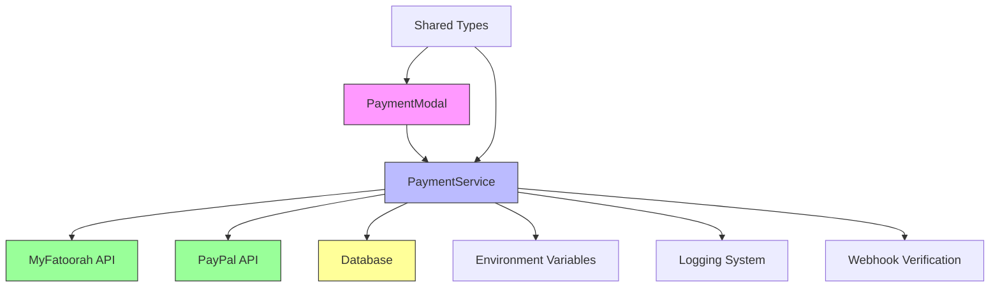

# Chatbot Payment Processing

<cite>
**Referenced Files in This Document**   
- [PaymentModal.tsx](file://src/react-app/components/PaymentModal.tsx)
- [PaymentService.ts](file://src/server/services/PaymentService.ts)
- [PaymentSuccess.tsx](file://src/react-app/pages/PaymentSuccess.tsx)
- [PaymentCancel.tsx](file://src/react-app/pages/PaymentCancel.tsx)
- [payment.ts](file://src/shared/payment.ts)
- [SECURITY.md](file://SECURITY.md)
</cite>

## Table of Contents
1. [Introduction](#introduction)
2. [Project Structure](#project-structure)
3. [Core Components](#core-components)
4. [Architecture Overview](#architecture-overview)
5. [Detailed Component Analysis](#detailed-component-analysis)
6. [Dependency Analysis](#dependency-analysis)
7. [Performance Considerations](#performance-considerations)
8. [Troubleshooting Guide](#troubleshooting-guide)
9. [Conclusion](#conclusion)

## Introduction
This document provides comprehensive documentation for the Chatbot Payment Processing system in HabibiStay. It details the payment flow, security considerations, integration with payment providers (MyFatoorah and PayPal), and practical examples for completing payments through the chat interface. The system is designed to securely handle booking payments with a focus on user experience and transaction reliability.

## Project Structure
The payment processing functionality is distributed across multiple directories in the application:

- **src/react-app/components**: Contains the `PaymentModal.tsx` component for initiating payments
- **src/react-app/pages**: Includes success and cancellation pages (`PaymentSuccess.tsx`, `PaymentCancel.tsx`)
- **src/server/services**: Houses the core `PaymentService.ts` business logic
- **src/shared**: Contains shared types and utilities in `payment.ts`
- **Root directory**: Security policies in `SECURITY.md`

The structure follows a clean separation between frontend components, backend services, and shared types, enabling maintainable and scalable payment processing.

**Diagram sources**
- [PaymentModal.tsx](file://src/react-app/components/PaymentModal.tsx)
- [PaymentService.ts](file://src/server/services/PaymentService.ts)
- [PaymentSuccess.tsx](file://src/react-app/pages/PaymentSuccess.tsx)
- [PaymentCancel.tsx](file://src/react-app/pages/PaymentCancel.tsx)
- [payment.ts](file://src/shared/payment.ts)

**Section sources**
- [PaymentModal.tsx](file://src/react-app/components/PaymentModal.tsx)
- [PaymentService.ts](file://src/server/services/PaymentService.ts)

## Core Components
The payment processing system consists of several key components that work together to facilitate secure transactions:

1. **PaymentModal**: Frontend component that displays payment options and initiates the payment process
2. **PaymentService**: Backend service that handles payment creation, verification, and webhook processing
3. **PaymentSuccess/PaymentCancel**: Pages that handle post-payment user experiences
4. **MyFatoorahService**: Utility class for interacting with the MyFatoorah payment gateway

These components follow a client-server architecture where the frontend initiates payment requests, and the backend orchestrates the payment flow with external providers.

**Section sources**
- [PaymentModal.tsx](file://src/react-app/components/PaymentModal.tsx#L1-L167)
- [PaymentService.ts](file://src/server/services/PaymentService.ts#L1-L960)

## Architecture Overview
The payment processing architecture follows a secure, provider-agnostic design that supports multiple payment gateways while maintaining a consistent interface.

**Diagram sources**
- [PaymentModal.tsx](file://src/react-app/components/PaymentModal.tsx#L25-L150)
- [PaymentService.ts](file://src/server/services/PaymentService.ts#L110-L200)

## Detailed Component Analysis

### Payment Modal Analysis
The PaymentModal component provides the user interface for initiating payments within the chatbot flow.

**Diagram sources**
- [PaymentModal.tsx](file://src/react-app/components/PaymentModal.tsx#L25-L150)

**Section sources**
- [PaymentModal.tsx](file://src/react-app/components/PaymentModal.tsx#L1-L167)

### Payment Service Analysis
The PaymentService class implements the core business logic for payment processing with comprehensive error handling and security measures.

**Diagram sources**
- [PaymentService.ts](file://src/server/services/PaymentService.ts#L1-L960)

**Section sources**
- [PaymentService.ts](file://src/server/services/PaymentService.ts#L1-L960)

### Payment Flow Analysis
The complete payment flow from initiation to completion involves multiple steps and system interactions.

**Diagram sources**
- [PaymentModal.tsx](file://src/react-app/components/PaymentModal.tsx#L25-L150)
- [PaymentService.ts](file://src/server/services/PaymentService.ts#L110-L200)
- [PaymentSuccess.tsx](file://src/react-app/pages/PaymentSuccess.tsx#L1-L223)

**Section sources**
- [PaymentModal.tsx](file://src/react-app/components/PaymentModal.tsx#L1-L167)
- [PaymentService.ts](file://src/server/services/PaymentService.ts#L1-L960)
- [PaymentSuccess.tsx](file://src/react-app/pages/PaymentSuccess.tsx#L1-L223)

## Dependency Analysis
The payment processing system has well-defined dependencies between components and external services.

**Diagram sources**
- [PaymentModal.tsx](file://src/react-app/components/PaymentModal.tsx)
- [PaymentService.ts](file://src/server/services/PaymentService.ts)
- [payment.ts](file://src/shared/payment.ts)

**Section sources**
- [PaymentService.ts](file://src/server/services/PaymentService.ts#L71-L108)
- [payment.ts](file://src/shared/payment.ts#L1-L165)

## Performance Considerations
The payment processing system is designed with performance and reliability in mind:

- **Caching**: Payment methods are cached to reduce API calls to payment providers
- **Idempotency**: Webhook handling includes idempotency checks to prevent duplicate processing
- **Error Handling**: Comprehensive error handling ensures graceful degradation
- **Asynchronous Processing**: Webhook processing occurs asynchronously to avoid blocking
- **Connection Pooling**: Database connections are managed efficiently
- **Timeout Handling**: API calls have appropriate timeout configurations

The system prioritizes transaction integrity over speed, ensuring payments are processed reliably even during peak loads.

## Troubleshooting Guide
Common issues and their solutions in the payment processing system:

**Section sources**
- [PaymentService.ts](file://src/server/services/PaymentService.ts#L222-L252)
- [SECURITY.md](file://SECURITY.md#L1-L257)

### Payment Creation Failures
**Symptoms**: User cannot initiate payment, receives error message
**Causes**:
- Invalid booking data
- Missing required fields
- Payment provider API issues
- Network connectivity problems

**Solutions**:
1. Verify all required fields are populated
2. Check payment provider API status
3. Validate environment variables (API keys)
4. Review server logs for specific error messages

### Webhook Processing Issues
**Symptoms**: Payments show as pending despite successful payment
**Causes**:
- Webhook signature verification failures
- Duplicate webhook processing
- Database connection issues
- Incorrect webhook URL configuration

**Solutions**:
1. Verify webhook secret and signature implementation
2. Check idempotency logic in `handleWebhook` method
3. Ensure database is accessible
4. Validate webhook URLs in payment provider dashboard

### Redirect Problems
**Symptoms**: User not redirected to payment gateway
**Causes**:
- Missing or invalid return/cancel URLs
- CORS policy restrictions
- Browser security settings
- Network interruptions

**Solutions**:
1. Verify return_url and cancel_url parameters
2. Check browser console for JavaScript errors
3. Ensure URLs are properly encoded
4. Test in different browsers and network conditions

### Refund Processing Errors
**Symptoms**: Refunds fail or show incorrect status
**Causes**:
- Invalid transaction IDs
- Insufficient funds
- Payment provider API limitations
- Authentication issues

**Solutions**:
1. Verify transaction ID exists and is correct
2. Check refund amount against original payment
3. Validate API credentials
4. Review payment provider documentation for refund policies

## Conclusion
The Chatbot Payment Processing system in HabibiStay provides a secure, reliable, and user-friendly way to complete bookings through the chat interface. By leveraging established payment providers like MyFatoorah and PayPal, the system ensures PCI compliance while maintaining a seamless user experience. The architecture separates concerns effectively between frontend and backend components, with clear interfaces and robust error handling. Security is prioritized throughout the implementation, with proper validation, encryption, and webhook verification. The system is well-documented and maintainable, making it easy to extend with additional payment providers or features in the future.