# AI Chatbot

<cite>
**Referenced Files in This Document**   
- [ChatBot.tsx](file://src/react-app/components/ChatBot.tsx) - *Updated with fullscreen mode and booking/payment flows*
- [ChatContext.tsx](file://src/react-app/contexts/ChatContext.tsx) - *Enhanced with new state management and API methods*
- [types.ts](file://src/shared/types.ts) - *Updated with new AI and chatbot types*
- [index.full.ts](file://src/worker/index.full.ts) - *Backend API implementation for enhanced chat*
- [ai-chat-service.ts](file://src/shared/ai-chat-service.ts) - *AI service implementation*
</cite>

## Update Summary
**Changes Made**   
- Added documentation for fullscreen mode functionality in ChatBot component
- Updated ChatContext state management to include isFullScreen state
- Added new methods for booking and payment integration in ChatContext
- Updated AI integration section with enhanced backend API details
- Added new sections for booking flow and payment processing
- Updated diagrams to reflect new architectural components
- Enhanced privacy and security documentation with audit logging details

## Table of Contents
1. [Introduction](#introduction)
2. [Project Structure](#project-structure)
3. [Core Components](#core-components)
4. [Architecture Overview](#architecture-overview)
5. [Detailed Component Analysis](#detailed-component-analysis)
6. [Chat Context and State Management](#chat-context-and-state-management)
7. [AI Integration and Backend Communication](#ai-integration-and-backend-communication)
8. [Property Recommendations and Booking Integration](#property-recommendations-and-booking-integration)
9. [Voice Interaction System](#voice-interaction-system)
10. [Prompt Engineering and Response Parsing](#prompt-engineering-and-response-parsing)
11. [Privacy and Data Handling](#privacy-and-data-handling)
12. [Customization and Extensibility](#customization-and-extensibility)
13. [Performance and Error Handling](#performance-and-error-handling)
14. [Conclusion](#conclusion)

## Introduction
The AI Chatbot feature in HabibiStay, named "Sara", is a comprehensive conversational interface designed to assist guests with property discovery, booking processes, and customer support. Implemented using React and integrated with OpenAI's GPT-4o-mini model, Sara provides natural language understanding capabilities while maintaining conversation context through a sophisticated state management system. The chatbot supports both text and voice interactions, displays property recommendations with interactive cards, and guides users through the complete booking journey including payment processing. This documentation provides a detailed analysis of Sara's implementation, covering architecture, data flow, AI integration, and extensibility features.

## Project Structure
The AI chatbot functionality is distributed across multiple directories within the HabibiStay application, following a modular architecture that separates concerns between frontend components, shared types, and context management. The implementation leverages React's context API for state management and follows TypeScript best practices for type safety across the codebase.

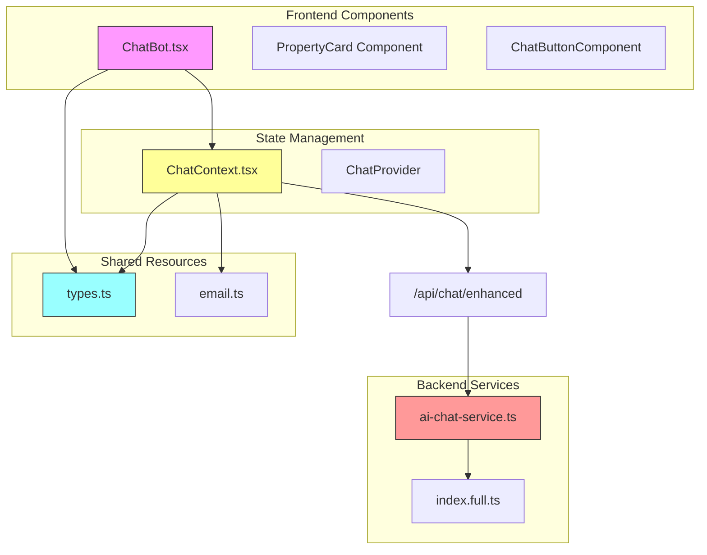
```mermaid
graph TB
subgraph "Frontend Components"
ChatBot[ChatBot.tsx]
PropertyCard[PropertyCard Component]
ChatButton[ChatButtonComponent]
end
subgraph "State Management"
ChatContext[ChatContext.tsx]
ContextProvider[ChatProvider]
end
subgraph "Shared Resources"
Types[types.ts]
Email[email.ts]
end
subgraph "Backend Services"
AIChatService[ai-chat-service.ts]
Worker[index.full.ts]
end
ChatBot --> ChatContext
ChatContext --> Types
ChatContext --> Email
ChatBot --> Types
ChatContext --> Backend["/api/chat/enhanced"]
Backend --> AIChatService
AIChatService --> Worker
style ChatBot fill:#f9f,stroke:#333
style ChatContext fill:#ff9,stroke:#333
style Types fill:#9ff,stroke:#333
style AIChatService fill:#f99,stroke:#333
```

**Diagram sources**
- [ChatBot.tsx](file://src/react-app/components/ChatBot.tsx)
- [ChatContext.tsx](file://src/react-app/contexts/ChatContext.tsx)
- [types.ts](file://src/shared/types.ts)
- [index.full.ts](file://src/worker/index.full.ts)
- [ai-chat-service.ts](file://src/shared/ai-chat-service.ts)

**Section sources**
- [ChatBot.tsx](file://src/react-app/components/ChatBot.tsx)
- [ChatContext.tsx](file://src/react-app/contexts/ChatContext.tsx)
- [types.ts](file://src/shared/types.ts)

## Core Components
The AI chatbot system consists of several core components that work together to provide a seamless conversational experience. The primary components include the ChatBot UI component, the ChatContext for state management, and supporting types and utilities that define the data structures and business logic.

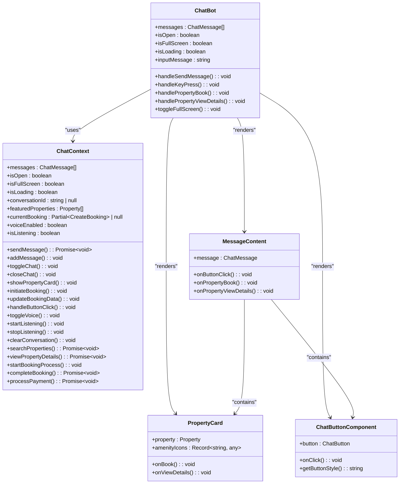
```mermaid
classDiagram
class ChatBot {
+messages : ChatMessage[]
+isOpen : boolean
+isFullScreen : boolean
+isLoading : boolean
+inputMessage : string
+handleSendMessage() : void
+handleKeyPress() : void
+handlePropertyBook() : void
+handlePropertyViewDetails() : void
+toggleFullScreen() : void
}
class ChatContext {
+messages : ChatMessage[]
+isOpen : boolean
+isFullScreen : boolean
+isLoading : boolean
+conversationId : string | null
+featuredProperties : Property[]
+currentBooking : Partial~CreateBooking~ | null
+voiceEnabled : boolean
+isListening : boolean
+sendMessage() : Promise~void~
+addMessage() : void
+toggleChat() : void
+closeChat() : void
+showPropertyCard() : void
+initiateBooking() : void
+updateBookingData() : void
+handleButtonClick() : void
+toggleVoice() : void
+startListening() : void
+stopListening() : void
+clearConversation() : void
+searchProperties() : Promise~void~
+viewPropertyDetails() : Promise~void~
+startBookingProcess() : void
+completeBooking() : Promise~void~
+processPayment() : Promise~void~
}
class PropertyCard {
+property : Property
+onBook() : void
+onViewDetails() : void
+amenityIcons : Record~string, any~
}
class ChatButtonComponent {
+button : ChatButton
+onClick() : void
+getButtonStyle() : string
}
class MessageContent {
+message : ChatMessage
+onButtonClick() : void
+onPropertyBook() : void
+onPropertyViewDetails() : void
}
ChatBot --> ChatContext : "uses"
ChatBot --> PropertyCard : "renders"
ChatBot --> ChatButtonComponent : "renders"
ChatBot --> MessageContent : "renders"
MessageContent --> PropertyCard : "contains"
MessageContent --> ChatButtonComponent : "contains"
```

**Diagram sources**
- [ChatBot.tsx](file://src/react-app/components/ChatBot.tsx)
- [ChatContext.tsx](file://src/react-app/contexts/ChatContext.tsx)

**Section sources**
- [ChatBot.tsx](file://src/react-app/components/ChatBot.tsx)
- [ChatContext.tsx](file://src/react-app/contexts/ChatContext.tsx)

## Architecture Overview
The AI chatbot architecture follows a client-server pattern where the frontend React application manages the user interface and conversation state, while communicating with a backend API endpoint that interfaces with the OpenAI GPT-4o-mini model. The architecture incorporates local storage for conversation persistence, voice recognition for speech input, and text-to-speech for auditory responses.

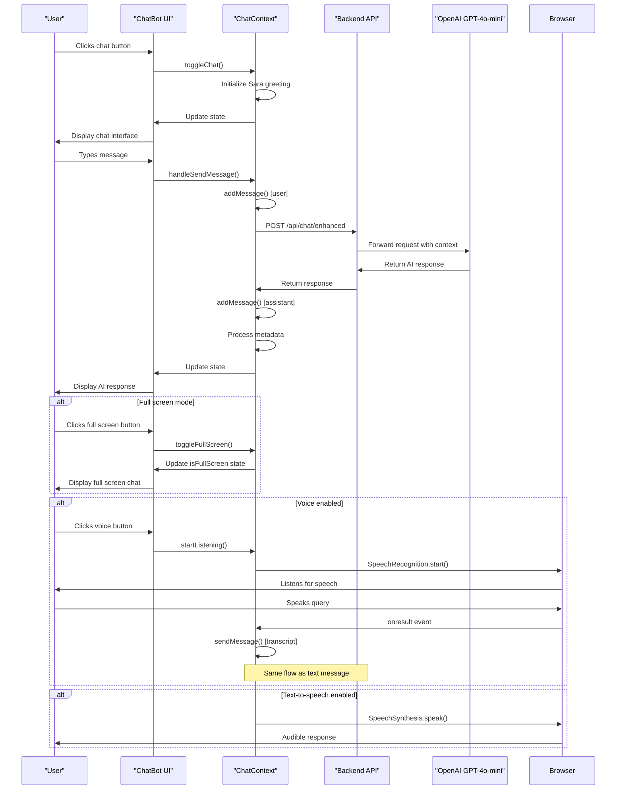
```mermaid
sequenceDiagram
participant User as "User"
participant ChatBot as "ChatBot UI"
participant ChatContext as "ChatContext"
participant API as "Backend API"
participant OpenAI as "OpenAI GPT-4o-mini"
User->>ChatBot : Clicks chat button
ChatBot->>ChatContext : toggleChat()
ChatContext->>ChatContext : Initialize Sara greeting
ChatContext->>ChatBot : Update state
ChatBot->>User : Display chat interface
User->>ChatBot : Types message
ChatBot->>ChatContext : handleSendMessage()
ChatContext->>ChatContext : addMessage() [user]
ChatContext->>API : POST /api/chat/enhanced
API->>OpenAI : Forward request with context
OpenAI->>API : Return AI response
API->>ChatContext : Return response
ChatContext->>ChatContext : addMessage() [assistant]
ChatContext->>ChatContext : Process metadata
ChatContext->>ChatBot : Update state
ChatBot->>User : Display AI response
alt Full screen mode
User->>ChatBot : Clicks full screen button
ChatBot->>ChatContext : toggleFullScreen()
ChatContext->>ChatBot : Update isFullScreen state
ChatBot->>User : Display full screen chat
end
alt Voice enabled
User->>ChatBot : Clicks voice button
ChatBot->>ChatContext : startListening()
ChatContext->>Browser : SpeechRecognition.start()
Browser->>User : Listens for speech
User->>Browser : Speaks query
Browser->>ChatContext : onresult event
ChatContext->>ChatContext : sendMessage() [transcript]
Note over ChatContext,API : Same flow as text message
end
alt Text-to-speech enabled
ChatContext->>Browser : SpeechSynthesis.speak()
Browser->>User : Audible response
end
```

**Diagram sources**
- [ChatBot.tsx](file://src/react-app/components/ChatBot.tsx)
- [ChatContext.tsx](file://src/react-app/contexts/ChatContext.tsx)
- [index.full.ts](file://src/worker/index.full.ts)

## Detailed Component Analysis

### ChatBot Component Analysis
The ChatBot component serves as the main user interface for interacting with Sara, the AI assistant. It renders the chat window, handles user input, and displays messages with rich content including property cards and action buttons. The component now supports both widget mode and full screen mode.

#### Component Structure and Rendering Logic
The ChatBot component uses React hooks to manage local state and lifecycle events. It conditionally renders either the chat button (when closed), the widget mode (when open but not full screen), or the full screen mode. The component handles keyboard input, message sending, and scrolling to the latest message.

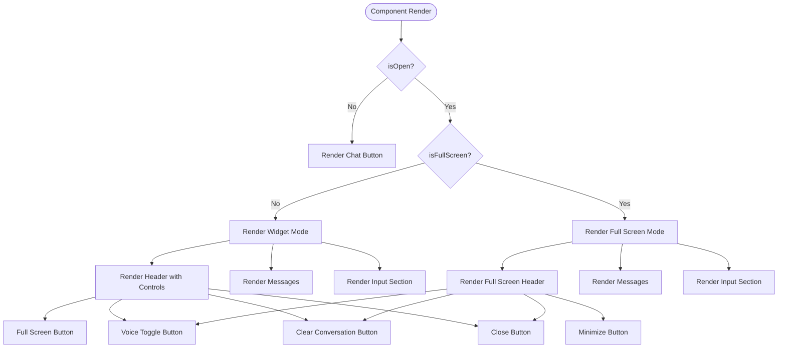
```mermaid
flowchart TD
Start([Component Render]) --> CheckOpen{"isOpen?"}
CheckOpen --> |No| RenderButton["Render Chat Button"]
CheckOpen --> |Yes| CheckFullScreen{"isFullScreen?"}
CheckFullScreen --> |No| RenderWidget["Render Widget Mode"]
CheckFullScreen --> |Yes| RenderFullScreen["Render Full Screen Mode"]
RenderWidget --> RenderHeader["Render Header with Controls"]
RenderHeader --> FullScreenToggle["Full Screen Button"]
RenderHeader --> VoiceToggle["Voice Toggle Button"]
RenderHeader --> ClearConv["Clear Conversation Button"]
RenderHeader --> CloseChat["Close Button"]
RenderWidget --> RenderMessages["Render Messages"]
RenderWidget --> RenderInput["Render Input Section"]
RenderFullScreen --> RenderFullScreenHeader["Render Full Screen Header"]
RenderFullScreenHeader --> Minimize["Minimize Button"]
RenderFullScreenHeader --> VoiceToggle["Voice Toggle Button"]
RenderFullScreenHeader --> ClearConv["Clear Conversation Button"]
RenderFullScreenHeader --> CloseChat["Close Button"]
RenderFullScreen --> RenderFullScreenMessages["Render Messages"]
RenderFullScreen --> RenderFullScreenInput["Render Input Section"]
```

**Diagram sources**
- [ChatBot.tsx](file://src/react-app/components/ChatBot.tsx)

**Section sources**
- [ChatBot.tsx](file://src/react-app/components/ChatBot.tsx)

### Message Content Rendering
The MessageContent component handles the rendering of AI responses, which may include text, property recommendations, and interactive buttons. This component interprets the metadata attached to chat messages to determine what additional content to display.

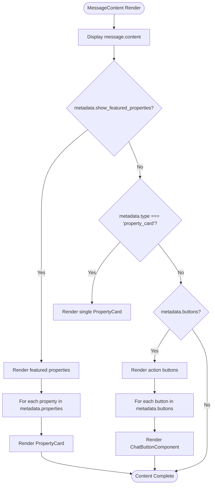
```mermaid
flowchart TD
Start([MessageContent Render]) --> DisplayText["Display message.content"]
DisplayText --> CheckFeatured{"metadata.show_featured_properties?"}
CheckFeatured --> |Yes| RenderFeatured["Render featured properties"]
CheckFeatured --> |No| CheckProperty{"metadata.type === 'property_card'?"}
CheckProperty --> |Yes| RenderPropertyCard["Render single PropertyCard"]
CheckProperty --> |No| CheckButtons{"metadata.buttons?"}
CheckButtons --> |Yes| RenderButtons["Render action buttons"]
CheckButtons --> |No| End([Content Complete])
RenderFeatured --> LoopProperties["For each property in metadata.properties"]
LoopProperties --> RenderProperty["Render PropertyCard"]
RenderButtons --> LoopButtons["For each button in metadata.buttons"]
LoopButtons --> RenderButton["Render ChatButtonComponent"]
RenderProperty --> End
RenderButton --> End
```

**Diagram sources**
- [ChatBot.tsx](file://src/react-app/components/ChatBot.tsx)

**Section sources**
- [ChatBot.tsx](file://src/react-app/components/ChatBot.tsx)

## Chat Context and State Management
The ChatContext provides a centralized state management solution for the AI chatbot, maintaining conversation history, user preferences, and booking context across the application. This context is implemented using React's Context API and follows best practices for performance optimization with useCallback and memoization.

### State Variables and Their Purposes
The ChatContext maintains several key state variables that track the chatbot's current state and user interactions:

- **messages**: Array of ChatMessage objects representing the conversation history
- **isOpen**: Boolean indicating whether the chat interface is visible
- **isFullScreen**: Boolean indicating whether the chat is in full screen mode
- **isLoading**: Boolean indicating whether a response is being processed
- **conversationId**: Unique identifier for the current conversation session
- **featuredProperties**: Array of Property objects for recommendation purposes
- **currentBooking**: Partial booking data being collected during the booking process
- **voiceEnabled**: Boolean indicating whether voice interaction is enabled
- **isListening**: Boolean indicating whether speech recognition is active

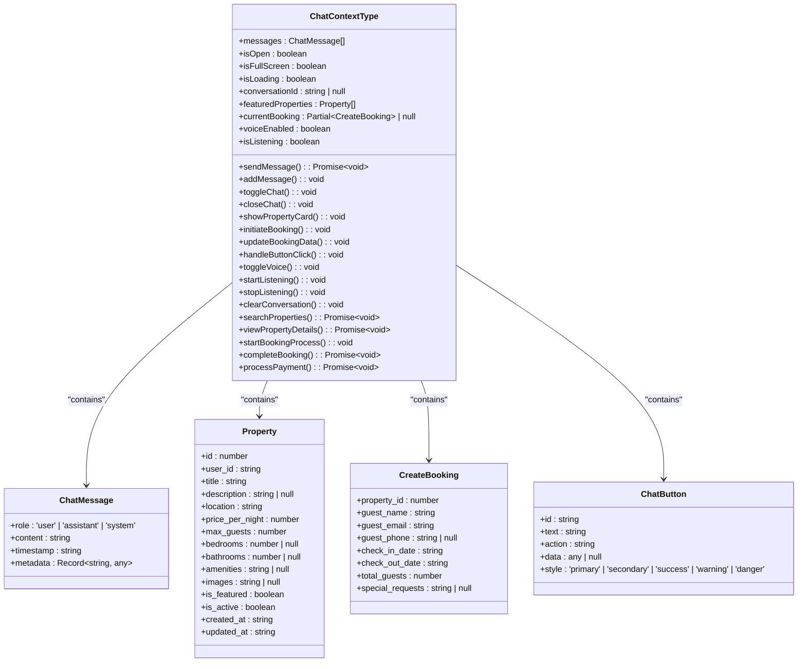
```mermaid
classDiagram
class ChatContextType {
+messages : ChatMessage[]
+isOpen : boolean
+isFullScreen : boolean
+isLoading : boolean
+conversationId : string | null
+featuredProperties : Property[]
+currentBooking : Partial~CreateBooking~ | null
+voiceEnabled : boolean
+isListening : boolean
+sendMessage() : Promise~void~
+addMessage() : void
+toggleChat() : void
+closeChat() : void
+showPropertyCard() : void
+initiateBooking() : void
+updateBookingData() : void
+handleButtonClick() : void
+toggleVoice() : void
+startListening() : void
+stopListening() : void
+clearConversation() : void
+searchProperties() : Promise~void~
+viewPropertyDetails() : Promise~void~
+startBookingProcess() : void
+completeBooking() : Promise~void~
+processPayment() : Promise~void~
}
class ChatMessage {
+role : 'user' | 'assistant' | 'system'
+content : string
+timestamp : string
+metadata : Record~string, any~
}
class Property {
+id : number
+user_id : string
+title : string
+description : string | null
+location : string
+price_per_night : number
+max_guests : number
+bedrooms : number | null
+bathrooms : number | null
+amenities : string | null
+images : string | null
+is_featured : boolean
+is_active : boolean
+created_at : string
+updated_at : string
}
class CreateBooking {
+property_id : number
+guest_name : string
+guest_email : string
+guest_phone : string | null
+check_in_date : string
+check_out_date : string
+total_guests : number
+special_requests : string | null
}
class ChatButton {
+id : string
+text : string
+action : string
+data : any | null
+style : 'primary' | 'secondary' | 'success' | 'warning' | 'danger'
}
ChatContextType --> ChatMessage : "contains"
ChatContextType --> Property : "contains"
ChatContextType --> CreateBooking : "contains"
ChatContextType --> ChatButton : "contains"
```

**Diagram sources**
- [ChatContext.tsx](file://src/react-app/contexts/ChatContext.tsx)
- [types.ts](file://src/shared/types.ts)

**Section sources**
- [ChatContext.tsx](file://src/react-app/contexts/ChatContext.tsx)
- [types.ts](file://src/shared/types.ts)

### Conversation Persistence
The chatbot implements conversation persistence using localStorage to maintain the conversation state between user sessions. Conversations are stored with a timestamp and automatically expire after 30 minutes of inactivity to ensure privacy and manage storage.

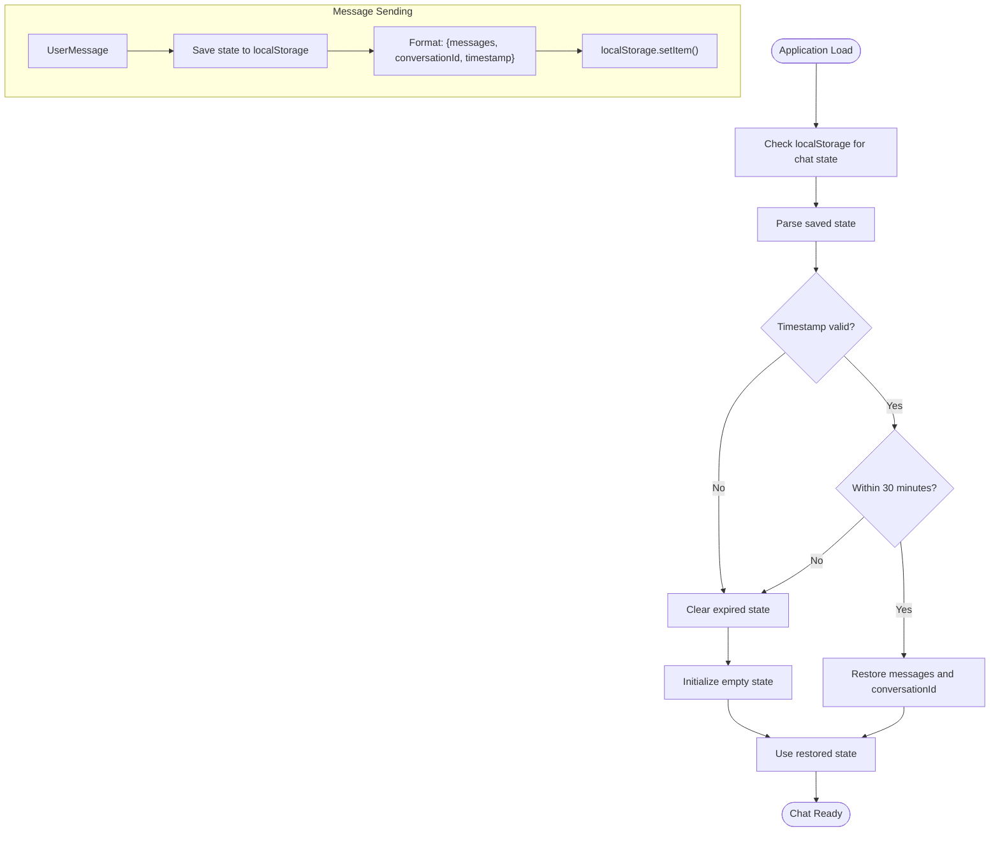
```mermaid
flowchart TD
Start([Application Load]) --> CheckStorage["Check localStorage for chat state"]
CheckStorage --> ParseState["Parse saved state"]
ParseState --> CheckTimestamp{"Timestamp valid?"}
CheckTimestamp --> |No| ClearStorage["Clear expired state"]
CheckTimestamp --> |Yes| CheckTimeout{"Within 30 minutes?"}
CheckTimeout --> |No| ClearStorage
CheckTimeout --> |Yes| RestoreState["Restore messages and conversationId"]
subgraph "Message Sending"
UserMessage --> SaveState["Save state to localStorage"]
SaveState --> FormatData["Format: {messages, conversationId, timestamp}"]
FormatData --> Store["localStorage.setItem()"]
end
ClearStorage --> Initialize["Initialize empty state"]
RestoreState --> UseState["Use restored state"]
Initialize --> UseState
UseState --> Ready([Chat Ready])
```

**Diagram sources**
- [ChatContext.tsx](file://src/react-app/contexts/ChatContext.tsx)

**Section sources**
- [ChatContext.tsx](file://src/react-app/contexts/ChatContext.tsx)

## AI Integration and Backend Communication
The AI chatbot communicates with a backend API endpoint that serves as an intermediary between the frontend application and the OpenAI GPT-4o-mini model. This architecture provides security by keeping API keys server-side and allows for additional processing of requests and responses.

### API Communication Flow
The chatbot sends user messages to the `/api/chat/enhanced` endpoint, which includes the current conversation ID to maintain context across multiple interactions. The backend processes this request, forwards it to OpenAI with appropriate system prompts and configuration, and returns a structured response.

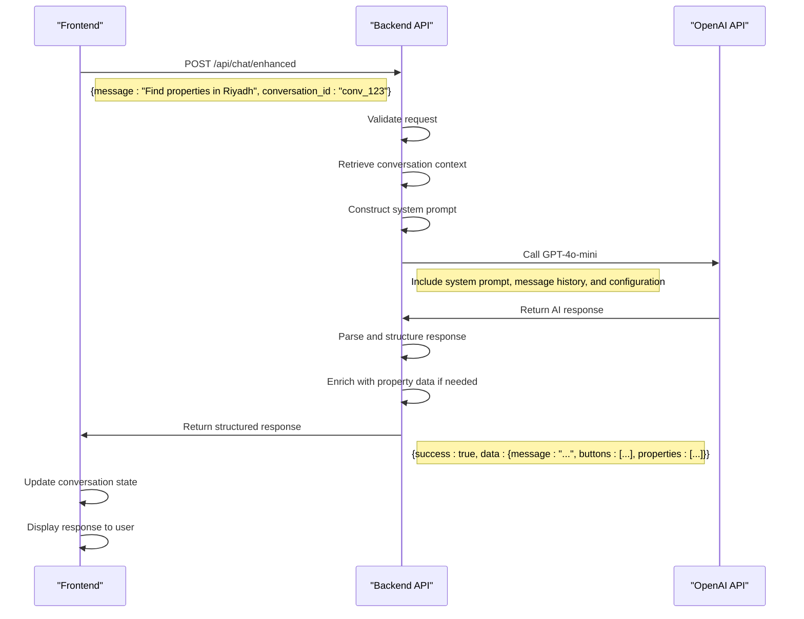
```mermaid
sequenceDiagram
participant Frontend as "Frontend"
participant Backend as "Backend API"
participant OpenAI as "OpenAI API"
Frontend->>Backend : POST /api/chat/enhanced
Note right of Frontend : {message : "Find properties in Riyadh", conversation_id : "conv_123"}
Backend->>Backend : Validate request
Backend->>Backend : Retrieve conversation context
Backend->>Backend : Construct system prompt
Backend->>OpenAI : Call GPT-4o-mini
Note right of Backend : Include system prompt, message history, and configuration
OpenAI->>Backend : Return AI response
Backend->>Backend : Parse and structure response
Backend->>Backend : Enrich with property data if needed
Backend->>Frontend : Return structured response
Note right of Backend : {success : true, data : {message : "...", buttons : [...], properties : [...]}}
Frontend->>Frontend : Update conversation state
Frontend->>Frontend : Display response to user
```

**Section sources**
- [ChatContext.tsx](file://src/react-app/contexts/ChatContext.tsx)
- [index.full.ts](file://src/worker/index.full.ts)

### AI Response Structure
The backend returns AI responses in a structured format that includes not only the message text but also metadata for interactive elements and property recommendations. This structure allows the frontend to render rich, interactive responses without requiring additional API calls.

```typescript
interface AIResponse {
  message: string;           // The main response text from the AI
  action?: string;          // Suggested action type (e.g., "search", "booking")
  data?: any;               // Additional data payload
  buttons?: ChatButton[];   // Array of interactive buttons to display
  properties?: Property[];  // Array of properties to recommend
}
```

This structured response format enables the chatbot to provide actionable responses with minimal latency, as all necessary data is delivered in a single API response.

## Property Recommendations and Booking Integration
The AI chatbot seamlessly integrates with HabibiStay's property and booking systems, allowing users to discover accommodations and initiate bookings directly within the conversation flow.

### Property Recommendation System
The chatbot can display property recommendations in two formats: featured properties shown on initial greeting, and specific property cards triggered by user inquiries or AI suggestions.

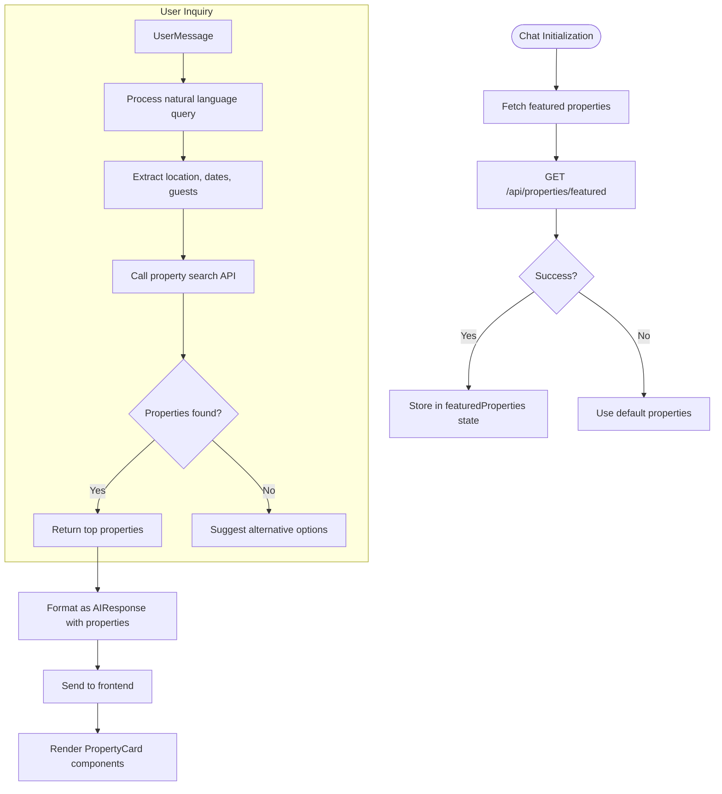
```mermaid
flowchart TD
Start([Chat Initialization]) --> FetchFeatured["Fetch featured properties"]
FetchFeatured --> API["GET /api/properties/featured"]
API --> Response{"Success?"}
Response --> |Yes| StoreProperties["Store in featuredProperties state"]
Response --> |No| UseDefaults["Use default properties"]
subgraph "User Inquiry"
UserMessage --> ProcessQuery["Process natural language query"]
ProcessQuery --> ExtractParams["Extract location, dates, guests"]
ExtractParams --> SearchAPI["Call property search API"]
SearchAPI --> Results{"Properties found?"}
Results --> |Yes| ReturnResults["Return top properties"]
Results --> |No| SuggestAlternatives["Suggest alternative options"]
end
ReturnResults --> FormatResponse["Format as AIResponse with properties"]
FormatResponse --> SendResponse["Send to frontend"]
SendResponse --> RenderCards["Render PropertyCard components"]
```

**Section sources**
- [ChatContext.tsx](file://src/react-app/contexts/ChatContext.tsx)
- [types.ts](file://src/shared/types.ts)

### Booking Process Integration
When a user expresses interest in booking a property, the chatbot guides them through a multi-step process, collecting necessary information and maintaining context throughout the interaction.

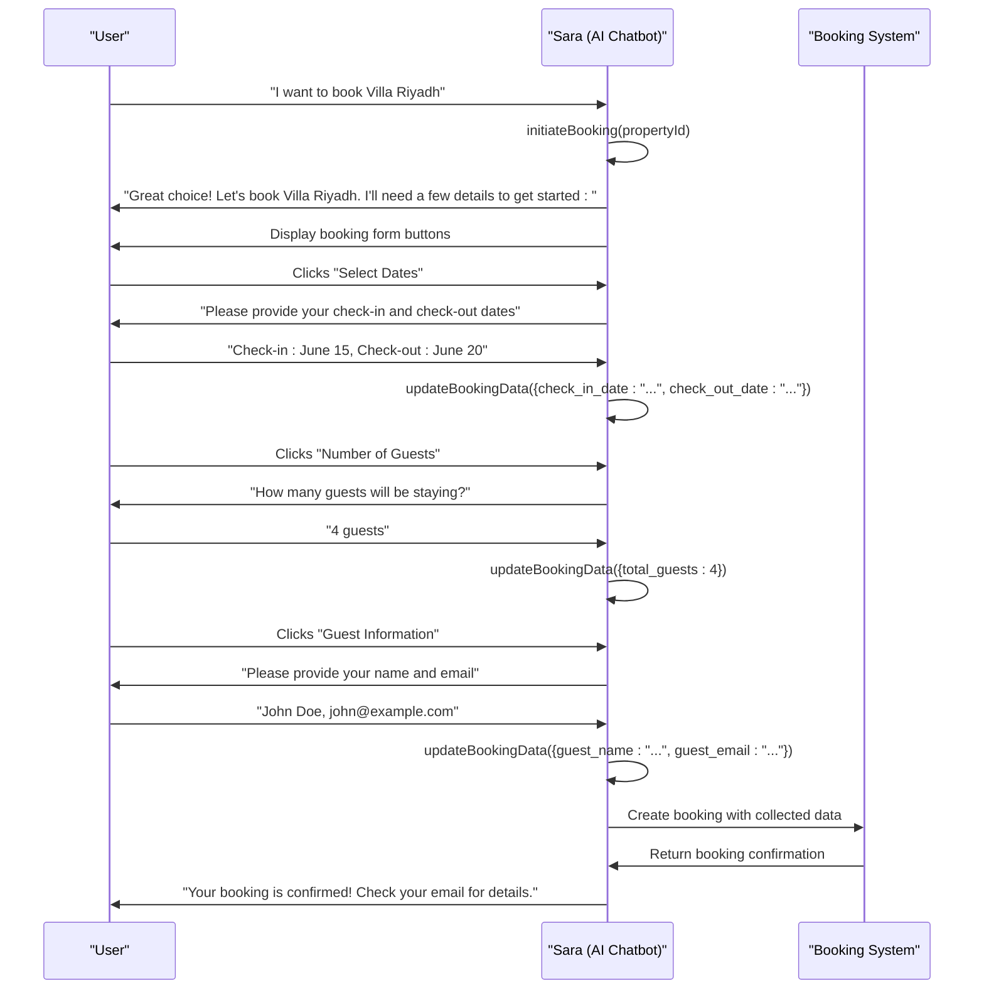
```mermaid
sequenceDiagram
participant User as "User"
participant Chatbot as "Sara (AI Chatbot)"
participant System as "Booking System"
User->>Chatbot : "I want to book Villa Riyadh"
Chatbot->>Chatbot : initiateBooking(propertyId)
Chatbot->>User : "Great choice! Let's book Villa Riyadh. I'll need a few details to get started : "
Chatbot->>User : Display booking form buttons
User->>Chatbot : Clicks "Select Dates"
Chatbot->>User : "Please provide your check-in and check-out dates"
User->>Chatbot : "Check-in : June 15, Check-out : June 20"
Chatbot->>Chatbot : updateBookingData({check_in_date : "...", check_out_date : "..."})
User->>Chatbot : Clicks "Number of Guests"
Chatbot->>User : "How many guests will be staying?"
User->>Chatbot : "4 guests"
Chatbot->>Chatbot : updateBookingData({total_guests : 4})
User->>Chatbot : Clicks "Guest Information"
Chatbot->>User : "Please provide your name and email"
User->>Chatbot : "John Doe, john@example.com"
Chatbot->>Chatbot : updateBookingData({guest_name : "...", guest_email : "..."})
Chatbot->>System : Create booking with collected data
System->>Chatbot : Return booking confirmation
Chatbot->>User : "Your booking is confirmed! Check your email for details."
```

**Section sources**
- [ChatContext.tsx](file://src/react-app/contexts/ChatContext.tsx)
- [types.ts](file://src/shared/types.ts)

### Payment Processing Integration
After booking creation, the chatbot facilitates payment processing by guiding users through the payment flow and handling payment initiation.

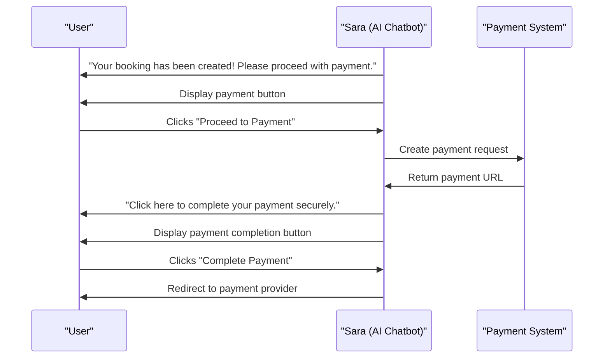
```mermaid
sequenceDiagram
participant User as "User"
participant Chatbot as "Sara (AI Chatbot)"
participant PaymentSystem as "Payment System"
Chatbot->>User : "Your booking has been created! Please proceed with payment."
Chatbot->>User : Display payment button
User->>Chatbot : Clicks "Proceed to Payment"
Chatbot->>PaymentSystem : Create payment request
PaymentSystem->>Chatbot : Return payment URL
Chatbot->>User : "Click here to complete your payment securely."
Chatbot->>User : Display payment completion button
User->>Chatbot : Clicks "Complete Payment"
Chatbot->>User : Redirect to payment provider
```

**Section sources**
- [ChatContext.tsx](file://src/react-app/contexts/ChatContext.tsx)
- [index.full.ts](file://src/worker/index.full.ts)

## Voice Interaction System
The AI chatbot includes a comprehensive voice interaction system that supports both speech-to-text input and text-to-speech output, providing an accessible and hands-free user experience.

### Voice Input Implementation
The voice input system uses the Web Speech API's SpeechRecognition interface to convert spoken language into text that can be processed by the AI chatbot.

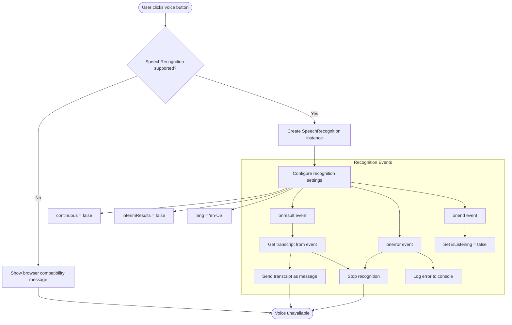
```mermaid
flowchart TD
Start([User clicks voice button]) --> CheckSupport{"SpeechRecognition supported?"}
CheckSupport --> |No| ShowError["Show browser compatibility message"]
CheckSupport --> |Yes| CreateInstance["Create SpeechRecognition instance"]
CreateInstance --> Configure["Configure recognition settings"]
Configure --> SetContinuous["continuous = false"]
Configure --> SetInterim["interimResults = false"]
Configure --> SetLanguage["lang = 'en-US'"]
subgraph "Recognition Events"
Configure --> OnResult["onresult event"]
OnResult --> GetTranscript["Get transcript from event"]
GetTranscript --> SendMessage["Send transcript as message"]
GetTranscript --> StopListening["Stop recognition"]
Configure --> OnError["onerror event"]
OnError --> LogError["Log error to console"]
OnError --> StopListening
Configure --> OnEnd["onend event"]
OnEnd --> ResetListening["Set isListening = false"]
end
ShowError --> End([Voice unavailable])
SendMessage --> End
StopListening --> End
```

**Section sources**
- [ChatContext.tsx](file://src/react-app/contexts/ChatContext.tsx)

### Text-to-Speech Output
When voice mode is enabled, the chatbot uses the Web Speech API's SpeechSynthesis interface to audibly speak AI responses, creating a more natural conversational experience.

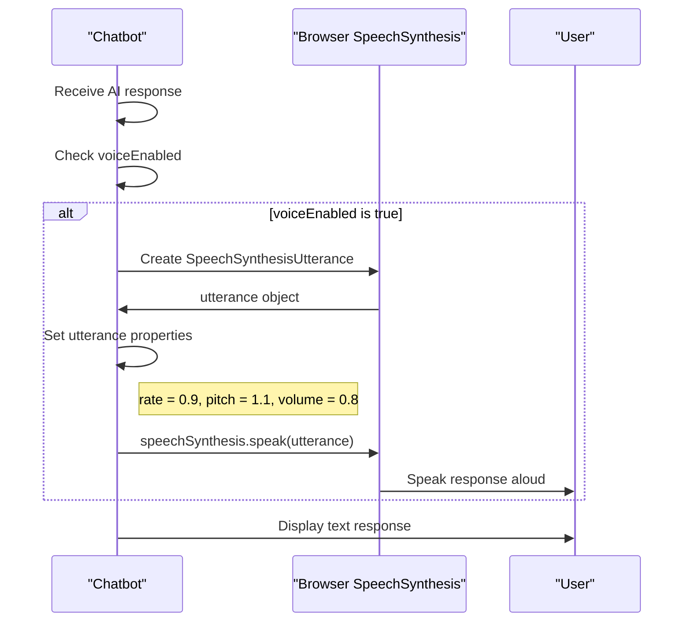
```mermaid
sequenceDiagram
participant Chatbot as "Chatbot"
participant Browser as "Browser SpeechSynthesis"
participant User as "User"
Chatbot->>Chatbot : Receive AI response
Chatbot->>Chatbot : Check voiceEnabled
alt voiceEnabled is true
Chatbot->>Browser : Create SpeechSynthesisUtterance
Browser->>Chatbot : utterance object
Chatbot->>Chatbot : Set utterance properties
Note right of Chatbot : rate = 0.9, pitch = 1.1, volume = 0.8
Chatbot->>Browser : speechSynthesis.speak(utterance)
Browser->>User : Speak response aloud
end
Chatbot->>User : Display text response
```

**Section sources**
- [ChatContext.tsx](file://src/react-app/contexts/ChatContext.tsx)

## Prompt Engineering and Response Parsing
The effectiveness of the AI chatbot depends heavily on well-crafted prompts and robust response parsing mechanisms that ensure consistent, actionable outputs.

### System Prompt Design
The backend system uses carefully engineered prompts that define Sara's personality, capabilities, and response format requirements. These prompts guide the AI model to produce structured responses that can be easily parsed by the frontend.

```
You are Sara, the AI accommodation assistant for HabibiStay, a premium property rental platform in Riyadh, Saudi Arabia. Your role is to help guests find perfect stays, answer questions about properties and bookings, and guide users through the reservation process.

Personality: Friendly and professional
Knowledge: Properties in Riyadh, booking policies, local attractions
Capabilities: 
- Recommend properties based on user preferences
- Provide detailed information about amenities and locations
- Guide users through the booking process
- Answer questions about cancellation policies and pricing
- Suggest alternatives when requested properties are unavailable

Response Format Rules:
1. Keep responses concise (under 150 words)
2. Use natural, conversational language
3. When recommending properties, include a "properties" array with property objects
4. When suggesting actions, include a "buttons" array with actionable buttons
5. Use markdown-style line breaks (\n) for paragraph separation
6. Never invent property details - only use information from the provided context

Available Actions:
- search_properties: Show property search interface
- check_availability: Check dates for specific property
- initiate_booking: Start booking process
- get_help: Connect with human support
- view_details: Show full property details
- contact_support: Open contact form
```

This system prompt establishes clear boundaries and expectations for the AI's behavior, ensuring consistent and reliable responses.

### Response Parsing and Validation
The frontend implements robust response parsing to handle the structured data returned by the backend, with fallback mechanisms for error cases.

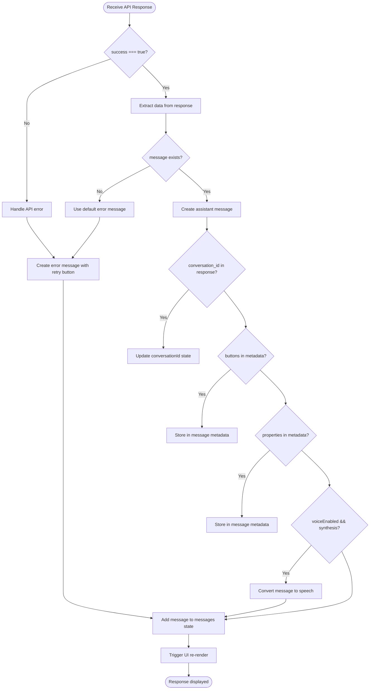
```mermaid
flowchart TD
Start([Receive API Response]) --> CheckSuccess{"success === true?"}
CheckSuccess --> |No| HandleError["Handle API error"]
CheckSuccess --> |Yes| ExtractData["Extract data from response"]
ExtractData --> CheckMessage{"message exists?"}
CheckMessage --> |No| UseDefault["Use default error message"]
CheckMessage --> |Yes| CreateAssistantMsg["Create assistant message"]
CreateAssistantMsg --> CheckConversationId{"conversation_id in response?"}
CheckConversationId --> |Yes| UpdateId["Update conversationId state"]
CheckConversationId --> CheckButtons{"buttons in metadata?"}
CheckButtons --> |Yes| StoreButtons["Store in message metadata"]
CheckButtons --> CheckProperties{"properties in metadata?"}
CheckProperties --> |Yes| StoreProperties["Store in message metadata"]
CheckProperties --> CheckVoice{"voiceEnabled && synthesis?"}
CheckVoice --> |Yes| TextToSpeech["Convert message to speech"]
CheckVoice --> UpdateMessages["Add message to messages state"]
UpdateMessages --> Rerender["Trigger UI re-render"]
HandleError --> CreateErrorMsg["Create error message with retry button"]
CreateErrorMsg --> UpdateMessages
UseDefault --> CreateErrorMsg
TextToSpeech --> UpdateMessages
Rerender --> End([Response displayed])
```

**Section sources**
- [ChatContext.tsx](file://src/react-app/contexts/ChatContext.tsx)

## Privacy and Data Handling
The AI chatbot implementation includes several privacy and data handling considerations to protect user information and comply with data protection regulations.

### Conversation Data Storage
Conversation data is stored locally in the user's browser using localStorage, with automatic expiration after 30 minutes of inactivity. This approach balances user convenience with privacy considerations.

- **Data stored**: Messages, conversation ID, timestamp
- **Storage location**: Browser localStorage
- **Retention period**: 30 minutes of inactivity
- **Data encryption**: None (client-side only)
- **Cross-device sync**: Not available

This local storage approach ensures that conversation history is not transmitted to external servers beyond the necessary API calls for AI processing.

### User Data Protection
The system implements several measures to protect user data:

1. **Minimal data collection**: Only collects data necessary for the conversation and booking process
2. **Session-based storage**: Conversation state is tied to the browser session
3. **No persistent user profiling**: Does not create long-term user profiles from chat interactions
4. **Secure API communication**: All API calls use HTTPS
5. **Input sanitization**: User inputs are validated before processing
6. **Audit logging**: All interactions are logged for security and compliance purposes

The chatbot does not store personally identifiable information beyond what is explicitly provided during the booking process, and even this data is handled by the secure booking system rather than retained in the chat history.

**Section sources**
- [ChatContext.tsx](file://src/react-app/contexts/ChatContext.tsx)
- [index.full.ts](file://src/worker/index.full.ts)

## Customization and Extensibility
The AI chatbot architecture is designed to be highly customizable and extensible, allowing administrators to modify the chatbot's behavior without code changes.

### AI Configuration Options
Administrators can configure various aspects of the AI chatbot through a configuration system that supports multiple AI providers and customizable parameters.

```typescript
interface AIConfig {
  id: number;
  model_provider: 'openai' | 'anthropic' | 'gemini';
  model_name: string;
  api_key?: string;
  temperature: number; // 0-2, controls randomness
  max_tokens: number; // Maximum response length
  system_prompt?: string; // Custom system prompt
  personality: 'professional' | 'friendly' | 'casual';
  language: string;
  is_active: boolean;
}
```

These configuration options allow for:
- Switching between different AI providers
- Adjusting response creativity with temperature settings
- Controlling response length
- Customizing the chatbot's personality and tone
- Supporting multiple languages

### Adding New Intents
New conversational intents can be added by extending the backend's intent recognition system and updating the system prompt. For example, adding a "local_attractions" intent would involve:

1. Updating the system prompt to include knowledge about local attractions
2. Adding new action types to the AIResponse schema
3. Implementing backend logic to fetch attraction data
4. Creating new button types for attraction-related actions
5. Updating the frontend to handle attraction-related responses

This extensible design allows the chatbot's capabilities to grow over time without requiring major architectural changes.

**Section sources**
- [types.ts](file://src/shared/types.ts)

## Performance and Error Handling
The AI chatbot implementation includes comprehensive performance optimizations and error handling mechanisms to ensure a reliable user experience.

### Rate Limiting and Loading States
The system implements client-side rate limiting to prevent excessive API calls and provides clear visual feedback during processing.

- **Loading indicators**: Animated dots shown during AI processing
- **Send button disabled**: Prevents duplicate messages
- **Input disabled**: During response generation
- **Rate limiting**: Built into backend API
- **Retry mechanism**: Available for failed requests

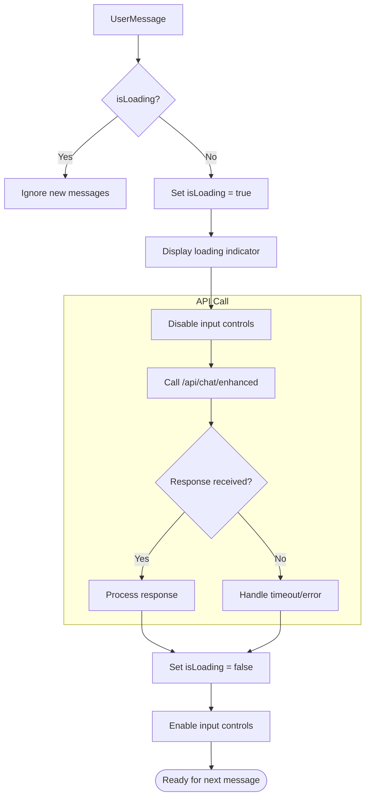
```mermaid
flowchart TD
UserMessage --> CheckLoading{"isLoading?"}
CheckLoading --> |Yes| IgnoreInput["Ignore new messages"]
CheckLoading --> |No| SetLoading["Set isLoading = true"]
SetLoading --> ShowLoading["Display loading indicator"]
ShowLoading --> DisableInput["Disable input controls"]
subgraph "API Call"
DisableInput --> CallAPI["Call /api/chat/enhanced"]
CallAPI --> APIResponse{"Response received?"}
APIResponse --> |Yes| ProcessResponse["Process response"]
APIResponse --> |No| HandleTimeout["Handle timeout/error"]
end
ProcessResponse --> HideLoading["Set isLoading = false"]
HandleTimeout --> HideLoading
HideLoading --> EnableInput["Enable input controls"]
EnableInput --> End([Ready for next message])
```

**Section sources**
- [ChatContext.tsx](file://src/react-app/contexts/ChatContext.tsx)

### Error Recovery Strategies
The chatbot implements multiple error recovery strategies to handle various failure scenarios:

1. **Network errors**: Display friendly error message with retry option
2. **API errors**: Log details and provide alternative actions
3. **Voice recognition errors**: Fall back to text input
4. **Invalid responses**: Use default error message
5. **Timeouts**: Implement request timeouts with recovery options

These strategies ensure that the chatbot remains usable even when individual components fail, providing a resilient user experience.

## Conclusion
The AI chatbot "Sara" in HabibiStay represents a sophisticated implementation of conversational AI integrated with a property booking platform. By leveraging the OpenAI GPT-4o-mini model, React context for state management, and a well-structured backend API, the system provides a seamless user experience for property discovery and booking. Key strengths include:

- **Context preservation**: Maintains conversation history and booking context
- **Rich interactions**: Supports text, voice, property cards, and action buttons
- **Privacy-conscious design**: Local storage with automatic expiration
- **Extensible architecture**: Configurable AI settings and easy intent addition
- **Robust error handling**: Comprehensive recovery strategies
- **Enhanced functionality**: Full screen mode and complete booking/payment integration

The implementation demonstrates best practices in AI integration, with careful attention to user experience, performance, and data privacy. Future enhancements could include multi-language support, more sophisticated voice interaction, and deeper personalization based on user preferences and past behavior.