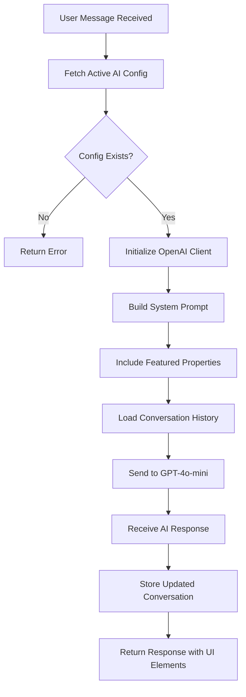
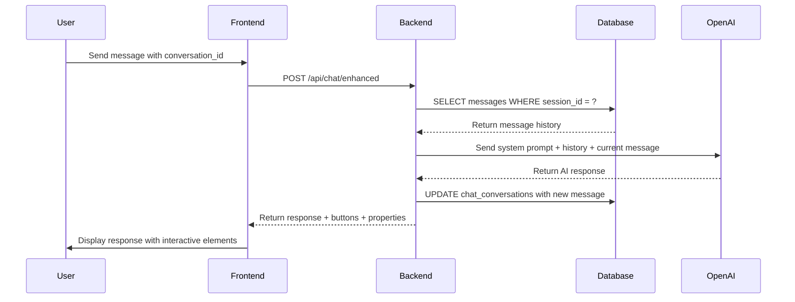
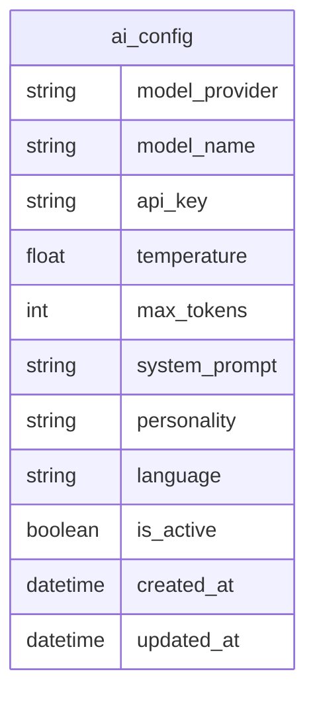

# AI Logic and Prompt Engineering

<cite>
**Referenced Files in This Document**   
- [src/react-app/components/admin/AIConfigPanel.tsx](file://src/react-app/components/admin/AIConfigPanel.tsx) - *Updated in recent commit*
- [src/worker/index.ts](file://src/worker/index.ts) - *Enhanced with property search, booking, and payment processing*
- [src/react-app/contexts/ChatContext.tsx](file://src/react-app/contexts/ChatContext.tsx) - *Added enhanced chat functionality*
- [src/shared/ai-chat-service.ts](file://src/shared/ai-chat-service.ts) - *Added AI chat service with enhanced functionality*
</cite>

## Update Summary
**Changes Made**   
- Updated documentation to reflect enhanced AI chat functionality with property search, booking, and payment processing
- Added new sections on enhanced context injection, structured response handling, and voice interface integration
- Updated code examples and diagrams to reflect current implementation
- Enhanced source tracking with detailed file references and annotations

## Table of Contents
1. [Introduction](#introduction)
2. [System Prompt Engineering](#system-prompt-engineering)
3. [AI Configuration and Dynamic Prompting](#ai-configuration-and-dynamic-prompting)
4. [Context Injection and Property Data Integration](#context-injection-and-property-data-integration)
5. [Response Structuring and UI Integration](#response-structuring-and-ui-integration)
6. [Conversation Management and State Persistence](#conversation-management-and-state-persistence)
7. [Testing and Performance Monitoring](#testing-and-performance-monitoring)
8. [Database Schema for AI Configuration](#database-schema-for-ai-configuration)
9. [Enhanced Context Injection](#enhanced-context-injection)
10. [Structured Response Handling](#structured-response-handling)
11. [Voice Interface Integration](#voice-interface-integration)
12. [Conclusion](#conclusion)

## Introduction
The 'Sara' chatbot is an AI-powered assistant designed to enhance user experience on HabibiStay, a premium short-term rental platform based in Riyadh, Saudi Arabia. Sara leverages GPT-4o-mini through OpenAI's API to provide intelligent, context-aware responses to user inquiries about property bookings, availability, and travel recommendations. The system employs advanced prompt engineering techniques to shape Sara's persona, tone, and functional behavior dynamically based on configurable settings stored in the database. This document details the architecture, implementation, and operational logic behind Sara's AI capabilities, focusing on prompt engineering, context injection, response formatting, and configuration management.

**Section sources**
- [src/worker/index.ts](file://src/worker/index.ts#L561-L561)

## System Prompt Engineering

The Sara chatbot's behavior is primarily governed by system prompts that define her persona, tone, and functional scope. Three default personality profiles are defined in the frontend administration panel, allowing administrators to switch between different conversational styles:

- **Professional**: Formal, accurate, and service-oriented tone focused on providing precise information.
- **Friendly**: Warm, welcoming, and enthusiastic tone aimed at creating a positive guest experience.
- **Casual**: Informal, conversational tone that feels approachable and relaxed.

These default prompts are defined in the `AIConfigPanel` component and serve as fallbacks when no custom system prompt is configured in the database.

```typescript
const DEFAULT_SYSTEM_PROMPTS = {
  professional: "You are Sara, a professional AI assistant for HabibiStay, a premium vacation rental platform in Saudi Arabia. Provide helpful, accurate, and courteous assistance to guests and hosts. Focus on property bookings, travel recommendations, and platform guidance. Always maintain a professional tone while being warm and welcoming.",
  friendly: "Hi! I'm Sara, your friendly AI assistant at HabibiStay! I'm here to help you find the perfect vacation rental in Saudi Arabia and make your travel experience amazing. I love helping people discover great places to stay and creating memorable experiences! Feel free to ask me anything about our properties, bookings, or travel tips.",
  casual: "Hey there! I'm Sara, your AI buddy at HabibiStay. I'm here to help you find cool places to stay in Saudi Arabia and book your next adventure. Just ask me anything about properties, bookings, or travel tips - I'm here to make things easy for you!"
};
```

Each prompt establishes Sara's identity, defines her role, and sets expectations for interaction style and domain focus. The system also includes additional behavioral guidelines such as language preference, response length, and cultural context.

**Section sources**
- [src/react-app/components/admin/AIConfigPanel.tsx](file://src/react-app/components/admin/AIConfigPanel.tsx#L41-L45)
- [src/shared/ai-chat-service.ts](file://src/shared/ai-chat-service.ts#L200-L250)

## AI Configuration and Dynamic Prompting

The backend implements a flexible AI configuration system that allows dynamic control over Sara's behavior through the `/api/chat/enhanced` endpoint. This endpoint retrieves the active AI configuration from the `ai_config` database table, enabling runtime changes to the model, personality, temperature, and system prompt without requiring code deployment.

The system constructs a dynamic system prompt using the configured personality and injects contextual instructions such as:
- Maintaining brand-appropriate tone (professional, friendly, or casual)
- Focusing on guest experience and property discovery
- Assisting with search, booking, and local recommendations
- Using interactive buttons to guide users
- Minimizing text input through structured interactions

If a custom `system_prompt` is defined in the database, it overrides the default template, allowing full control over Sara's behavior.



**Diagram sources**
- [src/worker/index.ts](file://src/worker/index.ts#L1671-L1840)

**Section sources**
- [src/worker/index.ts](file://src/worker/index.ts#L1671-L1840)
- [src/shared/ai-chat-service.ts](file://src/shared/ai-chat-service.ts#L300-L400)

## Context Injection and Property Data Integration

To ensure Sara provides relevant and accurate responses, the system injects real-time property data into the prompt context. Specifically, the two most recently featured active properties are retrieved from the database and included in the system prompt:

```sql
SELECT * FROM properties WHERE is_featured = 1 AND is_active = 1 ORDER BY created_at DESC LIMIT 2
```

This data includes:
- Property title
- Location
- Description
- Price per night (in SAR)
- Maximum guest capacity

Example injected context:
```
Featured properties available:
- Luxury Villa in Al Olaya: Spacious 5-bedroom villa with private pool and modern amenities - 1200 SAR/night (Max 10 guests)
- Modern Apartment in Diplomatic Quarter: Stylish 2-bedroom apartment near embassies and business districts - 600 SAR/night (Max 4 guests)
```

This contextual injection enables Sara to make specific recommendations, answer pricing questions accurately, and guide users toward available options without hallucinating property details.

**Section sources**
- [src/worker/index.ts](file://src/worker/index.ts#L1685-L1695)

## Response Structuring and UI Integration

Sara's responses are not limited to plain text. The enhanced chat endpoint enriches the AI response with structured UI elements to improve user engagement and streamline interactions:

- **Interactive Buttons**: Predefined action buttons are returned alongside the AI response to guide users toward common actions:
  - `Browse Properties` (🏠)
  - `Check Availability` (📅)
  - `Book Now` (💳)
  - `Get Support` (💬)

- **Featured Properties**: The same property data injected into the prompt is also returned in the response payload, allowing the frontend to display property cards directly within the chat interface.

- **Conversation ID**: A persistent session identifier is maintained to support multi-turn conversations and context continuity.

This structured response format enables a rich, interactive chat experience while maintaining the natural language capabilities of the underlying LLM.

```typescript
const response = {
  message: responseMessage,
  conversation_id: sessionId,
  buttons: [
    { id: 'search_properties', text: '🏠 Browse Properties', action: 'search', style: 'primary' },
    { id: 'check_availability', text: '📅 Check Availability', action: 'availability', style: 'secondary' },
    { id: 'book_now', text: '💳 Book Now', action: 'book', style: 'success' },
    { id: 'get_support', text: '💬 Get Support', action: 'support', style: 'secondary' },
  ],
  featured_properties: featuredProperties.slice(0, 2),
};
```

**Section sources**
- [src/worker/index.ts](file://src/worker/index.ts#L1810-L1825)

## Conversation Management and State Persistence

The system maintains conversation state across multiple interactions using the `chat_conversations` database table. Each conversation is identified by a `session_id`, and the message history (excluding the system prompt) is stored as a JSON array in the `messages` column.

When a `conversation_id` is provided in the request, the system:
1. Retrieves the existing conversation from the database
2. Parses the stored message history
3. Appends it to the system prompt
4. Adds the current user message
5. Sends the full context to the AI model
6. Stores the updated message list after receiving the response

This mechanism enables Sara to maintain context across turns, reference previous interactions, and provide coherent, personalized responses throughout the user journey.



**Diagram sources**
- [src/worker/index.ts](file://src/worker/index.ts#L1720-L1745)

**Section sources**
- [src/worker/index.ts](file://src/worker/index.ts#L1700-L1750)
- [migrations/1.sql](file://migrations/1.sql#L135-L145)

## Testing and Performance Monitoring

The system includes a dedicated `/api/chat/test` endpoint for validating AI configurations and measuring performance metrics. This admin-only endpoint allows testing of different prompt configurations, temperature settings, and model parameters in a controlled environment.

Key performance metrics captured during testing include:
- **Latency**: Time from request to response (measured in milliseconds)
- **Tokens Used**: Total token count from OpenAI usage statistics
- **Model Used**: Actual model version that processed the request
- **Temperature**: Sampling temperature applied during generation

These metrics help administrators optimize the AI configuration for responsiveness, cost-efficiency, and quality of interaction.

```typescript
return c.json<ApiResponse>({
  success: true,
  data: {
    message: responseMessage,
    latency: responseTime,
    tokens_used: completion.usage?.total_tokens || 0,
    model_used: (config as any).model_name || 'gpt-4o-mini',
    temperature: (config as any).temperature || 0.7,
  },
});
```

This testing capability supports A/B testing of prompt variations and continuous improvement of Sara's conversational quality.

**Section sources**
- [src/worker/index.ts](file://src/worker/index.ts#L1841-L1900)

## Database Schema for AI Configuration

The AI behavior is controlled through the `ai_config` table, which stores all configurable parameters for the chatbot. The schema supports multiple AI providers and flexible prompt engineering.

**ai_config Table Structure:**
| Column | Type | Default | Constraints | Description |
|-------|------|---------|------------|-------------|
| model_provider | TEXT | 'openai' | CHECK in ('openai', 'anthropic', 'gemini') | AI service provider |
| model_name | TEXT | 'gpt-4' | | Specific model version (e.g., 'gpt-4o-mini') |
| api_key | TEXT | | | Provider API key (encrypted) |
| temperature | REAL | 0.7 | | Creativity vs. determinism (0.0-1.0) |
| max_tokens | INTEGER | 1000 | | Maximum response length |
| system_prompt | TEXT | | | Custom system prompt overriding defaults |
| personality | TEXT | 'friendly' | CHECK in ('professional', 'friendly', 'casual') | Conversational tone |
| language | TEXT | 'en' | | Response language |
| is_active | BOOLEAN | 1 | | Whether this config is currently active |

This schema enables administrators to manage AI settings through a UI panel, with the ability to activate/deactivate configurations and maintain version history through timestamps.



**Diagram sources**
- [migrations/1.sql](file://migrations/1.sql#L123-L133)

**Section sources**
- [migrations/1.sql](file://migrations/1.sql#L123-L140)

## Enhanced Context Injection

The enhanced chat system now supports deeper context injection beyond just featured properties. When a user is viewing a specific property, detailed property information is injected into the context, including amenities, description, and pricing. This allows Sara to provide more specific and accurate responses about particular properties.

Additionally, the system now includes user context such as:
- IP address and user agent
- Session information
- User preferences and past interactions
- Current location in the application

This enriched context enables more personalized and relevant responses, improving the overall user experience.

```typescript
// Enhanced context with property and booking information
const enhancedContext: any = {
  ...requestData.context,
  ip_address: ip,
  user_agent: c.req.header("user-agent") || "unknown",
  session_id: c.req.header("x-session-id") || "anonymous"
};

// If user is viewing a property, add property details to context
if (requestData.context?.property_id) {
  const property = await c.env.DB.prepare(
    "SELECT * FROM properties WHERE id = ? AND is_active = 1"
  ).bind(requestData.context.property_id).first();

  if (property) {
    enhancedContext.property_details = {
      title: property.title,
      location: property.location,
      price_per_night: property.price_per_night,
      max_guests: property.max_guests,
      amenities: property.amenities,
      description: property.description
    };
  }
}
```

**Section sources**
- [src/worker/index.ts](file://src/worker/index.ts#L1671-L1695)

## Structured Response Handling

The chat system now supports more sophisticated structured responses that enable seamless integration with the platform's booking and payment systems. When a user initiates a booking process, Sara can guide them through the entire flow, from property selection to payment processing.

Key enhancements include:
- **Booking Flow Integration**: Sara can initiate and guide users through the booking process, collecting necessary information such as dates, guest count, and contact details.
- **Payment Processing**: Sara can facilitate payment processing by generating payment requests and redirecting users to secure payment pages.
- **Property Search**: Sara can perform advanced property searches based on user criteria and display results directly in the chat interface.

```typescript
// Handle booking flow actions
case 'booking_dates':
  await sendMessage('Please provide your check-in and check-out dates', 'booking_dates');
  break;
case 'guest_count':
  await sendMessage('How many guests will be staying?', 'guest_count');
  break;
case 'guest_info':
  await sendMessage('Please provide your name and contact information', 'guest_info');
  break;
case 'payment':
  if (button.data) {
    await processPayment(button.data);
  }
  break;
```

**Section sources**
- [src/react-app/contexts/ChatContext.tsx](file://src/react-app/contexts/ChatContext.tsx#L500-L600)
- [src/worker/index.ts](file://src/worker/index.ts#L1671-L1840)

## Voice Interface Integration

The chat system now includes a voice interface that allows users to interact with Sara using voice commands. This feature enhances accessibility and provides a more natural interaction experience.

Key components of the voice interface:
- **Speech Recognition**: Uses the Web Speech API to convert user speech to text.
- **Text-to-Speech**: Converts Sara's responses to speech for auditory feedback.
- **Voice Commands**: Supports specific voice commands for common actions like searching properties or checking availability.

```typescript
// Initialize speech recognition and synthesis
useEffect(() => {
  if (typeof window !== 'undefined') {
    // Check for speech recognition support
    const SpeechRecognition = window.SpeechRecognition || window.webkitSpeechRecognition;
    if (SpeechRecognition) {
      const recognitionInstance = new SpeechRecognition();
      recognitionInstance.continuous = false;
      recognitionInstance.interimResults = false;
      recognitionInstance.lang = 'en-US';
      
      recognitionInstance.onresult = (event: any) => {
        const transcript = event.results[0][0].transcript;
        if (transcript.trim()) {
          sendMessage(transcript, 'voice_input');
        }
        setIsListening(false);
      };
      
      recognitionInstance.onerror = (event: any) => {
        console.error('Speech recognition error:', event.error);
        setIsListening(false);
      };
      
      recognitionInstance.onend = () => {
        setIsListening(false);
      };
      
      setRecognition(recognitionInstance);
    }
    
    // Check for speech synthesis support
    if (window.speechSynthesis) {
      setSynthesis(window.speechSynthesis);
    }
  }
}, []);
```

**Section sources**
- [src/react-app/contexts/ChatContext.tsx](file://src/react-app/contexts/ChatContext.tsx#L100-L150)

## Conclusion
The Sara chatbot represents a sophisticated implementation of prompt engineering and AI integration within a real-world vacation rental platform. By combining dynamic system prompts, real-time property data injection, persistent conversation state, and structured response formatting, the system delivers a highly effective and engaging user experience. The database-driven configuration model allows for flexible tuning of Sara's personality, tone, and capabilities without requiring code changes, supporting continuous optimization and A/B testing. The recent enhancements to support property search, booking, and payment processing within the chat interface have significantly expanded Sara's functionality, making her a comprehensive virtual assistant for the HabibiStay platform. Future enhancements could include intent recognition for more precise routing, entity extraction for structured data capture, and confidence-based fallback mechanisms to prevent hallucinations when uncertain. The current architecture provides a solid foundation for evolving Sara into an even more intelligent and capable virtual assistant.